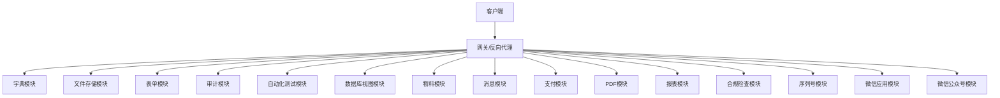
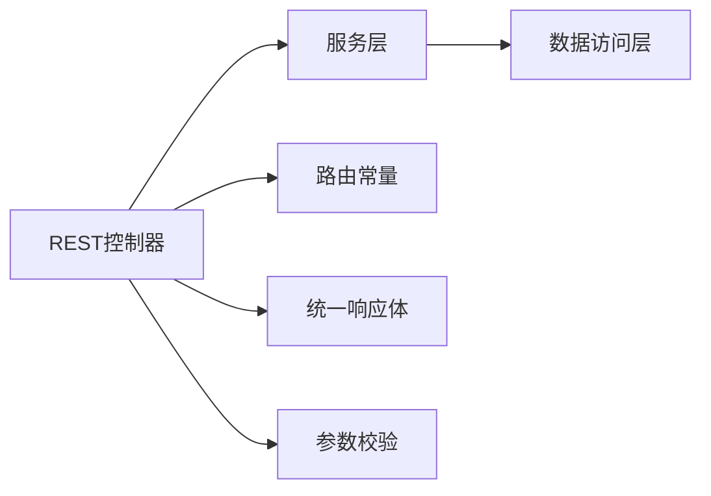

# API接口文档

<cite>
**本文引用的文件**
- [Route.java](file://micro-dict/src/main/java/com/wkclz/micro/dict/rest/Route.java)
- [DictRest.java](file://micro-dict/src/main/java/com/wkclz/micro/dict/rest/DictRest.java)
- [Route.java](file://micro-fileos/src/main/java/com/wkclz/micro/fileos/rest/Route.java)
- [FileosUploadRest.java](file://micro-fileos/src/main/java/com/wkclz/micro/fileos/rest/FileosUploadRest.java)
- [Route.java](file://micro-form/src/main/java/com/wkclz/micro/form/rest/Route.java)
- [AuditApi.java](file://micro-audit/src/main/java/com/wkclz/micro/audit/api/AuditApi.java)
- [ChangeLogRest.java](file://micro-audit/src/main/java/com/wkclz/micro/audit/rest/ChangeLogRest.java)
- [Route.java](file://micro-audit/src/main/java/com/wkclz/micro/audit/rest/Route.java)
- [Route.java](file://micro-autotest/src/main/java/com/wkclz/auto/rest/Route.java)
- [AutoTestRest.java](file://micro-autotest/src/main/java/com/wkclz/auto/rest/AutoTestRest.java)
- [Route.java](file://micro-dbview/src/main/java/com/wkclz/micro/dbview/rest/Route.java)
- [DatasourceRest.java](file://micro-dbview/src/main/java/com/wkclz/micro/dbview/rest/DatasourceRest.java)
- [DdlRest.java](file://micro-dbview/src/main/java/com/wkclz/micro/dbview/rest/DdlRest.java)
- [MetadataRest.java](file://micro-dbview/src/main/java/com/wkclz/micro/dbview/rest/MetadataRest.java)
- [PermissionRest.java](file://micro-dbview/src/main/java/com/wkclz/micro/dbview/rest/PermissionRest.java)
- [SqlRest.java](file://micro-dbview/src/main/java/com/wkclz/micro/dbview/rest/SqlRest.java)
- [Route.java](file://micro-material/src/main/java/com/wkclz/micro/material/rest/Route.java)
- [MaterialRest.java](file://micro-material/src/main/java/com/wkclz/micro/material/rest/MaterialRest.java)
- [Route.java](file://micro-msg/src/main/java/com/wkclz/micro/msg/rest/Route.java)
- [MsgApi.java](file://micro-msg/src/main/java/com/wkclz/micro/msg/api/MsgApi.java)
- [Route.java](file://micro-pay/src/main/java/com/wkclz/micro/pay/rest/Route.java)
- [Route.java](file://micro-pdf/src/main/java/com/wkclz/micro/pdf/rest/Route.java)
- [PdfApi.java](file://micro-pdf/src/main/java/com/wkclz/micro/pdf/api/PdfApi.java)
- [Route.java](file://micro-report/src/main/java/com/wkclz/micro/report/rest/Route.java)
- [Route.java](file://micro-rmcheck/src/main/java/com/wkclz/micro/rmcheck/rest/Route.java)
- [RmCheckApi.java](file://micro-rmcheck/src/main/java/com/wkclz/micro/rmcheck/api/RmCheckApi.java)
- [Route.java](file://micro-seq/src/main/java/com/wkclz/micro/seq/rest/Route.java)
- [SeqApi.java](file://micro-seq/src/main/java/com/wkclz/micro/seq/api/SeqApi.java)
- [Route.java](file://micro-wxapp/src/main/java/com/wkclz/micro/wxapp/Route.java)
- [Route.java](file://micro-wxmp/src/main/java/com/wkclz/micro/wxmp/rest/Route.java)
</cite>

## 目录
1. [简介](#简介)
2. [项目结构](#项目结构)
3. [核心组件](#核心组件)
4. [架构总览](#架构总览)
5. [详细组件分析](#详细组件分析)
6. [依赖关系分析](#依赖关系分析)
7. [性能考虑](#性能考虑)
8. [故障排查指南](#故障排查指南)
9. [结论](#结论)
10. [附录](#附录)

## 简介
本文件为 sh-microapp 微服务框架的统一API接口文档，覆盖各子模块的REST接口规范、统一响应格式、错误码约定、认证授权与请求头、数据验证规则、版本管理策略与兼容性、最佳实践与性能优化建议、测试与调试技巧等。文档以“模块化+接口级”的方式组织，便于开发者快速定位与集成。

## 项目结构
- 框架采用“按功能域划分”的微服务模块组织方式，每个模块独立提供REST接口与业务能力。
- 接口统一通过@RestController暴露，路由前缀由各模块的Route常量定义，便于聚合网关路由与版本管理。

```mermaid
graph TB
subgraph "字典模块"
DRoute["Route.java<br/>定义字典路由前缀与路径"]
DRest["DictRest.java<br/>字典类型管理接口"]
end
subgraph "文件存储模块"
FRoute["Route.java<br/>定义文件OS路由前缀与路径"]
FURest["FileosUploadRest.java<br/>上传相关接口"]
end
subgraph "表单模块"
FRt["Route.java<br/>定义表单路由前缀与路径"]
end
subgraph "审计模块"
ARt["Route.java<br/>定义审计路由前缀与路径"]
ACLog["ChangeLogRest.java<br/>变更日志接口"]
end
subgraph "自动化测试模块"
ATRoute["Route.java<br/>定义自动化测试路由前缀与路径"]
ATRest["AutoTestRest.java<br/>接口扫描/执行/报告接口"]
end
subgraph "数据库视图模块"
DBRoute["Route.java<br/>定义dbview路由前缀与路径"]
DSRest["DatasourceRest.java<br/>数据源接口"]
DDLRest["DdlRest.java<br/>DDL接口"]
MetaRest["MetadataRest.java<br/>元数据接口"]
PermRest["PermissionRest.java<br/>权限接口"]
SQLRest["SqlRest.java<br/>SQL执行接口"]
end
subgraph "物料模块"
MRt["Route.java<br/>定义物料路由前缀与路径"]
end
subgraph "消息模块"
MSGRoute["Route.java<br/>定义消息路由前缀与路径"]
MSGApi["MsgApi.java<br/>消息能力接口"]
end
subgraph "支付模块"
PRt["Route.java<br/>定义支付路由前缀与路径"]
end
subgraph "PDF模块"
PDFRoute["Route.java<br/>定义PDF路由前缀与路径"]
PDFApi["PdfApi.java<br/>PDF能力接口"]
end
subgraph "报表模块"
RRt["Route.java<br/>定义报表路由前缀与路径"]
end
subgraph "合规检查模块"
RMRt["Route.java<br/>定义合规检查路由前缀与路径"]
RMApi["RmCheckApi.java<br/>合规检查能力接口"]
end
subgraph "序列号模块"
SRt["Route.java<br/>定义序列号路由前缀与路径"]
SApi["SeqApi.java<br/>序列号能力接口"]
end
subgraph "微信应用模块"
WXARt["Route.java<br/>定义微信应用路由前缀与路径"]
end
subgraph "微信公众号模块"
WXMPRt["Route.java<br/>定义微信公众号路由前缀与路径"]
end
DRoute --> DRest
FRoute --> FURest
ARt --> ACLog
ATRoute --> ATRest
DBRoute --> DSRest
DBRoute --> DDLRest
DBRoute --> MetaRest
DBRoute --> PermRest
DBRoute --> SQLRest
MRt --> MRt
MSGRoute --> MSGApi
PRt --> PRt
PDFRoute --> PDFApi
RRt --> RRt
RMRt --> RMApi
SRt --> SApi
WXARt --> WXARt
WXMPRt --> WXMPRt
```

- 统一响应体采用R<T>包装，错误码与消息由框架层统一处理，便于前端与客户端一致化消费。

图表来源
- [Route.java:14-49](file://micro-dict/src/main/java/com/wkclz/micro/dict/rest/Route.java#L14-L49)
- [DictRest.java:31-128](file://micro-dict/src/main/java/com/wkclz/micro/dict/rest/DictRest.java#L31-L128)
- [Route.java:7-72](file://micro-fileos/src/main/java/com/wkclz/micro/fileos/rest/Route.java#L7-L72)
- [FileosUploadRest.java:20-70](file://micro-fileos/src/main/java/com/wkclz/micro/fileos/rest/FileosUploadRest.java#L20-L70)
- [Route.java:14-110](file://micro-form/src/main/java/com/wkclz/micro/form/rest/Route.java#L14-L110)
- [Route.java:1-200](file://micro-audit/src/main/java/com/wkclz/micro/audit/rest/Route.java#L1-L200)
- [ChangeLogRest.java:25-120](file://micro-audit/src/main/java/com/wkclz/micro/audit/rest/ChangeLogRest.java#L25-L120)
- [Route.java:1-200](file://micro-autotest/src/main/java/com/wkclz/auto/rest/Route.java#L1-L200)
- [AutoTestRest.java:27-120](file://micro-autotest/src/main/java/com/wkclz/auto/rest/AutoTestRest.java#L27-L120)
- [Route.java:1-200](file://micro-dbview/src/main/java/com/wkclz/micro/dbview/rest/Route.java#L1-L200)
- [DatasourceRest.java:22-120](file://micro-dbview/src/main/java/com/wkclz/micro/dbview/rest/DatasourceRest.java#L22-L120)
- [DdlRest.java:19-60](file://micro-dbview/src/main/java/com/wkclz/micro/dbview/rest/DdlRest.java#L19-L60)
- [MetadataRest.java:1-200](file://micro-dbview/src/main/java/com/wkclz/micro/dbview/rest/MetadataRest.java#L1-L200)
- [PermissionRest.java:1-200](file://micro-dbview/src/main/java/com/wkclz/micro/dbview/rest/PermissionRest.java#L1-L200)
- [SqlRest.java:1-200](file://micro-dbview/src/main/java/com/wkclz/micro/dbview/rest/SqlRest.java#L1-L200)
- [Route.java:1-200](file://micro-material/src/main/java/com/wkclz/micro/material/rest/Route.java#L1-L200)
- [Route.java:1-200](file://micro-msg/src/main/java/com/wkclz/micro/msg/rest/Route.java#L1-L200)
- [MsgApi.java:1-200](file://micro-msg/src/main/java/com/wkclz/micro/msg/api/MsgApi.java#L1-L200)
- [Route.java:1-200](file://micro-pay/src/main/java/com/wkclz/micro/pay/rest/Route.java#L1-L200)
- [Route.java:1-200](file://micro-pdf/src/main/java/com/wkclz/micro/pdf/rest/Route.java#L1-L200)
- [PdfApi.java:1-200](file://micro-pdf/src/main/java/com/wkclz/micro/pdf/api/PdfApi.java#L1-L200)
- [Route.java:1-200](file://micro-report/src/main/java/com/wkclz/micro/report/rest/Route.java#L1-L200)
- [Route.java:1-200](file://micro-rmcheck/src/main/java/com/wkclz/micro/rmcheck/rest/Route.java#L1-L200)
- [RmCheckApi.java:1-200](file://micro-rmcheck/src/main/java/com/wkclz/micro/rmcheck/api/RmCheckApi.java#L1-L200)
- [Route.java:1-200](file://micro-seq/src/main/java/com/wkclz/micro/seq/rest/Route.java#L1-L200)
- [SeqApi.java:1-200](file://micro-seq/src/main/java/com/wkclz/micro/seq/api/SeqApi.java#L1-L200)
- [Route.java:1-200](file://micro-wxapp/src/main/java/com/wkclz/micro/wxapp/Route.java#L1-L200)
- [Route.java:1-200](file://micro-wxmp/src/main/java/com/wkclz/micro/wxmp/rest/Route.java#L1-L200)

章节来源
- [Route.java:14-49](file://micro-dict/src/main/java/com/wkclz/micro/dict/rest/Route.java#L14-L49)
- [Route.java:7-72](file://micro-fileos/src/main/java/com/wkclz/micro/fileos/rest/Route.java#L7-L72)
- [Route.java:14-110](file://micro-form/src/main/java/com/wkclz/micro/form/rest/Route.java#L14-L110)

## 核心组件
- 统一响应体：R<T>，包含状态码、消息与数据载体；错误时仅返回错误码与提示信息。
- 路由前缀：各模块在Route中定义统一前缀（如/micro-dict、/micro-fileos），便于网关聚合与版本控制。
- 参数校验：接口普遍使用@Valid/@Validated进行参数校验，结合Swagger注解提供接口描述。
- 认证授权：框架层通过拦截器/切面实现统一鉴权，接口需携带必要的鉴权头或令牌。

章节来源
- [DictRest.java:31-128](file://micro-dict/src/main/java/com/wkclz/micro/dict/rest/DictRest.java#L31-L128)
- [FileosUploadRest.java:20-70](file://micro-fileos/src/main/java/com/wkclz/micro/fileos/rest/FileosUploadRest.java#L20-L70)
- [Route.java:14-110](file://micro-form/src/main/java/com/wkclz/micro/form/rest/Route.java#L14-L110)

## 架构总览
- 模块化边界清晰：每个模块自包含REST控制器、路由常量、业务服务与数据访问层。
- 接口风格统一：GET/POST/PUT/DELETE语义明确，路径遵循REST风格，参数与响应结构一致。
- 版本管理：通过路由前缀区分版本（如/micro-v1/...），新版本以新前缀发布，旧版本保持兼容。

图表来源
- [Route.java:14-49](file://micro-dict/src/main/java/com/wkclz/micro/dict/rest/Route.java#L14-L49)
- [Route.java:7-72](file://micro-fileos/src/main/java/com/wkclz/micro/fileos/rest/Route.java#L7-L72)
- [Route.java:14-110](file://micro-form/src/main/java/com/wkclz/micro/form/rest/Route.java#L14-L110)
- [Route.java:1-200](file://micro-audit/src/main/java/com/wkclz/micro/audit/rest/Route.java#L1-L200)
- [Route.java:1-200](file://micro-autotest/src/main/java/com/wkclz/auto/rest/Route.java#L1-L200)
- [Route.java:1-200](file://micro-dbview/src/main/java/com/wkclz/micro/dbview/rest/Route.java#L1-L200)
- [Route.java:1-200](file://micro-material/src/main/java/com/wkclz/micro/material/rest/Route.java#L1-L200)
- [Route.java:1-200](file://micro-msg/src/main/java/com/wkclz/micro/msg/rest/Route.java#L1-L200)
- [Route.java:1-200](file://micro-pay/src/main/java/com/wkclz/micro/pay/rest/Route.java#L1-L200)
- [Route.java:1-200](file://micro-pdf/src/main/java/com/wkclz/micro/pdf/rest/Route.java#L1-L200)
- [Route.java:1-200](file://micro-report/src/main/java/com/wkclz/micro/report/rest/Route.java#L1-L200)
- [Route.java:1-200](file://micro-rmcheck/src/main/java/com/wkclz/micro/rmcheck/rest/Route.java#L1-L200)
- [Route.java:1-200](file://micro-seq/src/main/java/com/wkclz/micro/seq/rest/Route.java#L1-L200)
- [Route.java:1-200](file://micro-wxapp/src/main/java/com/wkclz/micro/wxapp/Route.java#L1-L200)
- [Route.java:1-200](file://micro-wxmp/src/main/java/com/wkclz/micro/wxmp/rest/Route.java#L1-L200)

## 详细组件分析

### 字典模块（/micro-dict）
- 路由前缀：/micro-dict
- 主要接口
  - GET /micro-dict/dict/page：分页查询字典类型
  - GET /micro-dict/dict/info：按ID查询字典类型详情
  - POST /micro-dict/dict/create：新增字典类型
  - POST /micro-dict/dict/update：修改字典类型
  - POST /micro-dict/dict/remove：删除字典类型
  - GET /micro-dict/dict/copy：复制字典为JSON
  - POST /micro-dict/dict/paste：粘贴导入字典数据
  - GET /micro-dict/dict/options：获取字典类型选项列表
  - GET /micro-dict/dict/item/list：获取字典内容列表（不分页）
  - POST /micro-dict/dict/item/save：保存字典内容
  - GET /micro-dict/common/dict/list：获取单个字典内容列表（不分页）
  - GET /micro-dict/common/dicts/list：获取多个字典内容列表（不分页）

- 请求参数与响应
  - 分页查询：支持按字典名称、编码等条件分页
  - 新增/修改：传入字典基本信息，返回字典实体
  - 复制/粘贴：复制为JSON结构，粘贴导入
  - 选项列表：返回字典类型下拉选项
  - 公共字典：支持单字典或多字典组合查询

- 使用场景
  - 后台管理系统中的数据字典维护
  - 前端动态表单/下拉选择的数据源

章节来源
- [Route.java:14-49](file://micro-dict/src/main/java/com/wkclz/micro/dict/rest/Route.java#L14-L49)
- [DictRest.java:31-128](file://micro-dict/src/main/java/com/wkclz/micro/dict/rest/DictRest.java#L31-L128)

### 文件存储模块（/micro-fileos）
- 路由前缀：/micro-fileos
- 主要接口
  - 上传
    - POST /micro-fileos/upload/simple：简单上传（私有）
    - POST /micro-fileos/upload/simple/public：简单上传（公开）
    - POST /micro-fileos/upload/multipart/init：分片上传初始化
    - POST /micro-fileos/upload/multipart/complete：分片上传完成
    - POST /micro-fileos/upload/multipart/abort：分片上传中止
  - 预签名
    - POST /micro-fileos/presign/upload：预签名简单上传
    - POST /micro-fileos/presign/upload/batch：预签名批量简单上传
    - POST /micro-fileos/presign/multipart/init：预签名分片上传初始化
    - POST /micro-fileos/presign/multipart/complete：预签名分片上传完成
    - POST /micro-fileos/presign/multipart/abort：预签名分片上传中止
    - POST /micro-fileos/presign/complete：预签名完成确认
    - POST /micro-fileos/presign/complete/batch：预签名批量完成确认
  - 签名
    - GET /micro-fileos/sign/url：单文件签名URL
    - GET /micro-fileos/sign/urls：多文件签名URL
  - 记录
    - GET /micro-fileos/record/page：文件记录分页
    - GET /micro-fileos/record/info：文件记录详情
    - POST /micro-fileos/record/remove：删除文件记录
  - Bucket与目录
    - Bucket：分页、详情、创建、修改、删除、选项
    - 目录：列表、树、详情

- 请求参数与响应
  - 简单上传：multipart/form-data，包含文件与元数据
  - 分片上传：初始化返回uploadId，完成后提交完成请求
  - 预签名：返回带有效期的上传/完成链接
  - 签名：返回带有效期的下载链接
  - 记录：返回文件元信息与状态

- 使用场景
  - 大文件/断点续传上传
  - 前端直传OSS/对象存储
  - 生成带有效期的下载链接

章节来源
- [Route.java:7-72](file://micro-fileos/src/main/java/com/wkclz/micro/fileos/rest/Route.java#L7-L72)
- [FileosUploadRest.java:20-70](file://micro-fileos/src/main/java/com/wkclz/micro/fileos/rest/FileosUploadRest.java#L20-L70)

### 表单模块（/micro-form）
- 路由前缀：/micro-form
- 主要接口
  - 表单管理
    - GET /micro-form/form/page：分页查询
    - GET /micro-form/form/info：详情
    - POST /micro-form/form/create：创建
    - POST /micro-form/form/update：修改
    - POST /micro-form/form/remove：删除
    - GET /micro-form/form/db/columns：获取数据库字段映射
  - 客户端接入
    - GET /micro-form/common/form/list：生成下拉选项
    - GET /micro-form/common/form/detail：构造输入表单
  - 表单校验规则
    - GET /micro-form/common/form/rule：验证规则
    - 分页/详情/新增/更新/移除规则
    - 字段与验证器关联与保存

- 使用场景
  - 动态表单生成与渲染
  - 表单字段与校验规则的集中管理

章节来源
- [Route.java:14-110](file://micro-form/src/main/java/com/wkclz/micro/form/rest/Route.java#L14-L110)

### 审计模块（/micro-audit）
- 路由前缀：/micro-audit
- 主要接口
  - 变更日志
    - GET /micro-audit/change-log/page：分页查询
    - GET /micro-audit/change-log/info：详情

- 使用场景
  - 追踪业务数据变更历史
  - 合规审计与回溯

章节来源
- [Route.java:1-200](file://micro-audit/src/main/java/com/wkclz/micro/audit/rest/Route.java#L1-L200)
- [ChangeLogRest.java:25-120](file://micro-audit/src/main/java/com/wkclz/micro/audit/rest/ChangeLogRest.java#L25-L120)

### 自动化测试模块（/micro-autotest）
- 路由前缀：/micro-autotest
- 主要接口
  - 扫描与执行
    - GET /micro-autotest/api/list：扫描接口列表
    - POST /micro-autotest/run：执行测试
  - 报告
    - GET /micro-autotest/report：测试报告
    - GET /micro-autotest/report.md：Markdown报告
    - GET /micro-autotest/report.html：HTML报告

- 使用场景
  - 自动化接口回归测试
  - 测试报告生成与归档

章节来源
- [Route.java:1-200](file://micro-autotest/src/main/java/com/wkclz/auto/rest/Route.java#L1-L200)
- [AutoTestRest.java:27-120](file://micro-autotest/src/main/java/com/wkclz/auto/rest/AutoTestRest.java#L27-L120)

### 数据库视图模块（/micro-dbview）
- 路由前缀：/micro-dbview
- 主要接口
  - 数据源
    - GET /micro-dbview/datasource/page：分页
    - GET /micro-dbview/datasource/info：详情
    - POST /micro-dbview/datasource/create：创建
    - POST /micro-dbview/datasource/update：修改
    - POST /micro-dbview/datasource/remove：删除
    - GET /micro-dbview/datasource/options：选项
    - POST /micro-dbview/datasource/test-connection：测试连接
  - DDL
    - POST /micro-dbview/ddl/add-column：新增列
    - POST /micro-dbview/ddl/drop-column：删除列
    - POST /micro-dbview/ddl/modify-column：修改列
  - 元数据
    - GET /micro-dbview/metadata/table-list：表列表
    - GET /micro-dbview/metadata/column-info：列信息
  - 权限
    - GET /micro-dbview/permission/user-options：用户选项
    - POST /micro-dbview/permission/grant：授权
  - SQL
    - POST /micro-dbview/sql/execute：执行SQL
    - GET /micro-dbview/sql/history：SQL历史

- 使用场景
  - 低代码/可视化数据库管理
  - 快速DDL变更与权限治理

章节来源
- [Route.java:1-200](file://micro-dbview/src/main/java/com/wkclz/micro/dbview/rest/Route.java#L1-L200)
- [DatasourceRest.java:22-120](file://micro-dbview/src/main/java/com/wkclz/micro/dbview/rest/DatasourceRest.java#L22-L120)
- [DdlRest.java:19-60](file://micro-dbview/src/main/java/com/wkclz/micro/dbview/rest/DdlRest.java#L19-L60)
- [MetadataRest.java:1-200](file://micro-dbview/src/main/java/com/wkclz/micro/dbview/rest/MetadataRest.java#L1-L200)
- [PermissionRest.java:1-200](file://micro-dbview/src/main/java/com/wkclz/micro/dbview/rest/PermissionRest.java#L1-L200)
- [SqlRest.java:1-200](file://micro-dbview/src/main/java/com/wkclz/micro/dbview/rest/SqlRest.java#L1-L200)

### 物料模块（/micro-material）
- 路由前缀：/micro-material
- 主要接口
  - 物料管理：分页、详情、创建、修改、删除
  - 物料分组：分组树、分组管理
  - 物料引用：引用关系维护
  - 物料统计：统计信息查询
  - 物料转移：转移记录与流程
  - 物料版本：版本管理与对比

- 使用场景
  - 物料主数据管理
  - 物料版本与变更追踪

章节来源
- [Route.java:1-200](file://micro-material/src/main/java/com/wkclz/micro/material/rest/Route.java#L1-L200)

### 消息模块（/micro-msg）
- 路由前缀：/micro-msg
- 主要接口
  - 模板管理：分页、详情、创建、修改、删除
  - 通知管理：分页、详情、发送
  - 用户设置：个人设置查询与更新
  - 用户记录：个人消息记录分页

- 使用场景
  - 站内信/通知中心
  - 模板化消息推送

章节来源
- [Route.java:1-200](file://micro-msg/src/main/java/com/wkclz/micro/msg/rest/Route.java#L1-L200)
- [MsgApi.java:1-200](file://micro-msg/src/main/java/com/wkclz/micro/msg/api/MsgApi.java#L1-L200)

### 支付模块（/micro-pay）
- 路由前缀：/micro-pay
- 主要接口
  - 支付订单：创建、查询、回调处理
  - 支付配置：支付宝/微信配置管理
  - 商户订单：对客订单管理与查询

- 使用场景
  - 在线支付对接
  - 支付结果异步通知处理

章节来源
- [Route.java:1-200](file://micro-pay/src/main/java/com/wkclz/micro/pay/rest/Route.java#L1-L200)

### PDF模块（/micro-pdf）
- 路由前缀：/micro-pdf
- 主要接口
  - PDF模板：模板管理与查询
  - PDF生成：基于模板生成PDF

- 使用场景
  - 报表/凭证PDF生成
  - 模板化文档输出

章节来源
- [Route.java:1-200](file://micro-pdf/src/main/java/com/wkclz/micro/pdf/rest/Route.java#L1-L200)
- [PdfApi.java:1-200](file://micro-pdf/src/main/java/com/wkclz/micro/pdf/api/PdfApi.java#L1-L200)

### 报表模块（/micro-report）
- 路由前缀：/micro-report
- 主要接口
  - 报表定义：分页、详情、创建、修改、删除
  - 报表参数：参数定义与管理
  - 报表结果：结果集管理
  - 报表执行：执行与导出

- 使用场景
  - 可视化报表平台
  - 导出与结果缓存

章节来源
- [Route.java:1-200](file://micro-report/src/main/java/com/wkclz/micro/report/rest/Route.java#L1-L200)

### 合规检查模块（/micro-rmcheck）
- 路由前缀：/micro-rmcheck
- 主要接口
  - 合规规则：规则定义与管理
  - 规则项：规则项维护
  - 检查执行：触发检查与结果

- 使用场景
  - 删除/变更前的合规校验
  - 自动化合规检查流水线

章节来源
- [Route.java:1-200](file://micro-rmcheck/src/main/java/com/wkclz/micro/rmcheck/rest/Route.java#L1-L200)
- [RmCheckApi.java:1-200](file://micro-rmcheck/src/main/java/com/wkclz/micro/rmcheck/api/RmCheckApi.java#L1-L200)

### 序列号模块（/micro-seq）
- 路由前缀：/micro-seq
- 主要接口
  - 序列号：生成与管理

- 使用场景
  - 单据编号/流水号生成
  - 全局唯一序号

章节来源
- [Route.java:1-200](file://micro-seq/src/main/java/com/wkclz/micro/seq/rest/Route.java#L1-L200)
- [SeqApi.java:1-200](file://micro-seq/src/main/java/com/wkclz/micro/seq/api/SeqApi.java#L1-L200)

### 微信应用模块（/micro-wxapp）
- 路由前缀：/micro-wxapp
- 主要接口
  - 微信应用相关能力（具体接口由模块内部定义）

- 使用场景
  - 小程序后端能力封装

章节来源
- [Route.java:1-200](file://micro-wxapp/src/main/java/com/wkclz/micro/wxapp/Route.java#L1-L200)

### 微信公众号模块（/micro-wxmp）
- 路由前缀：/micro-wxmp
- 主要接口
  - 微信公众号相关能力（具体接口由模块内部定义）

- 使用场景
  - 公众号消息与事件处理

章节来源
- [Route.java:1-200](file://micro-wxmp/src/main/java/com/wkclz/micro/wxmp/rest/Route.java#L1-L200)

## 依赖关系分析
- 控制器依赖服务层：各REST控制器通过@Autowired注入对应服务类，实现业务逻辑解耦。
- 路由常量统一：模块内所有接口均通过Route常量拼接URL，避免硬编码。
- 统一响应与校验：R<T>与@Valid/@Validated贯穿所有接口，确保一致性与健壮性。

图表来源
- [DictRest.java:31-128](file://micro-dict/src/main/java/com/wkclz/micro/dict/rest/DictRest.java#L31-L128)
- [FileosUploadRest.java:20-70](file://micro-fileos/src/main/java/com/wkclz/micro/fileos/rest/FileosUploadRest.java#L20-L70)
- [Route.java:14-110](file://micro-form/src/main/java/com/wkclz/micro/form/rest/Route.java#L14-L110)

## 性能考虑
- 分页查询：优先使用分页接口，避免一次性加载大量数据。
- 预签名直传：大文件推荐使用预签名直传，降低服务端压力。
- 缓存策略：对高频只读数据（如字典、公共选项）启用缓存。
- 并发控制：上传/下载接口应限制并发与单文件大小，防止资源耗尽。
- 异步处理：复杂任务（如报表导出、批量文件处理）采用异步队列。

## 故障排查指南
- 统一错误码
  - 成功：200
  - 参数错误：400
  - 未授权：401
  - 权限不足：403
  - 资源不存在：404
  - 服务器错误：500
- 常见问题
  - 上传失败：检查文件大小、类型与签名有效期
  - 分片异常：核对uploadId与分片顺序
  - 字典复制粘贴：确认JSON结构与字段映射
  - 数据源连接：检查凭据与网络连通性
- 调试建议
  - 开启接口日志，记录请求参数与响应摘要
  - 使用Swagger或Postman验证接口契约
  - 对高风险接口增加重试与熔断

章节来源
- [DictRest.java:31-128](file://micro-dict/src/main/java/com/wkclz/micro/dict/rest/DictRest.java#L31-L128)
- [FileosUploadRest.java:20-70](file://micro-fileos/src/main/java/com/wkclz/micro/fileos/rest/FileosUploadRest.java#L20-L70)

## 结论
本API文档系统梳理了sh-microapp框架各模块的REST接口规范，提供了统一的响应格式、错误码与版本管理策略，并给出性能优化与故障排查建议。建议在生产环境中严格遵循参数校验、鉴权与日志规范，确保系统的稳定性与可维护性。

## 附录

### 统一响应格式
- 成功响应
  - 状态码：200
  - 结构：{ "code": 200, "msg": "success", "data": {} }
- 错误响应
  - 状态码：4xx/5xx
  - 结构：{ "code": xxx, "msg": "错误信息" }

### 认证与授权
- 鉴权方式：模块内统一通过拦截器/切面实现
- 请求头：需携带必要的鉴权令牌或会话标识
- 权限控制：按用户角色与资源范围进行授权

### 请求头与参数
- Content-Type：application/json 或 multipart/form-data
- Accept：application/json
- 鉴权头：Authorization: Bearer <token>

### 版本管理与兼容性
- 版本策略：通过路由前缀区分版本（如/micro-v1/...）
- 兼容性：旧版本接口保持不变，新增功能以新前缀发布

### 最佳实践
- 使用分页接口处理大数据
- 大文件采用预签名直传
- 对外暴露接口尽量幂等
- 接口文档与契约保持同步