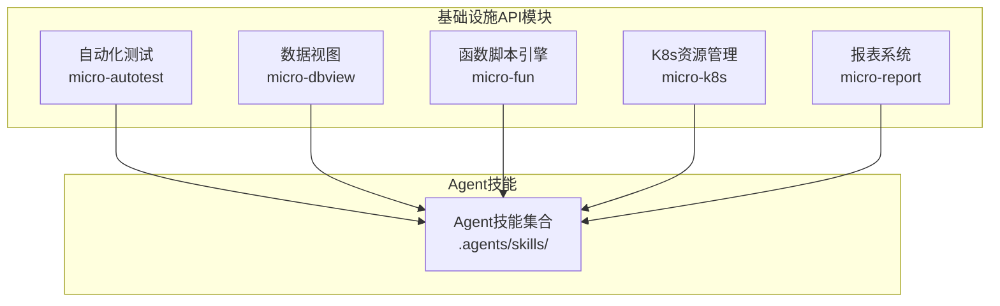
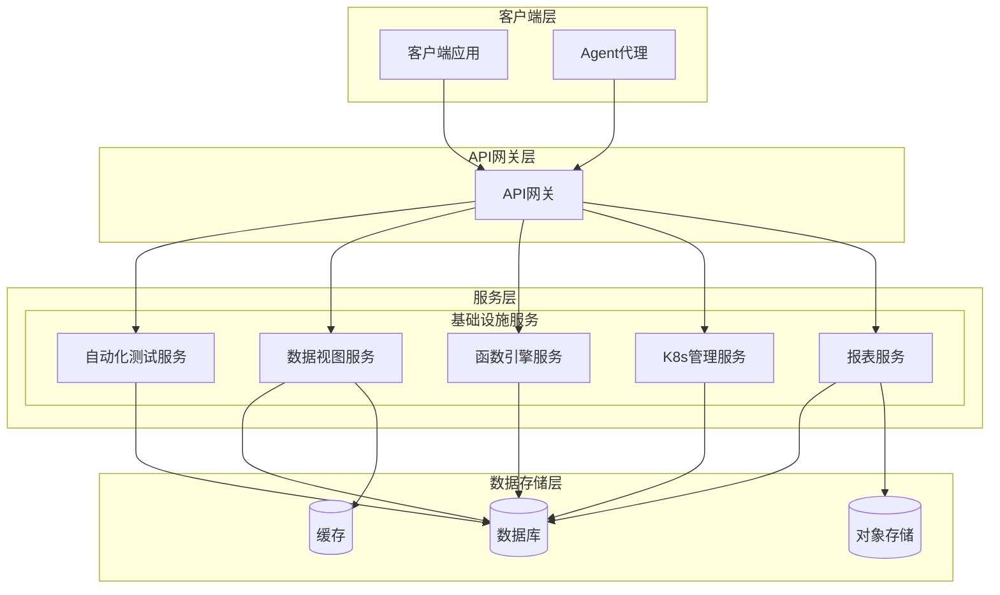
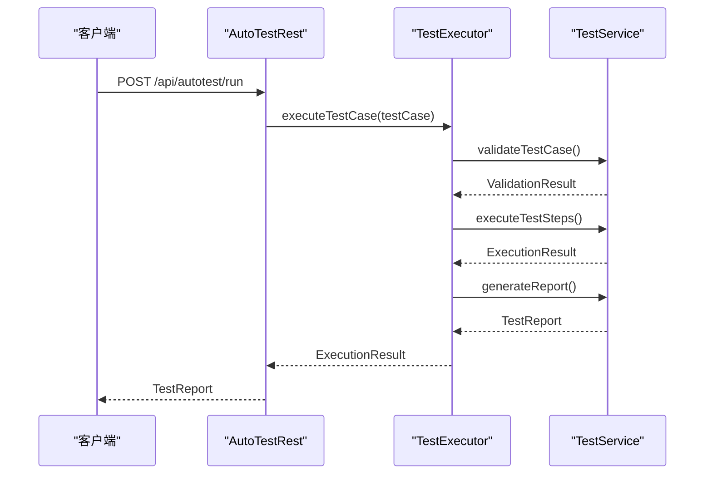
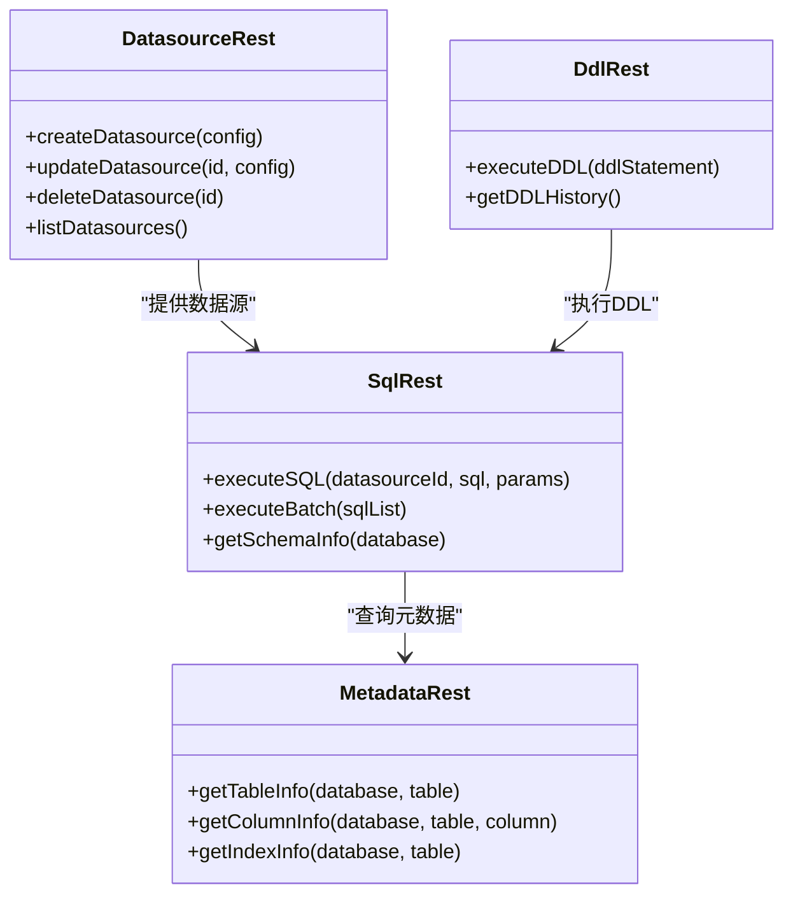
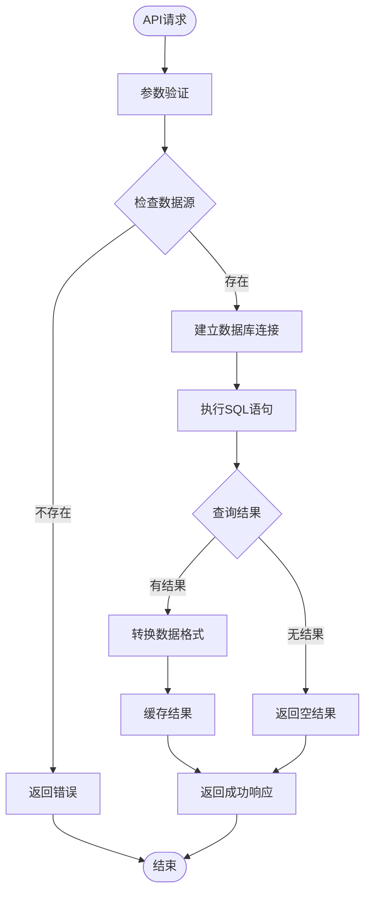
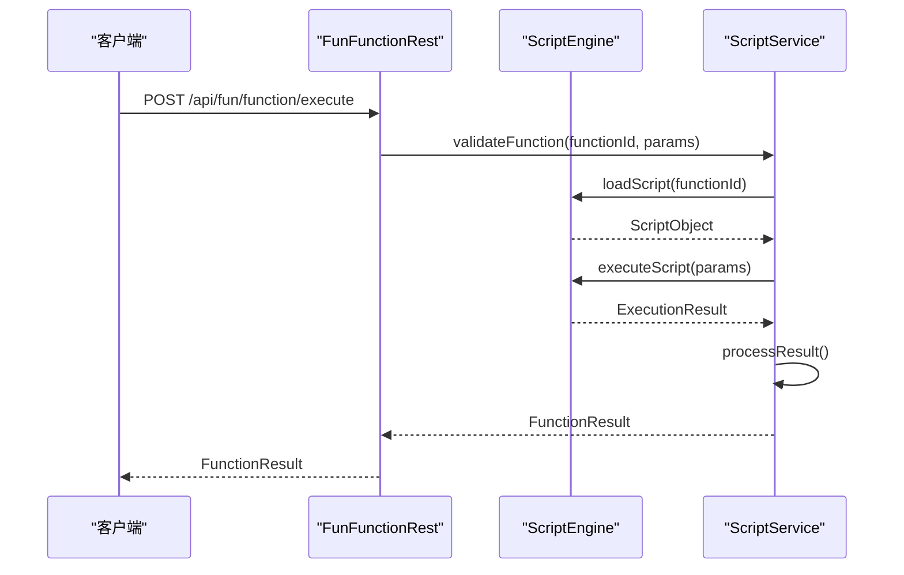
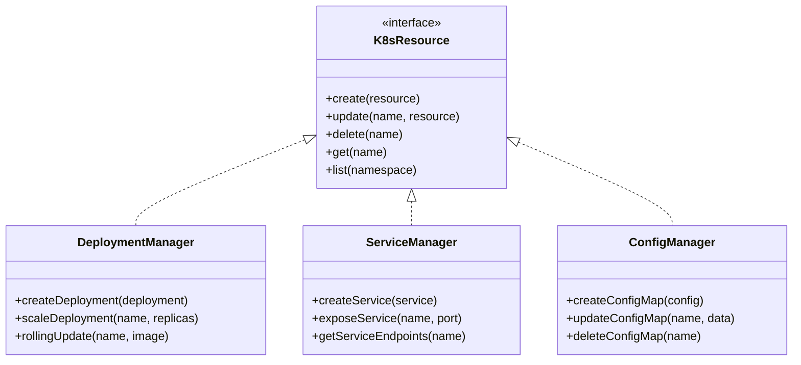
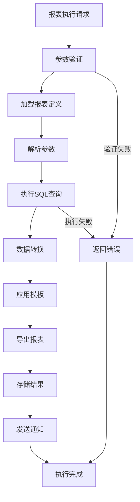
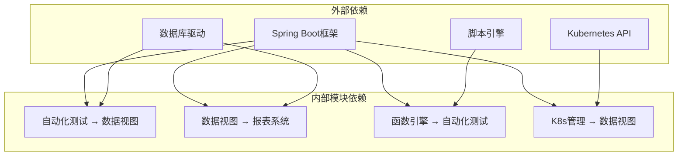

# 基础设施API

<cite>
**本文档引用的文件**
- [Route.java](file://micro-autotest/src/main/java/com/wkclz/auto/rest/Route.java)
- [AutoTestRest.java](file://micro-autotest/src/main/java/com/wkclz/auto/rest/AutoTestRest.java)
- [Route.java](file://micro-dbview/src/main/java/com/wkclz/micro/dbview/rest/Route.java)
- [DatasourceRest.java](file://micro-dbview/src/main/java/com/wkclz/micro/dbview/rest/DatasourceRest.java)
- [DdlRest.java](file://micro-dbview/src/main/java/com/wkclz/micro/dbview/rest/DdlRest.java)
- [MetadataRest.java](file://micro-dbview/src/main/java/com/wkclz/micro/dbview/rest/MetadataRest.java)
- [PermissionRest.java](file://micro-dbview/src/main/java/com/wkclz/micro/dbview/rest/PermissionRest.java)
- [SqlRest.java](file://micro-dbview/src/main/java/com/wkclz/micro/dbview/rest/SqlRest.java)
- [Route.java](file://micro-fun/src/main/java/com/wkclz/micro/fun/rest/Route.java)
- [FunFunctionRest.java](file://micro-fun/src/main/java/com/wkclz/micro/fun/rest/FunFunctionRest.java)
- [Route.java](file://micro-k8s/src/main/java/com/wkclz/micro/k8s/Route.java)
- [Route.java](file://micro-report/src/main/java/com/wkclz/micro/report/rest/Route.java)
- [ReportExecRest.java](file://micro-report/src/main/java/com/wkclz/micro/report/rest/ReportExecRest.java)
- [README.md](file://docs/living-docs-technical/api/README.md)
- [SKILL.md](file://.agents/skills/micro-autotest/SKILL.md)
- [SKILL.md](file://.agents/skills/micro-fun/SKILL.md)
- [SKILL.md](file://.agents/skills/micro-k8s/SKILL.md)
- [SKILL.md](file://.agents/skills/micro-dbview/SKILL.md)
- [SKILL.md](file://.agents/skills/micro-report/SKILL.md)
- [004-自动化测试执行.md](file://docs/stories/基础设施/004-自动化测试执行.md)
- [002-函数脚本引擎.md](file://docs/stories/基础设施/002-函数脚本引擎.md)
- [003-K8s资源管理.md](file://docs/stories/基础设施/003-K8s资源管理.md)
- [005-数据源与元数据.md](file://docs/stories/基础设施/005-数据源与元数据.md)
- [006-SQL与DDL操作.md](file://docs/stories/基础设施/006-SQL与DDL操作.md)
- [README.md](file://micro-autotest/README.md)
</cite>

## 目录
1. [简介](#简介)
2. [项目结构](#项目结构)
3. [核心组件](#核心组件)
4. [架构概览](#架构概览)
5. [详细组件分析](#详细组件分析)
6. [依赖分析](#依赖分析)
7. [性能考虑](#性能考虑)
8. [故障排除指南](#故障排除指南)
9. [结论](#结论)
10. [附录](#附录)

## 简介
本文件为基础设施相关API的全面接口文档，覆盖规则引擎、函数管理、K8s管理、自动化测试、报表系统和数据视图等核心基础设施功能。文档详细说明每个基础设施模块的API规范、配置参数和使用场景，并提供系统监控、性能调优和故障排除的API指南，解释基础设施的扩展性设计和最佳实践。

## 项目结构
基础设施API分布在多个微服务模块中，采用按功能域划分的模块化架构：
- 自动化测试模块：提供API测试、用例执行和报告生成功能
- 数据视图模块：提供数据源管理、SQL执行、DDL操作和元数据管理
- 函数脚本引擎模块：提供函数定义、分类管理和脚本执行能力
- K8s资源管理模块：提供Kubernetes集群资源的统一管理接口
- 报表系统模块：提供报表定义、参数配置和执行结果管理

**图表来源**
- [Route.java](file://micro-autotest/src/main/java/com/wkclz/auto/rest/Route.java)
- [Route.java](file://micro-dbview/src/main/java/com/wkclz/micro/dbview/rest/Route.java)
- [Route.java](file://micro-fun/src/main/java/com/wkclz/micro/fun/rest/Route.java)
- [Route.java](file://micro-k8s/src/main/java/com/wkclz/micro/k8s/Route.java)
- [Route.java](file://micro-report/src/main/java/com/wkclz/micro/report/rest/Route.java)

**章节来源**
- [README.md](file://docs/living-docs-technical/api/README.md)
- [Route.java](file://micro-autotest/src/main/java/com/wkclz/auto/rest/Route.java)
- [Route.java](file://micro-dbview/src/main/java/com/wkclz/micro/dbview/rest/Route.java)
- [Route.java](file://micro-fun/src/main/java/com/wkclz/micro/fun/rest/Route.java)
- [Route.java](file://micro-k8s/src/main/java/com/wkclz/micro/k8s/Route.java)
- [Route.java](file://micro-report/src/main/java/com/wkclz/micro/report/rest/Route.java)

## 核心组件
基础设施API由以下核心组件构成：

### 自动化测试组件
提供完整的API测试生命周期管理，包括测试用例定义、执行和报告生成。

### 数据视图组件
提供数据源连接管理、SQL执行、DDL操作和元数据查询的统一接口。

### 函数脚本引擎组件
支持多种脚本语言的函数定义、分类管理和动态执行。

### K8s资源管理组件
提供Kubernetes集群资源的CRUD操作和状态监控。

### 报表系统组件
支持报表定义、参数配置、执行调度和结果导出。

**章节来源**
- [AutoTestRest.java](file://micro-autotest/src/main/java/com/wkclz/auto/rest/AutoTestRest.java)
- [DatasourceRest.java](file://micro-dbview/src/main/java/com/wkclz/micro/dbview/rest/DatasourceRest.java)
- [FunFunctionRest.java](file://micro-fun/src/main/java/com/wkclz/micro/fun/rest/FunFunctionRest.java)
- [ReportExecRest.java](file://micro-report/src/main/java/com/wkclz/micro/report/rest/ReportExecRest.java)

## 架构概览
基础设施API采用微服务架构，每个模块独立部署和扩展：

**图表来源**
- [README.md](file://docs/living-docs-technical/api/README.md)
- [Route.java](file://micro-autotest/src/main/java/com/wkclz/auto/rest/Route.java)
- [Route.java](file://micro-dbview/src/main/java/com/wkclz/micro/dbview/rest/Route.java)
- [Route.java](file://micro-fun/src/main/java/com/wkclz/micro/fun/rest/Route.java)
- [Route.java](file://micro-k8s/src/main/java/com/wkclz/micro/k8s/Route.java)
- [Route.java](file://micro-report/src/main/java/com/wkclz/micro/report/rest/Route.java)

## 详细组件分析

### 自动化测试API
自动化测试模块提供完整的API测试解决方案，支持测试用例的定义、执行和结果分析。

#### 核心功能
- 测试用例管理：支持HTTP请求的定义、参数配置和断言设置
- 批量执行：支持多用例并发执行和顺序执行
- 结果分析：提供详细的执行报告和错误追踪
- 集成测试：支持跨服务的端到端测试

#### API规范

**图表来源**
- [AutoTestRest.java](file://micro-autotest/src/main/java/com/wkclz/auto/rest/AutoTestRest.java)
- [Route.java](file://micro-autotest/src/main/java/com/wkclz/auto/rest/Route.java)

#### 使用场景
- 接口回归测试
- 性能压力测试
- 集成环境验证
- API文档测试

**章节来源**
- [AutoTestRest.java](file://micro-autotest/src/main/java/com/wkclz/auto/rest/AutoTestRest.java)
- [Route.java](file://micro-autotest/src/main/java/com/wkclz/auto/rest/Route.java)
- [README.md](file://micro-autotest/README.md)
- [004-自动化测试执行.md](file://docs/stories/基础设施/004-自动化测试执行.md)
- [SKILL.md](file://.agents/skills/micro-autotest/SKILL.md)

### 数据视图API
数据视图模块提供统一的数据访问接口，支持多种数据源的连接管理和SQL操作。

#### 核心功能
- 数据源管理：支持MySQL、PostgreSQL等多种数据库的连接配置
- SQL执行：提供安全的SQL执行和结果集管理
- 元数据查询：支持表结构、索引和约束信息的查询
- DDL操作：支持数据定义语言的执行和版本控制

#### API架构

**图表来源**
- [DatasourceRest.java](file://micro-dbview/src/main/java/com/wkclz/micro/dbview/rest/DatasourceRest.java)
- [SqlRest.java](file://micro-dbview/src/main/java/com/wkclz/micro/dbview/rest/SqlRest.java)
- [MetadataRest.java](file://micro-dbview/src/main/java/com/wkclz/micro/dbview/rest/MetadataRest.java)
- [DdlRest.java](file://micro-dbview/src/main/java/com/wkclz/micro/dbview/rest/DdlRest.java)

#### 数据流处理

**图表来源**
- [SqlRest.java](file://micro-dbview/src/main/java/com/wkclz/micro/dbview/rest/SqlRest.java)
- [DatasourceRest.java](file://micro-dbview/src/main/java/com/wkclz/micro/dbview/rest/DatasourceRest.java)

**章节来源**
- [DatasourceRest.java](file://micro-dbview/src/main/java/com/wkclz/micro/dbview/rest/DatasourceRest.java)
- [SqlRest.java](file://micro-dbview/src/main/java/com/wkclz/micro/dbview/rest/SqlRest.java)
- [MetadataRest.java](file://micro-dbview/src/main/java/com/wkclz/micro/dbview/rest/MetadataRest.java)
- [DdlRest.java](file://micro-dbview/src/main/java/com/wkclz/micro/dbview/rest/DdlRest.java)
- [005-数据源与元数据.md](file://docs/stories/基础设施/005-数据源与元数据.md)
- [006-SQL与DDL操作.md](file://docs/stories/基础设施/006-SQL与DDL操作.md)
- [SKILL.md](file://.agents/skills/micro-dbview/SKILL.md)

### 函数脚本引擎API
函数脚本引擎模块提供灵活的函数定义和执行能力，支持多种脚本语言。

#### 核心功能
- 函数分类管理：支持函数的分类组织和权限控制
- 脚本执行：支持JavaScript、Python等多种脚本语言
- 参数传递：支持复杂参数的传递和类型转换
- 结果处理：提供统一的结果格式和错误处理

#### API设计

**图表来源**
- [FunFunctionRest.java](file://micro-fun/src/main/java/com/wkclz/micro/fun/rest/FunFunctionRest.java)
- [Route.java](file://micro-fun/src/main/java/com/wkclz/micro/fun/rest/Route.java)

#### 支持的脚本类型
- JavaScript函数
- Python脚本
- Groovy表达式
- 自定义脚本模板

**章节来源**
- [FunFunctionRest.java](file://micro-fun/src/main/java/com/wkclz/micro/fun/rest/FunFunctionRest.java)
- [Route.java](file://micro-fun/src/main/java/com/wkclz/micro/fun/rest/Route.java)
- [002-函数脚本引擎.md](file://docs/stories/基础设施/002-函数脚本引擎.md)
- [SKILL.md](file://.agents/skills/micro-fun/SKILL.md)

### K8s资源管理API
K8s资源管理模块提供对Kubernetes集群的统一管理接口。

#### 核心功能
- 资源CRUD操作：支持Deployment、Service、ConfigMap等资源的创建、更新、删除
- 集群状态监控：提供集群健康检查和资源状态查询
- 权限管理：支持RBAC权限的配置和管理
- 日志管理：提供Pod日志的查询和过滤

#### API架构

**图表来源**
- [Route.java](file://micro-k8s/src/main/java/com/wkclz/micro/k8s/Route.java)

**章节来源**
- [Route.java](file://micro-k8s/src/main/java/com/wkclz/micro/k8s/Route.java)
- [003-K8s资源管理.md](file://docs/stories/基础设施/003-K8s资源管理.md)
- [SKILL.md](file://.agents/skills/micro-k8s/SKILL.md)

### 报表系统API
报表系统模块提供完整的报表生命周期管理。

#### 核心功能
- 报表定义：支持复杂报表的定义和参数配置
- 执行调度：提供定时执行和手动触发的调度机制
- 结果管理：支持执行结果的存储和查询
- 导出功能：提供多种格式的报表导出

#### 报表执行流程

**图表来源**
- [ReportExecRest.java](file://micro-report/src/main/java/com/wkclz/micro/report/rest/ReportExecRest.java)
- [Route.java](file://micro-report/src/main/java/com/wkclz/micro/report/rest/Route.java)

**章节来源**
- [ReportExecRest.java](file://micro-report/src/main/java/com/wkclz/micro/report/rest/ReportExecRest.java)
- [Route.java](file://micro-report/src/main/java/com/wkclz/micro/report/rest/Route.java)
- [006-SQL与DDL操作.md](file://docs/stories/Infrastructure/006-SQL与DDL操作.md)
- [SKILL.md](file://.agents/skills/micro-report/SKILL.md)

## 依赖分析
基础设施API之间的依赖关系如下：

**图表来源**
- [README.md](file://docs/living-docs-technical/api/README.md)

**章节来源**
- [README.md](file://docs/living-docs-technical/api/README.md)

## 性能考虑
基础设施API在设计时充分考虑了性能优化：

### 缓存策略
- 数据源连接池：复用数据库连接，减少连接开销
- 查询结果缓存：对频繁查询的结果进行缓存
- 配置信息缓存：缓存常用配置信息，减少数据库访问

### 并发处理
- 异步执行：支持异步任务处理，提高响应速度
- 连接池管理：合理配置连接池大小，避免资源耗尽
- 超时控制：设置合理的超时时间，防止长时间阻塞

### 监控指标
- 请求延迟：监控各API的响应时间
- 错误率：跟踪API的错误发生频率
- 资源使用：监控CPU、内存和数据库连接使用情况

## 故障排除指南
常见问题及解决方案：

### 数据库连接问题
**症状**：API调用时出现连接超时或连接失败
**排查步骤**：
1. 检查数据源配置是否正确
2. 验证数据库服务状态
3. 查看连接池使用情况
4. 检查网络连通性

### 脚本执行异常
**症状**：函数执行失败或返回异常结果
**排查步骤**：
1. 检查脚本语法和逻辑
2. 验证输入参数类型
3. 查看执行日志和错误信息
4. 测试脚本在隔离环境中的执行

### K8s资源管理失败
**症状**：K8s资源创建或更新失败
**排查步骤**：
1. 检查K8s集群状态
2. 验证RBAC权限配置
3. 查看资源定义的YAML格式
4. 检查集群配额限制

### 报表执行超时
**症状**：报表执行时间过长或失败
**排查步骤**：
1. 分析SQL查询性能
2. 检查数据量大小
3. 优化查询条件和索引
4. 调整执行超时设置

**章节来源**
- [README.md](file://docs/living-docs-technical/api/README.md)

## 结论
基础设施API提供了完整的微服务基础设施能力，涵盖了从数据访问、函数执行到K8s资源管理的各个方面。通过模块化的架构设计和完善的API规范，这些组件能够满足企业级应用的各种基础设施需求。建议在实际使用中根据业务场景选择合适的模块组合，并结合监控和性能优化措施确保系统的稳定性和可靠性。

## 附录

### API版本管理
- 版本号：v1
- 兼容性：向后兼容
- 升级策略：重大变更前提供迁移指南

### 安全配置
- 认证方式：支持JWT Token认证
- 授权控制：基于角色的权限管理
- 数据加密：敏感数据传输加密
- 审计日志：完整的操作审计记录

### 部署建议
- 环境要求：JDK 8+，MySQL 5.7+
- 最小资源配置：2核CPU，4GB内存
- 扩展性：支持水平扩展和垂直扩展
- 备份策略：定期备份数据库和配置文件