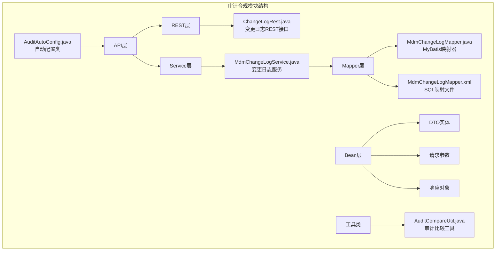
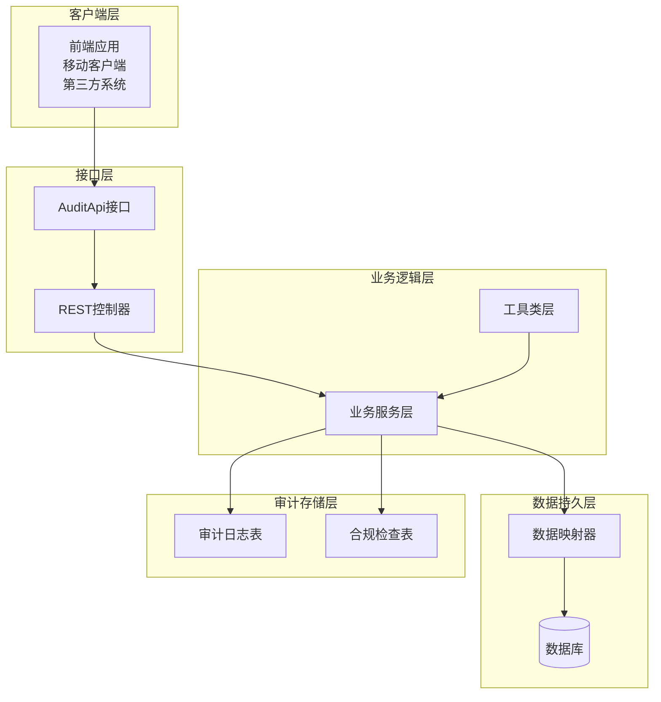
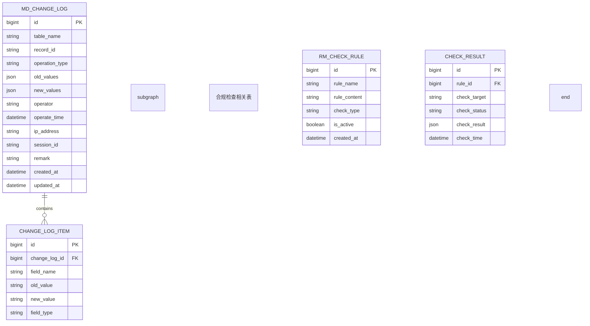
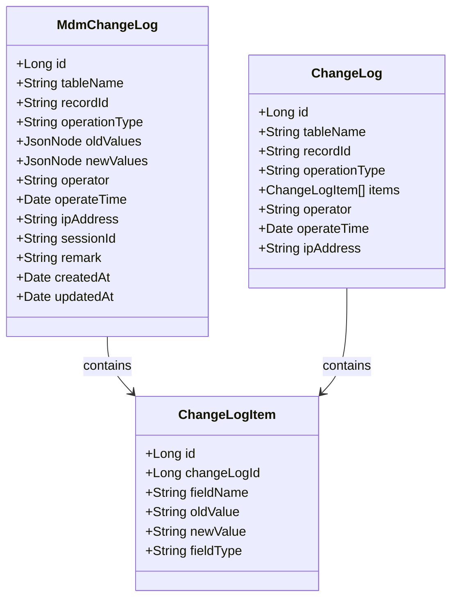
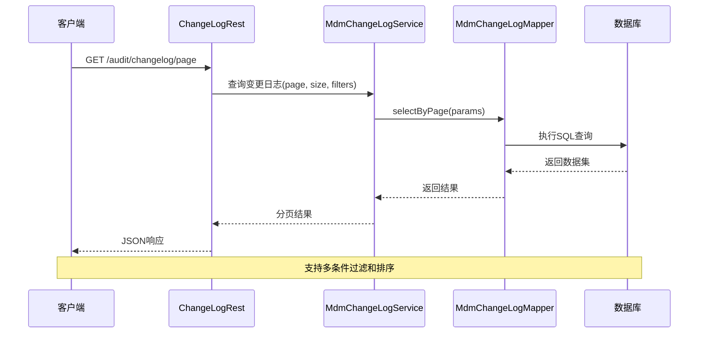
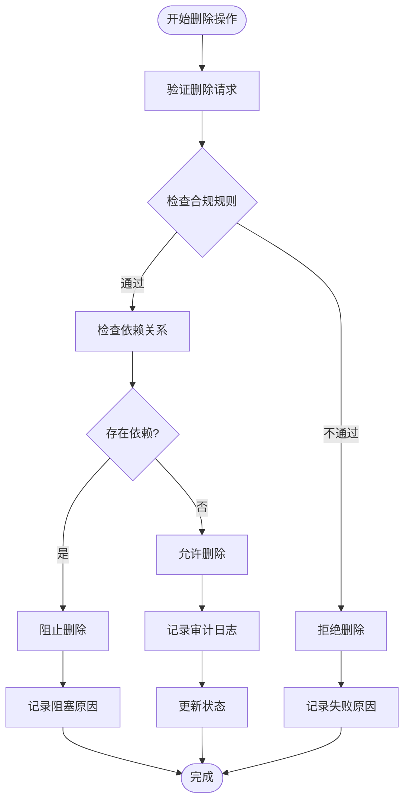
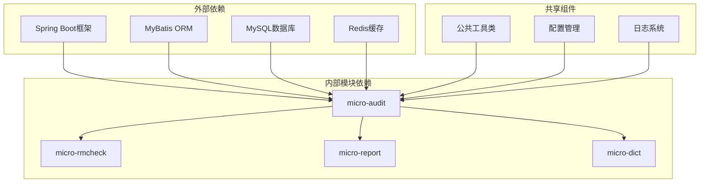
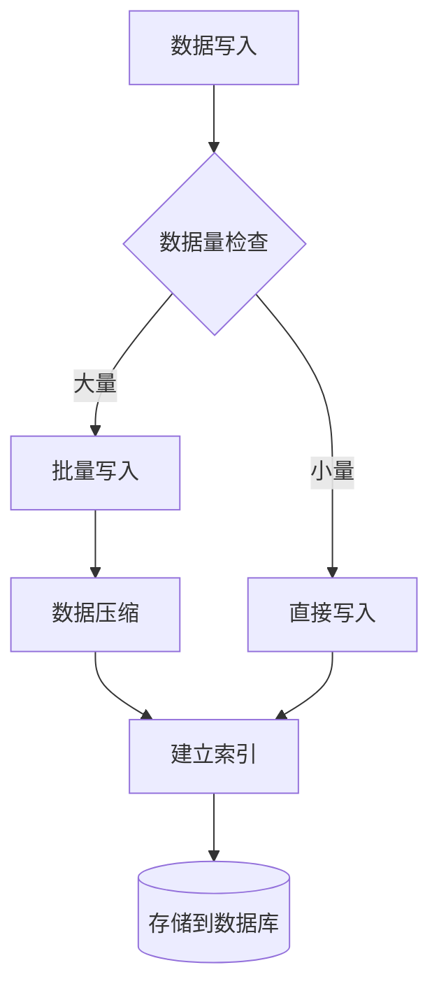

# 审计合规API

<cite>
**本文档引用的文件**
- [AuditAutoConfig.java](file://micro-audit/src/main/java/com/wkclz/micro/audit/AuditAutoConfig.java)
- [AuditApi.java](file://micro-audit/src/main/java/com/wkclz/micro/audit/api/AuditApi.java)
- [AuditImpl.java](file://micro-audit/src/main/java/com/wkclz/micro/audit/api/impl/AuditImpl.java)
- [ChangeLogRest.java](file://micro-audit/src/main/java/com/wkclz/micro/audit/rest/ChangeLogRest.java)
- [Route.java](file://micro-audit/src/main/java/com/wkclz/micro/audit/rest/Route.java)
- [MdmChangeLogService.java](file://micro-audit/src/main/java/com/wkclz/micro/audit/service/MdmChangeLogService.java)
- [MdmChangeLogMapper.java](file://micro-audit/src/main/java/com/wkclz/micro/audit/mapper/MdmChangeLogMapper.java)
- [MdmChangeLogMapper.xml](file://micro-audit/src/main/resources/mapper/MdmChangeLogMapper.xml)
- [ChangeLog.java](file://micro-audit/src/main/java/com/wkclz/micro/audit/bean/dto/ChangeLog.java)
- [ChangeLogItem.java](file://micro-audit/src/main/java/com/wkclz/micro/audit/bean/dto/ChangeLogItem.java)
- [MdmChangeLog.java](file://micro-audit/src/main/java/com/wkclz/micro/audit/bean/entity/MdmChangeLog.java)
- [ChangeLogInfoReq.java](file://micro-audit/src/main/java/com/wkclz/micro/audit/bean/req/ChangeLogInfoReq.java)
- [ChangeLogPageReq.java](file://micro-audit/src/main/java/com/wkclz/micro/audit/bean/req/ChangeLogPageReq.java)
- [ChangeLogInfoResp.java](file://micro-audit/src/main/java/com/wkclz/micro/audit/bean/resp/ChangeLogInfoResp.java)
- [ChangeLogPageResp.java](file://micro-audit/src/main/java/com/wkclz/micro/audit/bean/resp/ChangeLogPageResp.java)
- [AuditCompareUtil.java](file://micro-audit/src/main/java/com/wkclz/micro/audit/utils/AuditCompareUtil.java)
- [README.md](file://docs/living-docs-business/stories/审计校验/README.md)
- [001-变更审计日志.md](file://docs/living-docs-business/stories/审计校验/001-变更审计日志.md)
- [002-删除合规校验.md](file://docs/living-docs-business/stories/审计校验/002-删除合规校验.md)
</cite>

## 目录
1. [简介](#简介)
2. [项目结构](#项目结构)
3. [核心组件](#核心组件)
4. [架构概览](#架构概览)
5. [详细组件分析](#详细组件分析)
6. [依赖关系分析](#依赖关系分析)
7. [性能考虑](#性能考虑)
8. [故障排除指南](#故障排除指南)
9. [结论](#结论)
10. [附录](#附录)

## 简介

审计合规API是微服务架构中的重要组成部分，专门用于实现数据变更审计、删除合规检查和合规性验证功能。该系统通过自动化的审计日志收集、变更跟踪和合规性验证，确保业务系统的操作可追溯、可审计、符合监管要求。

系统采用模块化设计，包含完整的审计数据采集、变更跟踪、合规检查和报告生成功能。支持多种审计场景，包括数据变更审计、删除操作合规检查、用户行为追踪等。

## 项目结构

审计合规模块位于 `micro-audit` 目录下，采用标准的Spring Boot微服务架构：



**图表来源**
- [AuditAutoConfig.java:1-200](file://micro-audit/src/main/java/com/wkclz/micro/audit/AuditAutoConfig.java#L1-L200)
- [ChangeLogRest.java:1-200](file://micro-audit/src/main/java/com/wkclz/micro/audit/rest/ChangeLogRest.java#L1-L200)

**章节来源**
- [AuditAutoConfig.java:1-200](file://micro-audit/src/main/java/com/wkclz/micro/audit/AuditAutoConfig.java#L1-L200)
- [Route.java:1-100](file://micro-audit/src/main/java/com/wkclz/micro/audit/rest/Route.java#L1-L100)

## 核心组件

### 审计API接口层

审计API接口层提供了统一的对外服务入口，包含以下核心接口：

- **变更审计日志接口**: 记录和查询数据变更历史
- **删除合规检查接口**: 验证删除操作的合规性
- **审计数据查询接口**: 提供灵活的审计数据检索能力

### REST控制器层

REST控制器层负责HTTP请求的接收和响应处理：

- **ChangeLogRest**: 变更日志相关REST接口
- **Route**: 路由配置和URL映射

### 服务层

服务层包含核心业务逻辑处理：

- **MdmChangeLogService**: 变更日志业务服务
- **AuditServiceImpl**: 审计服务实现

### 数据访问层

数据访问层负责与数据库交互：

- **MdmChangeLogMapper**: MyBatis映射器接口
- **MdmChangeLogMapper.xml**: SQL映射配置

**章节来源**
- [AuditApi.java:1-200](file://micro-audit/src/main/java/com/wkclz/micro/audit/api/AuditApi.java#L1-L200)
- [AuditImpl.java:1-200](file://micro-audit/src/main/java/com/wkclz/micro/audit/api/impl/AuditImpl.java#L1-L200)

## 架构概览

审计合规系统采用分层架构设计，确保各层职责清晰、耦合度低：



**图表来源**
- [ChangeLogRest.java:1-200](file://micro-audit/src/main/java/com/wkclz/micro/audit/rest/ChangeLogRest.java#L1-L200)
- [MdmChangeLogService.java:1-200](file://micro-audit/src/main/java/com/wkclz/micro/audit/service/MdmChangeLogService.java#L1-L200)

### 数据模型架构



**图表来源**
- [MdmChangeLog.java:1-200](file://micro-audit/src/main/java/com/wkclz/micro/audit/bean/entity/MdmChangeLog.java#L1-L200)
- [ChangeLogItem.java:1-200](file://micro-audit/src/main/java/com/wkclz/micro/audit/bean/dto/ChangeLogItem.java#L1-L200)

## 详细组件分析

### 变更审计日志组件

变更审计日志组件是审计系统的核心功能，负责记录所有数据变更操作的历史信息。

#### 核心数据结构



**图表来源**
- [MdmChangeLog.java:1-200](file://micro-audit/src/main/java/com/wkclz/micro/audit/bean/entity/MdmChangeLog.java#L1-L200)
- [ChangeLog.java:1-200](file://micro-audit/src/main/java/com/wkclz/micro/audit/bean/dto/ChangeLog.java#L1-L200)
- [ChangeLogItem.java:1-200](file://micro-audit/src/main/java/com/wkclz/micro/audit/bean/dto/ChangeLogItem.java#L1-L200)

#### 变更日志查询流程



**图表来源**
- [ChangeLogRest.java:1-200](file://micro-audit/src/main/java/com/wkclz/micro/audit/rest/ChangeLogRest.java#L1-L200)
- [MdmChangeLogService.java:1-200](file://micro-audit/src/main/java/com/wkclz/micro/audit/service/MdmChangeLogService.java#L1-L200)

**章节来源**
- [ChangeLogRest.java:1-200](file://micro-audit/src/main/java/com/wkclz/micro/audit/rest/ChangeLogRest.java#L1-L200)
- [MdmChangeLogService.java:1-200](file://micro-audit/src/main/java/com/wkclz/micro/audit/service/MdmChangeLogService.java#L1-L200)

### 删除合规检查组件

删除合规检查组件确保所有删除操作都符合预定义的合规规则。

#### 合规检查流程



**图表来源**
- [AuditCompareUtil.java:1-200](file://micro-audit/src/main/java/com/wkclz/micro/audit/utils/AuditCompareUtil.java#L1-L200)

#### 合规检查规则配置

```mermaid
classDiagram
class RmCheckRule {
+Long id
+String ruleName
+String ruleContent
+String checkType
+Boolean isActive
+Date createdAt
}
class RmCheckRuleItem {
+Long id
+Long ruleId
+String checkField
+String checkOperator
+String checkValue
+String errorMessage
}
class CheckResult {
+Long id
+Long ruleId
+String checkTarget
+String checkStatus
+JsonNode checkResult
+Date checkTime
}
RmCheckRule ||--o{ RmCheckRuleItem : contains
RmCheckRule ||--o{ CheckResult : generates
```

**图表来源**
- [RmCheckRule.java:1-200](file://micro-rmcheck/src/main/java/com/wkclz/micro/rmcheck/bean/entity/RmCheckRule.java#L1-L200)
- [RmCheckRuleItem.java:1-200](file://micro-rmcheck/src/main/java/com/wkclz/micro/rmcheck/bean/entity/RmCheckRuleItem.java#L1-L200)

**章节来源**
- [AuditCompareUtil.java:1-200](file://micro-audit/src/main/java/com/wkclz/micro/audit/utils/AuditCompareUtil.java#L1-L200)

### 审计数据导出组件

审计数据导出组件提供多种格式的数据导出功能，满足不同场景的需求。

#### 导出格式支持

| 格式 | 描述 | 使用场景 |
|------|------|----------|
| CSV | 逗号分隔值格式 | 数据分析、报表生成 |
| Excel | Microsoft Excel格式 | 人工审阅、管理层汇报 |
| PDF | 便携文档格式 | 法律合规、监管报送 |
| JSON | 结构化数据格式 | 系统集成、API调用 |

**章节来源**
- [ChangeLogPageReq.java:1-200](file://micro-audit/src/main/java/com/wkclz/micro/audit/bean/req/ChangeLogPageReq.java#L1-L200)
- [ChangeLogInfoReq.java:1-200](file://micro-audit/src/main/java/com/wkclz/micro/audit/bean/req/ChangeLogInfoReq.java#L1-L200)

## 依赖关系分析

审计合规API模块与其他系统组件的依赖关系如下：



**图表来源**
- [pom.xml:1-200](file://micro-audit/pom.xml#L1-L200)
- [AuditAutoConfig.java:1-200](file://micro-audit/src/main/java/com/wkclz/micro/audit/AuditAutoConfig.java#L1-L200)

### 关键依赖组件

| 组件名称 | 版本 | 用途 | 依赖关系 |
|----------|------|------|----------|
| Spring Boot Starter Web | 2.x | Web服务框架 | 核心依赖 |
| MyBatis Spring Boot Starter | 2.x | 数据持久化 | 数据访问层 |
| MySQL Connector/J | 8.x | 数据库连接 | 数据库驱动 |
| PageHelper | 5.x | 分页查询 | 查询优化 |
| Jackson | 2.x | JSON序列化 | 数据传输 |

**章节来源**
- [pom.xml:1-200](file://micro-audit/pom.xml#L1-L200)

## 性能考虑

### 查询性能优化

1. **索引优化**: 为常用查询字段建立合适的数据库索引
2. **分页查询**: 默认启用分页，避免大数据量查询
3. **缓存策略**: 对热点数据进行缓存处理
4. **批量操作**: 支持批量审计数据导出

### 存储性能优化



### 内存使用优化

- **流式处理**: 大数据量导出时采用流式处理
- **分块传输**: 避免一次性加载大量数据到内存
- **连接池管理**: 合理配置数据库连接池大小

## 故障排除指南

### 常见问题及解决方案

| 问题类型 | 症状描述 | 可能原因 | 解决方案 |
|----------|----------|----------|----------|
| 审计日志缺失 | 查询不到审计记录 | 审计开关未开启 | 检查配置参数 |
| 查询性能慢 | 审计查询响应时间长 | 缺少必要索引 | 添加数据库索引 |
| 导出失败 | 审计数据导出异常 | 内存不足或权限问题 | 增加内存配置 |
| 合规检查误判 | 删除操作被错误阻止 | 规则配置不当 | 检查合规规则 |

### 错误码定义

| 错误码 | 错误类型 | 描述 | 处理建议 |
|--------|----------|------|----------|
| AUDIT_001 | 参数验证失败 | 请求参数不符合规范 | 检查请求参数格式 |
| AUDIT_002 | 权限不足 | 用户无权访问审计数据 | 检查用户权限配置 |
| AUDIT_003 | 数据库连接失败 | 数据库连接异常 | 检查数据库连接配置 |
| AUDIT_004 | 审计服务不可用 | 审计服务异常 | 重启审计服务 |

**章节来源**
- [ChangeLogRest.java:1-200](file://micro-audit/src/main/java/com/wkclz/micro/audit/rest/ChangeLogRest.java#L1-L200)

## 结论

审计合规API模块为微服务架构提供了完整的审计和合规解决方案。通过模块化的设计和清晰的分层架构，系统能够有效满足各种审计需求，包括变更审计、删除合规检查、数据导出等功能。

系统的主要优势包括：
- **全面的审计覆盖**: 支持多种操作类型的审计记录
- **灵活的查询能力**: 提供丰富的过滤和排序选项
- **强大的合规检查**: 支持自定义合规规则配置
- **高效的数据导出**: 支持多种格式的数据导出
- **良好的扩展性**: 易于添加新的审计场景和合规规则

## 附录

### API接口规范

#### 变更日志查询接口

**GET** `/audit/changelog/page`
- **分页参数**: page, size, sort, order
- **过滤参数**: tableName, recordId, operator, startTime, endTime
- **响应**: 分页的变更日志列表

**GET** `/audit/changelog/{id}`
- **路径参数**: id - 变更日志ID
- **响应**: 单个变更日志详情

#### 合规检查接口

**POST** `/audit/compliance/check`
- **请求体**: 删除操作相关信息
- **响应**: 合规检查结果和建议

**GET** `/audit/compliance/rules`
- **响应**: 当前有效的合规规则列表

### 配置参数说明

| 参数名 | 类型 | 必填 | 默认值 | 描述 |
|--------|------|------|--------|------|
| audit.enabled | Boolean | 否 | true | 是否启用审计功能 |
| audit.retention.days | Integer | 否 | 365 | 审计数据保留天数 |
| audit.export.max.rows | Integer | 否 | 100000 | 导出最大行数限制 |
| compliance.check.enabled | Boolean | 否 | true | 是否启用合规检查 |

### 最佳实践建议

1. **定期清理过期数据**: 按照配置的保留策略定期清理过期审计数据
2. **监控系统性能**: 定期监控审计系统的性能指标
3. **备份重要数据**: 对重要的审计数据进行定期备份
4. **权限控制**: 严格控制审计数据的访问权限
5. **合规审查**: 定期审查合规规则的有效性和准确性