# 微信生态API

<cite>
**本文引用的文件**
- [MicroAppAutoConfig.java](file://micro-wxapp/src/main/java/com/wkclz/micro/wxapp/MicroAppAutoConfig.java)
- [Route.java](file://micro-wxapp/src/main/java/com/wkclz/micro/wxapp/Route.java)
- [WxMaConfiguration.java](file://micro-wxapp/src/main/java/com/wkclz/micro/wxapp/config/WxMaConfiguration.java)
- [WxAppRest.java](file://micro-wxapp/src/main/java/com/wkclz/micro/wxapp/rest/WxAppRest.java)
- [WxMaMediaRest.java](file://micro-wxapp/src/main/java/com/wkclz/micro/wxapp/rest/WxMaMediaRest.java)
- [WxMaUserRest.java](file://micro-wxapp/src/main/java/com/wkclz/micro/wxapp/rest/WxMaUserRest.java)
- [WxappConfigRest.java](file://micro-wxapp/src/main/java/com/wkclz/micro/wxapp/rest/WxappConfigRest.java)
- [WxMiniappService.java](file://micro-wxapp/src/main/java/com/wkclz/micro/wxapp/service/custom/WxMiniappService.java)
- [WxappLoginService.java](file://micro-wxapp/src/main/java/com/wkclz/micro/wxapp/service/custom/WxappLoginService.java)
- [WxMaLoginReq.java](file://micro-wxapp/src/main/java/com/wkclz/micro/wxapp/bean/req/WxMaLoginReq.java)
- [WxMaLoginResp.java](file://micro-wxapp/src/main/java/com/wkclz/micro/wxapp/bean/resp/WxMaLoginResp.java)
- [WxMaUserInfoUpdateReq.java](file://micro-wxapp/src/main/java/com/wkclz/micro/wxapp/bean/req/WxMaUserInfoUpdateReq.java)
- [WxMaUserInfoResp.java](file://micro-wxapp/src/main/java/com/wkclz/micro/wxapp/bean/resp/WxMaUserInfoResp.java)
- [WxMaPhoneReq.java](file://micro-wxapp/src/main/java/com/wkclz/micro/wxapp/bean/req/WxMaPhoneReq.java)
- [WxMaMobileBindReq.java](file://micro-wxapp/src/main/java/com/wkclz/micro/wxapp/bean/req/WxMaMobileBindReq.java)
- [WxappConfigCreateReq.java](file://micro-wxapp/src/main/java/com/wkclz/micro/wxapp/bean/req/WxappConfigCreateReq.java)
- [WxappConfigUpdateReq.java](file://micro-wxapp/src/main/java/com/wkclz/micro/wxapp/bean/req/WxappConfigUpdateReq.java)
- [WxappConfigInfoReq.java](file://micro-wxapp/src/main/java/com/wkclz/micro/wxapp/bean/req/WxappConfigInfoReq.java)
- [WxappConfigPageReq.java](file://micro-wxapp/src/main/java/com/wkclz/micro/wxapp/bean/req/WxappConfigPageReq.java)
- [WxappConfigRemoveReq.java](file://micro-wxapp/src/main/java/com/wkclz/micro/wxapp/bean/req/WxappConfigRemoveReq.java)
- [WxappConfigEntity.java](file://micro-wxapp/src/main/java/com/wkclz/micro/wxapp/bean/entity/WxappConfig.java)
- [WxappUserEntity.java](file://micro-wxapp/src/main/java/com/wkclz/micro/wxapp/bean/entity/WxappUser.java)
- [WxappLoginLogEntity.java](file://micro-wxapp/src/main/java/com/wkclz/micro/wxapp/bean/entity/WxappLoginLog.java)
- [WxMaAppInfo.java](file://micro-wxapp/src/main/java/com/wkclz/micro/wxapp/bean/vo/WxMaAppInfo.java)
- [WxMaLoginFieldsValid.java](file://micro-wxapp/src/main/java/com/wkclz/micro/wxapp/bean/req/validation/WxMaLoginFieldsValid.java)
- [WxMaLoginFieldsValidator.java](file://micro-wxapp/src/main/java/com/wkclz/micro/wxapp/bean/req/validation/WxMaLoginFieldsValidator.java)
- [WxMaUserInfoUpdateValid.java](file://micro-wxapp/src/main/java/com/wkclz/micro/wxapp/bean/req/validation/WxMaUserInfoUpdateValid.java)
- [WxMaUserInfoUpdateValidator.java](file://micro-wxapp/src/main/java/com/wkclz/micro/wxapp/bean/req/validation/WxMaUserInfoUpdateValidator.java)
- [WxMaConfiguration.java](file://micro-wxapp/src/main/resources/META-INF/spring/org.springframework.boot.autoconfigure.AutoConfiguration.imports)
- [WxappConfigMapper.xml](file://micro-wxapp/src/main/resources/mapper/WxappConfigMapper.xml)
- [WxappUserMapper.xml](file://micro-wxapp/src/main/resources/mapper/WxappUserMapper.xml)
- [WxappLoginLogMapper.xml](file://micro-wxapp/src/main/resources/mapper/WxappLoginLogMapper.xml)
- [WxmpAutoConfig.java](file://micro-wxmp/src/main/java/com/wkclz/micro/wxmp/WxmpAutoConfig.java)
- [WxMpConfiguration.java](file://micro-wxmp/src/main/java/com/wkclz/micro/wxmp/config/WxMpConfiguration.java)
- [Route.java](file://micro-wxmp/src/main/java/com/wkclz/micro/wxmp/rest/Route.java)
- [WxMaterialRest.java](file://micro-wxmp/src/main/java/com/wkclz/micro/wxmp/rest/mp/WxMaterialRest.java)
- [WxPortalRest.java](file://micro-wxmp/src/main/java/com/wkclz/micro/wxmp/rest/mp/WxPortalRest.java)
- [WxSignRest.java](file://micro-wxmp/src/main/java/com/wkclz/micro/wxmp/rest/mp/WxSignRest.java)
- [WxUserRest.java](file://micro-wxmp/src/main/java/com/wkclz/micro/wxmp/rest/cust/WxUserRest.java)
- [WxmpLoginRest.java](file://micro-wxmp/src/main/java/com/wkclz/micro/wxmp/rest/cust/WxmpLoginRest.java)
- [WxmpConfigRest.java](file://micro-wxmp/src/main/java/com/wkclz/micro/wxmp/rest/manager/WxmpConfigRest.java)
- [WxmpKfMsgRest.java](file://micro-wxmp/src/main/java/com/wkclz/micro/wxmp/rest/manager/WxmpKfMsgRest.java)
- [WxMaterialService.java](file://micro-wxmp/src/main/java/com/wkclz/micro/wxmp/service/WxMaterialService.java)
- [WxmpLoginService.java](file://micro-wxmp/src/main/java/com/wkclz/micro/wxmp/service/WxmpLoginService.java)
- [WxmpKfMsgService.java](file://micro-wxmp/src/main/java/com/wkclz/micro/wxmp/service/WxmpKfMsgService.java)
- [WxMpAppInfo.java](file://micro-wxmp/src/main/java/com/wkclz/micro/wxmp/bean/dto/WxMpAppInfo.java)
- [WxmpConfigEntity.java](file://micro-wxmp/src/main/java/com/wkclz/micro/wxmp/bean/entity/WxmpConfig.java)
- [WxmpUserEntity.java](file://micro-wxmp/src/main/java/com/wkclz/micro/wxmp/bean/entity/WxmpUser.java)
- [WxmpKfMsgEntity.java](file://micro-wxmp/src/main/java/com/wkclz/micro/wxmp/bean/entity/WxmpKfMsg.java)
- [WxmpLoginLogEntity.java](file://micro-wxmp/src/main/java/com/wkclz/micro/wxmp/bean/entity/WxmpLoginLog.java)
- [WxUserResp.java](file://micro-wxmp/src/main/java/com/wkclz/micro/wxmp/bean/resp/WxUserResp.java)
- [WxmpLoginResp.java](file://micro-wxmp/src/main/java/com/wkclz/micro/wxmp/bean/resp/WxmpLoginResp.java)
- [WxMaterialPageReq.java](file://micro-wxmp/src/main/java/com/wkclz/micro/wxmp/bean/req/WxMaterialPageReq.java)
- [WxSignReq.java](file://micro-wxmp/src/main/java/com/wkclz/micro/wxmp/bean/req/WxSignReq.java)
- [WxmpConfigCreateReq.java](file://micro-wxmp/src/main/java/com/wkclz/micro/wxmp/bean/req/WxmpConfigCreateReq.java)
- [WxmpConfigUpdateReq.java](file://micro-wxmp/src/main/java/com/wkclz/micro/wxmp/bean/req/WxmpConfigUpdateReq.java)
- [WxmpConfigInfoReq.java](file://micro-wxmp/src/main/java/com/wkclz/micro/wxmp/bean/req/WxmpConfigInfoReq.java)
- [WxmpConfigPageReq.java](file://micro-wxmp/src/main/java/com/wkclz/micro/wxmp/bean/req/WxmpConfigPageReq.java)
- [WxmpKfMsgInfoReq.java](file://micro-wxmp/src/main/java/com/wkclz/micro/wxmp/bean/req/WxmpKfMsgInfoReq.java)
- [WxmpKfMsgPageReq.java](file://micro-wxmp/src/main/java/com/wkclz/micro/wxmp/bean/req/WxmpKfMsgPageReq.java)
- [WxmpConfigPageResp.java](file://micro-wxmp/src/main/java/com/wkclz/micro/wxmp/bean/resp/WxmpConfigPageResp.java)
- [WxmpConfigResp.java](file://micro-wxmp/src/main/java/com/wkclz/micro/wxmp/bean/resp/WxmpConfigResp.java)
- [WxmpKfMsgPageResp.java](file://micro-wxmp/src/main/java/com/wkclz/micro/wxmp/bean/resp/WxmpKfMsgPageResp.java)
- [WxmpKfMsgResp.java](file://micro-wxmp/src/main/java/com/wkclz/micro/wxmp/bean/resp/WxmpKfMsgResp.java)
- [AbstractBuilder.java](file://micro-wxmp/src/main/java/com/wkclz/micro/wxmp/builder/AbstractBuilder.java)
- [ImageBuilder.java](file://micro-wxmp/src/main/java/com/wkclz/micro/wxmp/builder/ImageBuilder.java)
- [TextBuilder.java](file://micro-wxmp/src/main/java/com/wkclz/micro/wxmp/builder/TextBuilder.java)
- [AbstractHandler.java](file://micro-wxmp/src/main/java/com/wkclz/micro/wxmp/handler/AbstractHandler.java)
- [MenuHandler.java](file://micro-wxmp/src/main/java/com/wkclz/micro/wxmp/handler/MenuHandler.java)
- [MsgHandler.java](file://micro-wxmp/src/main/java/com/wkclz/micro/wxmp/handler/MsgHandler.java)
- [LocationHandler.java](file://micro-wxmp/src/main/java/com/wkclz/micro/wxmp/handler/LocationHandler.java)
- [SubscribeHandler.java](file://micro-wxmp/src/main/java/com/wkclz/micro/wxmp/handler/SubscribeHandler.java)
- [UnsubscribeHandler.java](file://micro-wxmp/src/main/java/com/wkclz/micro/wxmp/handler/UnsubscribeHandler.java)
- [ScanHandler.java](file://micro-wxmp/src/main/java/com/wkclz/micro/wxmp/handler/ScanHandler.java)
- [StoreCheckNotifyHandler.java](file://micro-wxmp/src/main/java/com/wkclz/micro/wxmp/handler/StoreCheckNotifyHandler.java)
- [KfSessionHandler.java](file://micro-wxmp/src/main/java/com/wkclz/micro/wxmp/handler/KfSessionHandler.java)
- [LogHandler.java](file://micro-wxmp/src/main/java/com/wkclz/micro/wxmp/handler/LogHandler.java)
- [NullHandler.java](file://micro-wxmp/src/main/java/com/wkclz/micro/wxmp/handler/NullHandler.java)
- [LogSpi.java](file://micro-wxmp/src/main/java/com/wkclz/micro/wxmp/handler/spi/LogSpi.java)
- [MenuSpi.java](file://micro-wxmp/src/main/java/com/wkclz/micro/wxmp/handler/spi/MenuSpi.java)
- [MsgSpi.java](file://micro-wxmp/src/main/java/com/wkclz/micro/wxmp/handler/spi/MsgSpi.java)
- [SubscribeSpi.java](file://micro-wxmp/src/main/java/com/wkclz/micro/wxmp/handler/spi/SubscribeSpi.java)
- [WxmpConfigMapper.xml](file://micro-wxmp/src/main/resources/mapper/WxmpConfigMapper.xml)
- [WxmpUserMapper.xml](file://micro-wxmp/src/main/resources/mapper/WxmpUserMapper.xml)
- [WxmpLoginLogMapper.xml](file://micro-wxmp/src/main/resources/mapper/WxmpLoginLogMapper.xml)
- [WxmpKfMsgMapper.xml](file://micro-wxmp/src/main/resources/mapper/WxmpKfMsgMapper.xml)
</cite>

## 目录
1. [简介](#简介)
2. [项目结构](#项目结构)
3. [核心组件](#核心组件)
4. [架构总览](#架构总览)
5. [详细组件分析](#详细组件分析)
6. [依赖关系分析](#依赖关系分析)
7. [性能考虑](#性能考虑)
8. [故障排查指南](#故障排查指南)
9. [结论](#结论)
10. [附录](#附录)

## 简介
本文件面向微信生态API的完整接口规范，覆盖小程序与公众号两大能力域：  
- 小程序：用户登录、用户信息与手机号更新、媒体文件处理、配置管理等  
- 公众号：素材管理、服务端签名验证、消息与事件处理、客服消息、用户与登录管理等  

文档同时阐述微信授权流程、接口调用限制与安全验证机制，并提供JS-SDK集成、支付回调与客服消息的API说明，以及开发调试工具、错误码对照与常见问题解决方案。

## 项目结构
微信生态相关模块位于独立微服务中，采用按领域划分的多模块结构，便于扩展与维护：

```mermaid
graph TB
subgraph "小程序模块(micro-wxapp)"
A1["配置类<br/>WxMaConfiguration"]
A2["路由入口<br/>Route"]
A3["REST控制器<br/>WxAppRest / WxMaMediaRest / WxMaUserRest / WxappConfigRest"]
A4["业务服务<br/>WxMiniappService / WxappLoginService"]
A5["实体与请求/响应对象<br/>WxappConfig / WxappUser / WxappLoginLog<br/>WxMaLoginReq / WxMaLoginResp 等"]
A6["校验器<br/>WxMaLoginFieldsValidator / WxMaUserInfoUpdateValidator"]
A7["MyBatis映射XML<br/>WxappConfigMapper.xml / WxappUserMapper.xml / WxappLoginLogMapper.xml"]
end
subgraph "公众号模块(micro-wxmp)"
B1["配置类<br/>WxMpConfiguration"]
B2["路由入口<br/>Route"]
B3["REST控制器<br/>WxMaterialRest / WxPortalRest / WxSignRest / WxUserRest / WxmpLoginRest / WxmpConfigRest / WxmpKfMsgRest"]
B4["业务服务<br/>WxMaterialService / WxmpLoginService / WxmpKfMsgService"]
B5["实体与请求/响应对象<br/>WxmpConfig / WxmpUser / WxmpKfMsg / WxmpLoginLog<br/>WxMpAppInfo 等"]
B6["消息构建器<br/>AbstractBuilder / ImageBuilder / TextBuilder"]
B7["消息处理器<br/>AbstractHandler / MenuHandler / MsgHandler / LocationHandler / SubscribeHandler / UnsubscribeHandler / ScanHandler / StoreCheckNotifyHandler / KfSessionHandler / LogHandler / NullHandler"]
B8["SPI接口<br/>LogSpi / MenuSpi / MsgSpi / SubscribeSpi"]
B9["MyBatis映射XML<br/>WxmpConfigMapper.xml / WxmpUserMapper.xml / WxmpLoginLogMapper.xml / WxmpKfMsgMapper.xml"]
end
A1 --> A3
A3 --> A4
A4 --> A5
A5 --> A7
B1 --> B3
B3 --> B4
B4 --> B5
B5 --> B6
B6 --> B7
B7 --> B8
B5 --> B9
```

图表来源
- [WxMaConfiguration.java](file://micro-wxapp/src/main/java/com/wkclz/micro/wxapp/config/WxMaConfiguration.java)
- [WxAppRest.java](file://micro-wxapp/src/main/java/com/wkclz/micro/wxapp/rest/WxAppRest.java)
- [WxMaMediaRest.java](file://micro-wxapp/src/main/java/com/wkclz/micro/wxapp/rest/WxMaMediaRest.java)
- [WxMaUserRest.java](file://micro-wxapp/src/main/java/com/wkclz/micro/wxapp/rest/WxMaUserRest.java)
- [WxappConfigRest.java](file://micro-wxapp/src/main/java/com/wkclz/micro/wxapp/rest/WxappConfigRest.java)
- [WxMiniappService.java](file://micro-wxapp/src/main/java/com/wkclz/micro/wxapp/service/custom/WxMiniappService.java)
- [WxappLoginService.java](file://micro-wxapp/src/main/java/com/wkclz/micro/wxapp/service/custom/WxappLoginService.java)
- [WxMaConfiguration.java](file://micro-wxmp/src/main/java/com/wkclz/micro/wxmp/config/WxMpConfiguration.java)
- [WxMaterialRest.java](file://micro-wxmp/src/main/java/com/wkclz/micro/wxmp/rest/mp/WxMaterialRest.java)
- [WxPortalRest.java](file://micro-wxmp/src/main/java/com/wkclz/micro/wxmp/rest/mp/WxPortalRest.java)
- [WxSignRest.java](file://micro-wxmp/src/main/java/com/wkclz/micro/wxmp/rest/mp/WxSignRest.java)
- [WxUserRest.java](file://micro-wxmp/src/main/java/com/wkclz/micro/wxmp/rest/cust/WxUserRest.java)
- [WxmpLoginRest.java](file://micro-wxmp/src/main/java/com/wkclz/micro/wxmp/rest/cust/WxmpLoginRest.java)
- [WxmpConfigRest.java](file://micro-wxmp/src/main/java/com/wkclz/micro/wxmp/rest/manager/WxmpConfigRest.java)
- [WxmpKfMsgRest.java](file://micro-wxmp/src/main/java/com/wkclz/micro/wxmp/rest/manager/WxmpKfMsgRest.java)
- [WxMaterialService.java](file://micro-wxmp/src/main/java/com/wkclz/micro/wxmp/service/WxMaterialService.java)
- [WxmpLoginService.java](file://micro-wxmp/src/main/java/com/wkclz/micro/wxmp/service/WxmpLoginService.java)
- [WxmpKfMsgService.java](file://micro-wxmp/src/main/java/com/wkclz/micro/wxmp/service/WxmpKfMsgService.java)

章节来源
- [MicroAppAutoConfig.java](file://micro-wxapp/src/main/java/com/wkclz/micro/wxapp/MicroAppAutoConfig.java)
- [WxMaConfiguration.java](file://micro-wxapp/src/main/java/com/wkclz/micro/wxapp/config/WxMaConfiguration.java)
- [WxmpAutoConfig.java](file://micro-wxmp/src/main/java/com/wkclz/micro/wxmp/WxmpAutoConfig.java)
- [WxMpConfiguration.java](file://micro-wxmp/src/main/java/com/wkclz/micro/wxmp/config/WxMpConfiguration.java)

## 核心组件
- 小程序模块（micro-wxapp）：提供小程序登录、用户信息与手机号更新、媒体文件处理、配置管理等能力；通过REST接口暴露，结合业务服务与实体模型完成数据持久化与调用微信开放平台接口。
- 公众号模块（micro-wxmp）：提供素材管理、服务端签名验证、消息与事件处理、客服消息、用户与登录管理等能力；通过消息构建器与处理器实现对不同事件类型的统一处理；通过SPI接口扩展消息处理逻辑。

章节来源
- [WxAppRest.java](file://micro-wxapp/src/main/java/com/wkclz/micro/wxapp/rest/WxAppRest.java)
- [WxMaMediaRest.java](file://micro-wxapp/src/main/java/com/wkclz/micro/wxapp/rest/WxMaMediaRest.java)
- [WxMaUserRest.java](file://micro-wxapp/src/main/java/com/wkclz/micro/wxapp/rest/WxMaUserRest.java)
- [WxappConfigRest.java](file://micro-wxapp/src/main/java/com/wkclz/micro/wxapp/rest/WxappConfigRest.java)
- [WxMiniappService.java](file://micro-wxapp/src/main/java/com/wkclz/micro/wxapp/service/custom/WxMiniappService.java)
- [WxappLoginService.java](file://micro-wxapp/src/main/java/com/wkclz/micro/wxapp/service/custom/WxappLoginService.java)
- [WxMaterialRest.java](file://micro-wxmp/src/main/java/com/wkclz/micro/wxmp/rest/mp/WxMaterialRest.java)
- [WxPortalRest.java](file://micro-wxmp/src/main/java/com/wkclz/micro/wxmp/rest/mp/WxPortalRest.java)
- [WxSignRest.java](file://micro-wxmp/src/main/java/com/wkclz/micro/wxmp/rest/mp/WxSignRest.java)
- [WxUserRest.java](file://micro-wxmp/src/main/java/com/wkclz/micro/wxmp/rest/cust/WxUserRest.java)
- [WxmpLoginRest.java](file://micro-wxmp/src/main/java/com/wkclz/micro/wxmp/rest/cust/WxmpLoginRest.java)
- [WxmpConfigRest.java](file://micro-wxmp/src/main/java/com/wkclz/micro/wxmp/rest/manager/WxmpConfigRest.java)
- [WxmpKfMsgRest.java](file://micro-wxmp/src/main/java/com/wkclz/micro/wxmp/rest/manager/WxmpKfMsgRest.java)
- [WxMaterialService.java](file://micro-wxmp/src/main/java/com/wkclz/micro/wxmp/service/WxMaterialService.java)
- [WxmpLoginService.java](file://micro-wxmp/src/main/java/com/wkclz/micro/wxmp/service/WxmpLoginService.java)
- [WxmpKfMsgService.java](file://micro-wxmp/src/main/java/com/wkclz/micro/wxmp/service/WxmpKfMsgService.java)

## 架构总览
微信生态API采用“配置类 + 路由 + REST + 业务服务 + 实体与映射”的分层架构，确保职责清晰、可扩展性强。

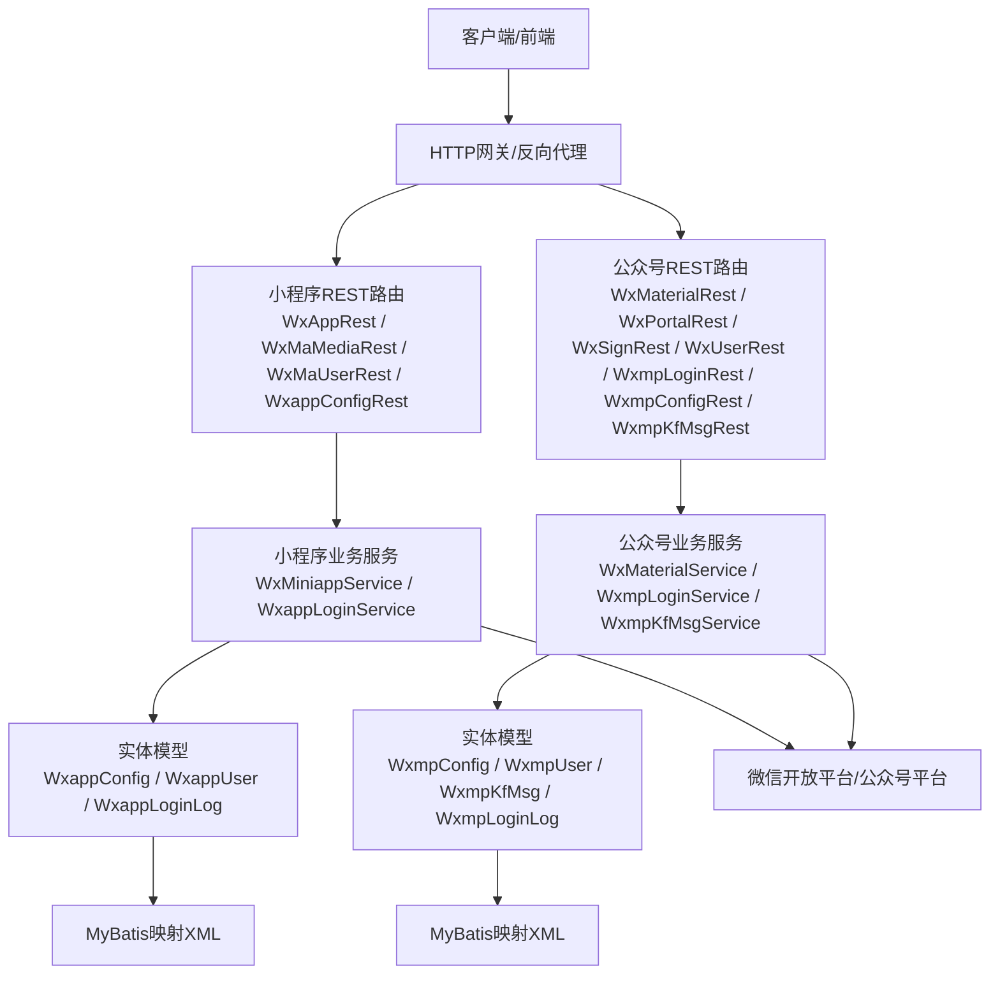

图表来源
- [WxAppRest.java](file://micro-wxapp/src/main/java/com/wkclz/micro/wxapp/rest/WxAppRest.java)
- [WxMaMediaRest.java](file://micro-wxapp/src/main/java/com/wkclz/micro/wxapp/rest/WxMaMediaRest.java)
- [WxMaUserRest.java](file://micro-wxapp/src/main/java/com/wkclz/micro/wxapp/rest/WxMaUserRest.java)
- [WxappConfigRest.java](file://micro-wxapp/src/main/java/com/wkclz/micro/wxapp/rest/WxappConfigRest.java)
- [WxMiniappService.java](file://micro-wxapp/src/main/java/com/wkclz/micro/wxapp/service/custom/WxMiniappService.java)
- [WxappLoginService.java](file://micro-wxapp/src/main/java/com/wkclz/micro/wxapp/service/custom/WxappLoginService.java)
- [WxMaterialRest.java](file://micro-wxmp/src/main/java/com/wkclz/micro/wxmp/rest/mp/WxMaterialRest.java)
- [WxPortalRest.java](file://micro-wxmp/src/main/java/com/wkclz/micro/wxmp/rest/mp/WxPortalRest.java)
- [WxSignRest.java](file://micro-wxmp/src/main/java/com/wkclz/micro/wxmp/rest/mp/WxSignRest.java)
- [WxUserRest.java](file://micro-wxmp/src/main/java/com/wkclz/micro/wxmp/rest/cust/WxUserRest.java)
- [WxmpLoginRest.java](file://micro-wxmp/src/main/java/com/wkclz/micro/wxmp/rest/cust/WxmpLoginRest.java)
- [WxmpConfigRest.java](file://micro-wxmp/src/main/java/com/wkclz/micro/wxmp/rest/manager/WxmpConfigRest.java)
- [WxmpKfMsgRest.java](file://micro-wxmp/src/main/java/com/wkclz/micro/wxmp/rest/manager/WxmpKfMsgRest.java)
- [WxMaterialService.java](file://micro-wxmp/src/main/java/com/wkclz/micro/wxmp/service/WxMaterialService.java)
- [WxmpLoginService.java](file://micro-wxmp/src/main/java/com/wkclz/micro/wxmp/service/WxmpLoginService.java)
- [WxmpKfMsgService.java](file://micro-wxmp/src/main/java/com/wkclz/micro/wxmp/service/WxmpKfMsgService.java)

## 详细组件分析

### 小程序登录流程
小程序登录涉及授权码换取会话、用户信息解密与存储、登录日志记录等步骤。下图展示从客户端发起登录到服务端完成会话建立的关键交互。

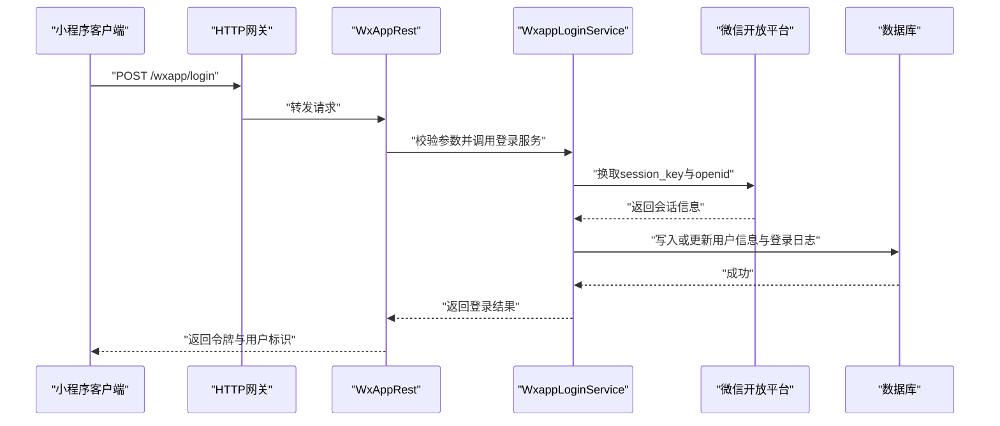

图表来源
- [WxAppRest.java](file://micro-wxapp/src/main/java/com/wkclz/micro/wxapp/rest/WxAppRest.java)
- [WxappLoginService.java](file://micro-wxapp/src/main/java/com/wkclz/micro/wxapp/service/custom/WxappLoginService.java)
- [WxMaLoginReq.java](file://micro-wxapp/src/main/java/com/wkclz/micro/wxapp/bean/req/WxMaLoginReq.java)
- [WxMaLoginResp.java](file://micro-wxapp/src/main/java/com/wkclz/micro/wxapp/bean/resp/WxMaLoginResp.java)
- [WxappUserEntity.java](file://micro-wxapp/src/main/java/com/wkclz/micro/wxapp/bean/entity/WxappUser.java)
- [WxappLoginLogEntity.java](file://micro-wxapp/src/main/java/com/wkclz/micro/wxapp/bean/entity/WxappLoginLog.java)

章节来源
- [WxMaLoginReq.java](file://micro-wxapp/src/main/java/com/wkclz/micro/wxapp/bean/req/WxMaLoginReq.java)
- [WxMaLoginResp.java](file://micro-wxapp/src/main/java/com/wkclz/micro/wxapp/bean/resp/WxMaLoginResp.java)
- [WxappUserEntity.java](file://micro-wxapp/src/main/java/com/wkclz/micro/wxapp/bean/entity/WxappUser.java)
- [WxappLoginLogEntity.java](file://micro-wxapp/src/main/java/com/wkclz/micro/wxapp/bean/entity/WxappLoginLog.java)

### 小程序用户信息与手机号更新
该流程支持用户信息更新与手机号绑定，涉及敏感信息解密与安全校验。

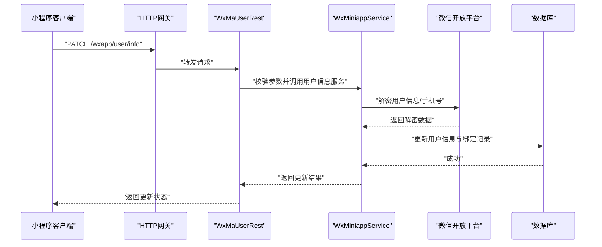

图表来源
- [WxMaUserRest.java](file://micro-wxapp/src/main/java/com/wkclz/micro/wxapp/rest/WxMaUserRest.java)
- [WxMiniappService.java](file://micro-wxapp/src/main/java/com/wkclz/micro/wxapp/service/custom/WxMiniappService.java)
- [WxMaUserInfoUpdateReq.java](file://micro-wxapp/src/main/java/com/wkclz/micro/wxapp/bean/req/WxMaUserInfoUpdateReq.java)
- [WxMaUserInfoResp.java](file://micro-wxapp/src/main/java/com/wkclz/micro/wxapp/bean/resp/WxMaUserInfoResp.java)
- [WxMaPhoneReq.java](file://micro-wxapp/src/main/java/com/wkclz/micro/wxapp/bean/req/WxMaPhoneReq.java)
- [WxMaMobileBindReq.java](file://micro-wxapp/src/main/java/com/wkclz/micro/wxapp/bean/req/WxMaMobileBindReq.java)

章节来源
- [WxMaUserInfoUpdateReq.java](file://micro-wxapp/src/main/java/com/wkclz/micro/wxapp/bean/req/WxMaUserInfoUpdateReq.java)
- [WxMaUserInfoResp.java](file://micro-wxapp/src/main/java/com/wkclz/micro/wxapp/bean/resp/WxMaUserInfoResp.java)
- [WxMaPhoneReq.java](file://micro-wxapp/src/main/java/com/wkclz/micro/wxapp/bean/req/WxMaPhoneReq.java)
- [WxMaMobileBindReq.java](file://micro-wxapp/src/main/java/com/wkclz/micro/wxapp/bean/req/WxMaMobileBindReq.java)

### 小程序媒体文件处理
媒体文件上传、拉取与管理是小程序运营的重要环节，系统提供统一的REST接口以适配不同场景。

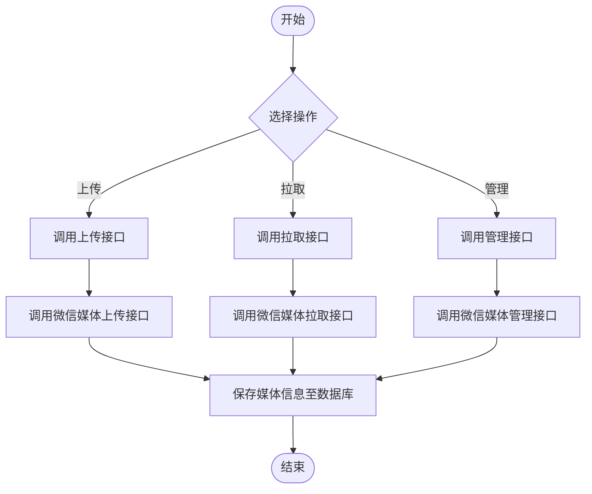

图表来源
- [WxMaMediaRest.java](file://micro-wxapp/src/main/java/com/wkclz/micro/wxapp/rest/WxMaMediaRest.java)
- [WxMiniappService.java](file://micro-wxapp/src/main/java/com/wkclz/micro/wxapp/service/custom/WxMiniappService.java)

章节来源
- [WxMaMediaRest.java](file://micro-wxapp/src/main/java/com/wkclz/micro/wxapp/rest/WxMaMediaRest.java)

### 小程序配置管理
小程序应用配置的增删改查与分页查询，支撑多环境与多应用的灵活管理。

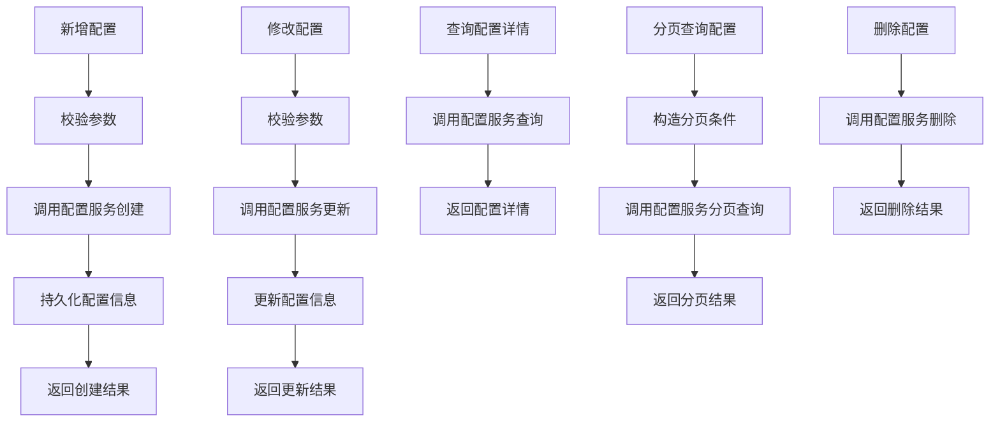

图表来源
- [WxappConfigRest.java](file://micro-wxapp/src/main/java/com/wkclz/micro/wxapp/rest/WxappConfigRest.java)
- [WxappConfigCreateReq.java](file://micro-wxapp/src/main/java/com/wkclz/micro/wxapp/bean/req/WxappConfigCreateReq.java)
- [WxappConfigUpdateReq.java](file://micro-wxapp/src/main/java/com/wkclz/micro/wxapp/bean/req/WxappConfigUpdateReq.java)
- [WxappConfigInfoReq.java](file://micro-wxapp/src/main/java/com/wkclz/micro/wxapp/bean/req/WxappConfigInfoReq.java)
- [WxappConfigPageReq.java](file://micro-wxapp/src/main/java/com/wkclz/micro/wxapp/bean/req/WxappConfigPageReq.java)
- [WxappConfigRemoveReq.java](file://micro-wxapp/src/main/java/com/wkclz/micro/wxapp/bean/req/WxappConfigRemoveReq.java)
- [WxappConfigEntity.java](file://micro-wxapp/src/main/java/com/wkclz/micro/wxapp/bean/entity/WxappConfig.java)

章节来源
- [WxappConfigRest.java](file://micro-wxapp/src/main/java/com/wkclz/micro/wxapp/rest/WxappConfigRest.java)
- [WxappConfigCreateReq.java](file://micro-wxapp/src/main/java/com/wkclz/micro/wxapp/bean/req/WxappConfigCreateReq.java)
- [WxappConfigUpdateReq.java](file://micro-wxapp/src/main/java/com/wkclz/micro/wxapp/bean/req/WxappConfigUpdateReq.java)
- [WxappConfigInfoReq.java](file://micro-wxapp/src/main/java/com/wkclz/micro/wxapp/bean/req/WxappConfigInfoReq.java)
- [WxappConfigPageReq.java](file://micro-wxapp/src/main/java/com/wkclz/micro/wxapp/bean/req/WxappConfigPageReq.java)
- [WxappConfigRemoveReq.java](file://micro-wxapp/src/main/java/com/wkclz/micro/wxapp/bean/req/WxappConfigRemoveReq.java)
- [WxappConfigEntity.java](file://micro-wxapp/src/main/java/com/wkclz/micro/wxapp/bean/entity/WxappConfig.java)

### 公众号素材管理
公众号素材管理包括永久素材的上传、获取与删除，支持图片、语音、视频、图文消息等类型。

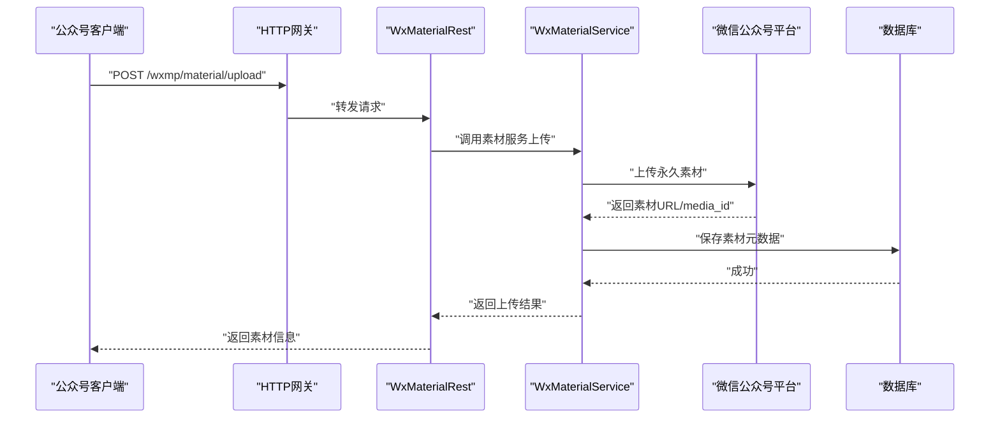

图表来源
- [WxMaterialRest.java](file://micro-wxmp/src/main/java/com/wkclz/micro/wxmp/rest/mp/WxMaterialRest.java)
- [WxMaterialService.java](file://micro-wxmp/src/main/java/com/wkclz/micro/wxmp/service/WxMaterialService.java)

章节来源
- [WxMaterialRest.java](file://micro-wxmp/src/main/java/com/wkclz/micro/wxmp/rest/mp/WxMaterialRest.java)
- [WxMaterialService.java](file://micro-wxmp/src/main/java/com/wkclz/micro/wxmp/service/WxMaterialService.java)

### 公众号服务端签名验证
服务端签名验证用于确认来自微信服务器的消息来源合法性，防止伪造请求。

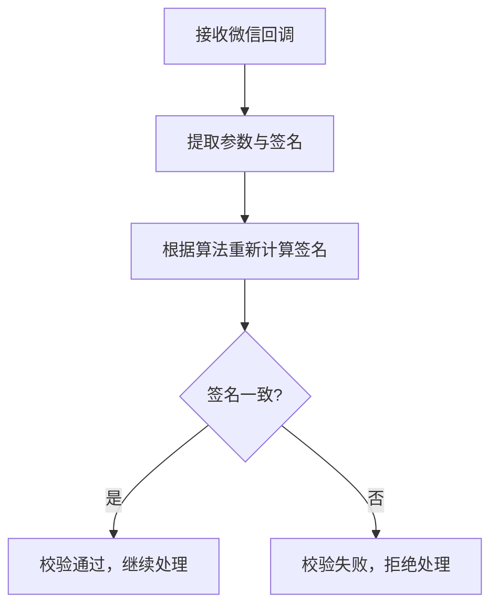

图表来源
- [WxSignRest.java](file://micro-wxmp/src/main/java/com/wkclz/micro/wxmp/rest/mp/WxSignRest.java)
- [WxSignReq.java](file://micro-wxmp/src/main/java/com/wkclz/micro/wxmp/bean/req/WxSignReq.java)

章节来源
- [WxSignRest.java](file://micro-wxmp/src/main/java/com/wkclz/micro/wxmp/rest/mp/WxSignRest.java)
- [WxSignReq.java](file://micro-wxmp/src/main/java/com/wkclz/micro/wxmp/bean/req/WxSignReq.java)

### 公众号消息与事件处理
公众号通过消息构建器与处理器实现对不同类型消息与事件的统一处理，支持文本、图片、菜单点击、关注/取消关注、地理位置上报等。

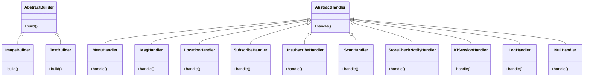

图表来源
- [AbstractBuilder.java](file://micro-wxmp/src/main/java/com/wkclz/micro/wxmp/builder/AbstractBuilder.java)
- [ImageBuilder.java](file://micro-wxmp/src/main/java/com/wkclz/micro/wxmp/builder/ImageBuilder.java)
- [TextBuilder.java](file://micro-wxmp/src/main/java/com/wkclz/micro/wxmp/builder/TextBuilder.java)
- [AbstractHandler.java](file://micro-wxmp/src/main/java/com/wkclz/micro/wxmp/handler/AbstractHandler.java)
- [MenuHandler.java](file://micro-wxmp/src/main/java/com/wkclz/micro/wxmp/handler/MenuHandler.java)
- [MsgHandler.java](file://micro-wxmp/src/main/java/com/wkclz/micro/wxmp/handler/MsgHandler.java)
- [LocationHandler.java](file://micro-wxmp/src/main/java/com/wkclz/micro/wxmp/handler/LocationHandler.java)
- [SubscribeHandler.java](file://micro-wxmp/src/main/java/com/wkclz/micro/wxmp/handler/SubscribeHandler.java)
- [UnsubscribeHandler.java](file://micro-wxmp/src/main/java/com/wkclz/micro/wxmp/handler/UnsubscribeHandler.java)
- [ScanHandler.java](file://micro-wxmp/src/main/java/com/wkclz/micro/wxmp/handler/ScanHandler.java)
- [StoreCheckNotifyHandler.java](file://micro-wxmp/src/main/java/com/wkclz/micro/wxmp/handler/StoreCheckNotifyHandler.java)
- [KfSessionHandler.java](file://micro-wxmp/src/main/java/com/wkclz/micro/wxmp/handler/KfSessionHandler.java)
- [LogHandler.java](file://micro-wxmp/src/main/java/com/wkclz/micro/wxmp/handler/LogHandler.java)
- [NullHandler.java](file://micro-wxmp/src/main/java/com/wkclz/micro/wxmp/handler/NullHandler.java)

章节来源
- [AbstractBuilder.java](file://micro-wxmp/src/main/java/com/wkclz/micro/wxmp/builder/AbstractBuilder.java)
- [ImageBuilder.java](file://micro-wxmp/src/main/java/com/wkclz/micro/wxmp/builder/ImageBuilder.java)
- [TextBuilder.java](file://micro-wxmp/src/main/java/com/wkclz/micro/wxmp/builder/TextBuilder.java)
- [AbstractHandler.java](file://micro-wxmp/src/main/java/com/wkclz/micro/wxmp/handler/AbstractHandler.java)
- [MenuHandler.java](file://micro-wxmp/src/main/java/com/wkclz/micro/wxmp/handler/MenuHandler.java)
- [MsgHandler.java](file://micro-wxmp/src/main/java/com/wkclz/micro/wxmp/handler/MsgHandler.java)
- [LocationHandler.java](file://micro-wxmp/src/main/java/com/wkclz/micro/wxmp/handler/LocationHandler.java)
- [SubscribeHandler.java](file://micro-wxmp/src/main/java/com/wkclz/micro/wxmp/handler/SubscribeHandler.java)
- [UnsubscribeHandler.java](file://micro-wxmp/src/main/java/com/wkclz/micro/wxmp/handler/UnsubscribeHandler.java)
- [ScanHandler.java](file://micro-wxmp/src/main/java/com/wkclz/micro/wxmp/handler/ScanHandler.java)
- [StoreCheckNotifyHandler.java](file://micro-wxmp/src/main/java/com/wkclz/micro/wxmp/handler/StoreCheckNotifyHandler.java)
- [KfSessionHandler.java](file://micro-wxmp/src/main/java/com/wkclz/micro/wxmp/handler/KfSessionHandler.java)
- [LogHandler.java](file://micro-wxmp/src/main/java/com/wkclz/micro/wxmp/handler/LogHandler.java)
- [NullHandler.java](file://micro-wxmp/src/main/java/com/wkclz/micro/wxmp/handler/NullHandler.java)

### 公众号客服消息
客服消息支持发送文本、图片等消息类型，结合会话管理实现与用户的互动。

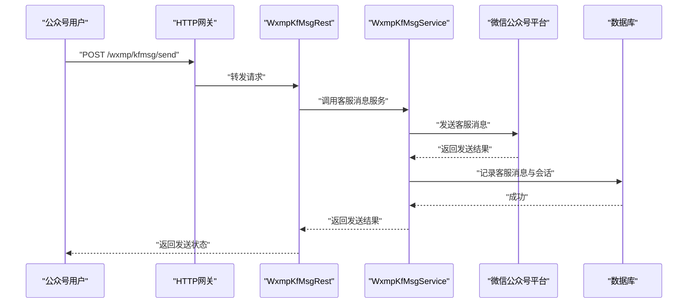

图表来源
- [WxmpKfMsgRest.java](file://micro-wxmp/src/main/java/com/wkclz/micro/wxmp/rest/manager/WxmpKfMsgRest.java)
- [WxmpKfMsgService.java](file://micro-wxmp/src/main/java/com/wkclz/micro/wxmp/service/WxmpKfMsgService.java)
- [WxmpKfMsgEntity.java](file://micro-wxmp/src/main/java/com/wkclz/micro/wxmp/bean/entity/WxmpKfMsg.java)

章节来源
- [WxmpKfMsgRest.java](file://micro-wxmp/src/main/java/com/wkclz/micro/wxmp/rest/manager/WxmpKfMsgRest.java)
- [WxmpKfMsgService.java](file://micro-wxmp/src/main/java/com/wkclz/micro/wxmp/service/WxmpKfMsgService.java)
- [WxmpKfMsgEntity.java](file://micro-wxmp/src/main/java/com/wkclz/micro/wxmp/bean/entity/WxmpKfMsg.java)

### 公众号用户与登录管理
公众号用户信息与登录流程与小程序类似，但针对公众号场景进行适配。

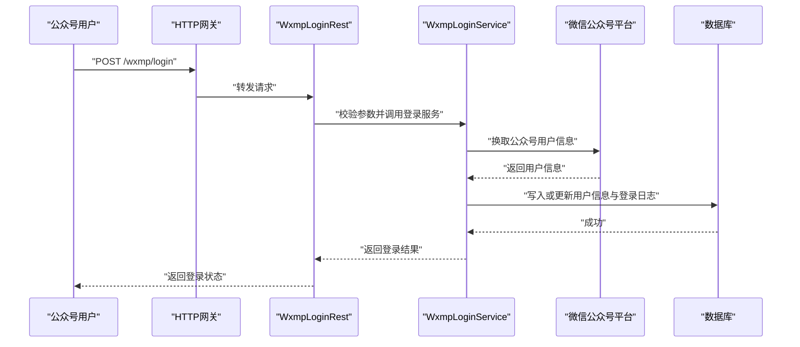

图表来源
- [WxmpLoginRest.java](file://micro-wxmp/src/main/java/com/wkclz/micro/wxmp/rest/cust/WxmpLoginRest.java)
- [WxmpLoginService.java](file://micro-wxmp/src/main/java/com/wkclz/micro/wxmp/service/WxmpLoginService.java)
- [WxmpUserEntity.java](file://micro-wxmp/src/main/java/com/wkclz/micro/wxmp/bean/entity/WxmpUser.java)
- [WxmpLoginLogEntity.java](file://micro-wxmp/src/main/java/com/wkclz/micro/wxmp/bean/entity/WxmpLoginLog.java)

章节来源
- [WxmpLoginRest.java](file://micro-wxmp/src/main/java/com/wkclz/micro/wxmp/rest/cust/WxmpLoginRest.java)
- [WxmpLoginService.java](file://micro-wxmp/src/main/java/com/wkclz/micro/wxmp/service/WxmpLoginService.java)
- [WxmpUserEntity.java](file://micro-wxmp/src/main/java/com/wkclz/micro/wxmp/bean/entity/WxmpUser.java)
- [WxmpLoginLogEntity.java](file://micro-wxmp/src/main/java/com/wkclz/micro/wxmp/bean/entity/WxmpLoginLog.java)

## 依赖关系分析
- 配置类负责初始化微信SDK与注册路由，确保REST控制器与业务服务在Spring容器中正确装配。
- REST控制器作为对外接口，负责参数解析、调用业务服务并返回结果。
- 业务服务封装具体逻辑，调用微信平台接口并与数据库交互。
- 实体与映射XML定义数据模型与SQL映射，保证数据一致性与可维护性。

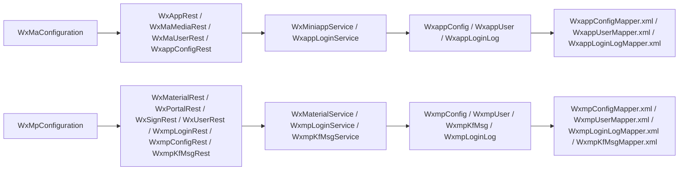

图表来源
- [WxMaConfiguration.java](file://micro-wxapp/src/main/java/com/wkclz/micro/wxapp/config/WxMaConfiguration.java)
- [WxAppRest.java](file://micro-wxapp/src/main/java/com/wkclz/micro/wxapp/rest/WxAppRest.java)
- [WxMaMediaRest.java](file://micro-wxapp/src/main/java/com/wkclz/micro/wxapp/rest/WxMaMediaRest.java)
- [WxMaUserRest.java](file://micro-wxapp/src/main/java/com/wkclz/micro/wxapp/rest/WxMaUserRest.java)
- [WxappConfigRest.java](file://micro-wxapp/src/main/java/com/wkclz/micro/wxapp/rest/WxappConfigRest.java)
- [WxMiniappService.java](file://micro-wxapp/src/main/java/com/wkclz/micro/wxapp/service/custom/WxMiniappService.java)
- [WxappLoginService.java](file://micro-wxapp/src/main/java/com/wkclz/micro/wxapp/service/custom/WxappLoginService.java)
- [WxMpConfiguration.java](file://micro-wxmp/src/main/java/com/wkclz/micro/wxmp/config/WxMpConfiguration.java)
- [WxMaterialRest.java](file://micro-wxmp/src/main/java/com/wkclz/micro/wxmp/rest/mp/WxMaterialRest.java)
- [WxPortalRest.java](file://micro-wxmp/src/main/java/com/wkclz/micro/wxmp/rest/mp/WxPortalRest.java)
- [WxSignRest.java](file://micro-wxmp/src/main/java/com/wkclz/micro/wxmp/rest/mp/WxSignRest.java)
- [WxUserRest.java](file://micro-wxmp/src/main/java/com/wkclz/micro/wxmp/rest/cust/WxUserRest.java)
- [WxmpLoginRest.java](file://micro-wxmp/src/main/java/com/wkclz/micro/wxmp/rest/cust/WxmpLoginRest.java)
- [WxmpConfigRest.java](file://micro-wxmp/src/main/java/com/wkclz/micro/wxmp/rest/manager/WxmpConfigRest.java)
- [WxmpKfMsgRest.java](file://micro-wxmp/src/main/java/com/wkclz/micro/wxmp/rest/manager/WxmpKfMsgRest.java)
- [WxMaterialService.java](file://micro-wxmp/src/main/java/com/wkclz/micro/wxmp/service/WxMaterialService.java)
- [WxmpLoginService.java](file://micro-wxmp/src/main/java/com/wkclz/micro/wxmp/service/WxmpLoginService.java)
- [WxmpKfMsgService.java](file://micro-wxmp/src/main/java/com/wkclz/micro/wxmp/service/WxmpKfMsgService.java)

章节来源
- [WxMaConfiguration.java](file://micro-wxapp/src/main/java/com/wkclz/micro/wxapp/config/WxMaConfiguration.java)
- [WxMpConfiguration.java](file://micro-wxmp/src/main/java/com/wkclz/micro/wxmp/config/WxMpConfiguration.java)

## 性能考虑
- 接口限流与熔断：建议在网关层对微信平台接口调用进行限流控制，避免触发平台频率限制。
- 缓存策略：对频繁访问的配置信息与用户信息进行缓存，降低数据库压力。
- 异步处理：对耗时操作（如素材上传、客服消息发送）采用异步队列处理，提升响应速度。
- 日志与监控：完善链路追踪与错误日志，定位性能瓶颈与异常原因。

## 故障排查指南
- 登录失败：检查授权码是否有效、是否过期；核对小程序配置信息与微信平台配置是否一致。
- 用户信息更新失败：确认解密参数是否正确、手机号绑定流程是否符合平台要求。
- 素材上传失败：检查文件类型与大小限制，确认上传凭证与签名是否正确。
- 消息处理异常：查看消息处理器日志，确认事件类型与处理器映射是否匹配。
- 客服消息发送失败：检查客服账号与会话状态，确认消息格式与内容长度。

## 结论
本文件系统梳理了小程序与公众号两大生态的接口规范与实现要点，明确了登录、用户信息、媒体文件、消息与事件处理、客服消息等关键能力域。通过合理的架构设计与严格的参数校验，能够满足微信平台的安全与性能要求，并为后续扩展提供清晰的边界与接口契约。

## 附录
- 开发调试工具：建议使用微信官方提供的开发者工具与平台沙箱环境进行联调测试。
- 错误码对照：参考微信开放平台与公众号平台的错误码文档，结合系统日志进行定位。
- 常见问题：关注平台公告与接口变更，及时调整业务逻辑与参数校验规则。