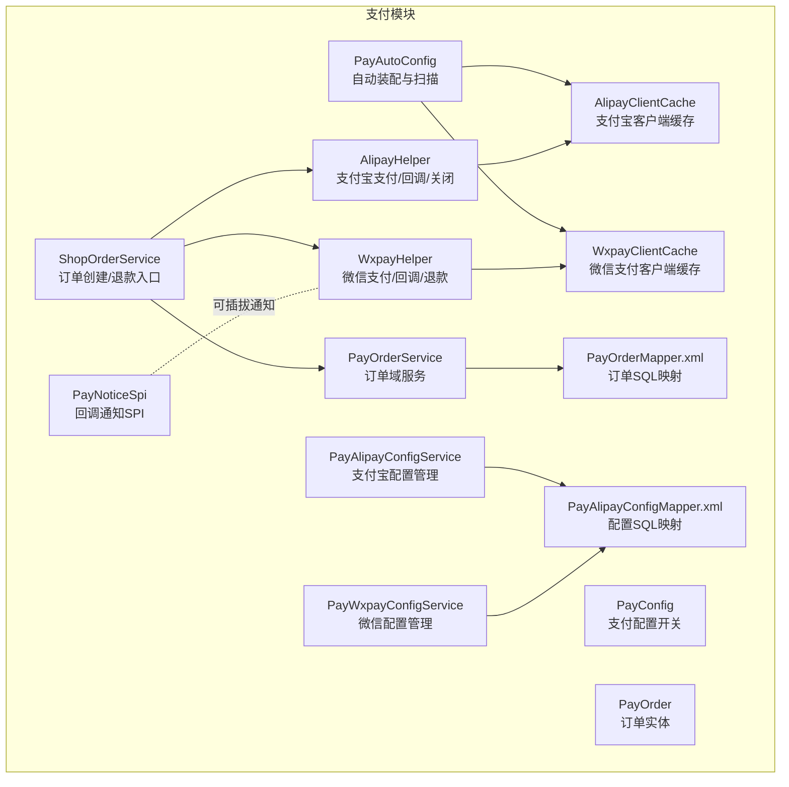
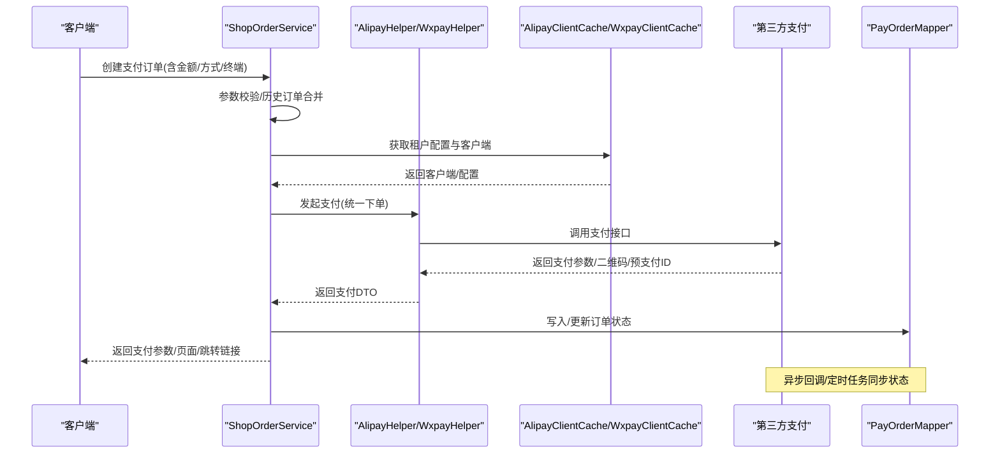
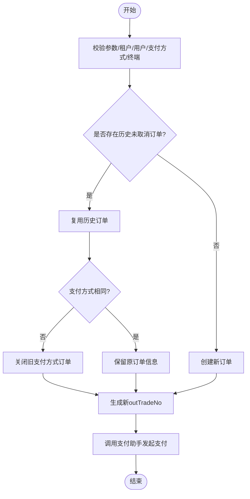
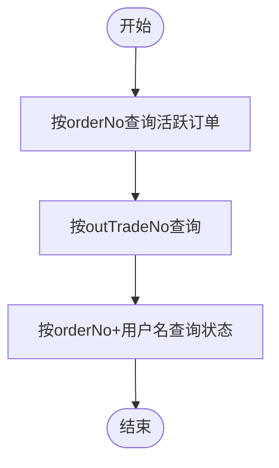
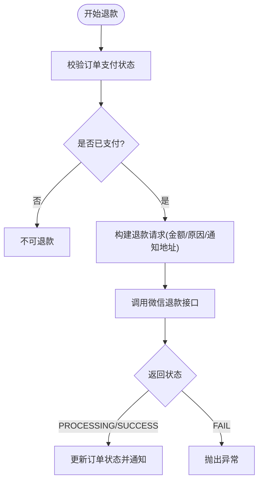
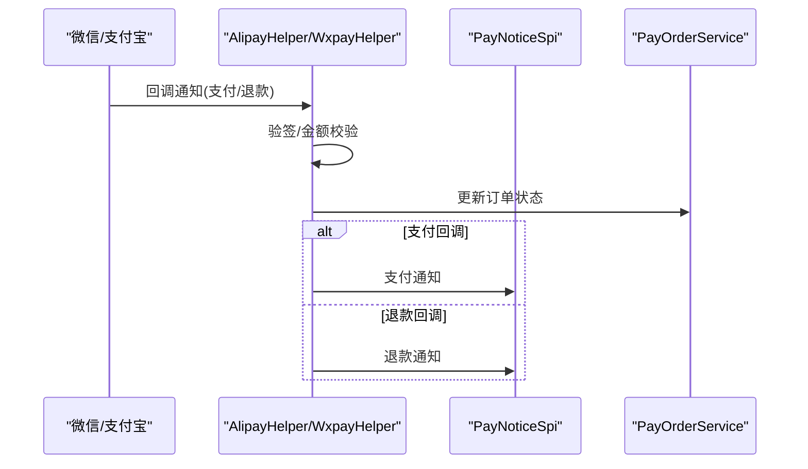
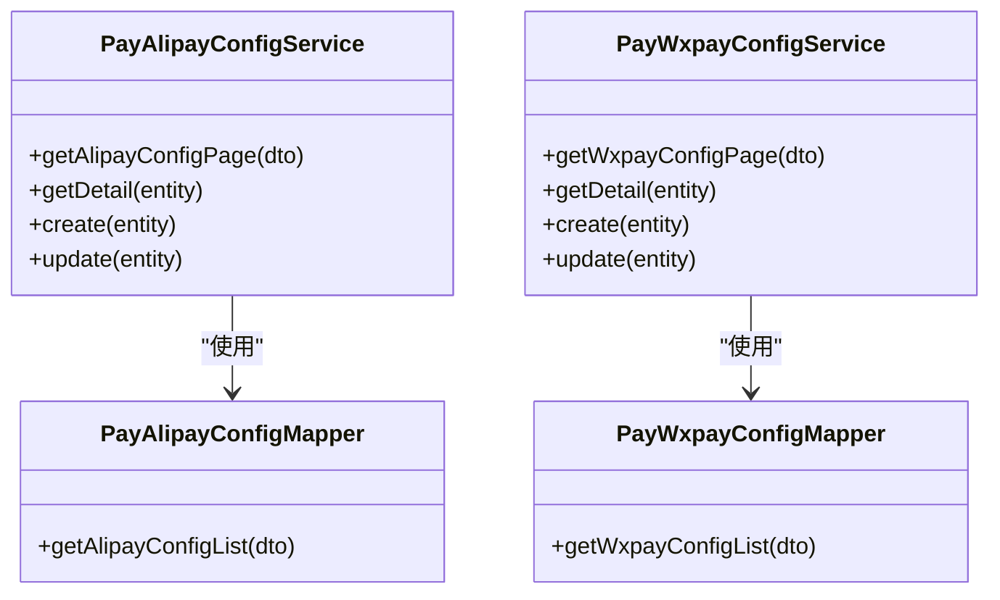
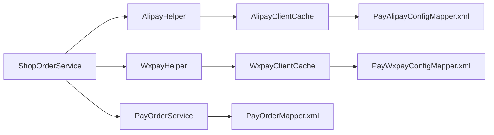
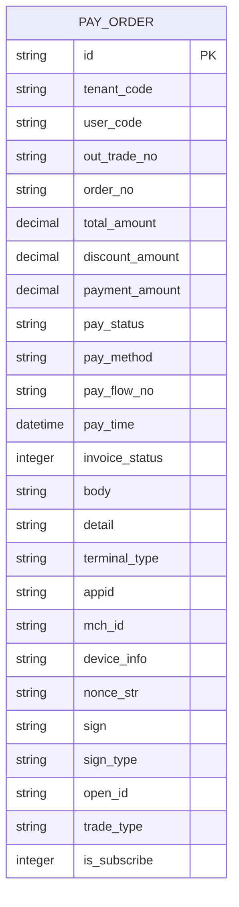

# 支付服务API

<cite>
**本文引用的文件**
- [PayAutoConfig.java](file://micro-pay/src/main/java/com/wkclz/micro/pay/PayAutoConfig.java)
- [PayConfig.java](file://micro-pay/src/main/java/com/wkclz/micro/pay/config/PayConfig.java)
- [PayNoticeSpi.java](file://micro-pay/src/main/java/com/wkclz/micro/pay/spi/PayNoticeSpi.java)
- [AlipayClientCache.java](file://micro-pay/src/main/java/com/wkclz/micro/pay/cache/AlipayClientCache.java)
- [WxpayClientCache.java](file://micro-pay/src/main/java/com/wkclz/micro/pay/cache/WxpayClientCache.java)
- [PayOrderService.java](file://micro-pay/src/main/java/com/wkclz/micro/pay/service/PayOrderService.java)
- [ShopOrderService.java](file://micro-pay/src/main/java/com/wkclz/micro/pay/service/ShopOrderService.java)
- [PayAlipayConfigService.java](file://micro-pay/src/main/java/com/wkclz/micro/pay/service/PayAlipayConfigService.java)
- [PayWxpayConfigService.java](file://micro-pay/src/main/java/com/wkclz/micro/pay/service/PayWxpayConfigService.java)
- [PayOrder.java](file://micro-pay/src/main/java/com/wkclz/micro/pay/bean/entity/PayOrder.java)
- [AlipayHelper.java](file://micro-pay/src/main/java/com/wkclz/micro/pay/helper/AlipayHelper.java)
- [WxpayHelper.java](file://micro-pay/src/main/java/com/wkclz/micro/pay/helper/WxpayHelper.java)
- [PayOrderMapper.xml](file://micro-pay/src/main/resources/mapper/PayOrderMapper.xml)
- [PayAlipayConfigMapper.xml](file://micro-pay/src/main/resources/mapper/PayAlipayConfigMapper.xml)
</cite>

## 目录
1. [简介](#简介)
2. [项目结构](#项目结构)
3. [核心组件](#核心组件)
4. [架构总览](#架构总览)
5. [详细组件分析](#详细组件分析)
6. [依赖分析](#依赖分析)
7. [性能考量](#性能考量)
8. [故障排查指南](#故障排查指南)
9. [结论](#结论)
10. [附录](#附录)

## 简介
本文件为支付服务API的权威文档，覆盖微信支付与支付宝支付的完整集成接口，包括支付订单创建、支付状态查询、退款处理与回调通知等。同时提供支付配置管理、商户接入与安全验证机制说明，并给出支付流程示例、错误处理方案、安全策略、数据加密与风险控制措施，以及支付统计、对账与异常监控的接口说明。

## 项目结构
支付模块采用“服务层 + 辅助工具层 + 缓存层 + 配置与映射”的分层设计，核心文件分布如下：
- 自动装配与扫描：PayAutoConfig
- 支付配置开关：PayConfig
- 回调通知SPI：PayNoticeSpi
- 支付客户端缓存：AlipayClientCache、WxpayClientCache
- 业务服务：ShopOrderService（对外入口）、PayOrderService（订单域服务）
- 配置管理服务：PayAlipayConfigService、PayWxpayConfigService
- 数据模型：PayOrder
- 支付辅助：AlipayHelper、WxpayHelper
- MyBatis映射：PayOrderMapper.xml、PayAlipayConfigMapper.xml

图表来源
- [PayAutoConfig.java:1-11](file://micro-pay/src/main/java/com/wkclz/micro/pay/PayAutoConfig.java#L1-L11)
- [PayConfig.java:1-25](file://micro-pay/src/main/java/com/wkclz/micro/pay/config/PayConfig.java#L1-L25)
- [PayNoticeSpi.java:1-14](file://micro-pay/src/main/java/com/wkclz/micro/pay/spi/PayNoticeSpi.java#L1-L14)
- [AlipayClientCache.java:1-189](file://micro-pay/src/main/java/com/wkclz/micro/pay/cache/AlipayClientCache.java#L1-L189)
- [WxpayClientCache.java:1-170](file://micro-pay/src/main/java/com/wkclz/micro/pay/cache/WxpayClientCache.java#L1-L170)
- [ShopOrderService.java:1-222](file://micro-pay/src/main/java/com/wkclz/micro/pay/service/ShopOrderService.java#L1-L222)
- [PayOrderService.java:1-110](file://micro-pay/src/main/java/com/wkclz/micro/pay/service/PayOrderService.java#L1-L110)
- [PayAlipayConfigService.java:1-77](file://micro-pay/src/main/java/com/wkclz/micro/pay/service/PayAlipayConfigService.java#L1-L77)
- [PayWxpayConfigService.java:1-89](file://micro-pay/src/main/java/com/wkclz/micro/pay/service/PayWxpayConfigService.java#L1-L89)
- [AlipayHelper.java:1-380](file://micro-pay/src/main/java/com/wkclz/micro/pay/helper/AlipayHelper.java#L1-L380)
- [WxpayHelper.java:1-545](file://micro-pay/src/main/java/com/wkclz/micro/pay/helper/WxpayHelper.java#L1-L545)
- [PayOrderMapper.xml:1-75](file://micro-pay/src/main/resources/mapper/PayOrderMapper.xml#L1-L75)
- [PayAlipayConfigMapper.xml:1-35](file://micro-pay/src/main/resources/mapper/PayAlipayConfigMapper.xml#L1-L35)

章节来源
- [PayAutoConfig.java:1-11](file://micro-pay/src/main/java/com/wkclz/micro/pay/PayAutoConfig.java#L1-L11)
- [PayConfig.java:1-25](file://micro-pay/src/main/java/com/wkclz/micro/pay/config/PayConfig.java#L1-L25)

## 核心组件
- 支付配置开关：通过环境变量控制支付状态同步与超时取消策略
- 支付客户端缓存：按租户维度缓存支付宝/微信支付客户端与配置，支持自动清理与一致性保障
- 订单域服务：负责订单唯一性校验、状态读取、历史订单合并与模拟支付
- 订单创建/退款入口：统一入口，校验参数、选择支付方式、发起支付或退款
- 支付辅助：封装支付宝/微信支付请求、回调验签、关闭与退款流程
- 回调通知SPI：可插拔的通知扩展点，用于支付/超时/退款后的业务处理

章节来源
- [PayConfig.java:14-21](file://micro-pay/src/main/java/com/wkclz/micro/pay/config/PayConfig.java#L14-L21)
- [AlipayClientCache.java:75-113](file://micro-pay/src/main/java/com/wkclz/micro/pay/cache/AlipayClientCache.java#L75-L113)
- [WxpayClientCache.java:73-108](file://micro-pay/src/main/java/com/wkclz/micro/pay/cache/WxpayClientCache.java#L73-L108)
- [PayOrderService.java:31-86](file://micro-pay/src/main/java/com/wkclz/micro/pay/service/PayOrderService.java#L31-L86)
- [ShopOrderService.java:46-140](file://micro-pay/src/main/java/com/wkclz/micro/pay/service/ShopOrderService.java#L46-L140)
- [AlipayHelper.java:50-159](file://micro-pay/src/main/java/com/wkclz/micro/pay/helper/AlipayHelper.java#L50-L159)
- [WxpayHelper.java:66-172](file://micro-pay/src/main/java/com/wkclz/micro/pay/helper/WxpayHelper.java#L66-L172)
- [PayNoticeSpi.java:5-13](file://micro-pay/src/main/java/com/wkclz/micro/pay/spi/PayNoticeSpi.java#L5-L13)

## 架构总览
支付服务整体交互流程如下：

图表来源
- [ShopOrderService.java:46-140](file://micro-pay/src/main/java/com/wkclz/micro/pay/service/ShopOrderService.java#L46-L140)
- [AlipayHelper.java:50-159](file://micro-pay/src/main/java/com/wkclz/micro/pay/helper/AlipayHelper.java#L50-L159)
- [WxpayHelper.java:66-172](file://micro-pay/src/main/java/com/wkclz/micro/pay/helper/WxpayHelper.java#L66-L172)
- [AlipayClientCache.java:75-113](file://micro-pay/src/main/java/com/wkclz/micro/pay/cache/AlipayClientCache.java#L75-L113)
- [WxpayClientCache.java:73-108](file://micro-pay/src/main/java/com/wkclz/micro/pay/cache/WxpayClientCache.java#L73-L108)
- [PayOrderMapper.xml:6-38](file://micro-pay/src/main/resources/mapper/PayOrderMapper.xml#L6-L38)

## 详细组件分析

### 支付订单创建与合并
- 功能要点
  - 根据订单号查询历史未取消有效订单，若存在则复用并按支付方式决定是否关闭原订单
  - 生成新的外部交易号(outTradeNo)，区分首次与续付场景
  - 校验金额与折扣、终端类型、支付方式合法性
  - 调用对应支付助手发起支付
- 关键流程图

图表来源
- [ShopOrderService.java:46-140](file://micro-pay/src/main/java/com/wkclz/micro/pay/service/ShopOrderService.java#L46-L140)

章节来源
- [ShopOrderService.java:46-140](file://micro-pay/src/main/java/com/wkclz/micro/pay/service/ShopOrderService.java#L46-L140)

### 支付状态查询
- 查询接口
  - 获取活跃订单列表（排除取消状态）
  - 获取订单状态（带权限校验）
  - 按外部交易号查询订单
- SQL映射
  - getActivePayOrder：按orderNo过滤未取消订单
  - getOrderStatus：按orderNo+用户名查询状态
  - getPayOrderByOutTradeNo：按outTradeNo查询
- 流程图

图表来源
- [PayOrderMapper.xml:6-38](file://micro-pay/src/main/resources/mapper/PayOrderMapper.xml#L6-L38)

章节来源
- [PayOrderMapper.xml:6-38](file://micro-pay/src/main/resources/mapper/PayOrderMapper.xml#L6-L38)
- [PayOrderService.java:31-50](file://micro-pay/src/main/java/com/wkclz/micro/pay/service/PayOrderService.java#L31-L50)

### 退款处理
- 支付宝
  - 提供支付关闭接口（未支付订单无需关闭）
  - 退款逻辑在代码中预留，当前主要实现微信退款
- 微信
  - 发起整单退款，支持异步回调通知
  - 校验金额一致性，确保回调金额与订单金额匹配
  - 退款成功后触发回调通知SPI
- 退款流程图

图表来源
- [WxpayHelper.java:370-433](file://micro-pay/src/main/java/com/wkclz/micro/pay/helper/WxpayHelper.java#L370-L433)

章节来源
- [WxpayHelper.java:370-433](file://micro-pay/src/main/java/com/wkclz/micro/pay/helper/WxpayHelper.java#L370-L433)

### 回调通知与安全验证
- 支付宝
  - 支付回调：解析TRADE_SUCCESS/TRADE_FINISHED，设置支付状态、流水号与支付时间
  - 回调验签：使用支付宝公钥与配置参数进行RSA验签
  - 返回响应：成功/失败字符串
- 微信
  - 支付回调：校验金额一致性，设置支付状态与支付时间
  - 退款回调：解析退款状态，更新订单状态并通知
  - 回调验签：从请求头提取签名信息，结合证书与算法进行验签
- 回调流程图

图表来源
- [AlipayHelper.java:162-217](file://micro-pay/src/main/java/com/wkclz/micro/pay/helper/AlipayHelper.java#L162-L217)
- [AlipayHelper.java:341-376](file://micro-pay/src/main/java/com/wkclz/micro/pay/helper/AlipayHelper.java#L341-L376)
- [WxpayHelper.java:235-301](file://micro-pay/src/main/java/com/wkclz/micro/pay/helper/WxpayHelper.java#L235-L301)
- [WxpayHelper.java:436-520](file://micro-pay/src/main/java/com/wkclz/micro/pay/helper/WxpayHelper.java#L436-L520)
- [PayNoticeSpi.java:5-13](file://micro-pay/src/main/java/com/wkclz/micro/pay/spi/PayNoticeSpi.java#L5-L13)

章节来源
- [AlipayHelper.java:162-217](file://micro-pay/src/main/java/com/wkclz/micro/pay/helper/AlipayHelper.java#L162-L217)
- [AlipayHelper.java:341-376](file://micro-pay/src/main/java/com/wkclz/micro/pay/helper/AlipayHelper.java#L341-L376)
- [WxpayHelper.java:235-301](file://micro-pay/src/main/java/com/wkclz/micro/pay/helper/WxpayHelper.java#L235-L301)
- [WxpayHelper.java:436-520](file://micro-pay/src/main/java/com/wkclz/micro/pay/helper/WxpayHelper.java#L436-L520)
- [PayNoticeSpi.java:5-13](file://micro-pay/src/main/java/com/wkclz/micro/pay/spi/PayNoticeSpi.java#L5-L13)

### 支付配置管理与商户接入
- 支付宝配置
  - 唯一性约束：appId唯一
  - 密钥脱敏显示：敏感字段在详情中掩码
  - 校验：appId、商户私钥、支付宝公钥、应用公钥、回调地址等必填
- 微信配置
  - 唯一性约束：appId唯一
  - 密钥脱敏显示：apiclientKey、apiclientCert、mchV3Key掩码
  - 校验：appId、mchId、mchV3Key、回调地址等必填
- 配置映射

图表来源
- [PayAlipayConfigService.java:24-57](file://micro-pay/src/main/java/com/wkclz/micro/pay/service/PayAlipayConfigService.java#L24-L57)
- [PayWxpayConfigService.java:24-69](file://micro-pay/src/main/java/com/wkclz/micro/pay/service/PayWxpayConfigService.java#L24-L69)
- [PayAlipayConfigMapper.xml:6-31](file://micro-pay/src/main/resources/mapper/PayAlipayConfigMapper.xml#L6-L31)

章节来源
- [PayAlipayConfigService.java:24-57](file://micro-pay/src/main/java/com/wkclz/micro/pay/service/PayAlipayConfigService.java#L24-L57)
- [PayWxpayConfigService.java:24-69](file://micro-pay/src/main/java/com/wkclz/micro/pay/service/PayWxpayConfigService.java#L24-L69)
- [PayAlipayConfigMapper.xml:6-31](file://micro-pay/src/main/resources/mapper/PayAlipayConfigMapper.xml#L6-L31)

### 支付安全策略与风险控制
- 安全策略
  - 回调验签：支付宝使用RSA验签；微信使用签名头与证书验签
  - 参数校验：金额一致性校验、订单状态幂等保护
  - 租户隔离：按租户维度缓存客户端与配置，避免串户
- 风险控制
  - 支付超时取消：通过配置开关与定时任务控制
  - 幂等处理：重复支付拦截、已支付订单不再重复处理
  - 日志与告警：回调异常、金额不一致、签名失败均记录日志

章节来源
- [AlipayHelper.java:341-376](file://micro-pay/src/main/java/com/wkclz/micro/pay/helper/AlipayHelper.java#L341-L376)
- [WxpayHelper.java:526-542](file://micro-pay/src/main/java/com/wkclz/micro/pay/helper/WxpayHelper.java#L526-L542)
- [PayConfig.java:14-21](file://micro-pay/src/main/java/com/wkclz/micro/pay/config/PayConfig.java#L14-L21)
- [PayOrderService.java:52-69](file://micro-pay/src/main/java/com/wkclz/micro/pay/service/PayOrderService.java#L52-L69)

### 支付统计、对账与异常监控
- 支付统计
  - 可基于订单状态与时间范围进行聚合统计（建议在业务层扩展）
- 对账处理
  - 通过回调与定时任务同步支付状态，确保数据库与第三方一致
- 异常监控
  - 回调验签失败、金额不一致、第三方接口异常均需记录并报警

章节来源
- [PayOrderMapper.xml:42-71](file://micro-pay/src/main/resources/mapper/PayOrderMapper.xml#L42-L71)
- [WxpayHelper.java:235-301](file://micro-pay/src/main/java/com/wkclz/micro/pay/helper/WxpayHelper.java#L235-L301)
- [AlipayHelper.java:162-217](file://micro-pay/src/main/java/com/wkclz/micro/pay/helper/AlipayHelper.java#L162-L217)

## 依赖分析
- 组件耦合
  - ShopOrderService依赖AlipayHelper/WxpayHelper与PayOrderService
  - 支付助手依赖客户端缓存与配置服务
  - 订单服务依赖MyBatis映射
- 外部依赖
  - 支付宝SDK、微信支付SDK
  - Redis缓存与定时任务
  - MyBatis持久化

图表来源
- [ShopOrderService.java:39-44](file://micro-pay/src/main/java/com/wkclz/micro/pay/service/ShopOrderService.java#L39-L44)
- [AlipayHelper.java:47](file://micro-pay/src/main/java/com/wkclz/micro/pay/helper/AlipayHelper.java#L47)
- [WxpayHelper.java:64](file://micro-pay/src/main/java/com/wkclz/micro/pay/helper/WxpayHelper.java#L64)
- [PayOrderService.java:28-29](file://micro-pay/src/main/java/com/wkclz/micro/pay/service/PayOrderService.java#L28-L29)
- [AlipayClientCache.java:35-38](file://micro-pay/src/main/java/com/wkclz/micro/pay/cache/AlipayClientCache.java#L35-L38)
- [WxpayClientCache.java:33-36](file://micro-pay/src/main/java/com/wkclz/micro/pay/cache/WxpayClientCache.java#L33-L36)

## 性能考量
- 客户端缓存
  - 按租户维度缓存，减少初始化开销
  - 支持自动清理与一致性检测，避免脏缓存
- 数据访问
  - 使用MyBatis映射，合理利用索引与分页
- 异步处理
  - 回调与退款通知采用异步处理，降低主流程阻塞

## 故障排查指南
- 支付宝回调验签失败
  - 检查支付宝公钥、字符集、签名类型配置
  - 确认回调参数完整性与顺序
- 微信回调验签失败
  - 检查签名头与证书配置
  - 核对时间戳与随机数
- 金额不一致
  - 核对订单金额与回调金额（微信以分为单位）
- 订单状态异常
  - 检查历史订单合并逻辑与状态流转
- 超时未支付
  - 检查支付超时取消配置与定时任务

章节来源
- [AlipayHelper.java:341-376](file://micro-pay/src/main/java/com/wkclz/micro/pay/helper/AlipayHelper.java#L341-L376)
- [WxpayHelper.java:244-253](file://micro-pay/src/main/java/com/wkclz/micro/pay/helper/WxpayHelper.java#L244-L253)
- [PayConfig.java:14-21](file://micro-pay/src/main/java/com/wkclz/micro/pay/config/PayConfig.java#L14-L21)

## 结论
本支付服务API提供了完整的微信与支付宝集成能力，具备完善的配置管理、安全验证与风险控制机制。通过清晰的分层设计与可插拔的回调SPI，能够满足多租户、多终端的支付场景需求。建议在生产环境中配合完善的监控与对账体系，确保支付流程的稳定性与准确性。

## 附录
- 数据模型概览

图表来源
- [PayOrder.java:19-316](file://micro-pay/src/main/java/com/wkclz/micro/pay/bean/entity/PayOrder.java#L19-L316)