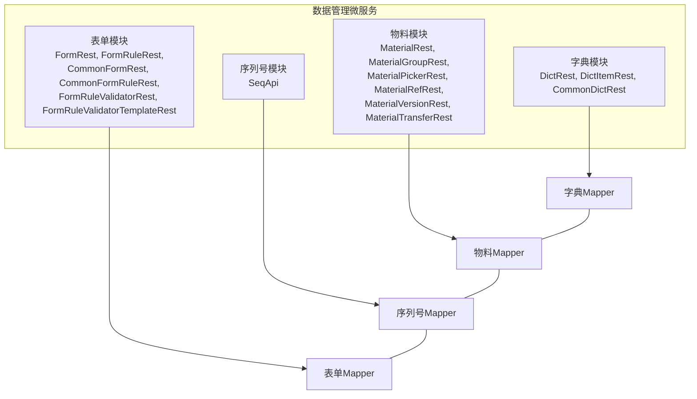
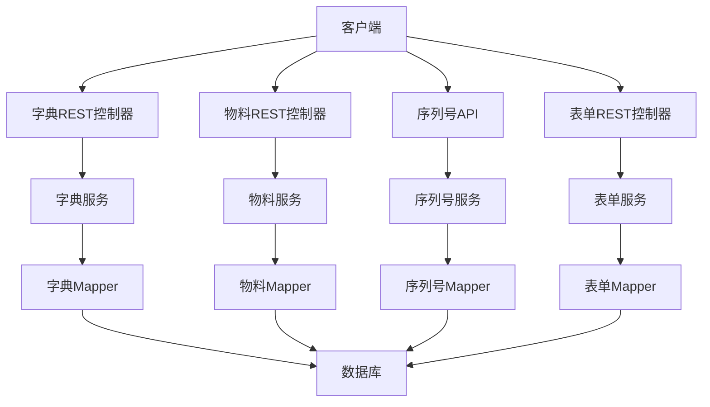
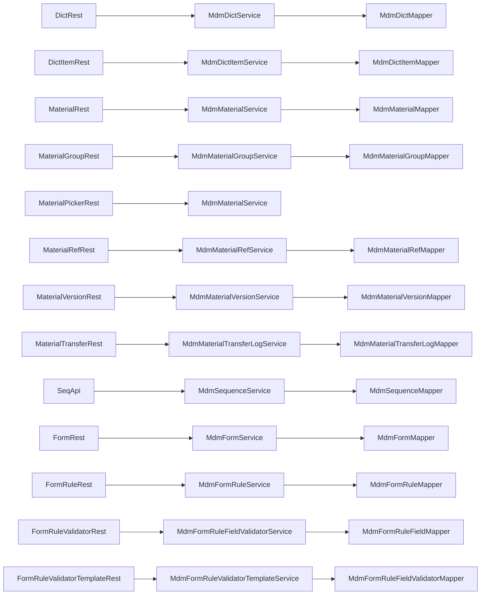

# 数据管理API

<cite>
**本文档引用的文件**
- [DictRest.java](file://micro-dict/src/main/java/com/wkclz/micro/dict/rest/DictRest.java)
- [DictItemRest.java](file://micro-dict/src/main/java/com/wkclz/micro/dict/rest/DictItemRest.java)
- [CommonDictRest.java](file://micro-dict/src/main/java/com/wkclz/micro/dict/rest/CommonDictRest.java)
- [MdmDictMapper.java](file://micro-dict/src/main/java/com/wkclz/micro/dict/mapper/MdmDictMapper.java)
- [MdmDictItemMapper.java](file://micro-dict/src/main/java/com/wkclz/micro/dict/mapper/MdmDictItemMapper.java)
- [MaterialRest.java](file://micro-material/src/main/java/com/wkclz/micro/material/rest/MaterialRest.java)
- [MaterialGroupRest.java](file://micro-material/src/main/java/com/wkclz/micro/material/rest/MaterialGroupRest.java)
- [MaterialPickerRest.java](file://micro-material/src/main/java/com/wkclz/micro/material/rest/MaterialPickerRest.java)
- [MaterialRefRest.java](file://micro-material/src/main/java/com/wkclz/micro/material/rest/MaterialRefRest.java)
- [MaterialVersionRest.java](file://micro-material/src/main/java/com/wkclz/micro/material/rest/MaterialVersionRest.java)
- [MaterialTransferRest.java](file://micro-material/src/main/java/com/wkclz/micro/material/rest/MaterialTransferRest.java)
- [MdmMaterialMapper.java](file://micro-material/src/main/java/com/wkclz/micro/material/mapper/MdmMaterialMapper.java)
- [MdmMaterialGroupMapper.java](file://micro-material/src/main/java/com/wkclz/micro/material/mapper/MdmMaterialGroupMapper.java)
- [MdmMaterialRefMapper.java](file://micro-material/src/main/java/com/wkclz/micro/material/mapper/MdmMaterialRefMapper.java)
- [MdmMaterialVersionMapper.java](file://micro-material/src/main/java/com/wkclz/micro/material/mapper/MdmMaterialVersionMapper.java)
- [MdmMaterialTransferLogMapper.java](file://micro-material/src/main/java/com/wkclz/micro/material/mapper/MdmMaterialTransferLogMapper.java)
- [SeqApi.java](file://micro-seq/src/main/java/com/wkclz/micro/seq/api/SeqApi.java)
- [MdmSequenceMapper.java](file://micro-seq/src/main/java/com/wkclz/micro/seq/mapper/MdmSequenceMapper.java)
- [FormRest.java](file://micro-form/src/main/java/com/wkclz/micro/form/rest/FormRest.java)
- [FormRuleRest.java](file://micro-form/src/main/java/com/wkclz/micro/form/rest/FormRuleRest.java)
- [CommonFormRest.java](file://micro-form/src/main/java/com/wkclz/micro/form/rest/CommonFormRest.java)
- [CommonFormRuleRest.java](file://micro-form/src/main/java/com/wkclz/micro/form/rest/CommonFormRuleRest.java)
- [FormRuleValidatorRest.java](file://micro-form/src/main/java/com/wkclz/micro/form/rest/FormRuleValidatorRest.java)
- [FormRuleValidatorTemplateRest.java](file://micro-form/src/main/java/com/wkclz/micro/form/rest/FormRuleValidatorTemplateRest.java)
- [MdmFormMapper.java](file://micro-form/src/main/java/com/wkclz/micro/form/mapper/MdmFormMapper.java)
- [MdmFormItemMapper.java](file://micro-form/src/main/java/com/wkclz/micro/form/mapper/MdmFormItemMapper.java)
- [MdmFormRuleMapper.java](file://micro-form/src/main/java/com/wkclz/micro/form/mapper/MdmFormRuleMapper.java)
- [MdmFormRuleFieldMapper.java](file://micro-form/src/main/java/com/wkclz/micro/form/mapper/MdmFormRuleFieldMapper.java)
- [MdmFormRuleFieldValidatorMapper.java](file://micro-form/src/main/java/com/wkclz/micro/form/mapper/MdmFormRuleFieldValidatorMapper.java)
- [MdmFormRuleValidatorTemplateMapper.java](file://micro-form/src/main/java/com/wkclz/micro/form/mapper/MdmFormRuleValidatorTemplateMapper.java)
</cite>

## 目录
1. [简介](#简介)
2. [项目结构](#项目结构)
3. [核心组件](#核心组件)
4. [架构总览](#架构总览)
5. [详细组件分析](#详细组件分析)
6. [依赖关系分析](#依赖关系分析)
7. [性能考虑](#性能考虑)
8. [故障排除指南](#故障排除指南)
9. [结论](#结论)

## 简介
本文件面向数据管理相关API，覆盖以下能力域的RESTful接口：
- 字典管理：字典类型与字典项的增删改查、批量保存等
- 物料管理：物料主数据、分组、引用关系、版本与转移日志、选择器等
- 序列号管理：序列号生成与维护
- 表单规则管理：表单定义、字段规则、校验器与模板

文档提供每个接口的HTTP方法、URL路径、请求参数、响应格式、状态码、数据验证规则、分页与排序约定、请求/响应示例路径、缓存策略与性能优化建议，以及错误处理与常见问题解决方案。

## 项目结构
数据管理相关模块位于独立的微服务子工程中，采用按功能域划分的包结构：
- micro-dict：字典管理（类型、项）
- micro-material：物料管理（主数据、分组、引用、版本、转移、统计）
- micro-seq：序列号管理
- micro-form：表单规则管理（表单、字段规则、校验器、模板）

图表来源
- [DictRest.java:1-200](file://micro-dict/src/main/java/com/wkclz/micro/dict/rest/DictRest.java#L1-L200)
- [MaterialRest.java:1-200](file://micro-material/src/main/java/com/wkclz/micro/material/rest/MaterialRest.java#L1-L200)
- [SeqApi.java:1-200](file://micro-seq/src/main/java/com/wkclz/micro/seq/api/SeqApi.java#L1-L200)
- [FormRest.java:1-200](file://micro-form/src/main/java/com/wkclz/micro/form/rest/FormRest.java#L1-L200)

章节来源
- [DictRest.java:1-200](file://micro-dict/src/main/java/com/wkclz/micro/dict/rest/DictRest.java#L1-L200)
- [MaterialRest.java:1-200](file://micro-material/src/main/java/com/wkclz/micro/material/rest/MaterialRest.java#L1-L200)
- [SeqApi.java:1-200](file://micro-seq/src/main/java/com/wkclz/micro/seq/api/SeqApi.java#L1-L200)
- [FormRest.java:1-200](file://micro-form/src/main/java/com/wkclz/micro/form/rest/FormRest.java#L1-L200)

## 核心组件
- 字典模块：提供字典类型与字典项的CRUD接口，支持批量保存字典项
- 物料模块：提供物料主数据、分组、引用关系、版本与转移日志的CRUD与查询接口，并提供物料选择器
- 序列号模块：提供序列号生成与维护接口
- 表单模块：提供表单定义、字段规则、校验器与模板的CRUD与通用查询接口

章节来源
- [DictRest.java:1-200](file://micro-dict/src/main/java/com/wkclz/micro/dict/rest/DictRest.java#L1-L200)
- [DictItemRest.java:1-200](file://micro-dict/src/main/java/com/wkclz/micro/dict/rest/DictItemRest.java#L1-L200)
- [MaterialRest.java:1-200](file://micro-material/src/main/java/com/wkclz/micro/material/rest/MaterialRest.java#L1-L200)
- [MaterialGroupRest.java:1-200](file://micro-material/src/main/java/com/wkclz/micro/material/rest/MaterialGroupRest.java#L1-L200)
- [MaterialPickerRest.java:1-200](file://micro-material/src/main/java/com/wkclz/micro/material/rest/MaterialPickerRest.java#L1-L200)
- [MaterialRefRest.java:1-200](file://micro-material/src/main/java/com/wkclz/micro/material/rest/MaterialRefRest.java#L1-L200)
- [MaterialVersionRest.java:1-200](file://micro-material/src/main/java/com/wkclz/micro/material/rest/MaterialVersionRest.java#L1-L200)
- [MaterialTransferRest.java:1-200](file://micro-material/src/main/java/com/wkclz/micro/material/rest/MaterialTransferRest.java#L1-L200)
- [SeqApi.java:1-200](file://micro-seq/src/main/java/com/wkclz/micro/seq/api/SeqApi.java#L1-L200)
- [FormRest.java:1-200](file://micro-form/src/main/java/com/wkclz/micro/form/rest/FormRest.java#L1-L200)
- [FormRuleRest.java:1-200](file://micro-form/src/main/java/com/wkclz/micro/form/rest/FormRuleRest.java#L1-L200)
- [CommonFormRest.java:1-200](file://micro-form/src/main/java/com/wkclz/micro/form/rest/CommonFormRest.java#L1-L200)
- [CommonFormRuleRest.java:1-200](file://micro-form/src/main/java/com/wkclz/micro/form/rest/CommonFormRuleRest.java#L1-L200)
- [FormRuleValidatorRest.java:1-200](file://micro-form/src/main/java/com/wkclz/micro/form/rest/FormRuleValidatorRest.java#L1-L200)
- [FormRuleValidatorTemplateRest.java:1-200](file://micro-form/src/main/java/com/wkclz/micro/form/rest/FormRuleValidatorTemplateRest.java#L1-L200)

## 架构总览
各模块通过REST控制器暴露HTTP接口，控制器调用服务层，服务层通过MyBatis Mapper访问数据库。缓存层在字典、表单等模块中用于提升查询性能。

图表来源
- [DictRest.java:1-200](file://micro-dict/src/main/java/com/wkclz/micro/dict/rest/DictRest.java#L1-L200)
- [MaterialRest.java:1-200](file://micro-material/src/main/java/com/wkclz/micro/material/rest/MaterialRest.java#L1-L200)
- [SeqApi.java:1-200](file://micro-seq/src/main/java/com/wkclz/micro/seq/api/SeqApi.java#L1-L200)
- [FormRest.java:1-200](file://micro-form/src/main/java/com/wkclz/micro/form/rest/FormRest.java#L1-L200)

## 详细组件分析

### 字典管理API

#### 字典类型接口
- GET /mdm/dict/type/list
  - 功能：分页列出字典类型
  - 查询参数：page, size, keyword（可选），sort（可选）
  - 响应：分页结果，包含字典类型列表
  - 状态码：200 成功；500 错误
  - 验证规则：page、size 合法性校验
  - 示例路径：[请求示例](file://docs/living-docs-business/数据管理/001-字典类型增删改查.md)，[响应示例](file://docs/living-docs-business/数据管理/001-字典类型增删改查.md)

- GET /mdm/dict/type/{id}
  - 功能：获取指定字典类型详情
  - 路径参数：id（字典类型ID）
  - 响应：字典类型对象
  - 状态码：200 成功；404 未找到；500 错误

- POST /mdm/dict/type/save
  - 功能：新增或更新字典类型
  - 请求体：字典类型对象
  - 响应：保存后的字典类型对象
  - 状态码：200 成功；400 参数错误；500 错误
  - 验证规则：必填字段校验、唯一性校验

- DELETE /mdm/dict/type/{id}
  - 功能：删除字典类型（级联删除其下所有字典项）
  - 路径参数：id
  - 响应：删除结果
  - 状态码：200 成功；404 未找到；500 错误

- POST /mdm/dict/type/batch-save
  - 功能：批量保存字典类型
  - 请求体：字典类型数组
  - 响应：批量保存结果
  - 状态码：200 成功；400 参数错误；500 错误

- GET /mdm/dict/type/common/tree
  - 功能：获取字典类型树形结构（通用）
  - 响应：树形结构数据
  - 状态码：200 成功；500 错误

章节来源
- [DictRest.java:1-200](file://micro-dict/src/main/java/com/wkclz/micro/dict/rest/DictRest.java#L1-L200)
- [CommonDictRest.java:1-200](file://micro-dict/src/main/java/com/wkclz/micro/dict/rest/CommonDictRest.java#L1-L200)

#### 字典项接口
- GET /mdm/dict/item/list
  - 功能：分页列出字典项
  - 查询参数：page, size, dictCode（字典类型编码），keyword（可选），sort（可选）
  - 响应：分页结果，包含字典项列表
  - 状态码：200 成功；500 错误

- GET /mdm/dict/item/{id}
  - 功能：获取指定字典项详情
  - 路径参数：id
  - 响应：字典项对象
  - 状态码：200 成功；404 未找到；500 错误

- POST /mdm/dict/item/save
  - 功能：新增或更新字典项
  - 请求体：字典项对象
  - 响应：保存后的字典项对象
  - 状态码：200 成功；400 参数错误；500 错误
  - 验证规则：必填字段校验、唯一性校验

- DELETE /mdm/dict/item/{id}
  - 功能：删除字典项
  - 路径参数：id
  - 响应：删除结果
  - 状态码：200 成功；404 未找到；500 错误

- POST /mdm/dict/item/batch-save
  - 功能：批量保存字典项
  - 请求体：字典项数组
  - 响应：批量保存结果
  - 状态码：200 成功；400 参数错误；500 错误

- GET /mdm/dict/item/common/list
  - 功能：按字典类型编码获取字典项列表（通用）
  - 查询参数：dictCode
  - 响应：字典项列表
  - 状态码：200 成功；500 错误

章节来源
- [DictItemRest.java:1-200](file://micro-dict/src/main/java/com/wkclz/micro/dict/rest/DictItemRest.java#L1-L200)
- [CommonDictRest.java:1-200](file://micro-dict/src/main/java/com/wkclz/micro/dict/rest/CommonDictRest.java#L1-L200)

### 物料管理API

#### 物料主数据接口
- GET /mdm/material/list
  - 功能：分页列出物料
  - 查询参数：page, size, keyword（可选），sort（可选）
  - 响应：分页结果，包含物料列表
  - 状态码：200 成功；500 错误

- GET /mdm/material/{id}
  - 功能：获取指定物料详情
  - 路径参数：id
  - 响应：物料对象
  - 状态码：200 成功；404 未找到；500 错误

- POST /mdm/material/save
  - 功能：新增或更新物料
  - 请求体：物料对象
  - 响应：保存后的物料对象
  - 状态码：200 成功；400 参数错误；500 错误
  - 验证规则：必填字段校验、唯一性校验

- DELETE /mdm/material/{id}
  - 功能：删除物料
  - 路径参数：id
  - 响应：删除结果
  - 状态码：200 成功；404 未找到；500 错误

- GET /mdm/material/common/stats
  - 功能：获取物料统计信息（通用）
  - 响应：统计结果
  - 状态码：200 成功；500 错误

章节来源
- [MaterialRest.java:1-200](file://micro-material/src/main/java/com/wkclz/micro/material/rest/MaterialRest.java#L1-L200)
- [MaterialStatsRest.java:1-200](file://micro-material/src/main/java/com/wkclz/micro/material/rest/MaterialStatsRest.java#L1-L200)

#### 物料分组接口
- GET /mdm/material/group/tree
  - 功能：获取物料分组树形结构
  - 响应：树形结构数据
  - 状态码：200 成功；500 错误

- GET /mdm/material/group/{id}
  - 功能：获取指定分组详情
  - 路径参数：id
  - 响应：分组对象
  - 状态码：200 成功；404 未找到；500 错误

- POST /mdm/material/group/save
  - 功能：新增或更新分组
  - 请求体：分组对象
  - 响应：保存后的分组对象
  - 状态码：200 成功；400 参数错误；500 错误

- DELETE /mdm/material/group/{id}
  - 功能：删除分组
  - 路径参数：id
  - 响应：删除结果
  - 状态码：200 成功；404 未找到；500 错误

章节来源
- [MaterialGroupRest.java:1-200](file://micro-material/src/main/java/com/wkclz/micro/material/rest/MaterialGroupRest.java#L1-L200)

#### 物料选择器接口
- GET /mdm/material/picker/list
  - 功能：分页列出可用于选择的物料
  - 查询参数：page, size, keyword（可选），sort（可选）
  - 响应：分页结果，包含物料列表
  - 状态码：200 成功；500 错误

章节来源
- [MaterialPickerRest.java:1-200](file://micro-material/src/main/java/com/wkclz/micro/material/rest/MaterialPickerRest.java#L1-L200)

#### 物料引用关系接口
- GET /mdm/material/ref/list
  - 功能：分页列出物料引用关系
  - 查询参数：page, size, keyword（可选），sort（可选）
  - 响应：分页结果，包含引用关系列表
  - 状态码：200 成功；500 错误

- GET /mdm/material/ref/{id}
  - 功能：获取指定引用关系详情
  - 路径参数：id
  - 响应：引用关系对象
  - 状态码：200 成功；404 未找到；500 错误

- POST /mdm/material/ref/save
  - 功能：新增或更新引用关系
  - 请求体：引用关系对象
  - 响应：保存后的引用关系对象
  - 状态码：200 成功；400 参数错误；500 错误

- DELETE /mdm/material/ref/{id}
  - 功能：删除引用关系
  - 路径参数：id
  - 响应：删除结果
  - 状态码：200 成功；404 未找到；500 错误

章节来源
- [MaterialRefRest.java:1-200](file://micro-material/src/main/java/com/wkclz/micro/material/rest/MaterialRefRest.java#L1-L200)

#### 物料版本接口
- GET /mdm/material/version/list
  - 功能：分页列出物料版本
  - 查询参数：page, size, keyword（可选），sort（可选）
  - 响应：分页结果，包含版本列表
  - 状态码：200 成功；500 错误

- GET /mdm/material/version/{id}
  - 功能：获取指定版本详情
  - 路径参数：id
  - 响应：版本对象
  - 状态码：200 成功；404 未找到；500 错误

- POST /mdm/material/version/save
  - 功能：新增或更新版本
  - 请求体：版本对象
  - 响应：保存后的版本对象
  - 状态码：200 成功；400 参数错误；500 错误

- DELETE /mdm/material/version/{id}
  - 功能：删除版本
  - 路径参数：id
  - 响应：删除结果
  - 状态码：200 成功；404 未找到；500 错误

章节来源
- [MaterialVersionRest.java:1-200](file://micro-material/src/main/java/com/wkclz/micro/material/rest/MaterialVersionRest.java#L1-L200)

#### 物料转移日志接口
- GET /mdm/material/transfer/log/list
  - 功能：分页列出物料转移日志
  - 查询参数：page, size, keyword（可选），sort（可选）
  - 响应：分页结果，包含转移日志列表
  - 状态码：200 成功；500 错误

- GET /mdm/material/transfer/log/{id}
  - 功能：获取指定转移日志详情
  - 路径参数：id
  - 响应：转移日志对象
  - 状态码：200 成功；404 未找到；500 错误

章节来源
- [MaterialTransferRest.java:1-200](file://micro-material/src/main/java/com/wkclz/micro/material/rest/MaterialTransferRest.java#L1-L200)

### 序列号管理API
- POST /mdm/seq/generate
  - 功能：生成序列号
  - 请求体：序列号配置对象
  - 响应：生成的序列号字符串
  - 状态码：200 成功；400 参数错误；500 错误
  - 验证规则：序列号模板、前缀、长度等必填字段校验

- GET /mdm/seq/info/{code}
  - 功能：获取序列号配置信息
  - 路径参数：code（序列号编码）
  - 响应：序列号配置对象
  - 状态码：200 成功；404 未找到；500 错误

章节来源
- [SeqApi.java:1-200](file://micro-seq/src/main/java/com/wkclz/micro/seq/api/SeqApi.java#L1-L200)

### 表单规则管理API

#### 表单定义接口
- GET /mdm/form/list
  - 功能：分页列出表单
  - 查询参数：page, size, keyword（可选），sort（可选）
  - 响应：分页结果，包含表单列表
  - 状态码：200 成功；500 错误

- GET /mdm/form/{id}
  - 功能：获取指定表单详情
  - 路径参数：id
  - 响应：表单对象
  - 状态码：200 成功；404 未找到；500 错误

- POST /mdm/form/save
  - 功能：新增或更新表单
  - 请求体：表单对象
  - 响应：保存后的表单对象
  - 状态码：200 成功；400 参数错误；500 错误
  - 验证规则：必填字段校验、唯一性校验

- DELETE /mdm/form/{id}
  - 功能：删除表单
  - 路径参数：id
  - 响应：删除结果
  - 状态码：200 成功；404 未找到；500 错误

- GET /mdm/form/common/list
  - 功能：获取表单列表（通用）
  - 响应：表单列表
  - 状态码：200 成功；500 错误

章节来源
- [FormRest.java:1-200](file://micro-form/src/main/java/com/wkclz/micro/form/rest/FormRest.java#L1-L200)
- [CommonFormRest.java:1-200](file://micro-form/src/main/java/com/wkclz/micro/form/rest/CommonFormRest.java#L1-L200)

#### 表单字段规则接口
- GET /mdm/form/rule/list
  - 功能：分页列出表单字段规则
  - 查询参数：page, size, formCode（表单编码），keyword（可选），sort（可选）
  - 响应：分页结果，包含字段规则列表
  - 状态码：200 成功；500 错误

- GET /mdm/form/rule/{id}
  - 功能：获取指定字段规则详情
  - 路径参数：id
  - 响应：字段规则对象
  - 状态码：200 成功；404 未找到；500 错误

- POST /mdm/form/rule/save
  - 功能：新增或更新字段规则
  - 请求体：字段规则对象
  - 响应：保存后的字段规则对象
  - 状态码：200 成功；400 参数错误；500 错误
  - 验证规则：必填字段校验、唯一性校验

- DELETE /mdm/form/rule/{id}
  - 功能：删除字段规则
  - 路径参数：id
  - 响应：删除结果
  - 状态码：200 成功；404 未找到；500 错误

- GET /mdm/form/rule/common/list
  - 功能：按表单编码获取字段规则列表（通用）
  - 查询参数：formCode
  - 响应：字段规则列表
  - 状态码：200 成功；500 错误

章节来源
- [FormRuleRest.java:1-200](file://micro-form/src/main/java/com/wkclz/micro/form/rest/FormRuleRest.java#L1-L200)
- [CommonFormRuleRest.java:1-200](file://micro-form/src/main/java/com/wkclz/micro/form/rest/CommonFormRuleRest.java#L1-L200)

#### 表单校验器接口
- GET /mdm/form/rule/validator/list
  - 功能：分页列出字段规则校验器
  - 查询参数：page, size, ruleId（规则ID），keyword（可选），sort（可选）
  - 响应：分页结果，包含校验器列表
  - 状态码：200 成功；500 错误

- GET /mdm/form/rule/validator/{id}
  - 功能：获取指定校验器详情
  - 路径参数：id
  - 响应：校验器对象
  - 状态码：200 成功；404 未找到；500 错误

- POST /mdm/form/rule/validator/save
  - 功能：新增或更新校验器
  - 请求体：校验器对象
  - 响应：保存后的校验器对象
  - 状态码：200 成功；400 参数错误；500 错误
  - 验证规则：必填字段校验

- DELETE /mdm/form/rule/validator/{id}
  - 功能：删除校验器
  - 路径参数：id
  - 响应：删除结果
  - 状态码：200 成功；404 未找到；500 错误

章节来源
- [FormRuleValidatorRest.java:1-200](file://micro-form/src/main/java/com/wkclz/micro/form/rest/FormRuleValidatorRest.java#L1-L200)

#### 表单校验器模板接口
- GET /mdm/form/rule/validator/template/list
  - 功能：分页列出校验器模板
  - 查询参数：page, size, keyword（可选），sort（可选）
  - 响应：分页结果，包含模板列表
  - 状态码：200 成功；500 错误

- GET /mdm/form/rule/validator/template/{id}
  - 功能：获取指定模板详情
  - 路径参数：id
  - 响应：模板对象
  - 状态码：200 成功；404 未找到；500 错误

- POST /mdm/form/rule/validator/template/save
  - 功能：新增或更新模板
  - 请求体：模板对象
  - 响应：保存后的模板对象
  - 状态码：200 成功；400 参数错误；500 错误
  - 验证规则：必填字段校验

- DELETE /mdm/form/rule/validator/template/{id}
  - 功能：删除模板
  - 路径参数：id
  - 响应：删除结果
  - 状态码：200 成功；404 未找到；500 错误

章节来源
- [FormRuleValidatorTemplateRest.java:1-200](file://micro-form/src/main/java/com/wkclz/micro/form/rest/FormRuleValidatorTemplateRest.java#L1-L200)

## 依赖关系分析
- 控制器到服务层：各REST控制器依赖对应的服务类进行业务处理
- 服务层到Mapper：服务层通过MyBatis Mapper访问数据库
- 缓存层：字典与表单模块内置缓存，减少重复查询

图表来源
- [DictRest.java:1-200](file://micro-dict/src/main/java/com/wkclz/micro/dict/rest/DictRest.java#L1-L200)
- [DictItemRest.java:1-200](file://micro-dict/src/main/java/com/wkclz/micro/dict/rest/DictItemRest.java#L1-L200)
- [MaterialRest.java:1-200](file://micro-material/src/main/java/com/wkclz/micro/material/rest/MaterialRest.java#L1-L200)
- [MaterialGroupRest.java:1-200](file://micro-material/src/main/java/com/wkclz/micro/material/rest/MaterialGroupRest.java#L1-L200)
- [MaterialPickerRest.java:1-200](file://micro-material/src/main/java/com/wkclz/micro/material/rest/MaterialPickerRest.java#L1-L200)
- [MaterialRefRest.java:1-200](file://micro-material/src/main/java/com/wkclz/micro/material/rest/MaterialRefRest.java#L1-L200)
- [MaterialVersionRest.java:1-200](file://micro-material/src/main/java/com/wkclz/micro/material/rest/MaterialVersionRest.java#L1-L200)
- [MaterialTransferRest.java:1-200](file://micro-material/src/main/java/com/wkclz/micro/material/rest/MaterialTransferRest.java#L1-L200)
- [SeqApi.java:1-200](file://micro-seq/src/main/java/com/wkclz/micro/seq/api/SeqApi.java#L1-L200)
- [FormRest.java:1-200](file://micro-form/src/main/java/com/wkclz/micro/form/rest/FormRest.java#L1-L200)
- [FormRuleRest.java:1-200](file://micro-form/src/main/java/com/wkclz/micro/form/rest/FormRuleRest.java#L1-L200)
- [FormRuleValidatorRest.java:1-200](file://micro-form/src/main/java/com/wkclz/micro/form/rest/FormRuleValidatorRest.java#L1-L200)
- [FormRuleValidatorTemplateRest.java:1-200](file://micro-form/src/main/java/com/wkclz/micro/form/rest/FormRuleValidatorTemplateRest.java#L1-L200)

## 性能考虑
- 分页与排序
  - 所有列表接口均支持 page、size、keyword、sort 参数，建议前端传入合理的分页大小与排序字段以控制网络负载与数据库压力
- 缓存策略
  - 字典与表单模块内置缓存，建议对高频查询（如通用列表、树形结构）启用缓存，降低数据库访问频率
- 并发与事务
  - 序列号生成需保证原子性与并发安全，建议使用数据库自增或分布式锁确保唯一性
- 响应压缩
  - 对大列表响应可启用GZIP压缩以减少带宽占用
- 数据库索引
  - 建议在常用过滤字段（如字典编码、物料编码、表单编码）上建立索引以提升查询性能

## 故障排除指南
- 400 参数错误
  - 多见于必填字段缺失、参数类型不匹配或唯一性冲突。请检查请求体字段与业务规则
- 404 未找到
  - 资源不存在时返回。请确认ID或编码是否正确
- 500 内部错误
  - 服务器异常。建议查看服务端日志定位具体异常堆栈
- 缓存一致性
  - 更新后若出现读取旧值，请检查缓存刷新策略或临时禁用缓存验证问题
- 排序与分页
  - 若排序无效，请确认传入的排序字段是否受支持；分页过大可能导致内存压力，建议限制最大页大小

## 结论
本文档系统梳理了数据管理相关API，覆盖字典、物料、序列号与表单规则四大领域。通过明确的HTTP方法、路径、参数、响应与状态码规范，结合分页、排序、缓存与性能优化建议，有助于前后端协作与系统稳定运行。实际使用中请以各模块的REST控制器与服务实现为准，并参考对应的Mapper与实体定义。