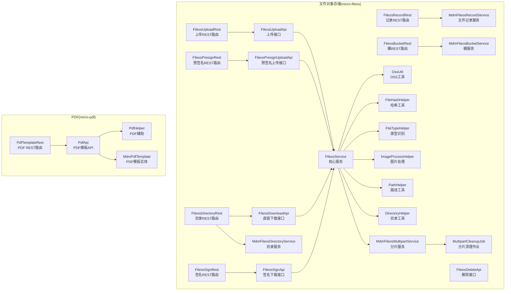
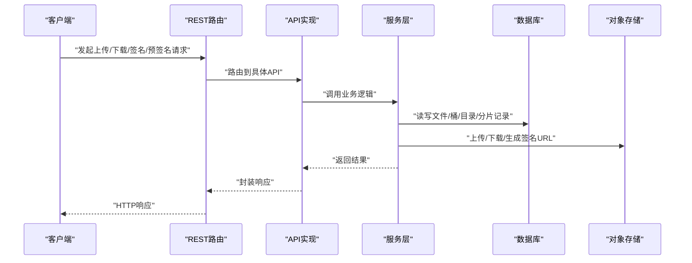
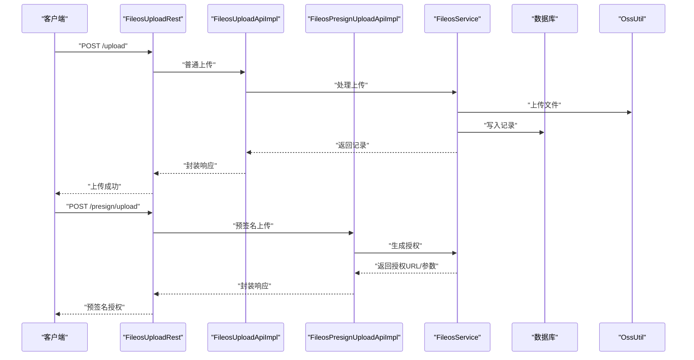
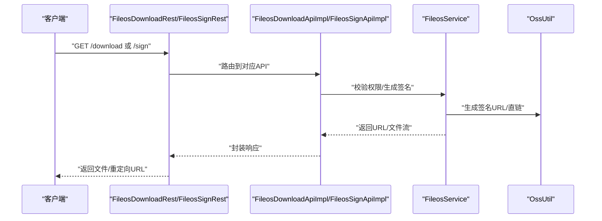
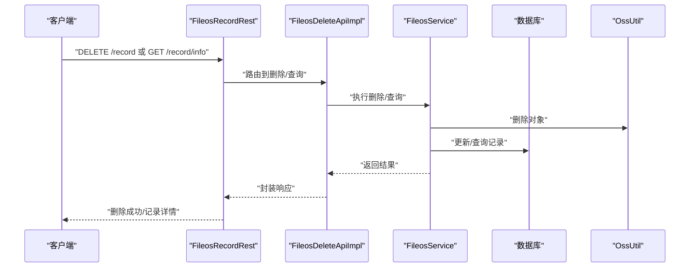
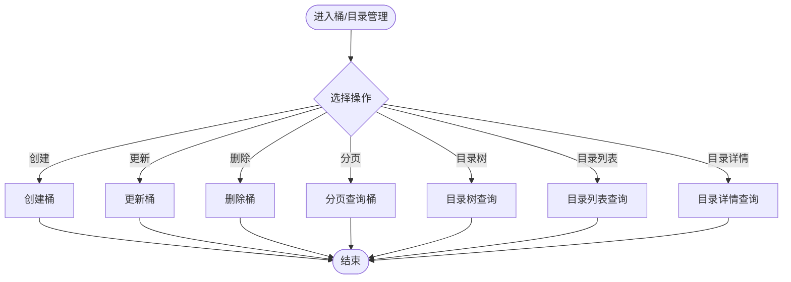
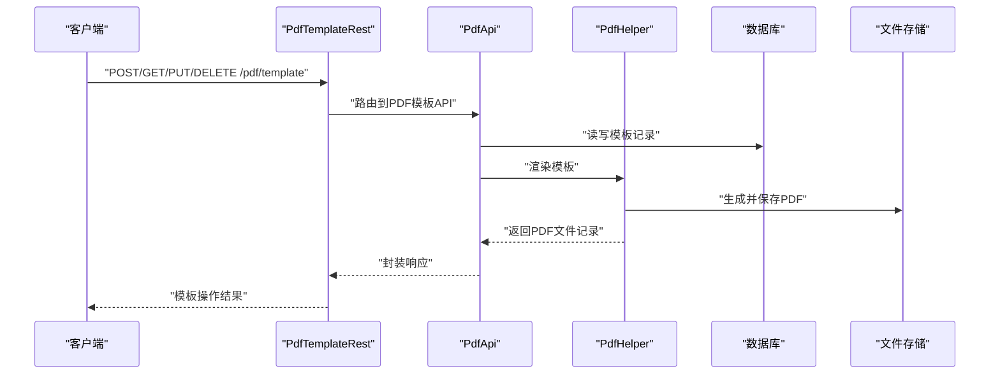
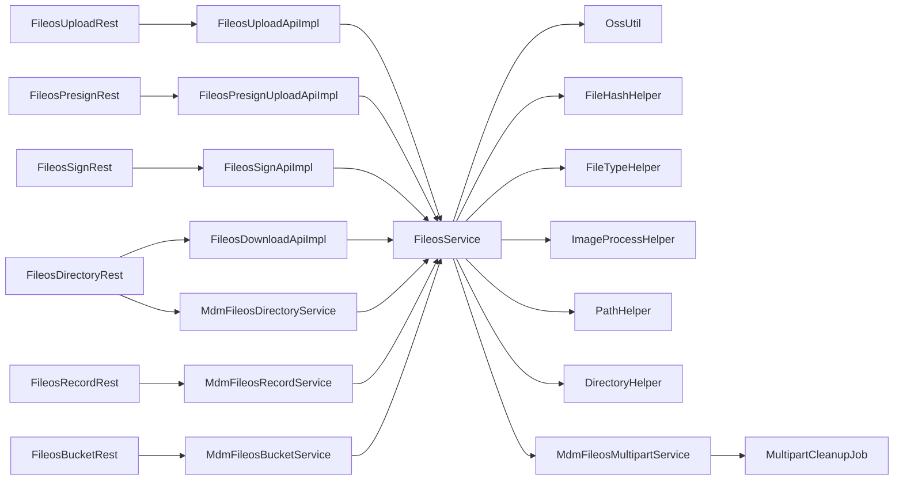
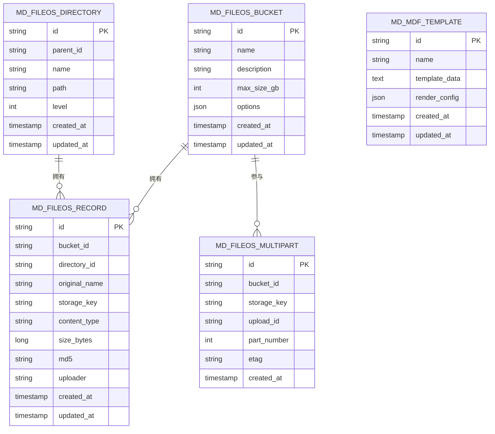

# 文件文档API

<cite>
**本文引用的文件**
- [FileosUploadApi.java](file://micro-fileos/src/main/java/com/wkclz/micro/fileos/api/FileosUploadApi.java)
- [FileosPresignUploadApi.java](file://micro-fileos/src/main/java/com/wkclz/micro/fileos/api/FileosPresignUploadApi.java)
- [FileosDownloadApi.java](file://micro-fileos/src/main/java/com/wkclz/micro/fileos/api/FileosDownloadApi.java)
- [FileosSignApi.java](file://micro-fileos/src/main/java/com/wkclz/micro/fileos/api/FileosSignApi.java)
- [FileosDeleteApi.java](file://micro-fileos/src/main/java/com/wkclz/micro/fileos/api/FileosDeleteApi.java)
- [FileosUploadRest.java](file://micro-fileos/src/main/java/com/wkclz/micro/fileos/rest/FileosUploadRest.java)
- [FileosPresignRest.java](file://micro-fileos/src/main/java/com/wkclz/micro/fileos/rest/FileosPresignRest.java)
- [FileosDownloadRest.java](file://micro-fileos/src/main/java/com/wkclz/micro/fileos/rest/FileosDownloadRest.java)
- [FileosSignRest.java](file://micro-fileos/src/main/java/com/wkclz/micro/fileos/rest/FileosSignRest.java)
- [FileosRecordRest.java](file://micro-fileos/src/main/java/com/wkclz/micro/fileos/rest/FileosRecordRest.java)
- [FileosBucketRest.java](file://micro-fileos/src/main/java/com/wkclz/micro/fileos/rest/FileosBucketRest.java)
- [FileosDirectoryRest.java](file://micro-fileos/src/main/java/com/wkclz/micro/fileos/rest/FileosDirectoryRest.java)
- [FileosService.java](file://micro-fileos/src/main/java/com/wkclz/micro/fileos/service/FileosService.java)
- [MdmFileosRecordService.java](file://micro-fileos/src/main/java/com/wkclz/micro/fileos/service/MdmFileosRecordService.java)
- [MdmFileosBucketService.java](file://micro-fileos/src/main/java/com/wkclz/micro/fileos/service/MdmFileosBucketService.java)
- [MdmFileosDirectoryService.java](file://micro-fileos/src/main/java/com/wkclz/micro/fileos/service/MdmFileosDirectoryService.java)
- [MdmFileosMultipartService.java](file://micro-fileos/src/main/java/com/wkclz/micro/fileos/service/MdmFileosMultipartService.java)
- [OssUtil.java](file://micro-fileos/src/main/java/com/wkclz/micro/fileos/utils/OssUtil.java)
- [FileHashHelper.java](file://micro-fileos/src/main/java/com/wkclz/micro/fileos/helper/FileHashHelper.java)
- [FileTypeHelper.java](file://micro-fileos/src/main/java/com/wkclz/micro/fileos/helper/FileTypeHelper.java)
- [ImageProcessHelper.java](file://micro-fileos/src/main/java/com/wkclz/micro/fileos/helper/ImageProcessHelper.java)
- [PathHelper.java](file://micro-fileos/src/main/java/com/wkclz/micro/fileos/helper/PathHelper.java)
- [DirectoryHelper.java](file://micro-fileos/src/main/java/com/wkclz/micro/fileos/helper/DirectoryHelper.java)
- [MultipartCleanupJob.java](file://micro-fileos/src/main/java/com/wkclz/micro/fileos/job/MultipartCleanupJob.java)
- [MdmFileosRecord.java](file://micro-fileos/src/main/java/com/wkclz/micro/fileos/bean/entity/MdmFileosRecord.java)
- [MdmFileosBucket.java](file://micro-fileos/src/main/java/com/wkclz/micro/fileos/bean/entity/MdmFileosBucket.java)
- [MdmFileosDirectory.java](file://micro-fileos/src/main/java/com/wkclz/micro/fileos/bean/entity/MdmFileosDirectory.java)
- [MdmFileosMultipart.java](file://micro-fileos/src/main/java/com/wkclz/micro/fileos/bean/entity/MdmFileosMultipart.java)
- [PresignUploadReq.java](file://micro-fileos/src/main/java/com/wkclz/micro/fileos/bean/req/PresignUploadReq.java)
- [PresignCompleteReq.java](file://micro-fileos/src/main/java/com/wkclz/micro/fileos/bean/req/PresignCompleteReq.java)
- [DownloadReq.java](file://micro-fileos/src/main/java/com/wkclz/micro/fileos/bean/req/DownloadReq.java)
- [RecordInfoReq.java](file://micro-fileos/src/main/java/com/wkclz/micro/fileos/bean/req/RecordInfoReq.java)
- [BucketCreateReq.java](file://micro-fileos/src/main/java/com/wkclz/micro/fileos/bean/req/BucketCreateReq.java)
- [BucketUpdateReq.java](file://micro-fileos/src/main/java/com/wkclz/micro/fileos/bean/req/BucketUpdateReq.java)
- [BucketRemoveReq.java](file://micro-fileos/src/main/java/com/wkclz/micro/fileos/bean/req/BucketRemoveReq.java)
- [BucketPageReq.java](file://micro-fileos/src/main/java/com/wkclz/micro/fileos/bean/req/BucketPageReq.java)
- [DirectoryInfoReq.java](file://micro-fileos/src/main/java/com/wkclz/micro/fileos/bean/req/DirectoryInfoReq.java)
- [DirectoryListReq.java](file://micro-fileos/src/main/java/com/wkclz/micro/fileos/bean/req/DirectoryListReq.java)
- [DirectoryTreeReq.java](file://micro-fileos/src/main/java/com/wkclz/micro/fileos/bean/req/DirectoryTreeReq.java)
- [ContentTypeEnum.java](file://micro-fileos/src/main/java/com/wkclz/micro/fileos/bean/enums/ContentTypeEnum.java)
- [UploadTypeEnum.java](file://micro-fileos/src/main/java/com/wkclz/micro/fileos/bean/enums/UploadTypeEnum.java)
- [UploadStatusEnum.java](file://micro-fileos/src/main/java/com/wkclz/micro/fileos/bean/enums/UploadStatusEnum.java)
- [OssSpEnum.java](file://micro-fileos/src/main/java/com/wkclz/micro/fileos/bean/enums/OssSpEnum.java)
- [FileosConstant.java](file://micro-fileos/src/main/java/com/wkclz/micro/fileos/bean/FileosConstant.java)
- [FileosConfig.java](file://micro-fileos/src/main/java/com/wkclz/micro/fileos/config/FileosConfig.java)
- [FileosAutoConfig.java](file://micro-fileos/src/main/java/com/wkclz/micro/fileos/FileosAutoConfig.java)
- [Route.java](file://micro-fileos/src/main/java/com/wkclz/micro/fileos/rest/Route.java)
- [configuration-guide.md](file://micro-fileos/docs/configuration-guide.md)
- [integration-guide.md](file://micro-fileos/docs/integration-guide.md)
- [PdfApi.java](file://micro-pdf/src/main/java/com/wkclz/micro/pdf/api/PdfApi.java)
- [PdfTemplateCreateReq.java](file://micro-pdf/src/main/java/com/wkclz/micro/pdf/bean/req/PdfTemplateCreateReq.java)
- [PdfTemplateInfoReq.java](file://micro-pdf/src/main/java/com/wkclz/micro/pdf/bean/req/PdfTemplateInfoReq.java)
- [PdfTemplateMockReq.java](file://micro-pdf/src/main/java/com/wkclz/micro/pdf/bean/req/PdfTemplateMockReq.java)
- [PdfTemplatePageReq.java](file://micro-pdf/src/main/java/com/wkclz/micro/pdf/bean/req/PdfTemplatePageReq.java)
- [PdfTemplateRemoveReq.java](file://micro-pdf/src/main/java/com/wkclz/micro/pdf/bean/req/PdfTemplateRemoveReq.java)
- [PdfTemplateUpdateReq.java](file://micro-pdf/src/main/java/com/wkclz/micro/pdf/bean/req/PdfTemplateUpdateReq.java)
- [PdfTemplateInfoResp.java](file://micro-pdf/src/main/java/com/wkclz/micro/pdf/bean/resp/PdfTemplateInfoResp.java)
- [PdfTemplatePageResp.java](file://micro-pdf/src/main/java/com/wkclz/micro/pdf/bean/resp/PdfTemplatePageResp.java)
- [MdmPdfTemplate.java](file://micro-pdf/src/main/java/com/wkclz/micro/pdf/bean/entity/MdmPdfTemplate.java)
- [PdfHelper.java](file://micro-pdf/src/main/java/com/wkclz/micro/pdf/helper/PdfHelper.java)
- [PdfTemplateRest.java](file://micro-pdf/src/main/java/com/wkclz/micro/pdf/rest/PdfTemplateRest.java)
- [PdfAutoConfig.java](file://micro-pdf/src/main/java/com/wkclz/micro/pdf/PdfAutoConfig.java)
- [README.md](file://docs/living-docs-business/file文档/README.md)
- [文件签名下载.md](file://docs/living-docs-business/文件文档/002-文件签名下载.md)
- [文件预签名上传.md](file://docs/living-docs-business/文件文档/003-文件预签名上传.md)
- [文件桶与目录.md](file://docs/living-docs-business/文件文档/004-文件桶与目录.md)
</cite>

## 目录
1. [简介](#简介)
2. [项目结构](#项目结构)
3. [核心组件](#核心组件)
4. [架构总览](#架构总览)
5. [详细组件分析](#详细组件分析)
6. [依赖关系分析](#依赖关系分析)
7. [性能考虑](#性能考虑)
8. [故障排查指南](#故障排查指南)
9. [结论](#结论)
10. [附录](#附录)

## 简介
本文件文档面向文件文档相关API，覆盖文件存储、文件签名下载、预签名上传、PDF模板生成与渲染等能力。文档从系统架构、接口规范、数据模型、流程图解、错误码、安全与权限、性能优化到故障排查进行全栈式说明，并提供实际使用场景与最佳实践建议。

## 项目结构
文件文档能力主要由两个微服务模块构成：
- micro-fileos：文件对象存储与文件生命周期管理（上传、签名下载、预签名上传、分片清理、桶与目录管理）
- micro-pdf：PDF模板管理与渲染（模板 CRUD、模拟渲染、分页查询）

**图表来源**
- [FileosUploadRest.java](file://micro-fileos/src/main/java/com/wkclz/micro/fileos/rest/FileosUploadRest.java)
- [FileosPresignRest.java](file://micro-fileos/src/main/java/com/wkclz/micro/fileos/rest/FileosPresignRest.java)
- [FileosDownloadRest.java](file://micro-fileos/src/main/java/com/wkclz/micro/fileos/rest/FileosDownloadRest.java)
- [FileosSignRest.java](file://micro-fileos/src/main/java/com/wkclz/micro/fileos/rest/FileosSignRest.java)
- [FileosRecordRest.java](file://micro-fileos/src/main/java/com/wkclz/micro/fileos/rest/FileosRecordRest.java)
- [FileosBucketRest.java](file://micro-fileos/src/main/java/com/wkclz/micro/fileos/rest/FileosBucketRest.java)
- [FileosDirectoryRest.java](file://micro-fileos/src/main/java/com/wkclz/micro/fileos/rest/FileosDirectoryRest.java)
- [FileosService.java](file://micro-fileos/src/main/java/com/wkclz/micro/fileos/service/FileosService.java)
- [MdmFileosRecordService.java](file://micro-fileos/src/main/java/com/wkclz/micro/fileos/service/MdmFileosRecordService.java)
- [MdmFileosBucketService.java](file://micro-fileos/src/main/java/com/wkclz/micro/fileos/service/MdmFileosBucketService.java)
- [MdmFileosDirectoryService.java](file://micro-fileos/src/main/java/com/wkclz/micro/fileos/service/MdmFileosDirectoryService.java)
- [MdmFileosMultipartService.java](file://micro-fileos/src/main/java/com/wkclz/micro/fileos/service/MdmFileosMultipartService.java)
- [OssUtil.java](file://micro-fileos/src/main/java/com/wkclz/micro/fileos/utils/OssUtil.java)
- [FileHashHelper.java](file://micro-fileos/src/main/java/com/wkclz/micro/fileos/helper/FileHashHelper.java)
- [FileTypeHelper.java](file://micro-fileos/src/main/java/com/wkclz/micro/fileos/helper/FileTypeHelper.java)
- [ImageProcessHelper.java](file://micro-fileos/src/main/java/com/wkclz/micro/fileos/helper/ImageProcessHelper.java)
- [PathHelper.java](file://micro-fileos/src/main/java/com/wkclz/micro/fileos/helper/PathHelper.java)
- [DirectoryHelper.java](file://micro-fileos/src/main/java/com/wkclz/micro/fileos/helper/DirectoryHelper.java)
- [MultipartCleanupJob.java](file://micro-fileos/src/main/java/com/wkclz/micro/fileos/job/MultipartCleanupJob.java)
- [PdfApi.java](file://micro-pdf/src/main/java/com/wkclz/micro/pdf/api/PdfApi.java)
- [PdfTemplateRest.java](file://micro-pdf/src/main/java/com/wkclz/micro/pdf/rest/PdfTemplateRest.java)
- [PdfHelper.java](file://micro-pdf/src/main/java/com/wkclz/micro/pdf/helper/PdfHelper.java)
- [MdmPdfTemplate.java](file://micro-pdf/src/main/java/com/wkclz/micro/pdf/bean/entity/MdmPdfTemplate.java)

**章节来源**
- [FileosAutoConfig.java](file://micro-fileos/src/main/java/com/wkclz/micro/fileos/FileosAutoConfig.java)
- [PdfAutoConfig.java](file://micro-pdf/src/main/java/com/wkclz/micro/pdf/PdfAutoConfig.java)

## 核心组件
- 文件上传与直链下载：支持普通上传与直链下载；签名下载用于安全授权访问。
- 预签名上传：客户端在服务端生成上传授权，降低服务端暴露敏感凭证的风险。
- 分片上传与清理：支持初始化、上传分片、完成与取消，后台定时清理超时分片。
- 桶与目录管理：统一的存储桶配置、目录树与目录列表查询。
- 文件类型识别与图片处理：自动识别内容类型并按需进行图片处理。
- PDF模板：模板 CRUD、分页查询、模拟渲染，结合文件存储实现文档生成与输出。

**章节来源**
- [FileosService.java](file://micro-fileos/src/main/java/com/wkclz/micro/fileos/service/FileosService.java)
- [MdmFileosRecordService.java](file://micro-fileos/src/main/java/com/wkclz/micro/fileos/service/MdmFileosRecordService.java)
- [MdmFileosBucketService.java](file://micro-fileos/src/main/java/com/wkclz/micro/fileos/service/MdmFileosBucketService.java)
- [MdmFileosDirectoryService.java](file://micro-fileos/src/main/java/com/wkclz/micro/fileos/service/MdmFileosDirectoryService.java)
- [MdmFileosMultipartService.java](file://micro-fileos/src/main/java/com/wkclz/micro/fileos/service/MdmFileosMultipartService.java)
- [PdfApi.java](file://micro-pdf/src/main/java/com/wkclz/micro/pdf/api/PdfApi.java)

## 架构总览
文件文档系统采用“REST 接口层 → API 实现层 → 服务层 → 工具与持久化”的分层设计。上传与下载通过服务层协调 OSS 工具与数据库记录；预签名上传与签名下载通过授权令牌与时间窗口保障安全性；PDF 模板与文件存储解耦，通过模板 ID 关联文件记录。

**图表来源**
- [FileosUploadRest.java](file://micro-fileos/src/main/java/com/wkclz/micro/fileos/rest/FileosUploadRest.java)
- [FileosPresignRest.java](file://micro-fileos/src/main/java/com/wkclz/micro/fileos/rest/FileosPresignRest.java)
- [FileosDownloadRest.java](file://micro-fileos/src/main/java/com/wkclz/micro/fileos/rest/FileosDownloadRest.java)
- [FileosSignRest.java](file://micro-fileos/src/main/java/com/wkclz/micro/fileos/rest/FileosSignRest.java)
- [FileosRecordRest.java](file://micro-fileos/src/main/java/com/wkclz/micro/fileos/rest/FileosRecordRest.java)
- [FileosBucketRest.java](file://micro-fileos/src/main/java/com/wkclz/micro/fileos/rest/FileosBucketRest.java)
- [FileosDirectoryRest.java](file://micro-fileos/src/main/java/com/wkclz/micro/fileos/rest/FileosDirectoryRest.java)
- [FileosService.java](file://micro-fileos/src/main/java/com/wkclz/micro/fileos/service/FileosService.java)
- [OssUtil.java](file://micro-fileos/src/main/java/com/wkclz/micro/fileos/utils/OssUtil.java)

## 详细组件分析

### 上传接口
- 普通上传：客户端直传或服务端代理上传，返回文件记录信息与可访问地址。
- 预签名上传：服务端生成带有效期的上传授权，客户端直传至对象存储，提升安全性。
- 分片上传：初始化分片、上传分片、完成合并，支持取消与清理。

**图表来源**
- [FileosUploadRest.java](file://micro-fileos/src/main/java/com/wkclz/micro/fileos/rest/FileosUploadRest.java)
- [FileosPresignRest.java](file://micro-fileos/src/main/java/com/wkclz/micro/fileos/rest/FileosPresignRest.java)
- [FileosUploadApi.java](file://micro-fileos/src/main/java/com/wkclz/micro/fileos/api/FileosUploadApi.java)
- [FileosPresignUploadApi.java](file://micro-fileos/src/main/java/com/wkclz/micro/fileos/api/FileosPresignUploadApi.java)
- [FileosService.java](file://micro-fileos/src/main/java/com/wkclz/micro/fileos/service/FileosService.java)
- [OssUtil.java](file://micro-fileos/src/main/java/com/wkclz/micro/fileos/utils/OssUtil.java)

**章节来源**
- [FileosUploadApi.java](file://micro-fileos/src/main/java/com/wkclz/micro/fileos/api/FileosUploadApi.java)
- [FileosPresignUploadApi.java](file://micro-fileos/src/main/java/com/wkclz/micro/fileos/api/FileosPresignUploadApi.java)
- [PresignUploadReq.java](file://micro-fileos/src/main/java/com/wkclz/micro/fileos/bean/req/PresignUploadReq.java)
- [PresignCompleteReq.java](file://micro-fileos/src/main/java/com/wkclz/micro/fileos/bean/req/PresignCompleteReq.java)

### 下载与签名下载
- 直链下载：适用于已知文件标识且无需额外鉴权的场景。
- 签名下载：通过签名 URL 在限定时间内授权访问，兼顾安全与易用性。

**图表来源**
- [FileosDownloadRest.java](file://micro-fileos/src/main/java/com/wkclz/micro/fileos/rest/FileosDownloadRest.java)
- [FileosSignRest.java](file://micro-fileos/src/main/java/com/wkclz/micro/fileos/rest/FileosSignRest.java)
- [FileosDownloadApi.java](file://micro-fileos/src/main/java/com/wkclz/micro/fileos/api/FileosDownloadApi.java)
- [FileosSignApi.java](file://micro-fileos/src/main/java/com/wkclz/micro/fileos/api/FileosSignApi.java)
- [DownloadReq.java](file://micro-fileos/src/main/java/com/wkclz/micro/fileos/bean/req/DownloadReq.java)
- [OssUtil.java](file://micro-fileos/src/main/java/com/wkclz/micro/fileos/utils/OssUtil.java)

**章节来源**
- [FileosDownloadApi.java](file://micro-fileos/src/main/java/com/wkclz/micro/fileos/api/FileosDownloadApi.java)
- [FileosSignApi.java](file://micro-fileos/src/main/java/com/wkclz/micro/fileos/api/FileosSignApi.java)
- [DownloadReq.java](file://micro-fileos/src/main/java/com/wkclz/micro/fileos/bean/req/DownloadReq.java)

### 删除与记录查询
- 删除：支持按文件标识删除记录与对象存储中的文件。
- 记录查询：支持按条件分页查询文件记录，便于审计与管理。

**图表来源**
- [FileosRecordRest.java](file://micro-fileos/src/main/java/com/wkclz/micro/fileos/rest/FileosRecordRest.java)
- [FileosDeleteApi.java](file://micro-fileos/src/main/java/com/wkclz/micro/fileos/api/FileosDeleteApi.java)
- [FileosService.java](file://micro-fileos/src/main/java/com/wkclz/micro/fileos/service/FileosService.java)
- [OssUtil.java](file://micro-fileos/src/main/java/com/wkclz/micro/fileos/utils/OssUtil.java)

**章节来源**
- [FileosDeleteApi.java](file://micro-fileos/src/main/java/com/wkclz/micro/fileos/api/FileosDeleteApi.java)
- [RecordInfoReq.java](file://micro-fileos/src/main/java/com/wkclz/micro/fileos/bean/req/RecordInfoReq.java)

### 桶与目录管理
- 桶：创建、更新、删除、分页查询存储桶，设置桶级策略。
- 目录：目录树、目录列表、目录详情，支持路径规范化与层级管理。

**图表来源**
- [FileosBucketRest.java](file://micro-fileos/src/main/java/com/wkclz/micro/fileos/rest/FileosBucketRest.java)
- [FileosDirectoryRest.java](file://micro-fileos/src/main/java/com/wkclz/micro/fileos/rest/FileosDirectoryRest.java)
- [BucketCreateReq.java](file://micro-fileos/src/main/java/com/wkclz/micro/fileos/bean/req/BucketCreateReq.java)
- [BucketUpdateReq.java](file://micro-fileos/src/main/java/com/wkclz/micro/fileos/bean/req/BucketUpdateReq.java)
- [BucketRemoveReq.java](file://micro-fileos/src/main/java/com/wkclz/micro/fileos/bean/req/BucketRemoveReq.java)
- [BucketPageReq.java](file://micro-fileos/src/main/java/com/wkclz/micro/fileos/bean/req/BucketPageReq.java)
- [DirectoryInfoReq.java](file://micro-fileos/src/main/java/com/wkclz/micro/fileos/bean/req/DirectoryInfoReq.java)
- [DirectoryListReq.java](file://micro-fileos/src/main/java/com/wkclz/micro/fileos/bean/req/DirectoryListReq.java)
- [DirectoryTreeReq.java](file://micro-fileos/src/main/java/com/wkclz/micro/fileos/bean/req/DirectoryTreeReq.java)

**章节来源**
- [MdmFileosBucketService.java](file://micro-fileos/src/main/java/com/wkclz/micro/fileos/service/MdmFileosBucketService.java)
- [MdmFileosDirectoryService.java](file://micro-fileos/src/main/java/com/wkclz/micro/fileos/service/MdmFileosDirectoryService.java)

### PDF 模板与生成
- 模板 CRUD：创建、查询、更新、删除 PDF 模板。
- 分页与详情：支持分页查询与详情获取。
- 模拟渲染：基于模板进行数据填充与渲染，便于预览与调试。

**图表来源**
- [PdfTemplateRest.java](file://micro-pdf/src/main/java/com/wkclz/micro/pdf/rest/PdfTemplateRest.java)
- [PdfApi.java](file://micro-pdf/src/main/java/com/wkclz/micro/pdf/api/PdfApi.java)
- [PdfHelper.java](file://micro-pdf/src/main/java/com/wkclz/micro/pdf/helper/PdfHelper.java)
- [MdmPdfTemplate.java](file://micro-pdf/src/main/java/com/wkclz/micro/pdf/bean/entity/MdmPdfTemplate.java)

**章节来源**
- [PdfApi.java](file://micro-pdf/src/main/java/com/wkclz/micro/pdf/api/PdfApi.java)
- [PdfTemplateCreateReq.java](file://micro-pdf/src/main/java/com/wkclz/micro/pdf/bean/req/PdfTemplateCreateReq.java)
- [PdfTemplateInfoReq.java](file://micro-pdf/src/main/java/com/wkclz/micro/pdf/bean/req/PdfTemplateInfoReq.java)
- [PdfTemplateMockReq.java](file://micro-pdf/src/main/java/com/wkclz/micro/pdf/bean/req/PdfTemplateMockReq.java)
- [PdfTemplatePageReq.java](file://micro-pdf/src/main/java/com/wkclz/micro/pdf/bean/req/PdfTemplatePageReq.java)
- [PdfTemplateRemoveReq.java](file://micro-pdf/src/main/java/com/wkclz/micro/pdf/bean/req/PdfTemplateRemoveReq.java)
- [PdfTemplateUpdateReq.java](file://micro-pdf/src/main/java/com/wkclz/micro/pdf/bean/req/PdfTemplateUpdateReq.java)
- [PdfTemplateInfoResp.java](file://micro-pdf/src/main/java/com/wkclz/micro/pdf/bean/resp/PdfTemplateInfoResp.java)
- [PdfTemplatePageResp.java](file://micro-pdf/src/main/java/com/wkclz/micro/pdf/bean/resp/PdfTemplatePageResp.java)

## 依赖关系分析
- 组件内聚：各 REST 路由仅负责请求转发，核心逻辑集中在 API 实现与服务层。
- 外部依赖：对象存储 SDK、数据库 ORM、Spring Boot 自动装配。
- 清理策略：分片上传超时清理作业定期扫描并移除过期分片，避免资源泄露。

**图表来源**
- [FileosUploadRest.java](file://micro-fileos/src/main/java/com/wkclz/micro/fileos/rest/FileosUploadRest.java)
- [FileosPresignRest.java](file://micro-fileos/src/main/java/com/wkclz/micro/fileos/rest/FileosPresignRest.java)
- [FileosDownloadRest.java](file://micro-fileos/src/main/java/com/wkclz/micro/fileos/rest/FileosDownloadRest.java)
- [FileosSignRest.java](file://micro-fileos/src/main/java/com/wkclz/micro/fileos/rest/FileosSignRest.java)
- [FileosRecordRest.java](file://micro-fileos/src/main/java/com/wkclz/micro/fileos/rest/FileosRecordRest.java)
- [FileosBucketRest.java](file://micro-fileos/src/main/java/com/wkclz/micro/fileos/rest/FileosBucketRest.java)
- [FileosDirectoryRest.java](file://micro-fileos/src/main/java/com/wkclz/micro/fileos/rest/FileosDirectoryRest.java)
- [FileosService.java](file://micro-fileos/src/main/java/com/wkclz/micro/fileos/service/FileosService.java)
- [MdmFileosRecordService.java](file://micro-fileos/src/main/java/com/wkclz/micro/fileos/service/MdmFileosRecordService.java)
- [MdmFileosBucketService.java](file://micro-fileos/src/main/java/com/wkclz/micro/fileos/service/MdmFileosBucketService.java)
- [MdmFileosDirectoryService.java](file://micro-fileos/src/main/java/com/wkclz/micro/fileos/service/MdmFileosDirectoryService.java)
- [MdmFileosMultipartService.java](file://micro-fileos/src/main/java/com/wkclz/micro/fileos/service/MdmFileosMultipartService.java)
- [OssUtil.java](file://micro-fileos/src/main/java/com/wkclz/micro/fileos/utils/OssUtil.java)
- [FileHashHelper.java](file://micro-fileos/src/main/java/com/wkclz/micro/fileos/helper/FileHashHelper.java)
- [FileTypeHelper.java](file://micro-fileos/src/main/java/com/wkclz/micro/fileos/helper/FileTypeHelper.java)
- [ImageProcessHelper.java](file://micro-fileos/src/main/java/com/wkclz/micro/fileos/helper/ImageProcessHelper.java)
- [PathHelper.java](file://micro-fileos/src/main/java/com/wkclz/micro/fileos/helper/PathHelper.java)
- [DirectoryHelper.java](file://micro-fileos/src/main/java/com/wkclz/micro/fileos/helper/DirectoryHelper.java)
- [MultipartCleanupJob.java](file://micro-fileos/src/main/java/com/wkclz/micro/fileos/job/MultipartCleanupJob.java)

**章节来源**
- [FileosAutoConfig.java](file://micro-fileos/src/main/java/com/wkclz/micro/fileos/FileosAutoConfig.java)
- [PdfAutoConfig.java](file://micro-pdf/src/main/java/com/wkclz/micro/pdf/PdfAutoConfig.java)

## 性能考虑
- 预签名上传：减少服务端中转，降低延迟与带宽占用。
- 分片上传：大文件分块传输，提升稳定性与断点续传能力。
- 缓存策略：桶与模板缓存可显著降低重复查询开销。
- 图片处理：按需处理缩略图与水印，避免不必要的计算。
- 清理作业：定期清理过期分片，防止存储膨胀与垃圾数据积累。

[本节为通用性能建议，不直接分析具体文件]

## 故障排查指南
- 上传失败
  - 检查桶配置与权限、路径合法性、文件类型是否受支持。
  - 查看分片初始化与完成状态，确认分片完整性。
- 下载/签名失败
  - 校验签名时间窗口与权限范围，确认对象存在且未被删除。
- 预签名无效
  - 确认授权参数与有效期，检查客户端网络与代理设置。
- PDF 渲染异常
  - 校验模板字段映射与数据源，确认字体与页面尺寸配置。
- 存储清理
  - 触发或检查分片清理作业，确认任务调度与日志。

**章节来源**
- [MultipartCleanupJob.java](file://micro-fileos/src/main/java/com/wkclz/micro/fileos/job/MultipartCleanupJob.java)
- [OssUtil.java](file://micro-fileos/src/main/java/com/wkclz/micro/fileos/utils/OssUtil.java)
- [PdfHelper.java](file://micro-pdf/src/main/java/com/wkclz/micro/pdf/helper/PdfHelper.java)

## 结论
文件文档API以清晰的分层架构与完善的工具链支撑了上传、下载、签名、预签名、分片、桶与目录管理以及PDF模板渲染等核心能力。通过预签名与签名机制强化安全，通过分片与清理作业保障性能与稳定，结合业务文档与最佳实践，可满足企业级文件与文档管理需求。

[本节为总结性内容，不直接分析具体文件]

## 附录

### 接口规范与参数说明（示例）
- 上传
  - 方法：POST
  - 路径：/upload
  - 请求体：包含桶标识、目录路径、文件名、类型等
  - 响应：文件记录与访问地址
- 预签名上传
  - 方法：POST
  - 路径：/presign/upload
  - 请求体：桶标识、目录路径、文件名、期望类型、有效期
  - 响应：授权URL与必要参数
- 签名下载
  - 方法：GET
  - 路径：/sign
  - 查询参数：文件标识、有效期、签名算法
  - 响应：重定向URL或文件流
- 直链下载
  - 方法：GET
  - 路径：/download
  - 查询参数：文件标识
  - 响应：文件流
- 删除
  - 方法：DELETE
  - 路径：/record
  - 请求体：文件标识
  - 响应：删除结果
- 记录查询
  - 方法：GET
  - 路径：/record/info
  - 查询参数：文件标识
  - 响应：文件记录详情
- 桶管理
  - 创建：POST /bucket/create
  - 更新：POST /bucket/update
  - 删除：POST /bucket/remove
  - 分页：POST /bucket/page
- 目录管理
  - 目录树：POST /directory/tree
  - 目录列表：POST /directory/list
  - 目录详情：POST /directory/info

**章节来源**
- [FileosUploadRest.java](file://micro-fileos/src/main/java/com/wkclz/micro/fileos/rest/FileosUploadRest.java)
- [FileosPresignRest.java](file://micro-fileos/src/main/java/com/wkclz/micro/fileos/rest/FileosPresignRest.java)
- [FileosDownloadRest.java](file://micro-fileos/src/main/java/com/wkclz/micro/fileos/rest/FileosDownloadRest.java)
- [FileosSignRest.java](file://micro-fileos/src/main/java/com/wkclz/micro/fileos/rest/FileosSignRest.java)
- [FileosRecordRest.java](file://micro-fileos/src/main/java/com/wkclz/micro/fileos/rest/FileosRecordRest.java)
- [FileosBucketRest.java](file://micro-fileos/src/main/java/com/wkclz/micro/fileos/rest/FileosBucketRest.java)
- [FileosDirectoryRest.java](file://micro-fileos/src/main/java/com/wkclz/micro/fileos/rest/FileosDirectoryRest.java)

### 错误码与状态码
- 通用错误码
  - 400：请求参数缺失或非法
  - 401：未授权或签名无效
  - 403：权限不足
  - 404：资源不存在
  - 500：服务器内部错误
- 业务错误码
  - 1001：桶不存在
  - 1002：目录不存在
  - 1003：文件记录不存在
  - 1004：分片初始化失败
  - 1005：分片完成失败
  - 1006：签名过期
  - 1007：模板不存在
  - 1008：渲染失败

**章节来源**
- [FileosConstant.java](file://micro-fileos/src/main/java/com/wkclz/micro/fileos/bean/FileosConstant.java)

### 安全机制与权限控制
- 签名下载：基于时间窗口与签名算法生成一次性访问链接。
- 预签名上传：服务端签发临时授权，客户端直传对象存储。
- 权限校验：REST 层与服务层双重校验用户与桶权限。
- 最小权限原则：桶与目录粒度控制访问范围。

**章节来源**
- [FileosSignApi.java](file://micro-fileos/src/main/java/com/wkclz/micro/fileos/api/FileosSignApi.java)
- [FileosPresignUploadApi.java](file://micro-fileos/src/main/java/com/wkclz/micro/fileos/api/FileosPresignUploadApi.java)
- [OssUtil.java](file://micro-fileos/src/main/java/com/wkclz/micro/fileos/utils/OssUtil.java)

### 使用场景与最佳实践
- 场景一：大文件上传
  - 使用预签名上传 + 分片上传，提升成功率与速度。
- 场景二：多租户文件管理
  - 按桶隔离，按目录分级，配合权限控制。
- 场景三：文档生成与分发
  - PDF 模板 + 文件存储，先渲染后签名分发。
- 最佳实践
  - 合理设置签名有效期与刷新策略
  - 对敏感文件启用签名下载
  - 定期清理过期分片与无主文件
  - 使用缓存与CDN加速热点文件

**章节来源**
- [MultipartCleanupJob.java](file://micro-fileos/src/main/java/com/wkclz/micro/fileos/job/MultipartCleanupJob.java)
- [PdfHelper.java](file://micro-pdf/src/main/java/com/wkclz/micro/pdf/helper/PdfHelper.java)

### 数据模型

**图表来源**
- [MdmFileosRecord.java](file://micro-fileos/src/main/java/com/wkclz/micro/fileos/bean/entity/MdmFileosRecord.java)
- [MdmFileosBucket.java](file://micro-fileos/src/main/java/com/wkclz/micro/fileos/bean/entity/MdmFileosBucket.java)
- [MdmFileosDirectory.java](file://micro-fileos/src/main/java/com/wkclz/micro/fileos/bean/entity/MdmFileosDirectory.java)
- [MdmFileosMultipart.java](file://micro-fileos/src/main/java/com/wkclz/micro/fileos/bean/entity/MdmFileosMultipart.java)
- [MdmPdfTemplate.java](file://micro-pdf/src/main/java/com/wkclz/micro/pdf/bean/entity/MdmPdfTemplate.java)