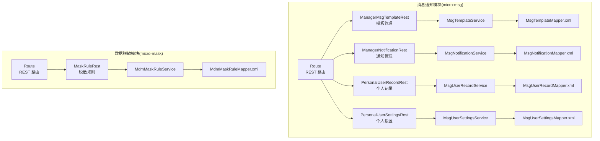
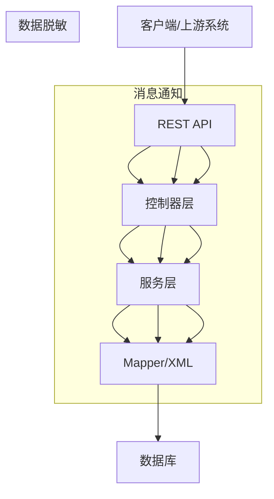
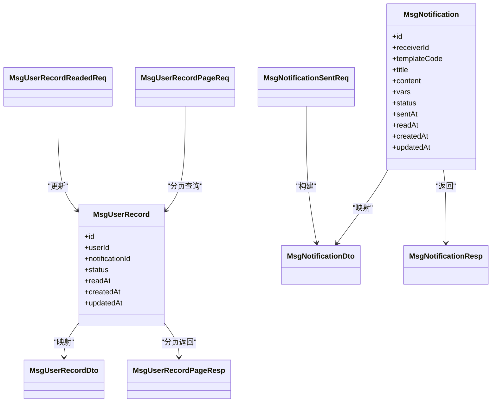
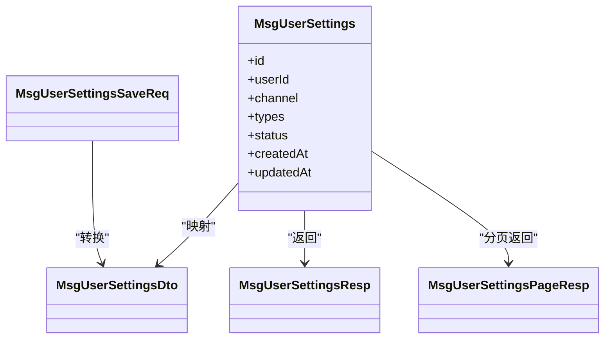
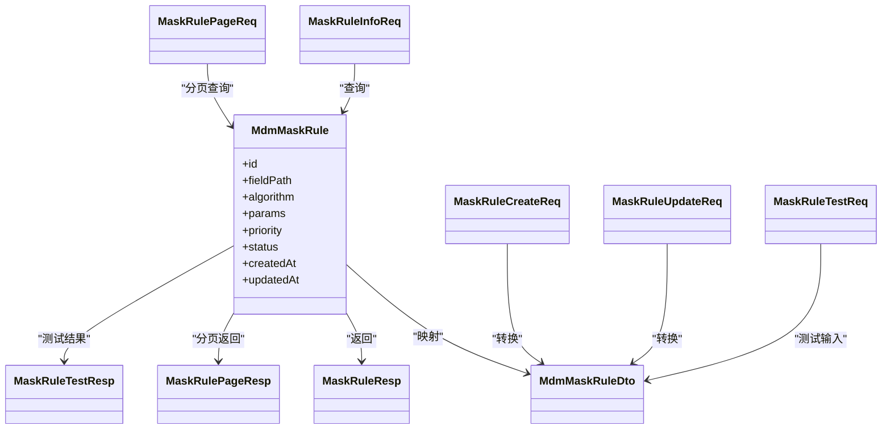
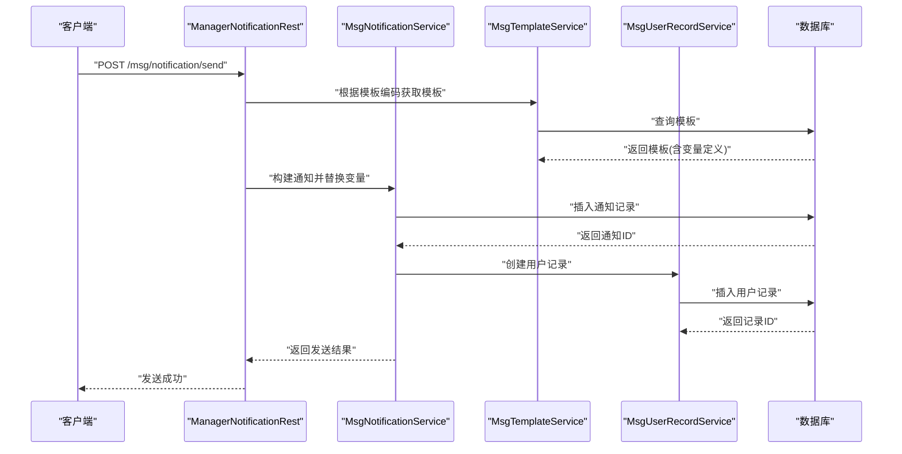
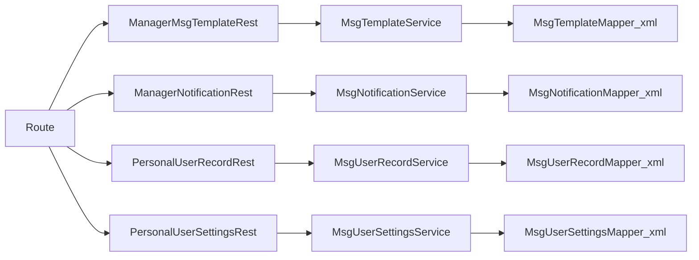

# 消息通知API

<cite>
**本文档引用的文件**
- [micro-msg/src/main/java/com/wkclz/micro/msg/MsgAutoConfig.java](file://micro-msg/src/main/java/com/wkclz/micro/msg/MsgAutoConfig.java)
- [micro-msg/src/main/java/com/wkclz/micro/msg/rest/Route.java](file://micro-msg/src/main/java/com/wkclz/micro/msg/rest/Route.java)
- [micro-msg/src/main/java/com/wkclz/micro/msg/rest/ManagerMsgTemplateRest.java](file://micro-msg/src/main/java/com/wkclz/micro/msg/rest/ManagerMsgTemplateRest.java)
- [micro-msg/src/main/java/com/wkclz/micro/msg/rest/ManagerNotificationRest.java](file://micro-msg/src/main/java/com/wkclz/micro/msg/rest/ManagerNotificationRest.java)
- [micro-msg/src/main/java/com/wkclz/micro/msg/rest/PersonalUserRecordRest.java](file://micro-msg/src/main/java/com/wkclz/micro/msg/rest/PersonalUserRecordRest.java)
- [micro-msg/src/main/java/com/wkclz/micro/msg/rest/PersonalUserSettingsRest.java](file://micro-msg/src/main/java/com/wkclz/micro/msg/rest/PersonalUserSettingsRest.java)
- [micro-msg/src/main/java/com/wkclz/micro/msg/service/MsgTemplateService.java](file://micro-msg/src/main/java/com/wkclz/micro/msg/service/MsgTemplateService.java)
- [micro-msg/src/main/java/com/wkclz/micro/msg/service/MsgNotificationService.java](file://micro-msg/src/main/java/com/wkclz/micro/msg/service/MsgNotificationService.java)
- [micro-msg/src/main/java/com/wkclz/micro/msg/service/MsgUserRecordService.java](file://micro-msg/src/main/java/com/wkclz/micro/msg/service/MsgUserRecordService.java)
- [micro-msg/src/main/java/com/wkclz/micro/msg/service/MsgUserSettingsService.java](file://micro-msg/src/main/java/com/wkclz/micro/msg/service/MsgUserSettingsService.java)
- [micro-msg/src/main/java/com/wkclz/micro/msg/api/MsgApi.java](file://micro-msg/src/main/java/com/wkclz/micro/msg/api/MsgApi.java)
- [micro-msg/src/main/java/com/wkclz/micro/msg/bean/dto/MsgTemplateDto.java](file://micro-msg/src/main/java/com/wkclz/micro/msg/bean/dto/MsgTemplateDto.java)
- [micro-msg/src/main/java/com/wkclz/micro/msg/bean/dto/MsgNotificationDto.java](file://micro-msg/src/main/java/com/wkclz/micro/msg/bean/dto/MsgNotificationDto.java)
- [micro-msg/src/main/java/com/wkclz/micro/msg/bean/dto/MsgUserRecordDto.java](file://micro-msg/src/main/java/com/wkclz/micro/msg/bean/dto/MsgUserRecordDto.java)
- [micro-msg/src/main/java/com/wkclz/micro/msg/bean/dto/MsgUserSettingsDto.java](file://micro-msg/src/main/java/com/wkclz/micro/msg/bean/dto/MsgUserSettingsDto.java)
- [micro-msg/src/main/java/com/wkclz/micro/msg/bean/entity/MsgTemplate.java](file://micro-msg/src/main/java/com/wkclz/micro/msg/bean/entity/MsgTemplate.java)
- [micro-msg/src/main/java/com/wkclz/micro/msg/bean/entity/MsgNotification.java](file://micro-msg/src/main/java/com/wkclz/micro/msg/bean/entity/MsgNotification.java)
- [micro-msg/src/main/java/com/wkclz/micro/msg/bean/entity/MsgUserRecord.java](file://micro-msg/src/main/java/com/wkclz/micro/msg/bean/entity/MsgUserRecord.java)
- [micro-msg/src/main/java/com/wkclz/micro/msg/bean/entity/MsgUserSettings.java](file://micro-msg/src/main/java/com/wkclz/micro/msg/bean/entity/MsgUserSettings.java)
- [micro-msg/src/main/resources/mapper/MsgTemplateMapper.xml](file://micro-msg/src/main/resources/mapper/MsgTemplateMapper.xml)
- [micro-msg/src/main/resources/mapper/MsgNotificationMapper.xml](file://micro-msg/src/main/resources/mapper/MsgNotificationMapper.xml)
- [micro-msg/src/main/resources/mapper/MsgUserRecordMapper.xml](file://micro-msg/src/main/resources/mapper/MsgUserRecordMapper.xml)
- [micro-msg/src/main/resources/mapper/MsgUserSettingsMapper.xml](file://micro-msg/src/main/resources/mapper/MsgUserSettingsMapper.xml)
- [micro-mask/src/main/java/com/wkclz/micro/mask/MaskAutoConfig.java](file://micro-mask/src/main/java/com/wkclz/micro/mask/MaskAutoConfig.java)
- [micro-mask/src/main/java/com/wkclz/micro/mask/rest/Route.java](file://micro-mask/src/main/java/com/wkclz/micro/mask/rest/Route.java)
- [micro-mask/src/main/java/com/wkclz/micro/mask/rest/MaskRuleRest.java](file://micro-mask/src/main/java/com/wkclz/micro/mask/rest/MaskRuleRest.java)
- [micro-mask/src/main/java/com/wkclz/micro/mask/service/MdmMaskRuleService.java](file://micro-mask/src/main/java/com/wkclz/micro/mask/service/MdmMaskRuleService.java)
- [micro-mask/src/main/java/com/wkclz/micro/mask/bean/dto/MdmMaskRuleDto.java](file://micro-mask/src/main/java/com/wkclz/micro/mask/bean/dto/MdmMaskRuleDto.java)
- [micro-mask/src/main/java/com/wkclz/micro/mask/bean/entity/MdmMaskRule.java](file://micro-mask/src/main/java/com/wkclz/micro/mask/bean/entity/MdmMaskRule.java)
- [micro-mask/src/main/resources/mapper/MdmMaskRuleMapper.xml](file://micro-mask/src/main/resources/mapper/MdmMaskRuleMapper.xml)
- [docs/living-docs-business/README.md](file://docs/living-docs-business/README.md)
- [docs/living-docs-business/消息通知/README.md](file://docs/living-docs-business/消息通知/README.md)
- [docs/living-docs-business/消息通知/001-消息通知.md](file://docs/living-docs-business/消息通知/001-消息通知.md)
</cite>

## 目录
1. [简介](#简介)
2. [项目结构](#项目结构)
3. [核心组件](#核心组件)
4. [架构总览](#架构总览)
5. [详细组件分析](#详细组件分析)
6. [依赖关系分析](#依赖关系分析)
7. [性能考虑](#性能考虑)
8. [故障排查指南](#故障排查指南)
9. [结论](#结论)
10. [附录](#附录)

## 简介
本文件面向消息通知与数据脱敏两个微服务模块，提供完整接口文档与集成指南。内容覆盖：
- 消息模板管理：模板创建、查询、更新与分页
- 用户通知记录：通知发送、状态管理、分页与已读标记
- 个人设置：用户偏好与订阅管理
- 数据脱敏规则：规则配置、算法选择与敏感数据保护
- 发送流程、模板变量替换与订阅管理
- 消息队列处理、异步通知与重试机制
- 监控指标与性能优化建议

## 项目结构
消息通知与数据脱敏分别由独立模块提供能力，均采用标准的 Spring Boot 结构（REST 控制器、Service 层、Mapper/XML 映射）。

图表来源
- [micro-msg/src/main/java/com/wkclz/micro/msg/rest/Route.java](file://micro-msg/src/main/java/com/wkclz/micro/msg/rest/Route.java)
- [micro-msg/src/main/java/com/wkclz/micro/msg/rest/ManagerMsgTemplateRest.java](file://micro-msg/src/main/java/com/wkclz/micro/msg/rest/ManagerMsgTemplateRest.java)
- [micro-msg/src/main/java/com/wkclz/micro/msg/rest/ManagerNotificationRest.java](file://micro-msg/src/main/java/com/wkclz/micro/msg/rest/ManagerNotificationRest.java)
- [micro-msg/src/main/java/com/wkclz/micro/msg/rest/PersonalUserRecordRest.java](file://micro-msg/src/main/java/com/wkclz/micro/msg/rest/PersonalUserRecordRest.java)
- [micro-msg/src/main/java/com/wkclz/micro/msg/rest/PersonalUserSettingsRest.java](file://micro-msg/src/main/java/com/wkclz/micro/msg/rest/PersonalUserSettingsRest.java)
- [micro-mask/src/main/java/com/wkclz/micro/mask/rest/Route.java](file://micro-mask/src/main/java/com/wkclz/micro/mask/rest/Route.java)
- [micro-mask/src/main/java/com/wkclz/micro/mask/rest/MaskRuleRest.java](file://micro-mask/src/main/java/com/wkclz/micro/mask/rest/MaskRuleRest.java)

章节来源
- [micro-msg/src/main/java/com/wkclz/micro/msg/MsgAutoConfig.java](file://micro-msg/src/main/java/com/wkclz/micro/msg/MsgAutoConfig.java)
- [micro-mask/src/main/java/com/wkclz/micro/mask/MaskAutoConfig.java](file://micro-mask/src/main/java/com/wkclz/micro/mask/MaskAutoConfig.java)

## 核心组件
- 消息通知模块（micro-msg）
  - REST 控制器：模板管理、通知管理、个人记录、个人设置
  - Service 层：模板、通知、用户记录、用户设置业务逻辑
  - Mapper/XML：数据库访问层
- 数据脱敏模块（micro-mask）
  - REST 控制器：脱敏规则管理
  - Service 层：规则服务
  - Mapper/XML：规则持久化

章节来源
- [micro-msg/src/main/java/com/wkclz/micro/msg/rest/ManagerMsgTemplateRest.java](file://micro-msg/src/main/java/com/wkclz/micro/msg/rest/ManagerMsgTemplateRest.java)
- [micro-msg/src/main/java/com/wkclz/micro/msg/rest/ManagerNotificationRest.java](file://micro-msg/src/main/java/com/wkclz/micro/msg/rest/ManagerNotificationRest.java)
- [micro-msg/src/main/java/com/wkclz/micro/msg/rest/PersonalUserRecordRest.java](file://micro-msg/src/main/java/com/wkclz/micro/msg/rest/PersonalUserRecordRest.java)
- [micro-msg/src/main/java/com/wkclz/micro/msg/rest/PersonalUserSettingsRest.java](file://micro-msg/src/main/java/com/wkclz/micro/msg/rest/PersonalUserSettingsRest.java)
- [micro-mask/src/main/java/com/wkclz/micro/mask/rest/MaskRuleRest.java](file://micro-mask/src/main/java/com/wkclz/micro/mask/rest/MaskRuleRest.java)

## 架构总览
消息通知与数据脱敏均通过 REST 接口对外暴露，遵循统一的请求/响应 DTO 设计，并通过 Service 层协调业务与持久化层。消息通知支持模板驱动的异步发送与用户订阅管理；数据脱敏通过规则配置实现对敏感字段的保护。

## 详细组件分析

### 消息模板管理
- 功能概述
  - 模板创建、查询详情、更新与分页
  - 支持模板变量占位符定义与渲染
- 关键接口
  - 创建模板：POST /msg/template/save
  - 查询模板详情：GET /msg/template/info
  - 更新模板：PUT /msg/template/update
  - 分页查询模板：GET /msg/template/page
- 数据模型
  - 请求体：模板创建/更新请求 DTO
  - 响应体：模板详情/分页响应 DTO
  - 实体：模板实体（含模板标识、标题、内容、变量定义等）

```mermaid
classDiagram
class MsgTemplate {
+id
+code
+title
+content
+vars
+status
+createdAt
+updatedAt
}
class MsgTemplateDto {
+id
+code
+title
+content
+vars
+status
}
class MsgTemplateCreateReq
class MsgTemplateUpdateReq
class MsgTemplateInfoReq
class MsgTemplatePageReq
class MsgTemplateResp
class MsgTemplatePageResp
MsgTemplateDto --> MsgTemplate : "映射"
MsgTemplateCreateReq --> MsgTemplateDto : "转换"
MsgTemplateUpdateReq --> MsgTemplateDto : "转换"
MsgTemplateInfoReq --> MsgTemplate : "查询"
MsgTemplatePageReq --> MsgTemplate : "分页查询"
MsgTemplate --> MsgTemplateResp : "返回"
MsgTemplate --> MsgTemplatePageResp : "分页返回"
```

图表来源
- [micro-msg/src/main/java/com/wkclz/micro/msg/bean/entity/MsgTemplate.java](file://micro-msg/src/main/java/com/wkclz/micro/msg/bean/entity/MsgTemplate.java)
- [micro-msg/src/main/java/com/wkclz/micro/msg/bean/dto/MsgTemplateDto.java](file://micro-msg/src/main/java/com/wkclz/micro/msg/bean/dto/MsgTemplateDto.java)
- [micro-msg/src/main/java/com/wkclz/micro/msg/rest/ManagerMsgTemplateRest.java](file://micro-msg/src/main/java/com/wkclz/micro/msg/rest/ManagerMsgTemplateRest.java)

章节来源
- [micro-msg/src/main/java/com/wkclz/micro/msg/rest/ManagerMsgTemplateRest.java](file://micro-msg/src/main/java/com/wkclz/micro/msg/rest/ManagerMsgTemplateRest.java)
- [micro-msg/src/main/java/com/wkclz/micro/msg/bean/dto/MsgTemplateDto.java](file://micro-msg/src/main/java/com/wkclz/micro/msg/bean/dto/MsgTemplateDto.java)
- [micro-msg/src/main/resources/mapper/MsgTemplateMapper.xml](file://micro-msg/src/main/resources/mapper/MsgTemplateMapper.xml)

### 用户通知记录
- 功能概述
  - 通知发送、状态管理（未读/已读）、分页查询
  - 支持按用户维度查看通知历史
- 关键接口
  - 发送通知：POST /msg/notification/send
  - 标记已读：POST /msg/user-record/readed
  - 分页查询通知记录：GET /msg/user-record/page
  - 列表查询：GET /msg/user-record/list
  - 详情查询：GET /msg/user-record/info
- 数据模型
  - 请求体：发送/分页/已读等请求 DTO
  - 响应体：通知记录详情/分页响应 DTO
  - 实体：通知记录实体（含接收人、模板、内容、状态等）

图表来源
- [micro-msg/src/main/java/com/wkclz/micro/msg/bean/entity/MsgNotification.java](file://micro-msg/src/main/java/com/wkclz/micro/msg/bean/entity/MsgNotification.java)
- [micro-msg/src/main/java/com/wkclz/micro/msg/bean/entity/MsgUserRecord.java](file://micro-msg/src/main/java/com/wkclz/micro/msg/bean/entity/MsgUserRecord.java)
- [micro-msg/src/main/java/com/wkclz/micro/msg/bean/dto/MsgNotificationDto.java](file://micro-msg/src/main/java/com/wkclz/micro/msg/bean/dto/MsgNotificationDto.java)
- [micro-msg/src/main/java/com/wkclz/micro/msg/bean/dto/MsgUserRecordDto.java](file://micro-msg/src/main/java/com/wkclz/micro/msg/bean/dto/MsgUserRecordDto.java)
- [micro-msg/src/main/java/com/wkclz/micro/msg/rest/ManagerNotificationRest.java](file://micro-msg/src/main/java/com/wkclz/micro/msg/rest/ManagerNotificationRest.java)
- [micro-msg/src/main/java/com/wkclz/micro/msg/rest/PersonalUserRecordRest.java](file://micro-msg/src/main/java/com/wkclz/micro/msg/rest/PersonalUserRecordRest.java)

章节来源
- [micro-msg/src/main/java/com/wkclz/micro/msg/rest/ManagerNotificationRest.java](file://micro-msg/src/main/java/com/wkclz/micro/msg/rest/ManagerNotificationRest.java)
- [micro-msg/src/main/java/com/wkclz/micro/msg/rest/PersonalUserRecordRest.java](file://micro-msg/src/main/java/com/wkclz/micro/msg/rest/PersonalUserRecordRest.java)
- [micro-msg/src/main/resources/mapper/MsgNotificationMapper.xml](file://micro-msg/src/main/resources/mapper/MsgNotificationMapper.xml)
- [micro-msg/src/main/resources/mapper/MsgUserRecordMapper.xml](file://micro-msg/src/main/resources/mapper/MsgUserRecordMapper.xml)

### 个人设置与订阅管理
- 功能概述
  - 用户偏好设置、通知渠道与类型订阅管理
  - 支持按用户维度维护订阅开关
- 关键接口
  - 保存设置：POST /msg/personal/settings/save
  - 设置详情：GET /msg/personal/settings/info
  - 分页查询：GET /msg/personal/settings/page
- 数据模型
  - 请求体：设置保存请求 DTO
  - 响应体：设置详情/分页响应 DTO
  - 实体：用户设置实体（含订阅类型、渠道、状态等）

图表来源
- [micro-msg/src/main/java/com/wkclz/micro/msg/bean/entity/MsgUserSettings.java](file://micro-msg/src/main/java/com/wkclz/micro/msg/bean/entity/MsgUserSettings.java)
- [micro-msg/src/main/java/com/wkclz/micro/msg/bean/dto/MsgUserSettingsDto.java](file://micro-msg/src/main/java/com/wkclz/micro/msg/bean/dto/MsgUserSettingsDto.java)
- [micro-msg/src/main/java/com/wkclz/micro/msg/rest/PersonalUserSettingsRest.java](file://micro-msg/src/main/java/com/wkclz/micro/msg/rest/PersonalUserSettingsRest.java)

章节来源
- [micro-msg/src/main/java/com/wkclz/micro/msg/rest/PersonalUserSettingsRest.java](file://micro-msg/src/main/java/com/wkclz/micro/msg/rest/PersonalUserSettingsRest.java)
- [micro-msg/src/main/resources/mapper/MsgUserSettingsMapper.xml](file://micro-msg/src/main/resources/mapper/MsgUserSettingsMapper.xml)

### 数据脱敏规则
- 功能概述
  - 规则创建、查询、更新与分页
  - 支持规则测试与缓存
- 关键接口
  - 创建规则：POST /mask/rule/save
  - 查询规则详情：GET /mask/rule/info
  - 更新规则：PUT /mask/rule/update
  - 分页查询：GET /mask/rule/page
  - 测试规则：POST /mask/rule/test
- 数据模型
  - 请求体：规则创建/更新/测试请求 DTO
  - 响应体：规则详情/分页/测试响应 DTO
  - 实体：脱敏规则实体（含字段匹配、算法、优先级等）

图表来源
- [micro-mask/src/main/java/com/wkclz/micro/mask/bean/entity/MdmMaskRule.java](file://micro-mask/src/main/java/com/wkclz/micro/mask/bean/entity/MdmMaskRule.java)
- [micro-mask/src/main/java/com/wkclz/micro/mask/bean/dto/MdmMaskRuleDto.java](file://micro-mask/src/main/java/com/wkclz/micro/mask/bean/dto/MdmMaskRuleDto.java)
- [micro-mask/src/main/java/com/wkclz/micro/mask/rest/MaskRuleRest.java](file://micro-mask/src/main/java/com/wkclz/micro/mask/rest/MaskRuleRest.java)

章节来源
- [micro-mask/src/main/java/com/wkclz/micro/mask/rest/MaskRuleRest.java](file://micro-mask/src/main/java/com/wkclz/micro/mask/rest/MaskRuleRest.java)
- [micro-mask/src/main/resources/mapper/MdmMaskRuleMapper.xml](file://micro-mask/src/main/resources/mapper/MdmMaskRuleMapper.xml)

### 消息发送流程与模板变量替换
- 流程概览
  - 模板创建与变量定义
  - 通知发送时根据模板变量进行替换
  - 记录通知与用户阅读状态
- 变量替换
  - 模板中使用占位符，发送时传入变量映射
  - 支持多字段、嵌套结构变量
- 订阅管理
  - 用户设置中维护订阅类型与渠道
  - 发送前检查用户订阅状态

图表来源
- [micro-msg/src/main/java/com/wkclz/micro/msg/rest/ManagerNotificationRest.java](file://micro-msg/src/main/java/com/wkclz/micro/msg/rest/ManagerNotificationRest.java)
- [micro-msg/src/main/java/com/wkclz/micro/msg/service/MsgNotificationService.java](file://micro-msg/src/main/java/com/wkclz/micro/msg/service/MsgNotificationService.java)
- [micro-msg/src/main/java/com/wkclz/micro/msg/service/MsgTemplateService.java](file://micro-msg/src/main/java/com/wkclz/micro/msg/service/MsgTemplateService.java)
- [micro-msg/src/main/java/com/wkclz/micro/msg/service/MsgUserRecordService.java](file://micro-msg/src/main/java/com/wkclz/micro/msg/service/MsgUserRecordService.java)

章节来源
- [micro-msg/src/main/java/com/wkclz/micro/msg/service/MsgTemplateService.java](file://micro-msg/src/main/java/com/wkclz/micro/msg/service/MsgTemplateService.java)
- [micro-msg/src/main/java/com/wkclz/micro/msg/service/MsgNotificationService.java](file://micro-msg/src/main/java/com/wkclz/micro/msg/service/MsgNotificationService.java)

### 异步通知与重试机制
- 异步发送
  - 通知发送接口在服务层可扩展为异步处理，避免阻塞请求线程
- 队列与重试
  - 建议引入消息队列（如 RocketMQ/RabbitMQ/Kafka），将“发送任务”投递到队列
  - 失败重试：设置最大重试次数与退避策略，失败后进入死信队列或告警
- 监控与可观测性
  - 统计发送成功率、延迟、重试次数与失败原因
  - 对异常进行链路追踪与日志埋点

[本节为通用设计建议，不直接分析具体代码文件]

### 敏感数据保护机制
- 规则驱动
  - 通过脱敏规则定义字段路径与算法参数
  - 支持优先级排序，确保高优先级规则先匹配
- 缓存策略
  - 规则加载后缓存，减少重复查询
- 响应增强
  - 在响应阶段对命中规则的字段进行脱敏输出

章节来源
- [micro-mask/src/main/java/com/wkclz/micro/mask/MaskAutoConfig.java](file://micro-mask/src/main/java/com/wkclz/micro/mask/MaskAutoConfig.java)
- [micro-mask/src/main/java/com/wkclz/micro/mask/config/MaskResponseAdvice.java](file://micro-mask/src/main/java/com/wkclz/micro/mask/config/MaskResponseAdvice.java)

## 依赖关系分析
- 模块内聚与耦合
  - 控制器仅负责参数解析与结果封装，业务逻辑集中在 Service 层
  - Mapper/XML 与实体解耦，便于单元测试与维护
- 外部依赖
  - MyBatis XML 映射数据库访问
  - Spring Boot 自动装配与路由注册

图表来源
- [micro-msg/src/main/java/com/wkclz/micro/msg/rest/Route.java](file://micro-msg/src/main/java/com/wkclz/micro/msg/rest/Route.java)
- [micro-msg/src/main/resources/mapper/MsgTemplateMapper.xml](file://micro-msg/src/main/resources/mapper/MsgTemplateMapper.xml)
- [micro-msg/src/main/resources/mapper/MsgNotificationMapper.xml](file://micro-msg/src/main/resources/mapper/MsgNotificationMapper.xml)
- [micro-msg/src/main/resources/mapper/MsgUserRecordMapper.xml](file://micro-msg/src/main/resources/mapper/MsgUserRecordMapper.xml)
- [micro-msg/src/main/resources/mapper/MsgUserSettingsMapper.xml](file://micro-msg/src/main/resources/mapper/MsgUserSettingsMapper.xml)

章节来源
- [micro-msg/src/main/java/com/wkclz/micro/msg/rest/Route.java](file://micro-msg/src/main/java/com/wkclz/micro/msg/rest/Route.java)

## 性能考虑
- 数据库层面
  - 为模板、通知、用户记录与设置建立必要索引（如模板编码、接收人、状态、时间）
  - 分页查询使用游标或基于主键的分页策略，避免深度分页
- 缓存策略
  - 模板与脱敏规则加载后缓存，定期刷新
  - 用户订阅状态可在会话或本地缓存短期复用
- 异步与限流
  - 发送接口异步化，结合队列削峰填谷
  - 对外部通道（短信/邮件）实施限流与熔断
- 监控指标
  - 发送 QPS、P95/P99 延迟、失败率、重试率、队列积压
  - 规则命中率与脱敏耗时

[本节提供通用指导，不直接分析具体文件]

## 故障排查指南
- 常见问题
  - 模板变量缺失：检查模板变量定义与发送时传参是否一致
  - 用户未订阅：确认用户设置中的订阅类型与渠道
  - 数据库异常：检查对应 Mapper XML 的 SQL 与实体字段映射
- 日志与追踪
  - 开启接口层与服务层日志，定位异常堆栈
  - 使用链路追踪工具记录关键调用链
- 重试与降级
  - 对外通道失败时启用指数退避重试
  - 降级策略：短时不可用时返回空结果或默认值

章节来源
- [micro-msg/src/main/resources/mapper/MsgTemplateMapper.xml](file://micro-msg/src/main/resources/mapper/MsgTemplateMapper.xml)
- [micro-msg/src/main/resources/mapper/MsgNotificationMapper.xml](file://micro-msg/src/main/resources/mapper/MsgNotificationMapper.xml)
- [micro-msg/src/main/resources/mapper/MsgUserRecordMapper.xml](file://micro-msg/src/main/resources/mapper/MsgUserRecordMapper.xml)
- [micro-msg/src/main/resources/mapper/MsgUserSettingsMapper.xml](file://micro-msg/src/main/resources/mapper/MsgUserSettingsMapper.xml)
- [micro-mask/src/main/resources/mapper/MdmMaskRuleMapper.xml](file://micro-mask/src/main/resources/mapper/MdmMaskRuleMapper.xml)

## 结论
消息通知与数据脱敏模块提供了清晰的接口边界与可扩展的服务层设计。通过模板驱动的通知发送、用户订阅管理以及规则化的脱敏策略，能够满足企业级的消息推送与数据安全需求。建议在生产环境中配合消息队列、缓存与完善的监控体系，以获得更高的可靠性与性能表现。

## 附录
- 业务背景与说明
  - 参考文档：消息通知业务说明与最佳实践
  - 文档路径：docs/living-docs-business/消息通知/*.md

章节来源
- [docs/living-docs-business/README.md](file://docs/living-docs-business/README.md)
- [docs/living-docs-business/消息通知/README.md](file://docs/living-docs-business/消息通知/README.md)
- [docs/living-docs-business/消息通知/001-消息通知.md](file://docs/living-docs-business/消息通知/001-消息通知.md)