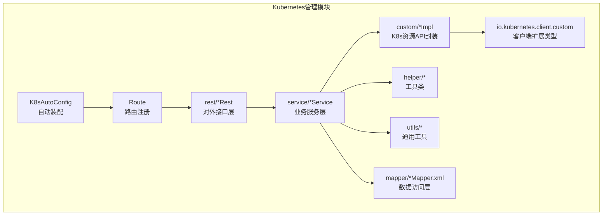
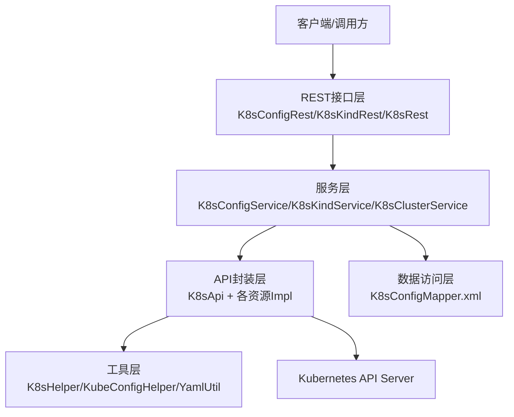
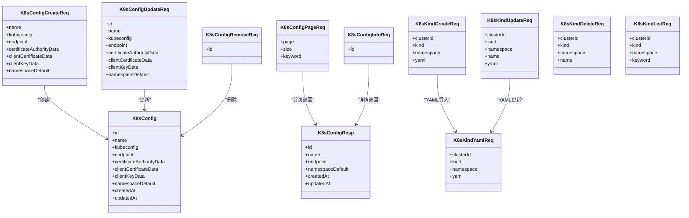
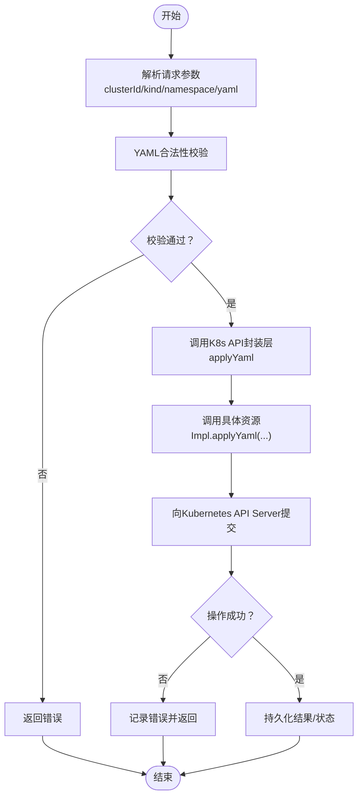
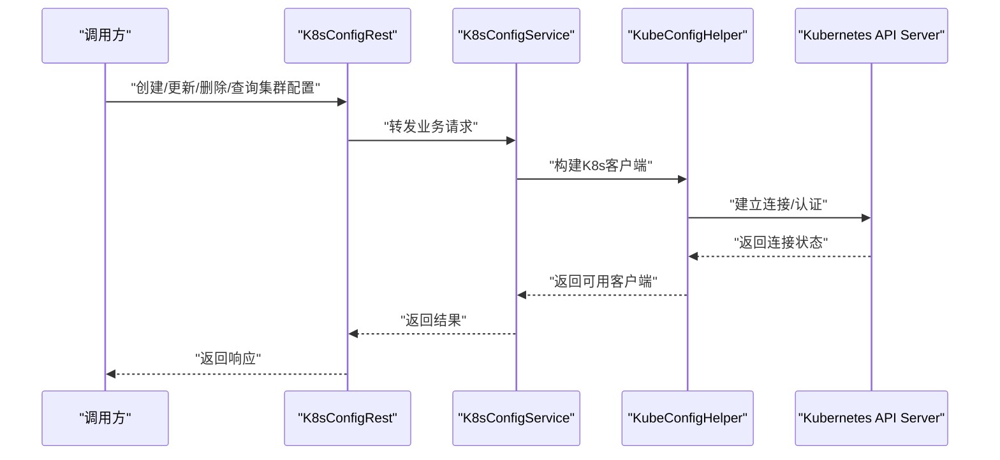
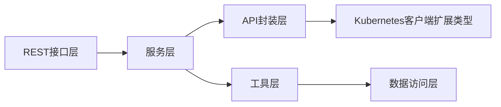

# Kubernetes管理模块

<cite>
**本文档引用的文件**
- [K8sAutoConfig.java](file://micro-k8s/src/main/java/com/wkclz/micro/k8s/K8sAutoConfig.java)
- [Route.java](file://micro-k8s/src/main/java/com/wkclz/micro/k8s/Route.java)
- [K8sConfig.java](file://micro-k8s/src/main/java/com/wkclz/micro/k8s/bean/entity/K8sConfig.java)
- [K8sClusterReq.java](file://micro-k8s/src/main/java/com/wkclz/micro/k8s/bean/req/K8sClusterReq.java)
- [K8sConfigCreateReq.java](file://micro-k8s/src/main/java/com/wkclz/micro/k8s/bean/req/K8sConfigCreateReq.java)
- [K8sConfigUpdateReq.java](file://micro-k8s/src/main/java/com/wkclz/micro/k8s/bean/req/K8sConfigUpdateReq.java)
- [K8sConfigRemoveReq.java](file://micro-k8s/src/main/java/com/wkclz/micro/k8s/bean/req/K8sConfigRemoveReq.java)
- [K8sConfigPageReq.java](file://micro-k8s/src/main/java/com/wkclz/micro/k8s/bean/req/K8sConfigPageReq.java)
- [K8sConfigInfoReq.java](file://micro-k8s/src/main/java/com/wkclz/micro/k8s/bean/req/K8sConfigInfoReq.java)
- [K8sKindCreateReq.java](file://micro-k8s/src/main/java/com/wkclz/micro/k8s/bean/req/K8sKindCreateReq.java)
- [K8sKindUpdateReq.java](file://micro-k8s/src/main/java/com/wkclz/micro/k8s/bean/req/K8sKindUpdateReq.java)
- [K8sKindDeleteReq.java](file://micro-k8s/src/main/java/com/wkclz/micro/k8s/bean/req/K8sKindDeleteReq.java)
- [K8sKindListReq.java](file://micro-k8s/src/main/java/com/wkclz/micro/k8s/bean/req/K8sKindListReq.java)
- [K8sKindYamlReq.java](file://micro-k8s/src/main/java/com/wkclz/micro/k8s/bean/req/K8sKindYamlReq.java)
- [K8sConfigResp.java](file://micro-k8s/src/main/java/com/wkclz/micro/k8s/bean/resp/K8sConfigResp.java)
- [K8sParam.java](file://micro-k8s/src/main/java/com/wkclz/micro/k8s/bean/kube/K8sParam.java)
- [K8sApi.java](file://micro-k8s/src/main/java/com/wkclz/micro/k8s/custom/K8sApi.java)
- [K8sHelper.java](file://micro-k8s/src/main/java/com/wkclz/micro/k8s/helper/K8sHelper.java)
- [KubeConfigHelper.java](file://micro-k8s/src/main/java/com/wkclz/micro/k8s/helper/KubeConfigHelper.java)
- [YamlUtil.java](file://micro-k8s/src/main/java/com/wkclz/micro/k8s/utils/YamlUtil.java)
- [K8sConfigMapper.java](file://micro-k8s/src/main/resources/mapper/K8sConfigMapper.xml)
- [IntOrString.java](file://micro-k8s/src/main/java/io/kubernetes/client/custom/IntOrString.java)
- [K8sClusterService.java](file://micro-k8s/src/main/java/com/wkclz/micro/k8s/service/K8sClusterService.java)
- [K8sConfigService.java](file://micro-k8s/src/main/java/com/wkclz/micro/k8s/service/K8sConfigService.java)
- [K8sKindService.java](file://micro-k8s/src/main/java/com/wkclz/micro/k8s/service/K8sKindService.java)
- [K8sConfigRest.java](file://micro-k8s/src/main/java/com/wkclz/micro/k8s/rest/K8sConfigRest.java)
- [K8sKindRest.java](file://micro-k8s/src/main/java/com/wkclz/micro/k8s/rest/K8sKindRest.java)
- [K8sRest.java](file://micro-k8s/src/main/java/com/wkclz/micro/k8s/rest/K8sRest.java)
- [K8sDeploymentImpl.java](file://micro-k8s/src/main/java/com/wkclz/micro/k8s/custom/impl/K8sDeploymentImpl.java)
- [K8sServiceImpl.java](file://micro-k8s/src/main/java/com/wkclz/micro/k8s/custom/impl/K8sServiceImpl.java)
- [K8sPodImpl.java](file://micro-k8s/src/main/java/com/wkclz/micro/k8s/custom/impl/K8sPodImpl.java)
- [K8sNamespaceImpl.java](file://micro-k8s/src/main/java/com/wkclz/micro/k8s/custom/impl/K8sNamespaceImpl.java)
- [K8sConfigMapImpl.java](file://micro-k8s/src/main/java/com/wkclz/micro/k8s/custom/impl/K8sConfigMapImpl.java)
- [K8sSecretImpl.java](file://micro-k8s/src/main/java/com/wkclz/micro/k8s/custom/impl/K8sSecretImpl.java)
- [K8sIngressImpl.java](file://micro-k8s/src/main/java/com/wkclz/micro/k8s/custom/impl/K8sIngressImpl.java)
- [K8sJobImpl.java](file://micro-k8s/src/main/java/com/wkclz/micro/k8s/custom/impl/K8sJobImpl.java)
- [K8sCronJobImpl.java](file://micro-k8s/src/main/java/com/wkclz/micro/k8s/custom/impl/K8sCronJobImpl.java)
- [K8sDaemonSetImpl.java](file://micro-k8s/src/main/java/com/wkclz/micro/k8s/custom/impl/K8sDaemonSetImpl.java)
- [K8sStatefulSetImpl.java](file://micro-k8s/src/main/java/com/wkclz/micro/k8s/custom/impl/K8sStatefulSetImpl.java)
- [K8sServiceAccountImpl.java](file://micro-k8s/src/main/java/com/wkclz/micro/k8s/custom/impl/K8sServiceAccountImpl.java)
- [K8sRoleImpl.java](file://micro-k8s/src/main/java/com/wkclz/micro/k8s/custom/impl/K8sRoleImpl.java)
- [K8sRoleBindingImpl.java](file://micro-k8s/src/main/java/com/wkclz/micro/k8s/custom/impl/K8sRoleBindingImpl.java)
- [K8sClusterRoleImpl.java](file://micro-k8s/src/main/java/com/wkclz/micro/k8s/custom/impl/K8sClusterRoleImpl.java)
- [K8sClusterRoleBindingImpl.java](file://micro-k8s/src/main/java/com/wkclz/micro/k8s/custom/impl/K8sClusterRoleBindingImpl.java)
- [K8sResourceQuotaImpl.java](file://micro-k8s/src/main/java/com/wkclz/micro/k8s/custom/impl/K8sResourceQuotaImpl.java)
- [K8sLimitRangeImpl.java](file://micro-k8s/src/main/java/com/wkclz/micro/k8s/custom/impl/K8sLimitRangeImpl.java)
- [K8sPersistentVolumeImpl.java](file://micro-k8s/src/main/java/com/wkclz/micro/k8s/custom/impl/K8sPersistentVolumeImpl.java)
- [K8sPersistentVolumeClaimImpl.java](file://micro-k8s/src/main/java/com/wkclz/micro/k8s/custom/impl/K8sPersistentVolumeClaimImpl.java)
- [K8sEventImpl.java](file://micro-k8s/src/main/java/com/wkclz/micro/k8s/custom/impl/K8sEventImpl.java)
- [K8sEndpointImpl.java](file://micro-k8s/src/main/java/com/wkclz/micro/k8s/custom/impl/K8sEndpointsImpl.java)
- [K8sHorizontalPodAutoscalerImpl.java](file://micro-k8s/src/main/java/com/wkclz/micro/k8s/custom/impl/K8sHorizontalPodAutoscalerImpl.java)
- [K8sNetworkPolicyImpl.java](file://micro-k8s/src/main/java/com/wkclz/micro/k8s/custom/impl/K8sNetworkPolicyImpl.java)
- [K8sPodDisruptionBudgetImpl.java](file://micro-k8s/src/main/java/com/wkclz/micro/k8s/custom/impl/K8sPodDisruptionBudgetImpl.java)
- [K8sServiceMonitorImpl.java](file://micro-k8s/src/main/java/com/wkclz/micro/k8s/custom/impl/K8sServiceMonitorImpl.java)
- [K8sCustomResourceDefinitionImpl.java](file://micro-k8s/src/main/java/com/wkclz/micro/k8s/custom/impl/K8sCustomResourceDefinitionImpl.java)
- [K8sPriorityClassImpl.java](file://micro-k8s/src/main/java/com/wkclz/micro/k8s/custom/impl/K8sPriorityClassImpl.java)
- [K8sPodSecurityPolicyImpl.java](file://micro-k8s/src/main/java/com/wkclz/micro/k8s/custom/impl/K8sPodSecurityPolicyImpl.java)
- [K8sHorizontalPodAutoscalerImpl.java](file://micro-k8s/src/main/java/com/wkclz/micro/k8s/custom/impl/K8sHorizontalPodAutoscalerImpl.java)
- [K8sNetworkPolicyImpl.java](file://micro-k8s/src/main/java/com/wkclz/micro/k8s/custom/impl/K8sNetworkPolicyImpl.java)
- [K8sPodDisruptionBudgetImpl.java](file://micro-k8s/src/main/java/com/wkclz/micro/k8s/custom/impl/K8sPodDisruptionBudgetImpl.java)
- [K8sServiceMonitorImpl.java](file://micro-k8s/src/main/java/com/wkclz/micro/k8s/custom/impl/K8sServiceMonitorImpl.java)
- [K8sCustomResourceDefinitionImpl.java](file://micro-k8s/src/main/java/com/wkclz/micro/k8s/custom/impl/K8sCustomResourceDefinitionImpl.java)
- [K8sPriorityClassImpl.java](file://micro-k8s/src/main/java/com/wkclz/micro/k8s/custom/impl/K8sPriorityClassImpl.java)
- [K8sPodSecurityPolicyImpl.java](file://micro-k8s/src/main/java/com/wkclz/micro/k8s/custom/impl/K8sPodSecurityPolicyImpl.java)
</cite>

## 目录
1. [简介](#简介)
2. [项目结构](#项目结构)
3. [核心组件](#核心组件)
4. [架构总览](#架构总览)
5. [详细组件分析](#详细组件分析)
6. [依赖关系分析](#依赖关系分析)
7. [性能考虑](#性能考虑)
8. [故障排除指南](#故障排除指南)
9. [结论](#结论)
10. [附录](#附录)

## 简介
本文件为Kubernetes管理模块的专业技术文档，聚焦于K8s资源管理架构、自定义资源定义（CRD）与集群配置管理。文档深入解析K8sConfig、K8sCluster等核心数据模型，梳理各类K8s资源类型的API封装实现，并阐述YAML配置处理、集群连接管理与资源操作的安全控制机制。同时提供最佳实践、故障排除与性能监控建议，并给出完整的API参考与部署案例说明。

## 项目结构
Kubernetes管理模块位于micro-k8s子模块中，采用按功能域划分的包结构：bean（数据模型与请求/响应）、custom（K8s资源API封装）、helper（工具类）、rest（对外接口）、service（业务服务）、utils（通用工具）、mapper（MyBatis映射XML）。模块通过Spring Boot自动装配加载，提供REST接口以管理K8s集群与资源。

图表来源
- [K8sAutoConfig.java](file://micro-k8s/src/main/java/com/wkclz/micro/k8s/K8sAutoConfig.java)
- [Route.java](file://micro-k8s/src/main/java/com/wkclz/micro/k8s/Route.java)
- [K8sConfigRest.java](file://micro-k8s/src/main/java/com/wkclz/micro/k8s/rest/K8sConfigRest.java)
- [K8sKindRest.java](file://micro-k8s/src/main/java/com/wkclz/micro/k8s/rest/K8sKindRest.java)
- [K8sRest.java](file://micro-k8s/src/main/java/com/wkclz/micro/k8s/rest/K8sRest.java)
- [K8sConfigService.java](file://micro-k8s/src/main/java/com/wkclz/micro/k8s/service/K8sConfigService.java)
- [K8sKindService.java](file://micro-k8s/src/main/java/com/wkclz/micro/k8s/service/K8sKindService.java)
- [K8sClusterService.java](file://micro-k8s/src/main/java/com/wkclz/micro/k8s/service/K8sClusterService.java)

章节来源
- [K8sAutoConfig.java](file://micro-k8s/src/main/java/com/wkclz/micro/k8s/K8sAutoConfig.java)
- [Route.java](file://micro-k8s/src/main/java/com/wkclz/micro/k8s/Route.java)

## 核心组件
本节对K8s管理模块的核心组件进行深入分析，包括数据模型、请求/响应对象、服务层与API封装层。

- 数据模型与请求/响应
  - K8sConfig：存储K8s集群配置信息，用于连接与鉴权。
  - K8sClusterReq：集群查询请求参数。
  - K8sConfigCreateReq/K8sConfigUpdateReq/K8sConfigRemoveReq/K8sConfigPageReq/K8sConfigInfoReq：配置的增删改查与分页查询请求。
  - K8sKindCreateReq/K8sKindUpdateReq/K8sKindDeleteReq/K8sKindListReq/K8sKindYamlReq：K8s资源类型（含CRD）的创建、更新、删除、列表与YAML导入请求。
  - K8sConfigResp：配置查询返回结果。

- 服务层
  - K8sConfigService：负责集群配置的持久化与查询。
  - K8sKindService：负责K8s资源的CRUD与YAML导入导出。
  - K8sClusterService：负责集群连通性检测与集群信息获取。

- API封装层
  - K8sApi：统一的K8s资源API接口抽象。
  - 各具体资源实现：如K8sDeploymentImpl、K8sServiceImpl、K8sPodImpl、K8sNamespaceImpl、K8sConfigMapImpl、K8sSecretImpl、K8sIngressImpl、K8sJobImpl、K8sCronJobImpl、K8sDaemonSetImpl、K8sStatefulSetImpl、K8sServiceAccountImpl、K8sRoleImpl、K8sRoleBindingImpl、K8sClusterRoleImpl、K8sClusterRoleBindingImpl、K8sResourceQuotaImpl、K8sLimitRangeImpl、K8sPersistentVolumeImpl、K8sPersistentVolumeClaimImpl、K8sEventImpl、K8sEndpointsImpl、K8sHorizontalPodAutoscalerImpl、K8sNetworkPolicyImpl、K8sPodDisruptionBudgetImpl、K8sServiceMonitorImpl、K8sCustomResourceDefinitionImpl、K8sPriorityClassImpl、K8sPodSecurityPolicyImpl等。

章节来源
- [K8sConfig.java](file://micro-k8s/src/main/java/com/wkclz/micro/k8s/bean/entity/K8sConfig.java)
- [K8sClusterReq.java](file://micro-k8s/src/main/java/com/wkclz/micro/k8s/bean/req/K8sClusterReq.java)
- [K8sConfigCreateReq.java](file://micro-k8s/src/main/java/com/wkclz/micro/k8s/bean/req/K8sConfigCreateReq.java)
- [K8sConfigUpdateReq.java](file://micro-k8s/src/main/java/com/wkclz/micro/k8s/bean/req/K8sConfigUpdateReq.java)
- [K8sConfigRemoveReq.java](file://micro-k8s/src/main/java/com/wkclz/micro/k8s/bean/req/K8sConfigRemoveReq.java)
- [K8sConfigPageReq.java](file://micro-k8s/src/main/java/com/wkclz/micro/k8s/bean/req/K8sConfigPageReq.java)
- [K8sConfigInfoReq.java](file://micro-k8s/src/main/java/com/wkclz/micro/k8s/bean/req/K8sConfigInfoReq.java)
- [K8sKindCreateReq.java](file://micro-k8s/src/main/java/com/wkclz/micro/k8s/bean/req/K8sKindCreateReq.java)
- [K8sKindUpdateReq.java](file://micro-k8s/src/main/java/com/wkclz/micro/k8s/bean/req/K8sKindUpdateReq.java)
- [K8sKindDeleteReq.java](file://micro-k8s/src/main/java/com/wkclz/micro/k8s/bean/req/K8sKindDeleteReq.java)
- [K8sKindListReq.java](file://micro-k8s/src/main/java/com/wkclz/micro/k8s/bean/req/K8sKindListReq.java)
- [K8sKindYamlReq.java](file://micro-k8s/src/main/java/com/wkclz/micro/k8s/bean/req/K8sKindYamlReq.java)
- [K8sConfigResp.java](file://micro-k8s/src/main/java/com/wkclz/micro/k8s/bean/resp/K8sConfigResp.java)
- [K8sConfigService.java](file://micro-k8s/src/main/java/com/wkclz/micro/k8s/service/K8sConfigService.java)
- [K8sKindService.java](file://micro-k8s/src/main/java/com/wkclz/micro/k8s/service/K8sKindService.java)
- [K8sClusterService.java](file://micro-k8s/src/main/java/com/wkclz/micro/k8s/service/K8sClusterService.java)
- [K8sApi.java](file://micro-k8s/src/main/java/com/wkclz/micro/k8s/custom/K8sApi.java)

## 架构总览
Kubernetes管理模块采用分层架构：接口层（REST）→ 服务层（Service）→ 资源封装层（custom impl）→ 工具层（helper/utils）→ 数据访问层（mapper）。模块通过自动装配初始化，提供集群配置管理与K8s资源操作能力。

图表来源
- [K8sConfigRest.java](file://micro-k8s/src/main/java/com/wkclz/micro/k8s/rest/K8sConfigRest.java)
- [K8sKindRest.java](file://micro-k8s/src/main/java/com/wkclz/micro/k8s/rest/K8sKindRest.java)
- [K8sRest.java](file://micro-k8s/src/main/java/com/wkclz/micro/k8s/rest/K8sRest.java)
- [K8sConfigService.java](file://micro-k8s/src/main/java/com/wkclz/micro/k8s/service/K8sConfigService.java)
- [K8sKindService.java](file://micro-k8s/src/main/java/com/wkclz/micro/k8s/service/K8sKindService.java)
- [K8sClusterService.java](file://micro-k8s/src/main/java/com/wkclz/micro/k8s/service/K8sClusterService.java)
- [K8sApi.java](file://micro-k8s/src/main/java/com/wkclz/micro/k8s/custom/K8sApi.java)
- [K8sHelper.java](file://micro-k8s/src/main/java/com/wkclz/micro/k8s/helper/K8sHelper.java)
- [KubeConfigHelper.java](file://micro-k8s/src/main/java/com/wkclz/micro/k8s/helper/KubeConfigHelper.java)
- [YamlUtil.java](file://micro-k8s/src/main/java/com/wkclz/micro/k8s/utils/YamlUtil.java)
- [K8sConfigMapper.xml](file://micro-k8s/src/main/resources/mapper/K8sConfigMapper.xml)

## 详细组件分析

### 数据模型与请求/响应对象
- K8sConfig：用于存储K8s集群连接信息（如集群名称、kubeconfig内容或服务端地址、证书等），支持多集群配置与鉴权参数。
- 请求对象族：围绕K8sConfig与K8sKind提供标准的增删改查与分页查询请求；K8sKind系列请求支持YAML导入与资源清单操作。
- 响应对象：K8sConfigResp用于返回配置详情或列表结果。

图表来源
- [K8sConfig.java](file://micro-k8s/src/main/java/com/wkclz/micro/k8s/bean/entity/K8sConfig.java)
- [K8sConfigCreateReq.java](file://micro-k8s/src/main/java/com/wkclz/micro/k8s/bean/req/K8sConfigCreateReq.java)
- [K8sConfigUpdateReq.java](file://micro-k8s/src/main/java/com/wkclz/micro/k8s/bean/req/K8sConfigUpdateReq.java)
- [K8sConfigRemoveReq.java](file://micro-k8s/src/main/java/com/wkclz/micro/k8s/bean/req/K8sConfigRemoveReq.java)
- [K8sConfigPageReq.java](file://micro-k8s/src/main/java/com/wkclz/micro/k8s/bean/req/K8sConfigPageReq.java)
- [K8sConfigInfoReq.java](file://micro-k8s/src/main/java/com/wkclz/micro/k8s/bean/req/K8sConfigInfoReq.java)
- [K8sKindCreateReq.java](file://micro-k8s/src/main/java/com/wkclz/micro/k8s/bean/req/K8sKindCreateReq.java)
- [K8sKindUpdateReq.java](file://micro-k8s/src/main/java/com/wkclz/micro/k8s/bean/req/K8sKindUpdateReq.java)
- [K8sKindDeleteReq.java](file://micro-k8s/src/main/java/com/wkclz/micro/k8s/bean/req/K8sKindDeleteReq.java)
- [K8sKindListReq.java](file://micro-k8s/src/main/java/com/wkclz/micro/k8s/bean/req/K8sKindListReq.java)
- [K8sKindYamlReq.java](file://micro-k8s/src/main/java/com/wkclz/micro/k8s/bean/req/K8sKindYamlReq.java)
- [K8sConfigResp.java](file://micro-k8s/src/main/java/com/wkclz/micro/k8s/bean/resp/K8sConfigResp.java)

章节来源
- [K8sConfig.java](file://micro-k8s/src/main/java/com/wkclz/micro/k8s/bean/entity/K8sConfig.java)
- [K8sConfigCreateReq.java](file://micro-k8s/src/main/java/com/wkclz/micro/k8s/bean/req/K8sConfigCreateReq.java)
- [K8sConfigUpdateReq.java](file://micro-k8s/src/main/java/com/wkclz/micro/k8s/bean/req/K8sConfigUpdateReq.java)
- [K8sConfigRemoveReq.java](file://micro-k8s/src/main/java/com/wkclz/micro/k8s/bean/req/K8sConfigRemoveReq.java)
- [K8sConfigPageReq.java](file://micro-k8s/src/main/java/com/wkclz/micro/k8s/bean/req/K8sConfigPageReq.java)
- [K8sConfigInfoReq.java](file://micro-k8s/src/main/java/com/wkclz/micro/k8s/bean/req/K8sConfigInfoReq.java)
- [K8sKindCreateReq.java](file://micro-k8s/src/main/java/com/wkclz/micro/k8s/bean/req/K8sKindCreateReq.java)
- [K8sKindUpdateReq.java](file://micro-k8s/src/main/java/com/wkclz/micro/k8s/bean/req/K8sKindUpdateReq.java)
- [K8sKindDeleteReq.java](file://micro-k8s/src/main/java/com/wkclz/micro/k8s/bean/req/K8sKindDeleteReq.java)
- [K8sKindListReq.java](file://micro-k8s/src/main/java/com/wkclz/micro/k8s/bean/req/K8sKindListReq.java)
- [K8sKindYamlReq.java](file://micro-k8s/src/main/java/com/wkclz/micro/k8s/bean/req/K8sKindYamlReq.java)
- [K8sConfigResp.java](file://micro-k8s/src/main/java/com/wkclz/micro/k8s/bean/resp/K8sConfigResp.java)

### K8s资源API封装实现
- 统一接口：K8sApi定义了资源操作的抽象方法，便于扩展新的K8s资源类型。
- 具体实现：每个资源类型对应一个Impl类，封装该资源的创建、读取、更新、删除、列表与YAML导入导出逻辑。
- 扩展点：新增资源类型时，只需实现K8sApi并提供对应的Impl类，即可复用服务层与REST层。

```mermaid
classDiagram
class K8sApi {
<<interface>>
+create(clusterId, namespace, yaml)
+get(clusterId, namespace, name)
+update(clusterId, namespace, name, yaml)
+delete(clusterId, namespace, name)
+list(clusterId, namespace, keyword)
+applyYaml(clusterId, namespace, yaml)
}
class K8sDeploymentImpl {
+create(...)
+get(...)
+update(...)
+delete(...)
+list(...)
+applyYaml(...)
}
class K8sServiceImpl {
+create(...)
+get(...)
+update(...)
+delete(...)
+list(...)
+applyYaml(...)
}
class K8sPodImpl {
+create(...)
+get(...)
+update(...)
+delete(...)
+list(...)
+applyYaml(...)
}
class K8sNamespaceImpl {
+create(...)
+get(...)
+update(...)
+delete(...)
+list(...)
+applyYaml(...)
}
class K8sConfigMapImpl {
+create(...)
+get(...)
+update(...)
+delete(...)
+list(...)
+applyYaml(...)
}
class K8sSecretImpl {
+create(...)
+get(...)
+update(...)
+delete(...)
+list(...)
+applyYaml(...)
}
class K8sIngressImpl {
+create(...)
+get(...)
+update(...)
+delete(...)
+list(...)
+applyYaml(...)
}
class K8sJobImpl {
+create(...)
+get(...)
+update(...)
+delete(...)
+list(...)
+applyYaml(...)
}
class K8sCronJobImpl {
+create(...)
+get(...)
+update(...)
+delete(...)
+list(...)
+applyYaml(...)
}
class K8sDaemonSetImpl {
+create(...)
+get(...)
+update(...)
+delete(...)
+list(...)
+applyYaml(...)
}
class K8sStatefulSetImpl {
+create(...)
+get(...)
+update(...)
+delete(...)
+list(...)
+applyYaml(...)
}
class K8sServiceAccountImpl {
+create(...)
+get(...)
+update(...)
+delete(...)
+list(...)
+applyYaml(...)
}
class K8sRoleImpl {
+create(...)
+get(...)
+update(...)
+delete(...)
+list(...)
+applyYaml(...)
}
class K8sRoleBindingImpl {
+create(...)
+get(...)
+update(...)
+delete(...)
+list(...)
+applyYaml(...)
}
class K8sClusterRoleImpl {
+create(...)
+get(...)
+update(...)
+delete(...)
+list(...)
+applyYaml(...)
}
class K8sClusterRoleBindingImpl {
+create(...)
+get(...)
+update(...)
+delete(...)
+list(...)
+applyYaml(...)
}
class K8sResourceQuotaImpl {
+create(...)
+get(...)
+update(...)
+delete(...)
+list(...)
+applyYaml(...)
}
class K8sLimitRangeImpl {
+create(...)
+get(...)
+update(...)
+delete(...)
+list(...)
+applyYaml(...)
}
class K8sPersistentVolumeImpl {
+create(...)
+get(...)
+update(...)
+delete(...)
+list(...)
+applyYaml(...)
}
class K8sPersistentVolumeClaimImpl {
+create(...)
+get(...)
+update(...)
+delete(...)
+list(...)
+applyYaml(...)
}
class K8sEventImpl {
+create(...)
+get(...)
+update(...)
+delete(...)
+list(...)
+applyYaml(...)
}
class K8sEndpointsImpl {
+create(...)
+get(...)
+update(...)
+delete(...)
+list(...)
+applyYaml(...)
}
class K8sHorizontalPodAutoscalerImpl {
+create(...)
+get(...)
+update(...)
+delete(...)
+list(...)
+applyYaml(...)
}
class K8sNetworkPolicyImpl {
+create(...)
+get(...)
+update(...)
+delete(...)
+list(...)
+applyYaml(...)
}
class K8sPodDisruptionBudgetImpl {
+create(...)
+get(...)
+update(...)
+delete(...)
+list(...)
+applyYaml(...)
}
class K8sServiceMonitorImpl {
+create(...)
+get(...)
+update(...)
+delete(...)
+list(...)
+applyYaml(...)
}
class K8sCustomResourceDefinitionImpl {
+create(...)
+get(...)
+update(...)
+delete(...)
+list(...)
+applyYaml(...)
}
class K8sPriorityClassImpl {
+create(...)
+get(...)
+update(...)
+delete(...)
+list(...)
+applyYaml(...)
}
class K8sPodSecurityPolicyImpl {
+create(...)
+get(...)
+update(...)
+delete(...)
+list(...)
+applyYaml(...)
}
K8sApi <|.. K8sDeploymentImpl
K8sApi <|.. K8sServiceImpl
K8sApi <|.. K8sPodImpl
K8sApi <|.. K8sNamespaceImpl
K8sApi <|.. K8sConfigMapImpl
K8sApi <|.. K8sSecretImpl
K8sApi <|.. K8sIngressImpl
K8sApi <|.. K8sJobImpl
K8sApi <|.. K8sCronJobImpl
K8sApi <|.. K8sDaemonSetImpl
K8sApi <|.. K8sStatefulSetImpl
K8sApi <|.. K8sServiceAccountImpl
K8sApi <|.. K8sRoleImpl
K8sApi <|.. K8sRoleBindingImpl
K8sApi <|.. K8sClusterRoleImpl
K8sApi <|.. K8sClusterRoleBindingImpl
K8sApi <|.. K8sResourceQuotaImpl
K8sApi <|.. K8sLimitRangeImpl
K8sApi <|.. K8sPersistentVolumeImpl
K8sApi <|.. K8sPersistentVolumeClaimImpl
K8sApi <|.. K8sEventImpl
K8sApi <|.. K8sEndpointsImpl
K8sApi <|.. K8sHorizontalPodAutoscalerImpl
K8sApi <|.. K8sNetworkPolicyImpl
K8sApi <|.. K8sPodDisruptionBudgetImpl
K8sApi <|.. K8sServiceMonitorImpl
K8sApi <|.. K8sCustomResourceDefinitionImpl
K8sApi <|.. K8sPriorityClassImpl
K8sApi <|.. K8sPodSecurityPolicyImpl
```

图表来源
- [K8sApi.java](file://micro-k8s/src/main/java/com/wkclz/micro/k8s/custom/K8sApi.java)
- [K8sDeploymentImpl.java](file://micro-k8s/src/main/java/com/wkclz/micro/k8s/custom/impl/K8sDeploymentImpl.java)
- [K8sServiceImpl.java](file://micro-k8s/src/main/java/com/wkclz/micro/k8s/custom/impl/K8sServiceImpl.java)
- [K8sPodImpl.java](file://micro-k8s/src/main/java/com/wkclz/micro/k8s/custom/impl/K8sPodImpl.java)
- [K8sNamespaceImpl.java](file://micro-k8s/src/main/java/com/wkclz/micro/k8s/custom/impl/K8sNamespaceImpl.java)
- [K8sConfigMapImpl.java](file://micro-k8s/src/main/java/com/wkclz/micro/k8s/custom/impl/K8sConfigMapImpl.java)
- [K8sSecretImpl.java](file://micro-k8s/src/main/java/com/wkclz/micro/k8s/custom/impl/K8sSecretImpl.java)
- [K8sIngressImpl.java](file://micro-k8s/src/main/java/com/wkclz/micro/k8s/custom/impl/K8sIngressImpl.java)
- [K8sJobImpl.java](file://micro-k8s/src/main/java/com/wkclz/micro/k8s/custom/impl/K8sJobImpl.java)
- [K8sCronJobImpl.java](file://micro-k8s/src/main/java/com/wkclz/micro/k8s/custom/impl/K8sCronJobImpl.java)
- [K8sDaemonSetImpl.java](file://micro-k8s/src/main/java/com/wkclz/micro/k8s/custom/impl/K8sDaemonSetImpl.java)
- [K8sStatefulSetImpl.java](file://micro-k8s/src/main/java/com/wkclz/micro/k8s/custom/impl/K8sStatefulSetImpl.java)
- [K8sServiceAccountImpl.java](file://micro-k8s/src/main/java/com/wkclz/micro/k8s/custom/impl/K8sServiceAccountImpl.java)
- [K8sRoleImpl.java](file://micro-k8s/src/main/java/com/wkclz/micro/k8s/custom/impl/K8sRoleImpl.java)
- [K8sRoleBindingImpl.java](file://micro-k8s/src/main/java/com/wkclz/micro/k8s/custom/impl/K8sRoleBindingImpl.java)
- [K8sClusterRoleImpl.java](file://micro-k8s/src/main/java/com/wkclz/micro/k8s/custom/impl/K8sClusterRoleImpl.java)
- [K8sClusterRoleBindingImpl.java](file://micro-k8s/src/main/java/com/wkclz/micro/k8s/custom/impl/K8sClusterRoleBindingImpl.java)
- [K8sResourceQuotaImpl.java](file://micro-k8s/src/main/java/com/wkclz/micro/k8s/custom/impl/K8sResourceQuotaImpl.java)
- [K8sLimitRangeImpl.java](file://micro-k8s/src/main/java/com/wkclz/micro/k8s/custom/impl/K8sLimitRangeImpl.java)
- [K8sPersistentVolumeImpl.java](file://micro-k8s/src/main/java/com/wkclz/micro/k8s/custom/impl/K8sPersistentVolumeImpl.java)
- [K8sPersistentVolumeClaimImpl.java](file://micro-k8s/src/main/java/com/wkclz/micro/k8s/custom/impl/K8sPersistentVolumeClaimImpl.java)
- [K8sEventImpl.java](file://micro-k8s/src/main/java/com/wkclz/micro/k8s/custom/impl/K8sEventImpl.java)
- [K8sEndpointsImpl.java](file://micro-k8s/src/main/java/com/wkclz/micro/k8s/custom/impl/K8sEndpointsImpl.java)
- [K8sHorizontalPodAutoscalerImpl.java](file://micro-k8s/src/main/java/com/wkclz/micro/k8s/custom/impl/K8sHorizontalPodAutoscalerImpl.java)
- [K8sNetworkPolicyImpl.java](file://micro-k8s/src/main/java/com/wkclz/micro/k8s/custom/impl/K8sNetworkPolicyImpl.java)
- [K8sPodDisruptionBudgetImpl.java](file://micro-k8s/src/main/java/com/wkclz/micro/k8s/custom/impl/K8sPodDisruptionBudgetImpl.java)
- [K8sServiceMonitorImpl.java](file://micro-k8s/src/main/java/com/wkclz/micro/k8s/custom/impl/K8sServiceMonitorImpl.java)
- [K8sCustomResourceDefinitionImpl.java](file://micro-k8s/src/main/java/com/wkclz/micro/k8s/custom/impl/K8sCustomResourceDefinitionImpl.java)
- [K8sPriorityClassImpl.java](file://micro-k8s/src/main/java/com/wkclz/micro/k8s/custom/impl/K8sPriorityClassImpl.java)
- [K8sPodSecurityPolicyImpl.java](file://micro-k8s/src/main/java/com/wkclz/micro/k8s/custom/impl/K8sPodSecurityPolicyImpl.java)

章节来源
- [K8sApi.java](file://micro-k8s/src/main/java/com/wkclz/micro/k8s/custom/K8sApi.java)
- [K8sDeploymentImpl.java](file://micro-k8s/src/main/java/com/wkclz/micro/k8s/custom/impl/K8sDeploymentImpl.java)
- [K8sServiceImpl.java](file://micro-k8s/src/main/java/com/wkclz/micro/k8s/custom/impl/K8sServiceImpl.java)
- [K8sPodImpl.java](file://micro-k8s/src/main/java/com/wkclz/micro/k8s/custom/impl/K8sPodImpl.java)
- [K8sNamespaceImpl.java](file://micro-k8s/src/main/java/com/wkclz/micro/k8s/custom/impl/K8sNamespaceImpl.java)
- [K8sConfigMapImpl.java](file://micro-k8s/src/main/java/com/wkclz/micro/k8s/custom/impl/K8sConfigMapImpl.java)
- [K8sSecretImpl.java](file://micro-k8s/src/main/java/com/wkclz/micro/k8s/custom/impl/K8sSecretImpl.java)
- [K8sIngressImpl.java](file://micro-k8s/src/main/java/com/wkclz/micro/k8s/custom/impl/K8sIngressImpl.java)
- [K8sJobImpl.java](file://micro-k8s/src/main/java/com/wkclz/micro/k8s/custom/impl/K8sJobImpl.java)
- [K8sCronJobImpl.java](file://micro-k8s/src/main/java/com/wkclz/micro/k8s/custom/impl/K8sCronJobImpl.java)
- [K8sDaemonSetImpl.java](file://micro-k8s/src/main/java/com/wkclz/micro/k8s/custom/impl/K8sDaemonSetImpl.java)
- [K8sStatefulSetImpl.java](file://micro-k8s/src/main/java/com/wkclz/micro/k8s/custom/impl/K8sStatefulSetImpl.java)
- [K8sServiceAccountImpl.java](file://micro-k8s/src/main/java/com/wkclz/micro/k8s/custom/impl/K8sServiceAccountImpl.java)
- [K8sRoleImpl.java](file://micro-k8s/src/main/java/com/wkclz/micro/k8s/custom/impl/K8sRoleImpl.java)
- [K8sRoleBindingImpl.java](file://micro-k8s/src/main/java/com/wkclz/micro/k8s/custom/impl/K8sRoleBindingImpl.java)
- [K8sClusterRoleImpl.java](file://micro-k8s/src/main/java/com/wkclz/micro/k8s/custom/impl/K8sClusterRoleImpl.java)
- [K8sClusterRoleBindingImpl.java](file://micro-k8s/src/main/java/com/wkclz/micro/k8s/custom/impl/K8sClusterRoleBindingImpl.java)
- [K8sResourceQuotaImpl.java](file://micro-k8s/src/main/java/com/wkclz/micro/k8s/custom/impl/K8sResourceQuotaImpl.java)
- [K8sLimitRangeImpl.java](file://micro-k8s/src/main/java/com/wkclz/micro/k8s/custom/impl/K8sLimitRangeImpl.java)
- [K8sPersistentVolumeImpl.java](file://micro-k8s/src/main/java/com/wkclz/micro/k8s/custom/impl/K8sPersistentVolumeImpl.java)
- [K8sPersistentVolumeClaimImpl.java](file://micro-k8s/src/main/java/com/wkclz/micro/k8s/custom/impl/K8sPersistentVolumeClaimImpl.java)
- [K8sEventImpl.java](file://micro-k8s/src/main/java/com/wkclz/micro/k8s/custom/impl/K8sEventImpl.java)
- [K8sEndpointsImpl.java](file://micro-k8s/src/main/java/com/wkclz/micro/k8s/custom/impl/K8sEndpointsImpl.java)
- [K8sHorizontalPodAutoscalerImpl.java](file://micro-k8s/src/main/java/com/wkclz/micro/k8s/custom/impl/K8sHorizontalPodAutoscalerImpl.java)
- [K8sNetworkPolicyImpl.java](file://micro-k8s/src/main/java/com/wkclz/micro/k8s/custom/impl/K8sNetworkPolicyImpl.java)
- [K8sPodDisruptionBudgetImpl.java](file://micro-k8s/src/main/java/com/wkclz/micro/k8s/custom/impl/K8sPodDisruptionBudgetImpl.java)
- [K8sServiceMonitorImpl.java](file://micro-k8s/src/main/java/com/wkclz/micro/k8s/custom/impl/K8sServiceMonitorImpl.java)
- [K8sCustomResourceDefinitionImpl.java](file://micro-k8s/src/main/java/com/wkclz/micro/k8s/custom/impl/K8sCustomResourceDefinitionImpl.java)
- [K8sPriorityClassImpl.java](file://micro-k8s/src/main/java/com/wkclz/micro/k8s/custom/impl/K8sPriorityClassImpl.java)
- [K8sPodSecurityPolicyImpl.java](file://micro-k8s/src/main/java/com/wkclz/micro/k8s/custom/impl/K8sPodSecurityPolicyImpl.java)

### YAML配置处理流程
YAML配置处理贯穿于资源创建、更新与应用阶段。流程包括：请求解析、YAML合法性校验、模板渲染（如需）、K8s API调用与状态回写。

图表来源
- [K8sKindYamlReq.java](file://micro-k8s/src/main/java/com/wkclz/micro/k8s/bean/req/K8sKindYamlReq.java)
- [K8sApi.java](file://micro-k8s/src/main/java/com/wkclz/micro/k8s/custom/K8sApi.java)
- [K8sKindService.java](file://micro-k8s/src/main/java/com/wkclz/micro/k8s/service/K8sKindService.java)
- [YamlUtil.java](file://micro-k8s/src/main/java/com/wkclz/micro/k8s/utils/YamlUtil.java)

章节来源
- [K8sKindYamlReq.java](file://micro-k8s/src/main/java/com/wkclz/micro/k8s/bean/req/K8sKindYamlReq.java)
- [K8sApi.java](file://micro-k8s/src/main/java/com/wkclz/micro/k8s/custom/K8sApi.java)
- [K8sKindService.java](file://micro-k8s/src/main/java/com/wkclz/micro/k8s/service/K8sKindService.java)
- [YamlUtil.java](file://micro-k8s/src/main/java/com/wkclz/micro/k8s/utils/YamlUtil.java)

### 集群连接管理
集群连接管理通过K8sConfig与KubeConfigHelper实现，支持基于kubeconfig或服务端直连方式建立与K8s API Server的连接。

图表来源
- [K8sConfigRest.java](file://micro-k8s/src/main/java/com/wkclz/micro/k8s/rest/K8sConfigRest.java)
- [K8sConfigService.java](file://micro-k8s/src/main/java/com/wkclz/micro/k8s/service/K8sConfigService.java)
- [KubeConfigHelper.java](file://micro-k8s/src/main/java/com/wkclz/micro/k8s/helper/KubeConfigHelper.java)
- [K8sConfig.java](file://micro-k8s/src/main/java/com/wkclz/micro/k8s/bean/entity/K8sConfig.java)

章节来源
- [K8sConfigRest.java](file://micro-k8s/src/main/java/com/wkclz/micro/k8s/rest/K8sConfigRest.java)
- [K8sConfigService.java](file://micro-k8s/src/main/java/com/wkclz/micro/k8s/service/K8sConfigService.java)
- [KubeConfigHelper.java](file://micro-k8s/src/main/java/com/wkclz/micro/k8s/helper/KubeConfigHelper.java)
- [K8sConfig.java](file://micro-k8s/src/main/java/com/wkclz/micro/k8s/bean/entity/K8sConfig.java)

### 资源操作安全控制机制
- 认证与授权：通过KubeConfigHelper从K8sConfig中提取证书与密钥，确保与K8s API Server的TLS认证与RBAC授权。
- 命名空间隔离：所有资源操作默认在指定命名空间下执行，避免跨命名空间越权。
- 操作审计：服务层可记录关键操作（创建/更新/删除/应用YAML）的日志，便于审计与追踪。
- 权限最小化：建议为不同环境配置独立的ServiceAccount与RoleBinding，遵循最小权限原则。

章节来源
- [KubeConfigHelper.java](file://micro-k8s/src/main/java/com/wkclz/micro/k8s/helper/KubeConfigHelper.java)
- [K8sConfig.java](file://micro-k8s/src/main/java/com/wkclz/micro/k8s/bean/entity/K8sConfig.java)
- [K8sConfigService.java](file://micro-k8s/src/main/java/com/wkclz/micro/k8s/service/K8sConfigService.java)

## 依赖关系分析
模块内部依赖清晰，层次分明：接口层依赖服务层，服务层依赖API封装层与工具层，API封装层依赖Kubernetes客户端扩展类型。外部依赖主要来自Kubernetes客户端库与Spring生态。

图表来源
- [K8sConfigRest.java](file://micro-k8s/src/main/java/com/wkclz/micro/k8s/rest/K8sConfigRest.java)
- [K8sKindRest.java](file://micro-k8s/src/main/java/com/wkclz/micro/k8s/rest/K8sKindRest.java)
- [K8sRest.java](file://micro-k8s/src/main/java/com/wkclz/micro/k8s/rest/K8sRest.java)
- [K8sConfigService.java](file://micro-k8s/src/main/java/com/wkclz/micro/k8s/service/K8sConfigService.java)
- [K8sKindService.java](file://micro-k8s/src/main/java/com/wkclz/micro/k8s/service/K8sKindService.java)
- [K8sHelper.java](file://micro-k8s/src/main/java/com/wkclz/micro/k8s/helper/K8sHelper.java)
- [KubeConfigHelper.java](file://micro-k8s/src/main/java/com/wkclz/micro/k8s/helper/KubeConfigHelper.java)
- [IntOrString.java](file://micro-k8s/src/main/java/io/kubernetes/client/custom/IntOrString.java)

章节来源
- [K8sConfigRest.java](file://micro-k8s/src/main/java/com/wkclz/micro/k8s/rest/K8sConfigRest.java)
- [K8sKindRest.java](file://micro-k8s/src/main/java/com/wkclz/micro/k8s/rest/K8sKindRest.java)
- [K8sRest.java](file://micro-k8s/src/main/java/com/wkclz/micro/k8s/rest/K8sRest.java)
- [K8sConfigService.java](file://micro-k8s/src/main/java/com/wkclz/micro/k8s/service/K8sConfigService.java)
- [K8sKindService.java](file://micro-k8s/src/main/java/com/wkclz/micro/k8s/service/K8sKindService.java)
- [K8sHelper.java](file://micro-k8s/src/main/java/com/wkclz/micro/k8s/helper/K8sHelper.java)
- [KubeConfigHelper.java](file://micro-k8s/src/main/java/com/wkclz/micro/k8s/helper/KubeConfigHelper.java)
- [IntOrString.java](file://micro-k8s/src/main/java/io/kubernetes/client/custom/IntOrString.java)

## 性能考虑
- 连接池与重用：在KubeConfigHelper中复用K8s客户端实例，减少频繁创建销毁带来的开销。
- 批量操作：对于大量资源的创建/删除，优先使用YAML批量应用或分批并发处理，避免单次请求过大。
- 缓存策略：对常用配置（如命名空间、资源版本）进行缓存，降低重复查询成本。
- 超时与重试：为K8s API调用设置合理的超时与指数退避重试策略，提升稳定性。
- 监控指标：采集K8s API调用延迟、错误率与队列长度，结合业务指标进行综合评估。

## 故障排除指南
- 连接失败
  - 检查K8sConfig中的证书与密钥是否正确，确认CA、客户端证书与私钥匹配。
  - 验证endpoint可达性与网络策略，确保防火墙未阻断访问。
  - 使用K8sClusterService进行连通性探测，定位网络或认证问题。
- 权限不足
  - 核对ServiceAccount与RoleBinding配置，确保具备目标资源的操作权限。
  - 对于CRD操作，检查ClusterRole与ClusterRoleBinding是否授予相应API组与资源权限。
- YAML格式错误
  - 使用YamlUtil进行YAML语法与Schema校验，定位字段缺失或类型不匹配问题。
  - 分步应用YAML，先创建依赖资源（如ConfigMap/Secret），再创建控制器资源。
- 操作超时
  - 调整超时时间与重试策略，关注K8s API Server负载与集群规模。
  - 对大对象（如大型Deployment）采用滚动更新或分批扩容策略。

章节来源
- [KubeConfigHelper.java](file://micro-k8s/src/main/java/com/wkclz/micro/k8s/helper/KubeConfigHelper.java)
- [K8sClusterService.java](file://micro-k8s/src/main/java/com/wkclz/micro/k8s/service/K8sClusterService.java)
- [YamlUtil.java](file://micro-k8s/src/main/java/com/wkclz/micro/k8s/utils/YamlUtil.java)

## 结论
Kubernetes管理模块通过清晰的分层设计与完善的资源封装，提供了稳定、可扩展的K8s资源管理能力。模块支持多集群配置、丰富的内置资源类型与CRD扩展，配合严格的连接管理与安全控制机制，能够满足生产环境下的资源编排与运维需求。建议在实际部署中结合监控与审计体系，持续优化性能与可靠性。

## 附录

### API参考（概要）
- 集群配置管理
  - 创建配置：POST /k8s/config/create
  - 更新配置：POST /k8s/config/update
  - 删除配置：POST /k8s/config/remove
  - 分页查询：GET /k8s/config/page
  - 获取详情：GET /k8s/config/info
- K8s资源管理
  - 资源创建：POST /k8s/kind/create
  - 资源更新：POST /k8s/kind/update
  - 资源删除：POST /k8s/kind/delete
  - 资源列表：GET /k8s/kind/list
  - YAML应用：POST /k8s/kind/yaml
- 集群信息
  - 集群连通性检测：GET /k8s/cluster/ping

章节来源
- [K8sConfigRest.java](file://micro-k8s/src/main/java/com/wkclz/micro/k8s/rest/K8sConfigRest.java)
- [K8sKindRest.java](file://micro-k8s/src/main/java/com/wkclz/micro/k8s/rest/K8sKindRest.java)
- [K8sRest.java](file://micro-k8s/src/main/java/com/wkclz/micro/k8s/rest/K8sRest.java)

### 实际部署案例
- 多集群管理
  - 在K8sConfig中分别配置开发、测试与生产集群，通过clusterId区分资源操作目标。
  - 使用命名空间隔离不同环境的资源，避免交叉污染。
- CRD扩展
  - 通过K8sCustomResourceDefinitionImpl注册自定义资源类型，再使用K8sKindYamlReq进行YAML应用。
  - 为CRD配套RBAC策略，确保只允许授权用户进行CRD的创建与修改。
- 安全加固
  - 为各集群配置专用ServiceAccount与RoleBinding，限制资源访问范围。
  - 启用审计日志，记录关键操作，定期审查权限与配置变更。

章节来源
- [K8sConfig.java](file://micro-k8s/src/main/java/com/wkclz/micro/k8s/bean/entity/K8sConfig.java)
- [K8sCustomResourceDefinitionImpl.java](file://micro-k8s/src/main/java/com/wkclz/micro/k8s/custom/impl/K8sCustomResourceDefinitionImpl.java)
- [K8sRoleBindingImpl.java](file://micro-k8s/src/main/java/com/wkclz/micro/k8s/custom/impl/K8sRoleBindingImpl.java)