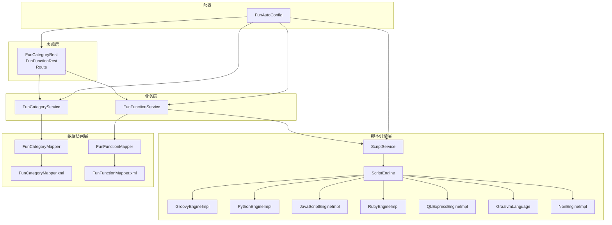
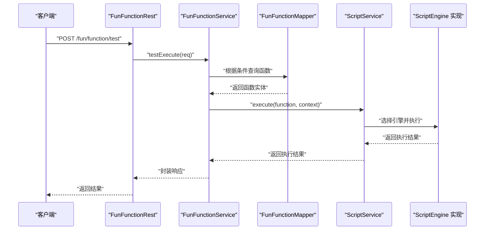
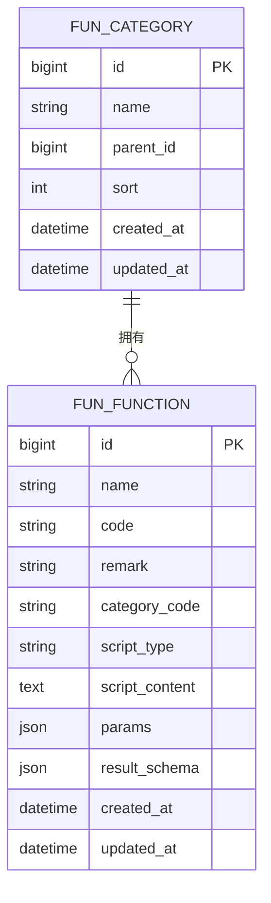
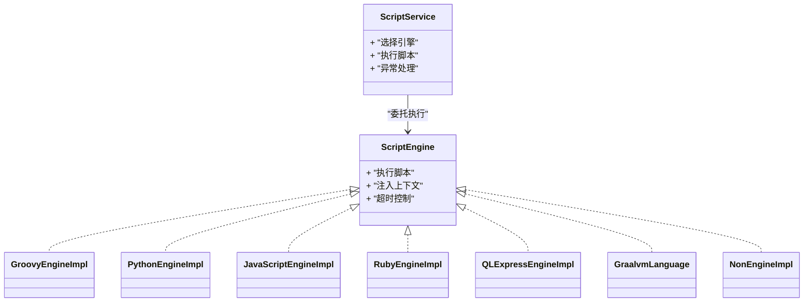
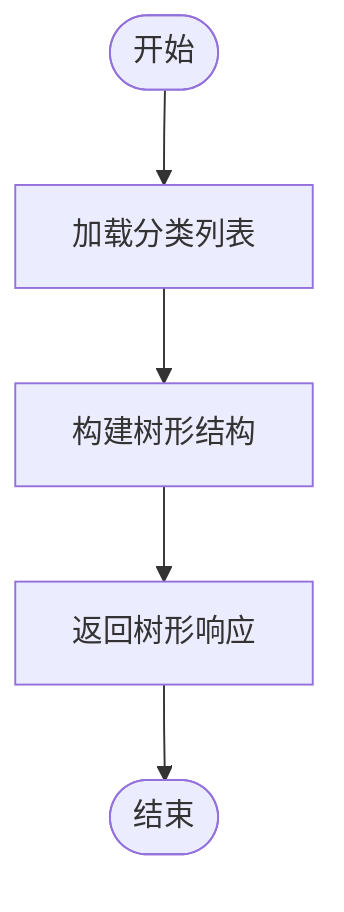
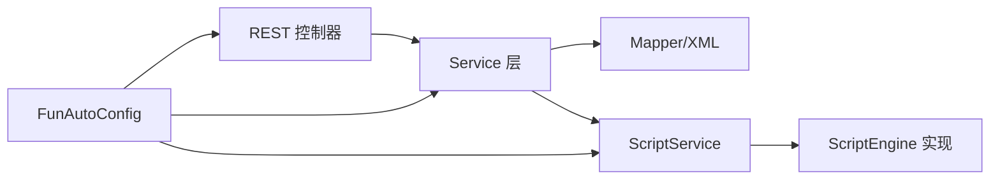

# 函数管理模块

<cite>
**本文引用的文件**
- [FunAutoConfig.java](file://micro-fun/src/main/java/com/wkclz/micro/fun/FunAutoConfig.java)
- [Route.java](file://micro-fun/src/main/java/com/wkclz/micro/fun/rest/Route.java)
- [FunCategoryRest.java](file://micro-fun/src/main/java/com/wkclz/micro/fun/rest/FunCategoryRest.java)
- [FunFunctionRest.java](file://micro-fun/src/main/java/com/wkclz/micro/fun/rest/FunFunctionRest.java)
- [FunCategoryService.java](file://micro-fun/src/main/java/com/wkclz/micro/fun/service/FunCategoryService.java)
- [FunFunctionService.java](file://micro-fun/src/main/java/com/wkclz/micro/fun/service/FunFunctionService.java)
- [FunCategory.java](file://micro-fun/src/main/java/com/wkclz/micro/fun/bean/entity/FunCategory.java)
- [FunFunction.java](file://micro-fun/src/main/java/com/wkclz/micro/fun/bean/entity/FunFunction.java)
- [FunCategoryDto.java](file://micro-fun/src/main/java/com/wkclz/micro/fun/bean/dto/FunCategoryDto.java)
- [FunFunctionDto.java](file://micro-fun/src/main/java/com/wkclz/micro/fun/bean/dto/FunFunctionDto.java)
- [FunCategoryCreateReq.java](file://micro-fun/src/main/java/com/wkclz/micro/fun/bean/req/FunCategoryCreateReq.java)
- [FunCategoryUpdateReq.java](file://micro-fun/src/main/java/com/wkclz/micro/fun/bean/req/FunCategoryUpdateReq.java)
- [FunFunctionCreateReq.java](file://micro-fun/src/main/java/com/wkclz/micro/fun/bean/req/FunFunctionCreateReq.java)
- [FunFunctionUpdateReq.java](file://micro-fun/src/main/java/com/wkclz/micro/fun/bean/req/FunFunctionUpdateReq.java)
- [FunFunctionTestReq.java](file://micro-fun/src/main/java/com/wkclz/micro/fun/bean/req/FunFunctionTestReq.java)
- [FunFunctionPageReq.java](file://micro-fun/src/main/java/com/wkclz/micro/fun/bean/req/FunFunctionPageReq.java)
- [FunCategoryResp.java](file://micro-fun/src/main/java/com/wkclz/micro/fun/bean/resp/FunCategoryResp.java)
- [FunFunctionPageResp.java](file://micro-fun/src/main/java/com/wkclz/micro/fun/bean/resp/FunFunctionPageResp.java)
- [FunCategoryMapper.java](file://micro-fun/src/main/java/com/wkclz/micro/fun/mapper/FunCategoryMapper.java)
- [FunFunctionMapper.java](file://micro-fun/src/main/java/com/wkclz/micro/fun/mapper/FunFunctionMapper.java)
- [FunCategoryMapper.xml](file://micro-fun/src/main/resources/mapper/FunCategoryMapper.xml)
- [FunFunctionMapper.xml](file://micro-fun/src/main/resources/mapper/FunFunctionMapper.xml)
- [ScriptEngine.java](file://micro-fun/src/main/java/com/wkclz/micro/fun/engine/ScriptEngine.java)
- [ScriptService.java](file://micro-fun/src/main/java/com/wkclz/micro/fun/engine/ScriptService.java)
- [GroovyEngineImpl.java](file://micro-fun/src/main/java/com/wkclz/micro/fun/engine/impl/GroovyEngineImpl.java)
- [PythonEngineImpl.java](file://micro-fun/src/main/java/com/wkclz/micro/fun/engine/impl/PythonEngineImpl.java)
- [JavaScriptEngineImpl.java](file://micro-fun/src/main/java/com/wkclz/micro/fun/engine/impl/JavaScriptEngineImpl.java)
- [RubyEngineImpl.java](file://micro-fun/src/main/java/com/wkclz/micro/fun/engine/impl/RubyEngineImpl.java)
- [QLExpressEngineImpl.java](file://micro-fun/src/main/java/com/wkclz/micro/fun/engine/impl/QLExpressEngineImpl.java)
- [GraalvmLanguage.java](file://micro-fun/src/main/java/com/wkclz/micro/fun/engine/impl/GraalvmLanguage.java)
- [NonEngineImpl.java](file://micro-fun/src/main/java/com/wkclz/micro/fun/engine/impl/NonEngineImpl.java)
- [FunCategoryTreeResp.java](file://micro-fun/src/main/java/com/wkclz/micro/fun/bean/resp/FunCategoryTreeResp.java)
- [FunFunctionResp.java](file://micro-fun/src/main/java/com/wkclz/micro/fun/bean/resp/FunFunctionResp.java)
- [FunFunctionInfoReq.java](file://micro-fun/src/main/java/com/wkclz/micro/fun/bean/req/FunFunctionInfoReq.java)
- [FunCategoryInfoReq.java](file://micro-fun/src/main/java/com/wkclz/micro/fun/bean/req/FunCategoryInfoReq.java)
- [FunCategoryListReq.java](file://micro-fun/src/main/java/com/wkclz/micro/fun/bean/req/FunCategoryListReq.java)
- [FunAutoConfig.java](file://micro-fun/pom.xml)
</cite>

## 目录
1. [简介](#简介)
2. [项目结构](#项目结构)
3. [核心组件](#核心组件)
4. [架构总览](#架构总览)
5. [详细组件分析](#详细组件分析)
6. [依赖关系分析](#依赖关系分析)
7. [性能考虑](#性能考虑)
8. [故障排查指南](#故障排查指南)
9. [结论](#结论)
10. [附录](#附录)

## 简介
函数管理模块提供多语言脚本引擎集成能力，支持 Groovy、Python、JavaScript、Ruby、QLExpress 等脚本引擎，用于动态执行函数脚本。模块包含函数分类管理和函数实体管理两大功能域，并通过统一的脚本执行服务完成脚本解析、编译与运行。该模块采用分层架构：表现层（REST 接口）、业务层（Service）、数据访问层（Mapper/XML），并通过自动装配在 Spring Boot 启动时加载。

## 项目结构
函数管理模块位于 micro-fun 目录下，主要由以下层次组成：
- bean 层：定义 DTO、Entity、请求/响应对象
- engine 层：脚本引擎抽象与实现，统一脚本执行接口
- mapper 层：MyBatis 映射器与 XML
- rest 层：HTTP 路由与控制器
- service 层：业务逻辑封装
- 配置：自动装配配置类与 Spring 自动导入文件

图表来源
- [FunAutoConfig.java](file://micro-fun/src/main/java/com/wkclz/micro/fun/FunAutoConfig.java)
- [Route.java](file://micro-fun/src/main/java/com/wkclz/micro/fun/rest/Route.java)
- [FunCategoryRest.java](file://micro-fun/src/main/java/com/wkclz/micro/fun/rest/FunCategoryRest.java)
- [FunFunctionRest.java](file://micro-fun/src/main/java/com/wkclz/micro/fun/rest/FunFunctionRest.java)
- [FunCategoryService.java](file://micro-fun/src/main/java/com/wkclz/micro/fun/service/FunCategoryService.java)
- [FunFunctionService.java](file://micro-fun/src/main/java/com/wkclz/micro/fun/service/FunFunctionService.java)
- [FunCategoryMapper.java](file://micro-fun/src/main/java/com/wkclz/micro/fun/mapper/FunCategoryMapper.java)
- [FunFunctionMapper.java](file://micro-fun/src/main/java/com/wkclz/micro/fun/mapper/FunFunctionMapper.java)
- [FunCategoryMapper.xml](file://micro-fun/src/main/resources/mapper/FunCategoryMapper.xml)
- [FunFunctionMapper.xml](file://micro-fun/src/main/resources/mapper/FunFunctionMapper.xml)
- [ScriptEngine.java](file://micro-fun/src/main/java/com/wkclz/micro/fun/engine/ScriptEngine.java)
- [ScriptService.java](file://micro-fun/src/main/java/com/wkclz/micro/fun/engine/ScriptService.java)
- [GroovyEngineImpl.java](file://micro-fun/src/main/java/com/wkclz/micro/fun/engine/impl/GroovyEngineImpl.java)
- [PythonEngineImpl.java](file://micro-fun/src/main/java/com/wkclz/micro/fun/engine/impl/PythonEngineImpl.java)
- [JavaScriptEngineImpl.java](file://micro-fun/src/main/java/com/wkclz/micro/fun/engine/impl/JavaScriptEngineImpl.java)
- [RubyEngineImpl.java](file://micro-fun/src/main/java/com/wkclz/micro/fun/engine/impl/RubyEngineImpl.java)
- [QLExpressEngineImpl.java](file://micro-fun/src/main/java/com/wkclz/micro/fun/engine/impl/QLExpressEngineImpl.java)
- [GraalvmLanguage.java](file://micro-fun/src/main/java/com/wkclz/micro/fun/engine/impl/GraalvmLanguage.java)
- [NonEngineImpl.java](file://micro-fun/src/main/java/com/wkclz/micro/fun/engine/impl/NonEngineImpl.java)

章节来源
- [FunAutoConfig.java](file://micro-fun/src/main/java/com/wkclz/micro/fun/FunAutoConfig.java)
- [Route.java](file://micro-fun/src/main/java/com/wkclz/micro/fun/rest/Route.java)

## 核心组件
- 自动装配配置：负责注册 REST 控制器、Service、Mapper 与脚本引擎组件，确保模块在 Spring Boot 启动时被正确加载。
- REST 控制器：提供函数分类与函数的 CRUD、分页查询、测试执行等接口。
- Service 层：封装业务逻辑，包括分类树构建、函数分页检索、脚本执行与结果返回。
- Mapper/XML：基于 MyBatis 的数据库映射，提供分类与函数的持久化能力。
- 脚本引擎：统一的脚本执行抽象，内置多种语言实现，支持安全上下文注入与超时控制。

章节来源
- [FunAutoConfig.java](file://micro-fun/src/main/java/com/wkclz/micro/fun/FunAutoConfig.java)
- [FunCategoryRest.java](file://micro-fun/src/main/java/com/wkclz/micro/fun/rest/FunCategoryRest.java)
- [FunFunctionRest.java](file://micro-fun/src/main/java/com/wkclz/micro/fun/rest/FunFunctionRest.java)
- [FunCategoryService.java](file://micro-fun/src/main/java/com/wkclz/micro/fun/service/FunCategoryService.java)
- [FunFunctionService.java](file://micro-fun/src/main/java/com/wkclz/micro/fun/service/FunFunctionService.java)
- [FunCategoryMapper.java](file://micro-fun/src/main/java/com/wkclz/micro/fun/mapper/FunCategoryMapper.java)
- [FunFunctionMapper.java](file://micro-fun/src/main/java/com/wkclz/micro/fun/mapper/FunFunctionMapper.java)
- [FunCategoryMapper.xml](file://micro-fun/src/main/resources/mapper/FunCategoryMapper.xml)
- [FunFunctionMapper.xml](file://micro-fun/src/main/resources/mapper/FunFunctionMapper.xml)
- [ScriptEngine.java](file://micro-fun/src/main/java/com/wkclz/micro/fun/engine/ScriptEngine.java)
- [ScriptService.java](file://micro-fun/src/main/java/com/wkclz/micro/fun/engine/ScriptService.java)

## 架构总览
函数管理模块采用典型的分层架构，结合脚本引擎的动态执行特性，形成“REST → Service → Mapper/XML → ScriptService → ScriptEngine 实现”的调用链路。统一的脚本执行服务负责选择合适的脚本引擎、注入上下文、执行脚本并返回结果。

图表来源
- [FunFunctionRest.java](file://micro-fun/src/main/java/com/wkclz/micro/fun/rest/FunFunctionRest.java)
- [FunFunctionService.java](file://micro-fun/src/main/java/com/wkclz/micro/fun/service/FunFunctionService.java)
- [FunFunctionMapper.java](file://micro-fun/src/main/java/com/wkclz/micro/fun/mapper/FunFunctionMapper.java)
- [ScriptService.java](file://micro-fun/src/main/java/com/wkclz/micro/fun/engine/ScriptService.java)
- [ScriptEngine.java](file://micro-fun/src/main/java/com/wkclz/micro/fun/engine/ScriptEngine.java)

## 详细组件分析

### 数据模型设计
函数分类与函数实体采用清晰的领域模型设计，分别对应分类树形结构与函数脚本条目。DTO 用于对外传输，请求/响应对象用于接口参数与返回值封装。

图表来源
- [FunCategory.java](file://micro-fun/src/main/java/com/wkclz/micro/fun/bean/entity/FunCategory.java)
- [FunFunction.java](file://micro-fun/src/main/java/com/wkclz/micro/fun/bean/entity/FunFunction.java)

章节来源
- [FunCategory.java](file://micro-fun/src/main/java/com/wkclz/micro/fun/bean/entity/FunCategory.java)
- [FunFunction.java](file://micro-fun/src/main/java/com/wkclz/micro/fun/bean/entity/FunFunction.java)
- [FunCategoryDto.java](file://micro-fun/src/main/java/com/wkclz/micro/fun/bean/dto/FunCategoryDto.java)
- [FunFunctionDto.java](file://micro-fun/src/main/java/com/wkclz/micro/fun/bean/dto/FunFunctionDto.java)

### REST 接口与路由
- 分类接口：提供分类的新增、更新、删除、列表、树形结构查询等能力。
- 函数接口：提供函数的新增、更新、删除、详情、分页、测试执行等能力。
- 路由：集中定义模块内的 REST 路由前缀与映射。

章节来源
- [FunCategoryRest.java](file://micro-fun/src/main/java/com/wkclz/micro/fun/rest/FunCategoryRest.java)
- [FunFunctionRest.java](file://micro-fun/src/main/java/com/wkclz/micro/fun/rest/FunFunctionRest.java)
- [Route.java](file://micro-fun/src/main/java/com/wkclz/micro/fun/rest/Route.java)

### Service 层职责
- 分类服务：负责分类树构建、父子关系维护、排序与唯一性约束。
- 函数服务：负责函数分页检索、详情查询、测试执行、参数与结果模式校验。
- 脚本执行：通过统一的 ScriptService 将函数脚本与上下文传入脚本引擎执行。

章节来源
- [FunCategoryService.java](file://micro-fun/src/main/java/com/wkclz/micro/fun/service/FunCategoryService.java)
- [FunFunctionService.java](file://micro-fun/src/main/java/com/wkclz/micro/fun/service/FunFunctionService.java)

### 脚本引擎集成
脚本引擎层提供统一的 ScriptEngine 抽象与 ScriptService 执行入口，内置多种语言实现，支持 GraalVM 多语言运行时与专用引擎（如 QLExpress）。

图表来源
- [ScriptEngine.java](file://micro-fun/src/main/java/com/wkclz/micro/fun/engine/ScriptEngine.java)
- [ScriptService.java](file://micro-fun/src/main/java/com/wkclz/micro/fun/engine/ScriptService.java)
- [GroovyEngineImpl.java](file://micro-fun/src/main/java/com/wkclz/micro/fun/engine/impl/GroovyEngineImpl.java)
- [PythonEngineImpl.java](file://micro-fun/src/main/java/com/wkclz/micro/fun/engine/impl/PythonEngineImpl.java)
- [JavaScriptEngineImpl.java](file://micro-fun/src/main/java/com/wkclz/micro/fun/engine/impl/JavaScriptEngineImpl.java)
- [RubyEngineImpl.java](file://micro-fun/src/main/java/com/wkclz/micro/fun/engine/impl/RubyEngineImpl.java)
- [QLExpressEngineImpl.java](file://micro-fun/src/main/java/com/wkclz/micro/fun/engine/impl/QLExpressEngineImpl.java)
- [GraalvmLanguage.java](file://micro-fun/src/main/java/com/wkclz/micro/fun/engine/impl/GraalvmLanguage.java)
- [NonEngineImpl.java](file://micro-fun/src/main/java/com/wkclz/micro/fun/engine/impl/NonEngineImpl.java)

章节来源
- [ScriptEngine.java](file://micro-fun/src/main/java/com/wkclz/micro/fun/engine/ScriptEngine.java)
- [ScriptService.java](file://micro-fun/src/main/java/com/wkclz/micro/fun/engine/ScriptService.java)
- [GroovyEngineImpl.java](file://micro-fun/src/main/java/com/wkclz/micro/fun/engine/impl/GroovyEngineImpl.java)
- [PythonEngineImpl.java](file://micro-fun/src/main/java/com/wkclz/micro/fun/engine/impl/PythonEngineImpl.java)
- [JavaScriptEngineImpl.java](file://micro-fun/src/main/java/com/wkclz/micro/fun/engine/impl/JavaScriptEngineImpl.java)
- [RubyEngineImpl.java](file://micro-fun/src/main/java/com/wkclz/micro/fun/engine/impl/RubyEngineImpl.java)
- [QLExpressEngineImpl.java](file://micro-fun/src/main/java/com/wkclz/micro/fun/engine/impl/QLExpressEngineImpl.java)
- [GraalvmLanguage.java](file://micro-fun/src/main/java/com/wkclz/micro/fun/engine/impl/GraalvmLanguage.java)
- [NonEngineImpl.java](file://micro-fun/src/main/java/com/wkclz/micro/fun/engine/impl/NonEngineImpl.java)

### 函数分类管理流程
函数分类管理支持树形结构展示与层级关系维护。典型流程包括：查询分类列表 → 组装树形结构 → 返回树形响应。

图表来源
- [FunCategoryRest.java](file://micro-fun/src/main/java/com/wkclz/micro/fun/rest/FunCategoryRest.java)
- [FunCategoryService.java](file://micro-fun/src/main/java/com/wkclz/micro/fun/service/FunCategoryService.java)
- [FunCategoryListReq.java](file://micro-fun/src/main/java/com/wkclz/micro/fun/bean/req/FunCategoryListReq.java)
- [FunCategoryTreeResp.java](file://micro-fun/src/main/java/com/wkclz/micro/fun/bean/resp/FunCategoryTreeResp.java)

章节来源
- [FunCategoryRest.java](file://micro-fun/src/main/java/com/wkclz/micro/fun/rest/FunCategoryRest.java)
- [FunCategoryService.java](file://micro-fun/src/main/java/com/wkclz/micro/fun/service/FunCategoryService.java)
- [FunCategoryListReq.java](file://micro-fun/src/main/java/com/wkclz/micro/fun/bean/req/FunCategoryListReq.java)
- [FunCategoryTreeResp.java](file://micro-fun/src/main/java/com/wkclz/micro/fun/bean/resp/FunCategoryTreeResp.java)

### 函数执行与测试流程
函数测试执行流程包括：接收测试请求 → 查询函数 → 注入上下文 → 选择脚本引擎 → 执行脚本 → 返回结果。

图表来源
- [FunFunctionRest.java](file://micro-fun/src/main/java/com/wkclz/micro/fun/rest/FunFunctionRest.java)
- [FunFunctionService.java](file://micro-fun/src/main/java/com/wkclz/micro/fun/service/FunFunctionService.java)
- [FunFunctionTestReq.java](file://micro-fun/src/main/java/com/wkclz/micro/fun/bean/req/FunFunctionTestReq.java)
- [FunFunctionResp.java](file://micro-fun/src/main/java/com/wkclz/micro/fun/bean/resp/FunFunctionResp.java)
- [ScriptService.java](file://micro-fun/src/main/java/com/wkclz/micro/fun/engine/ScriptService.java)
- [ScriptEngine.java](file://micro-fun/src/main/java/com/wkclz/micro/fun/engine/ScriptEngine.java)

章节来源
- [FunFunctionRest.java](file://micro-fun/src/main/java/com/wkclz/micro/fun/rest/FunFunctionRest.java)
- [FunFunctionService.java](file://micro-fun/src/main/java/com/wkclz/micro/fun/service/FunFunctionService.java)
- [FunFunctionTestReq.java](file://micro-fun/src/main/java/com/wkclz/micro/fun/bean/req/FunFunctionTestReq.java)
- [FunFunctionResp.java](file://micro-fun/src/main/java/com/wkclz/micro/fun/bean/resp/FunFunctionResp.java)
- [ScriptService.java](file://micro-fun/src/main/java/com/wkclz/micro/fun/engine/ScriptService.java)
- [ScriptEngine.java](file://micro-fun/src/main/java/com/wkclz/micro/fun/engine/ScriptEngine.java)

### 不同脚本引擎特性与适用场景
- Groovy：JVM 生态，语法接近 Java，适合复杂业务逻辑与高性能需求。
- Python：生态丰富，适合数据分析与快速原型。
- JavaScript：前端/全栈通用，适合轻量逻辑与浏览器端协作。
- Ruby：简洁优雅，适合快速开发与 DSL 场景。
- QLExpress：面向规则表达式与查询计算，适合复杂条件判断与表达式求值。

章节来源
- [GroovyEngineImpl.java](file://micro-fun/src/main/java/com/wkclz/micro/fun/engine/impl/GroovyEngineImpl.java)
- [PythonEngineImpl.java](file://micro-fun/src/main/java/com/wkclz/micro/fun/engine/impl/PythonEngineImpl.java)
- [JavaScriptEngineImpl.java](file://micro-fun/src/main/java/com/wkclz/micro/fun/engine/impl/JavaScriptEngineImpl.java)
- [RubyEngineImpl.java](file://micro-fun/src/main/java/com/wkclz/micro/fun/engine/impl/RubyEngineImpl.java)
- [QLExpressEngineImpl.java](file://micro-fun/src/main/java/com/wkclz/micro/fun/engine/impl/QLExpressEngineImpl.java)

### 函数开发指南
- 设计阶段：明确函数用途、输入参数与输出结构，编写参数与结果模式。
- 编写脚本：根据目标语言选择合适引擎，遵循模块内上下文注入规范。
- 测试执行：使用测试接口验证脚本逻辑，关注边界条件与异常分支。
- 发布上线：完成单元测试与集成测试，确保脚本稳定性与安全性。

章节来源
- [FunFunctionCreateReq.java](file://micro-fun/src/main/java/com/wkclz/micro/fun/bean/req/FunFunctionCreateReq.java)
- [FunFunctionUpdateReq.java](file://micro-fun/src/main/java/com/wkclz/micro/fun/bean/req/FunFunctionUpdateReq.java)
- [FunFunctionTestReq.java](file://micro-fun/src/main/java/com/wkclz/micro/fun/bean/req/FunFunctionTestReq.java)

### 执行性能优化
- 引擎选择：根据业务复杂度与性能要求选择合适引擎；对高频调用场景优先考虑 JVM 生态引擎。
- 上下文复用：避免重复构造上下文，尽量复用已有的执行环境。
- 结果缓存：对稳定且昂贵的计算结果进行缓存，减少重复执行。
- 超时控制：为脚本设置合理的超时阈值，防止长时间阻塞影响系统稳定性。

章节来源
- [ScriptService.java](file://micro-fun/src/main/java/com/wkclz/micro/fun/engine/ScriptService.java)
- [ScriptEngine.java](file://micro-fun/src/main/java/com/wkclz/micro/fun/engine/ScriptEngine.java)

### 错误处理策略
- 输入校验：对请求参数与脚本内容进行严格校验，拒绝非法输入。
- 异常捕获：在脚本执行过程中捕获异常并转换为统一错误码与提示。
- 回滚与重试：对关键流程引入幂等与重试机制，保障一致性。
- 日志记录：记录脚本执行日志与错误堆栈，便于问题定位与审计。

章节来源
- [FunFunctionRest.java](file://micro-fun/src/main/java/com/wkclz/micro/fun/rest/FunFunctionRest.java)
- [FunFunctionService.java](file://micro-fun/src/main/java/com/wkclz/micro/fun/service/FunFunctionService.java)
- [ScriptService.java](file://micro-fun/src/main/java/com/wkclz/micro/fun/engine/ScriptService.java)

## 依赖关系分析
模块内部依赖清晰，遵循分层解耦原则。REST 控制器仅依赖 Service，Service 依赖 Mapper 与 ScriptService，ScriptService 再依赖具体脚本引擎实现。配置类负责组件注册与自动装配。

图表来源
- [FunAutoConfig.java](file://micro-fun/src/main/java/com/wkclz/micro/fun/FunAutoConfig.java)
- [FunCategoryRest.java](file://micro-fun/src/main/java/com/wkclz/micro/fun/rest/FunCategoryRest.java)
- [FunFunctionRest.java](file://micro-fun/src/main/java/com/wkclz/micro/fun/rest/FunFunctionRest.java)
- [FunCategoryService.java](file://micro-fun/src/main/java/com/wkclz/micro/fun/service/FunCategoryService.java)
- [FunFunctionService.java](file://micro-fun/src/main/java/com/wkclz/micro/fun/service/FunFunctionService.java)
- [ScriptService.java](file://micro-fun/src/main/java/com/wkclz/micro/fun/engine/ScriptService.java)
- [ScriptEngine.java](file://micro-fun/src/main/java/com/wkclz/micro/fun/engine/ScriptEngine.java)

章节来源
- [FunAutoConfig.java](file://micro-fun/src/main/java/com/wkclz/micro/fun/FunAutoConfig.java)

## 性能考虑
- 脚本引擎初始化成本：首次加载引擎存在开销，建议在应用启动阶段预热或按需懒加载。
- 上下文注入与序列化：避免频繁深拷贝与大对象序列化，合理设计上下文结构。
- 并发执行：对高并发场景建议引入线程池与限流策略，防止资源耗尽。
- 缓存策略：对热点函数与中间结果进行缓存，降低重复计算与引擎调用次数。

## 故障排查指南
- 接口调用失败：检查请求参数是否符合 DTO/Req 规范，确认路由前缀与权限。
- 脚本执行异常：查看脚本引擎日志与错误码，定位语法或运行时错误。
- 数据不一致：核对 Mapper XML 与实体字段映射，确认事务与锁策略。
- 性能瓶颈：监控脚本执行时间与引擎占用率，优化脚本逻辑与缓存策略。

章节来源
- [FunFunctionRest.java](file://micro-fun/src/main/java/com/wkclz/micro/fun/rest/FunFunctionRest.java)
- [FunFunctionService.java](file://micro-fun/src/main/java/com/wkclz/micro/fun/service/FunFunctionService.java)
- [FunFunctionMapper.xml](file://micro-fun/src/main/resources/mapper/FunFunctionMapper.xml)
- [FunCategoryMapper.xml](file://micro-fun/src/main/resources/mapper/FunCategoryMapper.xml)

## 结论
函数管理模块通过清晰的分层架构与统一的脚本执行服务，实现了多语言脚本引擎的无缝集成。模块提供了完善的函数分类与函数管理能力，并以 REST 接口对外暴露。通过合理的性能优化与错误处理策略，可满足生产环境对稳定性与可维护性的要求。

## 附录
- 最佳实践建议
  - 在设计阶段明确函数职责与边界，避免过度复杂的脚本逻辑。
  - 使用参数与结果模式约束输入输出，提升可维护性与可测试性。
  - 对高频函数建立缓存与版本管理，确保性能与一致性。
  - 在测试环境中充分验证脚本行为，覆盖正常与异常路径。