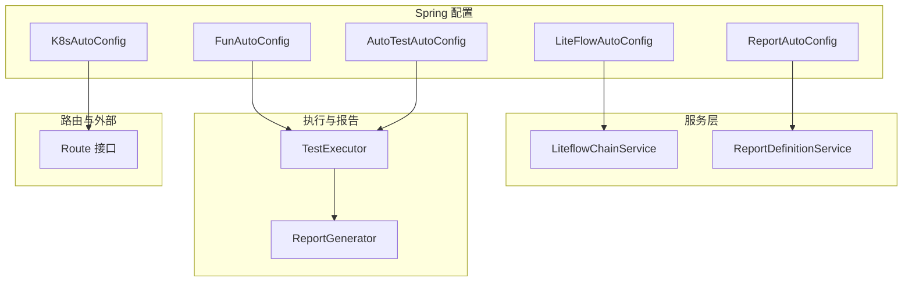
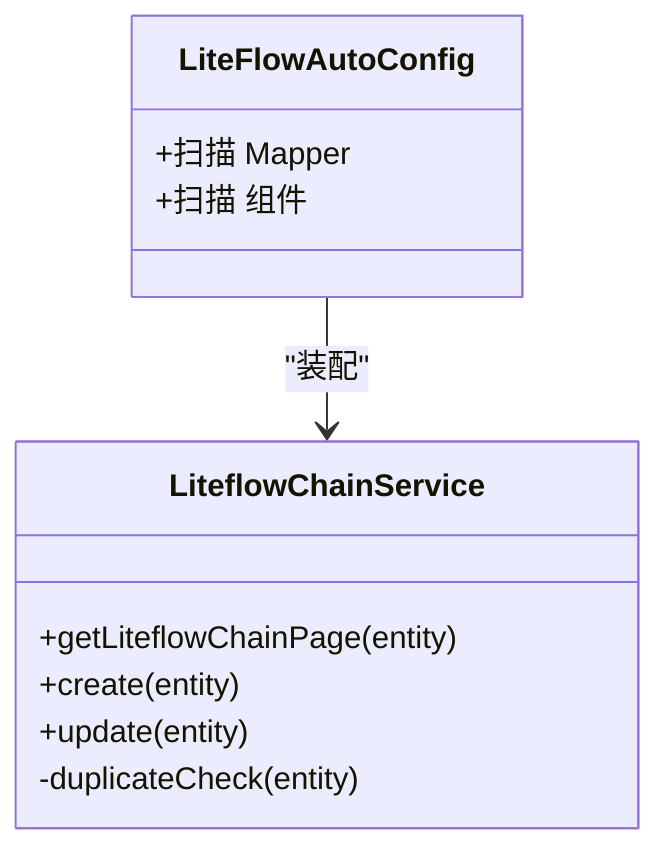
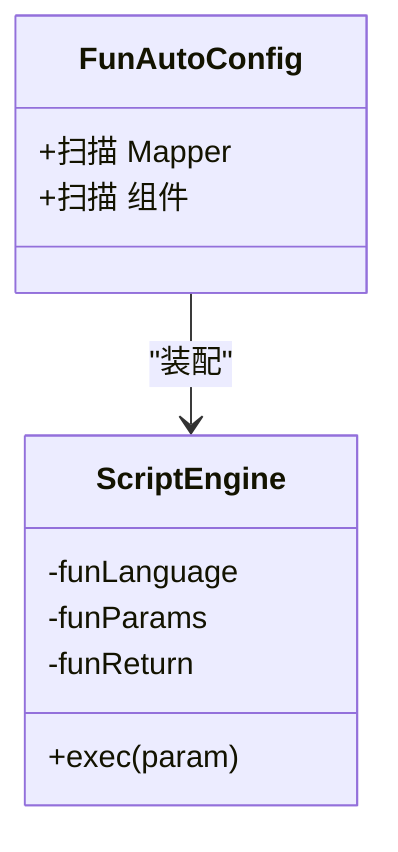
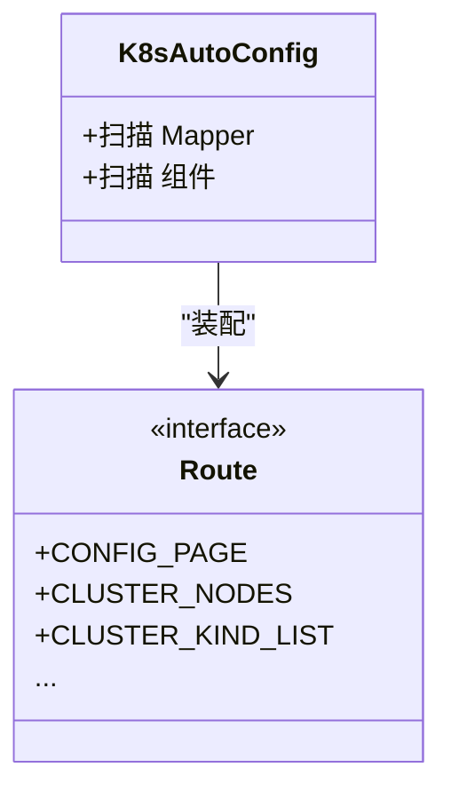
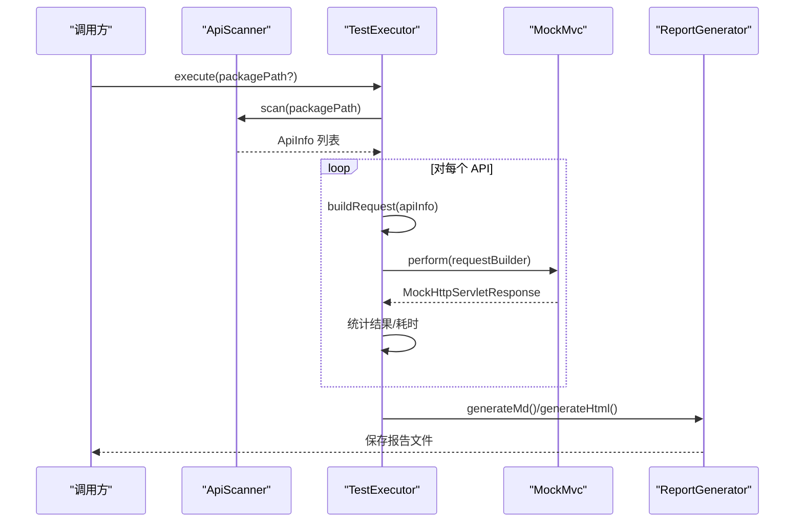
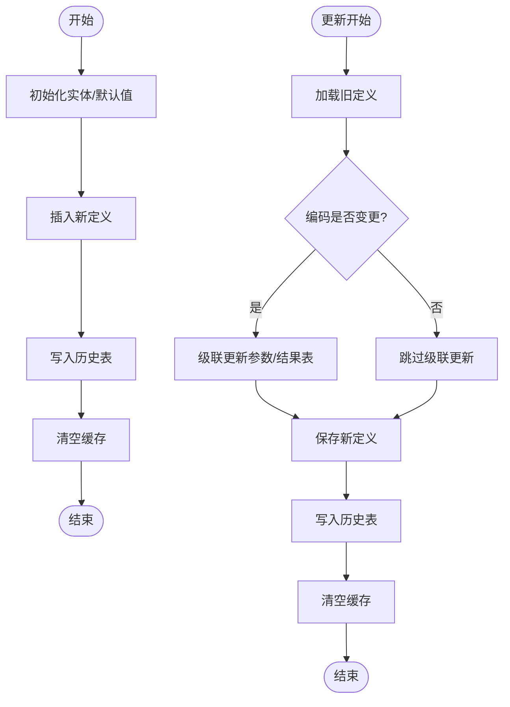
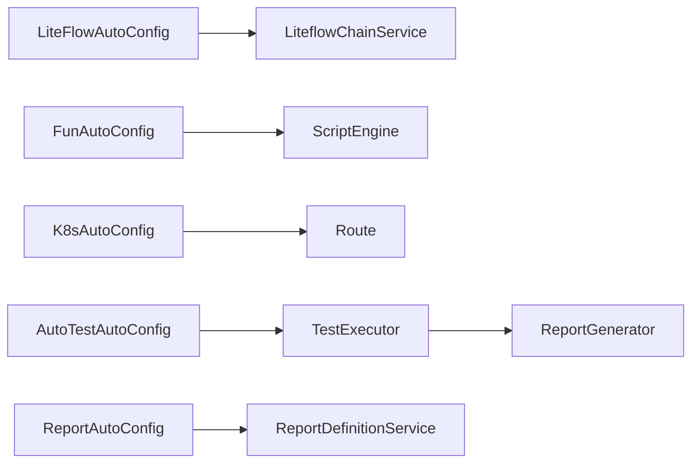

# 基础设施模块

<cite>
**本文引用的文件**
- [LiteFlowAutoConfig.java](file://micro-liteflow/src/main/java/com/wkclz/micro/liteflow/LiteFlowAutoConfig.java)
- [LiteflowChainService.java](file://micro-liteflow/src/main/java/com/wkclz/micro/liteflow/service/LiteflowChainService.java)
- [Route.java](file://micro-k8s/src/main/java/com/wkclz/micro/k8s/Route.java)
- [K8sAutoConfig.java](file://micro-k8s/src/main/java/com/wkclz/micro/k8s/K8sAutoConfig.java)
- [ScriptEngine.java](file://micro-fun/src/main/java/com/wkclz/micro/fun/engine/ScriptEngine.java)
- [FunAutoConfig.java](file://micro-fun/src/main/java/com/wkclz/micro/fun/FunAutoConfig.java)
- [AutoTestAutoConfig.java](file://micro-autotest/src/main/java/com/wkclz/auto/AutoTestAutoConfig.java)
- [TestExecutor.java](file://micro-autotest/src/main/java/com/wkclz/auto/executor/TestExecutor.java)
- [ReportGenerator.java](file://micro-autotest/src/main/java/com/wkclz/auto/report/ReportGenerator.java)
- [ReportAutoConfig.java](file://micro-report/src/main/java/com/wkclz/micro/report/ReportAutoConfig.java)
- [ReportDefinitionService.java](file://micro-report/src/main/java/com/wkclz/micro/report/service/ReportDefinitionService.java)
</cite>

## 目录
1. [引言](#引言)
2. [项目结构](#项目结构)
3. [核心组件](#核心组件)
4. [架构总览](#架构总览)
5. [详细组件分析](#详细组件分析)
6. [依赖分析](#依赖分析)
7. [性能考虑](#性能考虑)
8. [故障排查指南](#故障排查指南)
9. [结论](#结论)
10. [附录](#附录)

## 引言
本文件面向 sh-microapp 的基础设施模块，围绕规则引擎（LiteFlow）、函数管理、Kubernetes 资源管理、自动化测试、报表系统与数据视图进行系统性架构与实现解析。文档旨在帮助读者理解各模块的设计原理、控制流与数据流，并给出配置指南、使用示例与性能优化建议，同时阐明模块间的协作关系与可扩展性。

## 项目结构
基础设施相关模块在微服务架构中以“功能域”划分，每个模块自包含配置、接口路由、服务层、持久层与自动装配入口，形成清晰的层次化组织方式。下图展示与基础设施相关的模块与职责概览：

```mermaid
graph TB
subgraph "规则引擎"
LFA["LiteFlowAutoConfig<br/>规则链与脚本映射扫描"]
LCS["LiteflowChainService<br/>规则链分页/增删改"]
end
subgraph "函数管理"
FA["FunAutoConfig<br/>函数与脚本映射扫描"]
SE["ScriptEngine<br/>脚本引擎抽象"]
end
subgraph "Kubernetes 资源管理"
KA["K8sAutoConfig<br/>K8s 映射与组件扫描"]
RK["Route 接口<br/>K8s 路由常量"]
end
subgraph "自动化测试"
ATA["AutoTestAutoConfig<br/>组件扫描"]
TE["TestExecutor<br/>API 扫描/执行/统计"]
RG["ReportGenerator<br/>报告生成(MD/HTML)"]
end
subgraph "报表系统与数据视图"
RA["ReportAutoConfig<br/>报表映射与组件扫描"]
RDS["ReportDefinitionService<br/>定义/历史/参数/结果管理"]
end
LFA --> LCS
FA --> SE
KA --> RK
ATA --> TE --> RG
RA --> RDS
```

图表来源
- [LiteFlowAutoConfig.java:1-11](file://micro-liteflow/src/main/java/com/wkclz/micro/liteflow/LiteFlowAutoConfig.java#L1-L11)
- [LiteflowChainService.java:1-64](file://micro-liteflow/src/main/java/com/wkclz/micro/liteflow/service/LiteflowChainService.java#L1-L64)
- [FunAutoConfig.java:1-11](file://micro-fun/src/main/java/com/wkclz/micro/fun/FunAutoConfig.java#L1-L11)
- [ScriptEngine.java:1-53](file://micro-fun/src/main/java/com/wkclz/micro/fun/engine/ScriptEngine.java#L1-L53)
- [K8sAutoConfig.java:1-11](file://micro-k8s/src/main/java/com/wkclz/micro/k8s/K8sAutoConfig.java#L1-L11)
- [Route.java:1-56](file://micro-k8s/src/main/java/com/wkclz/micro/k8s/Route.java#L1-L56)
- [AutoTestAutoConfig.java:1-10](file://micro-autotest/src/main/java/com/wkclz/auto/AutoTestAutoConfig.java#L1-L10)
- [TestExecutor.java:1-196](file://micro-autotest/src/main/java/com/wkclz/auto/executor/TestExecutor.java#L1-L196)
- [ReportGenerator.java:1-214](file://micro-autotest/src/main/java/com/wkclz/auto/report/ReportGenerator.java#L1-L214)
- [ReportAutoConfig.java:1-12](file://micro-report/src/main/java/com/wkclz/micro/report/ReportAutoConfig.java#L1-L12)
- [ReportDefinitionService.java:1-163](file://micro-report/src/main/java/com/wkclz/micro/report/service/ReportDefinitionService.java#L1-L163)

章节来源
- [LiteFlowAutoConfig.java:1-11](file://micro-liteflow/src/main/java/com/wkclz/micro/liteflow/LiteFlowAutoConfig.java#L1-L11)
- [FunAutoConfig.java:1-11](file://micro-fun/src/main/java/com/wkclz/micro/fun/FunAutoConfig.java#L1-L11)
- [K8sAutoConfig.java:1-11](file://micro-k8s/src/main/java/com/wkclz/micro/k8s/K8sAutoConfig.java#L1-L11)
- [AutoTestAutoConfig.java:1-10](file://micro-autotest/src/main/java/com/wkclz/auto/AutoTestAutoConfig.java#L1-L10)
- [ReportAutoConfig.java:1-12](file://micro-report/src/main/java/com/wkclz/micro/report/ReportAutoConfig.java#L1-L12)

## 核心组件
- 规则引擎（LiteFlow）
  - 自动装配：通过配置类扫描 Mapper 与组件，确保规则链与脚本映射可用。
  - 服务层：提供规则链的分页查询、创建、更新与重复性校验等基础能力。
- 函数管理（Fun）
  - 自动装配：扫描函数与脚本相关 Mapper 与组件。
  - 脚本引擎：抽象脚本执行器，支持语言/返回类型/参数/脚本体的统一封装。
- Kubernetes 资源管理（K8s）
  - 自动装配：扫描 K8s 相关 Mapper 与组件。
  - 路由常量：集中定义 K8s 配置、集群信息与 Kind 资源的 REST 接口路径。
- 自动化测试（AutoTest）
  - 自动装配：扫描组件，启用测试执行与报告生成。
  - 执行器：扫描 API、构造请求、执行并统计结果；异常捕获与清理。
  - 报告生成：输出 Markdown 与 HTML 报告，包含摘要与失败用例详情。
- 报表系统与数据视图（Report）
  - 自动装配：扫描报表相关 Mapper 与组件。
  - 服务层：负责报表定义的分页、新增、更新、删除、历史写入与 SQL 测试。

章节来源
- [LiteflowChainService.java:1-64](file://micro-liteflow/src/main/java/com/wkclz/micro/liteflow/service/LiteflowChainService.java#L1-L64)
- [ScriptEngine.java:1-53](file://micro-fun/src/main/java/com/wkclz/micro/fun/engine/ScriptEngine.java#L1-L53)
- [Route.java:1-56](file://micro-k8s/src/main/java/com/wkclz/micro/k8s/Route.java#L1-L56)
- [TestExecutor.java:1-196](file://micro-autotest/src/main/java/com/wkclz/auto/executor/TestExecutor.java#L1-L196)
- [ReportGenerator.java:1-214](file://micro-autotest/src/main/java/com/wkclz/auto/report/ReportGenerator.java#L1-L214)
- [ReportDefinitionService.java:1-163](file://micro-report/src/main/java/com/wkclz/micro/report/service/ReportDefinitionService.java#L1-L163)

## 架构总览
基础设施模块通过 Spring 组件扫描与 MyBatis Mapper 扫描实现“零样板代码”的快速接入。模块间通过统一的 REST 路由常量与服务层接口协同工作，形成“配置即能力”的基础设施能力池。

图表来源
- [LiteFlowAutoConfig.java:1-11](file://micro-liteflow/src/main/java/com/wkclz/micro/liteflow/LiteFlowAutoConfig.java#L1-L11)
- [FunAutoConfig.java:1-11](file://micro-fun/src/main/java/com/wkclz/micro/fun/FunAutoConfig.java#L1-L11)
- [K8sAutoConfig.java:1-11](file://micro-k8s/src/main/java/com/wkclz/micro/k8s/K8sAutoConfig.java#L1-L11)
- [AutoTestAutoConfig.java:1-10](file://micro-autotest/src/main/java/com/wkclz/auto/AutoTestAutoConfig.java#L1-L10)
- [ReportAutoConfig.java:1-12](file://micro-report/src/main/java/com/wkclz/micro/report/ReportAutoConfig.java#L1-L12)
- [LiteflowChainService.java:1-64](file://micro-liteflow/src/main/java/com/wkclz/micro/liteflow/service/LiteflowChainService.java#L1-L64)
- [ReportDefinitionService.java:1-163](file://micro-report/src/main/java/com/wkclz/micro/report/service/ReportDefinitionService.java#L1-L163)
- [TestExecutor.java:1-196](file://micro-autotest/src/main/java/com/wkclz/auto/executor/TestExecutor.java#L1-L196)
- [ReportGenerator.java:1-214](file://micro-autotest/src/main/java/com/wkclz/auto/report/ReportGenerator.java#L1-L214)
- [Route.java:1-56](file://micro-k8s/src/main/java/com/wkclz/micro/k8s/Route.java#L1-L56)

## 详细组件分析

### 规则引擎（LiteFlow）组件分析
- 设计要点
  - 自动装配：通过注解扫描 Mapper 与组件包，确保规则链与脚本映射可用。
  - 服务层：提供分页查询、创建、更新与重复性校验，遵循“只覆盖单表逻辑”的约定。
- 关键流程
  - 规则链分页：基于分页查询工具，将实体转换为分页结果。
  - 创建/更新：先做重复性检查，再插入或选择性更新。
- 复杂度与性能
  - 分页查询时间复杂度 O(n)，重复性校验取决于索引设计。
  - 建议对规则链关键字段建立唯一索引，减少重复性校验成本。

图表来源
- [LiteFlowAutoConfig.java:1-11](file://micro-liteflow/src/main/java/com/wkclz/micro/liteflow/LiteFlowAutoConfig.java#L1-L11)
- [LiteflowChainService.java:1-64](file://micro-liteflow/src/main/java/com/wkclz/micro/liteflow/service/LiteflowChainService.java#L1-L64)

章节来源
- [LiteFlowAutoConfig.java:1-11](file://micro-liteflow/src/main/java/com/wkclz/micro/liteflow/LiteFlowAutoConfig.java#L1-L11)
- [LiteflowChainService.java:1-64](file://micro-liteflow/src/main/java/com/wkclz/micro/liteflow/service/LiteflowChainService.java#L1-L64)

### 函数管理（Fun）组件分析
- 设计要点
  - 自动装配：扫描函数与脚本相关 Mapper 与组件。
  - 脚本引擎抽象：统一封装语言、参数、返回类型与脚本体，便于扩展具体语言实现。
- 关键流程
  - 参数与返回类型映射：根据字符串描述映射到 Java 类型。
  - 执行接口：子类需实现具体执行逻辑。
- 扩展性
  - 新增语言时，继承抽象引擎并实现执行方法，保持调用方一致。

图表来源
- [FunAutoConfig.java:1-11](file://micro-fun/src/main/java/com/wkclz/micro/fun/FunAutoConfig.java#L1-L11)
- [ScriptEngine.java:1-53](file://micro-fun/src/main/java/com/wkclz/micro/fun/engine/ScriptEngine.java#L1-L53)

章节来源
- [FunAutoConfig.java:1-11](file://micro-fun/src/main/java/com/wkclz/micro/fun/FunAutoConfig.java#L1-L11)
- [ScriptEngine.java:1-53](file://micro-fun/src/main/java/com/wkclz/micro/fun/engine/ScriptEngine.java#L1-L53)

### Kubernetes 资源管理（K8s）组件分析
- 设计要点
  - 自动装配：扫描 K8s 相关 Mapper 与组件。
  - 路由常量：集中定义 K8s 配置、集群节点/命名空间、Kind 资源等接口路径。
- 使用示例
  - 通过路由常量拼接 REST 接口，调用 K8s 集群管理能力。
- 扩展性
  - 新增接口时，在路由常量中补充路径常量，保持接口命名一致性。

图表来源
- [K8sAutoConfig.java:1-11](file://micro-k8s/src/main/java/com/wkclz/micro/k8s/K8sAutoConfig.java#L1-L11)
- [Route.java:1-56](file://micro-k8s/src/main/java/com/wkclz/micro/k8s/Route.java#L1-L56)

章节来源
- [K8sAutoConfig.java:1-11](file://micro-k8s/src/main/java/com/wkclz/micro/k8s/K8sAutoConfig.java#L1-L11)
- [Route.java:1-56](file://micro-k8s/src/main/java/com/wkclz/micro/k8s/Route.java#L1-L56)

### 自动化测试（AutoTest）组件分析
- 设计要点
  - 自动装配：启用组件扫描，使测试执行器与报告生成器可用。
  - 执行器：扫描 API、构建请求、执行并统计结果；异常捕获与清理。
  - 报告生成：输出 Markdown 与 HTML 报告，包含摘要与失败用例详情。
- 关键流程
  - API 扫描：按包路径扫描控制器与接口信息。
  - 请求构建：根据参数类型自动填充 GET/POST/PUT/DELETE 参数。
  - 结果统计：计算成功/失败/错误数量与总耗时。
  - 报告落盘：按时间戳生成报告文件并记录日志。

图表来源
- [AutoTestAutoConfig.java:1-10](file://micro-autotest/src/main/java/com/wkclz/auto/AutoTestAutoConfig.java#L1-L10)
- [TestExecutor.java:1-196](file://micro-autotest/src/main/java/com/wkclz/auto/executor/TestExecutor.java#L1-L196)
- [ReportGenerator.java:1-214](file://micro-autotest/src/main/java/com/wkclz/auto/report/ReportGenerator.java#L1-L214)

章节来源
- [AutoTestAutoConfig.java:1-10](file://micro-autotest/src/main/java/com/wkclz/auto/AutoTestAutoConfig.java#L1-L10)
- [TestExecutor.java:1-196](file://micro-autotest/src/main/java/com/wkclz/auto/executor/TestExecutor.java#L1-L196)
- [ReportGenerator.java:1-214](file://micro-autotest/src/main/java/com/wkclz/auto/report/ReportGenerator.java#L1-L214)

### 报表系统与数据视图（Report）组件分析
- 设计要点
  - 自动装配：扫描报表相关 Mapper 与组件。
  - 服务层：负责报表定义的分页、新增、更新、删除、历史写入与 SQL 测试。
- 关键流程
  - 定义新增：自动生成编码、设置默认值、写入历史并清空缓存。
  - 定义更新：若编码变更，级联更新参数与结果表；写入历史并清空缓存。
  - 删除：级联删除参数与结果字段，写入历史并清空缓存。
  - SQL 测试：根据结果类型与参数执行 SQL 并支持驼峰转换与分页。

图表来源
- [ReportAutoConfig.java:1-12](file://micro-report/src/main/java/com/wkclz/micro/report/ReportAutoConfig.java#L1-L12)
- [ReportDefinitionService.java:1-163](file://micro-report/src/main/java/com/wkclz/micro/report/service/ReportDefinitionService.java#L1-L163)

章节来源
- [ReportAutoConfig.java:1-12](file://micro-report/src/main/java/com/wkclz/micro/report/ReportAutoConfig.java#L1-L12)
- [ReportDefinitionService.java:1-163](file://micro-report/src/main/java/com/wkclz/micro/report/service/ReportDefinitionService.java#L1-L163)

## 依赖分析
- 组件耦合
  - 各模块通过自动装配类与服务层接口松耦合，避免直接依赖具体实现。
  - 路由常量集中管理，降低接口路径维护成本。
- 外部依赖
  - 测试模块依赖 Spring MVC 测试框架与 JSON 序列化库。
  - 报表模块依赖分页组件与雪花算法生成器。
- 潜在循环依赖
  - 当前结构以“配置类 → 服务层 → Mapper”单向依赖为主，未见循环依赖迹象。

图表来源
- [LiteFlowAutoConfig.java:1-11](file://micro-liteflow/src/main/java/com/wkclz/micro/liteflow/LiteFlowAutoConfig.java#L1-L11)
- [FunAutoConfig.java:1-11](file://micro-fun/src/main/java/com/wkclz/micro/fun/FunAutoConfig.java#L1-L11)
- [K8sAutoConfig.java:1-11](file://micro-k8s/src/main/java/com/wkclz/micro/k8s/K8sAutoConfig.java#L1-L11)
- [AutoTestAutoConfig.java:1-10](file://micro-autotest/src/main/java/com/wkclz/auto/AutoTestAutoConfig.java#L1-L10)
- [ReportAutoConfig.java:1-12](file://micro-report/src/main/java/com/wkclz/micro/report/ReportAutoConfig.java#L1-L12)
- [LiteflowChainService.java:1-64](file://micro-liteflow/src/main/java/com/wkclz/micro/liteflow/service/LiteflowChainService.java#L1-L64)
- [ScriptEngine.java:1-53](file://micro-fun/src/main/java/com/wkclz/micro/fun/engine/ScriptEngine.java#L1-L53)
- [Route.java:1-56](file://micro-k8s/src/main/java/com/wkclz/micro/k8s/Route.java#L1-L56)
- [TestExecutor.java:1-196](file://micro-autotest/src/main/java/com/wkclz/auto/executor/TestExecutor.java#L1-L196)
- [ReportGenerator.java:1-214](file://micro-autotest/src/main/java/com/wkclz/auto/report/ReportGenerator.java#L1-L214)
- [ReportDefinitionService.java:1-163](file://micro-report/src/main/java/com/wkclz/micro/report/service/ReportDefinitionService.java#L1-L163)

章节来源
- [LiteFlowAutoConfig.java:1-11](file://micro-liteflow/src/main/java/com/wkclz/micro/liteflow/LiteFlowAutoConfig.java#L1-L11)
- [FunAutoConfig.java:1-11](file://micro-fun/src/main/java/com/wkclz/micro/fun/FunAutoConfig.java#L1-L11)
- [K8sAutoConfig.java:1-11](file://micro-k8s/src/main/java/com/wkclz/micro/k8s/K8sAutoConfig.java#L1-L11)
- [AutoTestAutoConfig.java:1-10](file://micro-autotest/src/main/java/com/wkclz/auto/AutoTestAutoConfig.java#L1-L10)
- [ReportAutoConfig.java:1-12](file://micro-report/src/main/java/com/wkclz/micro/report/ReportAutoConfig.java#L1-L12)

## 性能考虑
- 规则引擎
  - 建议对规则链的关键字段建立唯一索引，减少重复性校验开销。
  - 分页查询应结合数据库索引与 LIMIT/OFFSET 优化。
- 函数管理
  - 脚本引擎抽象后，建议在子类中引入缓存与编译产物复用，降低重复执行成本。
- Kubernetes 资源管理
  - 路由常量集中管理，避免硬编码带来的重复扫描与匹配开销。
- 自动化测试
  - 批量执行时建议并发控制与超时设置，避免阻塞线程池。
  - 报告生成采用异步落盘，减少主线程等待。
- 报表系统
  - SQL 测试支持分页与驼峰转换，建议在大数据集上开启分页与索引优化。
  - 缓存清理策略应在更新/删除后及时触发，保证数据一致性。

## 故障排查指南
- 规则引擎
  - 若创建/更新报重复，检查唯一性约束与重复性校验逻辑。
- 函数管理
  - 若脚本执行异常，确认语言/参数/返回类型映射正确，必要时在子类中增加日志与断点。
- Kubernetes 资源管理
  - 若接口路径无效，核对路由常量与实际接口是否一致。
- 自动化测试
  - 若测试失败，查看异常信息与响应体，定位请求参数与控制器依赖问题。
  - 报告未生成时，检查输出目录权限与时间戳格式。
- 报表系统
  - 若 SQL 测试无结果，检查 SQL 语法、参数绑定与分页参数。

章节来源
- [LiteflowChainService.java:1-64](file://micro-liteflow/src/main/java/com/wkclz/micro/liteflow/service/LiteflowChainService.java#L1-L64)
- [TestExecutor.java:1-196](file://micro-autotest/src/main/java/com/wkclz/auto/executor/TestExecutor.java#L1-L196)
- [ReportGenerator.java:1-214](file://micro-autotest/src/main/java/com/wkclz/auto/report/ReportGenerator.java#L1-L214)
- [ReportDefinitionService.java:1-163](file://micro-report/src/main/java/com/wkclz/micro/report/service/ReportDefinitionService.java#L1-L163)

## 结论
基础设施模块通过自动装配与服务层抽象，实现了规则引擎、函数管理、K8s 资源、自动化测试与报表系统的高内聚低耦合设计。模块间通过统一的路由与接口规范协同工作，具备良好的扩展性与可维护性。建议在生产环境中结合索引优化、缓存策略与并发控制进一步提升性能与稳定性。

## 附录
- 配置指南
  - 规则引擎：确保 Mapper 扫描路径与组件包正确，避免遗漏。
  - 函数管理：新增语言实现时，继承脚本引擎抽象并注册到容器。
  - K8s 资源：新增接口时，在路由常量中补充路径常量。
  - 自动化测试：配置扫描包路径与报告输出目录，确保权限与磁盘空间充足。
  - 报表系统：确保历史表、参数表与结果表的关联字段一致，更新时注意级联处理。
- 使用示例
  - 规则引擎：通过服务层接口进行规则链分页查询与创建。
  - 函数管理：通过脚本引擎抽象封装不同语言的执行逻辑。
  - K8s 资源：通过路由常量访问集群节点、命名空间与 Kind 资源。
  - 自动化测试：调用执行器扫描并执行 API，生成报告文件。
  - 报表系统：通过服务层接口进行报表定义的增删改查与 SQL 测试。