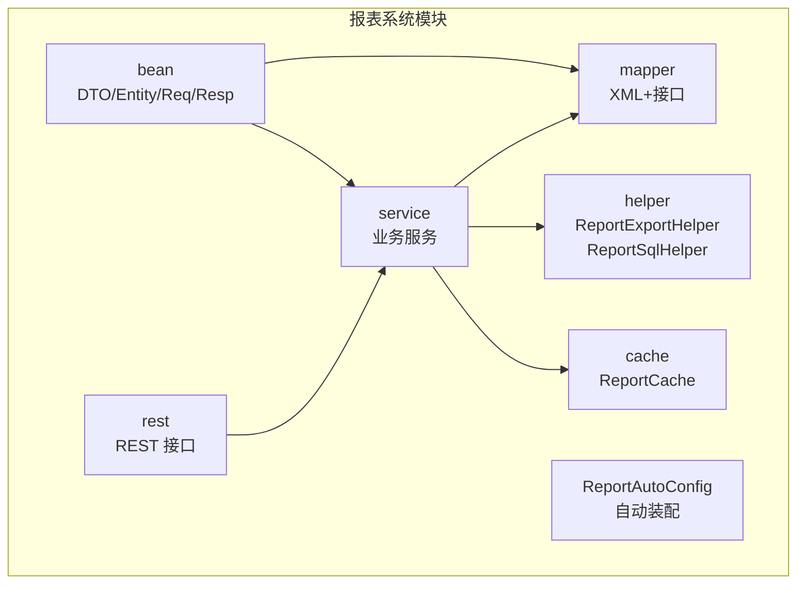
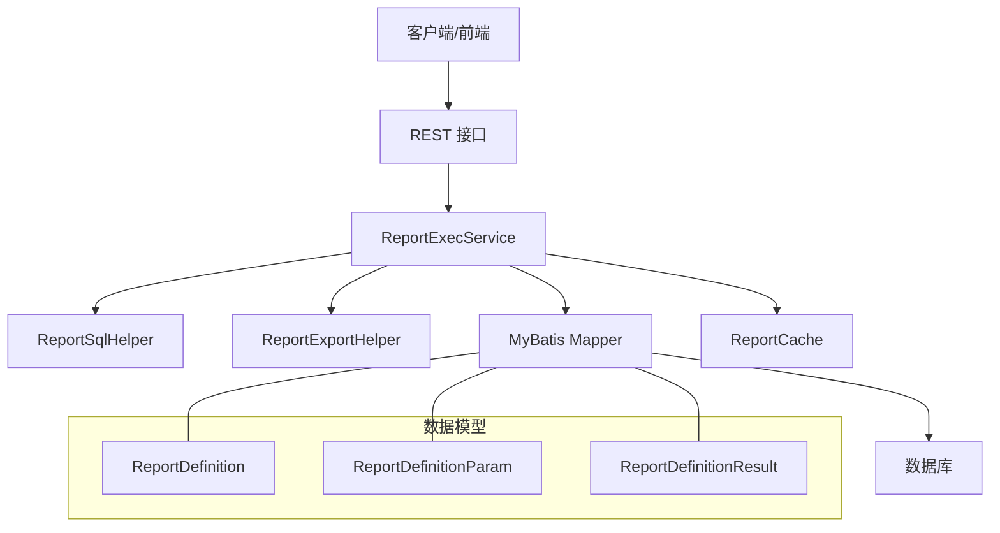
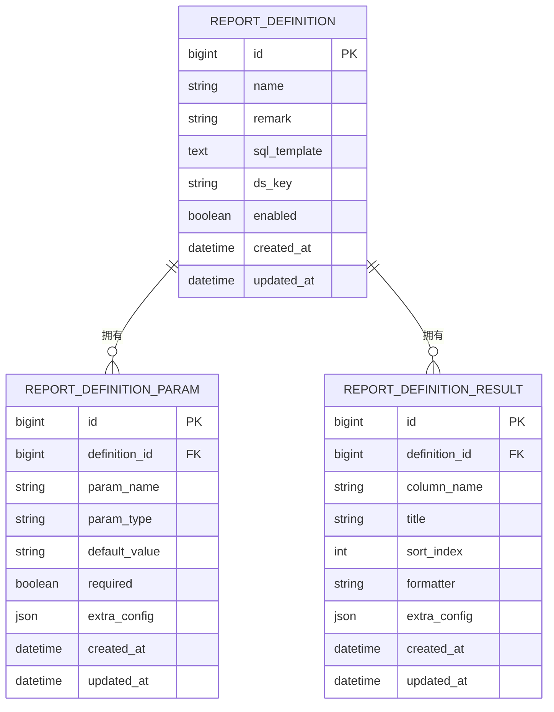
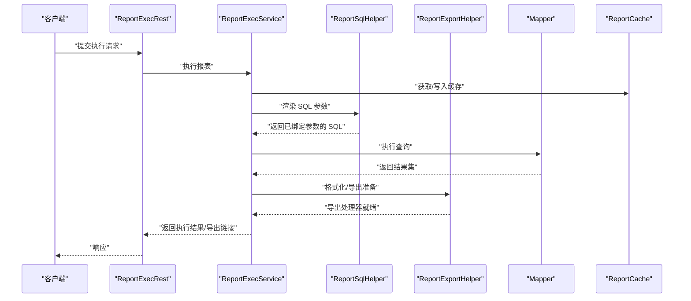
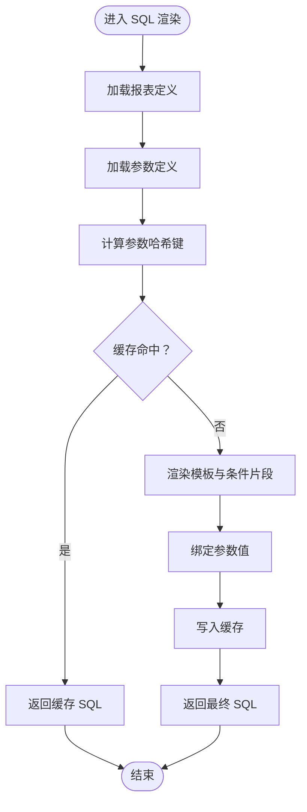
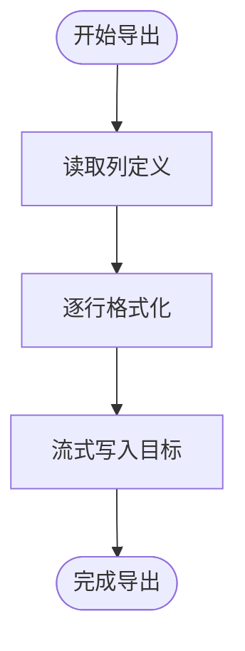
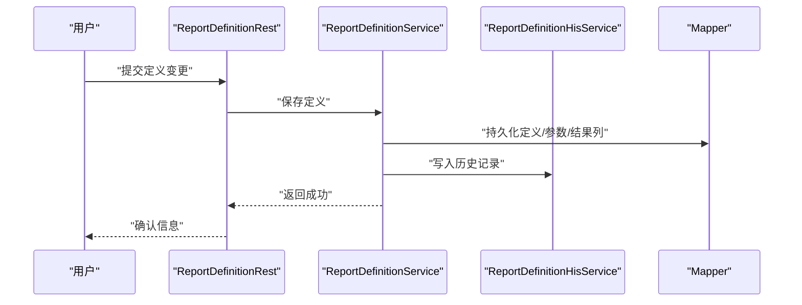
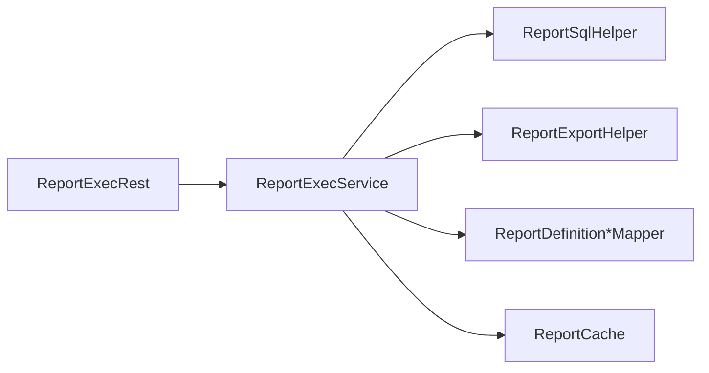

# 报表系统模块

<cite>
**本文引用的文件**
- [ReportDefinition.java](file://micro-report/src/main/java/com/wkclz/micro/report/bean/entity/ReportDefinition.java)
- [ReportDefinitionParam.java](file://micro-report/src/main/java/com/wkclz/micro/report/bean/entity/ReportDefinitionParam.java)
- [ReportDefinitionResult.java](file://micro-report/src/main/java/com/wkclz/micro/report/bean/entity/ReportDefinitionResult.java)
- [ReportExecService.java](file://micro-report/src/main/java/com/wkclz/micro/report/service/ReportExecService.java)
- [ReportExportHelper.java](file://micro-report/src/main/java/com/wkclz/micro/report/helper/ReportExportHelper.java)
- [ReportSqlHelper.java](file://micro-report/src/main/java/com/wkclz/micro/report/helper/ReportSqlHelper.java)
- [ReportDefinitionMapper.java](file://micro-report/src/main/java/com/wkclz/micro/report/mapper/ReportDefinitionMapper.java)
- [ReportDefinitionParamMapper.java](file://micro-report/src/main/java/com/wkclz/micro/report/mapper/ReportDefinitionParamMapper.java)
- [ReportDefinitionResultMapper.java](file://micro-report/src/main/java/com/wkclz/micro/report/mapper/ReportDefinitionResultMapper.java)
- [ReportDefinitionHisMapper.java](file://micro-report/src/main/java/com/wkclz/micro/report/mapper/ReportDefinitionHisMapper.java)
- [ReportDefinitionRest.java](file://micro-report/src/main/java/com/wkclz/micro/report/rest/ReportDefinitionRest.java)
- [ReportExecRest.java](file://micro-report/src/main/java/com/wkclz/micro/report/rest/ReportExecRest.java)
- [ReportCache.java](file://micro-report/src/main/java/com/wkclz/micro/report/cache/ReportCache.java)
- [ReportDefinitionDto.java](file://micro-report/src/main/java/com/wkclz/micro/report/bean/dto/ReportDefinitionDto.java)
- [ReportDefinitionParamDto.java](file://micro-report/src/main/java/com/wkclz/micro/report/bean/dto/ReportDefinitionParamDto.java)
- [ReportDefinitionResultDto.java](file://micro-report/src/main/java/com/wkclz/micro/report/bean/dto/ReportDefinitionResultDto.java)
</cite>

## 目录
1. [简介](#简介)
2. [项目结构](#项目结构)
3. [核心组件](#核心组件)
4. [架构总览](#架构总览)
5. [详细组件分析](#详细组件分析)
6. [依赖关系分析](#依赖关系分析)
7. [性能考虑](#性能考虑)
8. [故障排查指南](#故障排查指南)
9. [结论](#结论)
10. [附录：API 参考](#附录api-参考)

## 简介
本技术文档围绕报表系统模块展开，重点阐释报表定义管理、动态 SQL 执行与数据导出的实现原理。文档从数据模型设计（ReportDefinition、ReportDefinitionParam、ReportDefinitionResult）出发，深入分析 ReportExecService 的执行流程，详解 ReportExportHelper 的导出机制与 ReportSqlHelper 的 SQL 解析与缓存策略，并提供报表设计最佳实践、性能优化方案与复杂查询处理技巧。同时给出完整的 API 参考与实际业务场景应用示例。

## 项目结构
报表系统位于 micro-report 模块中，采用按职责分层的组织方式：
- bean：数据传输对象 DTO、实体 Entity、请求 Request、响应 Response
- cache：报表缓存
- helper：报表导出与 SQL 辅助工具
- mapper：MyBatis 映射接口与 XML
- rest：对外暴露的 REST 接口
- service：业务服务层
- ReportAutoConfig：自动装配配置

图表来源
- [ReportDefinitionRest.java](file://micro-report/src/main/java/com/wkclz/micro/report/rest/ReportDefinitionRest.java)
- [ReportExecRest.java](file://micro-report/src/main/java/com/wkclz/micro/report/rest/ReportExecRest.java)
- [ReportExecService.java](file://micro-report/src/main/java/com/wkclz/micro/report/service/ReportExecService.java)
- [ReportExportHelper.java](file://micro-report/src/main/java/com/wkclz/micro/report/helper/ReportExportHelper.java)
- [ReportSqlHelper.java](file://micro-report/src/main/java/com/wkclz/micro/report/helper/ReportSqlHelper.java)
- [ReportCache.java](file://micro-report/src/main/java/com/wkclz/micro/report/cache/ReportCache.java)

章节来源
- [ReportDefinitionRest.java](file://micro-report/src/main/java/com/wkclz/micro/report/rest/ReportDefinitionRest.java)
- [ReportExecRest.java](file://micro-report/src/main/java/com/wkclz/micro/report/rest/ReportExecRest.java)

## 核心组件
- 数据模型层：负责报表定义、参数、结果集的持久化与传输
- 业务服务层：封装报表执行、导出、SQL 解析等核心逻辑
- 接口层：提供报表定义管理与执行查询的 REST API
- 工具层：导出与 SQL 解析辅助类
- 缓存层：提升报表执行性能

章节来源
- [ReportDefinition.java](file://micro-report/src/main/java/com/wkclz/micro/report/bean/entity/ReportDefinition.java)
- [ReportDefinitionParam.java](file://micro-report/src/main/java/com/wkclz/micro/report/bean/entity/ReportDefinitionParam.java)
- [ReportDefinitionResult.java](file://micro-report/src/main/java/com/wkclz/micro/report/bean/entity/ReportDefinitionResult.java)
- [ReportExecService.java](file://micro-report/src/main/java/com/wkclz/micro/report/service/ReportExecService.java)
- [ReportExportHelper.java](file://micro-report/src/main/java/com/wkclz/micro/report/helper/ReportExportHelper.java)
- [ReportSqlHelper.java](file://micro-report/src/main/java/com/wkclz/micro/report/helper/ReportSqlHelper.java)
- [ReportCache.java](file://micro-report/src/main/java/com/wkclz/micro/report/cache/ReportCache.java)

## 架构总览
报表系统采用“接口-服务-映射-工具-缓存”的分层架构。REST 层接收请求，调用服务层；服务层通过 Mapper 访问数据库，借助 Helper 进行 SQL 解析与导出；缓存层用于加速热点报表的执行。

图表来源
- [ReportExecService.java](file://micro-report/src/main/java/com/wkclz/micro/report/service/ReportExecService.java)
- [ReportSqlHelper.java](file://micro-report/src/main/java/com/wkclz/micro/report/helper/ReportSqlHelper.java)
- [ReportExportHelper.java](file://micro-report/src/main/java/com/wkclz/micro/report/helper/ReportExportHelper.java)
- [ReportCache.java](file://micro-report/src/main/java/com/wkclz/micro/report/cache/ReportCache.java)
- [ReportDefinitionMapper.java](file://micro-report/src/main/java/com/wkclz/micro/report/mapper/ReportDefinitionMapper.java)
- [ReportDefinitionParamMapper.java](file://micro-report/src/main/java/com/wkclz/micro/report/mapper/ReportDefinitionParamMapper.java)
- [ReportDefinitionResultMapper.java](file://micro-report/src/main/java/com/wkclz/micro/report/mapper/ReportDefinitionResultMapper.java)

## 详细组件分析

### 数据模型设计与关系
- ReportDefinition：报表定义，包含名称、描述、SQL 模板、数据源、启用状态等字段
- ReportDefinitionParam：报表参数，定义参数名、类型、默认值、是否必填等
- ReportDefinitionResult：报表结果列，定义列名、标题、排序、格式化等

图表来源
- [ReportDefinition.java](file://micro-report/src/main/java/com/wkclz/micro/report/bean/entity/ReportDefinition.java)
- [ReportDefinitionParam.java](file://micro-report/src/main/java/com/wkclz/micro/report/bean/entity/ReportDefinitionParam.java)
- [ReportDefinitionResult.java](file://micro-report/src/main/java/com/wkclz/micro/report/bean/entity/ReportDefinitionResult.java)

章节来源
- [ReportDefinition.java](file://micro-report/src/main/java/com/wkclz/micro/report/bean/entity/ReportDefinition.java)
- [ReportDefinitionParam.java](file://micro-report/src/main/java/com/wkclz/micro/report/bean/entity/ReportDefinitionParam.java)
- [ReportDefinitionResult.java](file://micro-report/src/main/java/com/wkclz/micro/report/bean/entity/ReportDefinitionResult.java)

### ReportExecService 执行流程
ReportExecService 负责报表执行，包括参数校验、SQL 渲染、执行查询与结果格式化。其典型流程如下：

图表来源
- [ReportExecRest.java](file://micro-report/src/main/java/com/wkclz/micro/report/rest/ReportExecRest.java)
- [ReportExecService.java](file://micro-report/src/main/java/com/wkclz/micro/report/service/ReportExecService.java)
- [ReportSqlHelper.java](file://micro-report/src/main/java/com/wkclz/micro/report/helper/ReportSqlHelper.java)
- [ReportExportHelper.java](file://micro-report/src/main/java/com/wkclz/micro/report/helper/ReportExportHelper.java)

章节来源
- [ReportExecService.java](file://micro-report/src/main/java/com/wkclz/micro/report/service/ReportExecService.java)

### ReportSqlHelper 的 SQL 解析与缓存策略
- SQL 解析：根据 ReportDefinition 的模板与 ReportDefinitionParam 的参数，进行占位符替换与条件拼接，支持动态 WHERE、IN 列表、排序与分页片段
- 缓存策略：对“定义+参数哈希”作为缓存键，命中则直接返回已渲染 SQL，未命中则解析后写入缓存，降低重复解析开销

图表来源
- [ReportSqlHelper.java](file://micro-report/src/main/java/com/wkclz/micro/report/helper/ReportSqlHelper.java)
- [ReportDefinitionParam.java](file://micro-report/src/main/java/com/wkclz/micro/report/bean/entity/ReportDefinitionParam.java)
- [ReportDefinition.java](file://micro-report/src/main/java/com/wkclz/micro/report/bean/entity/ReportDefinition.java)

章节来源
- [ReportSqlHelper.java](file://micro-report/src/main/java/com/wkclz/micro/report/helper/ReportSqlHelper.java)

### ReportExportHelper 的导出机制
- 导出适配：根据 ReportDefinitionResult 的列配置与数据格式化器，将查询结果转换为导出格式（如 Excel）
- 流式输出：在大数据量场景下采用流式写入，避免内存峰值过高
- 并发安全：导出任务独立线程池执行，防止阻塞主线程

图表来源
- [ReportExportHelper.java](file://micro-report/src/main/java/com/wkclz/micro/report/helper/ReportExportHelper.java)
- [ReportDefinitionResult.java](file://micro-report/src/main/java/com/wkclz/micro/report/bean/entity/ReportDefinitionResult.java)

章节来源
- [ReportExportHelper.java](file://micro-report/src/main/java/com/wkclz/micro/report/helper/ReportExportHelper.java)

### 报表定义管理与历史版本
- 定义 CRUD：提供报表定义的创建、更新、删除与查询接口
- 参数管理：支持参数的增删改查与提取
- 结果列管理：支持列的增删改查与排序
- 历史版本：每次修改生成历史记录，便于回溯与审计

图表来源
- [ReportDefinitionRest.java](file://micro-report/src/main/java/com/wkclz/micro/report/rest/ReportDefinitionRest.java)
- [ReportDefinitionHisService.java](file://micro-report/src/main/java/com/wkclz/micro/report/service/ReportDefinitionHisService.java)
- [ReportDefinitionMapper.java](file://micro-report/src/main/java/com/wkclz/micro/report/mapper/ReportDefinitionMapper.java)
- [ReportDefinitionParamMapper.java](file://micro-report/src/main/java/com/wkclz/micro/report/mapper/ReportDefinitionParamMapper.java)
- [ReportDefinitionResultMapper.java](file://micro-report/src/main/java/com/wkclz/micro/report/mapper/ReportDefinitionResultMapper.java)
- [ReportDefinitionHisMapper.java](file://micro-report/src/main/java/com/wkclz/micro/report/mapper/ReportDefinitionHisMapper.java)

章节来源
- [ReportDefinitionRest.java](file://micro-report/src/main/java/com/wkclz/micro/report/rest/ReportDefinitionRest.java)

## 依赖关系分析
- 组件内聚：各层职责清晰，接口与实现分离
- 外部依赖：MyBatis、Spring Boot 自动装配、导出库（如 Apache POI）
- 缓存耦合：ReportExecService 与 ReportCache 协作，减少重复解析与查询
- 风险点：SQL 注入风险（需严格参数化）、大结果集导出内存压力

图表来源
- [ReportExecRest.java](file://micro-report/src/main/java/com/wkclz/micro/report/rest/ReportExecRest.java)
- [ReportExecService.java](file://micro-report/src/main/java/com/wkclz/micro/report/service/ReportExecService.java)
- [ReportSqlHelper.java](file://micro-report/src/main/java/com/wkclz/micro/report/helper/ReportSqlHelper.java)
- [ReportExportHelper.java](file://micro-report/src/main/java/com/wkclz/micro/report/helper/ReportExportHelper.java)
- [ReportCache.java](file://micro-report/src/main/java/com/wkclz/micro/report/cache/ReportCache.java)

## 性能考虑
- SQL 渲染缓存：对“定义+参数哈希”进行缓存，显著降低重复解析成本
- 分页与限制：建议在模板中固定分页与最大记录数，避免全量导出
- 参数化查询：确保所有输入均通过参数绑定，避免拼接导致的性能与安全问题
- 流式导出：大结果集采用流式写入，控制内存占用
- 并发与限流：导出任务独立线程池，结合外部限流策略防止抖动
- 索引与物化：对高频查询字段建立索引或物化视图，缩短查询时间

## 故障排查指南
- 报表无法执行
  - 检查定义是否启用、数据源配置是否正确
  - 核对参数是否缺失或类型不匹配
  - 查看 SQL 渲染后的最终语句与数据库权限
- 导出失败或内存溢出
  - 检查导出开关与列配置
  - 启用分页与限制，避免一次性导出大量数据
  - 关注流式写入是否中断
- 性能异常
  - 观察 SQL 渲染缓存命中率
  - 分析慢查询与索引缺失情况
  - 评估并发导出任务数量

## 结论
报表系统通过清晰的分层设计与缓存策略，在保证灵活性的同时兼顾了性能与可维护性。借助 ReportSqlHelper 的 SQL 渲染与 ReportExportHelper 的导出能力，系统能够高效支撑多样的报表场景。建议在生产环境中配合完善的监控、限流与索引策略，持续优化执行效率与用户体验。

## 附录：API 参考

- 报表定义管理
  - GET /report/definition/page：分页查询报表定义
  - GET /report/definition/info/{id}：获取定义详情
  - POST /report/definition/create：创建报表定义
  - PUT /report/definition/update/{id}：更新报表定义
  - DELETE /report/definition/delete/{id}：删除报表定义

- 报表参数管理
  - GET /report/param/list：查询参数列表
  - POST /report/param/create：新增参数
  - PUT /report/param/update/{id}：更新参数
  - DELETE /report/param/delete/{id}：删除参数
  - POST /report/param/extract：从定义提取参数

- 报表结果列管理
  - GET /report/result/list：查询结果列列表
  - POST /report/result/create：新增结果列
  - PUT /report/result/update/{id}：更新结果列
  - DELETE /report/result/delete/{id}：删除结果列
  - POST /report/result/extract：从定义提取结果列

- 报表执行与导出
  - POST /report/exec/query：执行查询并返回结果
  - POST /report/exec/export：触发导出任务
  - GET /report/exec/info/{taskId}：查询导出任务状态
  - POST /report/exec/test：测试执行（验证定义与参数）

- 历史版本
  - GET /report/history/page：分页查询历史版本
  - GET /report/history/info/{id}：查看历史版本详情

章节来源
- [ReportDefinitionRest.java](file://micro-report/src/main/java/com/wkclz/micro/report/rest/ReportDefinitionRest.java)
- [ReportExecRest.java](file://micro-report/src/main/java/com/wkclz/micro/report/rest/ReportExecRest.java)

## 实际业务场景应用示例
- 销售报表：定义按日期范围、销售区域筛选的动态 SQL，参数化传入起止日期与区域集合，导出为 Excel，支持分页与最大记录限制
- 用户行为分析：基于事件流水表构建动态维度与指标，通过 ReportDefinitionResult 定义列标题与格式化器，导出可视化所需字段
- 审计追踪：每次定义变更生成历史记录，支持回滚与对比，保障合规性