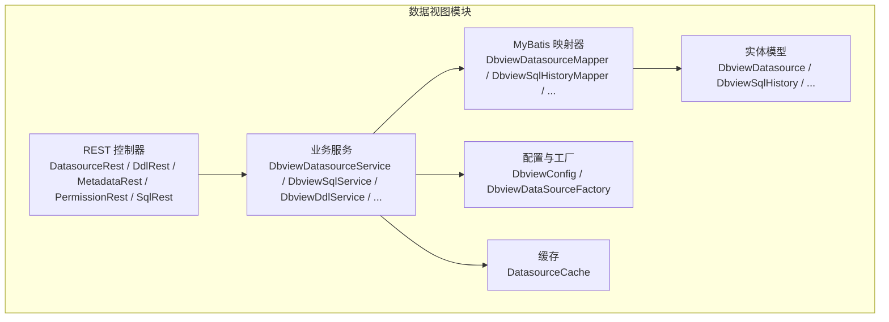
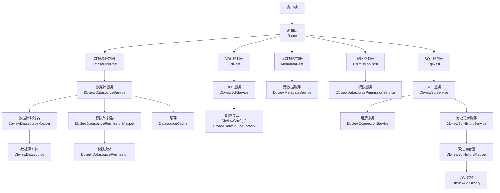
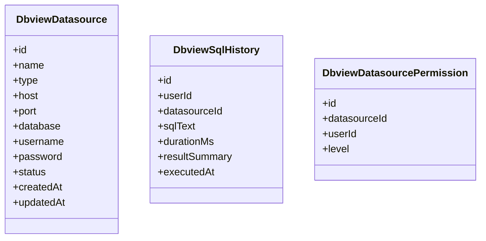
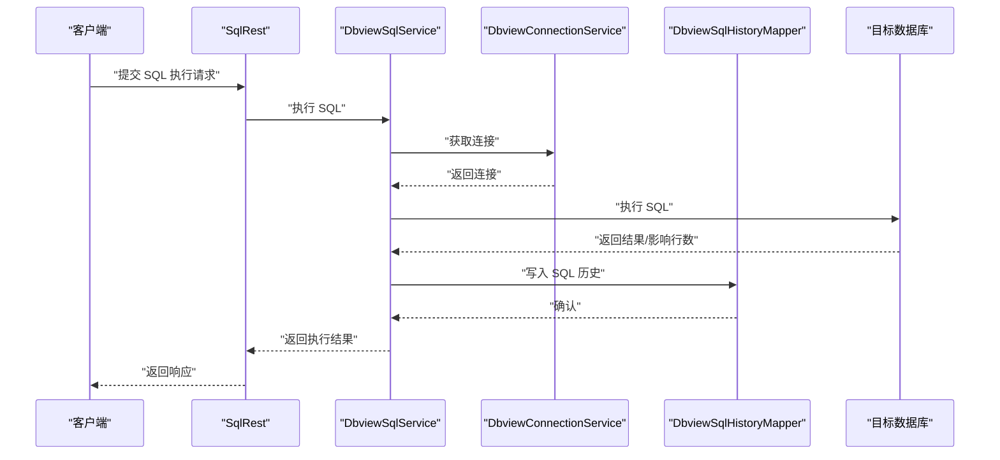
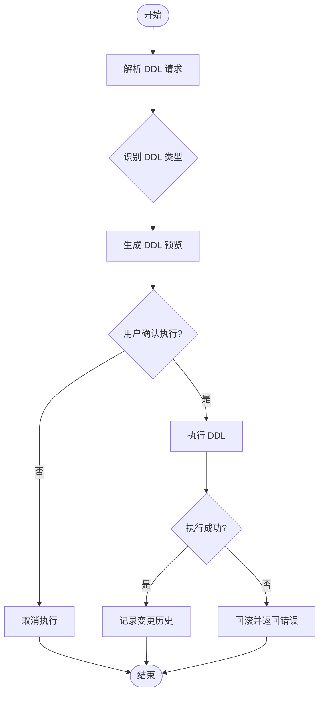
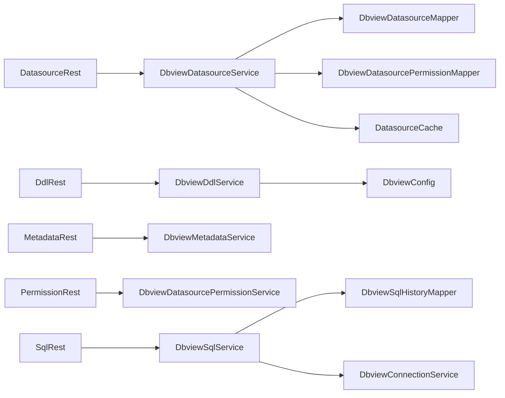

# 数据视图模块

<cite>
**本文引用的文件**
- [DbviewDatasource.java](file://micro-dbview/src/main/java/com/wkclz/micro/dbview/bean/entity/DbviewDatasource.java)
- [DbviewSqlHistory.java](file://micro-dbview/src/main/java/com/wkclz/micro/dbview/bean/entity/DbviewSqlHistory.java)
- [DbviewDatasourcePermission.java](file://micro-dbview/src/main/java/com/wkclz/micro/dbview/bean/entity/DbviewDatasourcePermission.java)
- [DbviewConnectionService.java](file://micro-dbview/src/main/java/com/wkclz/micro/dbview/service/DbviewConnectionService.java)
- [DbviewSqlService.java](file://micro-dbview/src/main/java/com/wkclz/micro/dbview/service/DbviewSqlService.java)
- [DbviewDdlService.java](file://micro-dbview/src/main/java/com/wkclz/micro/dbview/service/DbviewDdlService.java)
- [DbviewDatasourceService.java](file://micro-dbview/src/main/java/com/wkclz/micro/dbview/service/DbviewDatasourceService.java)
- [DbviewDatasourcePermissionService.java](file://micro-dbview/src/main/java/com/wkclz/micro/dbview/service/DbviewDatasourcePermissionService.java)
- [DbviewMetadataService.java](file://micro-dbview/src/main/java/com/wkclz/micro/dbview/service/DbviewMetadataService.java)
- [DbviewSqlHistoryService.java](file://micro-dbview/src/main/java/com/wkclz/micro/dbview/service/DbviewSqlHistoryService.java)
- [DatasourceRest.java](file://micro-dbview/src/main/java/com/wkclz/micro/dbview/rest/DatasourceRest.java)
- [DdlRest.java](file://micro-dbview/src/main/java/com/wkclz/micro/dbview/rest/DdlRest.java)
- [MetadataRest.java](file://micro-dbview/src/main/java/com/wkclz/micro/dbview/rest/MetadataRest.java)
- [PermissionRest.java](file://micro-dbview/src/main/java/com/wkclz/micro/dbview/rest/PermissionRest.java)
- [SqlRest.java](file://micro-dbview/src/main/java/com/wkclz/micro/dbview/rest/SqlRest.java)
- [Route.java](file://micro-dbview/src/main/java/com/wkclz/micro/dbview/rest/Route.java)
- [DbviewDatasourceMapper.java](file://micro-dbview/src/main/java/com/wkclz/micro/dbview/mapper/DbviewDatasourceMapper.java)
- [DbviewSqlHistoryMapper.java](file://micro-dbview/src/main/java/com/wkclz/micro/dbview/mapper/DbviewSqlHistoryMapper.java)
- [DbviewDatasourcePermissionMapper.java](file://micro-dbview/src/main/java/com/wkclz/micro/dbview/mapper/DbviewDatasourcePermissionMapper.java)
- [DbviewConfig.java](file://micro-dbview/src/main/java/com/wkclz/micro/dbview/config/DbviewConfig.java)
- [DbviewDataSourceFactory.java](file://micro-dbview/src/main/java/com/wkclz/micro/dbview/config/DbviewDataSourceFactory.java)
- [DatasourceCache.java](file://micro-dbview/src/main/java/com/wkclz/micro/dbview/cache/DatasourceCache.java)
- [DbviewAutoConfig.java](file://micro-dbview/src/main/java/com/wkclz/micro/dbview/DbviewAutoConfig.java)
</cite>

## 目录
1. [简介](#简介)
2. [项目结构](#项目结构)
3. [核心组件](#核心组件)
4. [架构总览](#架构总览)
5. [详细组件分析](#详细组件分析)
6. [依赖关系分析](#依赖关系分析)
7. [性能考虑](#性能考虑)
8. [故障排查指南](#故障排查指南)
9. [结论](#结论)
10. [附录：API 参考](#附录api-参考)

## 简介
本文件面向“数据视图”模块，系统化梳理数据源管理、SQL 执行引擎与元数据管理的实现原理，深入解析核心数据模型（如 DbviewDatasource、DbviewSqlHistory）及 DDL 预览与执行机制，阐述连接服务（DbviewConnectionService）、SQL 执行服务（DbviewSqlService）与权限控制策略，并提供数据库操作最佳实践、性能优化建议与安全访问控制方案，最后给出完整的 API 参考与实际案例。

## 项目结构
数据视图模块采用按功能域划分的分层组织方式：
- bean 层：定义 DTO、实体、枚举与请求/响应对象
- rest 层：对外暴露 REST 接口路由与控制器
- service 层：业务逻辑编排与领域服务
- mapper 层：MyBatis 映射器与 XML
- config 层：配置类与数据源工厂
- cache 层：缓存策略
- resources：Spring 自动装配声明与 MyBatis Mapper XML

图表来源
- [DatasourceRest.java](file://micro-dbview/src/main/java/com/wkclz/micro/dbview/rest/DatasourceRest.java)
- [DdlRest.java](file://micro-dbview/src/main/java/com/wkclz/micro/dbview/rest/DdlRest.java)
- [MetadataRest.java](file://micro-dbview/src/main/java/com/wkclz/micro/dbview/rest/MetadataRest.java)
- [PermissionRest.java](file://micro-dbview/src/main/java/com/wkclz/micro/dbview/rest/PermissionRest.java)
- [SqlRest.java](file://micro-dbview/src/main/java/com/wkclz/micro/dbview/rest/SqlRest.java)
- [DbviewDatasourceService.java](file://micro-dbview/src/main/java/com/wkclz/micro/dbview/service/DbviewDatasourceService.java)
- [DbviewSqlService.java](file://micro-dbview/src/main/java/com/wkclz/micro/dbview/service/DbviewSqlService.java)
- [DbviewDdlService.java](file://micro-dbview/src/main/java/com/wkclz/micro/dbview/service/DbviewDdlService.java)
- [DbviewDatasourceMapper.java](file://micro-dbview/src/main/java/com/wkclz/micro/dbview/mapper/DbviewDatasourceMapper.java)
- [DbviewSqlHistoryMapper.java](file://micro-dbview/src/main/java/com/wkclz/micro/dbview/mapper/DbviewSqlHistoryMapper.java)
- [DbviewConfig.java](file://micro-dbview/src/main/java/com/wkclz/micro/dbview/config/DbviewConfig.java)
- [DatasourceCache.java](file://micro-dbview/src/main/java/com/wkclz/micro/dbview/cache/DatasourceCache.java)

章节来源
- [Route.java](file://micro-dbview/src/main/java/com/wkclz/micro/dbview/rest/Route.java)
- [DbviewAutoConfig.java](file://micro-dbview/src/main/java/com/wkclz/micro/dbview/DbviewAutoConfig.java)

## 核心组件
- 数据源管理：负责数据源的创建、更新、分页查询、测试连通性与权限授权
- SQL 执行引擎：支持 SQL 预览、执行、历史记录与结果集处理
- 元数据管理：提供模式、表、列、索引等元信息查询能力
- DDL 预览与执行：对建表、修改、删除等 DDL 操作进行预览与安全执行
- 权限控制：基于用户与数据源维度的细粒度权限分级与校验

章节来源
- [DbviewDatasourceService.java](file://micro-dbview/src/main/java/com/wkclz/micro/dbview/service/DbviewDatasourceService.java)
- [DbviewSqlService.java](file://micro-dbview/src/main/java/com/wkclz/micro/dbview/service/DbviewSqlService.java)
- [DbviewDdlService.java](file://micro-dbview/src/main/java/com/wkclz/micro/dbview/service/DbviewDdlService.java)
- [DbviewMetadataService.java](file://micro-dbview/src/main/java/com/wkclz/micro/dbview/service/DbviewMetadataService.java)
- [DbviewDatasourcePermissionService.java](file://micro-dbview/src/main/java/com/wkclz/micro/dbview/service/DbviewDatasourcePermissionService.java)

## 架构总览
整体采用“REST 控制器 → 业务服务 → MyBatis 映射器 → 实体模型”的分层架构；通过配置类与数据源工厂统一管理数据源生命周期；通过缓存提升热点数据访问效率；通过权限服务在业务层进行访问控制。

图表来源
- [Route.java](file://micro-dbview/src/main/java/com/wkclz/micro/dbview/rest/Route.java)
- [DatasourceRest.java](file://micro-dbview/src/main/java/com/wkclz/micro/dbview/rest/DatasourceRest.java)
- [DdlRest.java](file://micro-dbview/src/main/java/com/wkclz/micro/dbview/rest/DdlRest.java)
- [MetadataRest.java](file://micro-dbview/src/main/java/com/wkclz/micro/dbview/rest/MetadataRest.java)
- [PermissionRest.java](file://micro-dbview/src/main/java/com/wkclz/micro/dbview/rest/PermissionRest.java)
- [SqlRest.java](file://micro-dbview/src/main/java/com/wkclz/micro/dbview/rest/SqlRest.java)
- [DbviewConnectionService.java](file://micro-dbview/src/main/java/com/wkclz/micro/dbview/service/DbviewConnectionService.java)
- [DbviewDatasourceService.java](file://micro-dbview/src/main/java/com/wkclz/micro/dbview/service/DbviewDatasourceService.java)
- [DbviewSqlService.java](file://micro-dbview/src/main/java/com/wkclz/micro/dbview/service/DbviewSqlService.java)
- [DbviewDdlService.java](file://micro-dbview/src/main/java/com/wkclz/micro/dbview/service/DbviewDdlService.java)
- [DbviewDatasourceMapper.java](file://micro-dbview/src/main/java/com/wkclz/micro/dbview/mapper/DbviewDatasourceMapper.java)
- [DbviewDatasourcePermissionMapper.java](file://micro-dbview/src/main/java/com/wkclz/micro/dbview/mapper/DbviewDatasourcePermissionMapper.java)
- [DbviewSqlHistoryMapper.java](file://micro-dbview/src/main/java/com/wkclz/micro/dbview/mapper/DbviewSqlHistoryMapper.java)
- [DbviewConfig.java](file://micro-dbview/src/main/java/com/wkclz/micro/dbview/config/DbviewConfig.java)
- [DbviewDataSourceFactory.java](file://micro-dbview/src/main/java/com/wkclz/micro/dbview/config/DbviewDataSourceFactory.java)
- [DatasourceCache.java](file://micro-dbview/src/main/java/com/wkclz/micro/dbview/cache/DatasourceCache.java)

## 详细组件分析

### 数据模型与实体
- DbviewDatasource：描述一个可被管理的数据源，包含标识、名称、类型、连接参数、状态与时间戳等字段
- DbviewSqlHistory：记录 SQL 执行历史，包括执行者、数据源、SQL 文本、执行时长、结果摘要与时间戳
- DbviewDatasourcePermission：描述用户或角色对数据源的访问权限级别

图表来源
- [DbviewDatasource.java](file://micro-dbview/src/main/java/com/wkclz/micro/dbview/bean/entity/DbviewDatasource.java)
- [DbviewSqlHistory.java](file://micro-dbview/src/main/java/com/wkclz/micro/dbview/bean/entity/DbviewSqlHistory.java)
- [DbviewDatasourcePermission.java](file://micro-dbview/src/main/java/com/wkclz/micro/dbview/bean/entity/DbviewDatasourcePermission.java)

章节来源
- [DbviewDatasource.java](file://micro-dbview/src/main/java/com/wkclz/micro/dbview/bean/entity/DbviewDatasource.java)
- [DbviewSqlHistory.java](file://micro-dbview/src/main/java/com/wkclz/micro/dbview/bean/entity/DbviewSqlHistory.java)
- [DbviewDatasourcePermission.java](file://micro-dbview/src/main/java/com/wkclz/micro/dbview/bean/entity/DbviewDatasourcePermission.java)

### 连接管理：DbviewConnectionService
职责
- 维护数据源连接池与会话
- 提供连接测试、获取连接、释放连接等能力
- 与数据源工厂协作，确保不同数据库类型的适配

关键点
- 通过配置类与数据源工厂创建与回收连接
- 在执行前进行连通性校验，失败时返回明确错误
- 对异常连接进行隔离与重试策略（由上层调用决定）

章节来源
- [DbviewConnectionService.java](file://micro-dbview/src/main/java/com/wkclz/micro/dbview/service/DbviewConnectionService.java)
- [DbviewDataSourceFactory.java](file://micro-dbview/src/main/java/com/wkclz/micro/dbview/config/DbviewDataSourceFactory.java)
- [DbviewConfig.java](file://micro-dbview/src/main/java/com/wkclz/micro/dbview/config/DbviewConfig.java)

### SQL 执行引擎：DbviewSqlService
职责
- 解析 SQL 请求，区分查询与非查询语句
- 执行 SQL 并返回结构化结果
- 记录 SQL 历史与耗时统计
- 与连接服务协作完成连接生命周期管理

执行流程（概要）
- 参数校验与类型识别
- 获取连接并执行
- 结果封装与历史落库
- 异常捕获与回滚/释放资源

图表来源
- [SqlRest.java](file://micro-dbview/src/main/java/com/wkclz/micro/dbview/rest/SqlRest.java)
- [DbviewSqlService.java](file://micro-dbview/src/main/java/com/wkclz/micro/dbview/service/DbviewSqlService.java)
- [DbviewConnectionService.java](file://micro-dbview/src/main/java/com/wkclz/micro/dbview/service/DbviewConnectionService.java)
- [DbviewSqlHistoryMapper.java](file://micro-dbview/src/main/java/com/wkclz/micro/dbview/mapper/DbviewSqlHistoryMapper.java)

章节来源
- [DbviewSqlService.java](file://micro-dbview/src/main/java/com/wkclz/micro/dbview/service/DbviewSqlService.java)
- [DbviewSqlHistoryService.java](file://micro-dbview/src/main/java/com/wkclz/micro/dbview/service/DbviewSqlHistoryService.java)

### DDL 预览与执行：DbviewDdlService
职责
- 解析 DDL 请求，识别 DDL 类型（建表、修改、删除等）
- 提供 DDL 预览能力，展示将要执行的变更
- 在确认后执行 DDL，并记录变更历史

执行流程（概要）
- 预览阶段：解析 DDL，生成变更清单与影响说明
- 执行阶段：在安全窗口内执行 DDL，捕获异常并回滚
- 记录阶段：写入变更记录与审计信息

图表来源
- [DbviewDdlService.java](file://micro-dbview/src/main/java/com/wkclz/micro/dbview/service/DbviewDdlService.java)
- [DdlRest.java](file://micro-dbview/src/main/java/com/wkclz/micro/dbview/rest/DdlRest.java)

章节来源
- [DbviewDdlService.java](file://micro-dbview/src/main/java/com/wkclz/micro/dbview/service/DbviewDdlService.java)

### 元数据管理：DbviewMetadataService
职责
- 查询数据库元信息：模式列表、表列表、列定义、索引信息等
- 将底层元数据标准化为统一的数据结构，供前端展示与使用

章节来源
- [DbviewMetadataService.java](file://micro-dbview/src/main/java/com/wkclz/micro/dbview/service/DbviewMetadataService.java)
- [MetadataRest.java](file://micro-dbview/src/main/java/com/wkclz/micro/dbview/rest/MetadataRest.java)

### 权限控制：DbviewDatasourcePermissionService
职责
- 用户对数据源的访问授权与校验
- 支持按用户/角色设置权限级别，执行前进行权限检查

章节来源
- [DbviewDatasourcePermissionService.java](file://micro-dbview/src/main/java/com/wkclz/micro/dbview/service/DbviewDatasourcePermissionService.java)
- [PermissionRest.java](file://micro-dbview/src/main/java/com/wkclz/micro/dbview/rest/PermissionRest.java)

### 数据源管理：DbviewDatasourceService
职责
- 数据源的创建、更新、删除、分页查询与测试连通性
- 与权限服务协同维护授权关系
- 与缓存交互以提升查询性能

章节来源
- [DbviewDatasourceService.java](file://micro-dbview/src/main/java/com/wkclz/micro/dbview/service/DbviewDatasourceService.java)
- [DatasourceRest.java](file://micro-dbview/src/main/java/com/wkclz/micro/dbview/rest/DatasourceRest.java)
- [DatasourceCache.java](file://micro-dbview/src/main/java/com/wkclz/micro/dbview/cache/DatasourceCache.java)

## 依赖关系分析
- 控制器层依赖业务服务层
- 业务服务层依赖映射器层与实体模型
- 业务服务层依赖配置与数据源工厂
- 业务服务层依赖缓存层
- 权限服务与数据源服务存在协作关系

图表来源
- [DatasourceRest.java](file://micro-dbview/src/main/java/com/wkclz/micro/dbview/rest/DatasourceRest.java)
- [DdlRest.java](file://micro-dbview/src/main/java/com/wkclz/micro/dbview/rest/DdlRest.java)
- [MetadataRest.java](file://micro-dbview/src/main/java/com/wkclz/micro/dbview/rest/MetadataRest.java)
- [PermissionRest.java](file://micro-dbview/src/main/java/com/wkclz/micro/dbview/rest/PermissionRest.java)
- [SqlRest.java](file://micro-dbview/src/main/java/com/wkclz/micro/dbview/rest/SqlRest.java)
- [DbviewDatasourceService.java](file://micro-dbview/src/main/java/com/wkclz/micro/dbview/service/DbviewDatasourceService.java)
- [DbviewSqlService.java](file://micro-dbview/src/main/java/com/wkclz/micro/dbview/service/DbviewSqlService.java)
- [DbviewDdlService.java](file://micro-dbview/src/main/java/com/wkclz/micro/dbview/service/DbviewDdlService.java)
- [DbviewDatasourceMapper.java](file://micro-dbview/src/main/java/com/wkclz/micro/dbview/mapper/DbviewDatasourceMapper.java)
- [DbviewDatasourcePermissionMapper.java](file://micro-dbview/src/main/java/com/wkclz/micro/dbview/mapper/DbviewDatasourcePermissionMapper.java)
- [DbviewSqlHistoryMapper.java](file://micro-dbview/src/main/java/com/wkclz/micro/dbview/mapper/DbviewSqlHistoryMapper.java)
- [DbviewConnectionService.java](file://micro-dbview/src/main/java/com/wkclz/micro/dbview/service/DbviewConnectionService.java)
- [DbviewConfig.java](file://micro-dbview/src/main/java/com/wkclz/micro/dbview/config/DbviewConfig.java)
- [DatasourceCache.java](file://micro-dbview/src/main/java/com/wkclz/micro/dbview/cache/DatasourceCache.java)

## 性能考虑
- 连接池与超时：合理设置连接池大小与超时阈值，避免长事务占用连接
- 结果集限制：对查询结果进行分页与条数限制，防止大结果集导致内存压力
- 缓存策略：对常用元数据与数据源配置进行缓存，降低重复查询开销
- SQL 历史归档：定期清理或归档历史记录，控制表规模
- 并发控制：在高并发场景下，对敏感操作（DDL）增加互斥与排队机制

## 故障排查指南
常见问题与定位思路
- 连接失败：检查数据源配置、网络连通性与凭据正确性；查看连接服务的日志与异常栈
- SQL 执行超时：优化 SQL、添加必要索引、拆分复杂查询；调整超时阈值
- 权限不足：核对用户权限级别与数据源授权范围；确认权限服务的校验逻辑
- DDL 失败：查看 DDL 预览与执行日志，确认前置条件满足；必要时手动回滚
- 元数据不一致：刷新缓存或重建缓存键；核对底层元数据接口返回

章节来源
- [DbviewConnectionService.java](file://micro-dbview/src/main/java/com/wkclz/micro/dbview/service/DbviewConnectionService.java)
- [DbviewSqlService.java](file://micro-dbview/src/main/java/com/wkclz/micro/dbview/service/DbviewSqlService.java)
- [DbviewDatasourcePermissionService.java](file://micro-dbview/src/main/java/com/wkclz/micro/dbview/service/DbviewDatasourcePermissionService.java)
- [DbviewDdlService.java](file://micro-dbview/src/main/java/com/wkclz/micro/dbview/service/DbviewDdlService.java)

## 结论
数据视图模块通过清晰的分层设计与完善的权限控制，提供了从数据源管理到 SQL/DDL 执行与元数据查询的一体化能力。结合缓存与配置管理，可在保证安全性的同时提升性能与可用性。建议在生产环境中配合严格的权限策略、审计日志与容量规划，持续优化连接与查询性能。

## 附录：API 参考

- 数据源管理
  - 创建数据源：POST /dbview/datasource/create
  - 更新数据源：POST /dbview/datasource/update
  - 删除数据源：POST /dbview/datasource/remove
  - 分页查询数据源：POST /dbview/datasource/page
  - 测试连接：POST /dbview/datasource/test

- 元数据查询
  - 查询模式列表：POST /dbview/metadata/schemas
  - 查询表列表：POST /dbview/metadata/tables
  - 查询表详情：POST /dbview/metadata/detail

- 权限管理
  - 新增权限：POST /dbview/permission/create
  - 更新权限：POST /dbview/permission/update
  - 删除权限：POST /dbview/permission/remove
  - 分页查询权限：POST /dbview/permission/page

- SQL 执行
  - 执行 SQL：POST /dbview/sql/execute
  - 分页查询 SQL 历史：POST /dbview/sql/history/page

- DDL 操作
  - DDL 预览：POST /dbview/ddl/preview
  - 执行 DDL：POST /dbview/ddl/execute

章节来源
- [DatasourceRest.java](file://micro-dbview/src/main/java/com/wkclz/micro/dbview/rest/DatasourceRest.java)
- [MetadataRest.java](file://micro-dbview/src/main/java/com/wkclz/micro/dbview/rest/MetadataRest.java)
- [PermissionRest.java](file://micro-dbview/src/main/java/com/wkclz/micro/dbview/rest/PermissionRest.java)
- [SqlRest.java](file://micro-dbview/src/main/java/com/wkclz/micro/dbview/rest/SqlRest.java)
- [DdlRest.java](file://micro-dbview/src/main/java/com/wkclz/micro/dbview/rest/DdlRest.java)