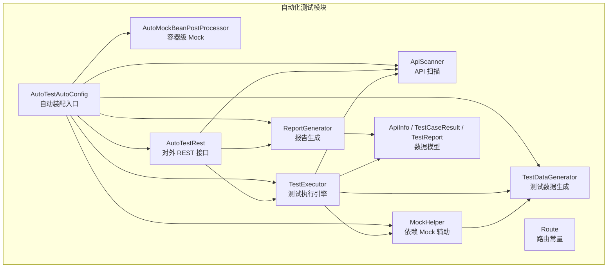
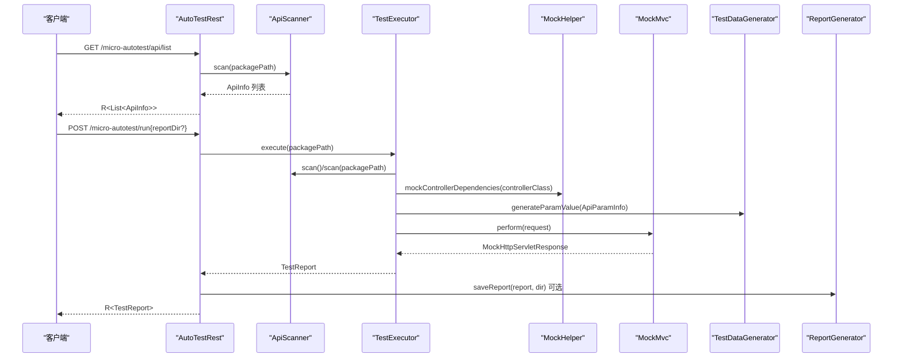
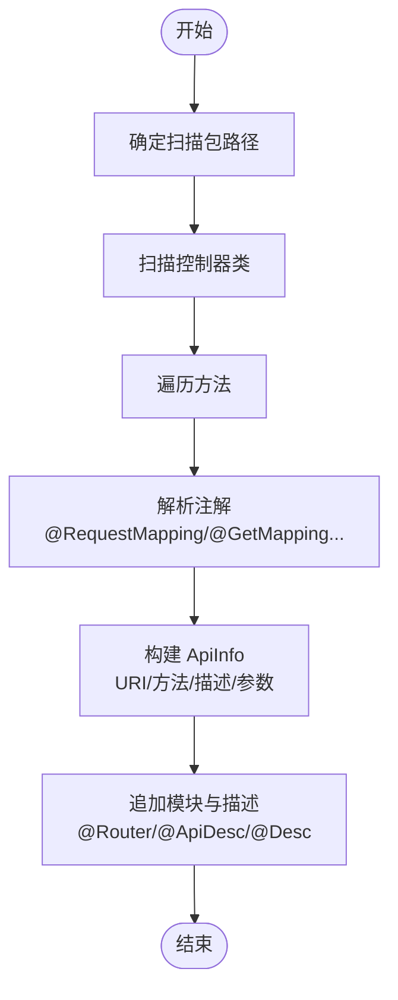
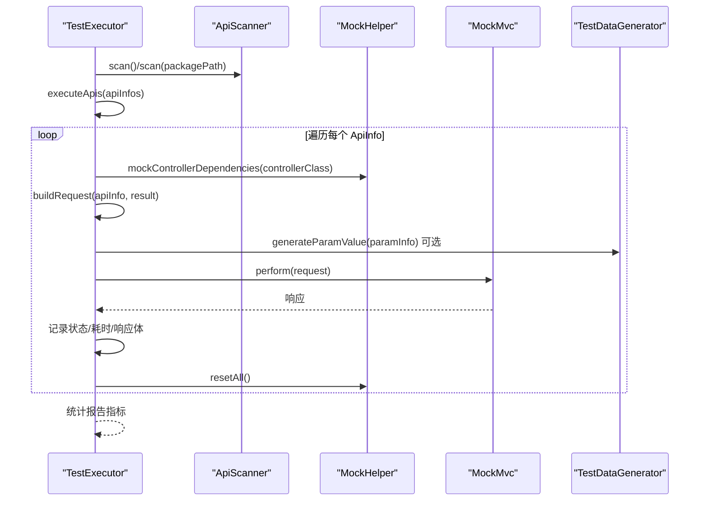
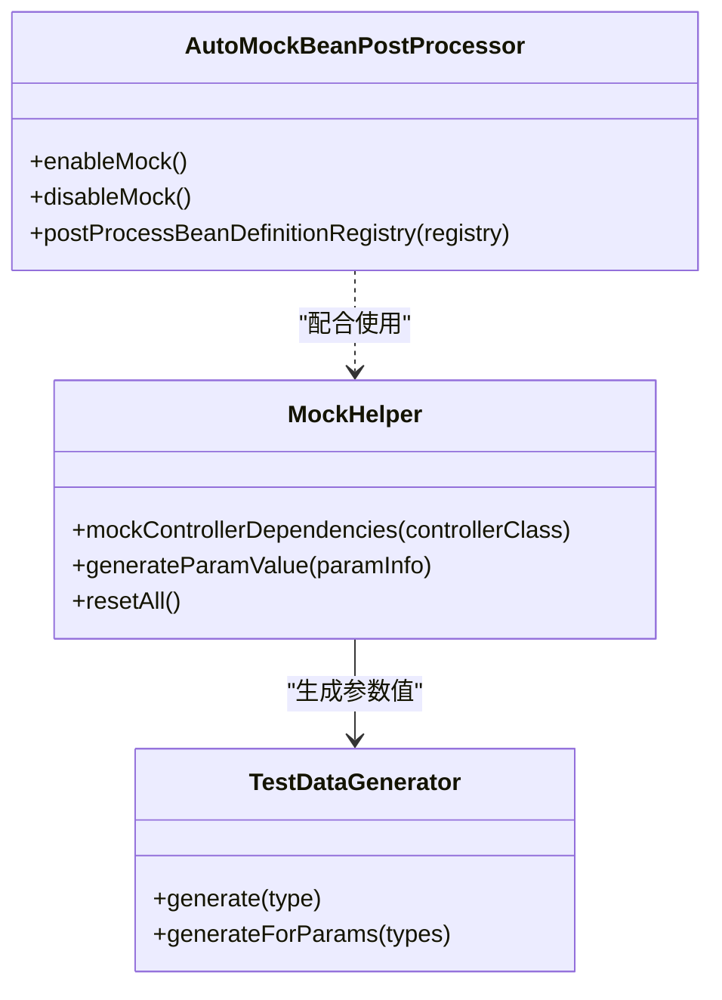
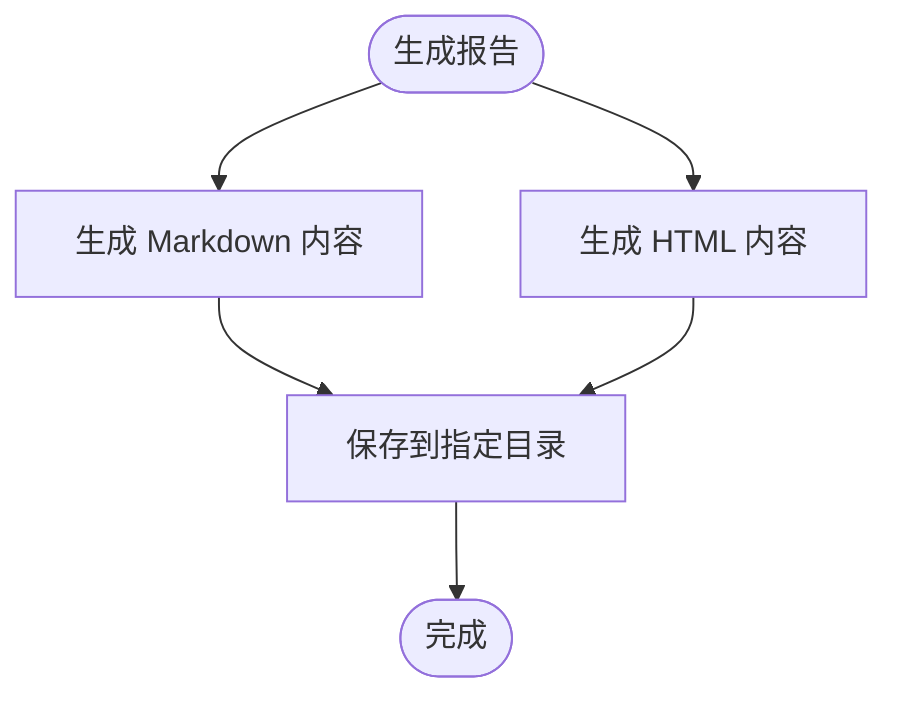
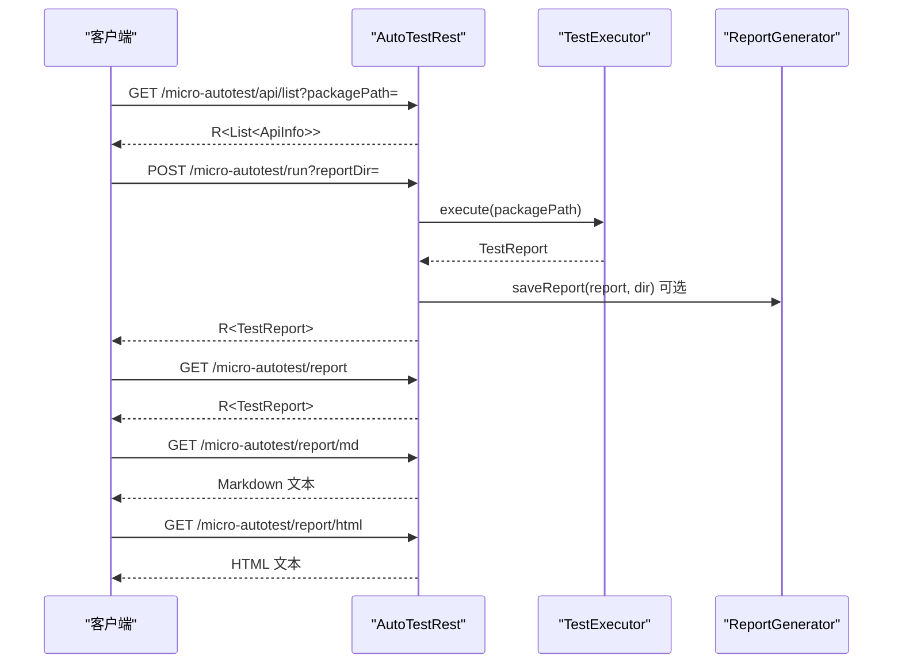
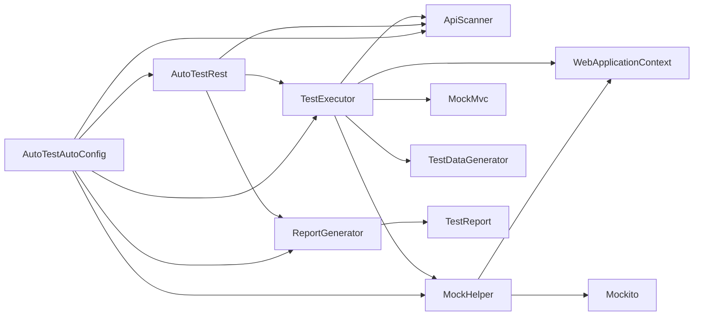

# 自动化测试模块

<cite>
**本文引用的文件**
- [AutoTestAutoConfig.java](file://micro-autotest/src/main/java/com/wkclz/auto/AutoTestAutoConfig.java)
- [ApiScanner.java](file://micro-autotest/src/main/java/com/wkclz/auto/scanner/ApiScanner.java)
- [TestExecutor.java](file://micro-autotest/src/main/java/com/wkclz/auto/executor/TestExecutor.java)
- [MockHelper.java](file://micro-autotest/src/main/java/com/wkclz/auto/mock/MockHelper.java)
- [AutoMockBeanPostProcessor.java](file://micro-autotest/src/main/java/com/wkclz/auto/mock/AutoMockBeanPostProcessor.java)
- [TestDataGenerator.java](file://micro-autotest/src/main/java/com/wkclz/auto/mock/TestDataGenerator.java)
- [ReportGenerator.java](file://micro-autotest/src/main/java/com/wkclz/auto/report/ReportGenerator.java)
- [AutoTestRest.java](file://micro-autotest/src/main/java/com/wkclz/auto/rest/AutoTestRest.java)
- [Route.java](file://micro-autotest/src/main/java/com/wkclz/auto/rest/Route.java)
- [ApiInfo.java](file://micro-autotest/src/main/java/com/wkclz/auto/bean/ApiInfo.java)
- [TestCaseResult.java](file://micro-autotest/src/main/java/com/wkclz/auto/bean/TestCaseResult.java)
- [TestReport.java](file://micro-autotest/src/main/java/com/wkclz/auto/bean/TestReport.java)
- [README.md](file://micro-autotest/README.md)
</cite>

## 目录
1. [简介](#简介)
2. [项目结构](#项目结构)
3. [核心组件](#核心组件)
4. [架构总览](#架构总览)
5. [详细组件分析](#详细组件分析)
6. [依赖分析](#依赖分析)
7. [性能考虑](#性能考虑)
8. [故障排查指南](#故障排查指南)
9. [结论](#结论)
10. [附录](#附录)

## 简介
本模块提供“零配置”的自动化接口测试能力，基于 Spring Boot 4.x 与 Spring MockMvc，自动扫描 REST 接口、动态生成测试数据、自动 Mock 控制器依赖，并输出 Markdown/HTML 双格式测试报告。支持运行时接口扫描、实时用例生成、容器级 Mock（可选）、以及报告持久化。

## 项目结构
模块采用按功能域分层组织：
- scanner：API 扫描与描述解析
- executor：测试执行引擎
- mock：Mock 注入与数据生成
- report：报告生成与落盘
- rest：对外 HTTP 接口
- bean：测试数据模型
- AutoTestAutoConfig：自动装配入口

图表来源
- [AutoTestAutoConfig.java:1-10](file://micro-autotest/src/main/java/com/wkclz/auto/AutoTestAutoConfig.java#L1-L10)
- [ApiScanner.java:1-272](file://micro-autotest/src/main/java/com/wkclz/auto/scanner/ApiScanner.java#L1-L272)
- [TestExecutor.java:1-196](file://micro-autotest/src/main/java/com/wkclz/auto/executor/TestExecutor.java#L1-L196)
- [MockHelper.java:1-66](file://micro-autotest/src/main/java/com/wkclz/auto/mock/MockHelper.java#L1-L66)
- [AutoMockBeanPostProcessor.java:1-89](file://micro-autotest/src/main/java/com/wkclz/auto/mock/AutoMockBeanPostProcessor.java#L1-L89)
- [TestDataGenerator.java:1-111](file://micro-autotest/src/main/java/com/wkclz/auto/mock/TestDataGenerator.java#L1-L111)
- [ReportGenerator.java:1-214](file://micro-autotest/src/main/java/com/wkclz/auto/report/ReportGenerator.java#L1-L214)
- [AutoTestRest.java:1-92](file://micro-autotest/src/main/java/com/wkclz/auto/rest/AutoTestRest.java#L1-L92)
- [Route.java:1-22](file://micro-autotest/src/main/java/com/wkclz/auto/rest/Route.java#L1-L22)
- [ApiInfo.java:1-18](file://micro-autotest/src/main/java/com/wkclz/auto/bean/ApiInfo.java#L1-L18)
- [TestCaseResult.java:1-19](file://micro-autotest/src/main/java/com/wkclz/auto/bean/TestCaseResult.java#L1-L19)
- [TestReport.java:1-19](file://micro-autotest/src/main/java/com/wkclz/auto/bean/TestReport.java#L1-L19)

章节来源
- [AutoTestAutoConfig.java:1-10](file://micro-autotest/src/main/java/com/wkclz/auto/AutoTestAutoConfig.java#L1-L10)
- [README.md:1-199](file://micro-autotest/README.md#L1-L199)

## 核心组件
- API 扫描器：扫描控制器类与方法，解析注解（如 @GetMapping/@PostMapping 等），提取 URI、方法、参数类型与描述信息。
- 测试执行器：构建 MockMvc 请求，自动注入 Mock 依赖，执行接口并统计结果。
- Mock 辅助：按控制器字段类型查找 Spring Bean 名称，使用 Mockito 创建 Mock 并在每次测试后重置。
- 容器级 Mock 后处理器：在容器启动阶段将匹配的 Mapper Bean 替换为 Mockito Mock 实例。
- 测试数据生成器：基于类型与反射递归构造测试对象，支持基础类型、集合、枚举与时间类型。
- 报告生成器：生成 Markdown/HTML 报告，支持落盘保存。
- 对外 REST 接口：提供接口列表、执行测试、查询报告等端点。

章节来源
- [ApiScanner.java:36-72](file://micro-autotest/src/main/java/com/wkclz/auto/scanner/ApiScanner.java#L36-L72)
- [TestExecutor.java:40-75](file://micro-autotest/src/main/java/com/wkclz/auto/executor/TestExecutor.java#L40-L75)
- [MockHelper.java:31-48](file://micro-autotest/src/main/java/com/wkclz/auto/mock/MockHelper.java#L31-L48)
- [AutoMockBeanPostProcessor.java:36-79](file://micro-autotest/src/main/java/com/wkclz/auto/mock/AutoMockBeanPostProcessor.java#L36-L79)
- [TestDataGenerator.java:22-101](file://micro-autotest/src/main/java/com/wkclz/auto/mock/TestDataGenerator.java#L22-L101)
- [ReportGenerator.java:22-83](file://micro-autotest/src/main/java/com/wkclz/auto/report/ReportGenerator.java#L22-L83)
- [AutoTestRest.java:43-90](file://micro-autotest/src/main/java/com/wkclz/auto/rest/AutoTestRest.java#L43-L90)

## 架构总览
整体流程：REST 控制器接收请求 → 扫描 API 列表 → 执行测试 → 生成报告 → 返回 JSON 或输出 Markdown/HTML。

图表来源
- [AutoTestRest.java:43-61](file://micro-autotest/src/main/java/com/wkclz/auto/rest/AutoTestRest.java#L43-L61)
- [ApiScanner.java:41-72](file://micro-autotest/src/main/java/com/wkclz/auto/scanner/ApiScanner.java#L41-L72)
- [TestExecutor.java:44-75](file://micro-autotest/src/main/java/com/wkclz/auto/executor/TestExecutor.java#L44-L75)
- [MockHelper.java:31-48](file://micro-autotest/src/main/java/com/wkclz/auto/mock/MockHelper.java#L31-L48)
- [TestDataGenerator.java:50-52](file://micro-autotest/src/main/java/com/wkclz/auto/mock/TestDataGenerator.java#L50-L52)
- [ReportGenerator.java:192-212](file://micro-autotest/src/main/java/com/wkclz/auto/report/ReportGenerator.java#L192-L212)

## 详细组件分析

### 组件一：API 扫描机制（ApiScanner）
- 默认包定位：通过 SpringBootApplication 注解定位主包；若不可用则回退到当前类包名。
- 控制器识别：扫描标注 @RestController 或 @Controller 的类。
- 方法解析：遍历方法注解（@RequestMapping/@GetMapping/@PostMapping/@PutMapping/@DeleteMapping），提取 URI 与方法。
- 描述补充：通过 @Router/@ApiDesc/@Desc 解析模块与接口描述，填充到 ApiInfo。
- 参数分析：识别 @RequestBody/@PathVariable/@RequestParam，记录参数类型与位置。

图表来源
- [ApiScanner.java:36-72](file://micro-autotest/src/main/java/com/wkclz/auto/scanner/ApiScanner.java#L36-L72)
- [ApiScanner.java:101-184](file://micro-autotest/src/main/java/com/wkclz/auto/scanner/ApiScanner.java#L101-L184)
- [ApiScanner.java:203-270](file://micro-autotest/src/main/java/com/wkclz/auto/scanner/ApiScanner.java#L203-L270)

章节来源
- [ApiScanner.java:36-72](file://micro-autotest/src/main/java/com/wkclz/auto/scanner/ApiScanner.java#L36-L72)
- [ApiScanner.java:101-184](file://micro-autotest/src/main/java/com/wkclz/auto/scanner/ApiScanner.java#L101-L184)
- [ApiScanner.java:203-270](file://micro-autotest/src/main/java/com/wkclz/auto/scanner/ApiScanner.java#L203-L270)

### 组件二：测试执行引擎（TestExecutor）
- 执行入口：execute()/execute(String)/executeApis(List<ApiInfo>)，支持按包或直接传入 API 列表。
- MockMvc 构建：基于 WebApplicationContext 创建实例，逐个执行。
- 控制器依赖 Mock：在执行前调用 MockHelper.mockControllerDependencies，替换控制器注入的 Bean。
- 请求构建：根据方法类型选择 GET/POST/PUT/DELETE；对 @RequestBody、@RequestParam、路径变量分别处理；GET 递归展开复杂参数对象。
- 结果统计：计算总耗时、成功/失败/错误数量，封装 TestCaseResult 与 TestReport。
- 异常处理：捕获异常并记录错误信息，确保最终 reset 所有 Mock。

图表来源
- [TestExecutor.java:44-75](file://micro-autotest/src/main/java/com/wkclz/auto/executor/TestExecutor.java#L44-L75)
- [TestExecutor.java:77-108](file://micro-autotest/src/main/java/com/wkclz/auto/executor/TestExecutor.java#L77-L108)
- [TestExecutor.java:110-158](file://micro-autotest/src/main/java/com/wkclz/auto/executor/TestExecutor.java#L110-L158)
- [TestExecutor.java:160-194](file://micro-autotest/src/main/java/com/wkclz/auto/executor/TestExecutor.java#L160-L194)

章节来源
- [TestExecutor.java:40-75](file://micro-autotest/src/main/java/com/wkclz/auto/executor/TestExecutor.java#L40-L75)
- [TestExecutor.java:77-108](file://micro-autotest/src/main/java/com/wkclz/auto/executor/TestExecutor.java#L77-L108)
- [TestExecutor.java:110-158](file://micro-autotest/src/main/java/com/wkclz/auto/executor/TestExecutor.java#L110-L158)
- [TestExecutor.java:160-194](file://micro-autotest/src/main/java/com/wkclz/auto/executor/TestExecutor.java#L160-L194)

### 组件三：Mock 数据生成策略（MockHelper + TestDataGenerator）
- 控制器依赖 Mock：遍历控制器字段，按类型从 ApplicationContext 解析 Bean 名称，使用 Mockito.mock 替换，记录原始 Bean 以便恢复。
- 参数值生成：针对 ApiParamInfo，委托 TestDataGenerator 生成对应类型的测试值。
- 容器级 Mock：BeanDefinitionRegistryPostProcessor 在注册阶段扫描 .mapper. 包下的 Bean，替换为 Mockito 实例，适合在应用启动前启用。

图表来源
- [MockHelper.java:31-48](file://micro-autotest/src/main/java/com/wkclz/auto/mock/MockHelper.java#L31-L48)
- [MockHelper.java:50-52](file://micro-autotest/src/main/java/com/wkclz/auto/mock/MockHelper.java#L50-L52)
- [TestDataGenerator.java:22-101](file://micro-autotest/src/main/java/com/wkclz/auto/mock/TestDataGenerator.java#L22-L101)
- [AutoMockBeanPostProcessor.java:36-79](file://micro-autotest/src/main/java/com/wkclz/auto/mock/AutoMockBeanPostProcessor.java#L36-L79)

章节来源
- [MockHelper.java:31-48](file://micro-autotest/src/main/java/com/wkclz/auto/mock/MockHelper.java#L31-L48)
- [MockHelper.java:50-52](file://micro-autotest/src/main/java/com/wkclz/auto/mock/MockHelper.java#L50-L52)
- [TestDataGenerator.java:22-101](file://micro-autotest/src/main/java/com/wkclz/auto/mock/TestDataGenerator.java#L22-L101)
- [AutoMockBeanPostProcessor.java:24-34](file://micro-autotest/src/main/java/com/wkclz/auto/mock/AutoMockBeanPostProcessor.java#L24-L34)
- [AutoMockBeanPostProcessor.java:36-79](file://micro-autotest/src/main/java/com/wkclz/auto/mock/AutoMockBeanPostProcessor.java#L36-L79)

### 组件四：测试报告生成（ReportGenerator）
- Markdown 报告：包含摘要表格、测试明细表、失败用例详情。
- HTML 报告：响应式布局，颜色编码区分成功/失败/错误，支持直接在浏览器查看。
- 报告落盘：按启动时间戳命名，同时生成 .md 与 .html 文件。

图表来源
- [ReportGenerator.java:22-83](file://micro-autotest/src/main/java/com/wkclz/auto/report/ReportGenerator.java#L22-L83)
- [ReportGenerator.java:85-190](file://micro-autotest/src/main/java/com/wkclz/auto/report/ReportGenerator.java#L85-L190)
- [ReportGenerator.java:192-212](file://micro-autotest/src/main/java/com/wkclz/auto/report/ReportGenerator.java#L192-L212)

章节来源
- [ReportGenerator.java:22-83](file://micro-autotest/src/main/java/com/wkclz/auto/report/ReportGenerator.java#L22-L83)
- [ReportGenerator.java:85-190](file://micro-autotest/src/main/java/com/wkclz/auto/report/ReportGenerator.java#L85-L190)
- [ReportGenerator.java:192-212](file://micro-autotest/src/main/java/com/wkclz/auto/report/ReportGenerator.java#L192-L212)

### 组件五：对外 REST 接口（AutoTestRest + Route）
- 接口列表：GET /micro-autotest/api/list，支持可选 packagePath。
- 执行测试：POST /micro-autotest/run，支持可选 reportDir。
- 查询报告：GET /micro-autotest/report 返回最新 TestReport；GET /micro-autotest/report/md 与 /micro-autotest/report/html 输出文本内容。

图表来源
- [AutoTestRest.java:43-90](file://micro-autotest/src/main/java/com/wkclz/auto/rest/AutoTestRest.java#L43-L90)
- [Route.java:6-21](file://micro-autotest/src/main/java/com/wkclz/auto/rest/Route.java#L6-L21)

章节来源
- [AutoTestRest.java:43-90](file://micro-autotest/src/main/java/com/wkclz/auto/rest/AutoTestRest.java#L43-L90)
- [Route.java:6-21](file://micro-autotest/src/main/java/com/wkclz/auto/rest/Route.java#L6-L21)

## 依赖分析
- 组件内聚性：各模块职责清晰，扫描、执行、Mock、报告相互独立，便于扩展与维护。
- 外部依赖：Spring MockMvc、Mockito、fastjson2、Apache Commons Collections/Lang、Spring Boot 注解与工具库。
- 可能的耦合点：
  - TestExecutor 依赖 ApiScanner、MockHelper、WebApplicationContext。
  - MockHelper 依赖 ApplicationContext 与 Mockito。
  - ReportGenerator 依赖 TestReport 与文件系统。
  - AutoMockBeanPostProcessor 依赖 BeanDefinitionRegistry 与 Mockito。

图表来源
- [TestExecutor.java:31-38](file://micro-autotest/src/main/java/com/wkclz/auto/executor/TestExecutor.java#L31-L38)
- [MockHelper.java:22-29](file://micro-autotest/src/main/java/com/wkclz/auto/mock/MockHelper.java#L22-L29)
- [ReportGenerator.java:1-214](file://micro-autotest/src/main/java/com/wkclz/auto/report/ReportGenerator.java#L1-L214)
- [AutoTestRest.java:32-39](file://micro-autotest/src/main/java/com/wkclz/auto/rest/AutoTestRest.java#L32-L39)
- [AutoTestAutoConfig.java:6-9](file://micro-autotest/src/main/java/com/wkclz/auto/AutoTestAutoConfig.java#L6-L9)

章节来源
- [TestExecutor.java:31-38](file://micro-autotest/src/main/java/com/wkclz/auto/executor/TestExecutor.java#L31-L38)
- [MockHelper.java:22-29](file://micro-autotest/src/main/java/com/wkclz/auto/mock/MockHelper.java#L22-L29)
- [ReportGenerator.java:1-214](file://micro-autotest/src/main/java/com/wkclz/auto/report/ReportGenerator.java#L1-L214)
- [AutoTestRest.java:32-39](file://micro-autotest/src/main/java/com/wkclz/auto/rest/AutoTestRest.java#L32-L39)
- [AutoTestAutoConfig.java:6-9](file://micro-autotest/src/main/java/com/wkclz/auto/AutoTestAutoConfig.java#L6-L9)

## 性能考虑
- MockMvc 单实例复用：建议在执行前一次性构建 MockMvc，避免重复初始化带来的开销。
- 参数生成深度控制：TestDataGenerator 限制最大递归深度，避免深层对象导致的构造成本过高。
- 批量执行：对大量 API，建议分批执行并异步保存报告，减少主线程阻塞。
- 日志级别：生产环境建议降低扫描与 Mock 日志级别，避免频繁 I/O 影响性能。
- 容器级 Mock：在启动阶段替换 Mapper Bean 可减少运行时替换成本，但需评估对业务 Bean 生命周期的影响。

## 故障排查指南
- 扫描不到接口
  - 检查包路径是否正确，确认主类 @SpringBootApplication 所在包是否被扫描。
  - 确认控制器类是否标注 @RestController 或 @Controller。
- 参数绑定失败
  - 检查参数注解是否正确（@RequestBody/@PathVariable/@RequestParam）。
  - 对于 GET 请求，复杂对象会递归展开为查询参数，确保字段可序列化。
- Mock 失败
  - 确认目标 Bean 是否存在于 ApplicationContext，且类型匹配。
  - 若需要在启动阶段 Mock，调用 AutoMockBeanPostProcessor.enableMock() 并在应用启动前生效。
- 报告未生成
  - 检查 reportDir 是否可写，路径是否存在。
  - 确认执行测试时已传入 reportDir 参数或调用保存接口。
- 响应异常
  - 查看 TestCaseResult 中的错误信息与响应体，结合失败详情定位问题。

章节来源
- [ApiScanner.java:74-83](file://micro-autotest/src/main/java/com/wkclz/auto/scanner/ApiScanner.java#L74-L83)
- [TestExecutor.java:98-105](file://micro-autotest/src/main/java/com/wkclz/auto/executor/TestExecutor.java#L98-L105)
- [MockHelper.java:54-59](file://micro-autotest/src/main/java/com/wkclz/auto/mock/MockHelper.java#L54-L59)
- [ReportGenerator.java:192-212](file://micro-autotest/src/main/java/com/wkclz/auto/report/ReportGenerator.java#L192-L212)

## 结论
本模块通过“扫描—执行—Mock—报告”一体化设计，实现了零配置的自动化接口测试。其关键优势在于：
- 自动扫描与描述解析，无需手写用例；
- 基于反射与类型推断的测试数据生成；
- 可选的容器级 Mock，显著降低外部依赖影响；
- 可落地的双格式报告，便于持续集成与回归验证。

## 附录

### API 参考
- 接口列表：GET /micro-autotest/api/list?packagePath={包路径}
- 执行测试：POST /micro-autotest/run?reportDir={报告目录}
- 最新报告：GET /micro-autotest/report
- Markdown 报告：GET /micro-autotest/report/md
- HTML 报告：GET /micro-autotest/report/html

章节来源
- [AutoTestRest.java:43-90](file://micro-autotest/src/main/java/com/wkclz/auto/rest/AutoTestRest.java#L43-L90)
- [Route.java:6-21](file://micro-autotest/src/main/java/com/wkclz/auto/rest/Route.java#L6-L21)

### 测试用例设计指南
- 基础用例：确保每个 REST 接口至少有一个 GET/POST/PUT/DELETE 的最小可用场景。
- 参数覆盖：对 @RequestBody、@PathVariable、@RequestParam 全面覆盖，复杂对象通过递归参数展开。
- 错误场景：构造非法参数（空值、越界、类型不匹配）以验证 4xx/5xx 场景。
- 并发与超时：在高并发场景下观察响应时间与错误率，必要时增加超时与重试策略。

### Mock 配置最佳实践
- 控制器依赖：优先使用 @Autowired 字段注入，MockHelper 将自动替换。
- Mapper 层：启用容器级 Mock（AutoMockBeanPostProcessor.enableMock()），在启动前调用。
- 外部系统：对 Redis、HTTP 外部服务建议使用 WireMock 或本地替身，避免真实依赖。
- 清理与隔离：每次测试后调用 resetAll()，确保 Mock 状态不互相污染。

### 性能测试优化方案
- 分批执行：将大体量 API 分批执行，降低内存峰值与 GC 压力。
- 并行化：在多核环境下并行执行不同模块的 API，注意线程安全与 Mock 状态隔离。
- 缓存与降噪：对重复请求进行缓存，减少无效 I/O；降低日志级别，避免磁盘瓶颈。
- 报告异步：将报告生成与落盘异步化，避免阻塞主执行线程。

### 数据模型说明
- ApiInfo：接口元信息（控制器类、模块、方法、URI、名称、描述、参数、返回类型）
- TestCaseResult：单个用例结果（URI、方法、描述、模块、成功标志、HTTP 状态、耗时、请求/响应体、错误信息）
- TestReport：测试报告（起止时间、总耗时、总数、成功/失败/错误数、结果列表）

章节来源
- [ApiInfo.java:8-17](file://micro-autotest/src/main/java/com/wkclz/auto/bean/ApiInfo.java#L8-L17)
- [TestCaseResult.java:7-18](file://micro-autotest/src/main/java/com/wkclz/auto/bean/TestCaseResult.java#L7-L18)
- [TestReport.java:9-18](file://micro-autotest/src/main/java/com/wkclz/auto/bean/TestReport.java#L9-L18)