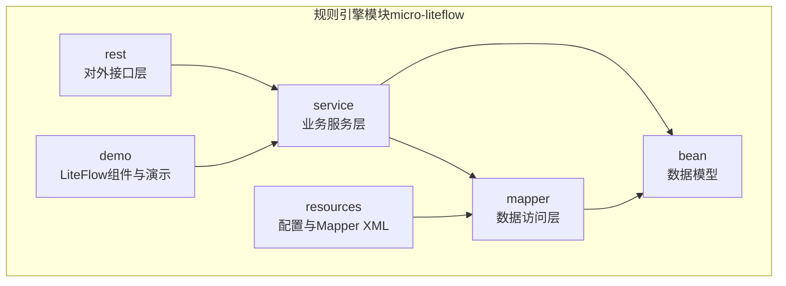
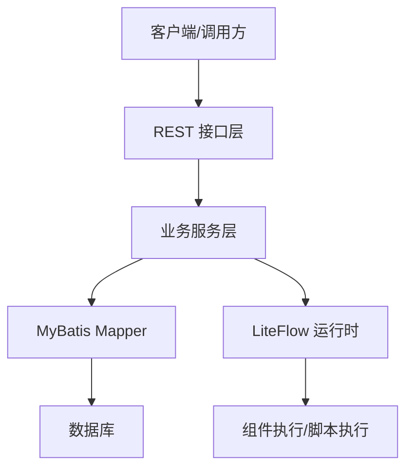
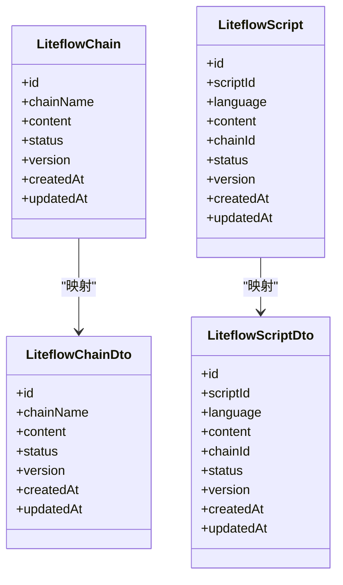
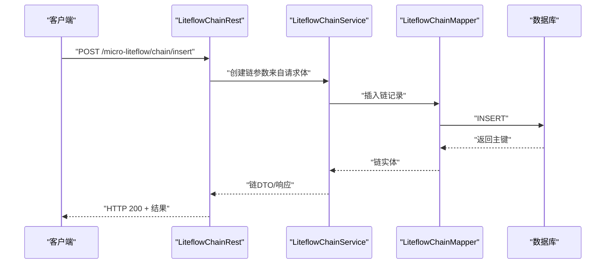
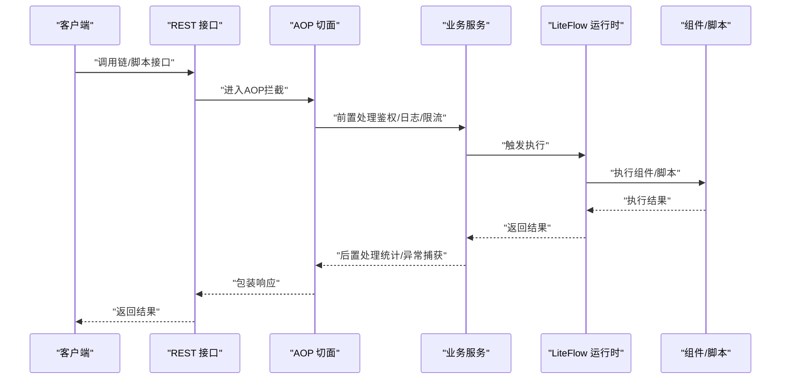
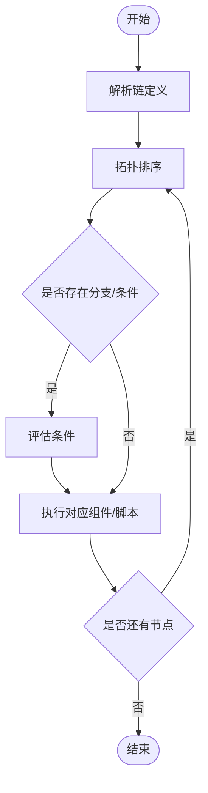
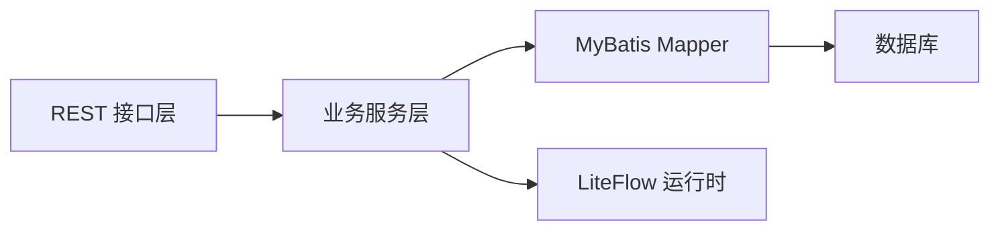

# 规则引擎模块

<cite>
**本文引用的文件**
- [LiteFlowAutoConfig.java](file://micro-liteflow/src/main/java/com/wkclz/micro/liteflow/LiteFlowAutoConfig.java)
- [Route.java](file://micro-liteflow/src/main/java/com/wkclz/micro/liteflow/rest/Route.java)
- [CommonLiteFlowRest.java](file://micro-liteflow/src/main/java/com/wkclz/micro/liteflow/rest/CommonLiteFlowRest.java)
- [LiteflowChainRest.java](file://micro-liteflow/src/main/java/com/wkclz/micro/liteflow/rest/LiteflowChainRest.java)
- [LiteflowScriptRest.java](file://micro-liteflow/src/main/java/com/wkclz/micro/liteflow/rest/LiteflowScriptRest.java)
- [LiteflowChainService.java](file://micro-liteflow/src/main/java/com/wkclz/micro/liteflow/service/LiteflowChainService.java)
- [LiteflowScriptService.java](file://micro-liteflow/src/main/java/com/wkclz/micro/liteflow/service/LiteflowScriptService.java)
- [LiteflowChainMapper.java](file://micro-liteflow/src/main/java/com/wkclz/micro/liteflow/mapper/LiteflowChainMapper.java)
- [LiteflowScriptMapper.java](file://micro-liteflow/src/main/java/com/wkclz/micro/liteflow/mapper/LiteflowScriptMapper.java)
- [LiteflowChain.java](file://micro-liteflow/src/main/java/com/wkclz/micro/liteflow/bean/entity/LiteflowChain.java)
- [LiteflowScript.java](file://micro-liteflow/src/main/java/com/wkclz/micro/liteflow/bean/entity/LiteflowScript.java)
- [LiteflowChainDto.java](file://micro-liteflow/src/main/java/com/wkclz/micro/liteflow/bean/dto/LiteflowChainDto.java)
- [LiteflowScriptDto.java](file://micro-liteflow/src/main/java/com/wkclz/micro/liteflow/bean/dto/LiteflowScriptDto.java)
- [LiteflowChainCreateReq.java](file://micro-liteflow/src/main/java/com/wkclz/micro/liteflow/bean/req/LiteflowChainCreateReq.java)
- [LiteflowChainUpdateReq.java](file://micro-liteflow/src/main/java/com/wkclz/micro/liteflow/bean/req/LiteflowChainUpdateReq.java)
- [LiteflowScriptCreateReq.java](file://micro-liteflow/src/main/java/com/wkclz/micro/liteflow/bean/req/LiteflowScriptCreateReq.java)
- [LiteflowScriptUpdateReq.java](file://micro-liteflow/src/main/java/com/wkclz/micro/liteflow/bean/req/LiteflowScriptUpdateReq.java)
- [LiteflowChainPageReq.java](file://micro-liteflow/src/main/java/com/wkclz/micro/liteflow/bean/req/LiteflowChainPageReq.java)
- [LiteflowScriptPageReq.java](file://micro-liteflow/src/main/java/com/wkclz/micro/liteflow/bean/req/LiteflowScriptPageReq.java)
- [LiteflowChainPageResp.java](file://micro-liteflow/src/main/java/com/wkclz/micro/liteflow/bean/resp/LiteflowChainPageResp.java)
- [LiteflowScriptPageResp.java](file://micro-liteflow/src/main/java/com/wkclz/micro/liteflow/bean/resp/LiteflowScriptPageResp.java)
- [LiteflowChainMapper.xml](file://micro-liteflow/src/main/resources/mapper/LiteflowChainMapper.xml)
- [LiteflowScriptMapper.xml](file://micro-liteflow/src/main/resources/mapper/LiteflowScriptMapper.xml)
- [application.yml](file://micro-liteflow/src/main/resources/config/application.yml)
- [ACmp.java](file://micro-liteflow/src/main/java/com/wkclz/micro/liteflow/demo/ACmp.java)
- [BCmp.java](file://micro-liteflow/src/main/java/com/wkclz/micro/liteflow/demo/BCmp.java)
- [CCmp.java](file://micro-liteflow/src/main/java/com/wkclz/micro/liteflow/demo/CCmp.java)
- [LiteFlowDemo.java](file://micro-liteflow/src/main/java/com/wkclz/micro/liteflow/demo/LiteFlowDemo.java)
- [LiteFlowTestRest.java](file://micro-liteflow/src/main/java/com/wkclz/micro/liteflow/demo/LiteFlowTestRest.java)
- [001-LiteFlow链与脚本.md](file://docs/stories/基础设施/001-LiteFlow链与脚本.md)
- [README.md（技术模块总览）](file://docs/living-docs-technical/modules/README.md)
- [README.md（API总览）](file://docs/living-docs-technical/api/README.md)
- [README.md（数据模型总览）](file://docs/living-docs-technical/data-models/README.md)
- [README.md（架构概览）](file://docs/living-docs-technical/architecture/overview.md)
</cite>

## 目录
1. [简介](#简介)
2. [项目结构](#项目结构)
3. [核心组件](#核心组件)
4. [架构总览](#架构总览)
5. [详细组件分析](#详细组件分析)
6. [依赖关系分析](#依赖关系分析)
7. [性能考虑](#性能考虑)
8. [故障排查指南](#故障排查指南)
9. [结论](#结论)
10. [附录](#附录)

## 简介
本文件面向“规则引擎模块”（micro-liteflow），系统性阐述LiteFlow集成架构、规则链定义语法、脚本执行机制与组件编排原理；并基于仓库中的实体、请求/响应DTO、Mapper、Service、REST接口与自动装配配置，给出数据模型设计、REST接口实现方式、AOP组件执行流程说明、最佳实践、性能优化策略与调试技巧。同时提供完整API参考与使用示例，帮助在业务场景中通过规则引擎进行流程编排。

## 项目结构
micro-liteflow采用标准Spring Boot微服务结构，按领域职责划分包：
- bean：数据传输对象（DTO）、实体（Entity）、请求（Req）、响应（Resp）
- rest：对外HTTP接口层（路由、通用REST、链与脚本REST）
- service：业务服务层（链与脚本）
- mapper：MyBatis映射器
- demo：LiteFlow组件与演示入口
- resources：Spring自动装配声明、Mapper XML、配置文件

图表来源
- [LiteflowChainRest.java](file://micro-liteflow/src/main/java/com/wkclz/micro/liteflow/rest/LiteflowChainRest.java)
- [LiteflowScriptRest.java](file://micro-liteflow/src/main/java/com/wkclz/micro/liteflow/rest/LiteflowScriptRest.java)
- [LiteflowChainService.java](file://micro-liteflow/src/main/java/com/wkclz/micro/liteflow/service/LiteflowChainService.java)
- [LiteflowScriptService.java](file://micro-liteflow/src/main/java/com/wkclz/micro/liteflow/service/LiteflowScriptService.java)
- [LiteflowChainMapper.java](file://micro-liteflow/src/main/java/com/wkclz/micro/liteflow/mapper/LiteflowChainMapper.java)
- [LiteflowScriptMapper.java](file://micro-liteflow/src/main/java/com/wkclz/micro/liteflow/mapper/LiteflowScriptMapper.java)
- [LiteflowChain.java](file://micro-liteflow/src/main/java/com/wkclz/micro/liteflow/bean/entity/LiteflowChain.java)
- [LiteflowScript.java](file://micro-liteflow/src/main/java/com/wkclz/micro/liteflow/bean/entity/LiteflowScript.java)
- [LiteFlowAutoConfig.java](file://micro-liteflow/src/main/java/com/wkclz/micro/liteflow/LiteFlowAutoConfig.java)

章节来源
- [LiteFlowAutoConfig.java](file://micro-liteflow/src/main/java/com/wkclz/micro/liteflow/LiteFlowAutoConfig.java)
- [Route.java](file://micro-liteflow/src/main/java/com/wkclz/micro/liteflow/rest/Route.java)

## 核心组件
- 自动装配与启动
  - 通过自动装配类完成模块初始化与组件注册，确保LiteFlow运行时可加载链与脚本。
- REST接口层
  - 提供链与脚本的增删改查、分页查询等HTTP接口，统一路由前缀为/micro-liteflow。
- 业务服务层
  - 封装链与脚本的业务逻辑，协调Mapper与LiteFlow运行时。
- 数据访问层
  - MyBatis Mapper负责链与脚本的持久化操作。
- 数据模型
  - 实体与DTO/Req/Resp构成清晰的数据契约，支撑前后端交互与业务处理。

章节来源
- [LiteFlowAutoConfig.java](file://micro-liteflow/src/main/java/com/wkclz/micro/liteflow/LiteFlowAutoConfig.java)
- [CommonLiteFlowRest.java](file://micro-liteflow/src/main/java/com/wkclz/micro/liteflow/rest/CommonLiteFlowRest.java)
- [LiteflowChainRest.java](file://micro-liteflow/src/main/java/com/wkclz/micro/liteflow/rest/LiteflowChainRest.java)
- [LiteflowScriptRest.java](file://micro-liteflow/src/main/java/com/wkclz/micro/liteflow/rest/LiteflowScriptRest.java)
- [LiteflowChainService.java](file://micro-liteflow/src/main/java/com/wkclz/micro/liteflow/service/LiteflowChainService.java)
- [LiteflowScriptService.java](file://micro-liteflow/src/main/java/com/wkclz/micro/liteflow/service/LiteflowScriptService.java)
- [LiteflowChainMapper.java](file://micro-liteflow/src/main/java/com/wkclz/micro/liteflow/mapper/LiteflowChainMapper.java)
- [LiteflowScriptMapper.java](file://micro-liteflow/src/main/java/com/wkclz/micro/liteflow/mapper/LiteflowScriptMapper.java)

## 架构总览
规则引擎模块遵循“接口层-服务层-数据访问层”的分层架构，并通过LiteFlow运行时对链与脚本进行编排执行。整体交互如下：

图表来源
- [LiteflowChainRest.java](file://micro-liteflow/src/main/java/com/wkclz/micro/liteflow/rest/LiteflowChainRest.java)
- [LiteflowScriptRest.java](file://micro-liteflow/src/main/java/com/wkclz/micro/liteflow/rest/LiteflowScriptRest.java)
- [LiteflowChainService.java](file://micro-liteflow/src/main/java/com/wkclz/micro/liteflow/service/LiteflowChainService.java)
- [LiteflowScriptService.java](file://micro-liteflow/src/main/java/com/wkclz/micro/liteflow/service/LiteflowScriptService.java)
- [LiteflowChainMapper.xml](file://micro-liteflow/src/main/resources/mapper/LiteflowChainMapper.xml)
- [LiteflowScriptMapper.xml](file://micro-liteflow/src/main/resources/mapper/LiteflowScriptMapper.xml)

## 详细组件分析

### 数据模型设计
- LiteflowChain（规则链）
  - 描述链的标识、名称、定义（如EL表达式或链式语法）、状态、版本与时间戳等字段。
- LiteflowScript（脚本）
  - 描述脚本语言、内容、关联链、状态与版本等字段。
- DTO/Req/Resp
  - 对应链与脚本的创建、更新、分页查询与详情返回结构，保证接口契约稳定。

图表来源
- [LiteflowChain.java](file://micro-liteflow/src/main/java/com/wkclz/micro/liteflow/bean/entity/LiteflowChain.java)
- [LiteflowScript.java](file://micro-liteflow/src/main/java/com/wkclz/micro/liteflow/bean/entity/LiteflowScript.java)
- [LiteflowChainDto.java](file://micro-liteflow/src/main/java/com/wkclz/micro/liteflow/bean/dto/LiteflowChainDto.java)
- [LiteflowScriptDto.java](file://micro-liteflow/src/main/java/com/wkclz/micro/liteflow/bean/dto/LiteflowScriptDto.java)

章节来源
- [LiteflowChain.java](file://micro-liteflow/src/main/java/com/wkclz/micro/liteflow/bean/entity/LiteflowChain.java)
- [LiteflowScript.java](file://micro-liteflow/src/main/java/com/wkclz/micro/liteflow/bean/entity/LiteflowScript.java)
- [LiteflowChainDto.java](file://micro-liteflow/src/main/java/com/wkclz/micro/liteflow/bean/dto/LiteflowChainDto.java)
- [LiteflowScriptDto.java](file://micro-liteflow/src/main/java/com/wkclz/micro/liteflow/bean/dto/LiteflowScriptDto.java)

### REST接口实现方式
- 统一路由前缀：/micro-liteflow
- 通用REST封装：提供分页、CRUD等通用能力
- 链接口：链的新增、修改、删除、详情、分页
- 脚本接口：脚本的新增、修改、删除、详情、分页
- 示例端点（以文档为准）：
  - GET /micro-liteflow/chain/page
  - POST /micro-liteflow/chain/insert
  - PUT /micro-liteflow/chain/update
  - DELETE /micro-liteflow/chain/delete/{id}
  - GET /micro-liteflow/script/page
  - POST /micro-liteflow/script/insert
  - PUT /micro-liteflow/script/update
  - DELETE /micro-liteflow/script/delete/{id}

图表来源
- [LiteflowChainRest.java](file://micro-liteflow/src/main/java/com/wkclz/micro/liteflow/rest/LiteflowChainRest.java)
- [LiteflowChainService.java](file://micro-liteflow/src/main/java/com/wkclz/micro/liteflow/service/LiteflowChainService.java)
- [LiteflowChainMapper.java](file://micro-liteflow/src/main/java/com/wkclz/micro/liteflow/mapper/LiteflowChainMapper.java)
- [LiteflowChainMapper.xml](file://micro-liteflow/src/main/resources/mapper/LiteflowChainMapper.xml)

章节来源
- [Route.java](file://micro-liteflow/src/main/java/com/wkclz/micro/liteflow/rest/Route.java)
- [CommonLiteFlowRest.java](file://micro-liteflow/src/main/java/com/wkclz/micro/liteflow/rest/CommonLiteFlowRest.java)
- [LiteflowChainRest.java](file://micro-liteflow/src/main/java/com/wkclz/micro/liteflow/rest/LiteflowChainRest.java)
- [LiteflowScriptRest.java](file://micro-liteflow/src/main/java/com/wkclz/micro/liteflow/rest/LiteflowScriptRest.java)
- [README.md（API总览）](file://docs/living-docs-technical/api/README.md)

### AOP组件的执行流程
- 在链与脚本的执行路径中，AOP可作为横切关注点（如鉴权、日志、限流、重试）介入
- 典型流程：请求进入REST -> 业务服务 -> LiteFlow运行时 -> 组件/脚本执行 -> 返回结果
- AOP建议切入点：
  - 方法级：@Around/@Before/@AfterReturning/@AfterThrowing
  - 路径级：基于注解或拦截器，对/micro-liteflow下的链/脚本接口进行统一增强

图表来源
- [LiteflowChainRest.java](file://micro-liteflow/src/main/java/com/wkclz/micro/liteflow/rest/LiteflowChainRest.java)
- [LiteflowScriptRest.java](file://micro-liteflow/src/main/java/com/wkclz/micro/liteflow/rest/LiteflowScriptRest.java)
- [LiteflowChainService.java](file://micro-liteflow/src/main/java/com/wkclz/micro/liteflow/service/LiteflowChainService.java)
- [LiteflowScriptService.java](file://micro-liteflow/src/main/java/com/wkclz/micro/liteflow/service/LiteflowScriptService.java)

### 规则链定义语法与脚本执行机制
- 规则链（Chain）：以链式语法描述组件顺序与条件分支，支持并行、串行、条件判断等组合
- 脚本（Script）：以脚本语言（如JavaScript/Python等）实现复杂逻辑，与链绑定执行
- 组件编排：通过LiteFlow运行时解析链定义，按拓扑顺序调度组件或脚本节点

图表来源
- [LiteflowChain.java](file://micro-liteflow/src/main/java/com/wkclz/micro/liteflow/bean/entity/LiteflowChain.java)
- [LiteflowScript.java](file://micro-liteflow/src/main/java/com/wkclz/micro/liteflow/bean/entity/LiteflowScript.java)
- [LiteflowChainMapper.xml](file://micro-liteflow/src/main/resources/mapper/LiteflowChainMapper.xml)
- [LiteflowScriptMapper.xml](file://micro-liteflow/src/main/resources/mapper/LiteflowScriptMapper.xml)

章节来源
- [001-LiteFlow链与脚本.md](file://docs/stories/基础设施/001-LiteFlow链与脚本.md)

### Demo与组件样例
- 组件样例：ACmp、BCmp、CCmp，展示LiteFlow组件的基本实现与交互
- 演示入口：LiteFlowDemo与LiteFlowTestRest，用于快速验证链与脚本的执行效果

章节来源
- [ACmp.java](file://micro-liteflow/src/main/java/com/wkclz/micro/liteflow/demo/ACmp.java)
- [BCmp.java](file://micro-liteflow/src/main/java/com/wkclz/micro/liteflow/demo/BCmp.java)
- [CCmp.java](file://micro-liteflow/src/main/java/com/wkclz/micro/liteflow/demo/CCmp.java)
- [LiteFlowDemo.java](file://micro-liteflow/src/main/java/com/wkclz/micro/liteflow/demo/LiteFlowDemo.java)
- [LiteFlowTestRest.java](file://micro-liteflow/src/main/java/com/wkclz/micro/liteflow/demo/LiteFlowTestRest.java)

## 依赖关系分析
- 模块内依赖
  - REST依赖Service，Service依赖Mapper与LiteFlow运行时
  - Mapper依赖数据库
- 外部依赖
  - Spring Boot、MyBatis、LiteFlow运行时
- 自动装配
  - 通过自动装配类完成组件注册与上下文初始化

图表来源
- [LiteflowChainRest.java](file://micro-liteflow/src/main/java/com/wkclz/micro/liteflow/rest/LiteflowChainRest.java)
- [LiteflowScriptRest.java](file://micro-liteflow/src/main/java/com/wkclz/micro/liteflow/rest/LiteflowScriptRest.java)
- [LiteflowChainService.java](file://micro-liteflow/src/main/java/com/wkclz/micro/liteflow/service/LiteflowChainService.java)
- [LiteflowScriptService.java](file://micro-liteflow/src/main/java/com/wkclz/micro/liteflow/service/LiteflowScriptService.java)
- [LiteflowChainMapper.java](file://micro-liteflow/src/main/java/com/wkclz/micro/liteflow/mapper/LiteflowChainMapper.java)
- [LiteflowScriptMapper.java](file://micro-liteflow/src/main/java/com/wkclz/micro/liteflow/mapper/LiteflowScriptMapper.java)

章节来源
- [LiteFlowAutoConfig.java](file://micro-liteflow/src/main/java/com/wkclz/micro/liteflow/LiteFlowAutoConfig.java)
- [README.md（技术模块总览）](file://docs/living-docs-technical/modules/README.md)
- [README.md（架构概览）](file://docs/living-docs-technical/architecture/overview.md)

## 性能考虑
- 缓存策略
  - 对热点链与脚本进行缓存，减少重复解析与加载开销
- 分页与批量
  - 使用分页接口避免一次性拉取大量数据；批量写入提升导入效率
- 异步与并发
  - 对耗时组件/脚本采用异步执行或线程池隔离，避免阻塞主线程
- 监控与指标
  - 记录链执行耗时、失败率、重试次数等关键指标，便于定位瓶颈
- 配置优化
  - LiteFlow运行时与数据库连接池参数调优，结合压测结果迭代

## 故障排查指南
- 接口问题
  - 检查路由前缀与端点是否正确；确认请求体格式与必填字段
- 业务异常
  - 查看服务层异常处理与日志；核对链定义语法与组件实现
- 数据问题
  - 核对Mapper SQL与数据库字段映射；确认分页参数与排序字段
- 执行问题
  - 通过Demo组件快速复现；逐步缩小到具体组件或脚本
- AOP问题
  - 检查切面是否生效、拦截顺序与异常传播

章节来源
- [LiteflowChainRest.java](file://micro-liteflow/src/main/java/com/wkclz/micro/liteflow/rest/LiteflowChainRest.java)
- [LiteflowScriptRest.java](file://micro-liteflow/src/main/java/com/wkclz/micro/liteflow/rest/LiteflowScriptRest.java)
- [LiteflowChainService.java](file://micro-liteflow/src/main/java/com/wkclz/micro/liteflow/service/LiteflowChainService.java)
- [LiteflowScriptService.java](file://micro-liteflow/src/main/java/com/wkclz/micro/liteflow/service/LiteflowScriptService.java)
- [LiteflowChainMapper.xml](file://micro-liteflow/src/main/resources/mapper/LiteflowChainMapper.xml)
- [LiteflowScriptMapper.xml](file://micro-liteflow/src/main/resources/mapper/LiteflowScriptMapper.xml)

## 结论
规则引擎模块通过清晰的分层架构与LiteFlow运行时，实现了链与脚本的全生命周期管理与高效执行。依托标准化的数据模型、REST接口与AOP增强，可在多业务场景中实现灵活的流程编排与扩展。建议结合缓存、异步与监控策略持续优化性能，并通过Demo与分步调试快速定位问题。

## 附录

### API参考（示例）
- 链管理
  - GET /micro-liteflow/chain/page
  - POST /micro-liteflow/chain/insert
  - PUT /micro-liteflow/chain/update
  - DELETE /micro-liteflow/chain/delete/{id}
  - GET /micro-liteflow/chain/info/{id}
- 脚本管理
  - GET /micro-liteflow/script/page
  - POST /micro-liteflow/script/insert
  - PUT /micro-liteflow/script/update
  - DELETE /micro-liteflow/script/delete/{id}
  - GET /micro-liteflow/script/info/{id}

章节来源
- [README.md（API总览）](file://docs/living-docs-technical/api/README.md)

### 数据模型参考
- LiteflowChain：链实体
- LiteflowScript：脚本实体
- DTO/Req/Resp：接口契约

章节来源
- [README.md（数据模型总览）](file://docs/living-docs-technical/data-models/README.md)
- [LiteflowChain.java](file://micro-liteflow/src/main/java/com/wkclz/micro/liteflow/bean/entity/LiteflowChain.java)
- [LiteflowScript.java](file://micro-liteflow/src/main/java/com/wkclz/micro/liteflow/bean/entity/LiteflowScript.java)
- [LiteflowChainDto.java](file://micro-liteflow/src/main/java/com/wkclz/micro/liteflow/bean/dto/LiteflowChainDto.java)
- [LiteflowScriptDto.java](file://micro-liteflow/src/main/java/com/wkclz/micro/liteflow/bean/dto/LiteflowScriptDto.java)

### 最佳实践
- 链定义
  - 保持链简洁、语义明确；合理拆分长链为多个短链
  - 使用条件与并行节点提升执行效率
- 脚本
  - 将复杂逻辑下沉至脚本；避免在链中过度嵌套
  - 为脚本编写单元测试与边界用例
- 组件
  - 组件职责单一；异常与返回值约定清晰
- 配置
  - 明确环境差异（开发/测试/生产）；统一配置中心管理

### 使用示例（概念步骤）
- 新增链
  - 准备链定义（语法与组件列表）
  - 调用链插入接口，返回链ID
- 新增脚本
  - 选择语言与内容，绑定链ID
  - 调用脚本插入接口
- 执行链
  - 通过LiteFlow运行时触发链执行
  - 观察组件/脚本输出与链结果
- 调试
  - 使用Demo组件快速验证；查看日志与指标

章节来源
- [001-LiteFlow链与脚本.md](file://docs/stories/基础设施/001-LiteFlow链与脚本.md)
- [LiteFlowDemo.java](file://micro-liteflow/src/main/java/com/wkclz/micro/liteflow/demo/LiteFlowDemo.java)
- [LiteFlowTestRest.java](file://micro-liteflow/src/main/java/com/wkclz/micro/liteflow/demo/LiteFlowTestRest.java)