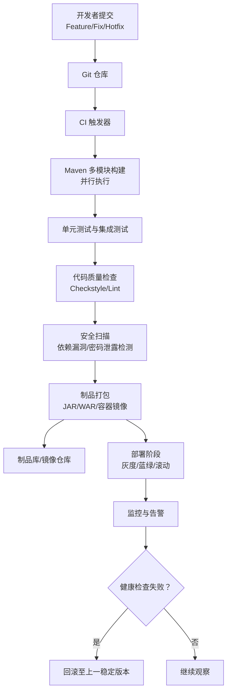
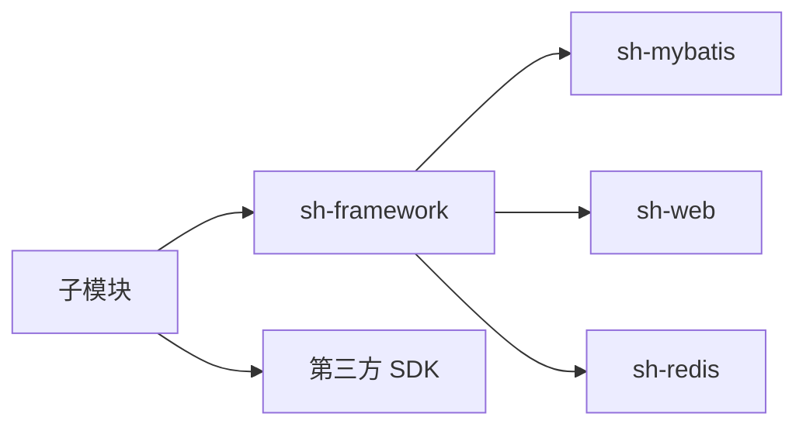

# CI/CD流程

<cite>
**本文引用的文件**
- [README.md](file://README.md)
- [CONTEXT.md](file://CONTEXT.md)
- [AGENTS.md](file://AGENTS.md)
- [pom.xml](file://pom.xml)
- [micro-audit/pom.xml](file://micro-audit/pom.xml)
- [docs/standards/git.md](file://docs/standards/git.md)
- [docs/living-docs-business/changelog.md](file://docs/living-docs-business/changelog.md)
- [changes/README.md](file://changes/README.md)
- [docs/dev-process.md](file://docs/dev-process.md)
- [docs/harness-spec.md](file://docs/harness-spec.md)
- [docs/coding-standards/java.md](file://docs/coding-standards/java.md)
</cite>

## 目录
1. [简介](#简介)
2. [项目结构](#项目结构)
3. [核心组件](#核心组件)
4. [架构概览](#架构概览)
5. [详细组件分析](#详细组件分析)
6. [依赖分析](#依赖分析)
7. [性能考虑](#性能考虑)
8. [故障排查指南](#故障排查指南)
9. [结论](#结论)
10. [附录](#附录)

## 简介
本文件面向 sh-microapp 微服务框架，提供从 Git 工作流、分支策略、合并规范，到持续集成与持续部署的完整 CI/CD 流程设计与实施指南。结合项目采用的 Maven 多模块结构、统一依赖管理与 Spring Boot 自动装配机制，给出可落地的自动化构建、测试、打包、发布与回滚策略，并覆盖代码质量检查、安全扫描与版本变更记录的自动化设置。

## 项目结构
sh-microapp 为多模块 Maven 聚合工程，父 POM 统一管理版本与插件；各 micro-* 子模块遵循统一的目录结构与自动装配约定，便于在 CI 环境中进行并行构建与测试。

```mermaid
graph TB
Root["根工程<br/>sh-microapp (聚合POM)"] --> ModAudit["micro-audit"]
Root --> ModDict["micro-dict"]
Root --> ModFileos["micro-fileos"]
Root --> ModLiteflow["micro-liteflow"]
Root --> ModForm["micro-form"]
Root --> ModFun["micro-fun"]
Root --> ModK8s["micro-k8s"]
Root --> ModMask["micro-mask"]
Root --> ModMaterial["micro-material"]
Root --> ModMsg["micro-msg"]
Root --> ModPay["micro-pay"]
Root --> ModPdf["micro-pdf"]
Root --> ModRmcheck["micro-rmcheck"]
Root --> ModSeq["micro-seq"]
Root --> ModWxapp["micro-wxapp"]
Root --> ModWxmp["micro-wxmp"]
Root --> ModAutotest["micro-autotest"]
Root --> ModDbview["micro-dbview"]
Root --> ModReport["micro-report"]
```

**图表来源**
- [pom.xml:28-48](file://pom.xml#L28-L48)

**章节来源**
- [pom.xml:1-50](file://pom.xml#L1-L50)
- [CONTEXT.md:5-43](file://CONTEXT.md#L5-L43)

## 核心组件
- 版本与依赖管理
  - 父 POM 使用 sh-parent 管理统一版本与插件，子模块通过 ${revision} 保持版本一致，避免重复声明第三方依赖版本。
- 自动装配与模块发现
  - 每个子模块在 resources/META-INF/spring 下提供 AutoConfiguration.imports，确保 Spring Boot 自动装配生效。
- 质量门禁
  - 项目内置 lint/test/build/typecheck 四道门禁，可在 CI 中作为必检步骤。
- 文档与变更记录
  - docs/living-docs-business/changelog.md 与 changes/README.md 用于维护变更记录与发布说明生成依据。

**章节来源**
- [AGENTS.md:339-344](file://AGENTS.md#L339-L344)
- [AGENTS.md:359-361](file://AGENTS.md#L359-L361)
- [micro-audit/pom.xml:14](file://micro-audit/pom.xml#L14)
- [micro-audit/pom.xml:22-40](file://micro-audit/pom.xml#L22-L40)

## 架构概览
下图展示 CI/CD 在本项目中的关键交互点：Git 提交触发流水线，Maven 多模块并行构建与测试，制品归档与镜像构建，最终交付至目标环境并支持回滚。

[此图为概念性流程示意，无需图表来源]

## 详细组件分析

### Git 工作流与分支策略
- 分支模型建议采用 Git Flow 或 GitHub Flow 的变体，结合本项目的多模块特性，推荐：
  - main/master：生产就绪分支，只允许通过受控合并进入。
  - develop：集成分支，日常合并 Feature。
  - feature/*：功能开发分支，从 develop 派生，完成后合并回 develop。
  - fix/*：紧急修复分支，从 main 派生，修复后同时合并回 develop 和 main。
  - hotfix/*：线上热修复分支，从 main 派生，修复后同时合并回 main 并回溯到 develop。
- 合并规范
  - 使用 Squash Merge 或 Rebase Merge 以保持提交历史整洁。
  - 合并前必须通过质量门禁（lint/test/build/typecheck）。
  - 合并请求需包含变更摘要与影响评估。

**章节来源**
- [docs/standards/git.md](file://docs/standards/git.md)

### 版本管理与发布说明
- 版本策略
  - 采用语义化版本（MAJOR.MINOR.PATCH），父 POM 中的版本号即为当前大版本基线；子模块通过 ${revision} 保持一致。
- 发布说明生成
  - 基于 docs/living-docs-business/changelog.md 与 changes/README.md 的变更记录，自动化提取变更条目生成发布说明。
  - 变更记录应包含：新增功能、修复缺陷、破坏性变更、依赖升级等。

**章节来源**
- [pom.xml:14](file://pom.xml#L14)
- [micro-audit/pom.xml:14](file://micro-audit/pom.xml#L14)
- [docs/living-docs-business/changelog.md](file://docs/living-docs-business/changelog.md)
- [changes/README.md](file://changes/README.md)

### 自动化构建与测试
- 构建与测试门禁
  - lint：mvn checkstyle:check
  - test：mvn test
  - build：mvn package -DskipTests
  - typecheck：mvn compile
- 并行化
  - 利用 Maven 多模块并行构建能力，结合 CI 并行作业，缩短流水线时长。
- 测试策略
  - 单元测试：确保核心逻辑正确性。
  - 集成测试：验证模块间接口与依赖装配。
  - 端到端测试：对关键业务流程进行回归验证。

**章节来源**
- [AGENTS.md:339-344](file://AGENTS.md#L339-L344)

### 代码质量检查与安全扫描
- 代码质量
  - 使用 Checkstyle/SpotBugs/PMD 等工具进行静态分析，结合项目编码规范文档统一规则。
- 安全扫描
  - 依赖漏洞扫描：使用 OWASP Dependency-Check 或 SonarQube 安全检查。
  - 密码/敏感信息泄露扫描：在 CI 中启用机密扫描工具。
- 规范与文档
  - 编码规范参考 docs/coding-standards/java.md。
  - Harness 规范参考 docs/harness-spec.md。

**章节来源**
- [docs/coding-standards/java.md](file://docs/coding-standards/java.md)
- [docs/harness-spec.md](file://docs/harness-spec.md)

### 部署与回滚策略
- 部署方式
  - 容器化部署：为每个 micro-* 模块构建独立镜像，推送至镜像仓库；通过 K8s Deployment/Service 管理。
  - 非容器化部署：直接打包为可执行 JAR/WAR，交付至目标服务器。
- 回滚策略
  - 蓝绿/滚动发布：先部署新版本，健康检查通过后再切流量；失败则回滚至上一稳定版本。
  - 版本标记：每次发布打上版本标签，便于快速定位与回滚。
  - 配置回滚：若涉及配置变更，采用配置回滚与数据库迁移回滚相结合的方式。

**章节来源**
- [CONTEXT.md:8-43](file://CONTEXT.md#L8-L43)

### 监控与可观测性
- 健康检查：暴露 /health 接口，CI 在部署后进行探测。
- 日志与链路追踪：集中式日志与分布式追踪，便于问题定位。
- 告警：针对错误率、延迟、资源使用率设置阈值告警。

[本节为通用实践说明，无需章节来源]

## 依赖分析
- 依赖关系
  - 子模块依赖 sh-framework 的统一能力（如 sh-mybatis、sh-web、sh-redis 等），通过 sh-bom 管理版本，避免冲突。
  - 模块间存在弱耦合依赖（如 micro-dict 与 micro-form、micro-mask、micro-seq 等），CI 中应关注关键链路的集成测试。
- 外部依赖
  - 第三方 SDK（如支付、微信）在 CI 中可通过占位配置或测试桩进行隔离测试。

**图表来源**
- [micro-audit/pom.xml:22-40](file://micro-audit/pom.xml#L22-L40)

**章节来源**
- [AGENTS.md:220-234](file://AGENTS.md#L220-L234)
- [AGENTS.md:235-244](file://AGENTS.md#L235-L244)

## 性能考虑
- 构建性能
  - 合理划分模块边界，减少不必要的模块间依赖，降低编译与测试范围。
  - 使用 CI 缓存（如 Maven 本地仓库缓存）提升重复构建速度。
- 测试性能
  - 将慢测试拆分为独立作业，或在夜间批处理运行。
- 部署性能
  - 使用多阶段构建优化镜像体积，采用层缓存策略。

[本节为通用指导，无需章节来源]

## 故障排查指南
- 模块未被 Spring 扫描到
  - 检查 AutoConfiguration.imports 文件是否存在且路径正确，确认 @ComponentScan 包路径包含目标包。
- Mapper 无法注入
  - 检查 @MapperScan 包路径是否包含 Mapper 接口所在包。
- 依赖版本冲突
  - 检查 sh-bom 是否统一管理，避免在子模块显式指定版本。
- 缓存不一致
  - 确认 Redis Pub/Sub 频道通信正常，检查广播刷新逻辑。
- 乐观锁更新失败
  - 前端需回传 version 字段，确保更新时携带版本号。

**章节来源**
- [AGENTS.md:317-326](file://AGENTS.md#L317-L326)

## 结论
通过明确的 Git 工作流与分支策略、严格的代码质量与安全扫描、标准化的多模块构建与测试流程，以及完善的监控与回滚机制，sh-microapp 可实现高效、稳定的 CI/CD。建议在团队内固化上述流程，并根据实际运行情况持续优化。

## 附录
- 快速检查清单
  - 代码通过 lint/test/build/typecheck。
  - 变更记录已更新至 changelog.md 与 changes/README.md。
  - 发布说明自动生成并审阅。
  - 镜像/制品已推送到制品库并完成部署。
  - 健康检查通过，监控告警正常。
  - 如遇异常，执行回滚至上一稳定版本。

[本节为通用附录，无需章节来源]