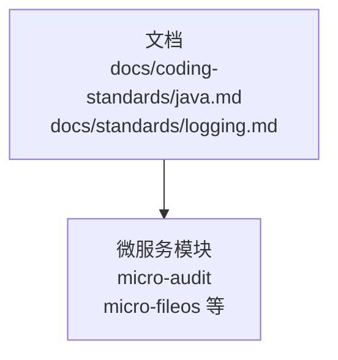
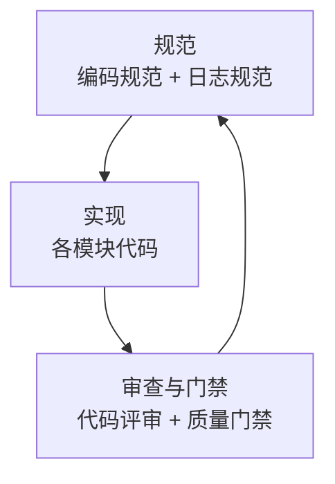
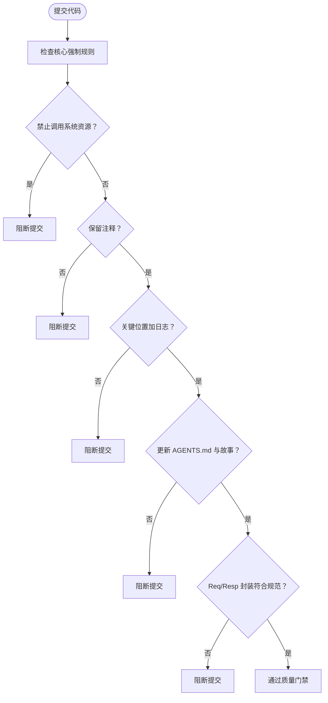
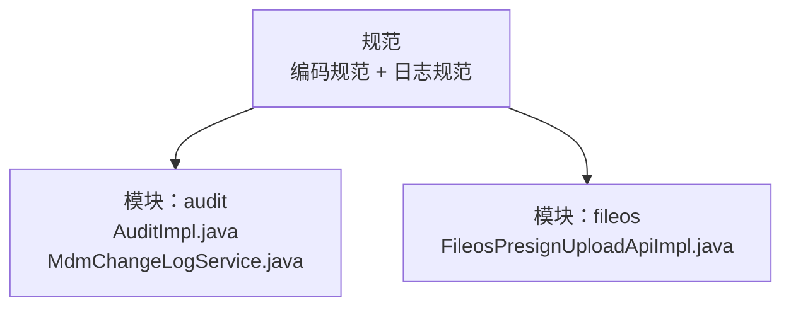

# 代码规范

<cite>
**本文档引用的文件**
- [Java 编码规范](file://docs/coding-standards/java.md)
- [日志规范](file://docs/standards/logging.md)
- [AuditImpl.java](file://micro-audit/src/main/java/com/wkclz/micro/audit/api/impl/AuditImpl.java)
- [MdmChangeLogService.java](file://micro-audit/src/main/java/com/wkclz/micro/audit/service/MdmChangeLogService.java)
- [FileosPresignUploadApiImpl.java](file://micro-fileos/src/main/java/com/wkclz/micro/fileos/api/impl/FileosPresignUploadApiImpl.java)
</cite>

## 目录
1. [简介](#简介)
2. [项目结构](#项目结构)
3. [核心组件](#核心组件)
4. [架构总览](#架构总览)
5. [详细组件分析](#详细组件分析)
6. [依赖分析](#依赖分析)
7. [性能考虑](#性能考虑)
8. [故障排查指南](#故障排查指南)
9. [结论](#结论)
10. [附录](#附录)

## 简介
本文件面向 sh-microapp 微服务框架，系统化整理并落地 Java 编码规范，覆盖命名约定、代码风格、注释规范、异常处理、集合使用、并发编程与日志规范；明确核心强制规则（禁止调用系统资源、保留注释、关键位置加日志等），并给出代码审查标准与质量门禁要求，帮助团队达成一致的工程实践。

## 项目结构
- 文档层：位于 docs 下的编码规范与日志规范文档，定义统一的规范与最佳实践。
- 代码层：各微服务模块（如 audit、fileos 等）中的实现体现规范落地情况，例如日志使用、参数封装、异常处理等。

**图示来源**
- [Java 编码规范](file://docs/coding-standards/java.md)
- [日志规范](file://docs/standards/logging.md)

**章节来源**
- [Java 编码规范](file://docs/coding-standards/java.md)
- [日志规范](file://docs/standards/logging.md)

## 核心组件
- 命名规范：类名/方法名/常量/包名/枚举/接口/抽象类/测试类的命名风格与语义要求。
- 代码风格：缩进、行宽、大括号、空行、import、修饰符顺序、注解分行等。
- 注释规范：Javadoc 要求、注释原则、保留注释、TODO 格式、复杂逻辑行内注释。
- 异常处理：异常体系、禁止空 catch、禁止用异常控制流程、异常信息上下文、全局异常处理、受检/非受检异常选择、try-with-resources。
- 集合使用：接口类型声明、空集合返回策略、容量初始化、遍历方式、Stream 优先、并发修改风险。
- 并发编程：优先使用并发包、共享变量保护、线程池、日期格式线程安全、锁粒度、死锁规避。
- 日志规范：框架选择、级别定义、禁止 System.out、循环日志、上下文、异常堆栈。
- 最佳实践：不可变对象、Optional 替代 null、枚举替代魔法数、Builder 模式、代码规模限制、组合优于继承。
- 核心强制规则：禁止调用系统资源、保留注释、关键位置加日志、更新 AGENTS.md 与故事、Req/Resp 封装。

**章节来源**
- [Java 编码规范](file://docs/coding-standards/java.md)

## 架构总览
下图展示“规范-实现-审查”的整体关系：规范由文档定义，代码实现体现规范，代码审查与质量门禁保障落地。

[此图为概念性示意，不对应具体源文件，故不提供图示来源]

## 详细组件分析

### 命名规范
- 类名/方法名/常量/变量/包名/枚举/接口/抽象类/测试类的命名风格与命名语义要求。
- 核心原则：每个命名都应具备业务含义，禁止使用无意义命名（如 a/b/c、tmp）。
- 反例与正例：以文档中的示例为准，强调命名的可读性与可维护性。

**章节来源**
- [Java 编码规范](file://docs/coding-standards/java.md)

### 代码风格
- 缩进与行宽：4 空格缩进，最大 120 字符；超长行在逻辑断点处换行并对齐。
- 大括号：左大括号不换行（K&R 风格）。
- 空行：方法/类成员/逻辑块之间保持 1 空行。
- import：禁止通配符 import；按 java/javax/第三方/项目内分组，组间空行。
- 修饰符顺序：public > protected > private > abstract > static > final > transient > volatile > synchronized > native > strictfp。
- 注解：每个注解独占一行。

**章节来源**
- [Java 编码规范](file://docs/coding-standards/java.md)

### 注释规范
- Javadoc：公共类与公共方法必须有 Javadoc；格式为一句话概述 + 详细描述 + @param/@return/@throws。
- 注释原则：注释说明“为什么”而非“做什么”，避免重复代码逻辑。
- 保留注释：禁止删除已有注释，除非相关代码块发生变更。
- TODO 格式：// TODO(作者): 描述。
- 复杂逻辑：必须添加行内注释。

**章节来源**
- [Java 编码规范](file://docs/coding-standards/java.md)

### 异常处理
- 异常体系：业务异常继承 BusinessException，系统异常继承 SystemException。
- 核心规则：
  - 禁止空 catch 块，至少记录日志。
  - 禁止用异常控制流程，异常用于异常情况。
  - 异常信息必须包含上下文。
  - 使用全局异常处理器统一响应。
  - 受检/非受检异常选择：受检异常用于可预期可恢复场景，非受检异常用于编程错误或系统级故障。
  - try-with-resources 管理资源。
- 实践参考：在各模块中对业务异常与系统异常的使用、日志记录与统一响应处理。

**章节来源**
- [Java 编码规范](file://docs/coding-standards/java.md)

### 集合使用
- 接口类型声明变量，避免暴露具体实现。
- 空集合返回策略：使用 Collections.emptyList()，避免返回 null。
- 容量初始化：集合大小已知时指定初始容量，减少扩容开销。
- 遍历方式：for-each 用于无索引场景，需要索引时使用 fori。
- Stream 优先：用于集合转换/过滤；lambda 超过 3 行时提取为方法引用。
- 并发修改：遍历时删除需使用 Iterator 或 Stream 过滤，避免 ConcurrentModificationException。

**章节来源**
- [Java 编码规范](file://docs/coding-standards/java.md)

### 并发编程
- 优先使用 java.util.concurrent 包提供的线程安全类。
- 共享变量保护：使用 volatile 或锁保护。
- 线程池：使用 ThreadPoolExecutor，禁止 new Thread()。
- 日期格式：SimpleDateFormat 线程不安全，使用 DateTimeFormatter。
- 锁粒度：最小化锁范围，避免不必要的阻塞。
- 死锁规避：固定加锁顺序，避免交叉等待。

**章节来源**
- [Java 编码规范](file://docs/coding-standards/java.md)

### 日志规范
- 框架选择：使用 SLF4J + Logback，禁止直接使用其他日志框架。
- 日志级别：ERROR/WARN/INFO/DEBUG；生产环境关闭 DEBUG。
- 禁止 System.out.println，统一使用 logger。
- 循环日志：避免在循环中频繁打日志（DEBUG 除外需条件判断）。
- 上下文：日志必须包含上下文信息；异常日志必须包含堆栈。
- 结构化日志：支持 JSON 格式，包含 traceId/spanId 等链路信息。

**章节来源**
- [Java 编码规范](file://docs/coding-standards/java.md)
- [日志规范](file://docs/standards/logging.md)

### 最佳实践
- 不可变对象优先：通过 final 字段与只读访问器构建不可变对象。
- Optional 替代 null：对外暴露方法返回 Optional，避免 NPE。
- 枚举替代魔法数：使用枚举表达状态与类型，提升可读性。
- Builder 模式：多参数构造时使用 Builder，提升可读性与扩展性。
- 代码规模限制：方法不超过 80 行、类不超过 500 行、参数不超过 5 个（超过则封装对象）。
- 组合优于继承：优先组合实现复用，降低耦合。

**章节来源**
- [Java 编码规范](file://docs/coding-standards/java.md)

### 核心强制规则
- 禁止调用系统资源：仅使用项目内代码资源，不得调用系统级命令或外部系统资源。
- 保留注释：不要移除已添加的注释，除非相关代码块已变动。
- 关键位置加日志：方法入口、业务分支判断点、异常捕获点、外部调用前后。
- 更新 AGENTS.md 与故事：任务完成后，必须更新 AGENTS.md 与相关故事文件。
- Req/Resp 封装：请求参数封装为 Req 对象，返回内容封装为 Resp 对象；单参数/单返回值可不封装。

**图示来源**
- [Java 编码规范](file://docs/coding-standards/java.md)

**章节来源**
- [Java 编码规范](file://docs/coding-standards/java.md)

## 依赖分析
- 规范与实现的耦合：各模块实现需遵循编码规范与日志规范；违反核心强制规则将被质量门禁拦截。
- 模块间依赖：各微服务模块独立实现，但共享同一套规范与日志框架，确保一致性。

**图示来源**
- [AuditImpl.java](file://micro-audit/src/main/java/com/wkclz/micro/audit/api/impl/AuditImpl.java)
- [MdmChangeLogService.java](file://micro-audit/src/main/java/com/wkclz/micro/audit/service/MdmChangeLogService.java)
- [FileosPresignUploadApiImpl.java](file://micro-fileos/src/main/java/com/wkclz/micro/fileos/api/impl/FileosPresignUploadApiImpl.java)

**章节来源**
- [AuditImpl.java](file://micro-audit/src/main/java/com/wkclz/micro/audit/api/impl/AuditImpl.java)
- [MdmChangeLogService.java](file://micro-audit/src/main/java/com/wkclz/micro/audit/service/MdmChangeLogService.java)
- [FileosPresignUploadApiImpl.java](file://micro-fileos/src/main/java/com/wkclz/micro/fileos/api/impl/FileosPresignUploadApiImpl.java)

## 性能考虑
- 集合与流式处理：优先使用 Stream API 进行集合转换/过滤，避免在 Stream 中写复杂逻辑；必要时提取为方法引用。
- 并发与锁：使用并发包线程安全类，最小化锁粒度，避免死锁；固定加锁顺序。
- IO 与资源：使用 try-with-resources 自动管理资源；避免在循环中频繁打日志（DEBUG 除外需条件判断）。
- 日期格式：使用线程安全的 DateTimeFormatter 替代 SimpleDateFormat。

**章节来源**
- [Java 编码规范](file://docs/coding-standards/java.md)

## 故障排查指南
- 日志级别与输出：生产环境关闭 DEBUG；避免过多日志输出；根据环境调整日志级别。
- 日志格式与结构化：统一格式，支持 JSON 结构化日志；包含 traceId/spanId 等链路信息。
- 异常处理：异常信息必须包含上下文；异常日志必须包含堆栈；全局异常处理器统一响应。
- 代码审查要点：重点检查核心强制规则、日志覆盖关键路径、注释完整性、集合与并发安全性、Stream 使用合理性。

**章节来源**
- [日志规范](file://docs/standards/logging.md)
- [Java 编码规范](file://docs/coding-standards/java.md)

## 结论
通过统一的编码规范与日志规范，并结合核心强制规则与质量门禁，sh-microapp 微服务框架能够在团队协作、可维护性与可观察性方面达到较高水准。建议持续在代码评审中强化规范执行，确保规范从文档走向实践并固化为团队共识。

## 附录
- 代码审查标准与质量门禁
  - 必须通过的核心强制规则：禁止调用系统资源、保留注释、关键位置加日志、更新 AGENTS.md 与故事、Req/Resp 封装。
  - 规范符合性：命名、风格、注释、异常、集合、并发、日志等维度的检查清单。
  - 可观察性：日志级别、上下文、异常堆栈、结构化日志的落实情况。
  - 回归与演进：定期回顾规范执行效果，结合模块实现反馈优化规范条目。

**章节来源**
- [Java 编码规范](file://docs/coding-standards/java.md)
- [日志规范](file://docs/standards/logging.md)