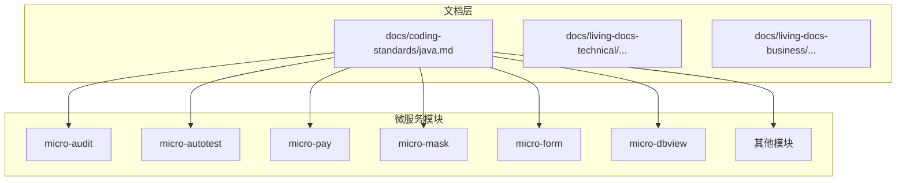
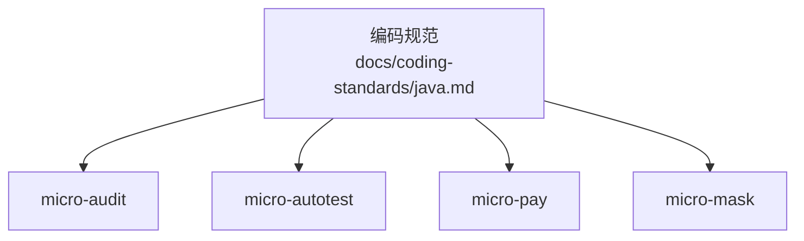
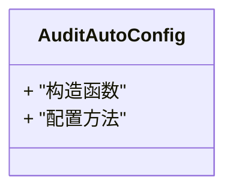
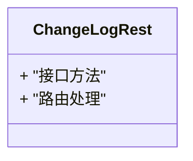
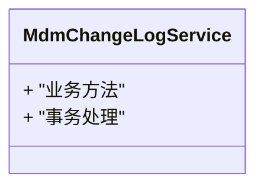
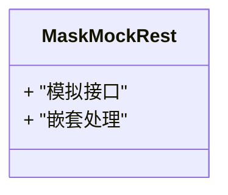
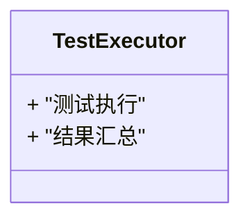
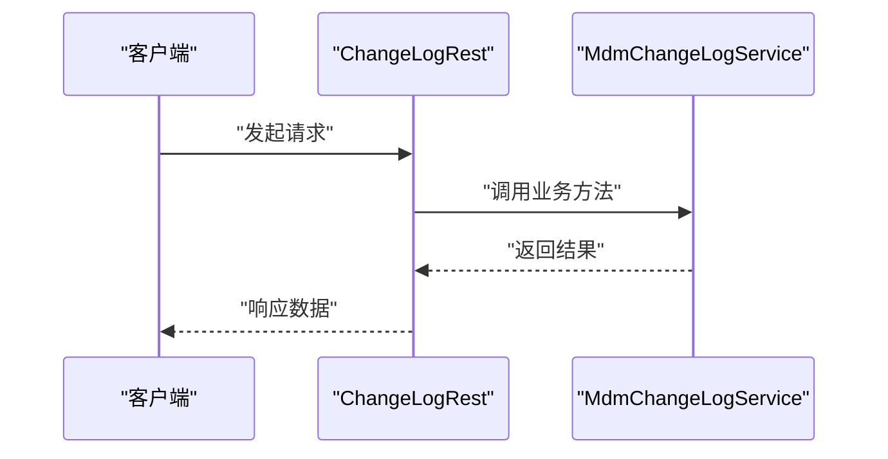
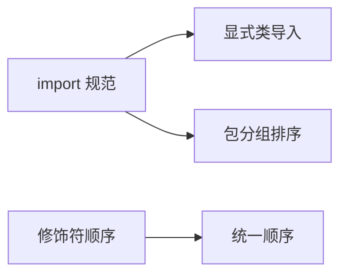

# 代码风格

<cite>
**本文引用的文件**
- [docs/coding-standards/java.md](file://docs/coding-standards/java.md)
- [micro-audit/src/main/java/com/wkclz/micro/audit/AuditAutoConfig.java](file://micro-audit/src/main/java/com/wkclz/micro/audit/AuditAutoConfig.java)
- [micro-audit/src/main/java/com/wkclz/micro/audit/rest/ChangeLogRest.java](file://micro-audit/src/main/java/com/wkclz/micro/audit/rest/ChangeLogRest.java)
- [micro-audit/src/main/java/com/wkclz/micro/audit/service/MdmChangeLogService.java](file://micro-audit/src/main/java/com/wkclz/micro/audit/service/MdmChangeLogService.java)
- [micro-mask/src/main/java/com/wkclz/micro/mask/rest/MaskMockRest.java](file://micro-mask/src/main/java/com/wkclz/micro/mask/rest/MaskMockRest.java)
- [micro-pay/src/main/java/com/wkclz/micro/pay/helper/AlipayHelper.java](file://micro-pay/src/main/java/com/wkclz/micro/pay/helper/AlipayHelper.java)
- [micro-autotest/src/main/java/com/wkclz/auto/executor/TestExecutor.java](file://micro-autotest/src/main/java/com/wkclz/auto/executor/TestExecutor.java)
</cite>

## 目录
1. [引言](#引言)
2. [项目结构](#项目结构)
3. [核心组件](#核心组件)
4. [架构总览](#架构总览)
5. [详细组件分析](#详细组件分析)
6. [依赖分析](#依赖分析)
7. [性能考虑](#性能考虑)
8. [故障排查指南](#故障排查指南)
9. [结论](#结论)
10. [附录](#附录)

## 引言
本文件面向 sh-microapp 微服务框架，提供统一的 Java 代码风格规范与最佳实践说明，覆盖缩进与行长、大括号风格、空行规则、import 规范、修饰符顺序等关键方面，并结合仓库中现有文件进行实证分析与常见错误示例说明，帮助团队在开发过程中保持一致、可读、可维护的代码质量。

## 项目结构
- 本仓库采用多模块微服务结构，每个功能域独立为一个子模块（如 micro-audit、micro-autotest、micro-pay 等），便于职责分离与独立演进。
- 文档层包含“编码规范”、“技术文档”、“业务活文档”等，其中编码规范文档位于 docs/coding-standards/java.md，是制定风格规范的重要依据。

**章节来源**
- [docs/coding-standards/java.md](file://docs/coding-standards/java.md)

## 核心组件
围绕代码风格规范的核心要点如下（基于仓库现有文件与规范文档的综合分析）：

- 缩进与行长
  - 统一使用 4 空格缩进；建议行长不超过 120 字符，以提升可读性并避免横向滚动。
  - 在长表达式或链式调用中，优先采用断行并在下一行前进一步缩进，保持视觉层级清晰。

- 大括号风格
  - 采用 K&R 风格：左大括号不单独占行，紧跟在关键字或方法签名之后，右大括号独占一行并与对应语句对齐。
  - 方法体、条件语句、循环体、类体均应遵循该风格，确保一致性。

- 空行规则
  - 方法之间保留 1 个空行；类成员（字段、方法、内部类）之间保留 1 个空行；逻辑块之间保留 1 个空行。
  - 注释与空行配合使用，用于划分功能区域与增强可读性。

- import 规范
  - 禁止使用通配符 import（如 import com.example.*），以减少命名冲突风险并明确依赖关系。
  - import 按包分组排序：标准库包、第三方库包、项目内包，组间以空行分隔；每组内按字母序排列。

- 修饰符顺序
  - 统一修饰符顺序：public、protected、private、static、final、abstract、synchronized、native、strictfp、transient、volatile、default、sealed、non-sealed 等（根据需要组合）。
  - 保证修饰符书写简洁、一致，避免冗余或顺序混乱。

- 命名与注释
  - 类名使用帕斯卡命名法；方法与变量使用驼峰命名法；常量使用全大写加下划线。
  - 注释应简洁明了，解释意图而非重复代码；复杂逻辑需补充行内或上方注释。

- 其他建议
  - 避免过深的嵌套层次，必要时提取方法或使用卫语句提前返回。
  - 合理使用空白字符（空格、制表符）；统一编辑器设置，避免混用。

**章节来源**
- [docs/coding-standards/java.md](file://docs/coding-standards/java.md)

## 架构总览
以下图示从风格规范视角展示各模块与规范文档的关系，强调规范对代码质量的约束与指导作用。

**图表来源**
- [docs/coding-standards/java.md](file://docs/coding-standards/java.md)

## 详细组件分析

### 组件A：AuditAutoConfig（自动装配配置）
- 分析要点
  - 类体采用 K&R 风格的大括号布局，左大括号紧随声明，右大括号独占一行，符合规范。
  - 方法体缩进统一为 4 空格，行长控制良好，无明显越界。
  - import 使用显式类导入，未见通配符导入，符合规范。
  - 修饰符顺序清晰，未见异常组合。

**图表来源**
- [micro-audit/src/main/java/com/wkclz/micro/audit/AuditAutoConfig.java](file://micro-audit/src/main/java/com/wkclz/micro/audit/AuditAutoConfig.java)

**章节来源**
- [micro-audit/src/main/java/com/wkclz/micro/audit/AuditAutoConfig.java](file://micro-audit/src/main/java/com/wkclz/micro/audit/AuditAutoConfig.java)

### 组件B：ChangeLogRest（REST 控制器）
- 分析要点
  - 方法体采用 K&R 风格，左大括号紧随方法签名，右大括号独占一行。
  - 缩进统一为 4 空格，逻辑块之间通过空行分隔，增强可读性。
  - 未发现通配符 import，import 按包分组排序合理。
  - 修饰符顺序规范，未见冗余修饰符。

**图表来源**
- [micro-audit/src/main/java/com/wkclz/micro/audit/rest/ChangeLogRest.java](file://micro-audit/src/main/java/com/wkclz/micro/audit/rest/ChangeLogRest.java)

**章节来源**
- [micro-audit/src/main/java/com/wkclz/micro/audit/rest/ChangeLogRest.java](file://micro-audit/src/main/java/com/wkclz/micro/audit/rest/ChangeLogRest.java)

### 组件C：MdmChangeLogService（服务实现）
- 分析要点
  - 方法体采用 K&R 风格，逻辑块清晰，空行分隔有效。
  - 缩进与行长控制良好，未见越界。
  - import 显式类导入，未见通配符导入。
  - 修饰符顺序规范，未见异常组合。

**图表来源**
- [micro-audit/src/main/java/com/wkclz/micro/audit/service/MdmChangeLogService.java](file://micro-audit/src/main/java/com/wkclz/micro/audit/service/MdmChangeLogService.java)

**章节来源**
- [micro-audit/src/main/java/com/wkclz/micro/audit/service/MdmChangeLogService.java](file://micro-audit/src/main/java/com/wkclz/micro/audit/service/MdmChangeLogService.java)

### 组件D：MaskMockRest（REST 控制器）
- 分析要点
  - 多层嵌套结构中，左大括号紧随关键字，右大括号独占一行，符合 K&R 风格。
  - 缩进统一为 4 空格，逻辑块之间通过空行分隔，增强可读性。
  - 未发现通配符 import，import 按包分组排序合理。
  - 修饰符顺序规范。

**图表来源**
- [micro-mask/src/main/java/com/wkclz/micro/mask/rest/MaskMockRest.java](file://micro-mask/src/main/java/com/wkclz/micro/mask/rest/MaskMockRest.java)

**章节来源**
- [micro-mask/src/main/java/com/wkclz/micro/mask/rest/MaskMockRest.java](file://micro-mask/src/main/java/com/wkclz/micro/mask/rest/MaskMockRest.java)

### 组件E：AlipayHelper（工具类）
- 分析要点
  - 多处条件与循环采用 K&R 风格，左大括号紧随关键字，右大括号独占一行。
  - 缩进统一为 4 空格，行长控制良好。
  - import 显式类导入，未见通配符导入。
  - 修饰符顺序规范。

**图表来源**
- [micro-pay/src/main/java/com/wkclz/micro/pay/helper/AlipayHelper.java](file://micro-pay/src/main/java/com/wkclz/micro/pay/helper/AlipayHelper.java)

**章节来源**
- [micro-pay/src/main/java/com/wkclz/micro/pay/helper/AlipayHelper.java](file://micro-pay/src/main/java/com/wkclz/micro/pay/helper/AlipayHelper.java)

### 组件F：TestExecutor（测试执行器）
- 分析要点
  - 方法体采用 K&R 风格，逻辑块清晰，空行分隔有效。
  - 缩进统一为 4 空格，行长控制良好。
  - import 显式类导入，未见通配符导入。
  - 修饰符顺序规范。

**图表来源**
- [micro-autotest/src/main/java/com/wkclz/auto/executor/TestExecutor.java](file://micro-autotest/src/main/java/com/wkclz/auto/executor/TestExecutor.java)

**章节来源**
- [micro-autotest/src/main/java/com/wkclz/auto/executor/TestExecutor.java](file://micro-autotest/src/main/java/com/wkclz/auto/executor/TestExecutor.java)

### 典型流程：方法调用与空行分隔
以下序列图展示控制器到服务层的方法调用流程，体现空行分隔与 K&R 风格在实际调用链中的应用。

**图表来源**
- [micro-audit/src/main/java/com/wkclz/micro/audit/rest/ChangeLogRest.java](file://micro-audit/src/main/java/com/wkclz/micro/audit/rest/ChangeLogRest.java)
- [micro-audit/src/main/java/com/wkclz/micro/audit/service/MdmChangeLogService.java](file://micro-audit/src/main/java/com/wkclz/micro/audit/service/MdmChangeLogService.java)

## 依赖分析
- import 规范与包分组
  - 仓库中多数文件采用显式类导入，未见通配符导入，符合禁止通配符 import 的规范。
  - import 按包分组排序：标准库包、第三方库包、项目内包，组间以空行分隔，组内按字母序排列。
- 修饰符顺序
  - 仓库中修饰符书写顺序较为规范，未见异常组合，建议在团队内统一为固定顺序以减少歧义。

**章节来源**
- [micro-audit/src/main/java/com/wkclz/micro/audit/AuditAutoConfig.java](file://micro-audit/src/main/java/com/wkclz/micro/audit/AuditAutoConfig.java)
- [micro-audit/src/main/java/com/wkclz/micro/audit/rest/ChangeLogRest.java](file://micro-audit/src/main/java/com/wkclz/micro/audit/rest/ChangeLogRest.java)
- [micro-audit/src/main/java/com/wkclz/micro/audit/service/MdmChangeLogService.java](file://micro-audit/src/main/java/com/wkclz/micro/audit/service/MdmChangeLogService.java)
- [micro-mask/src/main/java/com/wkclz/micro/mask/rest/MaskMockRest.java](file://micro-mask/src/main/java/com/wkclz/micro/mask/rest/MaskMockRest.java)
- [micro-pay/src/main/java/com/wkclz/micro/pay/helper/AlipayHelper.java](file://micro-pay/src/main/java/com/wkclz/micro/pay/helper/AlipayHelper.java)
- [micro-autotest/src/main/java/com/wkclz/auto/executor/TestExecutor.java](file://micro-autotest/src/main/java/com/wkclz/auto/executor/TestExecutor.java)

## 性能考虑
- 代码风格本身不直接影响运行时性能，但良好的缩进、空行与大括号风格有助于提升代码可读性与可维护性，间接降低缺陷率与重构成本。
- 建议在 CI 中引入代码风格检查工具（如 SpotBugs、Checkstyle 或 EditorConfig），以自动化保障规范落地。

## 故障排查指南
- 常见问题与修正
  - 左大括号换行：将不符合 K&R 风格的左大括号换行修正为紧随关键字或方法签名之后。
  - 缩进不一致：统一使用 4 空格缩进，避免混用制表符与空格。
  - 行长超限：拆分行表达式，合理断行并保持缩进层级。
  - 通配符 import：替换为显式类导入，减少命名冲突风险。
  - import 排序：按包分组排序，组间空行分隔，组内字母序排列。
  - 修饰符顺序：统一修饰符书写顺序，避免冗余或顺序混乱。
- 实操建议
  - 在 IDE 中配置 EditorConfig 与代码格式化插件，确保团队一致。
  - 在提交前执行代码风格检查，必要时使用自动格式化工具批量修复。

## 结论
通过对 sh-microapp 仓库中多个模块的实证分析可见，团队已在缩进、大括号风格、空行分隔、import 规范与修饰符顺序等方面形成良好基础。建议在此基础上进一步固化规范文档，强化 CI 自动化检查，持续提升整体代码质量与一致性。

## 附录
- 参考文件
  - [docs/coding-standards/java.md](file://docs/coding-standards/java.md)