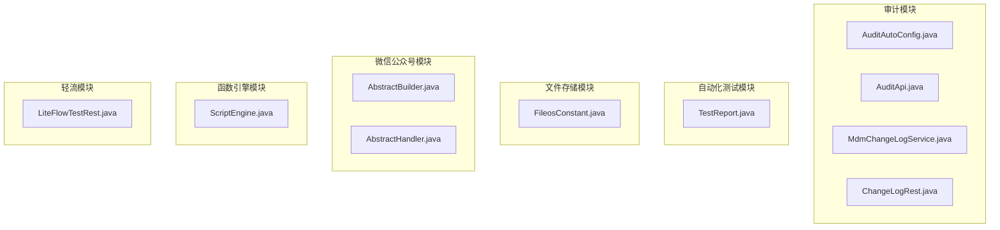
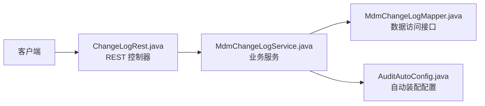
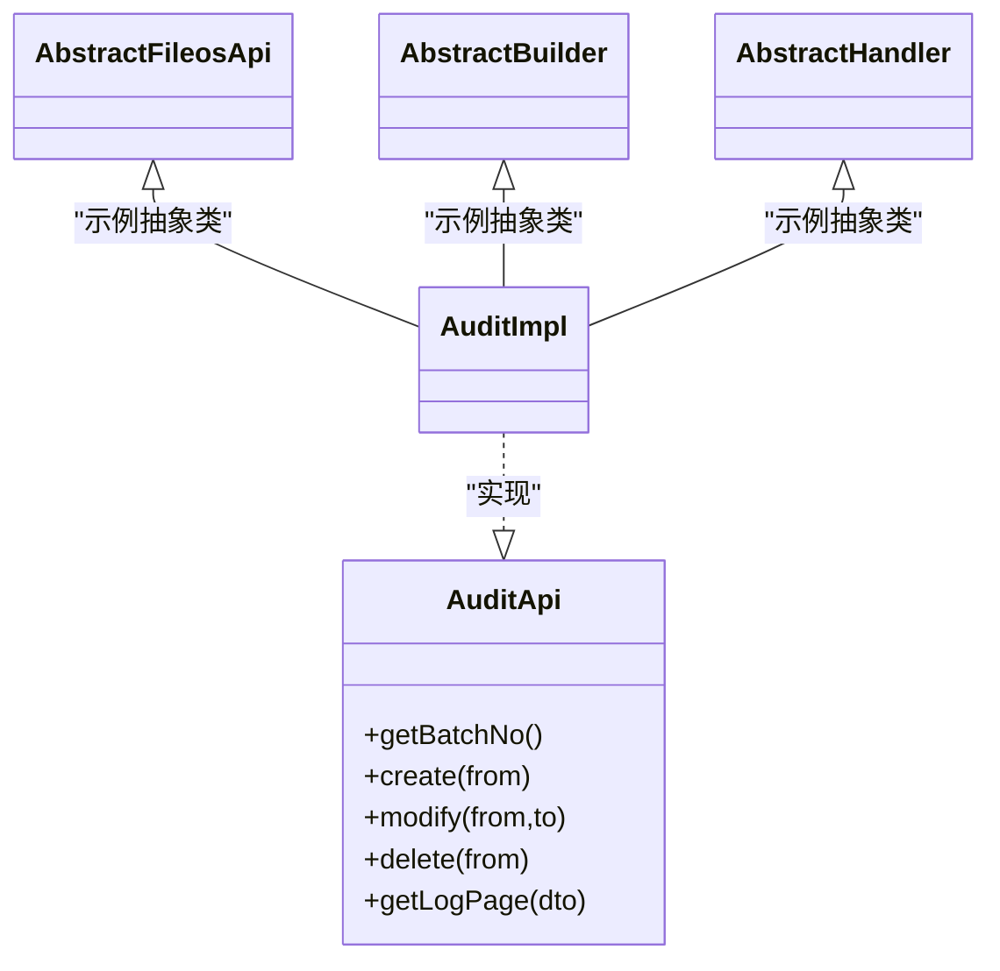
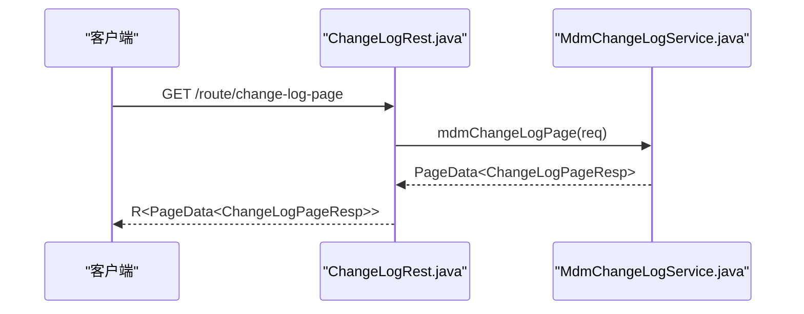
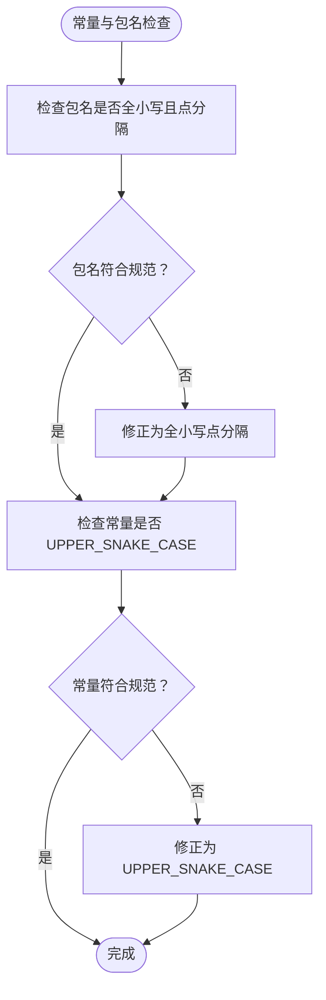
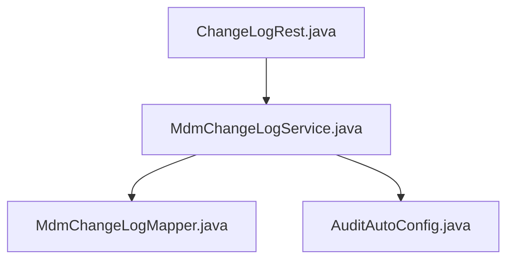

# 命名规范

<cite>
**本文档引用的文件**
- [Java 编码规范](file://docs/coding-standards/java.md)
- [AuditAutoConfig.java](file://micro-audit/src/main/java/com/wkclz/micro/audit/AuditAutoConfig.java)
- [AuditApi.java](file://micro-audit/src/main/java/com/wkclz/micro/audit/api/AuditApi.java)
- [MdmChangeLogService.java](file://micro-audit/src/main/java/com/wkclz/micro/audit/service/MdmChangeLogService.java)
- [ChangeLogRest.java](file://micro-audit/src/main/java/com/wkclz/micro/audit/rest/ChangeLogRest.java)
- [TestReport.java](file://micro-autotest/src/main/java/com/wkclz/auto/bean/TestReport.java)
- [FileosConstant.java](file://micro-fileos/src/main/java/com/wkclz/micro/fileos/bean/FileosConstant.java)
- [AbstractFileosApi.java](file://micro-fileos/src/main/java/com/wkclz/micro/fileos/api/impl/AbstractFileosApi.java)
- [AbstractBuilder.java](file://micro-wxmp/src/main/java/com/wkclz/micro/wxmp/builder/AbstractBuilder.java)
- [AbstractHandler.java](file://micro-wxmp/src/main/java/com/wkclz/micro/wxmp/handler/AbstractHandler.java)
- [ScriptEngine.java](file://micro-fun/src/main/java/com/wkclz/micro/fun/engine/ScriptEngine.java)
- [LiteFlowTestRest.java](file://micro-liteflow/src/main/java/com/wkclz/micro/liteflow/demo/LiteFlowTestRest.java)
</cite>

## 目录
1. [简介](#简介)
2. [项目结构](#项目结构)
3. [核心组件](#核心组件)
4. [架构总览](#架构总览)
5. [详细组件分析](#详细组件分析)
6. [依赖分析](#依赖分析)
7. [性能考虑](#性能考虑)
8. [故障排查指南](#故障排查指南)
9. [结论](#结论)
10. [附录](#附录)

## 简介
本文件基于 sh-microapp 微服务框架的现有代码与规范文档，系统化整理 Java 命名规范，明确类名、方法名、常量、变量、包名、枚举类名、枚举值、接口、抽象类与测试类的命名约定，并结合仓库中的真实示例进行正反对比，帮助团队统一风格、提升可读性与可维护性。

## 项目结构
- 项目采用多模块微服务结构，每个功能域一个子模块（如 audit、autotest、fileos 等），模块内部遵循统一的包结构与命名约定。
- 命名规范由顶层规范文档统一约束，模块内的具体实现需严格遵循。

图表来源
- [AuditAutoConfig.java:1-11](file://micro-audit/src/main/java/com/wkclz/micro/audit/AuditAutoConfig.java#L1-L11)
- [AuditApi.java:1-31](file://micro-audit/src/main/java/com/wkclz/micro/audit/api/AuditApi.java#L1-L31)
- [MdmChangeLogService.java:1-65](file://micro-audit/src/main/java/com/wkclz/micro/audit/service/MdmChangeLogService.java#L1-L65)
- [ChangeLogRest.java:1-68](file://micro-audit/src/main/java/com/wkclz/micro/audit/rest/ChangeLogRest.java#L1-L68)
- [TestReport.java:1-19](file://micro-autotest/src/main/java/com/wkclz/auto/bean/TestReport.java#L1-L19)
- [FileosConstant.java](file://micro-fileos/src/main/java/com/wkclz/micro/fileos/bean/FileosConstant.java)
- [AbstractBuilder.java:1-11](file://micro-wxmp/src/main/java/com/wkclz/micro/wxmp/builder/AbstractBuilder.java#L1-L11)
- [AbstractHandler.java:1-9](file://micro-wxmp/src/main/java/com/wkclz/micro/wxmp/handler/AbstractHandler.java#L1-L9)
- [ScriptEngine.java:1-12](file://micro-fun/src/main/java/com/wkclz/micro/fun/engine/ScriptEngine.java#L1-L12)
- [LiteFlowTestRest.java:1-12](file://micro-liteflow/src/main/java/com/wkclz/micro/liteflow/demo/LiteFlowTestRest.java#L1-L12)

章节来源
- [Java 编码规范:1-707](file://docs/coding-standards/java.md#L1-L707)

## 核心组件
- 类名：采用 PascalCase（大驼峰），体现业务实体或服务职责，例如 MdmChangeLogService、ChangeLogRest。
- 方法名：采用 camelCase（小驼峰），表达动作或行为，例如 getChangeLogPage、mdmChangeLogPage。
- 常量：采用 UPPER_SNAKE_CASE（全大写下划线），表示稳定不变的配置或标识，例如在 FileosConstant.java 中的常量定义。
- 变量：采用 camelCase，表达上下文中的具体对象或状态，例如 startTime、endTime。
- 包名：全小写，以点分隔，体现模块与层级，例如 com.wkclz.micro.audit。
- 枚举类名：采用 PascalCase，例如在各模块中出现的状态枚举类型。
- 枚举值：采用 UPPER_SNAKE_CASE，例如 ACTIVE、PAID 等。
- 接口：不加 I 前缀，例如 AuditApi；实现类以 Impl 结尾，例如 AuditImpl。
- 抽象类：加 Abstract 前缀，例如 AbstractFileosApi、AbstractBuilder、AbstractHandler。
- 测试类：被测类名 + Test，例如 UserServiceTest（示例，非本仓库现有类）。

章节来源
- [Java 编码规范:3-18](file://docs/coding-standards/java.md#L3-L18)
- [AuditAutoConfig.java:1-11](file://micro-audit/src/main/java/com/wkclz/micro/audit/AuditAutoConfig.java#L1-L11)
- [AuditApi.java:1-31](file://micro-audit/src/main/java/com/wkclz/micro/audit/api/AuditApi.java#L1-L31)
- [MdmChangeLogService.java:1-65](file://micro-audit/src/main/java/com/wkclz/micro/audit/service/MdmChangeLogService.java#L1-L65)
- [ChangeLogRest.java:1-68](file://micro-audit/src/main/java/com/wkclz/micro/audit/rest/ChangeLogRest.java#L1-L68)
- [TestReport.java:1-19](file://micro-autotest/src/main/java/com/wkclz/auto/bean/TestReport.java#L1-L19)
- [FileosConstant.java](file://micro-fileos/src/main/java/com/wkclz/micro/fileos/bean/FileosConstant.java)
- [AbstractFileosApi.java:1-22](file://micro-fileos/src/main/java/com/wkclz/micro/fileos/api/impl/AbstractFileosApi.java#L1-L22)
- [AbstractBuilder.java:1-11](file://micro-wxmp/src/main/java/com/wkclz/micro/wxmp/builder/AbstractBuilder.java#L1-L11)
- [AbstractHandler.java:1-9](file://micro-wxmp/src/main/java/com/wkclz/micro/wxmp/handler/AbstractHandler.java#L1-L9)
- [ScriptEngine.java:1-12](file://micro-fun/src/main/java/com/wkclz/micro/fun/engine/ScriptEngine.java#L1-L12)

## 架构总览
下图展示了审计模块中“表现层-服务层-数据访问层”的命名与职责映射关系，体现各层命名的一致性与业务含义。

图表来源
- [ChangeLogRest.java:1-68](file://micro-audit/src/main/java/com/wkclz/micro/audit/rest/ChangeLogRest.java#L1-L68)
- [MdmChangeLogService.java:1-65](file://micro-audit/src/main/java/com/wkclz/micro/audit/service/MdmChangeLogService.java#L1-L65)
- [AuditAutoConfig.java:1-11](file://micro-audit/src/main/java/com/wkclz/micro/audit/AuditAutoConfig.java#L1-L11)

## 详细组件分析

### 类与接口命名
- 接口：不加 I 前缀，语义清晰表达能力边界，例如 AuditApi。
- 实现类：以 Impl 结尾，例如 AuditImpl。
- 抽象类：加 Abstract 前缀，例如 AbstractFileosApi、AbstractBuilder、AbstractHandler。

图表来源
- [AuditApi.java:1-31](file://micro-audit/src/main/java/com/wkclz/micro/audit/api/AuditApi.java#L1-L31)
- [AuditImpl.java:1-200](file://micro-audit/src/main/java/com/wkclz/micro/audit/api/impl/AuditImpl.java#L1-L200)
- [AbstractFileosApi.java:1-22](file://micro-fileos/src/main/java/com/wkclz/micro/fileos/api/impl/AbstractFileosApi.java#L1-L22)
- [AbstractBuilder.java:1-11](file://micro-wxmp/src/main/java/com/wkclz/micro/wxmp/builder/AbstractBuilder.java#L1-L11)
- [AbstractHandler.java:1-9](file://micro-wxmp/src/main/java/com/wkclz/micro/wxmp/handler/AbstractHandler.java#L1-L9)

章节来源
- [Java 编码规范:14-16](file://docs/coding-standards/java.md#L14-L16)
- [AuditApi.java:1-31](file://micro-audit/src/main/java/com/wkclz/micro/audit/api/AuditApi.java#L1-L31)
- [AbstractFileosApi.java:1-22](file://micro-fileos/src/main/java/com/wkclz/micro/fileos/api/impl/AbstractFileosApi.java#L1-L22)
- [AbstractBuilder.java:1-11](file://micro-wxmp/src/main/java/com/wkclz/micro/wxmp/builder/AbstractBuilder.java#L1-L11)
- [AbstractHandler.java:1-9](file://micro-wxmp/src/main/java/com/wkclz/micro/wxmp/handler/AbstractHandler.java#L1-L9)

### 方法与变量命名
- 方法名：采用 camelCase，表达明确的动作，例如 mdmChangeLogPage、getChangeLogPage。
- 变量：采用 camelCase，例如 startTime、endTime、totalCostTimeMs。

图表来源
- [ChangeLogRest.java:1-68](file://micro-audit/src/main/java/com/wkclz/micro/audit/rest/ChangeLogRest.java#L1-L68)
- [MdmChangeLogService.java:1-65](file://micro-audit/src/main/java/com/wkclz/micro/audit/service/MdmChangeLogService.java#L1-L65)

章节来源
- [ChangeLogRest.java:1-68](file://micro-audit/src/main/java/com/wkclz/micro/audit/rest/ChangeLogRest.java#L1-L68)
- [MdmChangeLogService.java:1-65](file://micro-audit/src/main/java/com/wkclz/micro/audit/service/MdmChangeLogService.java#L1-L65)
- [TestReport.java:1-19](file://micro-autotest/src/main/java/com/wkclz/auto/bean/TestReport.java#L1-L19)

### 常量与包名
- 常量：采用 UPPER_SNAKE_CASE，例如在 FileosConstant.java 中的常量定义。
- 包名：全小写，以点分隔，体现模块与层级，例如 com.wkclz.micro.audit。

图表来源
- [FileosConstant.java](file://micro-fileos/src/main/java/com/wkclz/micro/fileos/bean/FileosConstant.java)
- [AuditAutoConfig.java:1-11](file://micro-audit/src/main/java/com/wkclz/micro/audit/AuditAutoConfig.java#L1-L11)

章节来源
- [Java 编码规范:9-11](file://docs/coding-standards/java.md#L9-L11)
- [FileosConstant.java](file://micro-fileos/src/main/java/com/wkclz/micro/fileos/bean/FileosConstant.java)
- [AuditAutoConfig.java:1-11](file://micro-audit/src/main/java/com/wkclz/micro/audit/AuditAutoConfig.java#L1-L11)

### 枚举与测试类命名
- 枚举类名：采用 PascalCase，枚举值采用 UPPER_SNAKE_CASE。
- 测试类：被测类名 + Test，例如 UserServiceTest（示例，非本仓库现有类）。

章节来源
- [Java 编码规范:12-16](file://docs/coding-standards/java.md#L12-L16)

## 依赖分析
- 层内依赖：表现层依赖服务层，服务层依赖数据访问层，配置类负责扫描与注册。
- 层间依赖：接口与实现分离，抽象类提供通用能力，避免重复实现。

图表来源
- [ChangeLogRest.java:1-68](file://micro-audit/src/main/java/com/wkclz/micro/audit/rest/ChangeLogRest.java#L1-L68)
- [MdmChangeLogService.java:1-65](file://micro-audit/src/main/java/com/wkclz/micro/audit/service/MdmChangeLogService.java#L1-L65)
- [AuditAutoConfig.java:1-11](file://micro-audit/src/main/java/com/wkclz/micro/audit/AuditAutoConfig.java#L1-L11)

章节来源
- [ChangeLogRest.java:1-68](file://micro-audit/src/main/java/com/wkclz/micro/audit/rest/ChangeLogRest.java#L1-L68)
- [MdmChangeLogService.java:1-65](file://micro-audit/src/main/java/com/wkclz/micro/audit/service/MdmChangeLogService.java#L1-L65)
- [AuditAutoConfig.java:1-11](file://micro-audit/src/main/java/com/wkclz/micro/audit/AuditAutoConfig.java#L1-L11)

## 性能考虑
- 命名本身不影响运行时性能，但良好的命名能减少理解成本，降低误用风险，间接提升开发效率与稳定性。
- 避免使用无业务含义的临时变量名（如 a、b、c、tmp），防止逻辑混淆与维护困难。

## 故障排查指南
- 命名违规常见问题
  - 包名大小写不一致或使用下划线/横线
  - 常量未使用 UPPER_SNAKE_CASE
  - 方法/变量使用无业务含义的缩写
  - 接口加 I 前缀或抽象类不加 Abstract 前缀
- 排查步骤
  - 检查包路径是否全小写且点分隔
  - 检查常量是否为全大写+下划线
  - 检查方法/变量是否语义明确、避免临时命名
  - 检查接口与抽象类命名前缀是否符合规范

章节来源
- [Java 编码规范:18-30](file://docs/coding-standards/java.md#L18-L30)

## 结论
本规范以仓库现有实现为基础，明确了各类命名的风格与边界，并通过具体文件示例验证了规范的实际落地。团队在后续开发中应严格遵循，确保命名一致性与业务可读性。

## 附录
- 正例与反例对照（基于规范）
  - 反例：a、tmp、list1 等无业务含义的命名
  - 正例：retryCount、userName、pendingOrderIds 等具备明确业务语义的命名
- 命名速查
  - 类名：PascalCase，如 MdmChangeLogService
  - 方法名：camelCase，如 getChangeLogPage
  - 常量：UPPER_SNAKE_CASE，如 DEFAULT_PAGE_SIZE
  - 变量：camelCase，如 startTime
  - 包名：全小写点分隔，如 com.wkclz.micro.audit
  - 枚举类名：PascalCase，枚举值：UPPER_SNAKE_CASE
  - 接口：不加 I 前缀，如 AuditApi
  - 抽象类：加 Abstract 前缀，如 AbstractFileosApi
  - 测试类：被测类名 + Test，如 UserServiceTest

章节来源
- [Java 编码规范:3-18](file://docs/coding-standards/java.md#L3-L18)
- [TestReport.java:1-19](file://micro-autotest/src/main/java/com/wkclz/auto/bean/TestReport.java#L1-L19)