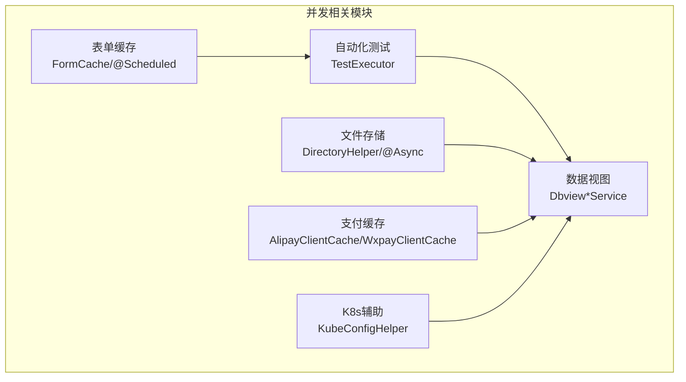
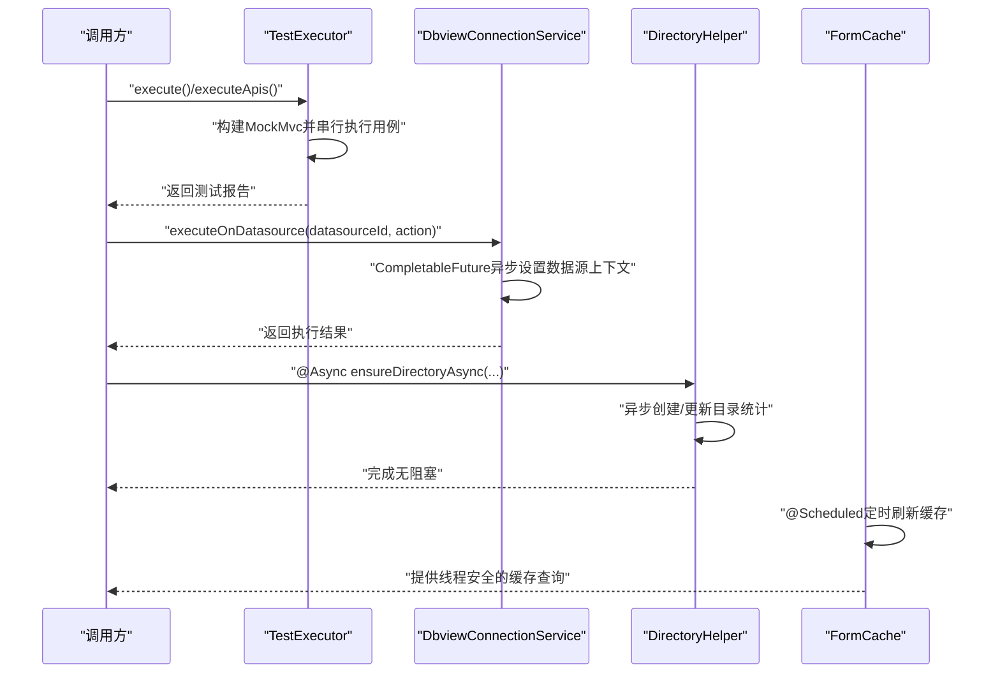
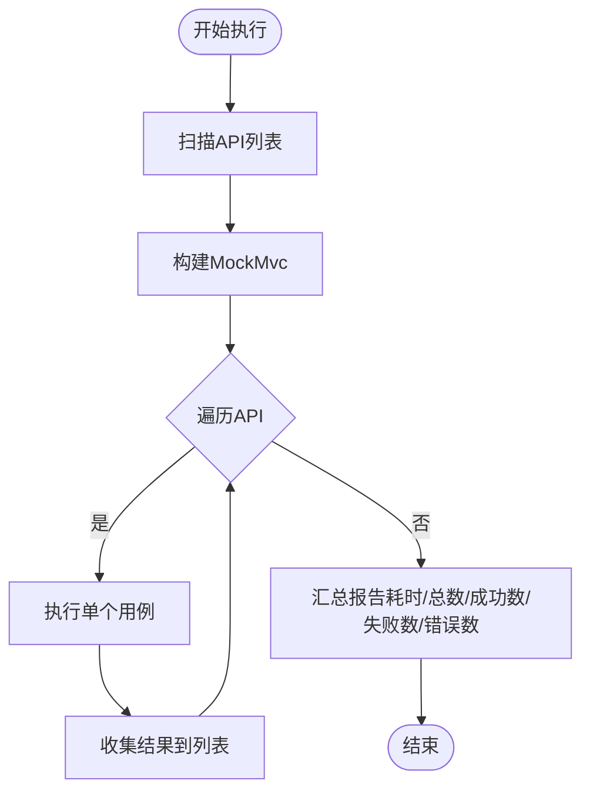
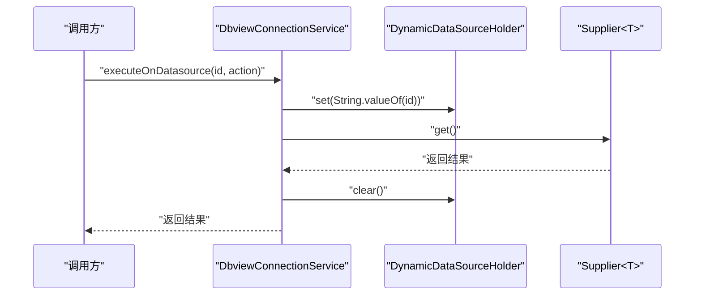
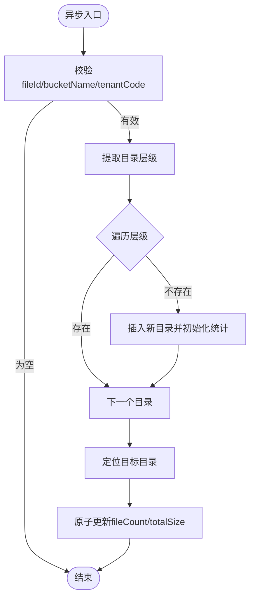
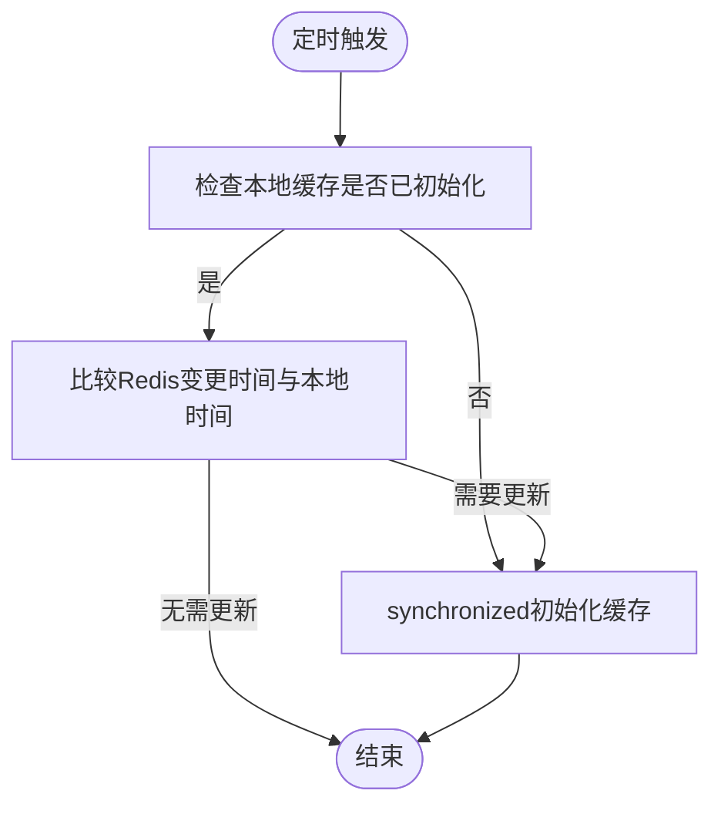
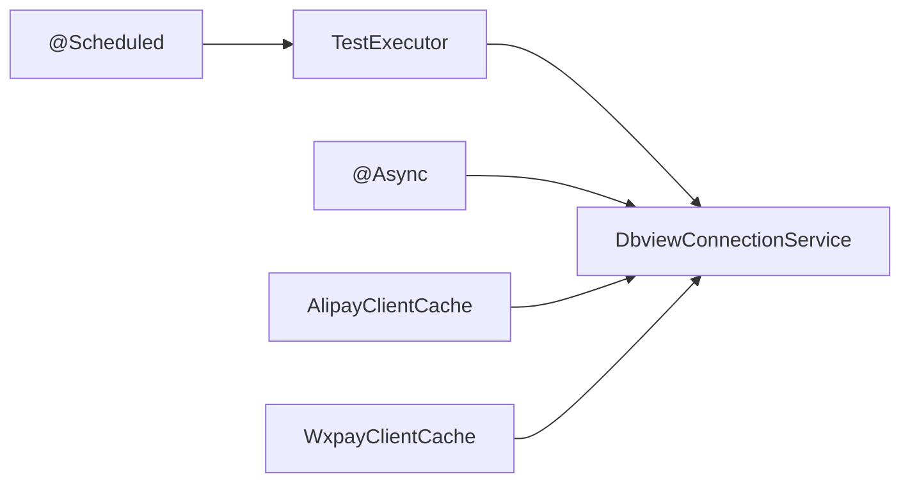

# 并发编程

<cite>
**本文引用的文件**
- [TestExecutor.java](file://micro-autotest/src/main/java/com/wkclz/auto/executor/TestExecutor.java)
- [DbviewConnectionService.java](file://micro-dbview/src/main/java/com/wkclz/micro/dbview/service/DbviewConnectionService.java)
- [DirectoryHelper.java](file://micro-fileos/src/main/java/com/wkclz/micro/fileos/helper/DirectoryHelper.java)
- [FormCache.java](file://micro-form/src/main/java/com/wkclz/micro/form/cache/FormCache.java)
- [KubeConfigHelper.java](file://micro-k8s/src/main/java/com/wkclz/micro/k8s/helper/KubeConfigHelper.java)
- [AlipayClientCache.java](file://micro-pay/src/main/java/com/wkclz/micro/pay/cache/AlipayClientCache.java)
- [WxpayClientCache.java](file://micro-pay/src/main/java/com/wkclz/micro/pay/cache/WxpayClientCache.java)
- [AutoTestRest.java](file://micro-autotest/src/main/java/com/wkclz/auto/rest/AutoTestRest.java)
- [DbviewDdlService.java](file://micro-dbview/src/main/java/com/wkclz/micro/dbview/service/DbviewDdlService.java)
- [DbviewMetadataService.java](file://micro-dbview/src/main/java/com/wkclz/micro/dbview/service/DbviewMetadataService.java)
- [DbviewSqlService.java](file://micro-dbview/src/main/java/com/wkclz/micro/dbview/service/DbviewSqlService.java)
- [MdmFileosDirectoryService.java](file://micro-fileos/src/main/java/com/wkclz/micro/fileos/service/MdmFileosDirectoryService.java)
- [DictCache.java](file://micro-dict/src/main/java/com/wkclz/micro/dict/cache/DictCache.java)
- [BucketCache.java](file://micro-fileos/src/main/java/com/wkclz/micro/fileos/helper/BucketCache.java)
- [MaterialGroupCache.java](file://micro-material/src/main/java/com/wkclz/micro/material/cache/MaterialGroupCache.java)
- [MaskCache.java](file://micro-mask/src/main/java/com/wkclz/micro/mask/cache/MaskCache.java)
- [MaskResponseAdvice.java](file://micro-mask/src/main/java/com/wkclz/micro/mask/config/MaskResponseAdvice.java)
</cite>

## 目录
1. 引言
2. 项目结构
3. 核心组件
4. 架构总览
5. 详细组件分析
6. 依赖分析
7. 性能考虑
8. 故障排查指南
9. 结论

## 引言
本规范面向 sh-microapp 微服务框架的并发编程实践，聚焦于以下核心规则与最佳实践：
- 优先使用 java.util.concurrent 包提供的并发工具与线程安全容器
- 共享变量必须使用 volatile 或锁保护，确保可见性与原子性
- 线程池统一使用 ThreadPoolExecutor，禁止直接 new Thread
- SimpleDateFormat 线程不安全，应使用 DateTimeFormatter
- 锁粒度最小化，避免长事务与跨模块宽锁
- 避免死锁：固定加锁顺序，限定锁范围与时长
- 提供线程安全设计模式与常见并发问题的系统化解决方案

本规范结合仓库中实际代码的并发使用现状进行提炼与扩展，帮助团队在保证正确性的前提下提升性能与可维护性。

## 项目结构
本项目采用多模块微服务架构，各模块在并发场景下的关注点不同：
- 自动化测试模块：侧重于并发执行用例与结果聚合
- 数据视图模块：涉及异步任务与数据库连接切换
- 文件存储模块：大量使用 @Async 异步处理目录与统计更新
- 表单缓存模块：定时刷新与本地缓存一致性
- 支付模块：客户端缓存的同步访问控制
- Kubernetes 辅助模块：对静态配置的同步访问
- 其他模块：缓存类广泛使用 volatile 变量与 synchronized 方法

## 核心组件
本节从并发视角梳理关键组件的行为与潜在风险点，并给出改进建议。

- 测试执行器（TestExecutor）
  - 当前行为：串行遍历 API 列表执行，无显式并发
  - 并发风险：大规模用例时存在性能瓶颈
  - 建议：引入线程池（ThreadPoolExecutor）并发执行用例，使用 CountDownLatch 或 CompletableFuture 聚合结果；对共享状态（如报告对象）使用锁或线程安全集合

- 数据视图服务（Dbview*Service）
  - 当前行为：使用 CompletableFuture 异步执行数据源切换与数据库操作
  - 并发风险：动态数据源持有器在多线程下可能污染上下文
  - 建议：确保每个线程隔离的数据源上下文设置与清理；对外暴露受控的异步执行接口，避免直接 join 阻塞主线程

- 文件存储助手（DirectoryHelper）
  - 当前行为：使用 @Async 注解异步创建与更新目录统计
  - 并发风险：目录统计字段的自增/自减非原子操作，存在竞态
  - 建议：对统计字段使用原子变量或数据库层自增；必要时使用分布式锁或数据库唯一约束

- 表单缓存（FormCache）
  - 当前行为：定时任务刷新本地缓存，初始化方法使用 synchronized
  - 并发风险：缓存时间与缓存映射为静态变量，需保证可见性与一致性
  - 建议：使用 volatile 修饰缓存时间；对缓存写入采用原子替换策略；减少锁持有时间

- 支付缓存（AlipayClientCache/WxpayClientCache）
  - 当前行为：多个 getter 方法使用 synchronized 保证线程安全
  - 并发风险：锁粒度过大，影响高并发下的吞吐
  - 建议：拆分锁粒度（按租户维度），或使用读写锁；对只读路径去同步

- Kubernetes 辅助（KubeConfigHelper）
  - 当前行为：使用内部字符串常量作为全局互斥对象
  - 幈发风险：字符串驻留可能导致竞争，且不够直观
  - 建议：定义专用的私有 final 对象作为锁对象；或改为无锁方案

**章节来源**
- [TestExecutor.java:40-75](file://micro-autotest/src/main/java/com/wkclz/auto/executor/TestExecutor.java#L40-L75)
- [DbviewConnectionService.java:32-41](file://micro-dbview/src/main/java/com/wkclz/micro/dbview/service/DbviewConnectionService.java#L32-L41)
- [DirectoryHelper.java:22-54](file://micro-fileos/src/main/java/com/wkclz/micro/fileos/helper/DirectoryHelper.java#L22-L54)
- [FormCache.java:89-118](file://micro-form/src/main/java/com/wkclz/micro/form/cache/FormCache.java#L89-L118)
- [AlipayClientCache.java:74-98](file://micro-pay/src/main/java/com/wkclz/micro/pay/cache/AlipayClientCache.java#L74-L98)
- [WxpayClientCache.java:72-94](file://micro-pay/src/main/java/com/wkclz/micro/pay/cache/WxpayClientCache.java#L72-L94)
- [KubeConfigHelper.java:87](file://micro-k8s/src/main/java/com/wkclz/micro/k8s/helper/KubeConfigHelper.java#L87)

## 架构总览
下图展示并发相关组件之间的交互关系与数据流向：

**图表来源**
- [TestExecutor.java:44-75](file://micro-autotest/src/main/java/com/wkclz/auto/executor/TestExecutor.java#L44-L75)
- [DbviewConnectionService.java:32-41](file://micro-dbview/src/main/java/com/wkclz/micro/dbview/service/DbviewConnectionService.java#L32-L41)
- [DirectoryHelper.java:22-54](file://micro-fileos/src/main/java/com/wkclz/micro/fileos/helper/DirectoryHelper.java#L22-L54)
- [FormCache.java:48-74](file://micro-form/src/main/java/com/wkclz/micro/form/cache/FormCache.java#L48-L74)

## 详细组件分析

### 组件一：测试执行器（TestExecutor）
- 设计要点
  - 使用 MockMvc 执行请求，逐条记录耗时与状态
  - 报告对象在主线程内汇总，无并发共享
- 并发风险
  - 大规模用例时串行执行导致整体耗时增长
  - 若后续扩展为并行执行，需注意报告对象的线程安全
- 改进建议
  - 使用 ThreadPoolExecutor 并发执行用例，使用 CompletableFuture 聚合结果
  - 对共享的报告对象使用锁或并发集合，避免竞态

**章节来源**
- [TestExecutor.java:44-75](file://micro-autotest/src/main/java/com/wkclz/auto/executor/TestExecutor.java#L44-L75)

### 组件二：数据视图服务（DbviewConnectionService）
- 设计要点
  - 使用 CompletableFuture 将数据源切换与业务逻辑放入异步任务
  - 在 finally 中清理数据源上下文，防止泄漏
- 并发风险
  - 多线程下动态数据源上下文可能相互覆盖
  - join() 阻塞主线程，影响响应时间
- 改进建议
  - 明确每个线程的数据源上下文生命周期，避免跨线程复用
  - 对外提供非阻塞的异步接口，允许调用方自行决定等待策略

**章节来源**
- [DbviewConnectionService.java:32-41](file://micro-dbview/src/main/java/com/wkclz/micro/dbview/service/DbviewConnectionService.java#L32-L41)

### 组件三：文件存储助手（DirectoryHelper）
- 设计要点
  - 使用 @Async 异步创建目录与更新统计
  - 对目标目录统计字段进行自增/自减
- 并发风险
  - 统计字段的自增/自减非原子操作，存在竞态
  - 多个异步任务可能重复创建同一目录
- 改进建议
  - 使用数据库层自增或原子变量；对重复创建使用幂等策略
  - 对统计更新使用事务或数据库原子操作

**章节来源**
- [DirectoryHelper.java:22-54](file://micro-fileos/src/main/java/com/wkclz/micro/fileos/helper/DirectoryHelper.java#L22-L54)

### 组件四：表单缓存（FormCache）
- 设计要点
  - 使用 @Scheduled 固定周期刷新本地缓存
  - 初始化方法使用 synchronized 保证一致性
  - 缓存时间与映射为静态变量，使用 volatile 修饰
- 并发风险
  - 静态变量的可见性与一致性需要严格保障
  - synchronized 范围过大，可能成为热点
- 改进建议
  - 使用 volatile 修饰缓存时间；对缓存写入采用原子替换
  - 减少锁持有时间，将计算与IO移出临界区

**章节来源**
- [FormCache.java:48-74](file://micro-form/src/main/java/com/wkclz/micro/form/cache/FormCache.java#L48-L74)
- [FormCache.java:89-118](file://micro-form/src/main/java/com/wkclz/micro/form/cache/FormCache.java#L89-L118)

### 组件五：支付缓存（AlipayClientCache/WxpayClientCache）
- 设计要点
  - 多个 getter 方法使用 synchronized 保证线程安全
- 并发风险
  - 锁粒度过大，影响高并发下的吞吐
- 改进建议
  - 拆分锁粒度（按租户维度），或使用读写锁
  - 对只读路径去同步，仅在必要时加锁

**章节来源**
- [AlipayClientCache.java:74-98](file://micro-pay/src/main/java/com/wkclz/micro/pay/cache/AlipayClientCache.java#L74-L98)
- [WxpayClientCache.java:72-94](file://micro-pay/src/main/java/com/wkclz/micro/pay/cache/WxpayClientCache.java#L72-L94)

### 组件六：Kubernetes 辅助（KubeConfigHelper）
- 设计要点
  - 使用内部字符串常量作为全局互斥对象
- 并发风险
  - 字符串驻留可能导致竞争，且不够直观
- 改进建议
  - 定义专用的私有 final 对象作为锁对象
  - 或改为无锁方案

**章节来源**
- [KubeConfigHelper.java:87](file://micro-k8s/src/main/java/com/wkclz/micro/k8s/helper/KubeConfigHelper.java#L87)

## 依赖分析
- 组件耦合
  - 测试执行器与数据视图服务之间无直接耦合，但都可能被上层控制器调用
  - 文件存储助手与数据视图服务通过缓存与服务层间接关联
  - 表单缓存与支付缓存分别独立，但均依赖定时任务与缓存一致性策略
- 并发依赖
  - CompletableFuture 用于异步执行与上下文隔离
  - @Async 用于目录统计的异步更新
  - @Scheduled 用于缓存的周期性刷新

**图表来源**
- [TestExecutor.java:44-75](file://micro-autotest/src/main/java/com/wkclz/auto/executor/TestExecutor.java#L44-L75)
- [DbviewConnectionService.java:32-41](file://micro-dbview/src/main/java/com/wkclz/micro/dbview/service/DbviewConnectionService.java#L32-L41)
- [DirectoryHelper.java:22-54](file://micro-fileos/src/main/java/com/wkclz/micro/fileos/helper/DirectoryHelper.java#L22-L54)
- [FormCache.java:48-74](file://micro-form/src/main/java/com/wkclz/micro/form/cache/FormCache.java#L48-L74)
- [AlipayClientCache.java:74-98](file://micro-pay/src/main/java/com/wkclz/micro/pay/cache/AlipayClientCache.java#L74-L98)
- [WxpayClientCache.java:72-94](file://micro-pay/src/main/java/com/wkclz/micro/pay/cache/WxpayClientCache.java#L72-L94)

**章节来源**
- [DbviewDdlService.java:80](file://micro-dbview/src/main/java/com/wkclz/micro/dbview/service/DbviewDdlService.java#L80)
- [DbviewMetadataService.java:233](file://micro-dbview/src/main/java/com/wkclz/micro/dbview/service/DbviewMetadataService.java#L233)
- [DbviewSqlService.java:78](file://micro-dbview/src/main/java/com/wkclz/micro/dbview/service/DbviewSqlService.java#L78)
- [MdmFileosDirectoryService.java:35](file://micro-fileos/src/main/java/com/wkclz/micro/fileos/service/MdmFileosDirectoryService.java#L35)

## 性能考虑
- 线程池与任务调度
  - 使用 ThreadPoolExecutor 替代 new Thread，统一管理核心线程、最大线程、队列容量与拒绝策略
  - 对于 I/O 密集型任务，适当增大核心线程数；对于 CPU 密集型任务，限制线程数
- 异步执行与上下文隔离
  - CompletableFuture 的使用应确保上下文设置与清理成对出现，避免资源泄漏
  - 对外部接口调用尽量采用非阻塞等待策略
- 缓存一致性与锁粒度
  - 使用 volatile 保证缓存时间的可见性；对缓存写入采用原子替换
  - 拆分锁粒度，减少锁持有时间；对只读路径去同步
- 目录统计与原子性
  - 使用数据库层原子操作或分布式锁，避免竞态条件
- 时间格式化
  - 使用 DateTimeFormatter 替代 SimpleDateFormat，避免线程安全问题

## 故障排查指南
- 常见并发问题定位
  - 竞态条件：观察统计字段异常波动，确认是否使用原子操作或锁保护
  - 死锁：检查是否存在固定加锁顺序，避免循环等待
  - 阻塞与超时：排查 join() 阻塞与线程池饱和导致的任务堆积
- 日志与监控
  - 记录异步任务的开始/结束与异常堆栈
  - 对缓存刷新与目录创建/更新增加埋点，便于回溯
- 快速修复清单
  - 对共享变量添加 volatile 或锁保护
  - 将 new Thread 替换为 ThreadPoolExecutor
  - 将 SimpleDateFormat 替换为 DateTimeFormatter
  - 对目录统计使用原子更新或数据库原子操作
  - 固定加锁顺序，缩短锁持有时间

**章节来源**
- [AutoTestRest.java:40](file://micro-autotest/src/main/java/com/wkclz/auto/rest/AutoTestRest.java#L40)
- [DictCache.java:30-31](file://micro-dict/src/main/java/com/wkclz/micro/dict/cache/DictCache.java#L30-L31)
- [BucketCache.java:26-28](file://micro-fileos/src/main/java/com/wkclz/micro/fileos/helper/BucketCache.java#L26-L28)
- [MaterialGroupCache.java:23-24](file://micro-material/src/main/java/com/wkclz/micro/material/cache/MaterialGroupCache.java#L23-L24)
- [MaskCache.java:51](file://micro-mask/src/main/java/com/wkclz/micro/mask/cache/MaskCache.java#L51)
- [MaskResponseAdvice.java:66](file://micro-mask/src/main/java/com/wkclz/micro/mask/config/MaskResponseAdvice.java#L66)

## 结论
本规范基于 sh-microapp 实际代码的并发使用现状，总结了核心规则与最佳实践，并针对关键组件提出了可落地的改进建议。遵循这些规范有助于在保证正确性的前提下，显著提升系统的并发性能与稳定性。建议在后续开发中持续完善线程池配置、缓存一致性策略与异步任务的上下文隔离，以应对更高并发场景。