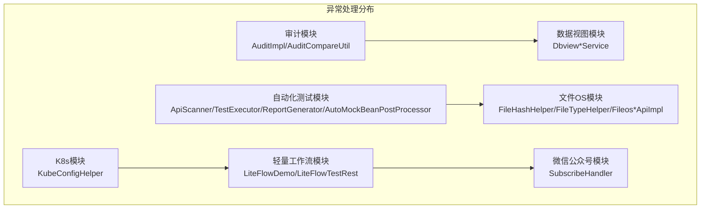
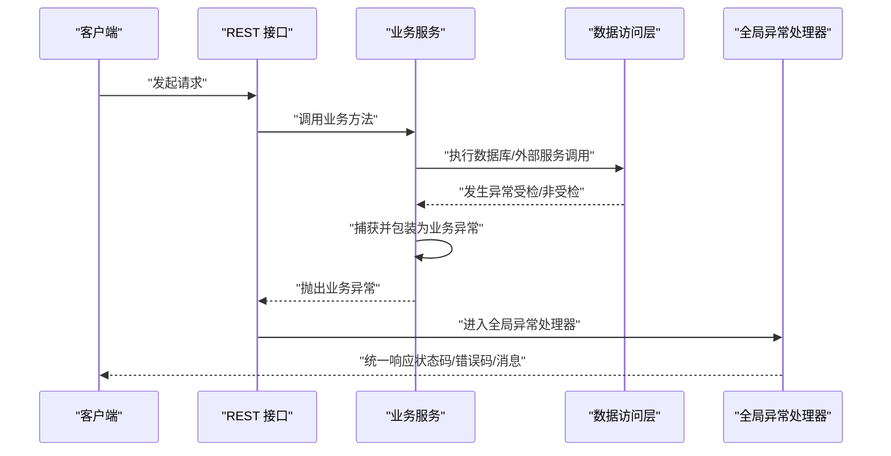
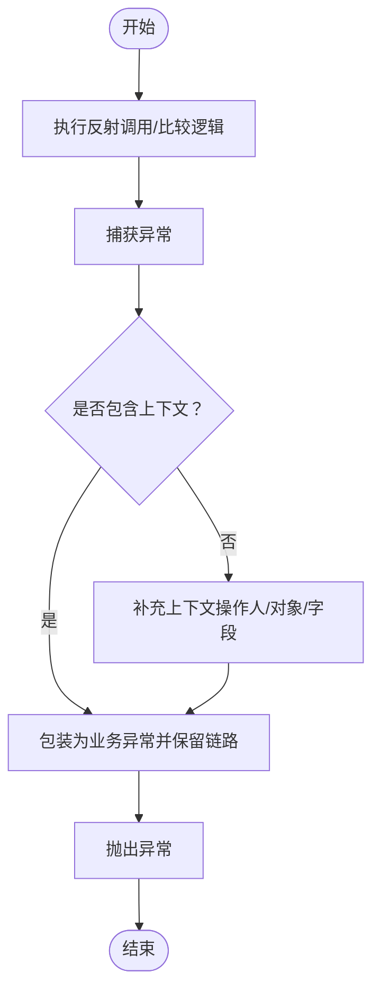
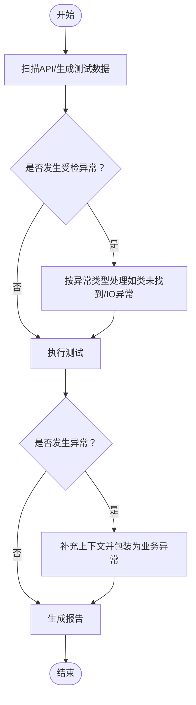
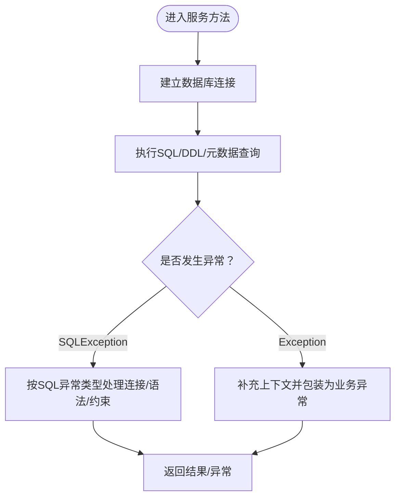
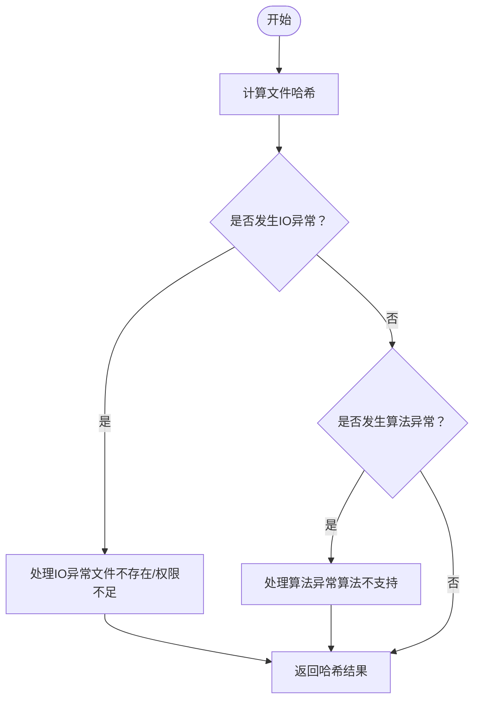
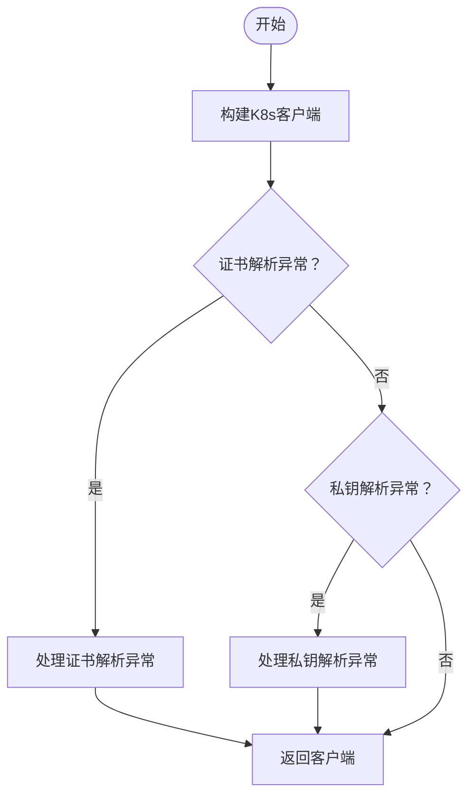
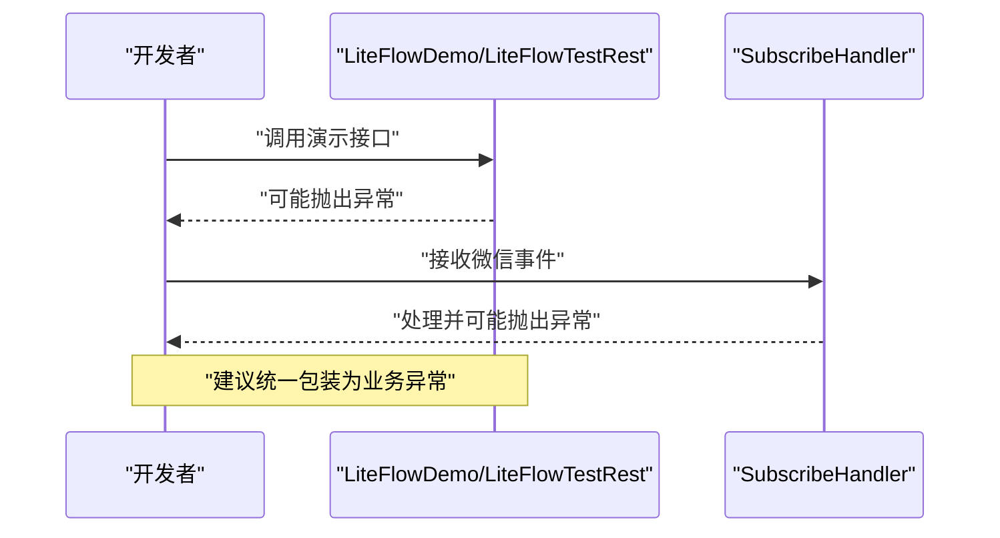
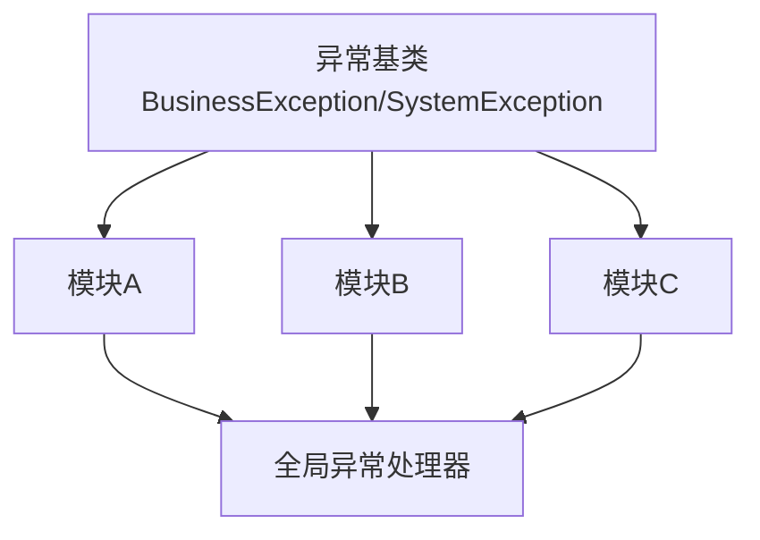

# 异常处理

<cite>
**本文引用的文件**
- [pom.xml](file://pom.xml)
- [micro-audit/src/main/java/com/wkclz/micro/audit/api/impl/AuditImpl.java](file://micro-audit/src/main/java/com/wkclz/micro/audit/api/impl/AuditImpl.java)
- [micro-audit/src/main/java/com/wkclz/micro/audit/utils/AuditCompareUtil.java](file://micro-audit/src/main/java/com/wkclz/micro/audit/utils/AuditCompareUtil.java)
- [micro-autotest/src/main/java/com/wkclz/auto/executor/TestExecutor.java](file://micro-autotest/src/main/java/com/wkclz/auto/executor/TestExecutor.java)
- [micro-autotest/src/main/java/com/wkclz/auto/mock/AutoMockBeanPostProcessor.java](file://micro-autotest/src/main/java/com/wkclz/auto/mock/AutoMockBeanPostProcessor.java)
- [micro-autotest/src/main/java/com/wkclz/auto/report/ReportGenerator.java](file://micro-autotest/src/main/java/com/wkclz/auto/report/ReportGenerator.java)
- [micro-autotest/src/main/java/com/wkclz/auto/scanner/ApiScanner.java](file://micro-autotest/src/main/java/com/wkclz/auto/scanner/ApiScanner.java)
- [micro-dbview/src/main/java/com/wkclz/micro/dbview/service/DbviewConnectionService.java](file://micro-dbview/src/main/java/com/wkclz/micro/dbview/service/DbviewConnectionService.java)
- [micro-dbview/src/main/java/com/wkclz/micro/dbview/service/DbviewDdlService.java](file://micro-dbview/src/main/java/com/wkclz/micro/dbview/service/DbviewDdlService.java)
- [micro-dbview/src/main/java/com/wkclz/micro/dbview/service/DbviewMetadataService.java](file://micro-dbview/src/main/java/com/wkclz/micro/dbview/service/DbviewMetadataService.java)
- [micro-dbview/src/main/java/com/wkclz/micro/dbview/service/DbviewSqlService.java](file://micro-dbview/src/main/java/com/wkclz/micro/dbview/service/DbviewSqlService.java)
- [micro-fileos/src/main/java/com/wkclz/micro/fileos/api/impl/FileosSignApiImpl.java](file://micro-fileos/src/main/java/com/wkclz/micro/fileos/api/impl/FileosSignApiImpl.java)
- [micro-fileos/src/main/java/com/wkclz/micro/fileos/api/impl/FileosUploadApiImpl.java](file://micro-fileos/src/main/java/com/wkclz/micro/fileos/api/impl/FileosUploadApiImpl.java)
- [micro-fileos/src/main/java/com/wkclz/micro/fileos/helper/FileHashHelper.java](file://micro-fileos/src/main/java/com/wkclz/micro/fileos/helper/FileHashHelper.java)
- [micro-fileos/src/main/java/com/wkclz/micro/fileos/helper/FileTypeHelper.java](file://micro-fileos/src/main/java/com/wkclz/micro/fileos/helper/FileTypeHelper.java)
- [micro-k8s/src/main/java/com/wkclz/micro/k8s/helper/KubeConfigHelper.java](file://micro-k8s/src/main/java/com/wkclz/micro/k8s/helper/KubeConfigHelper.java)
- [micro-liteflow/src/main/java/com/wkclz/micro/liteflow/demo/LiteFlowDemo.java](file://micro-liteflow/src/main/java/com/wkclz/micro/liteflow/demo/LiteFlowDemo.java)
- [micro-liteflow/src/main/java/com/wkclz/micro/liteflow/demo/LiteFlowTestRest.java](file://micro-liteflow/src/main/java/com/wkclz/micro/liteflow/demo/LiteFlowTestRest.java)
- [micro-wxmp/src/main/java/com/wkclz/micro/wxmp/handler/SubscribeHandler.java](file://micro-wxmp/src/main/java/com/wkclz/micro/wxmp/handler/SubscribeHandler.java)
</cite>

## 目录
1. [引言](#引言)
2. [项目结构](#项目结构)
3. [核心组件](#核心组件)
4. [架构总览](#架构总览)
5. [详细组件分析](#详细组件分析)
6. [依赖分析](#依赖分析)
7. [性能考虑](#性能考虑)
8. [故障排查指南](#故障排查指南)
9. [结论](#结论)
10. [附录](#附录)

## 引言
本规范面向 sh-microapp 微服务框架，旨在建立统一、可维护且可追溯的异常处理体系。通过对仓库中现有异常处理实践的归纳与提炼，明确异常分类、处理原则、最佳实践与常见误区，帮助开发者在业务开发中遵循一致的异常处理策略。

## 项目结构
本项目采用多模块微服务结构，每个功能域独立为一个子模块。异常处理实践散布于各模块的服务层、工具类与REST接口中，主要集中在以下模块：
- 审计模块：审计比较与调用过程中的异常捕获
- 自动化测试模块：扫描、报告生成、Mock等场景的异常处理
- 数据视图模块：数据库连接、SQL执行、DDL与元数据操作的异常处理
- 文件OS模块：哈希计算、文件类型识别、签名与上传流程的异常处理
- K8s模块：Kubernetes客户端构建过程中的异常处理
- 轻量工作流模块：演示与测试接口的异常声明
- 微信公众号模块：事件处理中的异常处理

**章节来源**
- [pom.xml](file://pom.xml)

## 核心组件
本节从整体上梳理异常处理的核心规则与要求，结合仓库中的实际使用情况，形成可落地的规范条目。

- 异常分类与继承体系
  - 业务异常：用于表达“业务期望内的失败”，如参数不合法、权限不足、业务规则不满足等。建议统一继承自框架约定的业务异常基类（例如 BusinessException）。
  - 系统异常：用于表达“系统级失败”，如网络超时、数据库不可用、第三方服务异常、线程中断等。建议统一继承自系统异常基类（例如 SystemException）。
  - 说明：当前仓库未发现显式定义 BusinessException/SystemException 的基类文件；建议在公共模块中引入并统一继承关系，以保证异常语义清晰、便于全局处理。

- 禁止空 catch 块
  - 现状：多处存在空 catch 块或仅记录日志而不抛出异常的情况，导致问题被吞掉，难以定位。
  - 规则：严禁空 catch 块；若确需抑制异常，必须在注释中明确说明原因，并确保不影响业务正确性。

- 禁止用异常控制流程
  - 现状：部分模块通过异常进行分支判断或流程控制，不符合异常设计初衷。
  - 规则：异常仅用于异常路径，正常流程应通过条件判断与返回值处理。

- 异常信息必须包含上下文
  - 现状：部分 catch 块直接捕获并记录底层异常，缺少业务上下文信息。
  - 规则：捕获异常后，应补充业务上下文（如用户ID、请求ID、操作对象、关键参数等），并在重新抛出或包装时保留原始异常链。

- 使用全局异常处理器统一响应
  - 现状：各模块自行处理异常，未见统一的全局异常处理器。
  - 规则：建议在网关或公共模块引入全局异常处理器，对业务异常与系统异常进行统一格式化输出，屏蔽内部细节，保障对外响应一致性。

- 受检异常 vs 非受检异常的选择原则
  - 现状：部分方法声明抛出 Exception 或具体受检异常（如 SQLException、IOException），部分模块直接捕获受检异常。
  - 规则：
    - 对于可恢复的、可预期的错误，优先使用业务异常（非受检）以减少强制处理负担；
    - 对于必须由调用方处理的错误（如I/O中断、数据库连接断开），使用受检异常；
    - 不要滥用 throws Exception，尽量精确到具体异常类型。

- try-with-resources 管理资源
  - 现状：部分模块使用 try-with-resources 管理资源（如文件IO、数据库连接），但仍有遗漏。
  - 规则：涉及文件、流、数据库连接、HTTP连接等资源时，必须使用 try-with-resources 或确保 finally 中释放资源。

- 全局异常处理器与响应格式
  - 建议：统一响应体包含字段：状态码、错误码、消息、时间戳、traceId（可选）、数据（可选）。业务异常与系统异常分别映射到不同状态码范围，便于前端与监控系统识别。

**章节来源**
- [micro-audit/src/main/java/com/wkclz/micro/audit/api/impl/AuditImpl.java:292-295](file://micro-audit/src/main/java/com/wkclz/micro/audit/api/impl/AuditImpl.java#L292-L295)
- [micro-audit/src/main/java/com/wkclz/micro/audit/utils/AuditCompareUtil.java](file://micro-audit/src/main/java/com/wkclz/micro/audit/utils/AuditCompareUtil.java#L51)
- [micro-autotest/src/main/java/com/wkclz/auto/executor/TestExecutor.java](file://micro-autotest/src/main/java/com/wkclz/auto/executor/TestExecutor.java#L97)
- [micro-autotest/src/main/java/com/wkclz/auto/mock/AutoMockBeanPostProcessor.java](file://micro-autotest/src/main/java/com/wkclz/auto/mock/AutoMockBeanPostProcessor.java#L74)
- [micro-autotest/src/main/java/com/wkclz/auto/report/ReportGenerator.java](file://micro-autotest/src/main/java/com/wkclz/auto/report/ReportGenerator.java#L208)
- [micro-autotest/src/main/java/com/wkclz/auto/scanner/ApiScanner.java](file://micro-autotest/src/main/java/com/wkclz/auto/scanner/ApiScanner.java#L265)
- [micro-dbview/src/main/java/com/wkclz/micro/dbview/service/DbviewConnectionService.java](file://micro-dbview/src/main/java/com/wkclz/micro/dbview/service/DbviewConnectionService.java#L58)
- [micro-dbview/src/main/java/com/wkclz/micro/dbview/service/DbviewConnectionService.java](file://micro-dbview/src/main/java/com/wkclz/micro/dbview/service/DbviewConnectionService.java#L76)
- [micro-dbview/src/main/java/com/wkclz/micro/dbview/service/DbviewConnectionService.java](file://micro-dbview/src/main/java/com/wkclz/micro/dbview/service/DbviewConnectionService.java#L86)
- [micro-dbview/src/main/java/com/wkclz/micro/dbview/service/DbviewDdlService.java](file://micro-dbview/src/main/java/com/wkclz/micro/dbview/service/DbviewDdlService.java#L85)
- [micro-dbview/src/main/java/com/wkclz/micro/dbview/service/DbviewDdlService.java](file://micro-dbview/src/main/java/com/wkclz/micro/dbview/service/DbviewDdlService.java#L96)
- [micro-dbview/src/main/java/com/wkclz/micro/dbview/service/DbviewDdlService.java](file://micro-dbview/src/main/java/com/wkclz/micro/dbview/service/DbviewDdlService.java#L268)
- [micro-dbview/src/main/java/com/wkclz/micro/dbview/service/DbviewMetadataService.java](file://micro-dbview/src/main/java/com/wkclz/micro/dbview/service/DbviewMetadataService.java#L237)
- [micro-dbview/src/main/java/com/wkclz/micro/dbview/service/DbviewSqlService.java](file://micro-dbview/src/main/java/com/wkclz/micro/dbview/service/DbviewSqlService.java#L82)
- [micro-dbview/src/main/java/com/wkclz/micro/dbview/service/DbviewSqlService.java](file://micro-dbview/src/main/java/com/wkclz/micro/dbview/service/DbviewSqlService.java#L97)
- [micro-fileos/src/main/java/com/wkclz/micro/fileos/api/impl/FileosSignApiImpl.java](file://micro-fileos/src/main/java/com/wkclz/micro/fileos/api/impl/FileosSignApiImpl.java#L283)
- [micro-fileos/src/main/java/com/wkclz/micro/fileos/api/impl/FileosUploadApiImpl.java](file://micro-fileos/src/main/java/com/wkclz/micro/fileos/api/impl/FileosUploadApiImpl.java#L119)
- [micro-fileos/src/main/java/com/wkclz/micro/fileos/helper/FileHashHelper.java](file://micro-fileos/src/main/java/com/wkclz/micro/fileos/helper/FileHashHelper.java#L23)
- [micro-fileos/src/main/java/com/wkclz/micro/fileos/helper/FileHashHelper.java](file://micro-fileos/src/main/java/com/wkclz/micro/fileos/helper/FileHashHelper.java#L40)
- [micro-fileos/src/main/java/com/wkclz/micro/fileos/helper/FileHashHelper.java](file://micro-fileos/src/main/java/com/wkclz/micro/fileos/helper/FileHashHelper.java#L43)
- [micro-fileos/src/main/java/com/wkclz/micro/fileos/helper/FileTypeHelper.java](file://micro-fileos/src/main/java/com/wkclz/micro/fileos/helper/FileTypeHelper.java#L112)
- [micro-fileos/src/main/java/com/wkclz/micro/fileos/helper/FileTypeHelper.java](file://micro-fileos/src/main/java/com/wkclz/micro/fileos/helper/FileTypeHelper.java#L135)
- [micro-fileos/src/main/java/com/wkclz/micro/fileos/helper/FileTypeHelper.java](file://micro-fileos/src/main/java/com/wkclz/micro/fileos/helper/FileTypeHelper.java#L154)
- [micro-k8s/src/main/java/com/wkclz/micro/k8s/helper/KubeConfigHelper.java](file://micro-k8s/src/main/java/com/wkclz/micro/k8s/helper/KubeConfigHelper.java#L123)
- [micro-k8s/src/main/java/com/wkclz/micro/k8s/helper/KubeConfigHelper.java](file://micro-k8s/src/main/java/com/wkclz/micro/k8s/helper/KubeConfigHelper.java#L212)
- [micro-k8s/src/main/java/com/wkclz/micro/k8s/helper/KubeConfigHelper.java](file://micro-k8s/src/main/java/com/wkclz/micro/k8s/helper/KubeConfigHelper.java#L276)
- [micro-liteflow/src/main/java/com/wkclz/micro/liteflow/demo/LiteFlowDemo.java](file://micro-liteflow/src/main/java/com/wkclz/micro/liteflow/demo/LiteFlowDemo.java#L18)
- [micro-liteflow/src/main/java/com/wkclz/micro/liteflow/demo/LiteFlowTestRest.java](file://micro-liteflow/src/main/java/com/wkclz/micro/liteflow/demo/LiteFlowTestRest.java#L18)
- [micro-wxmp/src/main/java/com/wkclz/micro/wxmp/handler/SubscribeHandler.java](file://micro-wxmp/src/main/java/com/wkclz/micro/wxmp/handler/SubscribeHandler.java#L111)

## 架构总览
下图展示了异常处理在微服务中的典型流转：业务层捕获并包装异常，全局异常处理器统一响应，外部调用者收到标准化的错误信息。

[此图为概念性示意，无需图表来源]

## 详细组件分析

### 审计模块异常处理
- 审计比较与反射调用过程中存在 catch Exception 的模式，建议：
  - 明确区分业务异常与系统异常；
  - 在捕获后补充上下文（如比较对象、字段名、操作人等）；
  - 将通用异常包装为业务异常并保留原始异常链。

**图表来源**
- [micro-audit/src/main/java/com/wkclz/micro/audit/api/impl/AuditImpl.java:292-295](file://micro-audit/src/main/java/com/wkclz/micro/audit/api/impl/AuditImpl.java#L292-L295)
- [micro-audit/src/main/java/com/wkclz/micro/audit/utils/AuditCompareUtil.java](file://micro-audit/src/main/java/com/wkclz/micro/audit/utils/AuditCompareUtil.java#L51)

**章节来源**
- [micro-audit/src/main/java/com/wkclz/micro/audit/api/impl/AuditImpl.java:292-295](file://micro-audit/src/main/java/com/wkclz/micro/audit/api/impl/AuditImpl.java#L292-L295)
- [micro-audit/src/main/java/com/wkclz/micro/audit/utils/AuditCompareUtil.java](file://micro-audit/src/main/java/com/wkclz/micro/audit/utils/AuditCompareUtil.java#L51)

### 自动化测试模块异常处理
- 扫描器、执行器、报告生成与Mock处理器中存在多种异常捕获模式：
  - 建议：对受检异常（如 ClassNotFoundException、IOException）进行明确处理；
  - 对通用异常，补充测试场景上下文（如用例ID、接口地址、参数）后包装为业务异常。

**图表来源**
- [micro-autotest/src/main/java/com/wkclz/auto/scanner/ApiScanner.java](file://micro-autotest/src/main/java/com/wkclz/auto/scanner/ApiScanner.java#L265)
- [micro-autotest/src/main/java/com/wkclz/auto/executor/TestExecutor.java](file://micro-autotest/src/main/java/com/wkclz/auto/executor/TestExecutor.java#L97)
- [micro-autotest/src/main/java/com/wkclz/auto/report/ReportGenerator.java](file://micro-autotest/src/main/java/com/wkclz/auto/report/ReportGenerator.java#L208)
- [micro-autotest/src/main/java/com/wkclz/auto/mock/AutoMockBeanPostProcessor.java](file://micro-autotest/src/main/java/com/wkclz/auto/mock/AutoMockBeanPostProcessor.java#L74)

**章节来源**
- [micro-autotest/src/main/java/com/wkclz/auto/scanner/ApiScanner.java](file://micro-autotest/src/main/java/com/wkclz/auto/scanner/ApiScanner.java#L265)
- [micro-autotest/src/main/java/com/wkclz/auto/executor/TestExecutor.java](file://micro-autotest/src/main/java/com/wkclz/auto/executor/TestExecutor.java#L97)
- [micro-autotest/src/main/java/com/wkclz/auto/report/ReportGenerator.java](file://micro-autotest/src/main/java/com/wkclz/auto/report/ReportGenerator.java#L208)
- [micro-autotest/src/main/java/com/wkclz/auto/mock/AutoMockBeanPostProcessor.java](file://micro-autotest/src/main/java/com/wkclz/auto/mock/AutoMockBeanPostProcessor.java#L74)

### 数据视图模块异常处理
- 连接、SQL执行、DDL与元数据操作中广泛出现 SQLException 与 Exception 捕获：
  - 建议：对 SQL 异常进行分类处理（连接失败、SQL语法错误、约束冲突等）；
  - 对通用异常补充操作上下文（如SQL语句、表名、用户ID）后包装为业务异常。

**图表来源**
- [micro-dbview/src/main/java/com/wkclz/micro/dbview/service/DbviewConnectionService.java](file://micro-dbview/src/main/java/com/wkclz/micro/dbview/service/DbviewConnectionService.java#L58)
- [micro-dbview/src/main/java/com/wkclz/micro/dbview/service/DbviewConnectionService.java](file://micro-dbview/src/main/java/com/wkclz/micro/dbview/service/DbviewConnectionService.java#L76)
- [micro-dbview/src/main/java/com/wkclz/micro/dbview/service/DbviewConnectionService.java](file://micro-dbview/src/main/java/com/wkclz/micro/dbview/service/DbviewConnectionService.java#L86)
- [micro-dbview/src/main/java/com/wkclz/micro/dbview/service/DbviewDdlService.java](file://micro-dbview/src/main/java/com/wkclz/micro/dbview/service/DbviewDdlService.java#L85)
- [micro-dbview/src/main/java/com/wkclz/micro/dbview/service/DbviewDdlService.java](file://micro-dbview/src/main/java/com/wkclz/micro/dbview/service/DbviewDdlService.java#L96)
- [micro-dbview/src/main/java/com/wkclz/micro/dbview/service/DbviewDdlService.java](file://micro-dbview/src/main/java/com/wkclz/micro/dbview/service/DbviewDdlService.java#L268)
- [micro-dbview/src/main/java/com/wkclz/micro/dbview/service/DbviewMetadataService.java](file://micro-dbview/src/main/java/com/wkclz/micro/dbview/service/DbviewMetadataService.java#L237)
- [micro-dbview/src/main/java/com/wkclz/micro/dbview/service/DbviewSqlService.java](file://micro-dbview/src/main/java/com/wkclz/micro/dbview/service/DbviewSqlService.java#L82)
- [micro-dbview/src/main/java/com/wkclz/micro/dbview/service/DbviewSqlService.java](file://micro-dbview/src/main/java/com/wkclz/micro/dbview/service/DbviewSqlService.java#L97)

**章节来源**
- [micro-dbview/src/main/java/com/wkclz/micro/dbview/service/DbviewConnectionService.java](file://micro-dbview/src/main/java/com/wkclz/micro/dbview/service/DbviewConnectionService.java#L58)
- [micro-dbview/src/main/java/com/wkclz/micro/dbview/service/DbviewConnectionService.java](file://micro-dbview/src/main/java/com/wkclz/micro/dbview/service/DbviewConnectionService.java#L76)
- [micro-dbview/src/main/java/com/wkclz/micro/dbview/service/DbviewConnectionService.java](file://micro-dbview/src/main/java/com/wkclz/micro/dbview/service/DbviewConnectionService.java#L86)
- [micro-dbview/src/main/java/com/wkclz/micro/dbview/service/DbviewDdlService.java](file://micro-dbview/src/main/java/com/wkclz/micro/dbview/service/DbviewDdlService.java#L85)
- [micro-dbview/src/main/java/com/wkclz/micro/dbview/service/DbviewDdlService.java](file://micro-dbview/src/main/java/com/wkclz/micro/dbview/service/DbviewDdlService.java#L96)
- [micro-dbview/src/main/java/com/wkclz/micro/dbview/service/DbviewDdlService.java](file://micro-dbview/src/main/java/com/wkclz/micro/dbview/service/DbviewDdlService.java#L268)
- [micro-dbview/src/main/java/com/wkclz/micro/dbview/service/DbviewMetadataService.java](file://micro-dbview/src/main/java/com/wkclz/micro/dbview/service/DbviewMetadataService.java#L237)
- [micro-dbview/src/main/java/com/wkclz/micro/dbview/service/DbviewSqlService.java](file://micro-dbview/src/main/java/com/wkclz/micro/dbview/service/DbviewSqlService.java#L82)
- [micro-dbview/src/main/java/com/wkclz/micro/dbview/service/DbviewSqlService.java](file://micro-dbview/src/main/java/com/wkclz/micro/dbview/service/DbviewSqlService.java#L97)

### 文件OS模块异常处理
- 哈希计算与文件类型识别中存在 IOException 与 NoSuchAlgorithmException 等受检异常：
  - 建议：对IO异常与算法异常进行分类处理；
  - 对通用异常补充文件路径、算法名称等上下文后包装为业务异常。

**图表来源**
- [micro-fileos/src/main/java/com/wkclz/micro/fileos/helper/FileHashHelper.java](file://micro-fileos/src/main/java/com/wkclz/micro/fileos/helper/FileHashHelper.java#L23)
- [micro-fileos/src/main/java/com/wkclz/micro/fileos/helper/FileHashHelper.java](file://micro-fileos/src/main/java/com/wkclz/micro/fileos/helper/FileHashHelper.java#L40)
- [micro-fileos/src/main/java/com/wkclz/micro/fileos/helper/FileHashHelper.java](file://micro-fileos/src/main/java/com/wkclz/micro/fileos/helper/FileHashHelper.java#L43)
- [micro-fileos/src/main/java/com/wkclz/micro/fileos/helper/FileTypeHelper.java](file://micro-fileos/src/main/java/com/wkclz/micro/fileos/helper/FileTypeHelper.java#L112)
- [micro-fileos/src/main/java/com/wkclz/micro/fileos/helper/FileTypeHelper.java](file://micro-fileos/src/main/java/com/wkclz/micro/fileos/helper/FileTypeHelper.java#L135)
- [micro-fileos/src/main/java/com/wkclz/micro/fileos/helper/FileTypeHelper.java](file://micro-fileos/src/main/java/com/wkclz/micro/fileos/helper/FileTypeHelper.java#L154)
- [micro-fileos/src/main/java/com/wkclz/micro/fileos/api/impl/FileosSignApiImpl.java](file://micro-fileos/src/main/java/com/wkclz/micro/fileos/api/impl/FileosSignApiImpl.java#L283)
- [micro-fileos/src/main/java/com/wkclz/micro/fileos/api/impl/FileosUploadApiImpl.java](file://micro-fileos/src/main/java/com/wkclz/micro/fileos/api/impl/FileosUploadApiImpl.java#L119)

**章节来源**
- [micro-fileos/src/main/java/com/wkclz/micro/fileos/helper/FileHashHelper.java](file://micro-fileos/src/main/java/com/wkclz/micro/fileos/helper/FileHashHelper.java#L23)
- [micro-fileos/src/main/java/com/wkclz/micro/fileos/helper/FileHashHelper.java](file://micro-fileos/src/main/java/com/wkclz/micro/fileos/helper/FileHashHelper.java#L40)
- [micro-fileos/src/main/java/com/wkclz/micro/fileos/helper/FileHashHelper.java](file://micro-fileos/src/main/java/com/wkclz/micro/fileos/helper/FileHashHelper.java#L43)
- [micro-fileos/src/main/java/com/wkclz/micro/fileos/helper/FileTypeHelper.java](file://micro-fileos/src/main/java/com/wkclz/micro/fileos/helper/FileTypeHelper.java#L112)
- [micro-fileos/src/main/java/com/wkclz/micro/fileos/helper/FileTypeHelper.java](file://micro-fileos/src/main/java/com/wkclz/micro/fileos/helper/FileTypeHelper.java#L135)
- [micro-fileos/src/main/java/com/wkclz/micro/fileos/helper/FileTypeHelper.java](file://micro-fileos/src/main/java/com/wkclz/micro/fileos/helper/FileTypeHelper.java#L154)
- [micro-fileos/src/main/java/com/wkclz/micro/fileos/api/impl/FileosSignApiImpl.java](file://micro-fileos/src/main/java/com/wkclz/micro/fileos/api/impl/FileosSignApiImpl.java#L283)
- [micro-fileos/src/main/java/com/wkclz/micro/fileos/api/impl/FileosUploadApiImpl.java](file://micro-fileos/src/main/java/com/wkclz/micro/fileos/api/impl/FileosUploadApiImpl.java#L119)

### K8s模块异常处理
- Kubernetes客户端构建过程中存在多种异常（如证书解析、私钥解析、API客户端构建）：
  - 建议：对证书/密钥解析异常进行分类处理；
  - 对通用异常补充集群配置、证书路径等上下文后包装为系统异常或业务异常。

**图表来源**
- [micro-k8s/src/main/java/com/wkclz/micro/k8s/helper/KubeConfigHelper.java](file://micro-k8s/src/main/java/com/wkclz/micro/k8s/helper/KubeConfigHelper.java#L123)
- [micro-k8s/src/main/java/com/wkclz/micro/k8s/helper/KubeConfigHelper.java](file://micro-k8s/src/main/java/com/wkclz/micro/k8s/helper/KubeConfigHelper.java#L212)
- [micro-k8s/src/main/java/com/wkclz/micro/k8s/helper/KubeConfigHelper.java](file://micro-k8s/src/main/java/com/wkclz/micro/k8s/helper/KubeConfigHelper.java#L276)

**章节来源**
- [micro-k8s/src/main/java/com/wkclz/micro/k8s/helper/KubeConfigHelper.java](file://micro-k8s/src/main/java/com/wkclz/micro/k8s/helper/KubeConfigHelper.java#L123)
- [micro-k8s/src/main/java/com/wkclz/micro/k8s/helper/KubeConfigHelper.java](file://micro-k8s/src/main/java/com/wkclz/micro/k8s/helper/KubeConfigHelper.java#L212)
- [micro-k8s/src/main/java/com/wkclz/micro/k8s/helper/KubeConfigHelper.java](file://micro-k8s/src/main/java/com/wkclz/micro/k8s/helper/KubeConfigHelper.java#L276)

### 轻量工作流与微信公众号模块异常处理
- 工作流演示接口声明抛出 Exception，建议改为更精确的异常类型；
- 微信公众号事件处理中存在异常声明，建议补充上下文并统一包装。

**图表来源**
- [micro-liteflow/src/main/java/com/wkclz/micro/liteflow/demo/LiteFlowDemo.java](file://micro-liteflow/src/main/java/com/wkclz/micro/liteflow/demo/LiteFlowDemo.java#L18)
- [micro-liteflow/src/main/java/com/wkclz/micro/liteflow/demo/LiteFlowTestRest.java](file://micro-liteflow/src/main/java/com/wkclz/micro/liteflow/demo/LiteFlowTestRest.java#L18)
- [micro-wxmp/src/main/java/com/wkclz/micro/wxmp/handler/SubscribeHandler.java](file://micro-wxmp/src/main/java/com/wkclz/micro/wxmp/handler/SubscribeHandler.java#L111)

**章节来源**
- [micro-liteflow/src/main/java/com/wkclz/micro/liteflow/demo/LiteFlowDemo.java](file://micro-liteflow/src/main/java/com/wkclz/micro/liteflow/demo/LiteFlowDemo.java#L18)
- [micro-liteflow/src/main/java/com/wkclz/micro/liteflow/demo/LiteFlowTestRest.java](file://micro-liteflow/src/main/java/com/wkclz/micro/liteflow/demo/LiteFlowTestRest.java#L18)
- [micro-wxmp/src/main/java/com/wkclz/micro/wxmp/handler/SubscribeHandler.java](file://micro-wxmp/src/main/java/com/wkclz/micro/wxmp/handler/SubscribeHandler.java#L111)

## 依赖分析
- 当前仓库未发现统一的异常基类与全局异常处理器，建议：
  - 在公共模块引入 BusinessException/SystemException 基类；
  - 在网关或公共模块引入全局异常处理器，统一拦截业务异常与系统异常；
  - 各模块仅负责在业务边界内捕获并包装异常，不直接处理响应。

[此图为概念性示意，无需图表来源]

## 性能考虑
- 异常栈追踪会带来额外开销，建议：
  - 仅在必要时保留完整异常链；
  - 对高频异常场景，避免频繁创建异常对象；
  - 在日志中记录异常摘要，避免大段堆栈信息。

[本节为通用指导，无需章节来源]

## 故障排查指南
- 常见问题
  - 空 catch 块导致问题被吞掉：检查是否存在空 catch 块并补充上下文或抛出异常。
  - 用异常控制流程：将异常路径改为条件判断，避免滥用异常。
  - 缺少上下文：在捕获异常后补充操作人、对象、参数等上下文信息。
  - 统一响应缺失：引入全局异常处理器，统一业务异常与系统异常的响应格式。
  - 资源未释放：检查是否使用 try-with-resources 或 finally 释放资源。

- 排查步骤
  - 定位异常发生位置：查看异常栈与上下文信息；
  - 分析异常类型：区分业务异常与系统异常；
  - 检查资源管理：确认文件、数据库连接、网络连接等已正确释放；
  - 验证响应格式：确保对外输出符合统一规范。

**章节来源**
- [micro-fileos/src/main/java/com/wkclz/micro/fileos/helper/FileHashHelper.java](file://micro-fileos/src/main/java/com/wkclz/micro/fileos/helper/FileHashHelper.java#L23)
- [micro-fileos/src/main/java/com/wkclz/micro/fileos/helper/FileHashHelper.java](file://micro-fileos/src/main/java/com/wkclz/micro/fileos/helper/FileHashHelper.java#L40)
- [micro-fileos/src/main/java/com/wkclz/micro/fileos/helper/FileHashHelper.java](file://micro-fileos/src/main/java/com/wkclz/micro/fileos/helper/FileHashHelper.java#L43)
- [micro-fileos/src/main/java/com/wkclz/micro/fileos/helper/FileTypeHelper.java](file://micro-fileos/src/main/java/com/wkclz/micro/fileos/helper/FileTypeHelper.java#L112)
- [micro-fileos/src/main/java/com/wkclz/micro/fileos/helper/FileTypeHelper.java](file://micro-fileos/src/main/java/com/wkclz/micro/fileos/helper/FileTypeHelper.java#L135)
- [micro-fileos/src/main/java/com/wkclz/micro/fileos/helper/FileTypeHelper.java](file://micro-fileos/src/main/java/com/wkclz/micro/fileos/helper/FileTypeHelper.java#L154)

## 结论
通过在 sh-microapp 中建立统一的异常分类与处理规范，可以显著提升系统的可观测性与可维护性。建议尽快引入异常基类与全局异常处理器，并在各模块中严格执行“异常信息包含上下文、禁止空catch、禁止用异常控制流程、受检/非受检异常合理选择、try-with-resources管理资源”的原则。

[本节为总结性内容，无需章节来源]

## 附录
- 最佳实践清单
  - 明确区分业务异常与系统异常；
  - 捕获异常后补充上下文并包装为业务异常；
  - 使用全局异常处理器统一响应；
  - 受检异常与非受检异常按场景合理选择；
  - 所有资源使用 try-with-resources 或确保 finally 释放；
  - 避免空 catch 块与用异常控制流程。

- 常见错误示例（基于仓库现状）
  - 空 catch 块：在多个模块中存在 catch (Exception e) { } 的模式；
  - 通用异常捕获：未区分 SQLException、IOException 等具体异常类型；
  - 缺少上下文：异常信息中未包含用户ID、请求ID、操作对象等关键信息；
  - 资源未释放：部分模块未使用 try-with-resources 管理资源。

**章节来源**
- [micro-audit/src/main/java/com/wkclz/micro/audit/api/impl/AuditImpl.java:292-295](file://micro-audit/src/main/java/com/wkclz/micro/audit/api/impl/AuditImpl.java#L292-L295)
- [micro-audit/src/main/java/com/wkclz/micro/audit/utils/AuditCompareUtil.java](file://micro-audit/src/main/java/com/wkclz/micro/audit/utils/AuditCompareUtil.java#L51)
- [micro-autotest/src/main/java/com/wkclz/auto/executor/TestExecutor.java](file://micro-autotest/src/main/java/com/wkclz/auto/executor/TestExecutor.java#L97)
- [micro-autotest/src/main/java/com/wkclz/auto/mock/AutoMockBeanPostProcessor.java](file://micro-autotest/src/main/java/com/wkclz/auto/mock/AutoMockBeanPostProcessor.java#L74)
- [micro-autotest/src/main/java/com/wkclz/auto/report/ReportGenerator.java](file://micro-autotest/src/main/java/com/wkclz/auto/report/ReportGenerator.java#L208)
- [micro-autotest/src/main/java/com/wkclz/auto/scanner/ApiScanner.java](file://micro-autotest/src/main/java/com/wkclz/auto/scanner/ApiScanner.java#L265)
- [micro-dbview/src/main/java/com/wkclz/micro/dbview/service/DbviewConnectionService.java](file://micro-dbview/src/main/java/com/wkclz/micro/dbview/service/DbviewConnectionService.java#L58)
- [micro-dbview/src/main/java/com/wkclz/micro/dbview/service/DbviewConnectionService.java](file://micro-dbview/src/main/java/com/wkclz/micro/dbview/service/DbviewConnectionService.java#L76)
- [micro-dbview/src/main/java/com/wkclz/micro/dbview/service/DbviewConnectionService.java](file://micro-dbview/src/main/java/com/wkclz/micro/dbview/service/DbviewConnectionService.java#L86)
- [micro-dbview/src/main/java/com/wkclz/micro/dbview/service/DbviewDdlService.java](file://micro-dbview/src/main/java/com/wkclz/micro/dbview/service/DbviewDdlService.java#L85)
- [micro-dbview/src/main/java/com/wkclz/micro/dbview/service/DbviewDdlService.java](file://micro-dbview/src/main/java/com/wkclz/micro/dbview/service/DbviewDdlService.java#L96)
- [micro-dbview/src/main/java/com/wkclz/micro/dbview/service/DbviewDdlService.java](file://micro-dbview/src/main/java/com/wkclz/micro/dbview/service/DbviewDdlService.java#L268)
- [micro-dbview/src/main/java/com/wkclz/micro/dbview/service/DbviewMetadataService.java](file://micro-dbview/src/main/java/com/wkclz/micro/dbview/service/DbviewMetadataService.java#L237)
- [micro-dbview/src/main/java/com/wkclz/micro/dbview/service/DbviewSqlService.java](file://micro-dbview/src/main/java/com/wkclz/micro/dbview/service/DbviewSqlService.java#L82)
- [micro-dbview/src/main/java/com/wkclz/micro/dbview/service/DbviewSqlService.java](file://micro-dbview/src/main/java/com/wkclz/micro/dbview/service/DbviewSqlService.java#L97)
- [micro-fileos/src/main/java/com/wkclz/micro/fileos/api/impl/FileosSignApiImpl.java](file://micro-fileos/src/main/java/com/wkclz/micro/fileos/api/impl/FileosSignApiImpl.java#L283)
- [micro-fileos/src/main/java/com/wkclz/micro/fileos/api/impl/FileosUploadApiImpl.java](file://micro-fileos/src/main/java/com/wkclz/micro/fileos/api/impl/FileosUploadApiImpl.java#L119)
- [micro-fileos/src/main/java/com/wkclz/micro/fileos/helper/FileHashHelper.java](file://micro-fileos/src/main/java/com/wkclz/micro/fileos/helper/FileHashHelper.java#L23)
- [micro-fileos/src/main/java/com/wkclz/micro/fileos/helper/FileHashHelper.java](file://micro-fileos/src/main/java/com/wkclz/micro/fileos/helper/FileHashHelper.java#L40)
- [micro-fileos/src/main/java/com/wkclz/micro/fileos/helper/FileHashHelper.java](file://micro-fileos/src/main/java/com/wkclz/micro/fileos/helper/FileHashHelper.java#L43)
- [micro-fileos/src/main/java/com/wkclz/micro/fileos/helper/FileTypeHelper.java](file://micro-fileos/src/main/java/com/wkclz/micro/fileos/helper/FileTypeHelper.java#L112)
- [micro-fileos/src/main/java/com/wkclz/micro/fileos/helper/FileTypeHelper.java](file://micro-fileos/src/main/java/com/wkclz/micro/fileos/helper/FileTypeHelper.java#L135)
- [micro-fileos/src/main/java/com/wkclz/micro/fileos/helper/FileTypeHelper.java](file://micro-fileos/src/main/java/com/wkclz/micro/fileos/helper/FileTypeHelper.java#L154)
- [micro-k8s/src/main/java/com/wkclz/micro/k8s/helper/KubeConfigHelper.java](file://micro-k8s/src/main/java/com/wkclz/micro/k8s/helper/KubeConfigHelper.java#L123)
- [micro-k8s/src/main/java/com/wkclz/micro/k8s/helper/KubeConfigHelper.java](file://micro-k8s/src/main/java/com/wkclz/micro/k8s/helper/KubeConfigHelper.java#L212)
- [micro-k8s/src/main/java/com/wkclz/micro/k8s/helper/KubeConfigHelper.java](file://micro-k8s/src/main/java/com/wkclz/micro/k8s/helper/KubeConfigHelper.java#L276)
- [micro-liteflow/src/main/java/com/wkclz/micro/liteflow/demo/LiteFlowDemo.java](file://micro-liteflow/src/main/java/com/wkclz/micro/liteflow/demo/LiteFlowDemo.java#L18)
- [micro-liteflow/src/main/java/com/wkclz/micro/liteflow/demo/LiteFlowTestRest.java](file://micro-liteflow/src/main/java/com/wkclz/micro/liteflow/demo/LiteFlowTestRest.java#L18)
- [micro-wxmp/src/main/java/com/wkclz/micro/wxmp/handler/SubscribeHandler.java](file://micro-wxmp/src/main/java/com/wkclz/micro/wxmp/handler/SubscribeHandler.java#L111)