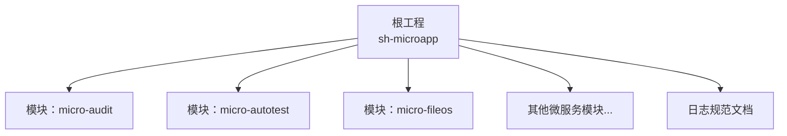
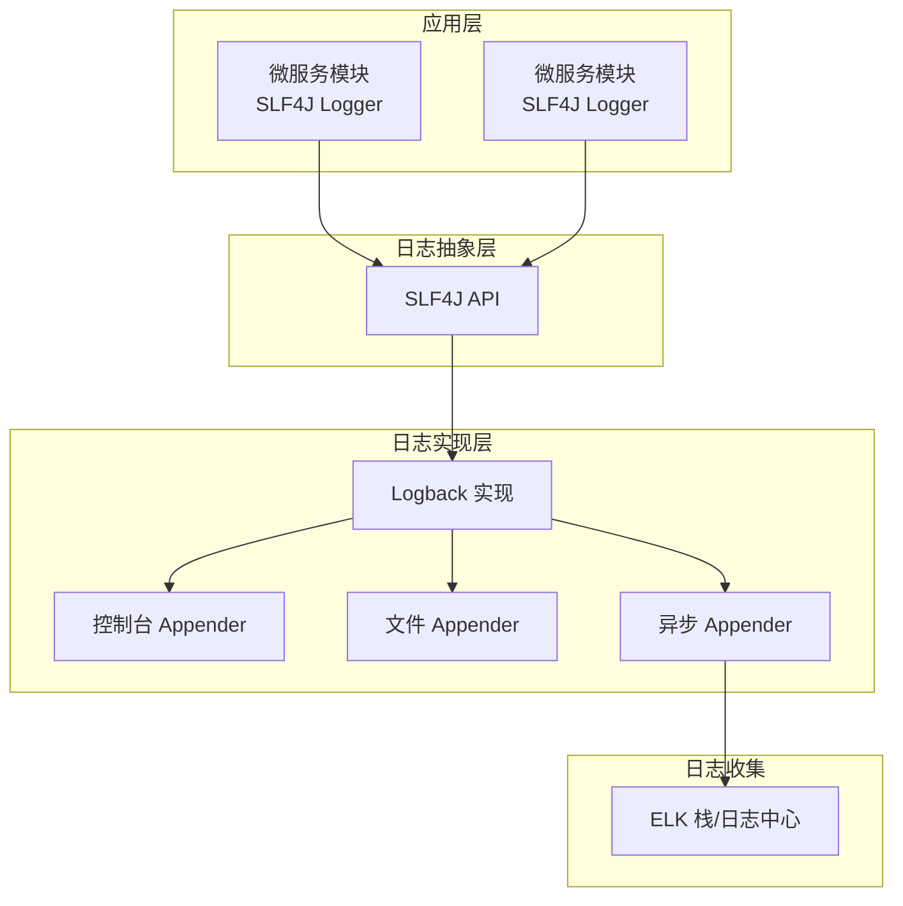
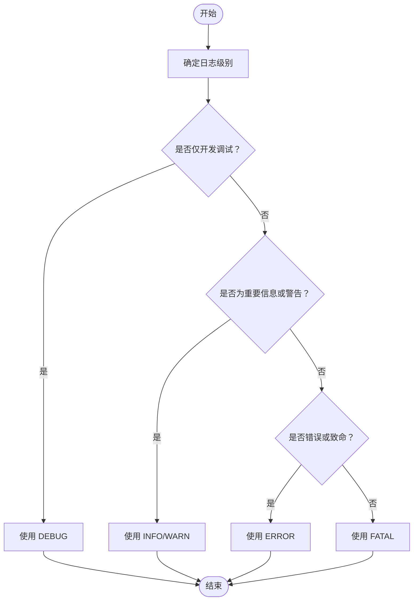
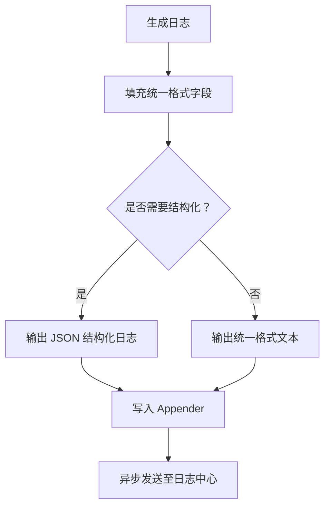
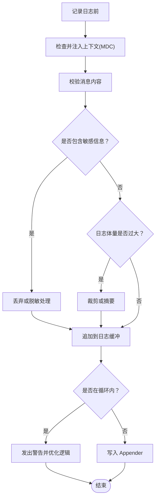
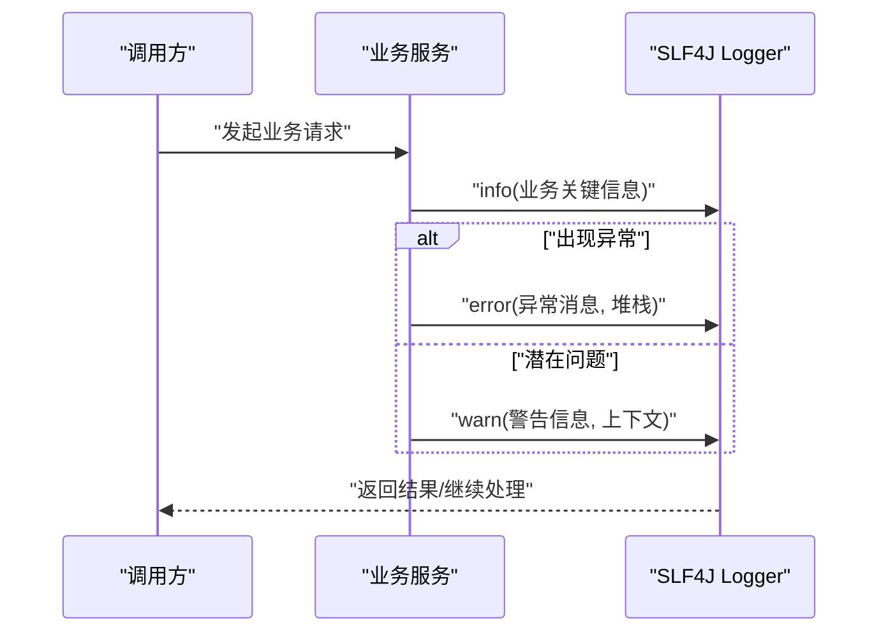
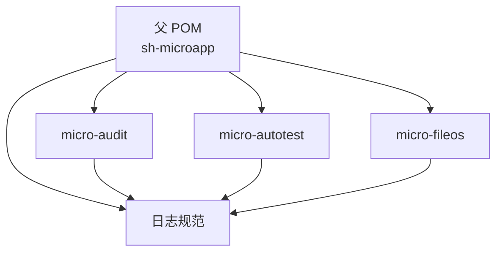
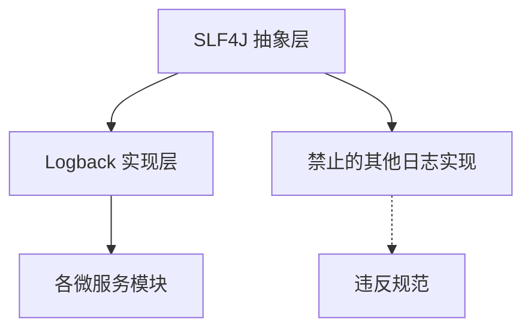

# 日志规范

<cite>
**本文引用的文件**
- [日志规范](file://docs/standards/logging.md)
- [项目总览](file://pom.xml)
- [微服务模块：micro-audit](file://micro-audit/pom.xml)
- [微服务模块：micro-autotest](file://micro-autotest/pom.xml)
- [审计模块实现示例](file://micro-audit/src/main/java/com/wkclz/micro/audit/api/impl/AuditImpl.java)
- [自动测试模块日志使用示例](file://micro-autotest/src/main/java/com/wkclz/auto/executor/TestExecutor.java)
- [自动测试模块扫描器日志使用示例](file://micro-autotest/src/main/java/com/wkclz/auto/scanner/ApiScanner.java)
- [文件存储模块警告日志示例](file://micro-fileos/src/main/java/com/wkclz/micro/fileos/api/impl/AbstractFileosApi.java)
</cite>

## 目录
1. [引言](#引言)
2. [项目结构](#项目结构)
3. [核心组件](#核心组件)
4. [架构概览](#架构概览)
5. [详细组件分析](#详细组件分析)
6. [依赖分析](#依赖分析)
7. [性能考虑](#性能考虑)
8. [故障排查指南](#故障排查指南)
9. [结论](#结论)

## 引言
本文件为 sh-microapp 微服务框架的日志规范文档，基于仓库现有标准与代码实践，明确日志框架选型、核心规则、最佳实践与性能考量。目标是统一各微服务模块的日志风格，提升可观测性与维护效率。

## 项目结构
sh-microapp 采用多模块 Maven 架构，包含多个独立的微服务模块（如 audit、autotest、fileos 等），每个模块通过统一的父 POM 进行版本与依赖管理。日志规范在顶层文档中给出统一要求，并在各模块中以 SLF4J + Logback 的方式落地。

图表来源
- [项目总览:28-48](file://pom.xml#L28-L48)
- [日志规范:1-96](file://docs/standards/logging.md#L1-L96)

章节来源
- [项目总览:1-50](file://pom.xml#L1-L50)
- [日志规范:1-96](file://docs/standards/logging.md#L1-L96)

## 核心组件
- 日志框架选型：统一使用 SLF4J + Logback，禁止在业务代码中直接引入其他日志框架（如 log4j、java.util.logging）。
- 日志级别：DEBUG/INFO/WARN/ERROR/FATAL，生产环境默认关闭 DEBUG，避免噪声。
- 日志格式：统一格式与结构化 JSON 输出，便于日志收集与检索。
- 上下文信息：所有日志必须包含必要的上下文（如 traceId、spanId、用户标识等），建议使用 MDC。
- 异常处理：异常日志必须包含堆栈信息，确保排障效率。
- 性能约束：避免在循环中打印日志；控制日志大小，不记录敏感或超大数据。

章节来源
- [日志规范:5-96](file://docs/standards/logging.md#L5-L96)

## 架构概览
整体日志架构围绕 SLF4J 抽象层与 Logback 实现层展开，结合 MDC 注入请求上下文，形成统一的日志采集与存储链路。

图表来源
- [日志规范:23-96](file://docs/standards/logging.md#L23-L96)

## 详细组件分析

### 日志级别与使用场景
- DEBUG：开发调试细节，生产关闭。
- INFO：关键业务流程与状态变化。
- WARN：潜在问题但不影响运行。
- ERROR：发生错误，系统仍可运行。
- FATAL：严重错误，可能导致系统崩溃。

图表来源
- [日志规范:7-22](file://docs/standards/logging.md#L7-L22)

章节来源
- [日志规范:7-22](file://docs/standards/logging.md#L7-L22)

### 日志格式与结构化
- 统一格式模板：包含时间戳、线程、级别、Logger 名称与消息。
- 结构化 JSON：推荐在日志中嵌入 traceId、spanId、用户标识、业务键值对等，便于检索与关联分析。

图表来源
- [日志规范:23-47](file://docs/standards/logging.md#L23-L47)

章节来源
- [日志规范:23-47](file://docs/standards/logging.md#L23-L47)

### 日志内容规范与最佳实践
- 必须包含上下文信息（如 traceId、用户标识、租户、请求参数摘要等）。
- 异常日志必须包含堆栈信息。
- 避免在循环中打印日志；避免记录敏感信息（密码、Token、隐私数据）。
- 控制日志体量，避免输出过大对象或二进制数据。
- 使用 MDC 注入请求上下文，便于跨模块串联追踪。

图表来源
- [日志规范:49-96](file://docs/standards/logging.md#L49-L96)

章节来源
- [日志规范:49-96](file://docs/standards/logging.md#L49-L96)

### 代码级日志使用示例与规范验证
- 使用注解式日志：在类上添加日志注解，简化 logger 获取与命名空间管理。
- 使用静态工厂获取 Logger：在工具类或非 Spring 环境中，通过 LoggerFactory 获取 Logger。
- 统一异常日志：异常日志需包含异常堆栈，便于快速定位问题。
- 警告日志：对潜在风险进行预警，包含关键上下文（如 ID、名称、错误原因）。

图表来源
- [审计模块实现示例:294-297](file://micro-audit/src/main/java/com/wkclz/micro/audit/api/impl/AuditImpl.java#L294-L297)
- [自动测试模块日志使用示例](file://micro-autotest/src/main/java/com/wkclz/auto/executor/TestExecutor.java#L101)
- [自动测试模块扫描器日志使用示例](file://micro-autotest/src/main/java/com/wkclz/auto/scanner/ApiScanner.java#L45)
- [文件存储模块警告日志示例:117-141](file://micro-fileos/src/main/java/com/wkclz/micro/fileos/api/impl/AbstractFileosApi.java#L117-L141)

章节来源
- [审计模块实现示例:32-32](file://micro-audit/src/main/java/com/wkclz/micro/audit/api/impl/AuditImpl.java#L32-L32)
- [审计模块实现示例:294-297](file://micro-audit/src/main/java/com/wkclz/micro/audit/api/impl/AuditImpl.java#L294-L297)
- [自动测试模块日志使用示例:11-12](file://micro-autotest/src/main/java/com/wkclz/auto/executor/TestExecutor.java#L11-L12)
- [自动测试模块日志使用示例](file://micro-autotest/src/main/java/com/wkclz/auto/executor/TestExecutor.java#L101)
- [自动测试模块扫描器日志使用示例:11-12](file://micro-autotest/src/main/java/com/wkclz/auto/scanner/ApiScanner.java#L11-L12)
- [自动测试模块扫描器日志使用示例](file://micro-autotest/src/main/java/com/wkclz/auto/scanner/ApiScanner.java#L45)
- [文件存储模块警告日志示例:117-141](file://micro-fileos/src/main/java/com/wkclz/micro/fileos/api/impl/AbstractFileosApi.java#L117-L141)

### 模块依赖与日志框架集成
- 父 POM 统一管理模块，子模块通过依赖引入框架能力。
- 各模块遵循统一日志规范，避免引入冲突的日志实现。

图表来源
- [项目总览:28-48](file://pom.xml#L28-L48)
- [微服务模块：micro-audit:22-40](file://micro-audit/pom.xml#L22-L40)
- [微服务模块：micro-autotest:22-53](file://micro-autotest/pom.xml#L22-L53)

章节来源
- [项目总览:1-50](file://pom.xml#L1-L50)
- [微服务模块：micro-audit:1-57](file://micro-audit/pom.xml#L1-L57)
- [微服务模块：micro-autotest:1-56](file://micro-autotest/pom.xml#L1-L56)

## 依赖分析
- 模块间耦合：日志规范作为横切约束，被所有模块遵守，不产生直接代码依赖。
- 外部依赖：日志框架由 SLF4J 抽象层与 Logback 实现层组成，避免直接依赖其他日志实现。
- 风险点：若某模块直接引入其他日志实现，将破坏统一性，应避免。

图表来源
- [日志规范:93-96](file://docs/standards/logging.md#L93-L96)

章节来源
- [日志规范:93-96](file://docs/standards/logging.md#L93-L96)

## 性能考虑
- 关闭 DEBUG：生产环境关闭 DEBUG 级别，降低 IO 压力。
- 异步日志：使用异步 Appender 提升吞吐，避免阻塞业务线程。
- 结构化日志：JSON 格式利于下游解析与压缩，减少传输体积。
- 上下文最小化：仅记录必要上下文，避免冗余字段导致日志膨胀。
- 循环优化：避免在循环中频繁打印日志，改为聚合后一次性输出或按阈值采样。

章节来源
- [日志规范:19-22](file://docs/standards/logging.md#L19-L22)
- [日志规范:91-96](file://docs/standards/logging.md#L91-L96)

## 故障排查指南
- 快速定位：异常日志必须包含堆栈，优先查看 ERROR/FATAL 级别日志。
- 上下文关联：通过 traceId、spanId、用户标识等字段串联请求链路。
- 常见问题：
  - 忽略异常堆栈：修正为包含异常对象的记录方法。
  - 在循环中打印：合并日志或降级为更高等级。
  - 记录敏感信息：使用脱敏或过滤策略。
  - 日志量过大：启用结构化摘要、裁剪字段或调整级别。

章节来源
- [日志规范:57-62](file://docs/standards/logging.md#L57-L62)
- [日志规范:91-96](file://docs/standards/logging.md#L91-L96)
- [自动测试模块扫描器日志使用示例](file://micro-autotest/src/main/java/com/wkclz/auto/scanner/ApiScanner.java#L266)

## 结论
通过统一 SLF4J + Logback 的日志框架、严格的日志级别与内容规范、以及结构化与异步化的输出策略，sh-microapp 能够在保证可观测性的同时兼顾性能与可维护性。请各模块严格遵循本文规范，确保日志体系的一致性与高效性。