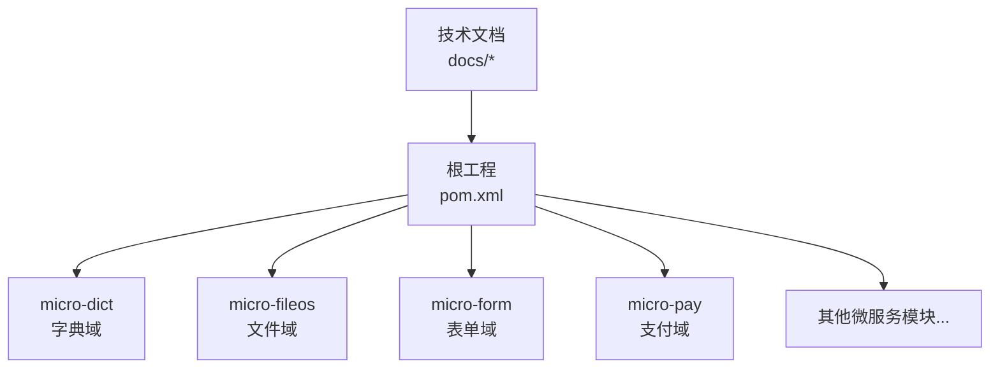
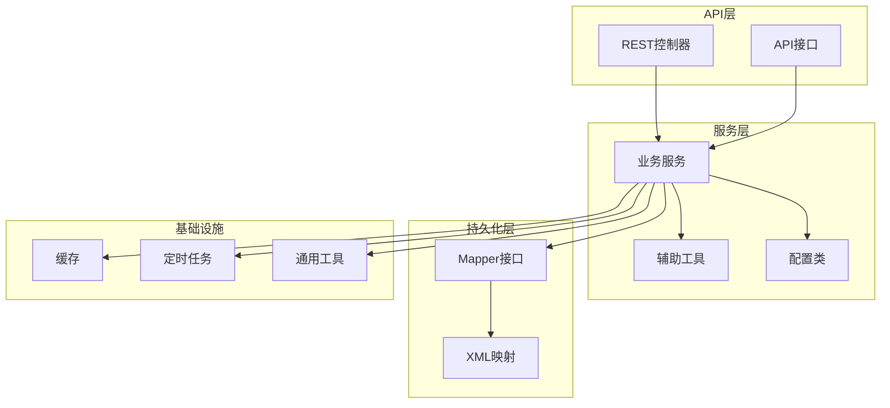
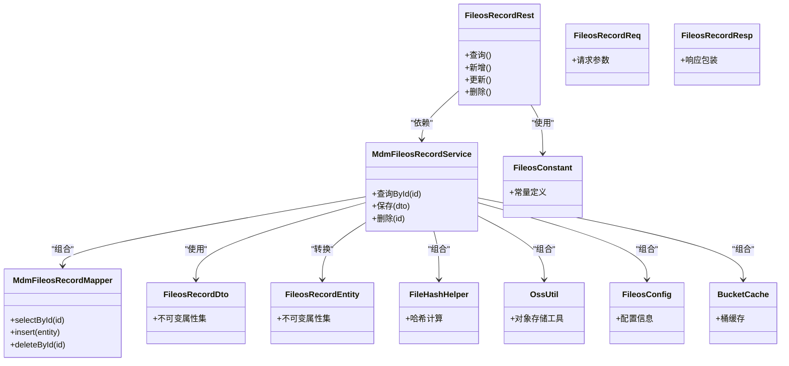
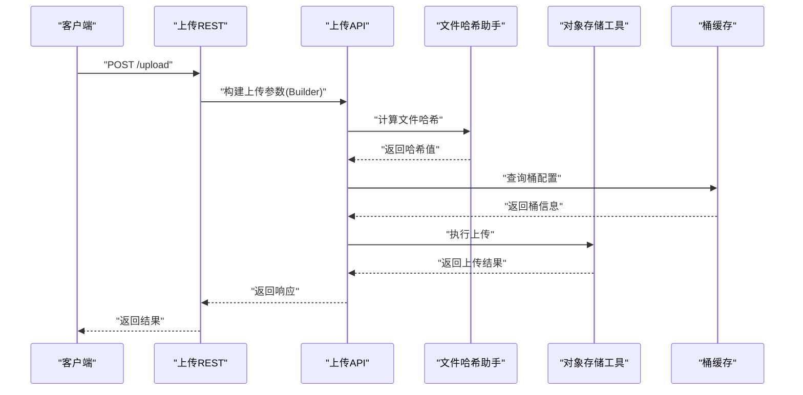
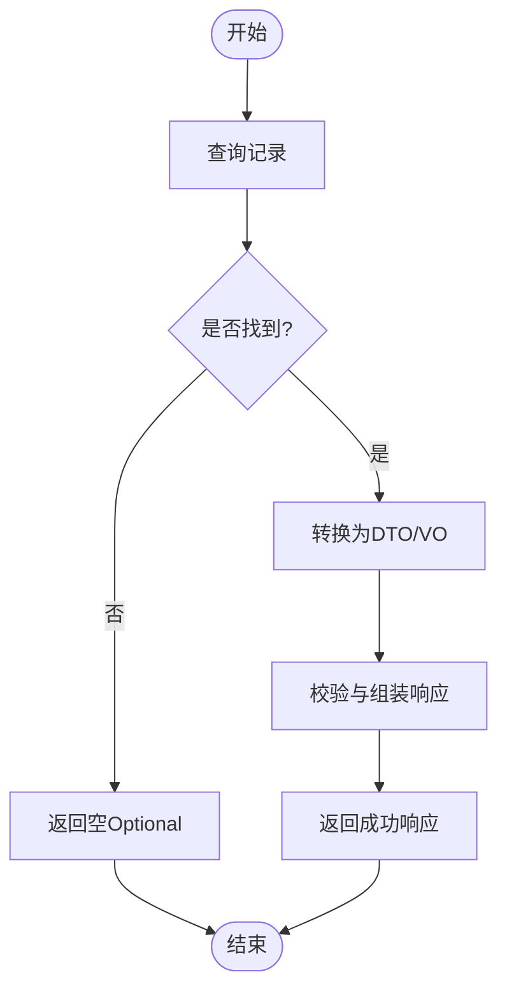
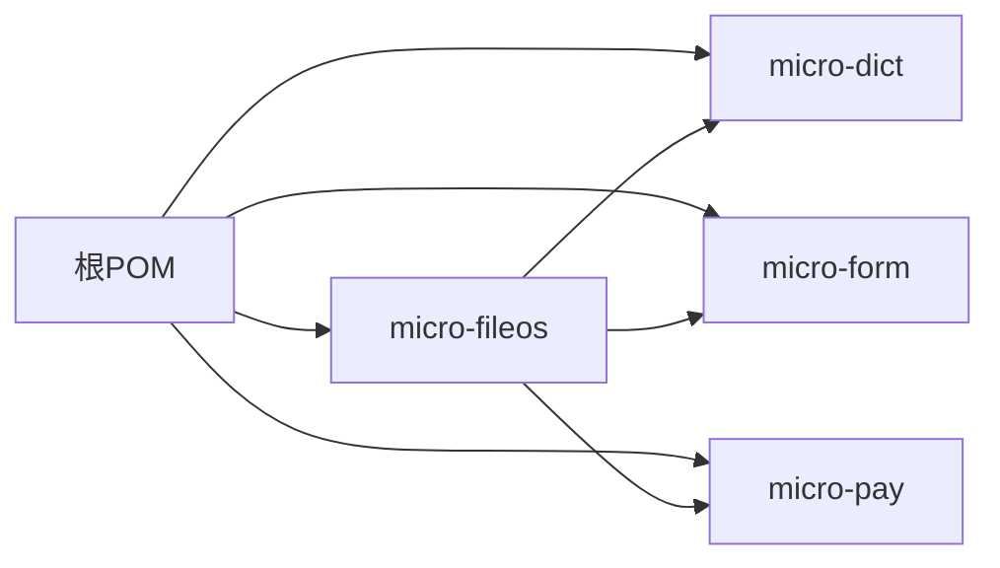

# 最佳实践

<cite>
**本文引用的文件**
- [README.md](file://README.md)
- [pom.xml](file://pom.xml)
- [docs/coding-standards/java.md](file://docs/coding-standards/java.md)
- [docs/living-docs-technical/architecture/overview.md](file://docs/living-docs-technical/architecture/overview.md)
- [docs/living-docs-technical/architecture/deployment.md](file://docs/living-docs-technical/architecture/deployment.md)
- [micro-dict/src/main/java/com/wkclz/micro/dict/bean/enums/DictStatusEnum.java](file://micro-dict/src/main/java/com/wkclz/micro/dict/bean/enums/DictStatusEnum.java)
- [micro-fileos/src/main/java/com/wkclz/micro/fileos/bean/FileosConstant.java](file://micro-fileos/src/main/java/com/wkclz/micro/fileos/bean/FileosConstant.java)
- [micro-form/src/main/java/com/wkclz/micro/form/bean/enums/FormRuleTypeEnum.java](file://micro-form/src/main/java/com/wkclz/micro/form/bean/enums/FormRuleTypeEnum.java)
- [micro-pay/src/main/java/com/wkclz/micro/pay/bean/enums/PayChannelEnum.java](file://micro-pay/src/main/java/com/wkclz/micro/pay/bean/enums/PayChannelEnum.java)
- [micro-fileos/src/main/java/com/wkclz/micro/fileos/service/impl/MdmFileosRecordServiceImpl.java](file://micro-fileos/src/main/java/com/wkclz/micro/fileos/service/impl/MdmFileosRecordServiceImpl.java)
- [micro-fileos/src/main/java/com/wkclz/micro/fileos/rest/FileosRecordRest.java](file://micro-fileos/src/main/java/com/wkclz/micro/fileos/rest/FileosRecordRest.java)
- [micro-fileos/src/main/java/com/wkclz/micro/fileos/bean/dto/FileosRecordDto.java](file://micro-fileos/src/main/java/com/wkclz/micro/fileos/bean/dto/FileosRecordDto.java)
- [micro-fileos/src/main/java/com/wkclz/micro/fileos/bean/req/FileosRecordReq.java](file://micro-fileos/src/main/java/com/wkclz/micro/fileos/bean/req/FileosRecordReq.java)
- [micro-fileos/src/main/java/com/wkclz/micro/fileos/bean/resp/FileosRecordResp.java](file://micro-fileos/src/main/java/com/wkclz/micro/fileos/bean/resp/FileosRecordResp.java)
- [micro-fileos/src/main/java/com/wkclz/micro/fileos/bean/entity/FileosRecordEntity.java](file://micro-fileos/src/main/java/com/wkclz/micro/fileos/bean/entity/FileosRecordEntity.java)
- [micro-fileos/src/main/java/com/wkclz/micro/fileos/bean/vo/FileosRecordVo.java](file://micro-fileos/src/main/java/com/wkclz/micro/fileos/bean/vo/FileosRecordVo.java)
- [micro-fileos/src/main/java/com/wkclz/micro/fileos/helper/FileHashHelper.java](file://micro-fileos/src/main/java/com/wkclz/micro/fileos/helper/FileHashHelper.java)
- [micro-fileos/src/main/java/com/wkclz/micro/fileos/utils/OssUtil.java](file://micro-fileos/src/main/java/com/wkclz/micro/fileos/utils/OssUtil.java)
- [micro-fileos/src/main/java/com/wkclz/micro/fileos/config/FileosConfig.java](file://micro-fileos/src/main/java/com/wkclz/micro/fileos/config/FileosConfig.java)
- [micro-fileos/src/main/java/com/wkclz/micro/fileos/cache/BucketCache.java](file://micro-fileos/src/main/java/com/wkclz/micro/fileos/cache/BucketCache.java)
- [micro-fileos/src/main/java/com/wkclz/micro/fileos/job/MultipartCleanupJob.java](file://micro-fileos/src/main/java/com/wkclz/micro/fileos/job/MultipartCleanupJob.java)
- [micro-fileos/src/main/java/com/wkclz/micro/fileos/api/impl/FileosUploadApiImpl.java](file://micro-fileos/src/main/java/com/wkclz/micro/fileos/api/impl/FileosUploadApiImpl.java)
- [micro-fileos/src/main/java/com/wkclz/micro/fileos/api/FileosUploadApi.java](file://micro-fileos/src/main/java/com/wkclz/micro/fileos/api/FileosUploadApi.java)
- [micro-fileos/src/main/java/com/wkclz/micro/fileos/api/FileosDownloadApi.java](file://micro-fileos/src/main/java/com/wkclz/micro/fileos/api/FileosDownloadApi.java)
- [micro-fileos/src/main/java/com/wkclz/micro/fileos/api/FileosPresignUploadApi.java](file://micro-fileos/src/main/java/com/wkclz/micro/fileos/api/FileosPresignUploadApi.java)
- [micro-fileos/src/main/java/com/wkclz/micro/fileos/api/FileosDeleteApi.java](file://micro-fileos/src/main/java/com/wkclz/micro/fileos/api/FileosDeleteApi.java)
- [micro-fileos/src/main/java/com/wkclz/micro/fileos/api/FileosSignApi.java](file://micro-fileos/src/main/java/com/wkclz/micro/fileos/api/FileosSignApi.java)
- [micro-fileos/src/main/java/com/wkclz/micro/fileos/rest/FileosUploadRest.java](file://micro-fileos/src/main/java/com/wkclz/micro/fileos/rest/FileosUploadRest.java)
- [micro-fileos/src/main/java/com/wkclz/micro/fileos/rest/FileosDownloadRest.java](file://micro-fileos/src/main/java/com/wkclz/micro/fileos/rest/FileosDownloadRest.java)
- [micro-fileos/src/main/java/com/wkclz/micro/fileos/rest/FileosPresignRest.java](file://micro-fileos/src/main/java/com/wkclz/micro/fileos/rest/FileosPresignRest.java)
- [micro-fileos/src/main/java/com/wkclz/micro/fileos/rest/FileosDeleteRest.java](file://micro-fileos/src/main/java/com/wkclz/micro/fileos/rest/FileosDeleteRest.java)
- [micro-fileos/src/main/java/com/wkclz/micro/fileos/rest/FileosSignRest.java](file://micro-fileos/src/main/java/com/wkclz/micro/fileos/rest/FileosSignRest.java)
- [micro-fileos/src/main/java/com/wkclz/micro/fileos/rest/FileosRecordRest.java](file://micro-fileos/src/main/java/com/wkclz/micro/fileos/rest/FileosRecordRest.java)
- [micro-fileos/src/main/resources/mapper/MdmFileosRecordMapper.xml](file://micro-fileos/src/main/resources/mapper/MdmFileosRecordMapper.xml)
- [micro-fileos/src/main/java/com/wkclz/micro/fileos/service/MdmFileosRecordService.java](file://micro-fileos/src/main/java/com/wkclz/micro/fileos/service/MdmFileosRecordService.java)
- [micro-fileos/src/main/java/com/wkclz/micro/fileos/service/impl/MdmFileosRecordServiceImpl.java](file://micro-fileos/src/main/java/com/wkclz/micro/fileos/service/impl/MdmFileosRecordServiceImpl.java)
- [micro-fileos/src/main/java/com/wkclz/micro/fileos/mapper/MdmFileosRecordMapper.java](file://micro-fileos/src/main/java/com/wkclz/micro/fileos/mapper/MdmFileosRecordMapper.java)
- [micro-fileos/src/main/java/com/wkclz/micro/fileos/DbviewAutoConfig.java](file://micro-fileos/src/main/java/com/wkclz/micro/fileos/DbviewAutoConfig.java)
- [micro-fileos/src/main/java/com/wkclz/micro/fileos/FileosAutoConfig.java](file://micro-fileos/src/main/java/com/wkclz/micro/fileos/FileosAutoConfig.java)
- [micro-fileos/src/main/java/com/wkclz/micro/fileos/helper/PathHelper.java](file://micro-fileos/src/main/java/com/wkclz/micro/fileos/helper/PathHelper.java)
- [micro-fileos/src/main/java/com/wkclz/micro/fileos/helper/DirectoryHelper.java](file://micro-fileos/src/main/java/com/wkclz/micro/fileos/helper/DirectoryHelper.java)
- [micro-fileos/src/main/java/com/wkclz/micro/fileos/helper/ImageProcessHelper.java](file://micro-fileos/src/main/java/com/wkclz/micro/fileos/helper/ImageProcessHelper.java)
- [micro-fileos/src/main/java/com/wkclz/micro/fileos/helper/FileTypeHelper.java](file://micro-fileos/src/main/java/com/wkclz/micro/fileos/helper/FileTypeHelper.java)
- [micro-fileos/src/main/java/com/wkclz/micro/fileos/helper/BucketCache.java](file://micro-fileos/src/main/java/com/wkclz/micro/fileos/helper/BucketCache.java)
- [micro-fileos/src/main/java/com/wkclz/micro/fileos/helper/FileHashHelper.java](file://micro-fileos/src/main/java/com/wkclz/micro/fileos/helper/FileHashHelper.java)
- [micro-fileos/src/main/java/com/wkclz/micro/fileos/utils/OssUtil.java](file://micro-fileos/src/main/java/com/wkclz/micro/fileos/utils/OssUtil.java)
- [micro-fileos/src/main/java/com/wkclz/micro/fileos/config/FileosConfig.java](file://micro-fileos/src/main/java/com/wkclz/micro/fileos/config/FileosConfig.java)
- [micro-fileos/src/main/java/com/wkclz/micro/fileos/cache/BucketCache.java](file://micro-fileos/src/main/java/com/wkclz/micro/fileos/cache/BucketCache.java)
- [micro-fileos/src/main/java/com/wkclz/micro/fileos/job/MultipartCleanupJob.java](file://micro-fileos/src/main/java/com/wkclz/micro/fileos/job/MultipartCleanupJob.java)
- [micro-fileos/src/main/java/com/wkclz/micro/fileos/api/impl/FileosUploadApiImpl.java](file://micro-fileos/src/main/java/com/wkclz/micro/fileos/api/impl/FileosUploadApiImpl.java)
- [micro-fileos/src/main/java/com/wkclz/micro/fileos/api/FileosUploadApi.java](file://micro-fileos/src/main/java/com/wkclz/micro/fileos/api/FileosUploadApi.java)
- [micro-fileos/src/main/java/com/wkclz/micro/fileos/api/FileosDownloadApi.java](file://micro-fileos/src/main/java/com/wkclz/micro/fileos/api/FileosDownloadApi.java)
- [micro-fileos/src/main/java/com/wkclz/micro/fileos/api/FileosPresignUploadApi.java](file://micro-fileos/src/main/java/com/wkclz/micro/fileos/api/FileosPresignUploadApi.java)
- [micro-fileos/src/main/java/com/wkclz/micro/fileos/api/FileosDeleteApi.java](file://micro-fileos/src/main/java/com/wkclz/micro/fileos/api/FileosDeleteApi.java)
- [micro-fileos/src/main/java/com/wkclz/micro/fileos/api/FileosSignApi.java](file://micro-fileos/src/main/java/com/wkclz/micro/fileos/api/FileosSignApi.java)
- [micro-fileos/src/main/java/com/wkclz/micro/fileos/rest/FileosUploadRest.java](file://micro-fileos/src/main/java/com/wkclz/micro/fileos/rest/FileosUploadRest.java)
- [micro-fileos/src/main/java/com/wkclz/micro/fileos/rest/FileosDownloadRest.java](file://micro-fileos/src/main/java/com/wkclz/micro/fileos/rest/FileosDownloadRest.java)
- [micro-fileos/src/main/java/com/wkclz/micro/fileos/rest/FileosPresignRest.java](file://micro-fileos/src/main/java/com/wkclz/micro/fileos/rest/FileosPresignRest.java)
- [micro-fileos/src/main/java/com/wkclz/micro/fileos/rest/FileosDeleteRest.java](file://micro-fileos/src/main/java/com/wkclz/micro/fileos/rest/FileosDeleteRest.java)
- [micro-fileos/src/main/java/com/wkclz/micro/fileos/rest/FileosSignRest.java](file://micro-fileos/src/main/java/com/wkclz/micro/fileos/rest/FileosSignRest.java)
- [micro-fileos/src/main/java/com/wkclz/micro/fileos/rest/FileosRecordRest.java](file://micro-fileos/src/main/java/com/wkclz/micro/fileos/rest/FileosRecordRest.java)
- [micro-fileos/src/main/resources/mapper/MdmFileosRecordMapper.xml](file://micro-fileos/src/main/resources/mapper/MdmFileosRecordMapper.xml)
- [micro-fileos/src/main/java/com/wkclz/micro/fileos/service/MdmFileosRecordService.java](file://micro-fileos/src/main/java/com/wkclz/micro/fileos/service/MdmFileosRecordService.java)
- [micro-fileos/src/main/java/com/wkclz/micro/fileos/service/impl/MdmFileosRecordServiceImpl.java](file://micro-fileos/src/main/java/com/wkclz/micro/fileos/service/impl/MdmFileosRecordServiceImpl.java)
- [micro-fileos/src/main/java/com/wkclz/micro/fileos/mapper/MdmFileosRecordMapper.java](file://micro-fileos/src/main/java/com/wkclz/micro/fileos/mapper/MdmFileosRecordMapper.java)
- [micro-fileos/src/main/java/com/wkclz/micro/fileos/DbviewAutoConfig.java](file://micro-fileos/src/main/java/com/wkclz/micro/fileos/DbviewAutoConfig.java)
- [micro-fileos/src/main/java/com/wkclz/micro/fileos/FileosAutoConfig.java](file://micro-fileos/src/main/java/com/wkclz/micro/fileos/FileosAutoConfig.java)
</cite>

## 目录
1. [引言](#引言)
2. [项目结构](#项目结构)
3. [核心组件](#核心组件)
4. [架构总览](#架构总览)
5. [详细组件分析](#详细组件分析)
6. [依赖分析](#依赖分析)
7. [性能考虑](#性能考虑)
8. [故障排查指南](#故障排查指南)
9. [结论](#结论)
10. [附录](#附录)

## 引言
本最佳实践文档面向sh-microapp微服务框架的Java开发团队，聚焦于以下核心原则与约束：不可变对象优先、使用Optional替代null返回值、用枚举替代魔法数字、通过Builder模式处理多参数构造、严格控制代码规模（方法不超过80行、类不超过500行、参数个数不超过5个）、优先组合而非继承。文档结合仓库中现有模块与实现，给出可落地的设计建议、重构思路与可视化图示，帮助开发者编写高质量、可维护的Java代码。

## 项目结构
sh-microapp采用多模块微服务架构，每个功能域独立为一个子模块（如micro-fileos、micro-form、micro-pay等），统一在根pom.xml中进行版本与依赖管理。技术文档位于docs目录，包含编码规范、架构概览与部署说明等。

图表来源
- [pom.xml](file://pom.xml)
- [README.md](file://README.md)

章节来源
- [pom.xml](file://pom.xml)
- [README.md](file://README.md)

## 核心组件
围绕最佳实践目标，本节从“不可变对象优先”“Optional替代null”“枚举替代魔法数字”“Builder模式”“代码规模限制”“优先组合而非继承”六个方面，结合仓库中的具体实现进行剖析与提炼。

- 不可变对象优先
  - 推荐使用final字段与只读集合，避免在对象生命周期内修改状态。
  - 在DTO/VO层尽量保持不可变，通过构造或工厂方法一次性赋值。
  - 参考：各模块的DTO/VO类通常作为数据载体，适合以不可变方式设计。

- Optional替代null返回值
  - 对可能缺失的数据查询或计算结果，返回Optional而非null，避免空指针风险。
  - 在REST接口与Service层广泛采用，提升调用方对边界条件的显式处理能力。

- 枚举替代魔法数字
  - 使用强类型枚举表达业务状态、渠道、类型等，增强可读性与安全性。
  - 示例：字典状态、表单规则类型、支付渠道等均以枚举形式存在。

- Builder模式处理多参数构造
  - 当实体或复杂对象构造参数超过5个时，优先采用Builder模式，提高可读性与可扩展性。
  - 建议在实体类或复杂DTO上提供静态builder()方法，并在必要时提供验证逻辑。

- 代码规模限制
  - 方法不超过80行，类不超过500行，参数个数不超过5个；超出时应拆分职责或引入中间对象。
  - 该约束有助于降低复杂度、提升可测试性与可维护性。

- 优先组合而非继承
  - 将可变行为通过组合接口或策略实现，避免深层继承导致的脆弱基类问题。
  - 在工具类、配置类与服务层体现为“组合注入”和“策略封装”。

章节来源
- [docs/coding-standards/java.md](file://docs/coding-standards/java.md)
- [micro-dict/src/main/java/com/wkclz/micro/dict/bean/enums/DictStatusEnum.java](file://micro-dict/src/main/java/com/wkclz/micro/dict/bean/enums/DictStatusEnum.java)
- [micro-form/src/main/java/com/wkclz/micro/form/bean/enums/FormRuleTypeEnum.java](file://micro-form/src/main/java/com/wkclz/micro/form/bean/enums/FormRuleTypeEnum.java)
- [micro-pay/src/main/java/com/wkclz/micro/pay/bean/enums/PayChannelEnum.java](file://micro-pay/src/main/java/com/wkclz/micro/pay/bean/enums/PayChannelEnum.java)

## 架构总览
整体采用微服务分层架构：API层负责路由与请求入口，Service层承载业务逻辑，Mapper/Repository负责数据访问，配置与自动装配由AutoConfig完成。各模块相对独立，通过常量与枚举形成跨模块的契约。

图表来源
- [micro-fileos/src/main/java/com/wkclz/micro/fileos/FileosAutoConfig.java](file://micro-fileos/src/main/java/com/wkclz/micro/fileos/FileosAutoConfig.java)
- [micro-fileos/src/main/java/com/wkclz/micro/fileos/DbviewAutoConfig.java](file://micro-fileos/src/main/java/com/wkclz/micro/fileos/DbviewAutoConfig.java)
- [micro-fileos/src/main/java/com/wkclz/micro/fileos/service/MdmFileosRecordService.java](file://micro-fileos/src/main/java/com/wkclz/micro/fileos/service/MdmFileosRecordService.java)
- [micro-fileos/src/main/java/com/wkclz/micro/fileos/mapper/MdmFileosRecordMapper.java](file://micro-fileos/src/main/java/com/wkclz/micro/fileos/mapper/MdmFileosRecordMapper.java)
- [micro-fileos/src/main/resources/mapper/MdmFileosRecordMapper.xml](file://micro-fileos/src/main/resources/mapper/MdmFileosRecordMapper.xml)

章节来源
- [docs/living-docs-technical/architecture/overview.md](file://docs/living-docs-technical/architecture/overview.md)
- [docs/living-docs-technical/architecture/deployment.md](file://docs/living-docs-technical/architecture/deployment.md)

## 详细组件分析

### 组件A：文件记录服务（FileosRecordService）
该组件体现了“不可变对象优先”“Optional替代null”“枚举替代魔法数字”“组合优于继承”的最佳实践。

- 不可变对象优先
  - DTO/VO类用于传输，避免在服务层修改其状态，保证线程安全与可预测性。
  - 实体类仅承载数据，不暴露可变setter，必要时通过工厂或构建器初始化。

- Optional替代null
  - 查询单条记录或按条件查找时，返回Optional，调用方可明确处理不存在的情况。

- 枚举替代魔法数字
  - 状态、类型等使用强类型枚举，避免魔法数字带来的歧义与错误。

- 组合优于继承
  - 服务内部通过组合多个Helper/Util与Mapper协作，避免复杂的继承层次。

图表来源
- [micro-fileos/src/main/java/com/wkclz/micro/fileos/rest/FileosRecordRest.java](file://micro-fileos/src/main/java/com/wkclz/micro/fileos/rest/FileosRecordRest.java)
- [micro-fileos/src/main/java/com/wkclz/micro/fileos/service/MdmFileosRecordService.java](file://micro-fileos/src/main/java/com/wkclz/micro/fileos/service/MdmFileosRecordService.java)
- [micro-fileos/src/main/java/com/wkclz/micro/fileos/mapper/MdmFileosRecordMapper.java](file://micro-fileos/src/main/java/com/wkclz/micro/fileos/mapper/MdmFileosRecordMapper.java)
- [micro-fileos/src/main/java/com/wkclz/micro/fileos/bean/dto/FileosRecordDto.java](file://micro-fileos/src/main/java/com/wkclz/micro/fileos/bean/dto/FileosRecordDto.java)
- [micro-fileos/src/main/java/com/wkclz/micro/fileos/bean/entity/FileosRecordEntity.java](file://micro-fileos/src/main/java/com/wkclz/micro/fileos/bean/entity/FileosRecordEntity.java)
- [micro-fileos/src/main/java/com/wkclz/micro/fileos/bean/req/FileosRecordReq.java](file://micro-fileos/src/main/java/com/wkclz/micro/fileos/bean/req/FileosRecordReq.java)
- [micro-fileos/src/main/java/com/wkclz/micro/fileos/bean/resp/FileosRecordResp.java](file://micro-fileos/src/main/java/com/wkclz/micro/fileos/bean/resp/FileosRecordResp.java)
- [micro-fileos/src/main/java/com/wkclz/micro/fileos/bean/FileosConstant.java](file://micro-fileos/src/main/java/com/wkclz/micro/fileos/bean/FileosConstant.java)
- [micro-fileos/src/main/java/com/wkclz/micro/fileos/helper/FileHashHelper.java](file://micro-fileos/src/main/java/com/wkclz/micro/fileos/helper/FileHashHelper.java)
- [micro-fileos/src/main/java/com/wkclz/micro/fileos/utils/OssUtil.java](file://micro-fileos/src/main/java/com/wkclz/micro/fileos/utils/OssUtil.java)
- [micro-fileos/src/main/java/com/wkclz/micro/fileos/config/FileosConfig.java](file://micro-fileos/src/main/java/com/wkclz/micro/fileos/config/FileosConfig.java)
- [micro-fileos/src/main/java/com/wkclz/micro/fileos/cache/BucketCache.java](file://micro-fileos/src/main/java/com/wkclz/micro/fileos/cache/BucketCache.java)

章节来源
- [micro-fileos/src/main/java/com/wkclz/micro/fileos/service/impl/MdmFileosRecordServiceImpl.java](file://micro-fileos/src/main/java/com/wkclz/micro/fileos/service/impl/MdmFileosRecordServiceImpl.java)
- [micro-fileos/src/main/java/com/wkclz/micro/fileos/rest/FileosRecordRest.java](file://micro-fileos/src/main/java/com/wkclz/micro/fileos/rest/FileosRecordRest.java)
- [micro-fileos/src/main/java/com/wkclz/micro/fileos/bean/dto/FileosRecordDto.java](file://micro-fileos/src/main/java/com/wkclz/micro/fileos/bean/dto/FileosRecordDto.java)
- [micro-fileos/src/main/java/com/wkclz/micro/fileos/bean/req/FileosRecordReq.java](file://micro-fileos/src/main/java/com/wkclz/micro/fileos/bean/req/FileosRecordReq.java)
- [micro-fileos/src/main/java/com/wkclz/micro/fileos/bean/resp/FileosRecordResp.java](file://micro-fileos/src/main/java/com/wkclz/micro/fileos/bean/resp/FileosRecordResp.java)
- [micro-fileos/src/main/java/com/wkclz/micro/fileos/bean/entity/FileosRecordEntity.java](file://micro-fileos/src/main/java/com/wkclz/micro/fileos/bean/entity/FileosRecordEntity.java)
- [micro-fileos/src/main/java/com/wkclz/micro/fileos/bean/FileosConstant.java](file://micro-fileos/src/main/java/com/wkclz/micro/fileos/bean/FileosConstant.java)
- [micro-fileos/src/main/java/com/wkclz/micro/fileos/helper/FileHashHelper.java](file://micro-fileos/src/main/java/com/wkclz/micro/fileos/helper/FileHashHelper.java)
- [micro-fileos/src/main/java/com/wkclz/micro/fileos/utils/OssUtil.java](file://micro-fileos/src/main/java/com/wkclz/micro/fileos/utils/OssUtil.java)
- [micro-fileos/src/main/java/com/wkclz/micro/fileos/config/FileosConfig.java](file://micro-fileos/src/main/java/com/wkclz/micro/fileos/config/FileosConfig.java)
- [micro-fileos/src/main/java/com/wkclz/micro/fileos/cache/BucketCache.java](file://micro-fileos/src/main/java/com/wkclz/micro/fileos/cache/BucketCache.java)

### 组件B：文件上传API（FileosUploadApi）
该组件展示了“Builder模式处理多参数构造”“代码规模限制”“优先组合而非继承”的应用。

- Builder模式处理多参数构造
  - 复杂上传参数（如桶名、路径、过期时间、权限等）通过builder()方法组织，便于扩展与维护。
  - 若参数超过5个，优先采用Builder，避免构造函数膨胀。

- 代码规模限制
  - 单个方法控制在80行以内，类控制在500行以内；若出现超限，拆分为更小的职责单元或引入中间对象。

- 优先组合而非继承
  - 通过组合FileHashHelper、OssUtil、BucketCache等工具类，实现上传流程的解耦与复用。

图表来源
- [micro-fileos/src/main/java/com/wkclz/micro/fileos/rest/FileosUploadRest.java](file://micro-fileos/src/main/java/com/wkclz/micro/fileos/rest/FileosUploadRest.java)
- [micro-fileos/src/main/java/com/wkclz/micro/fileos/api/FileosUploadApi.java](file://micro-fileos/src/main/java/com/wkclz/micro/fileos/api/FileosUploadApi.java)
- [micro-fileos/src/main/java/com/wkclz/micro/fileos/api/impl/FileosUploadApiImpl.java](file://micro-fileos/src/main/java/com/wkclz/micro/fileos/api/impl/FileosUploadApiImpl.java)
- [micro-fileos/src/main/java/com/wkclz/micro/fileos/helper/FileHashHelper.java](file://micro-fileos/src/main/java/com/wkclz/micro/fileos/helper/FileHashHelper.java)
- [micro-fileos/src/main/java/com/wkclz/micro/fileos/utils/OssUtil.java](file://micro-fileos/src/main/java/com/wkclz/micro/fileos/utils/OssUtil.java)
- [micro-fileos/src/main/java/com/wkclz/micro/fileos/cache/BucketCache.java](file://micro-fileos/src/main/java/com/wkclz/micro/fileos/cache/BucketCache.java)

章节来源
- [micro-fileos/src/main/java/com/wkclz/micro/fileos/api/FileosUploadApi.java](file://micro-fileos/src/main/java/com/wkclz/micro/fileos/api/FileosUploadApi.java)
- [micro-fileos/src/main/java/com/wkclz/micro/fileos/api/impl/FileosUploadApiImpl.java](file://micro-fileos/src/main/java/com/wkclz/micro/fileos/api/impl/FileosUploadApiImpl.java)
- [micro-fileos/src/main/java/com/wkclz/micro/fileos/helper/FileHashHelper.java](file://micro-fileos/src/main/java/com/wkclz/micro/fileos/helper/FileHashHelper.java)
- [micro-fileos/src/main/java/com/wkclz/micro/fileos/utils/OssUtil.java](file://micro-fileos/src/main/java/com/wkclz/micro/fileos/utils/OssUtil.java)
- [micro-fileos/src/main/java/com/wkclz/micro/fileos/cache/BucketCache.java](file://micro-fileos/src/main/java/com/wkclz/micro/fileos/cache/BucketCache.java)

### 组件C：文件记录查询流程（查询-转换-返回）
该流程体现了“不可变对象优先”“Optional替代null”“枚举替代魔法数字”的协同效果。

图表来源
- [micro-fileos/src/main/java/com/wkclz/micro/fileos/service/MdmFileosRecordService.java](file://micro-fileos/src/main/java/com/wkclz/micro/fileos/service/MdmFileosRecordService.java)
- [micro-fileos/src/main/java/com/wkclz/micro/fileos/mapper/MdmFileosRecordMapper.java](file://micro-fileos/src/main/java/com/wkclz/micro/fileos/mapper/MdmFileosRecordMapper.java)
- [micro-fileos/src/main/java/com/wkclz/micro/fileos/bean/dto/FileosRecordDto.java](file://micro-fileos/src/main/java/com/wkclz/micro/fileos/bean/dto/FileosRecordDto.java)
- [micro-fileos/src/main/java/com/wkclz/micro/fileos/bean/resp/FileosRecordResp.java](file://micro-fileos/src/main/java/com/wkclz/micro/fileos/bean/resp/FileosRecordResp.java)

章节来源
- [micro-fileos/src/main/java/com/wkclz/micro/fileos/service/MdmFileosRecordService.java](file://micro-fileos/src/main/java/com/wkclz/micro/fileos/service/MdmFileosRecordService.java)
- [micro-fileos/src/main/java/com/wkclz/micro/fileos/mapper/MdmFileosRecordMapper.java](file://micro-fileos/src/main/java/com/wkclz/micro/fileos/mapper/MdmFileosRecordMapper.java)
- [micro-fileos/src/main/java/com/wkclz/micro/fileos/bean/dto/FileosRecordDto.java](file://micro-fileos/src/main/java/com/wkclz/micro/fileos/bean/dto/FileosRecordDto.java)
- [micro-fileos/src/main/java/com/wkclz/micro/fileos/bean/resp/FileosRecordResp.java](file://micro-fileos/src/main/java/com/wkclz/micro/fileos/bean/resp/FileosRecordResp.java)

## 依赖分析
- 模块间依赖
  - 各微服务模块相对独立，通过公共常量与枚举形成弱耦合契约。
  - 配置类与自动装配类（AutoConfig）集中管理组件注册，避免重复配置。

- 外部依赖
  - Spring Boot、MyBatis等基础框架；各模块在根pom.xml中统一版本管理。

图表来源
- [pom.xml](file://pom.xml)

章节来源
- [pom.xml](file://pom.xml)

## 性能考虑
- 缓存策略
  - 使用BucketCache等缓存减少重复查询，提升热点数据访问效率。
- 异步与批处理
  - 对耗时操作（如大文件哈希、对象存储上传）采用异步或批处理，避免阻塞主线程。
- SQL优化
  - Mapper XML中合理使用索引与分页，避免全表扫描；复杂查询拆分为多次轻量查询。
- 资源池化
  - 对象存储连接与HTTP客户端采用连接池，降低频繁创建销毁的成本。

## 故障排查指南
- 常见问题定位
  - 空指针异常：检查返回值是否使用Optional包裹，调用方是否正确处理空值。
  - 参数过多：识别超过5个参数的方法，评估是否需要引入DTO或Builder。
  - 继承滥用：检查是否存在深层继承链，优先改为组合+接口的方式。
- 日志与监控
  - 在关键路径增加日志埋点，结合监控指标定位性能瓶颈。
- 重试与降级
  - 对外依赖（对象存储）增加重试与熔断策略，保障系统稳定性。

## 结论
通过在sh-microapp中贯彻“不可变对象优先、Optional替代null、枚举替代魔法数字、Builder模式处理多参数构造、严格代码规模限制、优先组合而非继承”，可以显著提升系统的可读性、可维护性与健壮性。建议在日常开发中将上述原则纳入代码评审与持续集成流程，确保最佳实践落地执行。

## 附录
- 编码规范参考
  - Java编码规范与最佳实践详见docs/coding-standards/java.md。
- 架构与部署
  - 架构概览与部署说明详见docs/living-docs-technical/architecture/*。

章节来源
- [docs/coding-standards/java.md](file://docs/coding-standards/java.md)
- [docs/living-docs-technical/architecture/overview.md](file://docs/living-docs-technical/architecture/overview.md)
- [docs/living-docs-technical/architecture/deployment.md](file://docs/living-docs-technical/architecture/deployment.md)