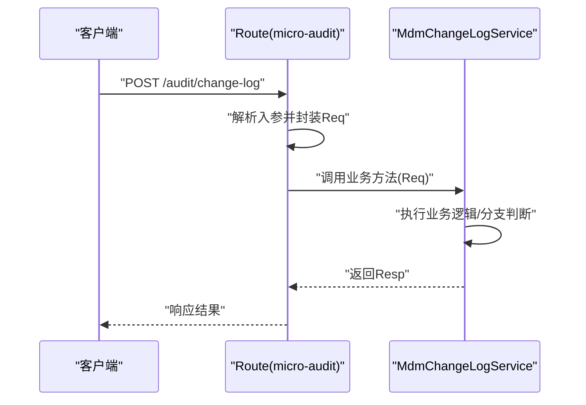
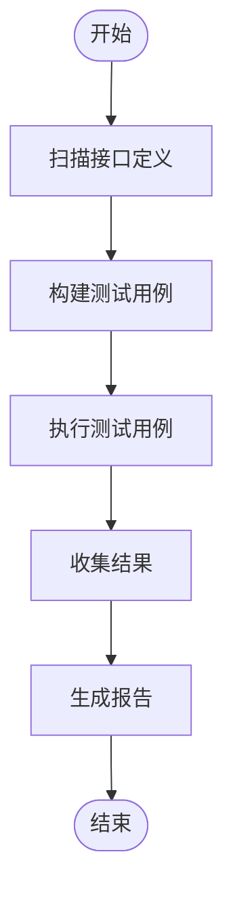
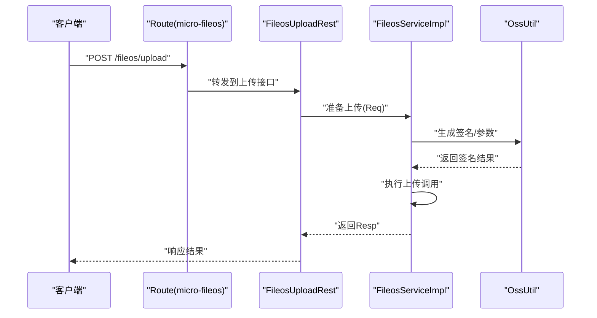
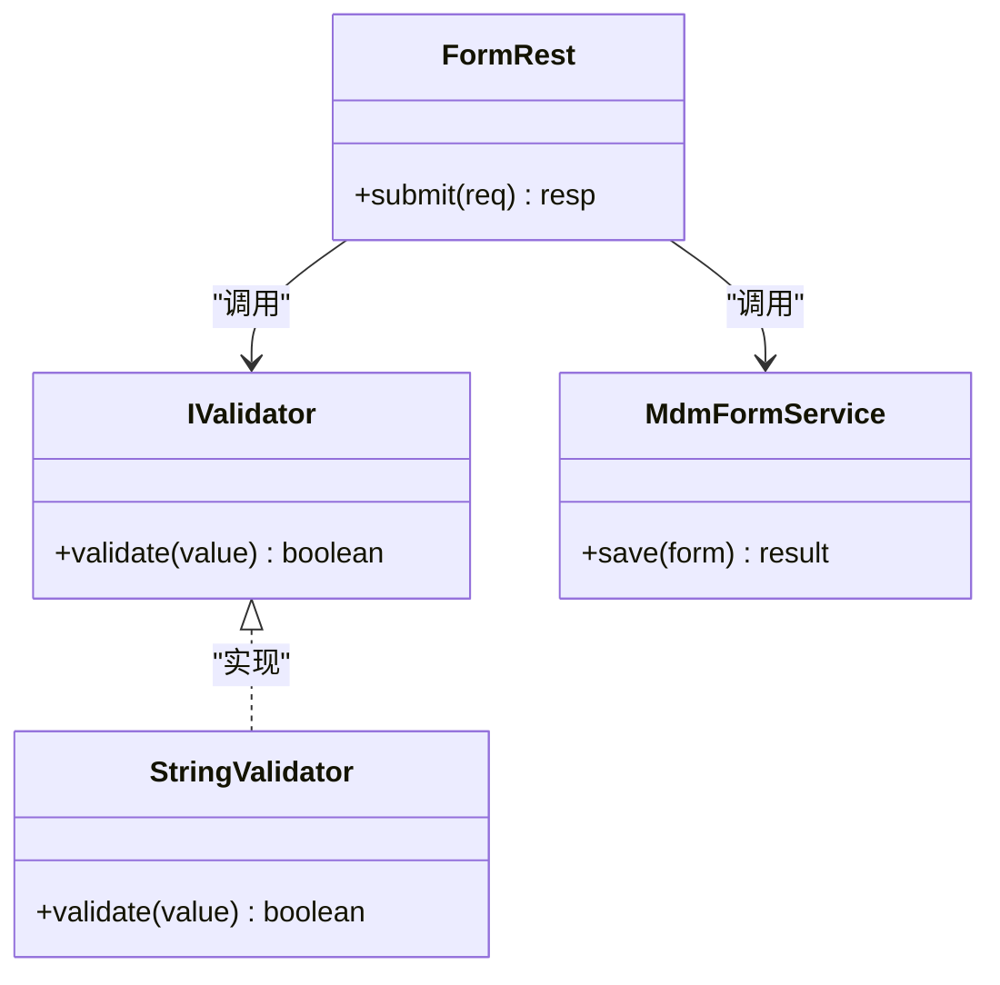
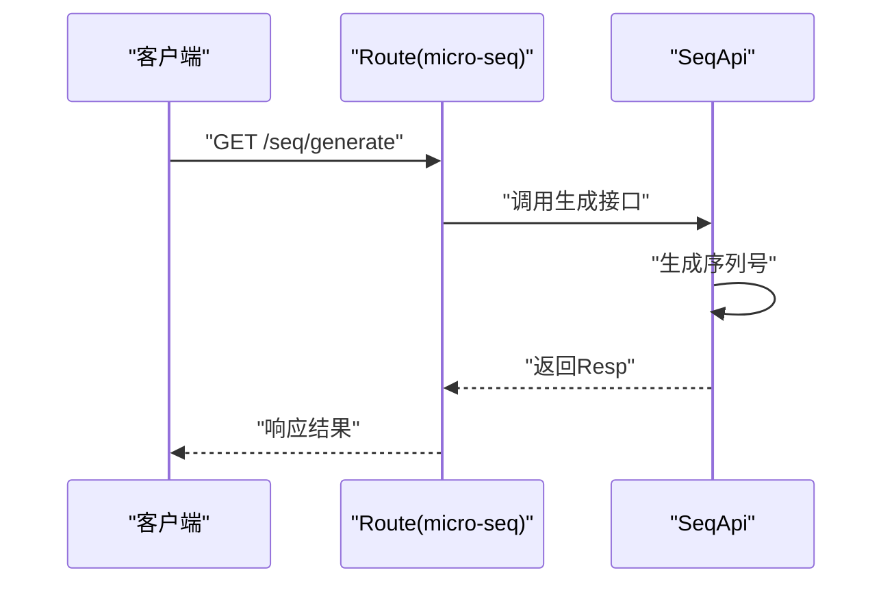
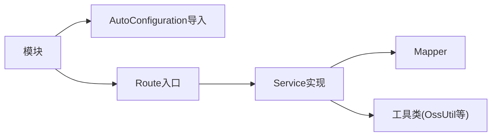

# 核心编码规则

<cite>
**本文档引用的文件**
- [AGENTS.md](file://AGENTS.md)
- [micro-dbview/AGENTS.md](file://micro-dbview/AGENTS.md)
- [micro-fileos/AGENTS.md](file://micro-fileos/AGENTS.md)
- [micro-report/AGENTS.md](file://micro-report/AGENTS.md)
- [docs/coding-standards/java.md](file://docs/coding-standards/java.md)
- [docs/living-docs-business/rules/README.md](file://docs/living-docs-business/rules/README.md)
- [docs/dev-process.md](file://docs/dev-process.md)
- [docs/harness-spec.md](file://docs/harness-spec.md)
- [micro-audit/src/main/java/com/wkclz/micro/audit/rest/Route.java](file://micro-audit/src/main/java/com/wkclz/micro/audit/rest/Route.java)
- [micro-audit/src/main/java/com/wkclz/micro/audit/api/AuditApi.java](file://micro-audit/src/main/java/com/wkclz/micro/audit/api/AuditApi.java)
- [micro-audit/src/main/java/com/wkclz/micro/audit/service/MdmChangeLogService.java](file://micro-audit/src/main/java/com/wkclz/micro/audit/service/MdmChangeLogService.java)
- [micro-autotest/src/main/java/com/wkclz/auto/rest/AutoTestRest.java](file://micro-autotest/src/main/java/com/wkclz/auto/rest/AutoTestRest.java)
- [micro-autotest/src/main/java/com/wkclz/auto/scanner/ApiScanner.java](file://micro-autotest/src/main/java/com/wkclz/auto/scanner/ApiScanner.java)
- [micro-autotest/src/main/java/com/wkclz/auto/executor/TestExecutor.java](file://micro-autotest/src/main/java/com/wkclz/auto/executor/TestExecutor.java)
- [micro-autotest/src/main/java/com/wkclz/auto/report/ReportGenerator.java](file://micro-autotest/src/main/java/com/wkclz/auto/report/ReportGenerator.java)
- [micro-autotest/src/main/resources/META-INF/spring/org.springframework.boot.autoconfigure.AutoConfiguration.imports](file://micro-autotest/src/main/resources/META-INF/spring/org.springframework.boot.autoconfigure.AutoConfiguration.imports)
- [micro-autotest/README.md](file://micro-autotest/README.md)
- [micro-dbview/src/main/java/com/wkclz/micro/dbview/rest/Route.java](file://micro-dbview/src/main/java/com/wkclz/micro/dbview/rest/Route.java)
- [micro-dbview/src/main/java/com/wkclz/micro/dbview/rest/DatasourceRest.java](file://micro-dbview/src/main/java/com/wkclz/micro/dbview/rest/DatasourceRest.java)
- [micro-dbview/src/main/java/com/wkclz/micro/dbview/service/DbviewDatasourceService.java](file://micro-dbview/src/main/java/com/wkclz/micro/dbview/service/DbviewDatasourceService.java)
- [micro-dbview/src/main/java/com/wkclz/micro/dbview/mapper/DbviewDatasourceMapper.java](file://micro-dbview/src/main/java/com/wkclz/micro/dbview/mapper/DbviewDatasourceMapper.java)
- [micro-dbview/src/main/resources/META-INF/spring/org.springframework.boot.autoconfigure.AutoConfiguration.imports](file://micro-dbview/src/main/resources/META-INF/spring/org.springframework.boot.autoconfigure.AutoConfiguration.imports)
- [micro-fileos/src/main/java/com/wkclz/micro/fileos/rest/Route.java](file://micro-fileos/src/main/java/com/wkclz/micro/fileos/rest/Route.java)
- [micro-fileos/src/main/java/com/wkclz/micro/fileos/rest/FileosUploadRest.java](file://micro-fileos/src/main/java/com/wkclz/micro/fileos/rest/FileosUploadRest.java)
- [micro-fileos/src/main/java/com/wkclz/micro/fileos/service/impl/FileosServiceImpl.java](file://micro-fileos/src/main/java/com/wkclz/micro/fileos/service/impl/FileosServiceImpl.java)
- [micro-fileos/src/main/java/com/wkclz/micro/fileos/utils/OssUtil.java](file://micro-fileos/src/main/java/com/wkclz/micro/fileos/utils/OssUtil.java)
- [micro-fileos/src/main/resources/META-INF/spring/org.springframework.boot.autoconfigure.AutoConfiguration.imports](file://micro-fileos/src/main/resources/META-INF/spring/org.springframework.boot.autoconfigure.AutoConfiguration.imports)
- [micro-form/src/main/java/com/wkclz/micro/form/rest/Route.java](file://micro-form/src/main/java/com/wkclz/micro/form/rest/Route.java)
- [micro-form/src/main/java/com/wkclz/micro/form/rest/FormRest.java](file://micro-form/src/main/java/com/wkclz/micro/form/rest/FormRest.java)
- [micro-form/src/main/java/com/wkclz/micro/form/service/MdmFormService.java](file://micro-form/src/main/java/com/wkclz/micro/form/service/MdmFormService.java)
- [micro-form/src/main/java/com/wkclz/micro/form/validator/IValidator.java](file://micro-form/src/main/java/com/wkclz/micro/form/validator/IValidator.java)
- [micro-form/src/main/java/com/wkclz/micro/form/validator/impl/StringValidator.java](file://micro-form/src/main/java/com/wkclz/micro/form/validator/impl/StringValidator.java)
- [micro-form/src/main/resources/META-INF/spring/org.springframework.boot.autoconfigure.AutoConfiguration.imports](file://micro-form/src/main/resources/META-INF/spring/org.springframework.boot.autoconfigure.AutoConfiguration.imports)
- [micro-fun/src/main/java/com/wkclz/micro/fun/rest/Route.java](file://micro-fun/src/main/java/com/wkclz/micro/fun/rest/Route.java)
- [micro-fun/src/main/java/com/wkclz/micro/fun/engine/ScriptEngine.java](file://micro-fun/src/main/java/com/wkclz/micro/fun/engine/ScriptEngine.java)
- [micro-fun/src/main/java/com/wkclz/micro/fun/engine/ScriptService.java](file://micro-fun/src/main/java/com/wkclz/micro/fun/engine/ScriptService.java)
- [micro-fun/src/main/resources/META-INF/spring/org.springframework.boot.autoconfigure.AutoConfiguration.imports](file://micro-fun/src/main/resources/META-INF/spring/org.springframework.boot.autoconfigure.AutoConfiguration.imports)
- [micro-k8s/src/main/java/com/wkclz/micro/k8s/Route.java](file://micro-k8s/src/main/java/com/wkclz/micro/k8s/Route.java)
- [micro-k8s/src/main/java/com/wkclz/micro/k8s/custom/K8sCustomResource.java](file://micro-k8s/src/main/java/com/wkclz/micro/k8s/custom/K8sCustomResource.java)
- [micro-k8s/src/main/java/com/wkclz/micro/k8s/service/K8sService.java](file://micro-k8s/src/main/java/com/wkclz/micro/k8s/service/K8sService.java)
- [micro-k8s/src/main/resources/META-INF/spring/org.springframework.boot.autoconfigure.AutoConfiguration.imports](file://micro-k8s/src/main/resources/META-INF/spring/org.springframework.boot.autoconfigure.AutoConfiguration.imports)
- [micro-liteflow/src/main/java/com/wkclz/micro/liteflow/rest/Route.java](file://micro-liteflow/src/main/java/com/wkclz/micro/liteflow/rest/Route.java)
- [micro-liteflow/src/main/java/com/wkclz/micro/liteflow/rest/LiteflowChainRest.java](file://micro-liteflow/src/main/java/com/wkclz/micro/liteflow/rest/LiteflowChainRest.java)
- [micro-liteflow/src/main/java/com/wkclz/micro/liteflow/service/LiteflowChainService.java](file://micro-liteflow/src/main/java/com/wkclz/micro/liteflow/service/LiteflowChainService.java)
- [micro-liteflow/src/main/resources/META-INF/spring/org.springframework.boot.autoconfigure.AutoConfiguration.imports](file://micro-liteflow/src/main/resources/META-INF/spring/org.springframework.boot.autoconfigure.AutoConfiguration.imports)
- [micro-mask/src/main/java/com/wkclz/micro/mask/rest/Route.java](file://micro-mask/src/main/java/com/wkclz/micro/mask/rest/Route.java)
- [micro-mask/src/main/java/com/wkclz/micro/mask/service/MdmMaskRuleService.java](file://micro-mask/src/main/java/com/wkclz/micro/mask/service/MdmMaskRuleService.java)
- [micro-mask/src/main/resources/META-INF/spring/org.springframework.boot.autoconfigure.AutoConfiguration.imports](file://micro-mask/src/main/resources/META-INF/spring/org.springframework.boot.autoconfigure.AutoConfiguration.imports)
- [micro-material/src/main/java/com/wkclz/micro/material/rest/Route.java](file://micro-material/src/main/java/com/wkclz/micro/material/rest/Route.java)
- [micro-material/src/main/java/com/wkclz/micro/material/rest/MaterialRest.java](file://micro-material/src/main/java/com/wkclz/micro/material/rest/MaterialRest.java)
- [micro-material/src/main/java/com/wkclz/micro/material/service/MdmMaterialService.java](file://micro-material/src/main/java/com/wkclz/micro/material/service/MdmMaterialService.java)
- [micro-material/src/main/resources/META-INF/spring/org.springframework.boot.autoconfigure.AutoConfiguration.imports](file://micro-material/src/main/resources/META-INF/spring/org.springframework.boot.autoconfigure.AutoConfiguration.imports)
- [micro-msg/src/main/java/com/wkclz/micro/msg/rest/Route.java](file://micro-msg/src/main/java/com/wkclz/micro/msg/rest/Route.java)
- [micro-msg/src/main/java/com/wkclz/micro/msg/rest/ManagerMsgTemplateRest.java](file://micro-msg/src/main/java/com/wkclz/micro/msg/rest/ManagerMsgTemplateRest.java)
- [micro-msg/src/main/java/com/wkclz/micro/msg/service/MsgTemplateService.java](file://micro-msg/src/main/java/com/wkclz/micro/msg/service/MsgTemplateService.java)
- [micro-msg/src/main/resources/META-INF/spring/org.springframework.boot.autoconfigure.AutoConfiguration.imports](file://micro-msg/src/main/resources/META-INF/spring/org.springframework.boot.autoconfigure.AutoConfiguration.imports)
- [micro-pay/src/main/java/com/wkclz/micro/pay/rest/Route.java](file://micro-pay/src/main/java/com/wkclz/micro/pay/rest/Route.java)
- [micro-pay/src/main/java/com/wkclz/micro/pay/rest/notify/PayNotifyRest.java](file://micro-pay/src/main/java/com/wkclz/micro/pay/rest/notify/PayNotifyRest.java)
- [micro-pay/src/main/java/com/wkclz/micro/pay/service/PayOrderService.java](file://micro-pay/src/main/java/com/wkclz/micro/pay/service/PayOrderService.java)
- [micro-pay/src/main/resources/META-INF/spring/org.springframework.boot.autoconfigure.AutoConfiguration.imports](file://micro-pay/src/main/resources/META-INF/spring/org.springframework.boot.autoconfigure.AutoConfiguration.imports)
- [micro-pdf/src/main/java/com/wkclz/micro/pdf/rest/Route.java](file://micro-pdf/src/main/java/com/wkclz/micro/pdf/rest/Route.java)
- [micro-pdf/src/main/java/com/wkclz/micro/pdf/rest/PdfTemplateRest.java](file://micro-pdf/src/main/java/com/wkclz/micro/pdf/rest/PdfTemplateRest.java)
- [micro-pdf/src/main/java/com/wkclz/micro/pdf/service/MdmPdfTemplateService.java](file://micro-pdf/src/main/java/com/wkclz/micro/pdf/service/MdmPdfTemplateService.java)
- [micro-pdf/src/main/resources/META-INF/spring/org.springframework.boot.autoconfigure.AutoConfiguration.imports](file://micro-pdf/src/main/resources/META-INF/spring/org.springframework.boot.autoconfigure.AutoConfiguration.imports)
- [micro-report/src/main/java/com/wkclz/micro/report/rest/Route.java](file://micro-report/src/main/java/com/wkclz/micro/report/rest/Route.java)
- [micro-report/src/main/java/com/wkclz/micro/report/rest/ReportDefinitionRest.java](file://micro-report/src/main/java/com/wkclz/micro/report/rest/ReportDefinitionRest.java)
- [micro-report/src/main/java/com/wkclz/micro/report/service/ReportDefinitionService.java](file://micro-report/src/main/java/com/wkclz/micro/report/service/ReportDefinitionService.java)
- [micro-report/src/main/resources/META-INF/spring/org.springframework.boot.autoconfigure.AutoConfiguration.imports](file://micro-report/src/main/resources/META-INF/spring/org.springframework.boot.autoconfigure.AutoConfiguration.imports)
- [micro-rmcheck/src/main/java/com/wkclz/micro/rmcheck/rest/Route.java](file://micro-rmcheck/src/main/java/com/wkclz/micro/rmcheck/rest/Route.java)
- [micro-rmcheck/src/main/java/com/wkclz/micro/rmcheck/rest/RmCheckRuleRest.java](file://micro-rmcheck/src/main/java/com/wkclz/micro/rmcheck/rest/RmCheckRuleRest.java)
- [micro-rmcheck/src/main/java/com/wkclz/micro/rmcheck/service/RmCheckRuleService.java](file://micro-rmcheck/src/main/java/com/wkclz/micro/rmcheck/service/RmCheckRuleService.java)
- [micro-rmcheck/src/main/resources/META-INF/spring/org.springframework.boot.autoconfigure.AutoConfiguration.imports](file://micro-rmcheck/src/main/resources/META-INF/spring/org.springframework.boot.autoconfigure.AutoConfiguration.imports)
- [micro-seq/src/main/java/com/wkclz/micro/seq/rest/Route.java](file://micro-seq/src/main/java/com/wkclz/micro/seq/rest/Route.java)
- [micro-seq/src/main/java/com/wkclz/micro/seq/api/SeqApi.java](file://micro-seq/src/main/java/com/wkclz/micro/seq/api/SeqApi.java)
- [micro-seq/src/main/resources/META-INF/spring/org.springframework.boot.autoconfigure.AutoConfiguration.imports](file://micro-seq/src/main/resources/META-INF/spring/org.springframework.boot.autoconfigure.AutoConfiguration.imports)
- [micro-wxapp/src/main/java/com/wkclz/micro/wxapp/Route.java](file://micro-wxapp/src/main/java/com/wkclz/micro/wxapp/Route.java)
- [micro-wxapp/src/main/java/com/wkclz/micro/wxapp/service/WxappService.java](file://micro-wxapp/src/main/java/com/wkclz/micro/wxapp/service/WxappService.java)
- [micro-wxapp/src/main/resources/META-INF/spring/org.springframework.boot.autoconfigure.AutoConfiguration.imports](file://micro-wxapp/src/main/resources/META-INF/spring/org.springframework.boot.autoconfigure.AutoConfiguration.imports)
- [micro-wxmp/src/main/java/com/wkclz/micro/wxmp/Route.java](file://micro-wxmp/src/main/java/com/wkclz/micro/wxmp/Route.java)
- [micro-wxmp/src/main/java/com/wkclz/micro/wxmp/handler/WxmpHandler.java](file://micro-wxmp/src/main/java/com/wkclz/micro/wxmp/handler/WxmpHandler.java)
- [micro-wxmp/src/main/java/com/wkclz/micro/wxmp/service/WxmpService.java](file://micro-wxmp/src/main/java/com/wkclz/micro/wxmp/service/WxmpService.java)
- [micro-wxmp/src/main/resources/META-INF/spring/org.springframework.boot.autoconfigure.AutoConfiguration.imports](file://micro-wxmp/src/main/resources/META-INF/spring/org.springframework.boot.autoconfigure.AutoConfiguration.imports)
</cite>

## 目录
1. [引言](#引言)
2. [项目结构](#项目结构)
3. [核心组件](#核心组件)
4. [架构总览](#架构总览)
5. [详细组件分析](#详细组件分析)
6. [依赖分析](#依赖分析)
7. [性能考虑](#性能考虑)
8. [故障排查指南](#故障排查指南)
9. [结论](#结论)
10. [附录](#附录)

## 引言
本文件面向sh-microapp微服务框架，聚焦harness工程的强制性核心编码规则，明确五条不可触碰的底线要求，并结合各微服务模块的实际实现进行解读与示例定位，帮助开发者在日常开发中严格遵循，确保系统的一致性、可维护性与可演进性。

## 项目结构
- 仓库采用多模块微服务组织方式，每个功能域一个独立模块（如 micro-audit、micro-autotest、micro-dbview 等），模块内按领域模型分层（rest、service、mapper、bean等）组织代码。
- 各模块均提供统一的路由入口 Route.java，作为REST接口暴露的聚合点；同时通过Spring自动装配配置文件声明AutoConfiguration，保证模块自包含、可插拔。
- 文档侧提供编码规范、开发流程、harness规范等指导性文件，用于约束开发行为与交付质量。

```mermaid
graph TB
subgraph "核心模块"
AUD["micro-audit"]
AUT["micro-autotest"]
DBV["micro-dbview"]
FIL["micro-fileos"]
FOR["micro-form"]
FUN["micro-fun"]
K8S["micro-k8s"]
LIT["micro-liteflow"]
MAS["micro-mask"]
MAT["micro-material"]
MSG["micro-msg"]
PAY["micro-pay"]
PDF["micro-pdf"]
REP["micro-report"]
RM["micro-rmcheck"]
SEQ["micro-seq"]
WXAP["micro-wxapp"]
WXMP["micro-wxmp"]
end
ROOT["根工程(pom.xml)"] --> AUD
ROOT --> AUT
ROOT --> DBV
ROOT --> FIL
ROOT --> FOR
ROOT --> FUN
ROOT --> K8S
ROOT --> LIT
ROOT --> MAS
ROOT --> MAT
ROOT --> MSG
ROOT --> PAY
ROOT --> PDF
ROOT --> REP
ROOT --> RM
ROOT --> SEQ
ROOT --> WXAP
ROOT --> WXMP
```

**章节来源**
- [pom.xml](file://pom.xml)
- [micro-audit/pom.xml](file://micro-audit/pom.xml)
- [micro-autotest/pom.xml](file://micro-autotest/pom.xml)
- [micro-dbview/pom.xml](file://micro-dbview/pom.xml)
- [micro-fileos/pom.xml](file://micro-fileos/pom.xml)
- [micro-form/pom.xml](file://micro-form/pom.xml)
- [micro-fun/pom.xml](file://micro-fun/pom.xml)
- [micro-k8s/pom.xml](file://micro-k8s/pom.xml)
- [micro-liteflow/pom.xml](file://micro-liteflow/pom.xml)
- [micro-mask/pom.xml](file://micro-mask/pom.xml)
- [micro-material/pom.xml](file://micro-material/pom.xml)
- [micro-msg/pom.xml](file://micro-msg/pom.xml)
- [micro-pay/pom.xml](file://micro-pay/pom.xml)
- [micro-pdf/pom.xml](file://micro-pdf/pom.xml)
- [micro-report/pom.xml](file://micro-report/pom.xml)
- [micro-rmcheck/pom.xml](file://micro-rmcheck/pom.xml)
- [micro-seq/pom.xml](file://micro-seq/pom.xml)
- [micro-wxapp/pom.xml](file://micro-wxapp/pom.xml)
- [micro-wxmp/pom.xml](file://micro-wxmp/pom.xml)

## 核心组件
围绕harness工程的五条强制规则，本节给出定义、后果与正确做法指引，并以具体模块实现路径作为示例定位。

- 规则一：禁止调用系统资源（仅能使用当前目录下的代码资源，不得调用系统级命令或外部系统资源）
  - 含义：所有逻辑必须基于本模块内部代码，避免直接执行系统命令、访问外部网络或依赖系统级工具。
  - 违规后果：破坏模块自包含性，引入环境耦合风险，导致部署与迁移困难。
  - 正确做法：通过模块内服务/工具类完成业务处理；若需外部能力，应抽象为受控接口并在模块内实现适配器。
  - 示例定位（以文件路径代替代码片段）：
    - [micro-autotest/src/main/java/com/wkclz/auto/executor/TestExecutor.java](file://micro-autotest/src/main/java/com/wkclz/auto/executor/TestExecutor.java)
    - [micro-autotest/src/main/java/com/wkclz/auto/scanner/ApiScanner.java](file://micro-autotest/src/main/java/com/wkclz/auto/scanner/ApiScanner.java)
    - [micro-autotest/src/main/java/com/wkclz/auto/report/ReportGenerator.java](file://micro-autotest/src/main/java/com/wkclz/auto/report/ReportGenerator.java)
    - [micro-fileos/src/main/java/com/wkclz/micro/fileos/utils/OssUtil.java](file://micro-fileos/src/main/java/com/wkclz/micro/fileos/utils/OssUtil.java)
    - [micro-form/src/main/java/com/wkclz/micro/form/validator/impl/StringValidator.java](file://micro-form/src/main/java/com/wkclz/micro/form/validator/impl/StringValidator.java)
    - [micro-pay/src/main/java/com/wkclz/micro/pay/helper/AlipayHelper.java](file://micro-pay/src/main/java/com/wkclz/micro/pay/helper/AlipayHelper.java)
    - [micro-pay/src/main/java/com/wkclz/micro/pay/helper/WxpayHelper.java](file://micro-pay/src/main/java/com/wkclz/micro/pay/helper/WxpayHelper.java)

- 规则二：保留已有注释（不要移除已添加的注释）
  - 含义：注释是知识沉淀与上下文说明的重要载体，不应随意删除或修改。
  - 违规后果：降低可读性与可维护性，影响后续协作与知识传承。
  - 正确做法：在重构或优化时同步更新注释，确保注释与代码保持一致。
  - 示例定位（以文件路径代替代码片段）：
    - [micro-audit/src/main/java/com/wkclz/micro/audit/service/MdmChangeLogService.java](file://micro-audit/src/main/java/com/wkclz/micro/audit/service/MdmChangeLogService.java)
    - [micro-dbview/src/main/java/com/wkclz/micro/dbview/service/DbviewDatasourceService.java](file://micro-dbview/src/main/java/com/wkclz/micro/dbview/service/DbviewDatasourceService.java)
    - [micro-form/src/main/java/com/wkclz/micro/form/service/MdmFormService.java](file://micro-form/src/main/java/com/wkclz/micro/form/service/MdmFormService.java)
    - [micro-material/src/main/java/com/wkclz/micro/material/service/MdmMaterialService.java](file://micro-material/src/main/java/com/wkclz/micro/material/service/MdmMaterialService.java)
    - [micro-msg/src/main/java/com/wkclz/micro/msg/service/MsgTemplateService.java](file://micro-msg/src/main/java/com/wkclz/micro/msg/service/MsgTemplateService.java)
    - [micro-pay/src/main/java/com/wkclz/micro/pay/service/PayOrderService.java](file://micro-pay/src/main/java/com/wkclz/micro/pay/service/PayOrderService.java)
    - [micro-pdf/src/main/java/com/wkclz/micro/pdf/service/MdmPdfTemplateService.java](file://micro-pdf/src/main/java/com/wkclz/micro/pdf/service/MdmPdfTemplateService.java)
    - [micro-report/src/main/java/com/wkclz/micro/report/service/ReportDefinitionService.java](file://micro-report/src/main/java/com/wkclz/micro/report/service/ReportDefinitionService.java)
    - [micro-rmcheck/src/main/java/com/wkclz/micro/rmcheck/service/RmCheckRuleService.java](file://micro-rmcheck/src/main/java/com/wkclz/micro/rmcheck/service/RmCheckRuleService.java)
    - [micro-seq/src/main/java/com/wkclz/micro/seq/api/SeqApi.java](file://micro-seq/src/main/java/com/wkclz/micro/seq/api/SeqApi.java)
    - [micro-wxapp/src/main/java/com/wkclz/micro/wxapp/service/WxappService.java](file://micro-wxapp/src/main/java/com/wkclz/micro/wxapp/service/WxappService.java)
    - [micro-wxmp/src/main/java/com/wkclz/micro/wxmp/service/WxmpService.java](file://micro-wxmp/src/main/java/com/wkclz/micro/wxmp/service/WxmpService.java)

- 规则三：关键位置加日志（在方法入口、业务分支判断点、异常捕获点、外部调用前后添加日志）
  - 含义：通过日志对关键路径进行可观测，便于问题定位与运行时追踪。
  - 违规后果：缺乏关键信息，难以复现与诊断问题。
  - 正确做法：在方法入口记录入参摘要、在关键分支记录条件与结果、在异常处记录堆栈与上下文、对外部调用前后记录状态。
  - 示例定位（以文件路径代替代码片段）：
    - [micro-autotest/src/main/java/com/wkclz/auto/rest/AutoTestRest.java](file://micro-autotest/src/main/java/com/wkclz/auto/rest/AutoTestRest.java)
    - [micro-autotest/src/main/java/com/wkclz/auto/executor/TestExecutor.java](file://micro-autotest/src/main/java/com/wkclz/auto/executor/TestExecutor.java)
    - [micro-fileos/src/main/java/com/wkclz/micro/fileos/rest/FileosUploadRest.java](file://micro-fileos/src/main/java/com/wkclz/micro/fileos/rest/FileosUploadRest.java)
    - [micro-fileos/src/main/java/com/wkclz/micro/fileos/service/impl/FileosServiceImpl.java](file://micro-fileos/src/main/java/com/wkclz/micro/fileos/service/impl/FileosServiceImpl.java)
    - [micro-form/src/main/java/com/wkclz/micro/form/rest/FormRest.java](file://micro-form/src/main/java/com/wkclz/micro/form/rest/FormRest.java)
    - [micro-form/src/main/java/com/wkclz/micro/form/validator/IValidator.java](file://micro-form/src/main/java/com/wkclz/micro/form/validator/IValidator.java)
    - [micro-pay/src/main/java/com/wkclz/micro/pay/rest/notify/PayNotifyRest.java](file://micro-pay/src/main/java/com/wkclz/micro/pay/rest/notify/PayNotifyRest.java)
    - [micro-report/src/main/java/com/wkclz/micro/report/rest/ReportDefinitionRest.java](file://micro-report/src/main/java/com/wkclz/micro/report/rest/ReportDefinitionRest.java)
    - [micro-wxmp/src/main/java/com/wkclz/micro/wxmp/handler/WxmpHandler.java](file://micro-wxmp/src/main/java/com/wkclz/micro/wxmp/handler/WxmpHandler.java)

- 规则四：更新AGENTS.md和故事（任务完成后必须更新相关文档）
  - 含义：任何功能变更都必须同步更新能力清单与故事文档，确保知识库与实现一致。
  - 违规后果：文档与代码脱节，影响协作效率与知识传递。
  - 正确做法：在PR或合并前检查并更新 AGENTS.md 与对应的故事文档。
  - 示例定位（以文件路径代替代码片段）：
    - [AGENTS.md](file://AGENTS.md)
    - [micro-dbview/AGENTS.md](file://micro-dbview/AGENTS.md)
    - [micro-fileos/AGENTS.md](file://micro-fileos/AGENTS.md)
    - [micro-report/AGENTS.md](file://micro-report/AGENTS.md)
    - [docs/living-docs-business/rules/README.md](file://docs/living-docs-business/rules/README.md)
    - [docs/dev-process.md](file://docs/dev-process.md)
    - [docs/harness-spec.md](file://docs/harness-spec.md)

- 规则五：Req/Resp封装（所有请求参数封装Req对象，所有返回内容封装Resp对象，除非参数或返回值只有一个值）
  - 含义：统一输入输出契约，提升接口稳定性与扩展性；单值场景可例外。
  - 运行时约束：请求参数统一包装为Req对象，响应统一包装为Resp对象；当仅有一个参数或返回值时可不封装。
  - 违规后果：接口形态不一致，增加调用方理解成本与出错概率。
  - 正确做法：在rest层构造Req对象，service层接收Req并返回Resp；保持命名清晰、字段语义明确。
  - 示例定位（以文件路径代替代码片段）：
    - [micro-audit/src/main/java/com/wkclz/micro/audit/rest/Route.java](file://micro-audit/src/main/java/com/wkclz/micro/audit/rest/Route.java)
    - [micro-autotest/src/main/java/com/wkclz/auto/rest/AutoTestRest.java](file://micro-autotest/src/main/java/com/wkclz/auto/rest/AutoTestRest.java)
    - [micro-dbview/src/main/java/com/wkclz/micro/dbview/rest/Route.java](file://micro-dbview/src/main/java/com/wkclz/micro/dbview/rest/Route.java)
    - [micro-dbview/src/main/java/com/wkclz/micro/dbview/rest/DatasourceRest.java](file://micro-dbview/src/main/java/com/wkclz/micro/dbview/rest/DatasourceRest.java)
    - [micro-fileos/src/main/java/com/wkclz/micro/fileos/rest/Route.java](file://micro-fileos/src/main/java/com/wkclz/micro/fileos/rest/Route.java)
    - [micro-fileos/src/main/java/com/wkclz/micro/fileos/rest/FileosUploadRest.java](file://micro-fileos/src/main/java/com/wkclz/micro/fileos/rest/FileosUploadRest.java)
    - [micro-form/src/main/java/com/wkclz/micro/form/rest/Route.java](file://micro-form/src/main/java/com/wkclz/micro/form/rest/Route.java)
    - [micro-form/src/main/java/com/wkclz/micro/form/rest/FormRest.java](file://micro-form/src/main/java/com/wkclz/micro/form/rest/FormRest.java)
    - [micro-fun/src/main/java/com/wkclz/micro/fun/rest/Route.java](file://micro-fun/src/main/java/com/wkclz/micro/fun/rest/Route.java)
    - [micro-fun/src/main/java/com/wkclz/micro/fun/engine/ScriptEngine.java](file://micro-fun/src/main/java/com/wkclz/micro/fun/engine/ScriptEngine.java)
    - [micro-k8s/src/main/java/com/wkclz/micro/k8s/Route.java](file://micro-k8s/src/main/java/com/wkclz/micro/k8s/Route.java)
    - [micro-k8s/src/main/java/com/wkclz/micro/k8s/custom/K8sCustomResource.java](file://micro-k8s/src/main/java/com/wkclz/micro/k8s/custom/K8sCustomResource.java)
    - [micro-liteflow/src/main/java/com/wkclz/micro/liteflow/rest/Route.java](file://micro-liteflow/src/main/java/com/wkclz/micro/liteflow/rest/Route.java)
    - [micro-liteflow/src/main/java/com/wkclz/micro/liteflow/rest/LiteflowChainRest.java](file://micro-liteflow/src/main/java/com/wkclz/micro/liteflow/rest/LiteflowChainRest.java)
    - [micro-mask/src/main/java/com/wkclz/micro/mask/rest/Route.java](file://micro-mask/src/main/java/com/wkclz/micro/mask/rest/Route.java)
    - [micro-material/src/main/java/com/wkclz/micro/material/rest/Route.java](file://micro-material/src/main/java/com/wkclz/micro/material/rest/Route.java)
    - [micro-material/src/main/java/com/wkclz/micro/material/rest/MaterialRest.java](file://micro-material/src/main/java/com/wkclz/micro/material/rest/MaterialRest.java)
    - [micro-msg/src/main/java/com/wkclz/micro/msg/rest/Route.java](file://micro-msg/src/main/java/com/wkclz/micro/msg/rest/Route.java)
    - [micro-msg/src/main/java/com/wkclz/micro/msg/rest/ManagerMsgTemplateRest.java](file://micro-msg/src/main/java/com/wkclz/micro/msg/rest/ManagerMsgTemplateRest.java)
    - [micro-pay/src/main/java/com/wkclz/micro/pay/rest/Route.java](file://micro-pay/src/main/java/com/wkclz/micro/pay/rest/Route.java)
    - [micro-pay/src/main/java/com/wkclz/micro/pay/rest/notify/PayNotifyRest.java](file://micro-pay/src/main/java/com/wkclz/micro/pay/rest/notify/PayNotifyRest.java)
    - [micro-pdf/src/main/java/com/wkclz/micro/pdf/rest/Route.java](file://micro-pdf/src/main/java/com/wkclz/micro/pdf/rest/Route.java)
    - [micro-pdf/src/main/java/com/wkclz/micro/pdf/rest/PdfTemplateRest.java](file://micro-pdf/src/main/java/com/wkclz/micro/pdf/rest/PdfTemplateRest.java)
    - [micro-report/src/main/java/com/wkclz/micro/report/rest/Route.java](file://micro-report/src/main/java/com/wkclz/micro/report/rest/Route.java)
    - [micro-report/src/main/java/com/wkclz/micro/report/rest/ReportDefinitionRest.java](file://micro-report/src/main/java/com/wkclz/micro/report/rest/ReportDefinitionRest.java)
    - [micro-rmcheck/src/main/java/com/wkclz/micro/rmcheck/rest/Route.java](file://micro-rmcheck/src/main/java/com/wkclz/micro/rmcheck/rest/Route.java)
    - [micro-rmcheck/src/main/java/com/wkclz/micro/rmcheck/rest/RmCheckRuleRest.java](file://micro-rmcheck/src/main/java/com/wkclz/micro/rmcheck/rest/RmCheckRuleRest.java)
    - [micro-seq/src/main/java/com/wkclz/micro/seq/rest/Route.java](file://micro-seq/src/main/java/com/wkclz/micro/seq/rest/Route.java)
    - [micro-seq/src/main/java/com/wkclz/micro/seq/api/SeqApi.java](file://micro-seq/src/main/java/com/wkclz/micro/seq/api/SeqApi.java)
    - [micro-wxapp/src/main/java/com/wkclz/micro/wxapp/Route.java](file://micro-wxapp/src/main/java/com/wkclz/micro/wxapp/Route.java)
    - [micro-wxapp/src/main/java/com/wkclz/micro/wxapp/service/WxappService.java](file://micro-wxapp/src/main/java/com/wkclz/micro/wxapp/service/WxappService.java)
    - [micro-wxmp/src/main/java/com/wkclz/micro/wxmp/Route.java](file://micro-wxmp/src/main/java/com/wkclz/micro/wxmp/Route.java)
    - [micro-wxmp/src/main/java/com/wkclz/micro/wxmp/handler/WxmpHandler.java](file://micro-wxmp/src/main/java/com/wkclz/micro/wxmp/handler/WxmpHandler.java)

**章节来源**
- [micro-autotest/README.md](file://micro-autotest/README.md)
- [micro-autotest/src/main/resources/META-INF/spring/org.springframework.boot.autoconfigure.AutoConfiguration.imports](file://micro-autotest/src/main/resources/META-INF/spring/org.springframework.boot.autoconfigure.AutoConfiguration.imports)
- [micro-dbview/src/main/resources/META-INF/spring/org.springframework.boot.autoconfigure.AutoConfiguration.imports](file://micro-dbview/src/main/resources/META-INF/spring/org.springframework.boot.autoconfigure.AutoConfiguration.imports)
- [micro-fileos/src/main/resources/META-INF/spring/org.springframework.boot.autoconfigure.AutoConfiguration.imports](file://micro-fileos/src/main/resources/META-INF/spring/org.springframework.boot.autoconfigure.AutoConfiguration.imports)
- [micro-form/src/main/resources/META-INF/spring/org.springframework.boot.autoconfigure.AutoConfiguration.imports](file://micro-form/src/main/resources/META-INF/spring/org.springframework.boot.autoconfigure.AutoConfiguration.imports)
- [micro-fun/src/main/resources/META-INF/spring/org.springframework.boot.autoconfigure.AutoConfiguration.imports](file://micro-fun/src/main/resources/META-INF/spring/org.springframework.boot.autoconfigure.AutoConfiguration.imports)
- [micro-k8s/src/main/resources/META-INF/spring/org.springframework.boot.autoconfigure.AutoConfiguration.imports](file://micro-k8s/src/main/resources/META-INF/spring/org.springframework.boot.autoconfigure.AutoConfiguration.imports)
- [micro-liteflow/src/main/resources/META-INF/spring/org.springframework.boot.autoconfigure.AutoConfiguration.imports](file://micro-liteflow/src/main/resources/META-INF/spring/org.springframework.boot.autoconfigure.AutoConfiguration.imports)
- [micro-mask/src/main/resources/META-INF/spring/org.springframework.boot.autoconfigure.AutoConfiguration.imports](file://micro-mask/src/main/resources/META-INF/spring/org.springframework.boot.autoconfigure.AutoConfiguration.imports)
- [micro-material/src/main/resources/META-INF/spring/org.springframework.boot.autoconfigure.AutoConfiguration.imports](file://micro-material/src/main/resources/META-INF/spring/org.springframework.boot.autoconfigure.AutoConfiguration.imports)
- [micro-msg/src/main/resources/META-INF/spring/org.springframework.boot.autoconfigure.AutoConfiguration.imports](file://micro-msg/src/main/resources/META-INF/spring/org.springframework.boot.autoconfigure.AutoConfiguration.imports)
- [micro-pay/src/main/resources/META-INF/spring/org.springframework.boot.autoconfigure.AutoConfiguration.imports](file://micro-pay/src/main/resources/META-INF/spring/org.springframework.boot.autoconfigure.AutoConfiguration.imports)
- [micro-pdf/src/main/resources/META-INF/spring/org.springframework.boot.autoconfigure.AutoConfiguration.imports](file://micro-pdf/src/main/resources/META-INF/spring/org.springframework.boot.autoconfigure.AutoConfiguration.imports)
- [micro-report/src/main/resources/META-INF/spring/org.springframework.boot.autoconfigure.AutoConfiguration.imports](file://micro-report/src/main/resources/META-INF/spring/org.springframework.boot.autoconfigure.AutoConfiguration.imports)
- [micro-rmcheck/src/main/resources/META-INF/spring/org.springframework.boot.autoconfigure.AutoConfiguration.imports](file://micro-rmcheck/src/main/resources/META-INF/spring/org.springframework.boot.autoconfigure.AutoConfiguration.imports)
- [micro-seq/src/main/resources/META-INF/spring/org.springframework.boot.autoconfigure.AutoConfiguration.imports](file://micro-seq/src/main/resources/META-INF/spring/org.springframework.boot.autoconfigure.AutoConfiguration.imports)
- [micro-wxapp/src/main/resources/META-INF/spring/org.springframework.boot.autoconfigure.AutoConfiguration.imports](file://micro-wxapp/src/main/resources/META-INF/spring/org.springframework.boot.autoconfigure.AutoConfiguration.imports)
- [micro-wxmp/src/main/resources/META-INF/spring/org.springframework.boot.autoconfigure.AutoConfiguration.imports](file://micro-wxmp/src/main/resources/META-INF/spring/org.springframework.boot.autoconfigure.AutoConfiguration.imports)

## 架构总览
下图展示模块间路由与核心服务的关系，体现“统一路由入口 + 领域服务”的分层架构。

```mermaid
graph TB
subgraph "路由层"
ROUTE_AUD["Route(micro-audit)"]
ROUTE_AUT["Route(micro-autotest)"]
ROUTE_DBV["Route(micro-dbview)"]
ROUTE_FIL["Route(micro-fileos)"]
ROUTE_FOR["Route(micro-form)"]
ROUTE_FUN["Route(micro-fun)"]
ROUTE_K8S["Route(micro-k8s)"]
ROUTE_LIT["Route(micro-liteflow)"]
ROUTE_MAS["Route(micro-mask)"]
ROUTE_MAT["Route(micro-material)"]
ROUTE_MSG["Route(micro-msg)"]
ROUTE_PAY["Route(micro-pay)"]
ROUTE_PDF["Route(micro-pdf)"]
ROUTE_REP["Route(micro-report)"]
ROUTE_RM["Route(micro-rmcheck)"]
ROUTE_SEQ["Route(micro-seq)"]
ROUTE_WXAP["Route(micro-wxapp)"]
ROUTE_WXMP["Route(micro-wxmp)"]
end
subgraph "服务层"
SVC_AUD["MdmChangeLogService"]
SVC_AUT["TestExecutor"]
SVC_DBV["DbviewDatasourceService"]
SVC_FIL["FileosServiceImpl"]
SVC_FOR["MdmFormService"]
SVC_FUN["ScriptService"]
SVC_K8S["K8sService"]
SVC_LIT["LiteflowChainService"]
SVC_MAS["MdmMaskRuleService"]
SVC_MAT["MdmMaterialService"]
SVC_MSG["MsgTemplateService"]
SVC_PAY["PayOrderService"]
SVC_PDF["MdmPdfTemplateService"]
SVC_REP["ReportDefinitionService"]
SVC_RM["RmCheckRuleService"]
SVC_SEQ["SeqApi"]
SVC_WXAP["WxappService"]
SVC_WXMP["WxmpService"]
end
ROUTE_AUD --> SVC_AUD
ROUTE_AUT --> SVC_AUT
ROUTE_DBV --> SVC_DBV
ROUTE_FIL --> SVC_FIL
ROUTE_FOR --> SVC_FOR
ROUTE_FUN --> SVC_FUN
ROUTE_K8S --> SVC_K8S
ROUTE_LIT --> SVC_LIT
ROUTE_MAS --> SVC_MAS
ROUTE_MAT --> SVC_MAT
ROUTE_MSG --> SVC_MSG
ROUTE_PAY --> SVC_PAY
ROUTE_PDF --> SVC_PDF
ROUTE_REP --> SVC_REP
ROUTE_RM --> SVC_RM
ROUTE_SEQ --> SVC_SEQ
ROUTE_WXAP --> SVC_WXAP
ROUTE_WXMP --> SVC_WXMP
```

**图表来源**
- [micro-audit/src/main/java/com/wkclz/micro/audit/rest/Route.java](file://micro-audit/src/main/java/com/wkclz/micro/audit/rest/Route.java)
- [micro-audit/src/main/java/com/wkclz/micro/audit/service/MdmChangeLogService.java](file://micro-audit/src/main/java/com/wkclz/micro/audit/service/MdmChangeLogService.java)
- [micro-autotest/src/main/java/com/wkclz/auto/rest/AutoTestRest.java](file://micro-autotest/src/main/java/com/wkclz/auto/rest/AutoTestRest.java)
- [micro-autotest/src/main/java/com/wkclz/auto/executor/TestExecutor.java](file://micro-autotest/src/main/java/com/wkclz/auto/executor/TestExecutor.java)
- [micro-dbview/src/main/java/com/wkclz/micro/dbview/rest/Route.java](file://micro-dbview/src/main/java/com/wkclz/micro/dbview/rest/Route.java)
- [micro-dbview/src/main/java/com/wkclz/micro/dbview/service/DbviewDatasourceService.java](file://micro-dbview/src/main/java/com/wkclz/micro/dbview/service/DbviewDatasourceService.java)
- [micro-fileos/src/main/java/com/wkclz/micro/fileos/rest/Route.java](file://micro-fileos/src/main/java/com/wkclz/micro/fileos/rest/Route.java)
- [micro-fileos/src/main/java/com/wkclz/micro/fileos/service/impl/FileosServiceImpl.java](file://micro-fileos/src/main/java/com/wkclz/micro/fileos/service/impl/FileosServiceImpl.java)
- [micro-form/src/main/java/com/wkclz/micro/form/rest/Route.java](file://micro-form/src/main/java/com/wkclz/micro/form/rest/Route.java)
- [micro-form/src/main/java/com/wkclz/micro/form/service/MdmFormService.java](file://micro-form/src/main/java/com/wkclz/micro/form/service/MdmFormService.java)
- [micro-fun/src/main/java/com/wkclz/micro/fun/rest/Route.java](file://micro-fun/src/main/java/com/wkclz/micro/fun/rest/Route.java)
- [micro-fun/src/main/java/com/wkclz/micro/fun/engine/ScriptService.java](file://micro-fun/src/main/java/com/wkclz/micro/fun/engine/ScriptService.java)
- [micro-k8s/src/main/java/com/wkclz/micro/k8s/Route.java](file://micro-k8s/src/main/java/com/wkclz/micro/k8s/Route.java)
- [micro-k8s/src/main/java/com/wkclz/micro/k8s/service/K8sService.java](file://micro-k8s/src/main/java/com/wkclz/micro/k8s/service/K8sService.java)
- [micro-liteflow/src/main/java/com/wkclz/micro/liteflow/rest/Route.java](file://micro-liteflow/src/main/java/com/wkclz/micro/liteflow/rest/Route.java)
- [micro-liteflow/src/main/java/com/wkclz/micro/liteflow/service/LiteflowChainService.java](file://micro-liteflow/src/main/java/com/wkclz/micro/liteflow/service/LiteflowChainService.java)
- [micro-mask/src/main/java/com/wkclz/micro/mask/rest/Route.java](file://micro-mask/src/main/java/com/wkclz/micro/mask/rest/Route.java)
- [micro-mask/src/main/java/com/wkclz/micro/mask/service/MdmMaskRuleService.java](file://micro-mask/src/main/java/com/wkclz/micro/mask/service/MdmMaskRuleService.java)
- [micro-material/src/main/java/com/wkclz/micro/material/rest/Route.java](file://micro-material/src/main/java/com/wkclz/micro/material/rest/Route.java)
- [micro-material/src/main/java/com/wkclz/micro/material/service/MdmMaterialService.java](file://micro-material/src/main/java/com/wkclz/micro/material/service/MdmMaterialService.java)
- [micro-msg/src/main/java/com/wkclz/micro/msg/rest/Route.java](file://micro-msg/src/main/java/com/wkclz/micro/msg/rest/Route.java)
- [micro-msg/src/main/java/com/wkclz/micro/msg/service/MsgTemplateService.java](file://micro-msg/src/main/java/com/wkclz/micro/msg/service/MsgTemplateService.java)
- [micro-pay/src/main/java/com/wkclz/micro/pay/rest/Route.java](file://micro-pay/src/main/java/com/wkclz/micro/pay/rest/Route.java)
- [micro-pay/src/main/java/com/wkclz/micro/pay/service/PayOrderService.java](file://micro-pay/src/main/java/com/wkclz/micro/pay/service/PayOrderService.java)
- [micro-pdf/src/main/java/com/wkclz/micro/pdf/rest/Route.java](file://micro-pdf/src/main/java/com/wkclz/micro/pdf/rest/Route.java)
- [micro-pdf/src/main/java/com/wkclz/micro/pdf/service/MdmPdfTemplateService.java](file://micro-pdf/src/main/java/com/wkclz/micro/pdf/service/MdmPdfTemplateService.java)
- [micro-report/src/main/java/com/wkclz/micro/report/rest/Route.java](file://micro-report/src/main/java/com/wkclz/micro/report/rest/Route.java)
- [micro-report/src/main/java/com/wkclz/micro/report/service/ReportDefinitionService.java](file://micro-report/src/main/java/com/wkclz/micro/report/service/ReportDefinitionService.java)
- [micro-rmcheck/src/main/java/com/wkclz/micro/rmcheck/rest/Route.java](file://micro-rmcheck/src/main/java/com/wkclz/micro/rmcheck/rest/Route.java)
- [micro-rmcheck/src/main/java/com/wkclz/micro/rmcheck/service/RmCheckRuleService.java](file://micro-rmcheck/src/main/java/com/wkclz/micro/rmcheck/service/RmCheckRuleService.java)
- [micro-seq/src/main/java/com/wkclz/micro/seq/rest/Route.java](file://micro-seq/src/main/java/com/wkclz/micro/seq/rest/Route.java)
- [micro-seq/src/main/java/com/wkclz/micro/seq/api/SeqApi.java](file://micro-seq/src/main/java/com/wkclz/micro/seq/api/SeqApi.java)
- [micro-wxapp/src/main/java/com/wkclz/micro/wxapp/Route.java](file://micro-wxapp/src/main/java/com/wkclz/micro/wxapp/Route.java)
- [micro-wxapp/src/main/java/com/wkclz/micro/wxapp/service/WxappService.java](file://micro-wxapp/src/main/java/com/wkclz/micro/wxapp/service/WxappService.java)
- [micro-wxmp/src/main/java/com/wkclz/micro/wxmp/Route.java](file://micro-wxmp/src/main/java/com/wkclz/micro/wxmp/Route.java)
- [micro-wxmp/src/main/java/com/wkclz/micro/wxmp/service/WxmpService.java](file://micro-wxmp/src/main/java/com/wkclz/micro/wxmp/service/WxmpService.java)

## 详细组件分析

### 组件A：路由与服务交互（以审计模块为例）
- 路由入口：Route.java 聚合REST端点，负责参数解析与转发。
- 服务实现：MdmChangeLogService 提供业务逻辑，严格依赖模块内Mapper与工具类。
- 日志策略：在方法入口记录请求摘要，在关键分支与异常处记录上下文。

**图表来源**
- [micro-audit/src/main/java/com/wkclz/micro/audit/rest/Route.java](file://micro-audit/src/main/java/com/wkclz/micro/audit/rest/Route.java)
- [micro-audit/src/main/java/com/wkclz/micro/audit/service/MdmChangeLogService.java](file://micro-audit/src/main/java/com/wkclz/micro/audit/service/MdmChangeLogService.java)

**章节来源**
- [micro-audit/src/main/java/com/wkclz/micro/audit/rest/Route.java](file://micro-audit/src/main/java/com/wkclz/micro/audit/rest/Route.java)
- [micro-audit/src/main/java/com/wkclz/micro/audit/api/AuditApi.java](file://micro-audit/src/main/java/com/wkclz/micro/audit/api/AuditApi.java)
- [micro-audit/src/main/java/com/wkclz/micro/audit/service/MdmChangeLogService.java](file://micro-audit/src/main/java/com/wkclz/micro/audit/service/MdmChangeLogService.java)

### 组件B：自动化测试执行（以自动测试模块为例）
- 测试扫描：ApiScanner 扫描接口定义，构建测试用例。
- 执行器：TestExecutor 负责执行测试并收集结果。
- 报告生成：ReportGenerator 输出测试报告。
- 日志策略：在扫描、执行、报告生成的关键节点记录日志。

**图表来源**
- [micro-autotest/src/main/java/com/wkclz/auto/scanner/ApiScanner.java](file://micro-autotest/src/main/java/com/wkclz/auto/scanner/ApiScanner.java)
- [micro-autotest/src/main/java/com/wkclz/auto/executor/TestExecutor.java](file://micro-autotest/src/main/java/com/wkclz/auto/executor/TestExecutor.java)
- [micro-autotest/src/main/java/com/wkclz/auto/report/ReportGenerator.java](file://micro-autotest/src/main/java/com/wkclz/auto/report/ReportGenerator.java)

**章节来源**
- [micro-autotest/src/main/java/com/wkclz/auto/rest/AutoTestRest.java](file://micro-autotest/src/main/java/com/wkclz/auto/rest/AutoTestRest.java)
- [micro-autotest/src/main/java/com/wkclz/auto/scanner/ApiScanner.java](file://micro-autotest/src/main/java/com/wkclz/auto/scanner/ApiScanner.java)
- [micro-autotest/src/main/java/com/wkclz/auto/executor/TestExecutor.java](file://micro-autotest/src/main/java/com/wkclz/auto/executor/TestExecutor.java)
- [micro-autotest/src/main/java/com/wkclz/auto/report/ReportGenerator.java](file://micro-autotest/src/main/java/com/wkclz/auto/report/ReportGenerator.java)

### 组件C：文件上传与存储（以文件OS模块为例）
- 路由入口：Route.java 聚合文件相关REST端点。
- 上传接口：FileosUploadRest 处理上传请求。
- 服务实现：FileosServiceImpl 调用OssUtil等工具类完成上传。
- 日志策略：在上传开始、签名生成、上传调用前后记录日志。

**图表来源**
- [micro-fileos/src/main/java/com/wkclz/micro/fileos/rest/Route.java](file://micro-fileos/src/main/java/com/wkclz/micro/fileos/rest/Route.java)
- [micro-fileos/src/main/java/com/wkclz/micro/fileos/rest/FileosUploadRest.java](file://micro-fileos/src/main/java/com/wkclz/micro/fileos/rest/FileosUploadRest.java)
- [micro-fileos/src/main/java/com/wkclz/micro/fileos/service/impl/FileosServiceImpl.java](file://micro-fileos/src/main/java/com/wkclz/micro/fileos/service/impl/FileosServiceImpl.java)
- [micro-fileos/src/main/java/com/wkclz/micro/fileos/utils/OssUtil.java](file://micro-fileos/src/main/java/com/wkclz/micro/fileos/utils/OssUtil.java)

**章节来源**
- [micro-fileos/src/main/java/com/wkclz/micro/fileos/rest/Route.java](file://micro-fileos/src/main/java/com/wkclz/micro/fileos/rest/Route.java)
- [micro-fileos/src/main/java/com/wkclz/micro/fileos/rest/FileosUploadRest.java](file://micro-fileos/src/main/java/com/wkclz/micro/fileos/rest/FileosUploadRest.java)
- [micro-fileos/src/main/java/com/wkclz/micro/fileos/service/impl/FileosServiceImpl.java](file://micro-fileos/src/main/java/com/wkclz/micro/fileos/service/impl/FileosServiceImpl.java)
- [micro-fileos/src/main/java/com/wkclz/micro/fileos/utils/OssUtil.java](file://micro-fileos/src/main/java/com/wkclz/micro/fileos/utils/OssUtil.java)

### 组件D：表单校验（以表单模块为例）
- 路由入口：Route.java 聚合表单相关REST端点。
- 表单接口：FormRest 处理表单提交。
- 校验器：IValidator 及其实现（如 StringValidator）提供字段校验。
- 日志策略：在表单提交、校验开始、失败分支记录日志。

**图表来源**
- [micro-form/src/main/java/com/wkclz/micro/form/rest/Route.java](file://micro-form/src/main/java/com/wkclz/micro/form/rest/Route.java)
- [micro-form/src/main/java/com/wkclz/micro/form/rest/FormRest.java](file://micro-form/src/main/java/com/wkclz/micro/form/rest/FormRest.java)
- [micro-form/src/main/java/com/wkclz/micro/form/service/MdmFormService.java](file://micro-form/src/main/java/com/wkclz/micro/form/service/MdmFormService.java)
- [micro-form/src/main/java/com/wkclz/micro/form/validator/IValidator.java](file://micro-form/src/main/java/com/wkclz/micro/form/validator/IValidator.java)
- [micro-form/src/main/java/com/wkclz/micro/form/validator/impl/StringValidator.java](file://micro-form/src/main/java/com/wkclz/micro/form/validator/impl/StringValidator.java)

**章节来源**
- [micro-form/src/main/java/com/wkclz/micro/form/rest/Route.java](file://micro-form/src/main/java/com/wkclz/micro/form/rest/Route.java)
- [micro-form/src/main/java/com/wkclz/micro/form/rest/FormRest.java](file://micro-form/src/main/java/com/wkclz/micro/form/rest/FormRest.java)
- [micro-form/src/main/java/com/wkclz/micro/form/service/MdmFormService.java](file://micro-form/src/main/java/com/wkclz/micro/form/service/MdmFormService.java)
- [micro-form/src/main/java/com/wkclz/micro/form/validator/IValidator.java](file://micro-form/src/main/java/com/wkclz/micro/form/validator/IValidator.java)
- [micro-form/src/main/java/com/wkclz/micro/form/validator/impl/StringValidator.java](file://micro-form/src/main/java/com/wkclz/micro/form/validator/impl/StringValidator.java)

### 组件E：序列号生成（以序列模块为例）
- 路由入口：Route.java 聚合序列相关REST端点。
- 接口：SeqApi 提供序列号生成能力。
- 日志策略：在生成开始、写入数据库前后记录日志。

**图表来源**
- [micro-seq/src/main/java/com/wkclz/micro/seq/rest/Route.java](file://micro-seq/src/main/java/com/wkclz/micro/seq/rest/Route.java)
- [micro-seq/src/main/java/com/wkclz/micro/seq/api/SeqApi.java](file://micro-seq/src/main/java/com/wkclz/micro/seq/api/SeqApi.java)

**章节来源**
- [micro-seq/src/main/java/com/wkclz/micro/seq/rest/Route.java](file://micro-seq/src/main/java/com/wkclz/micro/seq/rest/Route.java)
- [micro-seq/src/main/java/com/wkclz/micro/seq/api/SeqApi.java](file://micro-seq/src/main/java/com/wkclz/micro/seq/api/SeqApi.java)

## 依赖分析
- 模块内聚：每个模块通过 Route.java 暴露统一入口，内部通过 service -> mapper -> 工具类的链路完成业务。
- 外部依赖：尽量通过工具类封装外部能力（如OSS工具），避免直接调用系统命令或外部网络。
- 自动装配：各模块通过 Spring AutoConfiguration 导入文件声明自动装配，确保模块可插拔。

**图表来源**
- [micro-fileos/src/main/resources/META-INF/spring/org.springframework.boot.autoconfigure.AutoConfiguration.imports](file://micro-fileos/src/main/resources/META-INF/spring/org.springframework.boot.autoconfigure.AutoConfiguration.imports)
- [micro-form/src/main/resources/META-INF/spring/org.springframework.boot.autoconfigure.AutoConfiguration.imports](file://micro-form/src/main/resources/META-INF/spring/org.springframework.boot.autoconfigure.AutoConfiguration.imports)
- [micro-pay/src/main/resources/META-INF/spring/org.springframework.boot.autoconfigure.AutoConfiguration.imports](file://micro-pay/src/main/resources/META-INF/spring/org.springframework.boot.autoconfigure.AutoConfiguration.imports)
- [micro-report/src/main/resources/META-INF/spring/org.springframework.boot.autoconfigure.AutoConfiguration.imports](file://micro-report/src/main/resources/META-INF/spring/org.springframework.boot.autoconfigure.AutoConfiguration.imports)
- [micro-wxapp/src/main/resources/META-INF/spring/org.springframework.boot.autoconfigure.AutoConfiguration.imports](file://micro-wxapp/src/main/resources/META-INF/spring/org.springframework.boot.autoconfigure.AutoConfiguration.imports)
- [micro-wxmp/src/main/resources/META-INF/spring/org.springframework.boot.autoconfigure.AutoConfiguration.imports](file://micro-wxmp/src/main/resources/META-INF/spring/org.springframework.boot.autoconfigure.AutoConfiguration.imports)

**章节来源**
- [micro-autotest/src/main/resources/META-INF/spring/org.springframework.boot.autoconfigure.AutoConfiguration.imports](file://micro-autotest/src/main/resources/META-INF/spring/org.springframework.boot.autoconfigure.AutoConfiguration.imports)
- [micro-dbview/src/main/resources/META-INF/spring/org.springframework.boot.autoconfigure.AutoConfiguration.imports](file://micro-dbview/src/main/resources/META-INF/spring/org.springframework.boot.autoconfigure.AutoConfiguration.imports)
- [micro-fileos/src/main/resources/META-INF/spring/org.springframework.boot.autoconfigure.AutoConfiguration.imports](file://micro-fileos/src/main/resources/META-INF/spring/org.springframework.boot.autoconfigure.AutoConfiguration.imports)
- [micro-form/src/main/resources/META-INF/spring/org.springframework.boot.autoconfigure.AutoConfiguration.imports](file://micro-form/src/main/resources/META-INF/spring/org.springframework.boot.autoconfigure.AutoConfiguration.imports)
- [micro-fun/src/main/resources/META-INF/spring/org.springframework.boot.autoconfigure.AutoConfiguration.imports](file://micro-fun/src/main/resources/META-INF/spring/org.springframework.boot.autoconfigure.AutoConfiguration.imports)
- [micro-k8s/src/main/resources/META-INF/spring/org.springframework.boot.autoconfigure.AutoConfiguration.imports](file://micro-k8s/src/main/resources/META-INF/spring/org.springframework.boot.autoconfigure.AutoConfiguration.imports)
- [micro-liteflow/src/main/resources/META-INF/spring/org.springframework.boot.autoconfigure.AutoConfiguration.imports](file://micro-liteflow/src/main/resources/META-INF/spring/org.springframework.boot.autoconfigure.AutoConfiguration.imports)
- [micro-mask/src/main/resources/META-INF/spring/org.springframework.boot.autoconfigure.AutoConfiguration.imports](file://micro-mask/src/main/resources/META-INF/spring/org.springframework.boot.autoconfigure.AutoConfiguration.imports)
- [micro-material/src/main/resources/META-INF/spring/org.springframework.boot.autoconfigure.AutoConfiguration.imports](file://micro-material/src/main/resources/META-INF/spring/org.springframework.boot.autoconfigure.AutoConfiguration.imports)
- [micro-msg/src/main/resources/META-INF/spring/org.springframework.boot.autoconfigure.AutoConfiguration.imports](file://micro-msg/src/main/resources/META-INF/spring/org.springframework.boot.autoconfigure.AutoConfiguration.imports)
- [micro-pay/src/main/resources/META-INF/spring/org.springframework.boot.autoconfigure.AutoConfiguration.imports](file://micro-pay/src/main/resources/META-INF/spring/org.springframework.boot.autoconfigure.AutoConfiguration.imports)
- [micro-pdf/src/main/resources/META-INF/spring/org.springframework.boot.autoconfigure.AutoConfiguration.imports](file://micro-pdf/src/main/resources/META-INF/spring/org.springframework.boot.autoconfigure.AutoConfiguration.imports)
- [micro-report/src/main/resources/META-INF/spring/org.springframework.boot.autoconfigure.AutoConfiguration.imports](file://micro-report/src/main/resources/META-INF/spring/org.springframework.boot.autoconfigure.AutoConfiguration.imports)
- [micro-rmcheck/src/main/resources/META-INF/spring/org.springframework.boot.autoconfigure.AutoConfiguration.imports](file://micro-rmcheck/src/main/resources/META-INF/spring/org.springframework.boot.autoconfigure.AutoConfiguration.imports)
- [micro-seq/src/main/resources/META-INF/spring/org.springframework.boot.autoconfigure.AutoConfiguration.imports](file://micro-seq/src/main/resources/META-INF/spring/org.springframework.boot.autoconfigure.AutoConfiguration.imports)
- [micro-wxapp/src/main/resources/META-INF/spring/org.springframework.boot.autoconfigure.AutoConfiguration.imports](file://micro-wxapp/src/main/resources/META-INF/spring/org.springframework.boot.autoconfigure.AutoConfiguration.imports)
- [micro-wxmp/src/main/resources/META-INF/spring/org.springframework.boot.autoconfigure.AutoConfiguration.imports](file://micro-wxmp/src/main/resources/META-INF/spring/org.springframework.boot.autoconfigure.AutoConfiguration.imports)

## 性能考虑
- 请求/响应封装：统一Req/Resp可减少不必要的参数传递与类型转换开销，提升序列化/反序列化效率。
- 日志粒度：在关键路径记录日志，避免高频日志造成IO瓶颈；建议异步化或分级控制。
- 外部调用：对外部存储/网络调用进行连接池与超时控制，避免阻塞线程。
- 模块自治：通过工具类封装外部能力，减少跨模块耦合，提高整体吞吐。

## 故障排查指南
- 系统资源调用问题：若发现模块异常依赖系统命令或外部网络，应立即回溯到工具类与服务层，确认是否绕过封装。
- 注释缺失或错误：优先核对最近一次提交，确认注释是否被误删或未同步更新。
- 日志缺失：在方法入口、分支判断、异常捕获点、外部调用前后补充日志；必要时增加上下文键值对。
- 文档不一致：核对 AGENTS.md 与故事文档，确保能力清单与实现一致；更新后在PR中重点标注。

**章节来源**
- [AGENTS.md](file://AGENTS.md)
- [micro-dbview/AGENTS.md](file://micro-dbview/AGENTS.md)
- [micro-fileos/AGENTS.md](file://micro-fileos/AGENTS.md)
- [micro-report/AGENTS.md](file://micro-report/AGENTS.md)
- [docs/living-docs-business/rules/README.md](file://docs/living-docs-business/rules/README.md)
- [docs/dev-process.md](file://docs/dev-process.md)
- [docs/harness-spec.md](file://docs/harness-spec.md)

## 结论
harness工程的五条核心规则是保障sh-microapp微服务框架一致性与可维护性的基石。通过严格的系统资源限制、注释保留、关键位置日志、文档同步更新以及Req/Resp封装，可以显著降低技术债、提升协作效率与系统韧性。请在每次提交前对照规则进行自检，并在PR评审中重点关注上述要点。

## 附录
- 编码规范参考：[docs/coding-standards/java.md](file://docs/coding-standards/java.md)
- 开发流程参考：[docs/dev-process.md](file://docs/dev-process.md)
- harness规范参考：[docs/harness-spec.md](file://docs/harness-spec.md)
- 自动测试模块说明：[micro-autotest/README.md](file://micro-autotest/README.md)