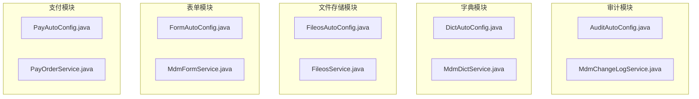
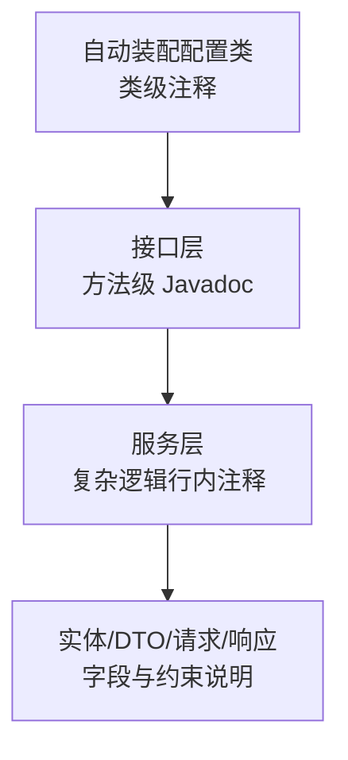
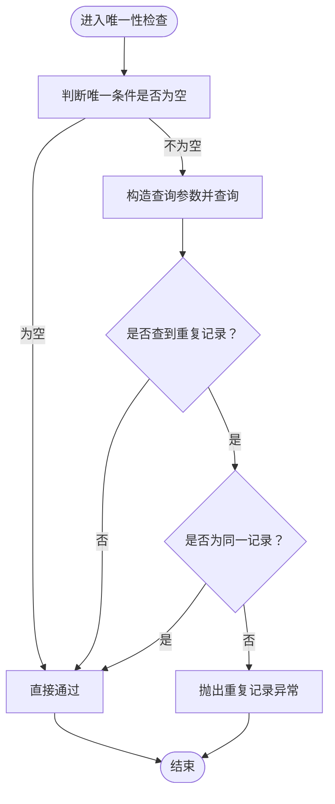
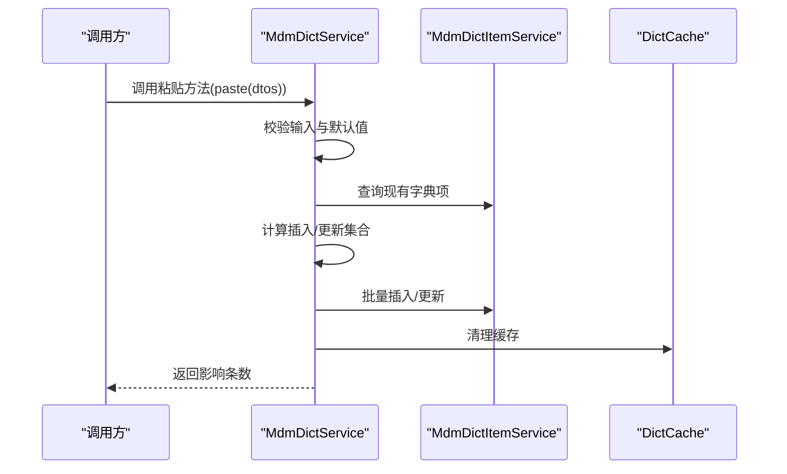
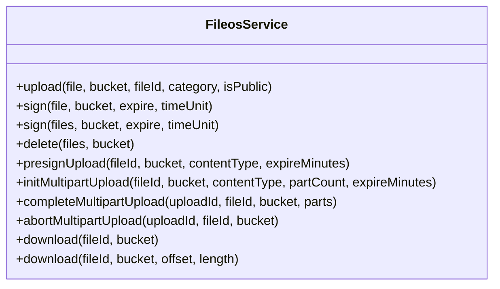
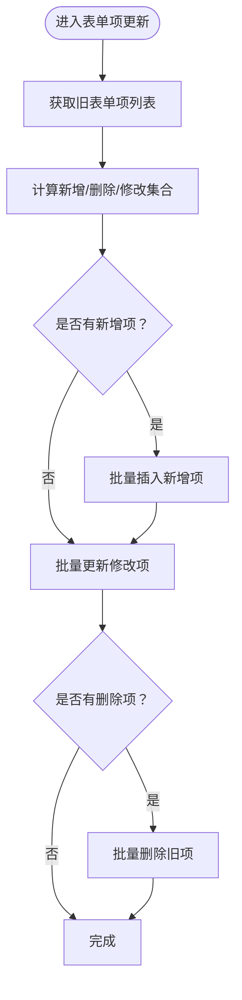
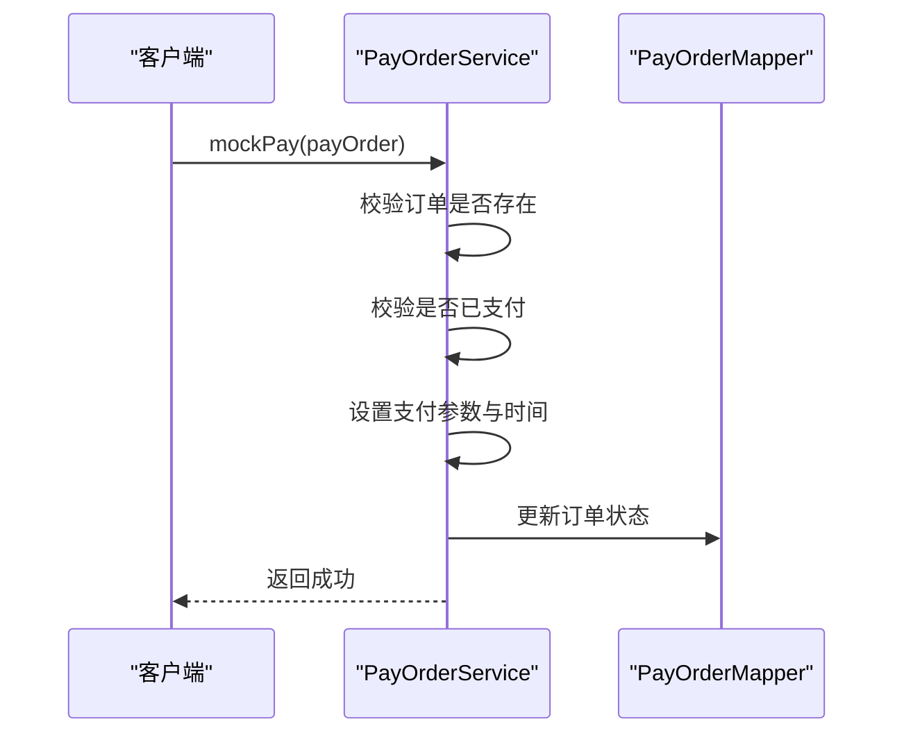
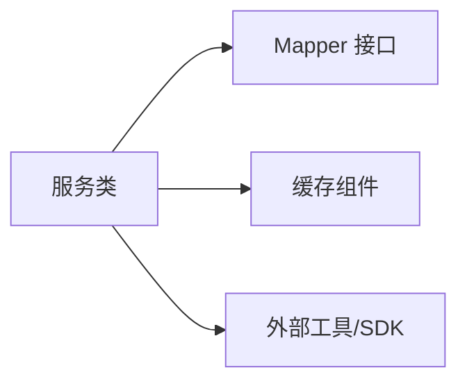

# 注释规范

<cite>
**本文引用的文件**
- [AuditAutoConfig.java](file://micro-audit/src/main/java/com/wkclz/micro/audit/AuditAutoConfig.java)
- [DictAutoConfig.java](file://micro-dict/src/main/java/com/wkclz/micro/dict/DictAutoConfig.java)
- [FileosAutoConfig.java](file://micro-fileos/src/main/java/com/wkclz/micro/fileos/FileosAutoConfig.java)
- [FormAutoConfig.java](file://micro-form/src/main/java/com/wkclz/micro/form/FormAutoConfig.java)
- [PayAutoConfig.java](file://micro-pay/src/main/java/com/wkclz/micro/pay/PayAutoConfig.java)
- [MdmChangeLogService.java](file://micro-audit/src/main/java/com/wkclz/micro/audit/service/MdmChangeLogService.java)
- [MdmDictService.java](file://micro-dict/src/main/java/com/wkclz/micro/dict/service/MdmDictService.java)
- [FileosService.java](file://micro-fileos/src/main/java/com/wkclz/micro/fileos/service/FileosService.java)
- [MdmFormService.java](file://micro-form/src/main/java/com/wkclz/micro/form/service/MdmFormService.java)
- [PayOrderService.java](file://micro-pay/src/main/java/com/wkclz/micro/pay/service/PayOrderService.java)
</cite>

## 目录
1. 引言
2. 项目结构
3. 核心组件
4. 架构总览
5. 详细组件分析
6. 依赖分析
7. 性能考虑
8. 故障排查指南
9. 结论
10. 附录

## 引言
本规范旨在统一 sh-microapp 微服务框架的注释风格与质量标准，确保所有公共类与公共方法具备完整、清晰、可维护的 Javadoc；明确“解释为什么”的注释原则；规范注释格式（如 TODO 格式、禁用废弃代码等）；并要求对复杂逻辑添加行内注释，提升团队协作效率与知识传承质量。

## 项目结构
本仓库采用多模块微服务架构，每个功能域独立为一个子模块，模块内遵循“接口-实现-服务-持久层”分层组织。注释规范应覆盖以下层次：
- 自动装配配置类：用于标注扫描路径与组件注册
- 接口层：对外暴露的服务接口
- 服务层：核心业务逻辑与复杂流程
- 实体/DTO/请求/响应对象：字段含义与约束说明
- Mapper 层：SQL 映射与查询逻辑

图表来源
- [AuditAutoConfig.java:1-11](file://micro-audit/src/main/java/com/wkclz/micro/audit/AuditAutoConfig.java#L1-L11)
- [DictAutoConfig.java:1-11](file://micro-dict/src/main/java/com/wkclz/micro/dict/DictAutoConfig.java#L1-L11)
- [FileosAutoConfig.java:1-12](file://micro-fileos/src/main/java/com/wkclz/micro/fileos/FileosAutoConfig.java#L1-L12)
- [FormAutoConfig.java:1-11](file://micro-form/src/main/java/com/wkclz/micro/form/FormAutoConfig.java#L1-L11)
- [PayAutoConfig.java:1-11](file://micro-pay/src/main/java/com/wkclz/micro/pay/PayAutoConfig.java#L1-L11)

章节来源
- [AuditAutoConfig.java:1-11](file://micro-audit/src/main/java/com/wkclz/micro/audit/AuditAutoConfig.java#L1-L11)
- [DictAutoConfig.java:1-11](file://micro-dict/src/main/java/com/wkclz/micro/dict/DictAutoConfig.java#L1-L11)
- [FileosAutoConfig.java:1-12](file://micro-fileos/src/main/java/com/wkclz/micro/fileos/FileosAutoConfig.java#L1-L12)
- [FormAutoConfig.java:1-11](file://micro-form/src/main/java/com/wkclz/micro/form/FormAutoConfig.java#L1-L11)
- [PayAutoConfig.java:1-11](file://micro-pay/src/main/java/com/wkclz/micro/pay/PayAutoConfig.java#L1-L11)

## 核心组件
- 自动装配配置类：用于声明组件扫描与 MyBatis Mapper 扫描路径，需在类级别提供简要说明其作用域与职责。
- 接口：对外暴露的方法需具备完整的 Javadoc，包括一句话概述、详细描述、参数说明、返回值说明、异常说明。
- 服务类：复杂业务流程与边界条件处理需补充行内注释，解释“为什么”采取该策略。
- 实体/DTO/请求/响应：字段与业务约束需在注释中明确，便于调用方理解。

章节来源
- [MdmChangeLogService.java:13-28](file://micro-audit/src/main/java/com/wkclz/micro/audit/service/MdmChangeLogService.java#L13-L28)
- [MdmDictService.java:24-28](file://micro-dict/src/main/java/com/wkclz/micro/dict/service/MdmDictService.java#L24-L28)
- [FileosService.java:14-36](file://micro-fileos/src/main/java/com/wkclz/micro/fileos/service/FileosService.java#L14-L36)
- [MdmFormService.java:25-29](file://micro-form/src/main/java/com/wkclz/micro/form/service/MdmFormService.java#L25-L29)
- [PayOrderService.java:19-23](file://micro-pay/src/main/java/com/wkclz/micro/pay/service/PayOrderService.java#L19-L23)

## 架构总览
下图展示各模块的注释关注点与职责边界，帮助开发者在不同层次遵循一致的注释规范。

图表来源
- [AuditAutoConfig.java:1-11](file://micro-audit/src/main/java/com/wkclz/micro/audit/AuditAutoConfig.java#L1-L11)
- [FileosService.java:14-36](file://micro-fileos/src/main/java/com/wkclz/micro/fileos/service/FileosService.java#L14-L36)
- [MdmDictService.java:40-100](file://micro-dict/src/main/java/com/wkclz/micro/dict/service/MdmDictService.java#L40-L100)
- [MdmFormService.java:56-185](file://micro-form/src/main/java/com/wkclz/micro/form/service/MdmFormService.java#L56-L185)
- [PayOrderService.java:52-86](file://micro-pay/src/main/java/com/wkclz/micro/pay/service/PayOrderService.java#L52-L86)

## 详细组件分析

### 审计模块（micro-audit）
- 类级注释：当前类包含通用模板注释，建议补充“为什么”与“如何使用”的上下文说明。
- 方法注释：服务类已包含基础注释，建议按 Javadoc 规范补齐 @param、@return、@throws 等标签。
- 复杂逻辑：唯一性检查与异常抛出处需增加行内注释，解释校验策略与边界条件。

图表来源
- [MdmChangeLogService.java:44-62](file://micro-audit/src/main/java/com/wkclz/micro/audit/service/MdmChangeLogService.java#L44-L62)

章节来源
- [MdmChangeLogService.java:13-65](file://micro-audit/src/main/java/com/wkclz/micro/audit/service/MdmChangeLogService.java#L13-L65)

### 字典模块（micro-dict）
- 类级注释：包含生成器模板提示，建议补充“适用范围与扩展建议”。
- 方法注释：分页查询、创建/更新/删除等方法需完善 Javadoc。
- 复杂逻辑：复制粘贴流程涉及多表一致性与缓存清理，需在关键步骤添加行内注释。

图表来源
- [MdmDictService.java:126-301](file://micro-dict/src/main/java/com/wkclz/micro/dict/service/MdmDictService.java#L126-L301)

章节来源
- [MdmDictService.java:24-307](file://micro-dict/src/main/java/com/wkclz/micro/dict/service/MdmDictService.java#L24-L307)

### 文件存储模块（micro-fileos）
- 接口注释：接口方法定义清晰，建议在接口层补充 Javadoc，明确参数语义、返回值与异常约定。
- 实现层：根据接口契约实现具体逻辑，并在复杂分支处添加行内注释。

图表来源
- [FileosService.java:14-36](file://micro-fileos/src/main/java/com/wkclz/micro/fileos/service/FileosService.java#L14-L36)

章节来源
- [FileosService.java:14-37](file://micro-fileos/src/main/java/com/wkclz/micro/fileos/service/FileosService.java#L14-L37)

### 表单模块（micro-form）
- 类级注释：包含生成器模板提示，建议补充“适用范围与扩展建议”。
- 方法注释：创建/更新/删除等方法需完善 Javadoc。
- 复杂逻辑：表单项的新增/删除/更新差异计算与批量写入，需在关键步骤添加行内注释。

图表来源
- [MdmFormService.java:86-184](file://micro-form/src/main/java/com/wkclz/micro/form/service/MdmFormService.java#L86-L184)

章节来源
- [MdmFormService.java:25-245](file://micro-form/src/main/java/com/wkclz/micro/form/service/MdmFormService.java#L25-L245)

### 支付模块（micro-pay）
- 类级注释：包含生成器模板提示，建议补充“适用范围与扩展建议”。
- 方法注释：创建/更新/模拟支付等方法需完善 Javadoc。
- 复杂逻辑：状态校验与幂等控制（重复支付）需在关键分支添加行内注释。

图表来源
- [PayOrderService.java:52-69](file://micro-pay/src/main/java/com/wkclz/micro/pay/service/PayOrderService.java#L52-L69)

章节来源
- [PayOrderService.java:19-110](file://micro-pay/src/main/java/com/wkclz/micro/pay/service/PayOrderService.java#L19-L110)

## 依赖分析
- 组件耦合：服务类通常依赖 Mapper 与缓存组件，注释中应体现依赖关系与调用顺序。
- 外部依赖：如 RedisIdGenerator、SessionHelper 等，应在注释中说明其用途与约束。
- 循环依赖：避免在注释中引入循环引用，保持注释的单向可读性。

图表来源
- [MdmDictService.java:34-38](file://micro-dict/src/main/java/com/wkclz/micro/dict/service/MdmDictService.java#L34-L38)
- [MdmFormService.java:35-39](file://micro-form/src/main/java/com/wkclz/micro/form/service/MdmFormService.java#L35-L39)
- [PayOrderService.java:28-29](file://micro-pay/src/main/java/com/wkclz/micro/pay/service/PayOrderService.java#L28-L29)

章节来源
- [MdmDictService.java:34-38](file://micro-dict/src/main/java/com/wkclz/micro/dict/service/MdmDictService.java#L34-L38)
- [MdmFormService.java:35-39](file://micro-form/src/main/java/com/wkclz/micro/form/service/MdmFormService.java#L35-L39)
- [PayOrderService.java:28-29](file://micro-pay/src/main/java/com/wkclz/micro/pay/service/PayOrderService.java#L28-L29)

## 性能考虑
- 缓存清理：批量导入/更新后及时清理缓存，避免脏读。
- 批量操作：对大量数据的插入/更新使用批量接口，减少往返次数。
- 幂等设计：在支付/订单等关键流程中，通过状态校验与唯一键约束保证幂等。

## 故障排查指南
- 唯一性冲突：当出现重复记录异常时，检查唯一条件构造与边界 ID 判定逻辑。
- 权限与可见性：在查询前校验用户身份与数据归属，避免越权访问。
- 输入校验：对空值、非法参数进行前置校验，尽早失败并给出明确错误信息。
- 日志与追踪：在关键路径添加日志，便于问题定位与复盘。

章节来源
- [MdmChangeLogService.java:44-62](file://micro-audit/src/main/java/com/wkclz/micro/audit/service/MdmChangeLogService.java#L44-L62)
- [MdmDictService.java:82-100](file://micro-dict/src/main/java/com/wkclz/micro/dict/service/MdmDictService.java#L82-L100)
- [PayOrderService.java:52-69](file://micro-pay/src/main/java/com/wkclz/micro/pay/service/PayOrderService.java#L52-L69)

## 结论
通过统一的注释规范，可以显著提升代码可读性与可维护性，降低沟通成本与知识断层风险。建议各模块在现有基础上补充完整 Javadoc，并在复杂逻辑处添加“为什么”的行内注释，形成高质量的注释文化。

## 附录

### Javadoc 编写标准模板
- 类级注释
  - 一句话概述：简明说明类的作用与适用范围
  - 详细描述：说明职责边界、扩展建议、注意事项
  - 作者与表名：保留生成器模板提示或替换为实际作者
- 方法级注释
  - 一句话概述：说明方法目的
  - 详细描述：说明前置条件、行为、后置状态
  - @param：逐个说明参数含义、约束、默认值
  - @return：说明返回值含义、结构、可能的空值
  - @throws：说明可能抛出的异常类型与触发条件
- 字段注释
  - 明确字段含义、取值范围、业务约束、默认值
- 行内注释
  - 复杂逻辑分支、边界条件、性能敏感路径需添加“为什么”的解释

### 注释格式与原则
- 禁止保留被注释掉的代码，如有历史参考，建议移至版本记录或注释说明
- TODO 格式：// TODO(作者): 描述
- 注释原则：解释“为什么”而非“做什么”，帮助读者理解设计意图与约束
- 复杂逻辑必须添加行内注释，确保后续维护者能快速理解