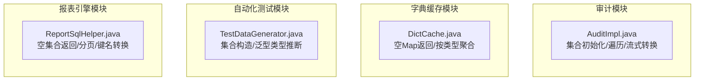
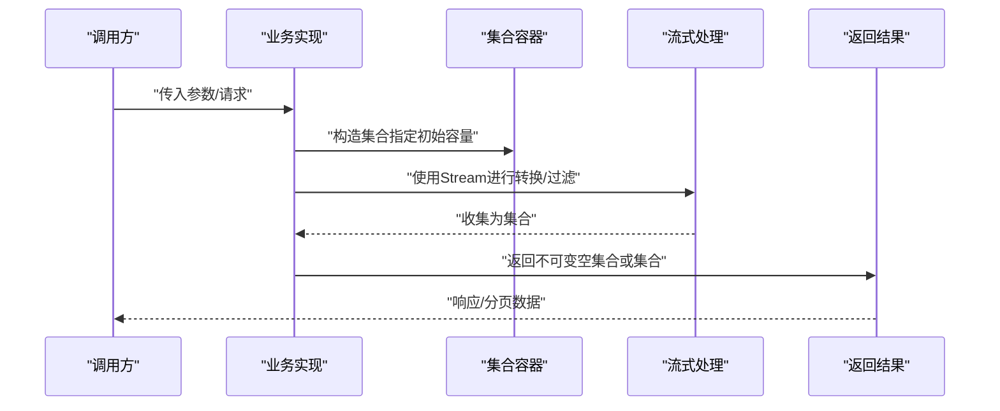
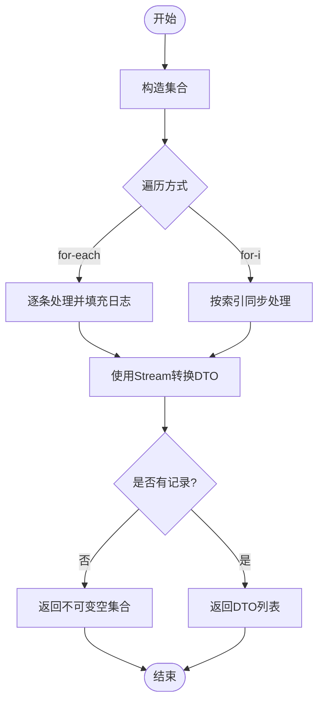
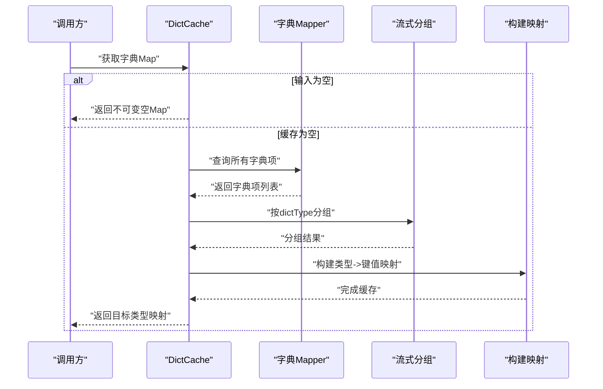
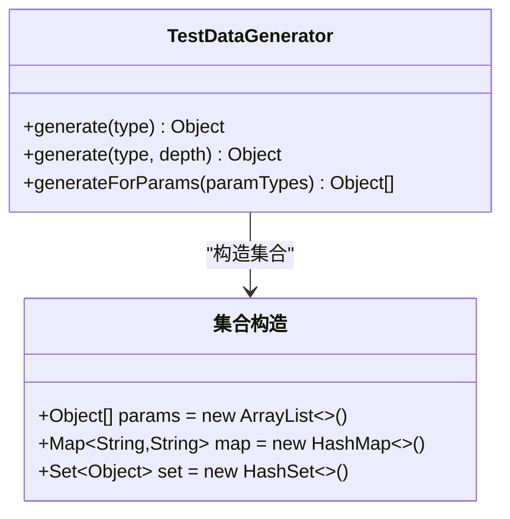
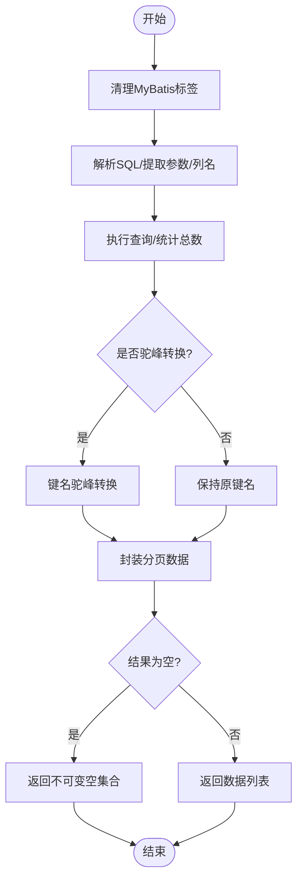
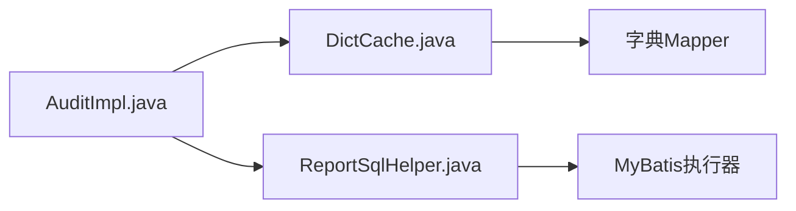

# 集合使用

<cite>
**本文引用的文件**
- [AuditImpl.java](file://micro-audit/src/main/java/com/wkclz/micro/audit/api/impl/AuditImpl.java)
- [DictCache.java](file://micro-dict/src/main/java/com/wkclz/micro/dict/cache/DictCache.java)
- [TestDataGenerator.java](file://micro-autotest/src/main/java/com/wkclz/auto/mock/TestDataGenerator.java)
- [ReportSqlHelper.java](file://micro-report/src/main/java/com/wkclz/micro/report/helper/ReportSqlHelper.java)
</cite>

## 目录
1. [简介](#简介)
2. [项目结构](#项目结构)
3. [核心规则](#核心规则)
4. [架构总览](#架构总览)
5. [组件详解](#组件详解)
6. [依赖关系分析](#依赖关系分析)
7. [性能考量](#性能考量)
8. [故障排查指南](#故障排查指南)
9. [结论](#结论)
10. [附录](#附录)

## 简介
本规范面向 sh-microapp 微服务框架中的集合使用，总结并提炼出可复用的最佳实践与性能优化建议，覆盖以下关键主题：
- 接口类型声明变量与返回值
- 空集合返回策略（优先使用不可变空集合）
- 已知大小时指定初始容量
- 遍历风格选择（for-each、for-i）
- Stream API 的合理使用（转换、过滤、收集）
- 并发修改异常（ConcurrentModificationException）的规避

本规范以仓库中实际代码为依据，结合常见工程问题，给出可落地的指导。

## 项目结构
围绕集合使用的关键代码主要分布在如下模块：
- 审计模块：集合初始化、遍历、流式转换与空集合返回
- 字典缓存模块：空 Map 返回、按类型聚合与构建映射
- 自动化测试模块：集合构造与泛型类型推断
- 报表引擎模块：SQL 结果集处理、分页与键名驼峰转换

**图表来源**
- [AuditImpl.java:1-305](file://micro-audit/src/main/java/com/wkclz/micro/audit/api/impl/AuditImpl.java#L1-L305)
- [DictCache.java:1-130](file://micro-dict/src/main/java/com/wkclz/micro/dict/cache/DictCache.java#L1-L130)
- [TestDataGenerator.java:1-111](file://micro-autotest/src/main/java/com/wkclz/auto/mock/TestDataGenerator.java#L1-L111)
- [ReportSqlHelper.java:1-417](file://micro-report/src/main/java/com/wkclz/micro/report/helper/ReportSqlHelper.java#L1-L417)

**章节来源**
- [AuditImpl.java:1-305](file://micro-audit/src/main/java/com/wkclz/micro/audit/api/impl/AuditImpl.java#L1-L305)
- [DictCache.java:1-130](file://micro-dict/src/main/java/com/wkclz/micro/dict/cache/DictCache.java#L1-L130)
- [TestDataGenerator.java:1-111](file://micro-autotest/src/main/java/com/wkclz/auto/mock/TestDataGenerator.java#L1-L111)
- [ReportSqlHelper.java:1-417](file://micro-report/src/main/java/com/wkclz/micro/report/helper/ReportSqlHelper.java#L1-L417)

## 核心规则
- 接口类型声明变量与返回值
  - 声明局部变量与成员变量时，优先使用接口类型（如 List、Map），便于替换实现与统一行为。
  - 返回集合时，若无元素，应返回不可变空集合，避免调用方判空与二次封装。
- 空集合返回策略
  - 使用不可变空集合（如 Collections.emptyXXX）替代 null，降低空指针风险与分支复杂度。
- 已知大小时指定初始容量
  - 在构造集合时，若能预估大小，应设置初始容量，减少扩容成本。
- 遍历风格选择
  - 顺序访问且无需索引时，优先使用 for-each；需要索引或需在循环内修改集合时，谨慎使用 for-i，并关注并发修改风险。
- Stream API 的合理使用
  - 转换与过滤优先使用 Stream，配合 Collectors 进行高效收集；注意避免在流中做副作用操作。
- 并发修改异常（ConcurrentModificationException）
  - 在迭代过程中对集合进行结构性修改（添加/删除）会触发该异常；应使用迭代器或复制集合后修改等策略规避。

以上规则在以下文件中均有体现或可直接应用。

**章节来源**
- [AuditImpl.java:74-95](file://micro-audit/src/main/java/com/wkclz/micro/audit/api/impl/AuditImpl.java#L74-L95)
- [AuditImpl.java:121-159](file://micro-audit/src/main/java/com/wkclz/micro/audit/api/impl/AuditImpl.java#L121-L159)
- [AuditImpl.java:223-225](file://micro-audit/src/main/java/com/wkclz/micro/audit/api/impl/AuditImpl.java#L223-L225)
- [DictCache.java:78-88](file://micro-dict/src/main/java/com/wkclz/micro/dict/cache/DictCache.java#L78-L88)
- [DictCache.java:104-107](file://micro-dict/src/main/java/com/wkclz/micro/dict/cache/DictCache.java#L104-L107)
- [TestDataGenerator.java:60-70](file://micro-autotest/src/main/java/com/wkclz/auto/mock/TestDataGenerator.java#L60-L70)
- [ReportSqlHelper.java:68-70](file://micro-report/src/main/java/com/wkclz/micro/report/helper/ReportSqlHelper.java#L68-L70)
- [ReportSqlHelper.java:102-104](file://micro-report/src/main/java/com/wkclz/micro/report/helper/ReportSqlHelper.java#L102-L104)
- [ReportSqlHelper.java:150-163](file://micro-report/src/main/java/com/wkclz/micro/report/helper/ReportSqlHelper.java#L150-L163)
- [ReportSqlHelper.java](file://micro-report/src/main/java/com/wkclz/micro/report/helper/ReportSqlHelper.java#L212)

## 架构总览
下图展示集合使用在各模块中的典型交互路径：输入参数经由业务层组装为集合，通过流式 API 进行转换与过滤，最终返回不可变空集合或标准集合给上层调用者。

**图表来源**
- [AuditImpl.java:81-94](file://micro-audit/src/main/java/com/wkclz/micro/audit/api/impl/AuditImpl.java#L81-L94)
- [AuditImpl.java:235-236](file://micro-audit/src/main/java/com/wkclz/micro/audit/api/impl/AuditImpl.java#L235-L236)
- [DictCache.java:104-107](file://micro-dict/src/main/java/com/wkclz/micro/dict/cache/DictCache.java#L104-L107)
- [ReportSqlHelper.java](file://micro-report/src/main/java/com/wkclz/micro/report/helper/ReportSqlHelper.java#L212)

## 组件详解

### 审计模块：集合初始化、遍历与流式转换
- 集合初始化与遍历
  - 在批量创建/更新/删除场景中，先构造集合，再通过 for-each 或 for-i 遍历，逐条写入日志对象。
  - 在需要索引位置的场景（如批量比对两列表），使用 for-i 保证同步性。
- 流式转换
  - 将数据库记录映射为 DTO 时，使用流式 API 进行转换与收集，提升可读性与性能。
- 空集合返回
  - 当分页记录为空时，返回不可变空集合，避免上层重复判空。

**图表来源**
- [AuditImpl.java:81-94](file://micro-audit/src/main/java/com/wkclz/micro/audit/api/impl/AuditImpl.java#L81-L94)
- [AuditImpl.java:133-159](file://micro-audit/src/main/java/com/wkclz/micro/audit/api/impl/AuditImpl.java#L133-L159)
- [AuditImpl.java:223-225](file://micro-audit/src/main/java/com/wkclz/micro/audit/api/impl/AuditImpl.java#L223-L225)
- [AuditImpl.java:235-236](file://micro-audit/src/main/java/com/wkclz/micro/audit/api/impl/AuditImpl.java#L235-L236)

**章节来源**
- [AuditImpl.java:74-95](file://micro-audit/src/main/java/com/wkclz/micro/audit/api/impl/AuditImpl.java#L74-L95)
- [AuditImpl.java:121-159](file://micro-audit/src/main/java/com/wkclz/micro/audit/api/impl/AuditImpl.java#L121-L159)
- [AuditImpl.java:223-225](file://micro-audit/src/main/java/com/wkclz/micro/audit/api/impl/AuditImpl.java#L223-L225)
- [AuditImpl.java:235-236](file://micro-audit/src/main/java/com/wkclz/micro/audit/api/impl/AuditImpl.java#L235-L236)

### 字典缓存模块：空 Map 返回与按类型聚合
- 空 Map 返回
  - 当输入键或缓存为空时，返回不可变空 Map，简化调用侧逻辑。
- 按类型聚合
  - 使用流式 API 将字典项按类型分组，再构建映射，提高可读性与可维护性。

**图表来源**
- [DictCache.java:78-88](file://micro-dict/src/main/java/com/wkclz/micro/dict/cache/DictCache.java#L78-L88)
- [DictCache.java:104-107](file://micro-dict/src/main/java/com/wkclz/micro/dict/cache/DictCache.java#L104-L107)
- [DictCache.java:113-122](file://micro-dict/src/main/java/com/wkclz/micro/dict/cache/DictCache.java#L113-L122)

**章节来源**
- [DictCache.java:78-88](file://micro-dict/src/main/java/com/wkclz/micro/dict/cache/DictCache.java#L78-L88)
- [DictCache.java:104-107](file://micro-dict/src/main/java/com/wkclz/micro/dict/cache/DictCache.java#L104-L107)
- [DictCache.java:113-122](file://micro-dict/src/main/java/com/wkclz/micro/dict/cache/DictCache.java#L113-L122)

### 自动化测试模块：集合构造与泛型类型推断
- 集合构造
  - 在生成测试数据时，针对 List/Set/Map 等集合类型，直接构造对应实现，确保可预测性。
- 泛型类型推断
  - 在方法签名中明确集合类型，避免编译器推断导致的歧义。

**图表来源**
- [TestDataGenerator.java:60-70](file://micro-autotest/src/main/java/com/wkclz/auto/mock/TestDataGenerator.java#L60-L70)
- [TestDataGenerator.java:103-109](file://micro-autotest/src/main/java/com/wkclz/auto/mock/TestDataGenerator.java#L103-L109)

**章节来源**
- [TestDataGenerator.java:60-70](file://micro-autotest/src/main/java/com/wkclz/auto/mock/TestDataGenerator.java#L60-L70)
- [TestDataGenerator.java:103-109](file://micro-autotest/src/main/java/com/wkclz/auto/mock/TestDataGenerator.java#L103-L109)

### 报表引擎模块：空集合返回、分页与键名转换
- 空集合返回
  - 参数提取、结果列提取与查询执行均在空输入时返回不可变空集合，保持一致性。
- 分页与键名转换
  - 分页查询时，将结果集转换为驼峰键名，同时返回 PageData 包裹的数据与总数。
- 流式处理
  - 在键名转换时，使用流式处理与指定初始容量的集合，平衡性能与内存占用。

**图表来源**
- [ReportSqlHelper.java:45-62](file://micro-report/src/main/java/com/wkclz/micro/report/helper/ReportSqlHelper.java#L45-L62)
- [ReportSqlHelper.java:68-70](file://micro-report/src/main/java/com/wkclz/micro/report/helper/ReportSqlHelper.java#L68-L70)
- [ReportSqlHelper.java:101-144](file://micro-report/src/main/java/com/wkclz/micro/report/helper/ReportSqlHelper.java#L101-L144)
- [ReportSqlHelper.java:150-163](file://micro-report/src/main/java/com/wkclz/micro/report/helper/ReportSqlHelper.java#L150-L163)
- [ReportSqlHelper.java:170-213](file://micro-report/src/main/java/com/wkclz/micro/report/helper/ReportSqlHelper.java#L170-L213)
- [ReportSqlHelper.java:251-261](file://micro-report/src/main/java/com/wkclz/micro/report/helper/ReportSqlHelper.java#L251-L261)

**章节来源**
- [ReportSqlHelper.java:68-70](file://micro-report/src/main/java/com/wkclz/micro/report/helper/ReportSqlHelper.java#L68-L70)
- [ReportSqlHelper.java:101-144](file://micro-report/src/main/java/com/wkclz/micro/report/helper/ReportSqlHelper.java#L101-L144)
- [ReportSqlHelper.java:150-163](file://micro-report/src/main/java/com/wkclz/micro/report/helper/ReportSqlHelper.java#L150-L163)
- [ReportSqlHelper.java:170-213](file://micro-report/src/main/java/com/wkclz/micro/report/helper/ReportSqlHelper.java#L170-L213)
- [ReportSqlHelper.java:251-261](file://micro-report/src/main/java/com/wkclz/micro/report/helper/ReportSqlHelper.java#L251-L261)

## 依赖关系分析
- 模块间集合使用依赖
  - 审计模块依赖字典缓存模块提供的 Map 以进行字段描述映射。
  - 报表引擎模块依赖 MyBatis 执行 SQL 并返回集合，再进行转换与分页封装。
- 常见耦合点
  - 集合类型的一致性（List/Map/Set）与不可变空集合的统一返回策略，有助于降低模块间的契约分歧。
- 循环依赖规避
  - 通过接口类型声明与不可变空集合返回，避免在集合层面引入循环依赖。

**图表来源**
- [AuditImpl.java:235-236](file://micro-audit/src/main/java/com/wkclz/micro/audit/api/impl/AuditImpl.java#L235-L236)
- [DictCache.java:104-107](file://micro-dict/src/main/java/com/wkclz/micro/dict/cache/DictCache.java#L104-L107)
- [ReportSqlHelper.java:150-163](file://micro-report/src/main/java/com/wkclz/micro/report/helper/ReportSqlHelper.java#L150-L163)

**章节来源**
- [AuditImpl.java:235-236](file://micro-audit/src/main/java/com/wkclz/micro/audit/api/impl/AuditImpl.java#L235-L236)
- [DictCache.java:104-107](file://micro-dict/src/main/java/com/wkclz/micro/dict/cache/DictCache.java#L104-L107)
- [ReportSqlHelper.java:150-163](file://micro-report/src/main/java/com/wkclz/micro/report/helper/ReportSqlHelper.java#L150-L163)

## 性能考量
- 初始容量设置
  - 在已知集合大小时，构造时指定初始容量，减少扩容次数与数组复制开销。
  - 示例：在键名转换时，根据原集合大小创建新集合，避免多次扩容。
- 遍历与修改
  - for-each 更简洁且不易出错；如需在遍历时修改集合，应使用迭代器或复制集合后再修改。
- 流式 API
  - 合理使用流式 API 进行转换与过滤，注意避免在流中执行耗时或有副作用的操作。
- 不可变空集合
  - 返回不可变空集合可减少上层重复判空与二次封装，降低 GC 压力与分支判断成本。

**章节来源**
- [ReportSqlHelper.java:252-259](file://micro-report/src/main/java/com/wkclz/micro/report/helper/ReportSqlHelper.java#L252-L259)
- [AuditImpl.java:235-236](file://micro-audit/src/main/java/com/wkclz/micro/audit/api/impl/AuditImpl.java#L235-L236)
- [DictCache.java:78-88](file://micro-dict/src/main/java/com/wkclz/micro/dict/cache/DictCache.java#L78-L88)
- [ReportSqlHelper.java:68-70](file://micro-report/src/main/java/com/wkclz/micro/report/helper/ReportSqlHelper.java#L68-L70)

## 故障排查指南
- ConcurrentModificationException
  - 症状：在 foreach 遍历中对集合进行结构性修改（add/remove）。
  - 排查要点：确认是否在遍历期间直接修改集合；如需修改，使用迭代器或复制集合后修改。
- 空集合与空指针
  - 症状：调用方误以为返回 null 导致 NPE。
  - 排查要点：统一返回不可变空集合；确保上层不再进行额外判空。
- 集合类型不一致
  - 症状：下游模块期望 List 却收到 Set，导致编译或运行时错误。
  - 排查要点：接口类型声明变量与返回值，避免直接暴露具体实现类。

**章节来源**
- [AuditImpl.java:81-94](file://micro-audit/src/main/java/com/wkclz/micro/audit/api/impl/AuditImpl.java#L81-L94)
- [AuditImpl.java:133-159](file://micro-audit/src/main/java/com/wkclz/micro/audit/api/impl/AuditImpl.java#L133-L159)
- [DictCache.java:78-88](file://micro-dict/src/main/java/com/wkclz/micro/dict/cache/DictCache.java#L78-L88)
- [ReportSqlHelper.java:68-70](file://micro-report/src/main/java/com/wkclz/micro/report/helper/ReportSqlHelper.java#L68-L70)

## 结论
通过对 sh-microapp 代码库中集合使用实践的梳理，可以总结出一套适用于微服务场景的集合使用规范：以接口类型声明变量与返回值、优先返回不可变空集合、在已知大小时指定初始容量、在合适场景使用 for-each 或 for-i、善用 Stream API 进行转换与过滤，并严格规避并发修改异常。遵循这些规则，可在保证代码可读性的同时，显著提升性能与稳定性。

## 附录
- 适用场景与注意事项
  - List：有序、可重复、允许 null；适合记录集合与分页数据。
  - Set：去重、无序；适合唯一性约束与快速包含判断。
  - Map：键值映射；适合缓存与配置类数据。
  - 注意：在多线程环境下，优先考虑线程安全的实现或加锁保护；对于只读场景，使用不可变集合或并发安全集合。