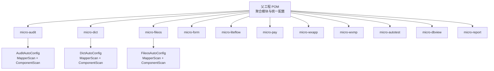
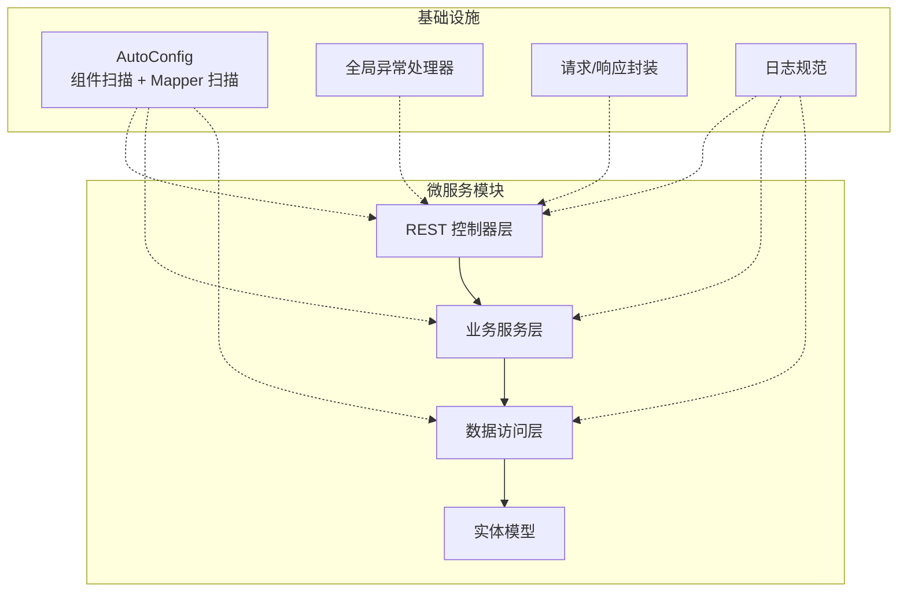
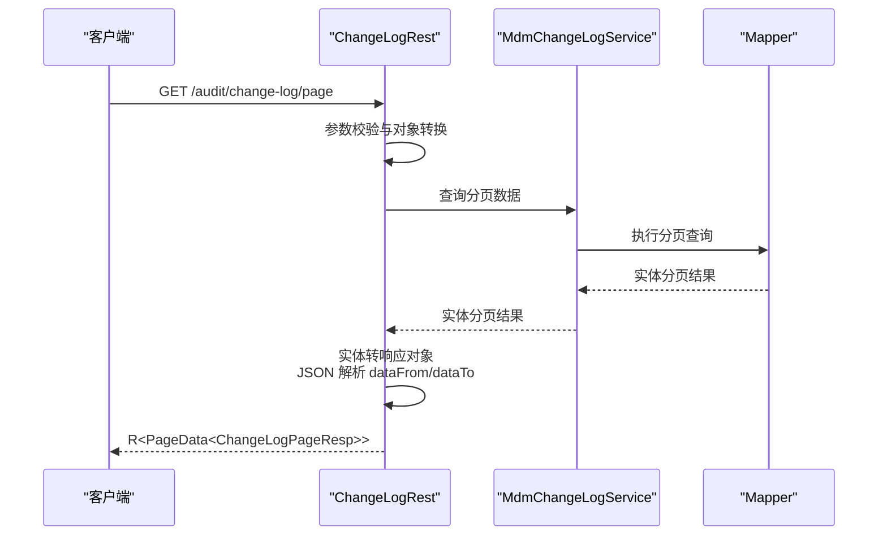
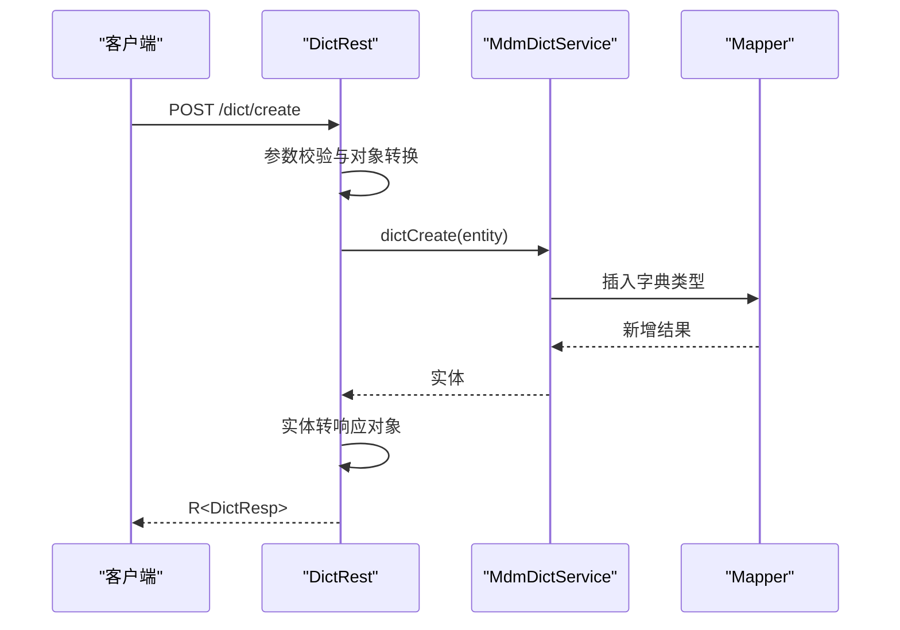
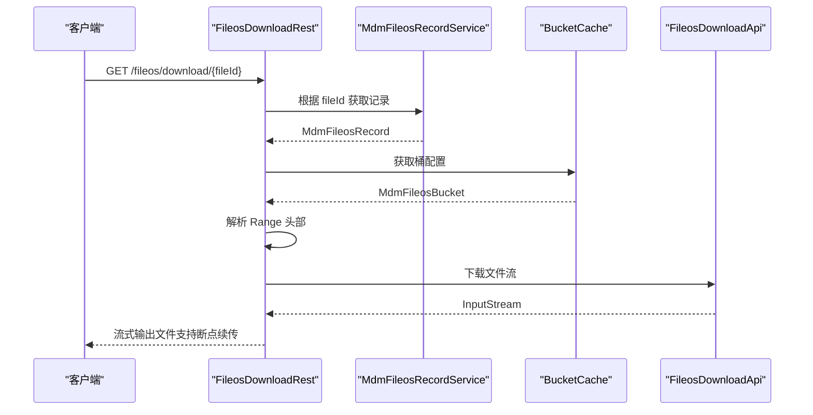
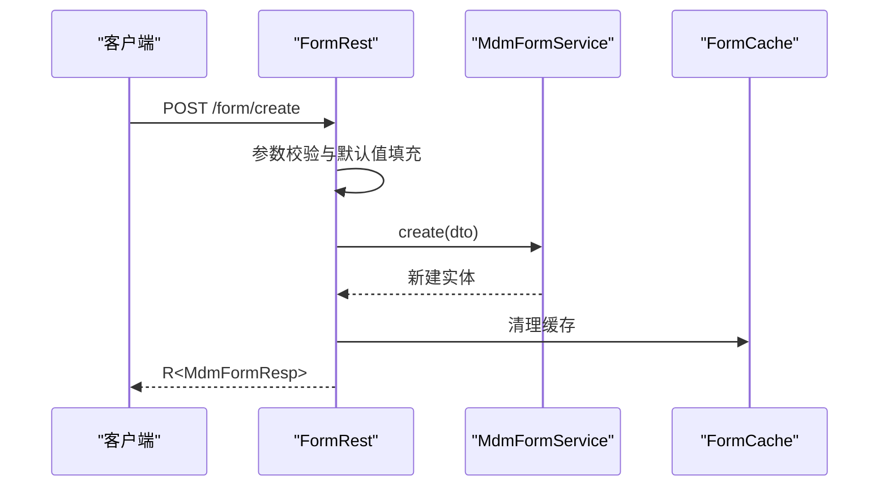
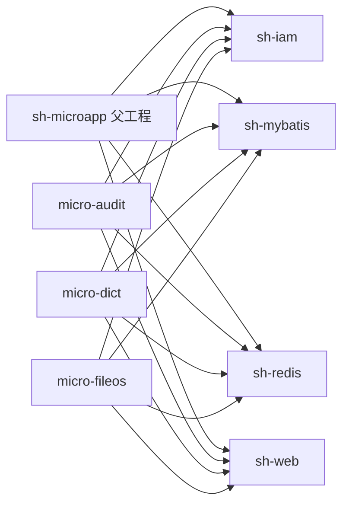

# 开发指南

<cite>
**本文档引用的文件**
- [README.md](file://README.md)
- [pom.xml](file://pom.xml)
- [docs/coding-standards/java.md](file://docs/coding-standards/java.md)
- [docs/dev-process.md](file://docs/dev-process.md)
- [docs/standards/git.md](file://docs/standards/git.md)
- [docs/standards/backend.md](file://docs/standards/backend.md)
- [docs/skill-setup.md](file://docs/skill-setup.md)
- [micro-audit/pom.xml](file://micro-audit/pom.xml)
- [micro-audit/src/main/java/com/wkclz/micro/audit/AuditAutoConfig.java](file://micro-audit/src/main/java/com/wkclz/micro/audit/AuditAutoConfig.java)
- [micro-dict/pom.xml](file://micro-dict/pom.xml)
- [micro-dict/src/main/java/com/wkclz/micro/dict/DictAutoConfig.java](file://micro-dict/src/main/java/com/wkclz/micro/dict/DictAutoConfig.java)
- [micro-fileos/pom.xml](file://micro-fileos/pom.xml)
- [micro-fileos/src/main/java/com/wkclz/micro/fileos/FileosAutoConfig.java](file://micro-fileos/src/main/java/com/wkclz/micro/fileos/FileosAutoConfig.java)
- [micro-audit/src/main/java/com/wkclz/micro/audit/rest/ChangeLogRest.java](file://micro-audit/src/main/java/com/wkclz/micro/audit/rest/ChangeLogRest.java)
- [micro-dict/src/main/java/com/wkclz/micro/dict/rest/DictRest.java](file://micro-dict/src/main/java/com/wkclz/micro/dict/rest/DictRest.java)
- [micro-fileos/src/main/java/com/wkclz/micro/fileos/rest/FileosDownloadRest.java](file://micro-fileos/src/main/java/com/wkclz/micro/fileos/rest/FileosDownloadRest.java)
- [micro-form/src/main/java/com/wkclz/micro/form/rest/FormRest.java](file://micro-form/src/main/java/com/wkclz/micro/form/rest/FormRest.java)
</cite>

## 目录
1. [简介](#简介)
2. [项目结构](#项目结构)
3. [核心组件](#核心组件)
4. [架构总览](#架构总览)
5. [详细组件分析](#详细组件分析)
6. [依赖分析](#依赖分析)
7. [性能考虑](#性能考虑)
8. [故障排除指南](#故障排除指南)
9. [结论](#结论)
10. [附录](#附录)

## 简介
本指南面向 sh-microapp 微服务框架的开发者，提供从代码规范、命名约定、最佳实践，到开发环境搭建、构建流程、测试策略、持续集成、模块开发流程、代码审查与质量门禁、发布流程，再到常见问题与性能优化的完整开发手册。文档同时结合仓库内的标准文档与典型模块实现，帮助团队建立一致的开发体验与交付质量。

## 项目结构
sh-microapp 采用多模块 Maven 聚合工程组织，父 POM 定义了统一的 Java 版本、编码与模块清单，并通过各子模块的 AutoConfig 组件完成 MyBatis Mapper 扫描与 Spring 组件扫描。典型模块遵循“controller-service-mapper”三层结构，配合统一的请求/响应对象与异常处理规范。

**图示来源**
- [pom.xml:28-48](file://pom.xml#L28-L48)
- [micro-audit/src/main/java/com/wkclz/micro/audit/AuditAutoConfig.java:7-10](file://micro-audit/src/main/java/com/wkclz/micro/audit/AuditAutoConfig.java#L7-L10)
- [micro-dict/src/main/java/com/wkclz/micro/dict/DictAutoConfig.java:7-10](file://micro-dict/src/main/java/com/wkclz/micro/dict/DictAutoConfig.java#L7-L10)
- [micro-fileos/src/main/java/com/wkclz/micro/fileos/FileosAutoConfig.java:7-10](file://micro-fileos/src/main/java/com/wkclz/micro/fileos/FileosAutoConfig.java#L7-L10)

**章节来源**
- [pom.xml:1-50](file://pom.xml#L1-L50)
- [README.md:1-4](file://README.md#L1-L4)

## 核心组件
- 代码规范与命名约定：统一的 Java 命名、注释、异常处理、集合与并发、日志规范，以及“请求/响应对象封装”“关键位置加日志”等强制规则。
- 后端工程结构：标准的包结构（config/service/rest/model/mapper/util 等）、Model 模型（Entity/Req/Resp）与 Bean 使用规范。
- Git 与分支管理：明确的分支命名、流程与提交信息格式，配套 PR 审查清单。
- 开发流程：项目初始化、需求拆解、编码规范、规范检查（pre-commit 与 CI）、代码审查与活文档更新。
- Skill 配置：Trae Skill 标配流水线与 MCP Server 增强能力，支持变更驱动工作流与 AI 辅助开发。

**章节来源**
- [docs/coding-standards/java.md:1-707](file://docs/coding-standards/java.md#L1-L707)
- [docs/standards/backend.md:1-394](file://docs/standards/backend.md#L1-L394)
- [docs/standards/git.md:1-79](file://docs/standards/git.md#L1-L79)
- [docs/dev-process.md:1-189](file://docs/dev-process.md#L1-L189)
- [docs/skill-setup.md:1-132](file://docs/skill-setup.md#L1-L132)

## 架构总览
sh-microapp 采用“多模块微服务 + 统一框架依赖”的架构。每个模块通过 AutoConfig 组件完成 Spring 扫描与 MyBatis Mapper 扫描；REST 层负责对外接口，Service 层承载业务逻辑，Mapper 层对接数据库；请求与响应对象严格封装，异常通过全局处理器统一处理。

**图示来源**
- [micro-audit/src/main/java/com/wkclz/micro/audit/AuditAutoConfig.java:7-10](file://micro-audit/src/main/java/com/wkclz/micro/audit/AuditAutoConfig.java#L7-L10)
- [micro-dict/src/main/java/com/wkclz/micro/dict/DictAutoConfig.java:7-10](file://micro-dict/src/main/java/com/wkclz/micro/dict/DictAutoConfig.java#L7-L10)
- [micro-fileos/src/main/java/com/wkclz/micro/fileos/FileosAutoConfig.java:7-10](file://micro-fileos/src/main/java/com/wkclz/micro/fileos/FileosAutoConfig.java#L7-L10)
- [docs/coding-standards/java.md:171-258](file://docs/coding-standards/java.md#L171-L258)
- [docs/standards/backend.md:145-178](file://docs/standards/backend.md#L145-L178)

## 详细组件分析

### 审计模块（micro-audit）
- 功能定位：提供变更记录的分页查询与详情接口，支持 JSON 字段解析与转换。
- 关键实现：
  - REST 控制器：ChangeLogRest 提供分页与详情接口，使用 PageData 与 R 统一响应包装。
  - 业务服务：MdmChangeLogService 承载查询逻辑。
  - AutoConfig：启用 Mapper 扫描与组件扫描。
- 设计要点：请求对象转实体对象、响应对象转换、空值与 JSON 解析处理。

**图示来源**
- [micro-audit/src/main/java/com/wkclz/micro/audit/rest/ChangeLogRest.java:34-51](file://micro-audit/src/main/java/com/wkclz/micro/audit/rest/ChangeLogRest.java#L34-L51)
- [micro-audit/src/main/java/com/wkclz/micro/audit/AuditAutoConfig.java:7-10](file://micro-audit/src/main/java/com/wkclz/micro/audit/AuditAutoConfig.java#L7-L10)

**章节来源**
- [micro-audit/src/main/java/com/wkclz/micro/audit/rest/ChangeLogRest.java:1-68](file://micro-audit/src/main/java/com/wkclz/micro/audit/rest/ChangeLogRest.java#L1-L68)
- [micro-audit/pom.xml:22-40](file://micro-audit/pom.xml#L22-L40)

### 字典模块（micro-dict）
- 功能定位：字典类型与字典项的增删改查、复制粘贴导入、选项列表等。
- 关键实现：
  - REST 控制器：DictRest 提供分页、详情、创建、修改、删除、复制、粘贴、选项等接口。
  - 业务服务：MdmDictService 承载核心业务。
  - AutoConfig：启用 Mapper 扫描与组件扫描。
- 设计要点：统一的 R 响应包装、RemoveReq 批量删除、DTO/Entity 转换、分页转换。

**图示来源**
- [micro-dict/src/main/java/com/wkclz/micro/dict/rest/DictRest.java:60-76](file://micro-dict/src/main/java/com/wkclz/micro/dict/rest/DictRest.java#L60-L76)
- [micro-dict/src/main/java/com/wkclz/micro/dict/DictAutoConfig.java:7-10](file://micro-dict/src/main/java/com/wkclz/micro/dict/DictAutoConfig.java#L7-L10)

**章节来源**
- [micro-dict/src/main/java/com/wkclz/micro/dict/rest/DictRest.java:1-129](file://micro-dict/src/main/java/com/wkclz/micro/dict/rest/DictRest.java#L1-L129)
- [micro-dict/pom.xml:22-40](file://micro-dict/pom.xml#L22-L40)

### 文件存储模块（micro-fileos）
- 功能定位：文件下载（支持 Range 断点续传）、签名下载、预签名上传、桶与目录管理等。
- 关键实现：
  - REST 控制器：FileosDownloadRest 提供下载接口，处理 Range、Content-Range、Content-Disposition 等头部。
  - 业务服务：MdmFileosRecordService、BucketCache、FileosDownloadApi。
  - AutoConfig：启用 Mapper 扫描与组件扫描。
- 设计要点：下载流式输出、Range 解析与响应、异常日志记录、安全编码文件名。

**图示来源**
- [micro-fileos/src/main/java/com/wkclz/micro/fileos/rest/FileosDownloadRest.java:37-105](file://micro-fileos/src/main/java/com/wkclz/micro/fileos/rest/FileosDownloadRest.java#L37-L105)
- [micro-fileos/src/main/java/com/wkclz/micro/fileos/FileosAutoConfig.java:7-10](file://micro-fileos/src/main/java/com/wkclz/micro/fileos/FileosAutoConfig.java#L7-L10)

**章节来源**
- [micro-fileos/src/main/java/com/wkclz/micro/fileos/rest/FileosDownloadRest.java:1-107](file://micro-fileos/src/main/java/com/wkclz/micro/fileos/rest/FileosDownloadRest.java#L1-L107)
- [micro-fileos/pom.xml:22-40](file://micro-fileos/pom.xml#L22-L40)

### 表单模块（micro-form）
- 功能定位：表单定义与表单项的增删改查、分页查询、数据库字段信息查询。
- 关键实现：
  - REST 控制器：FormRest 提供分页、详情、创建、修改、删除、数据库字段等接口。
  - 业务服务：MdmFormService、FormTableInfoService、FormCache。
  - AutoConfig：启用 Mapper 扫描与组件扫描。
- 设计要点：参数校验、表单项默认值填充、缓存清理、分页转换。

**图示来源**
- [micro-form/src/main/java/com/wkclz/micro/form/rest/FormRest.java:66-97](file://micro-form/src/main/java/com/wkclz/micro/form/rest/FormRest.java#L66-L97)
- [micro-form/src/main/java/com/wkclz/micro/form/rest/FormRest.java:106-123](file://micro-form/src/main/java/com/wkclz/micro/form/rest/FormRest.java#L106-L123)

**章节来源**
- [micro-form/src/main/java/com/wkclz/micro/form/rest/FormRest.java:1-125](file://micro-form/src/main/java/com/wkclz/micro/form/rest/FormRest.java#L1-L125)
- [micro-dict/src/main/java/com/wkclz/micro/dict/DictAutoConfig.java:7-10](file://micro-dict/src/main/java/com/wkclz/micro/dict/DictAutoConfig.java#L7-L10)

## 依赖分析
- 父工程聚合：父 POM 聚合全部微服务模块，统一 Java 版本与编码。
- 模块依赖：各模块依赖 sh-iam、sh-mybatis、sh-redis、sh-web 等框架模块，部分模块引入 generator-client 插件。
- AutoConfig 组件：每个模块通过 AutoConfig 统一开启 Mapper 扫描与组件扫描，降低重复配置。

**图示来源**
- [pom.xml:28-48](file://pom.xml#L28-L48)
- [micro-audit/pom.xml:22-40](file://micro-audit/pom.xml#L22-L40)
- [micro-dict/pom.xml:22-40](file://micro-dict/pom.xml#L22-L40)
- [micro-fileos/pom.xml:22-40](file://micro-fileos/pom.xml#L22-L40)

**章节来源**
- [pom.xml:1-50](file://pom.xml#L1-L50)
- [micro-audit/pom.xml:1-57](file://micro-audit/pom.xml#L1-L57)
- [micro-dict/pom.xml:1-57](file://micro-dict/pom.xml#L1-L57)
- [micro-fileos/pom.xml:1-57](file://micro-fileos/pom.xml#L1-L57)

## 性能考虑
- 日志与 IO：避免在循环中频繁打日志，必要时使用 DEBUG 级别并做条件判断；文件下载采用流式输出与缓冲区优化。
- 并发与锁：优先使用并发容器与线程安全类，避免在热点路径上扩大锁粒度；固定加锁顺序避免死锁。
- 集合与内存：已知大小的集合初始化容量，避免扩容；Stream API 用于转换/过滤，复杂逻辑抽取为方法引用。
- 代码规模：方法与类长度限制，参数个数限制，优先组合优于继承，提升可维护性与可测试性。
- 缓存：在业务关键路径使用缓存（如表单缓存），并在数据变更后及时清理。

[本节为通用指导，不直接分析具体文件]

## 故障排除指南
- 异常处理
  - 禁止空 catch 块，至少记录日志；区分业务异常与系统异常；使用全局异常处理器统一响应。
  - 异常信息包含上下文，便于排查；异常日志包含堆栈。
- 日志规范
  - 使用 SLF4J + Logback；避免 System.out.println；关键节点添加日志（入参、分支、异常、外部调用前后）。
- 请求/响应封装
  - 所有请求参数封装 Req 对象，所有返回内容封装 Resp 对象；单参数/单返回值可例外。
- Git 与 PR
  - 提交信息格式规范；PR 至少一位 reviewer；CI 阶段任一失败阻断流水线；定期同步远程分支，避免冲突。

**章节来源**
- [docs/coding-standards/java.md:171-258](file://docs/coding-standards/java.md#L171-L258)
- [docs/coding-standards/java.md:488-550](file://docs/coding-standards/java.md#L488-L550)
- [docs/standards/git.md:24-79](file://docs/standards/git.md#L24-L79)
- [docs/dev-process.md:145-189](file://docs/dev-process.md#L145-L189)

## 结论
本指南基于仓库内的编码规范、后端规范、Git 规范、开发流程与 Skill 配置，结合典型模块的实现，给出了从开发准备到交付运维的全流程实践建议。建议团队在日常开发中严格遵循命名与注释规范、请求/响应封装、异常与日志处理、并发与集合使用等最佳实践，并通过 pre-commit 与 CI 质量门禁保障代码质量。

[本节为总结性内容，不直接分析具体文件]

## 附录

### 开发环境搭建与 IDE 配置
- JDK 版本：父工程统一使用 Java 25，确保本地与 CI 使用一致版本。
- Maven：使用 Maven 3.6+，确保 settings.xml 配置镜像与认证。
- IDE：推荐 IntelliJ IDEA，启用 Lombok 插件；配置 EditorConfig、Google Java Format、Checkstyle。
- 插件与工具：Husky + lint-staged 配置 pre-commit 自动检查；Prettier、ESLint（如涉及前端）。
- Trae IDE 与 MCP Server：参考 Skill 配置指引，安装 Context7、Desktop Commander、Playwright、GitHub、Security-MCP 等增强能力。

**章节来源**
- [pom.xml:19-22](file://pom.xml#L19-L22)
- [docs/skill-setup.md:47-126](file://docs/skill-setup.md#L47-L126)

### 构建流程与持续集成
- 构建阶段：Lint → 类型检查 → Test → Build；任一阶段失败阻断流水线。
- 代码规范检查：pre-commit 自动执行 Lint、格式化与类型检查。
- 发布流程：遵循 Git 分支管理与提交信息规范；PR 审查通过后合并至 main 并触发发布。

**章节来源**
- [docs/dev-process.md:145-189](file://docs/dev-process.md#L145-L189)
- [docs/standards/git.md:5-23](file://docs/standards/git.md#L5-L23)

### 模块开发标准流程
- 需求拆解：使用需求拆解模板，任务粒度控制在 1-2 天；设定优先级（P0/P1/P2）。
- 技术方案：产出技术方案与风险应对；遵循后端规范的包结构与 Model 模型。
- 编码与测试：遵循 Java 编码规范；编写单元测试与集成测试；提交前通过 pre-commit 检查。
- 代码审查：PR 至少一位 reviewer；审查要点覆盖逻辑正确性、规范符合性、测试覆盖、安全性与影响范围。
- 活文档更新：每次任务完成后更新活文档（技术与业务侧）。

**章节来源**
- [docs/dev-process.md:34-58](file://docs/dev-process.md#L34-L58)
- [docs/dev-process.md:61-143](file://docs/dev-process.md#L61-L143)
- [docs/dev-process.md:171-189](file://docs/dev-process.md#L171-L189)

### 单元测试、集成测试与 API 测试
- 单元测试：针对 Service 与工具类进行隔离测试；使用 Mockito 模拟依赖；覆盖正常与异常分支。
- 集成测试：使用 @SpringBootTest 启动上下文，测试 REST → Service → Mapper 端到端流程；使用 Testcontainers 或内存数据库。
- API 测试：使用 Postman 或 Newman；基于 Swagger/OpenAPI 文档编写场景；关注鉴权、限流、幂等与边界条件。

[本节为通用指导，不直接分析具体文件]

### 代码审查流程与质量门禁
- 审查流程：PR 创建后至少一名 reviewer；reviewer 在 1 个工作日内响应；CI 通过后方可合并。
- 质量门禁：Lint、类型检查、测试覆盖率、构建成功；任一失败阻断合并。
- 活文档：每次变更同步更新技术与业务活文档，确保知识资产与代码一致。

**章节来源**
- [docs/dev-process.md:171-189](file://docs/dev-process.md#L171-L189)
- [docs/standards/git.md:58-72](file://docs/standards/git.md#L58-L72)