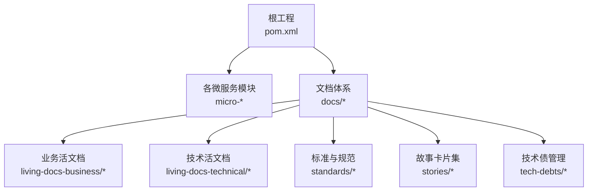
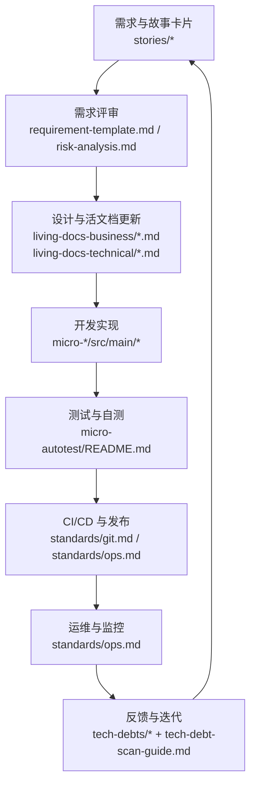
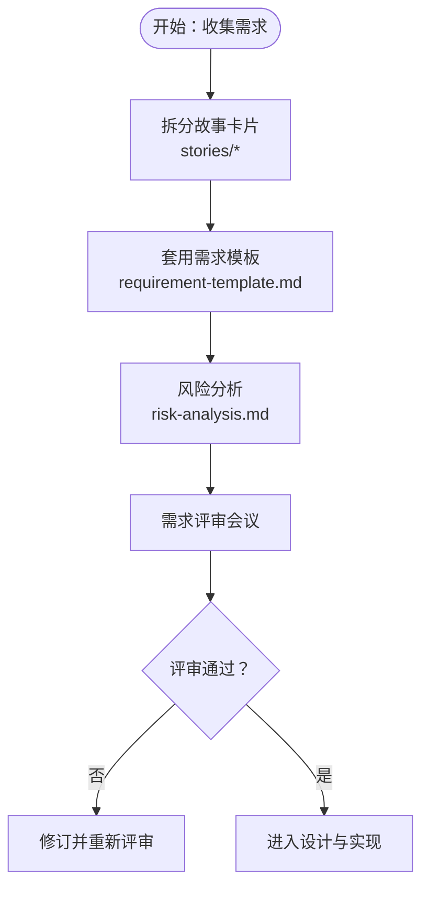
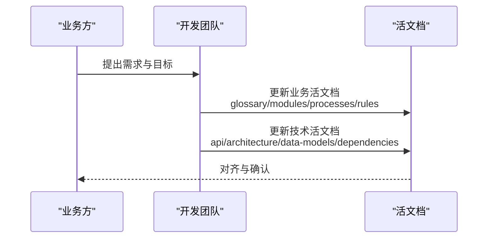
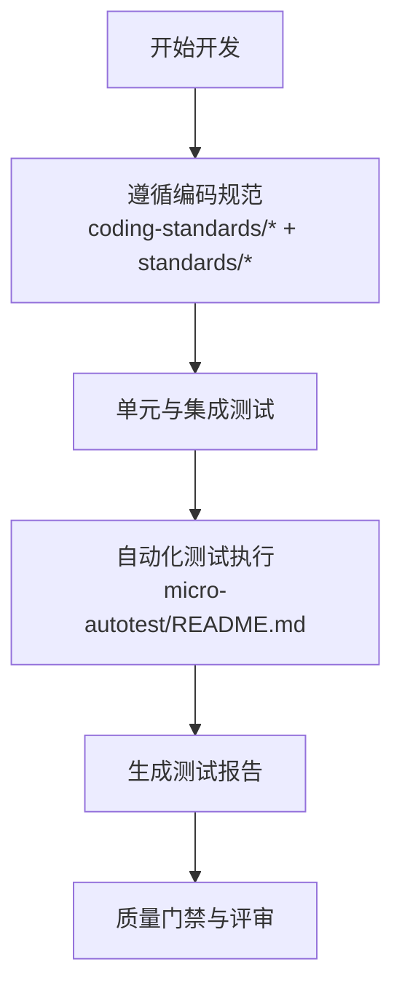
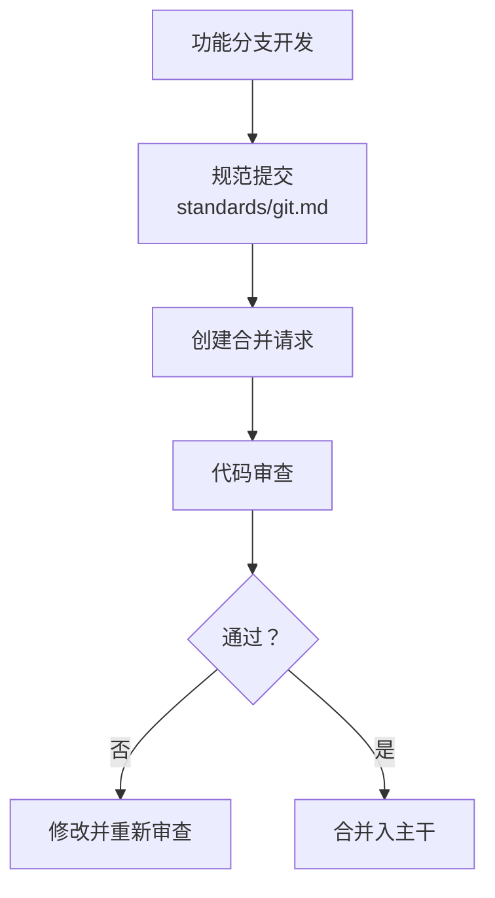
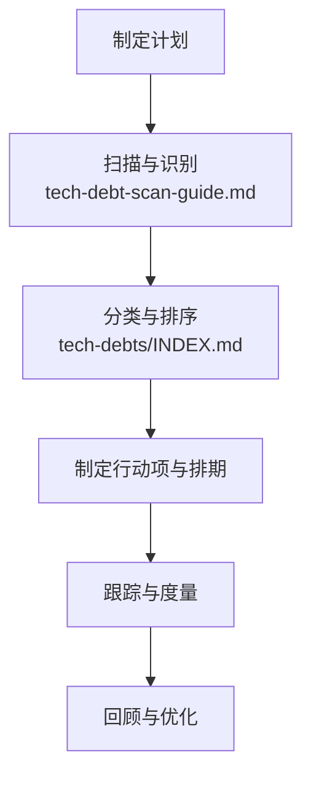
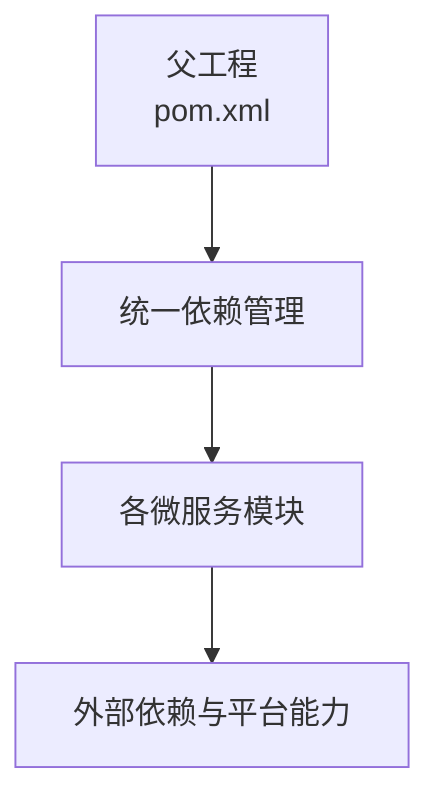

# 开发流程

<cite>
**本文引用的文件**   
- [README.md](file://README.md)
- [CONTEXT.md](file://CONTEXT.md)
- [AGENTS.md](file://AGENTS.md)
- [docs/living-docs-guide.md](file://docs/living-docs-guide.md)
- [docs/requirement-template.md](file://docs/requirement-template.md)
- [docs/risk-analysis.md](file://docs/risk-analysis.md)
- [docs/skill-setup.md](file://docs/skill-setup.md)
- [docs/stories-guide.md](file://docs/stories-guide.md)
- [docs/tech-debt-conventions.md](file://docs/tech-debt-conventions.md)
- [docs/tech-debt-scan-guide.md](file://docs/tech-debt-scan-guide.md)
- [docs/tech-debts/INDEX.md](file://docs/tech-debts/INDEX.md)
- [docs/coding-standards/java.md](file://docs/coding-standards/java.md)
- [docs/standards/git.md](file://docs/standards/git.md)
- [docs/standards/backend.md](file://docs/standards/backend.md)
- [docs/standards/frontend.md](file://docs/standards/frontend.md)
- [docs/standards/api.md](file://docs/standards/api.md)
- [docs/standards/logging.md](file://docs/standards/logging.md)
- [docs/standards/ops.md](file://docs/standards/ops.md)
- [docs/standards/document.md](file://docs/standards/document.md)
- [docs/standards/ai-practice.md](file://docs/standards/ai-practice.md)
- [docs/living-docs-business/README.md](file://docs/living-docs-business/README.md)
- [docs/living-docs-business/glossary/README.md](file://docs/living-docs-business/glossary/README.md)
- [docs/living-docs-business/modules/README.md](file://docs/living-docs-business/modules/README.md)
- [docs/living-docs-business/processes/README.md](file://docs/living-docs-business/processes/README.md)
- [docs/living-docs-business/rules/README.md](file://docs/living-docs-business/rules/README.md)
- [docs/living-docs-technical/README.md](file://docs/living-docs-technical/README.md)
- [docs/living-docs-technical/api/README.md](file://docs/living-docs-technical/api/README.md)
- [docs/living-docs-technical/architecture/deployment.md](file://docs/living-docs-technical/architecture/deployment.md)
- [docs/living-docs-technical/data-models/README.md](file://docs/living-docs-technical/data-models/README.md)
- [docs/living-docs-technical/dependencies/README.md](file://docs/living-docs-technical/dependencies/README.md)
- [docs/living-docs-technical/modules/README.md](file://docs/living-docs-technical/modules/README.md)
- [docs/stories/基础设施/README.md](file://docs/stories/基础设施/README.md)
- [docs/stories/审计校验/README.md](file://docs/stories/审计校验/README.md)
- [docs/stories/微信/README.md](file://docs/stories/微信/README.md)
- [docs/stories/支付/README.md](file://docs/stories/支付/README.md)
- [docs/stories/数据管理/README.md](file://docs/stories/数据管理/README.md)
- [docs/stories/文件文档/README.md](file://docs/stories/文件文档/README.md)
- [docs/stories/消息通知/README.md](file://docs/stories/消息通知/README.md)
- [micro-autotest/README.md](file://micro-autotest/README.md)
</cite>

## 目录
1. [简介](#简介)
2. [项目结构](#项目结构)
3. [核心组件](#核心组件)
4. [架构总览](#架构总览)
5. [详细组件分析](#详细组件分析)
6. [依赖分析](#依赖分析)
7. [性能考虑](#性能考虑)
8. [故障排查指南](#故障排查指南)
9. [结论](#结论)
10. [附录](#附录)

## 简介
本开发流程文档面向 sh-microapp 微服务框架的团队协作与交付实践，覆盖从需求分析、敏捷故事卡片编写、需求评审，到设计、开发、测试、上线与运维的全生命周期。文档同时给出代码提交规范、分支管理策略、代码审查流程、风险评估与技术债治理、重构策略、团队协作工具与沟通机制，以及新成员入职与知识传承的指导。

## 项目结构
仓库采用多模块微服务架构，每个功能域独立为一个子模块（如 audit、dbview、dict、fileos、form、k8s、liteflow、mask、material、msg、pay、pdf、report、rmcheck、seq、wxapp、wxmp），并通过统一的父工程进行版本与依赖管理。业务与技术“活文档”分别归档在 docs 下的 business 与 technical 子目录中，并配套标准规范与指南。

图示来源
- [pom.xml](file://pom.xml)
- [README.md](file://README.md)
- [docs/living-docs-business/README.md](file://docs/living-docs-business/README.md)
- [docs/living-docs-technical/README.md](file://docs/living-docs-technical/README.md)

章节来源
- [README.md](file://README.md)
- [CONTEXT.md](file://CONTEXT.md)

## 核心组件
- 敏捷与需求管理：通过“故事卡片”组织需求，配套“需求模板”“故事指南”“风险分析”等文档，形成可追踪、可评审、可度量的需求基线。
- 技术与业务活文档：业务侧“术语表、模块说明、流程、规则”，技术侧“API、架构部署、数据模型、依赖、模块清单”，确保知识沉淀与跨团队协同。
- 标准与规范：涵盖编码、后端、前端、API、日志、运维、文档、AI 实践等标准，统一开发质量与一致性。
- 技术债治理：建立“扫描指南”“约定与模板”“索引”等机制，推动持续改进与债务可视化。
- 工具与智能体：提供 AGENTS.md 与 .agents/skills/* 的技能与能力清单，支撑智能化辅助与自动化。

章节来源
- [docs/living-docs-guide.md](file://docs/living-docs-guide.md)
- [docs/requirement-template.md](file://docs/requirement-template.md)
- [docs/stories-guide.md](file://docs/stories-guide.md)
- [docs/risk-analysis.md](file://docs/risk-analysis.md)
- [docs/tech-debt-conventions.md](file://docs/tech-debt-conventions.md)
- [docs/tech-debt-scan-guide.md](file://docs/tech-debt-scan-guide.md)
- [docs/tech-debts/INDEX.md](file://docs/tech-debts/INDEX.md)
- [docs/skill-setup.md](file://docs/skill-setup.md)
- [AGENTS.md](file://AGENTS.md)

## 架构总览
下图展示从“需求与故事”到“模块实现”“测试与发布”的整体流转，体现“活文档驱动设计、标准化约束质量、技术债治理保障可持续演进”的闭环。

图示来源
- [docs/stories/基础设施/README.md](file://docs/stories/基础设施/README.md)
- [docs/requirement-template.md](file://docs/requirement-template.md)
- [docs/risk-analysis.md](file://docs/risk-analysis.md)
- [docs/living-docs-business/README.md](file://docs/living-docs-business/README.md)
- [docs/living-docs-technical/README.md](file://docs/living-docs-technical/README.md)
- [micro-autotest/README.md](file://micro-autotest/README.md)
- [docs/standards/git.md](file://docs/standards/git.md)
- [docs/standards/ops.md](file://docs/standards/ops.md)
- [docs/tech-debts/INDEX.md](file://docs/tech-debts/INDEX.md)
- [docs/tech-debt-scan-guide.md](file://docs/tech-debt-scan-guide.md)

## 详细组件分析

### 需求分析与故事卡片
- 故事卡片组织：按领域拆分（基础设施、审计校验、微信、支付、数据管理、文件文档、消息通知），便于跨模块协同与并行开发。
- 编写与评审：使用“需求模板”明确验收条件；“风险分析”识别技术与业务风险点；“故事指南”规范描述、优先级与依赖关系。
- 可追溯性：故事卡片与模块实现、测试用例、API 文档、部署说明联动，形成闭环。

图示来源
- [docs/stories/基础设施/README.md](file://docs/stories/基础设施/README.md)
- [docs/stories/审计校验/README.md](file://docs/stories/审计校验/README.md)
- [docs/stories/微信/README.md](file://docs/stories/微信/README.md)
- [docs/stories/支付/README.md](file://docs/stories/支付/README.md)
- [docs/stories/数据管理/README.md](file://docs/stories/数据管理/README.md)
- [docs/stories/文件文档/README.md](file://docs/stories/文件文档/README.md)
- [docs/stories/消息通知/README.md](file://docs/stories/消息通知/README.md)
- [docs/requirement-template.md](file://docs/requirement-template.md)
- [docs/risk-analysis.md](file://docs/risk-analysis.md)
- [docs/stories-guide.md](file://docs/stories-guide.md)

章节来源
- [docs/stories/基础设施/README.md](file://docs/stories/基础设施/README.md)
- [docs/stories/审计校验/README.md](file://docs/stories/审计校验/README.md)
- [docs/stories/微信/README.md](file://docs/stories/微信/README.md)
- [docs/stories/支付/README.md](file://docs/stories/支付/README.md)
- [docs/stories/数据管理/README.md](file://docs/stories/数据管理/README.md)
- [docs/stories/文件文档/README.md](file://docs/stories/文件文档/README.md)
- [docs/stories/消息通知/README.md](file://docs/stories/消息通知/README.md)
- [docs/requirement-template.md](file://docs/requirement-template.md)
- [docs/risk-analysis.md](file://docs/risk-analysis.md)
- [docs/stories-guide.md](file://docs/stories-guide.md)

### 设计与活文档
- 业务活文档：术语表、模块说明、流程、规则，确保业务方与技术方对齐。
- 技术活文档：API、架构部署、数据模型、依赖、模块清单，支撑系统设计与集成。
- 更新机制：每次需求评审、设计评审、上线变更均需同步更新对应文档，保持“文档即事实”。

图示来源
- [docs/living-docs-business/README.md](file://docs/living-docs-business/README.md)
- [docs/living-docs-business/glossary/README.md](file://docs/living-docs-business/glossary/README.md)
- [docs/living-docs-business/modules/README.md](file://docs/living-docs-business/modules/README.md)
- [docs/living-docs-business/processes/README.md](file://docs/living-docs-business/processes/README.md)
- [docs/living-docs-business/rules/README.md](file://docs/living-docs-business/rules/README.md)
- [docs/living-docs-technical/README.md](file://docs/living-docs-technical/README.md)
- [docs/living-docs-technical/api/README.md](file://docs/living-docs-technical/api/README.md)
- [docs/living-docs-technical/architecture/deployment.md](file://docs/living-docs-technical/architecture/deployment.md)
- [docs/living-docs-technical/data-models/README.md](file://docs/living-docs-technical/data-models/README.md)
- [docs/living-docs-technical/dependencies/README.md](file://docs/living-docs-technical/dependencies/README.md)
- [docs/living-docs-technical/modules/README.md](file://docs/living-docs-technical/modules/README.md)

章节来源
- [docs/living-docs-business/README.md](file://docs/living-docs-business/README.md)
- [docs/living-docs-business/glossary/README.md](file://docs/living-docs-business/glossary/README.md)
- [docs/living-docs-business/modules/README.md](file://docs/living-docs-business/modules/README.md)
- [docs/living-docs-business/processes/README.md](file://docs/living-docs-business/processes/README.md)
- [docs/living-docs-business/rules/README.md](file://docs/living-docs-business/rules/README.md)
- [docs/living-docs-technical/README.md](file://docs/living-docs-technical/README.md)
- [docs/living-docs-technical/api/README.md](file://docs/living-docs-technical/api/README.md)
- [docs/living-docs-technical/architecture/deployment.md](file://docs/living-docs-technical/architecture/deployment.md)
- [docs/living-docs-technical/data-models/README.md](file://docs/living-docs-technical/data-models/README.md)
- [docs/living-docs-technical/dependencies/README.md](file://docs/living-docs-technical/dependencies/README.md)
- [docs/living-docs-technical/modules/README.md](file://docs/living-docs-technical/modules/README.md)

### 开发与测试
- 编码规范：Java、后端、前端、API、日志、文档、AI 实践等标准，确保代码一致性与可维护性。
- 自动化测试：利用 micro-autotest 模块提供的扫描、执行、报告能力，提升回归效率与覆盖率。
- 智能体与工具：AGENTS.md 与 .agents/skills/* 提供可复用的技能与能力，辅助开发与运维。

图示来源
- [docs/coding-standards/java.md](file://docs/coding-standards/java.md)
- [docs/standards/backend.md](file://docs/standards/backend.md)
- [docs/standards/frontend.md](file://docs/standards/frontend.md)
- [docs/standards/api.md](file://docs/standards/api.md)
- [docs/standards/logging.md](file://docs/standards/logging.md)
- [docs/standards/document.md](file://docs/standards/document.md)
- [docs/standards/ai-practice.md](file://docs/standards/ai-practice.md)
- [micro-autotest/README.md](file://micro-autotest/README.md)

章节来源
- [docs/coding-standards/java.md](file://docs/coding-standards/java.md)
- [docs/standards/backend.md](file://docs/standards/backend.md)
- [docs/standards/frontend.md](file://docs/standards/frontend.md)
- [docs/standards/api.md](file://docs/standards/api.md)
- [docs/standards/logging.md](file://docs/standards/logging.md)
- [docs/standards/document.md](file://docs/standards/document.md)
- [docs/standards/ai-practice.md](file://docs/standards/ai-practice.md)
- [micro-autotest/README.md](file://micro-autotest/README.md)

### 分支管理与代码提交
- 分支策略：建议采用 Git 分支模型（如 Git Flow 或 GitHub Flow），结合功能分支、发布分支与热修复分支，保证主干稳定。
- 提交规范：遵循 Git 标准，提交信息清晰、可追踪；配合变更记录与变更日志，便于回溯与审计。
- 合并与审查：通过 Pull/Merge Request 进行代码审查，确保质量门禁与知识共享。

图示来源
- [docs/standards/git.md](file://docs/standards/git.md)

章节来源
- [docs/standards/git.md](file://docs/standards/git.md)

### 代码审查流程
- 审查要点：功能性、可测试性、可维护性、安全性、性能与合规性。
- 审查工具：结合自动化检查（静态分析、测试覆盖率）与人工审查，形成双保险。
- 记录与跟踪：审查意见与决策需在评审记录中留痕，确保可追溯。

章节来源
- [docs/standards/git.md](file://docs/standards/git.md)

### 风险评估与技术债管理
- 风险识别：在需求评审阶段完成，覆盖技术可行性、依赖风险、性能瓶颈、安全与合规等。
- 技术债治理：通过“扫描指南”“约定与模板”“索引”持续发现与治理，避免债滚雪大。
- 重构策略：以小步快跑、可回滚、可观测为原则，优先处理高影响低复杂度的债务。

图示来源
- [docs/risk-analysis.md](file://docs/risk-analysis.md)
- [docs/tech-debt-scan-guide.md](file://docs/tech-debt-scan-guide.md)
- [docs/tech-debts/INDEX.md](file://docs/tech-debts/INDEX.md)
- [docs/tech-debt-conventions.md](file://docs/tech-debt-conventions.md)

章节来源
- [docs/risk-analysis.md](file://docs/risk-analysis.md)
- [docs/tech-debt-scan-guide.md](file://docs/tech-debt-scan-guide.md)
- [docs/tech-debts/INDEX.md](file://docs/tech-debts/INDEX.md)
- [docs/tech-debt-conventions.md](file://docs/tech-debt-conventions.md)

### 团队协作工具与沟通机制
- 工具与智能体：AGENTS.md 与 .agents/skills/* 提供可复用能力，支持自动化辅助与跨模块协作。
- 沟通机制：建议采用站会、迭代评审、回顾会等敏捷仪式，结合即时沟通与文档沉淀，确保信息透明。

章节来源
- [AGENTS.md](file://AGENTS.md)
- [CONTEXT.md](file://CONTEXT.md)

### 新成员入职与知识传承
- 入职引导：通过“技能设置指南”帮助新成员快速上手工具链与工作流。
- 知识传承：以“活文档”为核心，辅以导师制、结对编程与定期分享，确保经验与最佳实践延续。

章节来源
- [docs/skill-setup.md](file://docs/skill-setup.md)
- [docs/living-docs-guide.md](file://docs/living-docs-guide.md)

## 依赖分析
- 模块间依赖：通过统一父工程管理版本与依赖传递，避免重复与冲突。
- 外部依赖：遵循“技术活文档-依赖”说明，统一接入第三方组件与平台能力。
- 质量与安全：在 CI 中集成依赖扫描与漏洞检测，确保供应链安全。

图示来源
- [pom.xml](file://pom.xml)
- [docs/living-docs-technical/dependencies/README.md](file://docs/living-docs-technical/dependencies/README.md)

章节来源
- [pom.xml](file://pom.xml)
- [docs/living-docs-technical/dependencies/README.md](file://docs/living-docs-technical/dependencies/README.md)

## 性能考虑
- 设计阶段：在“技术活文档-架构部署”中明确性能目标与容量规划。
- 开发阶段：遵循编码与日志标准，减少不必要的 IO 与计算开销。
- 测试阶段：在自动化测试中加入性能指标与压力场景，确保上线前达标。

章节来源
- [docs/living-docs-technical/architecture/deployment.md](file://docs/living-docs-technical/architecture/deployment.md)
- [docs/standards/backend.md](file://docs/standards/backend.md)
- [docs/standards/logging.md](file://docs/standards/logging.md)
- [micro-autotest/README.md](file://micro-autotest/README.md)

## 故障排查指南
- 日志与监控：遵循日志标准，确保关键路径可追踪；结合监控告警快速定位问题。
- 回归与验证：利用自动化测试与回归用例，缩短故障修复周期。
- 变更与回滚：严格遵循变更流程与回滚预案，降低变更风险。

章节来源
- [docs/standards/logging.md](file://docs/standards/logging.md)
- [docs/standards/ops.md](file://docs/standards/ops.md)
- [micro-autotest/README.md](file://micro-autotest/README.md)

## 结论
本流程以“活文档”为依据，“标准与规范”为准绳，“技术债治理”为抓手，结合“自动化测试与智能体工具”，构建从需求到交付再到持续演进的闭环。团队应坚持敏捷与质量并重，持续改进与知识传承并举，确保系统长期健康与高效交付。

## 附录
- 快速参考
  - 需求与故事：docs/requirement-template.md、docs/stories-guide.md、docs/risk-analysis.md
  - 活文档：docs/living-docs-business/*、docs/living-docs-technical/*
  - 标准与规范：docs/standards/*
  - 技术债：docs/tech-debts/*、docs/tech-debt-scan-guide.md、docs/tech-debt-conventions.md
  - 工具与智能体：AGENTS.md、.agents/skills/*