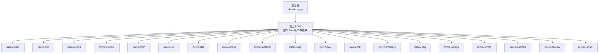
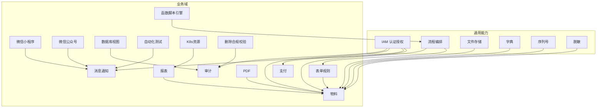
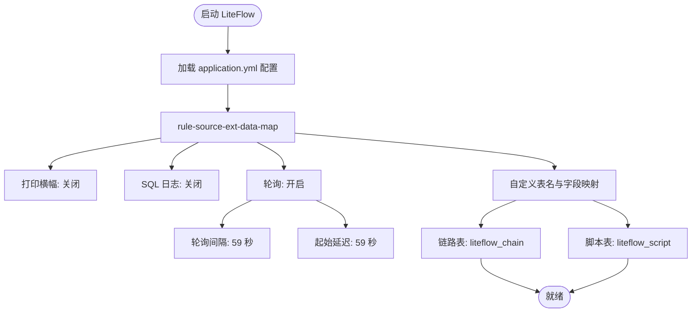
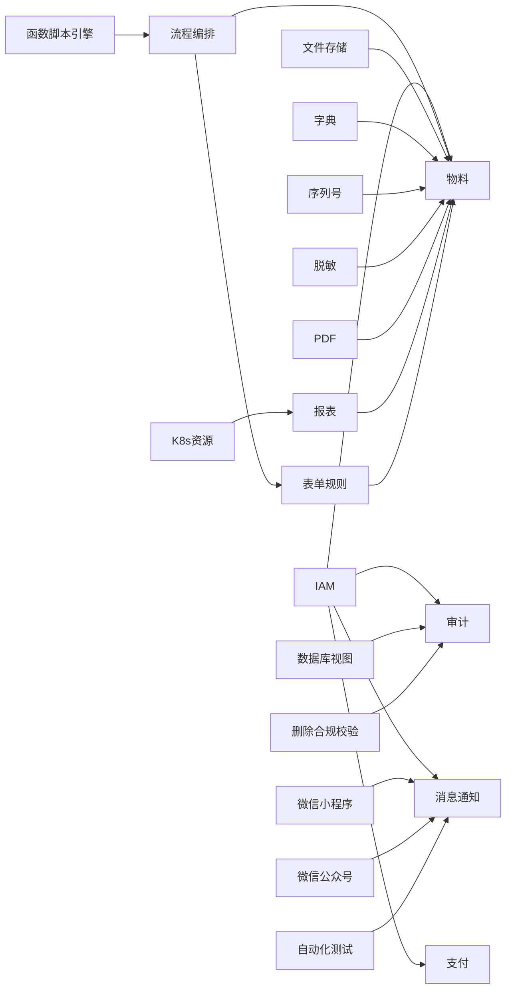

# 开发环境搭建

<cite>
**本文引用的文件**
- [pom.xml](file://pom.xml)
- [README.md](file://README.md)
- [application.yml](file://micro-liteflow/src/main/resources/config/application.yml)
- [java.md](file://docs/coding-standards/java.md)
- [git.md](file://docs/standards/git.md)
- [backend.md](file://docs/standards/backend.md)
- [ops.md](file://docs/standards/ops.md)
- [deployment.md](file://docs/living-docs-technical/architecture/deployment.md)
- [overview.md](file://docs/living-docs-technical/architecture/overview.md)
- [README.md](file://docs/living-docs-technical/modules/README.md)
- [README.md](file://docs/living-docs-business/modules/README.md)
- [README.md](file://docs/living-docs-business/glossary/README.md)
- [README.md](file://docs/living-docs-business/processes/README.md)
- [README.md](file://docs/living-docs-business/rules/README.md)
- [README.md](file://docs/living-docs-business/changelog.md)
- [README.md](file://docs/living-docs-guide.md)
- [requirement-template.md](file://docs/requirement-template.md)
- [risk-analysis.md](file://docs/risk-analysis.md)
- [tech-debt-conventions.md](file://docs/tech-debt-conventions.md)
- [tech-debt-scan-guide.md](file://docs/tech-debt-scan-guide.md)
- [skill-setup.md](file://docs/skill-setup.md)
- [stories-guide.md](file://docs/stories-guide.md)
- [configuration-guide.md](file://micro-fileos/docs/configuration-guide.md)
- [integration-guide.md](file://micro-fileos/docs/integration-guide.md)
- [AGENTS.md](file://AGENTS.md)
- [CONTEXT.md](file://CONTEXT.md)
</cite>

## 目录
1. [简介](#简介)
2. [项目结构](#项目结构)
3. [核心组件](#核心组件)
4. [架构总览](#架构总览)
5. [详细组件分析](#详细组件分析)
6. [依赖分析](#依赖分析)
7. [性能考虑](#性能考虑)
8. [故障排除指南](#故障排除指南)
9. [结论](#结论)
10. [附录](#附录)

## 简介
本指南面向 sh-microapp 微服务框架的开发者，提供从工具链到基础设施再到容器化部署的完整环境搭建流程。内容涵盖 IDE 推荐与插件、JDK 25、Maven、Git 的安装与配置；多模块项目的依赖管理与构建；本地数据库、Redis、消息队列等基础设施的准备；以及 Docker 环境与容器化部署的准备工作。同时给出常见问题排查与解决方案，帮助团队快速达成一致的开发与运维标准。

## 项目结构
sh-microapp 是一个以 Maven 聚合工程组织的多模块微服务仓库，根 POM 定义了统一的 Java 版本（25）与模块清单。各功能域以 micro-xxx 子模块形式存在，如审计、字典、文件存储、流程编排、微信生态、支付、报表等。每个子模块内遵循 Spring Boot 自动装配约定，通过 META-INF/spring 配置导入实现模块化装配。

图表来源
- [pom.xml:28-48](file://pom.xml#L28-L48)

章节来源
- [pom.xml:19-26](file://pom.xml#L19-L26)
- [pom.xml:28-48](file://pom.xml#L28-L48)

## 核心组件
- JDK 25：根 POM 明确指定源码与目标兼容版本为 25，确保所有模块使用一致的编译与运行时。
- Maven：作为统一构建工具，负责多模块编译、打包与依赖解析。
- Git：版本控制与协作规范由团队文档统一约束。
- Spring Boot 自动装配：各模块通过 AutoConfiguration 导入实现按需装配，降低耦合。
- 多模块聚合：根 POM 统一管理模块集合，便于整体构建与发布。

章节来源
- [pom.xml:19-26](file://pom.xml#L19-L26)
- [pom.xml:28-48](file://pom.xml#L28-L48)

## 架构总览
下图展示 sh-microapp 的技术栈与模块关系概览，突出核心业务模块与通用能力模块之间的协作方式。

图表来源
- [pom.xml:28-48](file://pom.xml#L28-L48)
- [overview.md](file://docs/living-docs-technical/architecture/overview.md)

## 详细组件分析

### 开发工具与 IDE 配置
- JDK 25
  - 下载并安装 JDK 25，配置 JAVA_HOME 与 PATH。
  - 在 IDE 中选择对应 SDK，并确认项目编译级别为 25。
- Maven
  - 安装 Maven，配置本地仓库与镜像源（如阿里云镜像），提升依赖下载速度。
  - 在 IDE 中关联 Maven Settings，确保全局设置与本地设置一致。
- Git
  - 安装 Git，配置用户信息与默认编辑器。
  - 使用 SSH 或 HTTPS 连接远程仓库，建议启用强密码保护与双因素认证。
- IDE 插件与格式化
  - 推荐插件：Checkstyle、SpotBugs、SonarLint、Lombok、MyBatis Log、Docker（可选）。
  - 代码风格与检查：参考团队编码规范文档，统一命名、注释与缩进。
  - 提交前执行静态检查与单元测试，保证质量门禁。

章节来源
- [java.md](file://docs/coding-standards/java.md)
- [git.md](file://docs/standards/git.md)
- [backend.md](file://docs/standards/backend.md)

### 依赖管理与模块结构
- 根 POM 统一声明 Java 25 编译级别与模块集合，所有子模块继承父 POM 的版本与依赖管理策略。
- 模块间依赖采用“功能域”划分，避免循环依赖；跨域调用通过 API 层或事件解耦。
- 公共依赖与版本由父 POM 统一管理，子模块仅声明所需坐标，减少重复与冲突。

章节来源
- [pom.xml:19-26](file://pom.xml#L19-L26)
- [pom.xml:28-48](file://pom.xml#L28-L48)

### 基础设施配置（本地）
- 数据库（MySQL/PG）
  - 使用本地 MySQL 或 PostgreSQL 实例，初始化 schema 与基础数据。
  - 各模块的 MyBatis Mapper XML 位于 resources/mapper，确保 SQL 与实体映射正确。
- Redis
  - 启动本地 Redis，用于缓存与会话存储；根据模块需要调整过期策略与内存上限。
- 消息队列（可选）
  - 如涉及异步通知或削峰填谷，可引入 RabbitMQ/Kafka 并在模块中按需启用。
- 文件存储（对象存储）
  - 参考文件模块的配置指南，完成桶、目录与访问凭证的初始化。
- 微信生态
  - 小程序与公众号相关配置需在各自模块中按文档完成，确保回调地址与安全配置正确。

章节来源
- [configuration-guide.md](file://micro-fileos/docs/configuration-guide.md)
- [integration-guide.md](file://micro-fileos/docs/integration-guide.md)

### Docker 环境与容器化准备
- Docker 镜像
  - 为每个微服务编写 Dockerfile，基于精简基础镜像，暴露必要端口，设置健康检查。
  - 使用多阶段构建优化镜像体积，分离编译与运行时环境。
- Compose 编排
  - 使用 docker-compose 编排数据库、Redis、消息队列与核心微服务，定义网络与卷。
  - 通过环境变量注入配置，避免硬编码敏感信息。
- 部署策略
  - 参考架构部署文档，明确灰度发布、滚动更新与回滚策略。
  - 结合 CI/CD 流水线，实现镜像构建、扫描与自动部署。

章节来源
- [deployment.md](file://docs/living-docs-technical/architecture/deployment.md)
- [ops.md](file://docs/standards/ops.md)

### 关键配置示例（LiteFlow）
以下配置展示了如何在 LiteFlow 模块中启用规则源扩展、SQL 日志开关与轮询刷新机制，便于本地调试与性能观察。

图表来源
- [application.yml:2-26](file://micro-liteflow/src/main/resources/config/application.yml#L2-L26)

章节来源
- [application.yml:2-26](file://micro-liteflow/src/main/resources/config/application.yml#L2-L26)

## 依赖分析
- 模块耦合
  - 通用能力模块（如 IAM、LiteFlow、FileOS、Dict、Seq、Mask）被多个业务域模块复用，形成“上层业务依赖底层能力”的清晰分层。
  - 避免跨域直接依赖，通过 API 或事件总线进行通信。
- 外部依赖
  - Spring 生态（Boot/Web/MVC/事务）、MyBatis、Redis 客户端、微信 SDK、支付 SDK 等由父 POM 统一版本管理。
- 循环依赖检测
  - 建议使用工具定期扫描模块依赖图，发现并修正潜在循环依赖。

图表来源
- [pom.xml:28-48](file://pom.xml#L28-L48)

章节来源
- [pom.xml:28-48](file://pom.xml#L28-L48)

## 性能考虑
- 编译与构建
  - 使用 Maven 并行构建与增量编译，合理拆分模块以缩短全量构建时间。
- 运行时
  - 启用合适的 JVM 参数（堆大小、GC 策略、JFR 分析），结合 APM 工具定位热点。
  - 对高频查询与写入路径进行索引优化与 SQL 调优。
- 缓存
  - 合理设置 Redis 过期策略与内存淘汰，避免雪崩与穿透。
- 异步处理
  - 对耗时操作采用消息队列异步化，配合重试与死信队列保障可靠性。

## 故障排除指南
- 构建失败
  - 检查 JDK 版本与 Maven 设置是否匹配根 POM 的 Java 25 要求。
  - 清理本地仓库中的损坏构件，重新拉取依赖。
- 模块启动异常
  - 查看日志中是否存在数据库连接失败、Redis 连接超时或微信/支付回调地址错误。
  - 确认 application.yml 中的外部服务地址与端口正确。
- 单元测试与静态检查
  - 若测试失败，优先修复边界条件与空指针；对 SonarLint 报告逐条验证。
- Git 提交与分支
  - 遵循团队 Git 规范，提交前执行代码风格检查与最小化提交粒度。

章节来源
- [git.md](file://docs/standards/git.md)
- [backend.md](file://docs/standards/backend.md)

## 结论
通过统一的工具链、规范化的模块结构与完善的基础设施准备，sh-microapp 能够支持高并发、可演进的微服务体系。建议团队在本地与 CI 环境中严格执行编码规范与质量门禁，持续完善容器化与可观测性建设，确保交付质量与效率。

## 附录
- 文档导航
  - 技术总览与架构：[overview.md](file://docs/living-docs-technical/architecture/overview.md)
  - 部署与运维：[deployment.md](file://docs/living-docs-technical/architecture/deployment.md)
  - 模块说明：[README.md](file://docs/living-docs-technical/modules/README.md)
  - 业务模块与术语：[README.md](file://docs/living-docs-business/modules/README.md)、[README.md](file://docs/living-docs-business/glossary/README.md)
  - 业务流程与规则：[README.md](file://docs/living-docs-business/processes/README.md)、[README.md](file://docs/living-docs-business/rules/README.md)
  - 变更记录：[README.md](file://docs/living-docs-business/changelog.md)
  - 指南与模板：[README.md](file://docs/living-docs-guide.md)、[requirement-template.md](file://docs/requirement-template.md)
  - 风险与债务：[risk-analysis.md](file://docs/risk-analysis.md)、[tech-debt-conventions.md](file://docs/tech-debt-conventions.md)、[tech-debt-scan-guide.md](file://docs/tech-debt-scan-guide.md)
  - 技能与故事：[skill-setup.md](file://docs/skill-setup.md)、[stories-guide.md](file://docs/stories-guide.md)
  - Agent 与上下文：[AGENTS.md](file://AGENTS.md)、[CONTEXT.md](file://CONTEXT.md)