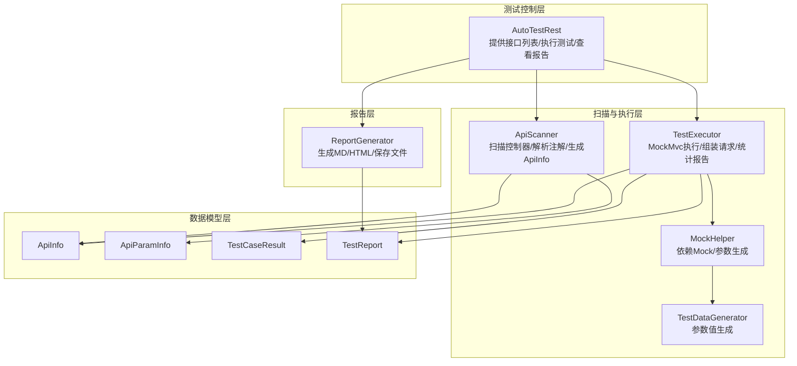
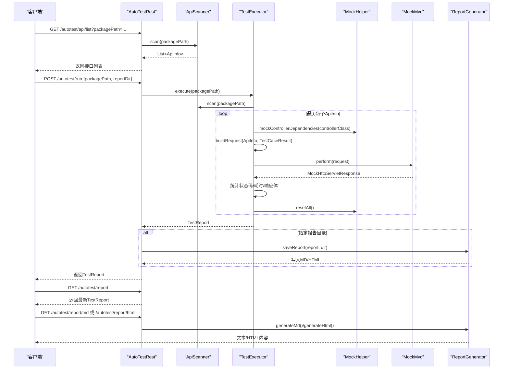
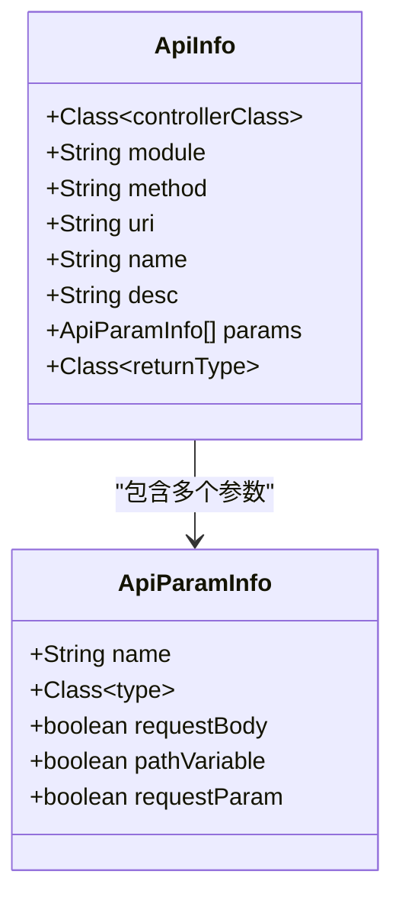
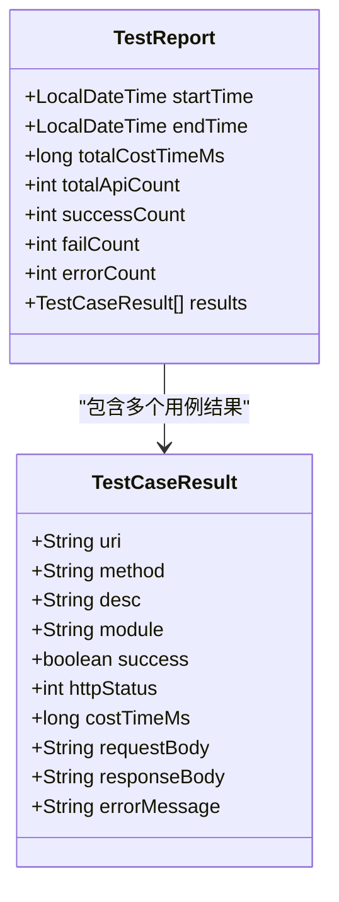
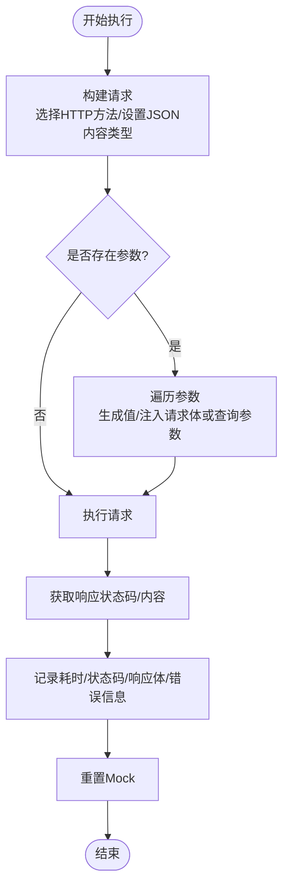
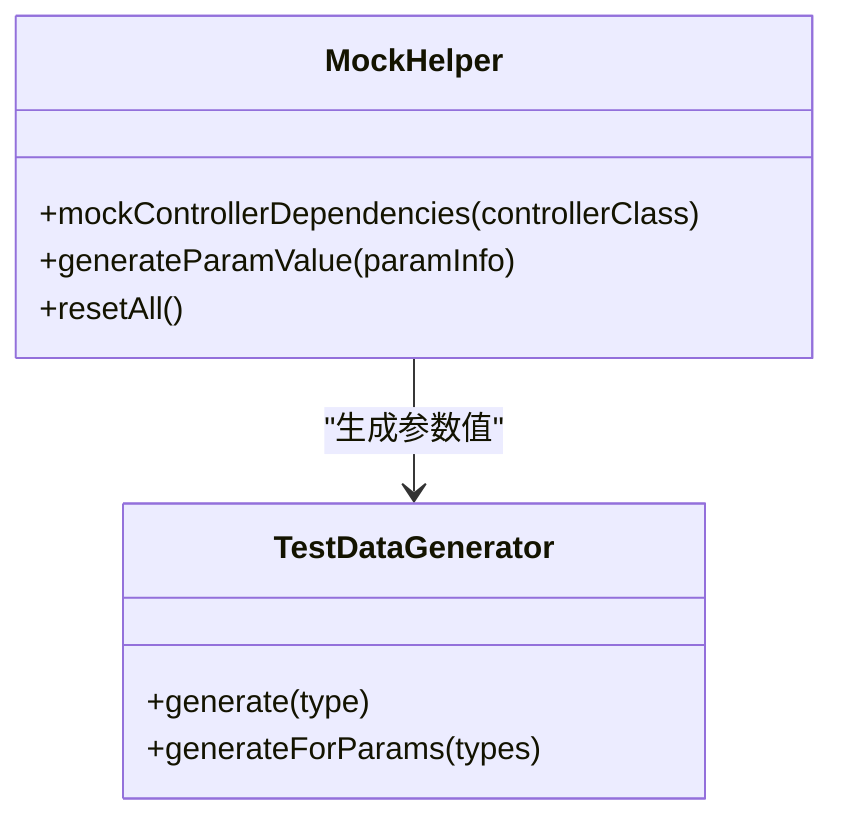
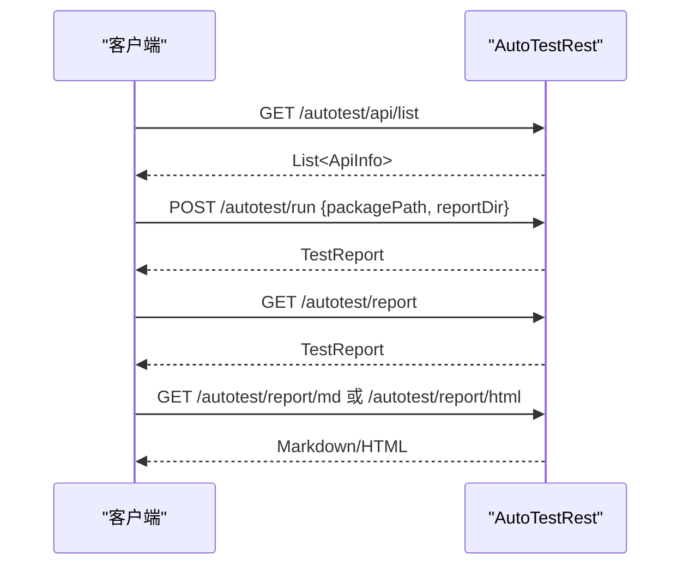
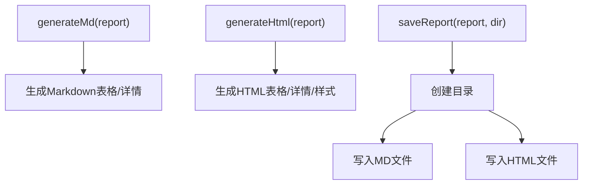
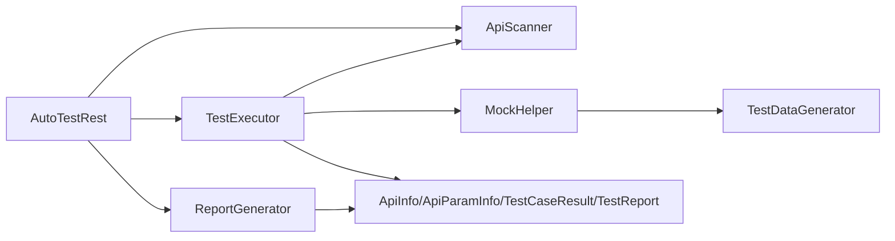

# API测试

<cite>
**本文引用的文件**
- [ApiInfo.java](file://micro-autotest/src/main/java/com/wkclz/auto/bean/ApiInfo.java)
- [ApiParamInfo.java](file://micro-autotest/src/main/java/com/wkclz/auto/bean/ApiParamInfo.java)
- [TestCaseResult.java](file://micro-autotest/src/main/java/com/wkclz/auto/bean/TestCaseResult.java)
- [TestReport.java](file://micro-autotest/src/main/java/com/wkclz/auto/bean/TestReport.java)
- [TestExecutor.java](file://micro-autotest/src/main/java/com/wkclz/auto/executor/TestExecutor.java)
- [ApiScanner.java](file://micro-autotest/src/main/java/com/wkclz/auto/scanner/ApiScanner.java)
- [MockHelper.java](file://micro-autotest/src/main/java/com/wkclz/auto/mock/MockHelper.java)
- [TestDataGenerator.java](file://micro-autotest/src/main/java/com/wkclz/auto/mock/TestDataGenerator.java)
- [AutoTestRest.java](file://micro-autotest/src/main/java/com/wkclz/auto/rest/AutoTestRest.java)
- [ReportGenerator.java](file://micro-autotest/src/main/java/com/wkclz/auto/report/ReportGenerator.java)
</cite>

## 目录
1. [简介](#简介)
2. [项目结构](#项目结构)
3. [核心组件](#核心组件)
4. [架构总览](#架构总览)
5. [详细组件分析](#详细组件分析)
6. [依赖分析](#依赖分析)
7. [性能考虑](#性能考虑)
8. [故障排查指南](#故障排查指南)
9. [结论](#结论)
10. [附录](#附录)

## 简介
本文件面向sh-microapp微服务框架的API测试，系统性介绍基于Spring MVC Test的自动化测试能力，涵盖RESTful API测试方法、HTTP请求构建、响应验证与状态码检查；解释ApiInfo的API信息采集机制与TestCaseResult的测试结果记录；提供参数化测试、边界值测试与错误场景测试的最佳实践；展示如何使用TestReport生成测试报告，并说明如何扩展以支持API性能测试与负载测试。

## 项目结构
微服务框架中，API测试能力集中在micro-autotest模块，核心由以下层次构成：
- 扫描层：扫描控制器类，解析注解与参数，生成ApiInfo集合
- 执行层：基于MockMvc构造HTTP请求，调用控制器，收集结果
- 结果层：封装单个用例结果TestCaseResult与整体报告TestReport
- 报告层：生成Markdown/HTML报告，可持久化到磁盘
- 控制器层：对外提供查询接口列表、执行测试、查看报告等REST接口

图表来源
- [AutoTestRest.java:1-92](file://micro-autotest/src/main/java/com/wkclz/auto/rest/AutoTestRest.java#L1-L92)
- [ApiScanner.java:1-272](file://micro-autotest/src/main/java/com/wkclz/auto/scanner/ApiScanner.java#L1-L272)
- [TestExecutor.java:1-196](file://micro-autotest/src/main/java/com/wkclz/auto/executor/TestExecutor.java#L1-L196)
- [MockHelper.java:1-66](file://micro-autotest/src/main/java/com/wkclz/auto/mock/MockHelper.java#L1-L66)
- [TestDataGenerator.java:1-111](file://micro-autotest/src/main/java/com/wkclz/auto/mock/TestDataGenerator.java#L1-L111)
- [ApiInfo.java:1-18](file://micro-autotest/src/main/java/com/wkclz/auto/bean/ApiInfo.java#L1-L18)
- [ApiParamInfo.java:1-14](file://micro-autotest/src/main/java/com/wkclz/auto/bean/ApiParamInfo.java#L1-L14)
- [TestCaseResult.java:1-19](file://micro-autotest/src/main/java/com/wkclz/auto/bean/TestCaseResult.java#L1-L19)
- [TestReport.java:1-19](file://micro-autotest/src/main/java/com/wkclz/auto/bean/TestReport.java#L1-L19)
- [ReportGenerator.java:1-214](file://micro-autotest/src/main/java/com/wkclz/auto/report/ReportGenerator.java#L1-L214)

章节来源
- [AutoTestRest.java:1-92](file://micro-autotest/src/main/java/com/wkclz/auto/rest/AutoTestRest.java#L1-L92)
- [ApiScanner.java:1-272](file://micro-autotest/src/main/java/com/wkclz/auto/scanner/ApiScanner.java#L1-L272)
- [TestExecutor.java:1-196](file://micro-autotest/src/main/java/com/wkclz/auto/executor/TestExecutor.java#L1-L196)
- [ReportGenerator.java:1-214](file://micro-autotest/src/main/java/com/wkclz/auto/report/ReportGenerator.java#L1-L214)

## 核心组件
- ApiInfo：描述一个REST接口的元信息，包含控制器类、模块、HTTP方法、URI、名称、描述、参数列表与返回类型
- ApiParamInfo：描述接口参数的元信息，包含参数名、类型及参数位置（请求体/路径变量/请求参数）
- TestCaseResult：描述单个接口测试用例的结果，包含URI、方法、描述、模块、成功标志、HTTP状态码、耗时、请求/响应体、错误信息
- TestReport：描述整次测试的汇总报告，包含开始/结束时间、总耗时、总用例数、成功/失败/错误数量与明细列表
- TestExecutor：测试执行器，负责扫描API、构造请求、执行并统计报告
- ApiScanner：扫描器，基于注解与包路径发现控制器与路由，解析方法签名与参数
- MockHelper：依赖Mock与参数生成辅助器
- TestDataGenerator：参数值生成器，支持基础类型、日期时间、枚举、集合与对象
- AutoTestRest：对外暴露的测试管理REST接口
- ReportGenerator：报告生成器，输出Markdown/HTML并可落盘

章节来源
- [ApiInfo.java:1-18](file://micro-autotest/src/main/java/com/wkclz/auto/bean/ApiInfo.java#L1-L18)
- [ApiParamInfo.java:1-14](file://micro-autotest/src/main/java/com/wkclz/auto/bean/ApiParamInfo.java#L1-L14)
- [TestCaseResult.java:1-19](file://micro-autotest/src/main/java/com/wkclz/auto/bean/TestCaseResult.java#L1-L19)
- [TestReport.java:1-19](file://micro-autotest/src/main/java/com/wkclz/auto/bean/TestReport.java#L1-L19)
- [TestExecutor.java:1-196](file://micro-autotest/src/main/java/com/wkclz/auto/executor/TestExecutor.java#L1-L196)
- [ApiScanner.java:1-272](file://micro-autotest/src/main/java/com/wkclz/auto/scanner/ApiScanner.java#L1-L272)
- [MockHelper.java:1-66](file://micro-autotest/src/main/java/com/wkclz/auto/mock/MockHelper.java#L1-L66)
- [TestDataGenerator.java:1-111](file://micro-autotest/src/main/java/com/wkclz/auto/mock/TestDataGenerator.java#L1-L111)
- [AutoTestRest.java:1-92](file://micro-autotest/src/main/java/com/wkclz/auto/rest/AutoTestRest.java#L1-L92)
- [ReportGenerator.java:1-214](file://micro-autotest/src/main/java/com/wkclz/auto/report/ReportGenerator.java#L1-L214)

## 架构总览
下图展示了从REST接口列表查询到测试执行与报告生成的端到端流程：

图表来源
- [AutoTestRest.java:1-92](file://micro-autotest/src/main/java/com/wkclz/auto/rest/AutoTestRest.java#L1-L92)
- [ApiScanner.java:1-272](file://micro-autotest/src/main/java/com/wkclz/auto/scanner/ApiScanner.java#L1-L272)
- [TestExecutor.java:1-196](file://micro-autotest/src/main/java/com/wkclz/auto/executor/TestExecutor.java#L1-L196)
- [MockHelper.java:1-66](file://micro-autotest/src/main/java/com/wkclz/auto/mock/MockHelper.java#L1-L66)
- [ReportGenerator.java:1-214](file://micro-autotest/src/main/java/com/wkclz/auto/report/ReportGenerator.java#L1-L214)

## 详细组件分析

### ApiInfo与ApiParamInfo：API信息采集机制
- ApiInfo通过扫描控制器类上的@RequestMapping、@GetMapping、@PostMapping、@PutMapping、@DeleteMapping等注解，提取HTTP方法、URI与描述信息，并结合类级@RequestMapping前缀拼接完整URI
- 参数解析通过ApiParamInfo标记参数位置：@RequestBody、@PathVariable、@RequestParam，用于后续请求构造
- 描述信息可通过自定义注解补充，扫描器会将模块与描述附加到匹配的ApiInfo上

图表来源
- [ApiInfo.java:1-18](file://micro-autotest/src/main/java/com/wkclz/auto/bean/ApiInfo.java#L1-L18)
- [ApiParamInfo.java:1-14](file://micro-autotest/src/main/java/com/wkclz/auto/bean/ApiParamInfo.java#L1-L14)
- [ApiScanner.java:1-272](file://micro-autotest/src/main/java/com/wkclz/auto/scanner/ApiScanner.java#L1-L272)

章节来源
- [ApiScanner.java:101-184](file://micro-autotest/src/main/java/com/wkclz/auto/scanner/ApiScanner.java#L101-L184)
- [ApiScanner.java:186-201](file://micro-autotest/src/main/java/com/wkclz/auto/scanner/ApiScanner.java#L186-L201)
- [ApiScanner.java:203-270](file://micro-autotest/src/main/java/com/wkclz/auto/scanner/ApiScanner.java#L203-L270)

### TestCaseResult与TestReport：测试结果记录
- TestCaseResult记录单个接口的URI、方法、描述、模块、成功标志、HTTP状态码、耗时、请求/响应体与错误信息
- TestReport聚合开始/结束时间、总耗时、总用例数、成功/失败/错误数量与明细列表，便于统计与报告生成

图表来源
- [TestCaseResult.java:1-19](file://micro-autotest/src/main/java/com/wkclz/auto/bean/TestCaseResult.java#L1-L19)
- [TestReport.java:1-19](file://micro-autotest/src/main/java/com/wkclz/auto/bean/TestReport.java#L1-L19)

章节来源
- [TestExecutor.java:49-75](file://micro-autotest/src/main/java/com/wkclz/auto/executor/TestExecutor.java#L49-L75)
- [TestExecutor.java:77-108](file://micro-autotest/src/main/java/com/wkclz/auto/executor/TestExecutor.java#L77-L108)

### TestExecutor：HTTP请求构建与执行
- 使用MockMvc在内存中执行请求，支持GET/POST/PUT/DELETE，默认JSON内容类型
- 对于GET请求，自动递归遍历参数类型，按字段名拼接为查询参数；对于非GET请求，将参数序列化为JSON写入请求体
- 通过MockHelper对控制器依赖进行Mock，避免真实外部依赖；测试结束后重置Mock
- 统计耗时、状态码与响应体，填充TestCaseResult并汇总TestReport

图表来源
- [TestExecutor.java:110-158](file://micro-autotest/src/main/java/com/wkclz/auto/executor/TestExecutor.java#L110-L158)
- [TestExecutor.java:160-194](file://micro-autotest/src/main/java/com/wkclz/auto/executor/TestExecutor.java#L160-L194)
- [TestExecutor.java:77-108](file://micro-autotest/src/main/java/com/wkclz/auto/executor/TestExecutor.java#L77-L108)

章节来源
- [TestExecutor.java:44-75](file://micro-autotest/src/main/java/com/wkclz/auto/executor/TestExecutor.java#L44-L75)
- [TestExecutor.java:110-158](file://micro-autotest/src/main/java/com/wkclz/auto/executor/TestExecutor.java#L110-L158)
- [TestExecutor.java:160-194](file://micro-autotest/src/main/java/com/wkclz/auto/executor/TestExecutor.java#L160-L194)

### MockHelper与TestDataGenerator：参数化与依赖隔离
- MockHelper根据控制器字段类型查找Spring Bean名称，使用Mockito对依赖进行Mock，并在测试后统一重置
- TestDataGenerator支持基础类型、日期时间、枚举、集合与对象的递归生成，跳过特定字段，避免无关属性干扰

图表来源
- [MockHelper.java:1-66](file://micro-autotest/src/main/java/com/wkclz/auto/mock/MockHelper.java#L1-L66)
- [TestDataGenerator.java:1-111](file://micro-autotest/src/main/java/com/wkclz/auto/mock/TestDataGenerator.java#L1-L111)

章节来源
- [MockHelper.java:31-52](file://micro-autotest/src/main/java/com/wkclz/auto/mock/MockHelper.java#L31-L52)
- [TestDataGenerator.java:22-101](file://micro-autotest/src/main/java/com/wkclz/auto/mock/TestDataGenerator.java#L22-L101)

### AutoTestRest：测试管理REST接口
- 提供接口列表查询、执行测试、查看最新报告、导出Markdown/HTML报告等能力
- 支持将报告保存至指定目录，便于CI/CD集成

图表来源
- [AutoTestRest.java:43-90](file://micro-autotest/src/main/java/com/wkclz/auto/rest/AutoTestRest.java#L43-L90)

章节来源
- [AutoTestRest.java:43-90](file://micro-autotest/src/main/java/com/wkclz/auto/rest/AutoTestRest.java#L43-L90)

### ReportGenerator：测试报告生成
- 生成Markdown与HTML两种格式，包含摘要卡片、测试详情表格与失败用例详情
- 可选将报告保存到磁盘，文件名包含时间戳，便于版本对比与归档

图表来源
- [ReportGenerator.java:22-83](file://micro-autotest/src/main/java/com/wkclz/auto/report/ReportGenerator.java#L22-L83)
- [ReportGenerator.java:85-190](file://micro-autotest/src/main/java/com/wkclz/auto/report/ReportGenerator.java#L85-L190)
- [ReportGenerator.java:192-212](file://micro-autotest/src/main/java/com/wkclz/auto/report/ReportGenerator.java#L192-L212)

章节来源
- [ReportGenerator.java:22-83](file://micro-autotest/src/main/java/com/wkclz/auto/report/ReportGenerator.java#L22-L83)
- [ReportGenerator.java:85-190](file://micro-autotest/src/main/java/com/wkclz/auto/report/ReportGenerator.java#L85-L190)
- [ReportGenerator.java:192-212](file://micro-autotest/src/main/java/com/wkclz/auto/report/ReportGenerator.java#L192-L212)

## 依赖分析
- 组件内聚与耦合
  - TestExecutor高度依赖ApiScanner与MockHelper，职责清晰，内聚度高
  - AutoTestRest仅作为门面，依赖ApiScanner、TestExecutor与ReportGenerator，保持薄层控制
  - ReportGenerator独立于执行逻辑，仅消费TestReport，低耦合
- 外部依赖
  - Spring MVC Test用于模拟HTTP请求
  - Fastjson用于JSON序列化
  - SLF4J用于日志
  - Mockito用于依赖Mock
- 潜在循环依赖
  - 当前模块未见循环依赖迹象

图表来源
- [AutoTestRest.java:1-92](file://micro-autotest/src/main/java/com/wkclz/auto/rest/AutoTestRest.java#L1-L92)
- [ApiScanner.java:1-272](file://micro-autotest/src/main/java/com/wkclz/auto/scanner/ApiScanner.java#L1-L272)
- [TestExecutor.java:1-196](file://micro-autotest/src/main/java/com/wkclz/auto/executor/TestExecutor.java#L1-L196)
- [MockHelper.java:1-66](file://micro-autotest/src/main/java/com/wkclz/auto/mock/MockHelper.java#L1-L66)
- [TestDataGenerator.java:1-111](file://micro-autotest/src/main/java/com/wkclz/auto/mock/TestDataGenerator.java#L1-L111)
- [ReportGenerator.java:1-214](file://micro-autotest/src/main/java/com/wkclz/auto/report/ReportGenerator.java#L1-L214)

章节来源
- [AutoTestRest.java:1-92](file://micro-autotest/src/main/java/com/wkclz/auto/rest/AutoTestRest.java#L1-L92)
- [TestExecutor.java:1-196](file://micro-autotest/src/main/java/com/wkclz/auto/executor/TestExecutor.java#L1-L196)

## 性能考虑
- 单次测试总耗时由各接口耗时累加，建议：
  - 合理拆分测试包路径，减少扫描范围
  - 在CI中并行执行不同模块的测试任务
  - 对高频接口采用缓存策略（如依赖Mock），避免重复初始化
- 请求构造与序列化
  - 对大对象请求体，尽量简化DTO结构或使用最小必要字段
  - 使用MockMvc而非启动完整容器，显著降低开销
- 报告生成
  - HTML报告包含样式与细节，建议仅在本地或CI制品中生成，避免频繁落盘

## 故障排查指南
- 常见问题
  - 无法扫描到接口：确认包路径正确且控制器类使用了受支持的注解
  - 参数缺失导致400：检查ApiParamInfo是否正确识别参数位置；GET参数需为简单类型或可序列化的对象
  - 依赖注入失败：MockHelper会尝试对控制器字段进行Mock，若Bean不存在则忽略；可在测试前准备必要的桩数据
  - 报告为空：确保先执行测试再查询报告；检查reportDir是否可写
- 日志定位
  - 执行异常会在日志中记录，包含URI与异常信息，便于快速定位
- 建议
  - 对关键接口增加边界值与错误场景用例（例如空值、超长字符串、非法枚举值等）
  - 将测试纳入CI流水线，定期生成报告并监控成功率趋势

章节来源
- [TestExecutor.java:98-105](file://micro-autotest/src/main/java/com/wkclz/auto/executor/TestExecutor.java#L98-L105)
- [AutoTestRest.java:66-70](file://micro-autotest/src/main/java/com/wkclz/auto/rest/AutoTestRest.java#L66-L70)

## 结论
sh-microapp的API测试体系以Spring MVC Test为核心，通过扫描器自动发现接口、执行器构造请求并收集结果、报告器生成可视化报告，形成闭环的自动化测试方案。结合Mock与参数生成，既能覆盖正常路径，也能有效识别边界与错误场景。建议在实际工程中配合CI/CD持续运行，并逐步扩展性能与负载测试能力。

## 附录

### RESTful API测试最佳实践
- 参数化测试
  - 利用ApiParamInfo识别参数位置，自动注入请求体或查询参数
  - 对复杂对象，使用TestDataGenerator生成最小可用实例
- 边界值测试
  - 对字符串/数值/日期时间等类型，构造边界值（空串、极小/极大、null、非法枚举）
  - 对数组/集合，构造空集、单元素、多元素等场景
- 错误场景测试
  - 缺少必填参数触发400
  - 超出长度限制触发400
  - 权限不足触发403
  - 业务异常触发422/5xx
- 响应验证与状态码检查
  - 2xx：断言响应体结构与关键字段
  - 4xx：断言错误码与错误信息
  - 5xx：关注降级与日志

### 如何使用TestReport生成测试报告
- 通过AutoTestRest的“执行测试”接口获取TestReport
- 通过“测试报告(MD)”或“测试报告(HTML)”接口获取文本/HTML内容
- 若提供reportDir，报告将被保存为同名文件，便于归档与对比

章节来源
- [AutoTestRest.java:50-90](file://micro-autotest/src/main/java/com/wkclz/auto/rest/AutoTestRest.java#L50-L90)
- [ReportGenerator.java:192-212](file://micro-autotest/src/main/java/com/wkclz/auto/report/ReportGenerator.java#L192-L212)

### API性能测试与负载测试扩展建议
- 性能测试
  - 在现有执行器基础上，增加并发线程数与迭代次数，统计平均/95分位/最大耗时
  - 对热点接口进行压力测试，观察CPU/内存/数据库连接池使用情况
- 负载测试
  - 引入外部压测工具（如JMeter/Gatling）对关键接口施加阶梯式负载
  - 关注错误率、响应时间与吞吐量指标，定位瓶颈
- 注意事项
  - 负载测试需隔离环境，避免影响生产
  - 对有副作用的接口（如新增/修改）需谨慎设计测试场景