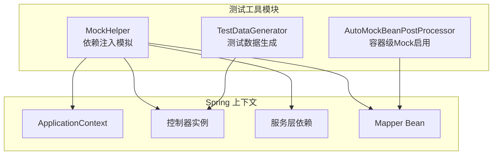
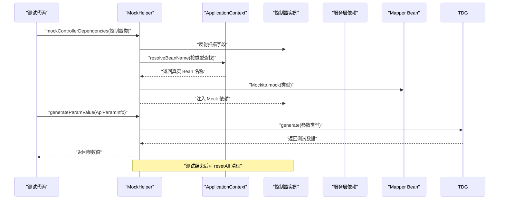
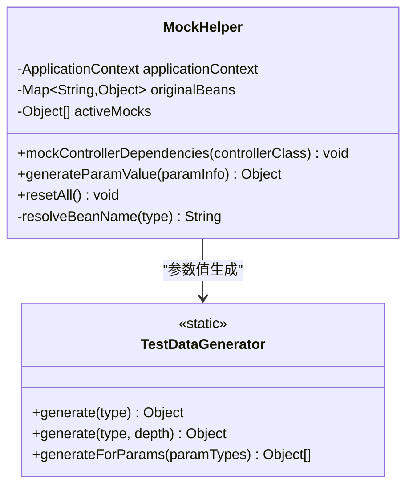
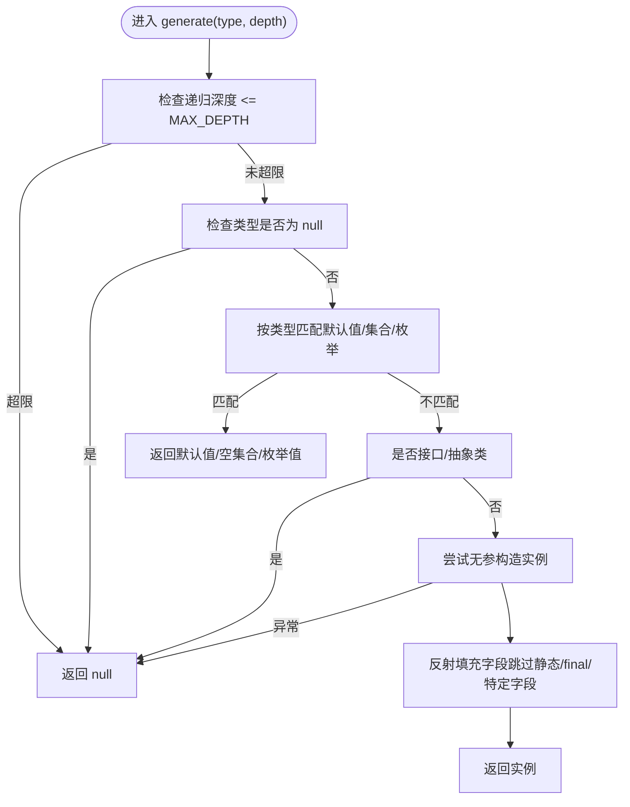
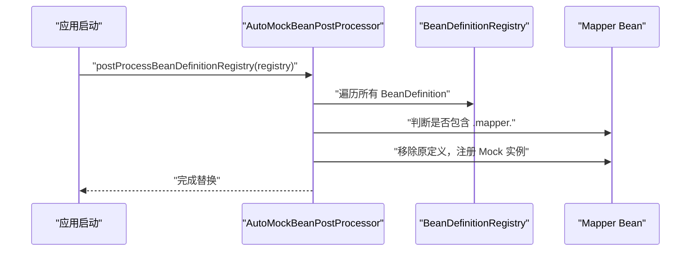
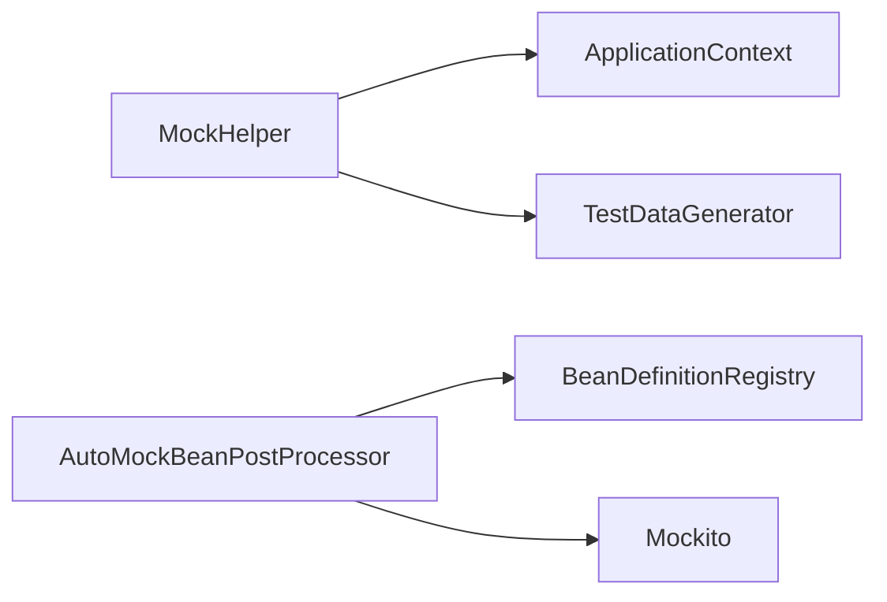

# 单元测试

<cite>
**本文引用的文件**
- [MockHelper.java](file://micro-autotest/src/main/java/com/wkclz/auto/mock/MockHelper.java)
- [TestDataGenerator.java](file://micro-autotest/src/main/java/com/wkclz/auto/mock/TestDataGenerator.java)
- [AutoMockBeanPostProcessor.java](file://micro-autotest/src/main/java/com/wkclz/auto/mock/AutoMockBeanPostProcessor.java)
- [README.md](file://micro-autotest/README.md)
</cite>

## 目录
1. [引言](#引言)
2. [项目结构](#项目结构)
3. [核心组件](#核心组件)
4. [架构总览](#架构总览)
5. [详细组件分析](#详细组件分析)
6. [依赖关系分析](#依赖关系分析)
7. [性能考虑](#性能考虑)
8. [故障排查指南](#故障排查指南)
9. [结论](#结论)
10. [附录](#附录)

## 引言
本文件面向 sh-microapp 微服务框架的单元测试设计与实践，聚焦于 micro-autotest 模块提供的自动化测试能力与工具。内容涵盖：
- 单元测试设计原则与最佳实践
- 测试用例编写规范、Mock 对象使用策略、测试数据准备方法
- 如何使用 MockHelper 进行依赖注入模拟
- 如何利用 TestDataGenerator 生成测试数据
- 具体的单元测试示例思路与流程图
- 测试隔离、断言编写与异常处理的测试方法

## 项目结构
micro-autotest 模块提供“零配置”的 REST API 自动化测试能力，核心由以下组件构成：
- MockHelper：用于在测试中动态替换控制器依赖为 Mockito Mock，并支持参数值生成
- TestDataGenerator：通过反射递归生成各类类型的测试数据，覆盖基础类型、集合、POJO 等
- AutoMockBeanPostProcessor：在容器启动阶段自动将 Mapper Bean 替换为 Mockito Mock，便于端到端或集成测试

图表来源
- [MockHelper.java:1-66](file://micro-autotest/src/main/java/com/wkclz/auto/mock/MockHelper.java#L1-L66)
- [TestDataGenerator.java:1-111](file://micro-autotest/src/main/java/com/wkclz/auto/mock/TestDataGenerator.java#L1-L111)
- [AutoMockBeanPostProcessor.java:1-89](file://micro-autotest/src/main/java/com/wkclz/auto/mock/AutoMockBeanPostProcessor.java#L1-L89)

章节来源
- [README.md:1-199](file://micro-autotest/README.md#L1-L199)

## 核心组件
- MockHelper
  - 作用：扫描控制器字段，识别可注入的非静态、非 final 依赖，按类型从 ApplicationContext 解析 Bean 名称并替换为 Mockito Mock；同时提供参数值生成入口
  - 关键行为：依赖解析、Mock 注入、参数值生成、重置清理
- TestDataGenerator
  - 作用：根据类型规则生成测试数据，支持基础类型、时间类型、集合、枚举、POJO 等；通过反射递归填充 POJO 字段，限制最大递归深度
  - 关键行为：类型匹配、递归构造、字段过滤、异常兜底
- AutoMockBeanPostProcessor
  - 作用：在 Bean 定义注册阶段识别 Mapper Bean 并替换为 Mockito Mock 实例，支持全局开关控制
  - 关键行为：启用/禁用开关、扫描 .mapper. 包路径、替换 Bean 定义、注册 Mock 实例

章节来源
- [MockHelper.java:17-66](file://micro-autotest/src/main/java/com/wkclz/auto/mock/MockHelper.java#L17-L66)
- [TestDataGenerator.java:17-111](file://micro-autotest/src/main/java/com/wkclz/auto/mock/TestDataGenerator.java#L17-L111)
- [AutoMockBeanPostProcessor.java:17-89](file://micro-autotest/src/main/java/com/wkclz/auto/mock/AutoMockBeanPostProcessor.java#L17-L89)

## 架构总览
下图展示了单元测试执行时，MockHelper 与 TestDataGenerator 在控制器测试中的协作关系，以及 AutoMockBeanPostProcessor 在容器启动阶段对 Mapper 的替换。

图表来源
- [MockHelper.java:31-52](file://micro-autotest/src/main/java/com/wkclz/auto/mock/MockHelper.java#L31-L52)
- [TestDataGenerator.java:22-101](file://micro-autotest/src/main/java/com/wkclz/auto/mock/TestDataGenerator.java#L22-L101)

## 详细组件分析

### MockHelper 组件分析
- 设计要点
  - 通过反射遍历控制器字段，排除静态与 final 字段，按类型从 ApplicationContext 解析 Bean 名称并替换为 Mockito.Mock
  - 记录原始 Bean 与活跃 Mock 列表，支持统一 reset
  - 提供 generateParamValue 作为测试参数值生成入口，委托给 TestDataGenerator
- 适用场景
  - 单元测试中隔离控制器与真实服务/持久层依赖
  - 快速构造控制器测试所需的依赖图
- 注意事项
  - 仅对非静态、非 final 字段生效
  - 依赖类型需能在 ApplicationContext 中唯一解析

图表来源
- [MockHelper.java:17-66](file://micro-autotest/src/main/java/com/wkclz/auto/mock/MockHelper.java#L17-L66)
- [TestDataGenerator.java:17-111](file://micro-autotest/src/main/java/com/wkclz/auto/mock/TestDataGenerator.java#L17-L111)

章节来源
- [MockHelper.java:17-66](file://micro-autotest/src/main/java/com/wkclz/auto/mock/MockHelper.java#L17-L66)

### TestDataGenerator 组件分析
- 设计要点
  - 类型覆盖：基础类型、字符串、时间类型、枚举、集合、数组、Object
  - 递归构造：对 POJO 通过反射构造实例并填充字段，跳过静态/final/特定字段名
  - 限制与兜底：最大递归深度、构造异常时返回 null
- 适用场景
  - 自动生成接口请求体、查询参数等测试数据
  - 为复杂嵌套对象快速生成可序列化的测试载荷
- 最佳实践
  - 明确测试关注点，必要时对生成数据进行二次修正
  - 对边界条件（空集合、null、极端值）单独构造用例

图表来源
- [TestDataGenerator.java:22-101](file://micro-autotest/src/main/java/com/wkclz/auto/mock/TestDataGenerator.java#L22-L101)

章节来源
- [TestDataGenerator.java:17-111](file://micro-autotest/src/main/java/com/wkclz/auto/mock/TestDataGenerator.java#L17-L111)

### AutoMockBeanPostProcessor 组件分析
- 设计要点
  - 通过 BeanDefinitionRegistryPostProcessor 在容器启动阶段扫描 .mapper. 包路径的 Bean
  - 将其替换为 Mockito.Mock 实例，实现容器级 Mock
  - 提供 enableMock/disableMock/isMockEnabled 开关控制
- 适用场景
  - 集成测试或端到端测试中完全屏蔽数据库/缓存等外部依赖
  - 需要稳定、可控的测试环境
- 注意事项
  - 启用后会影响真实 Bean 的生命周期与依赖注入
  - 仅针对 .mapper. 包路径的 Bean 生效

图表来源
- [AutoMockBeanPostProcessor.java:36-79](file://micro-autotest/src/main/java/com/wkclz/auto/mock/AutoMockBeanPostProcessor.java#L36-L79)

章节来源
- [AutoMockBeanPostProcessor.java:17-89](file://micro-autotest/src/main/java/com/wkclz/auto/mock/AutoMockBeanPostProcessor.java#L17-L89)

## 依赖关系分析
- MockHelper 依赖 ApplicationContext 进行 Bean 解析与替换，依赖 TestDataGenerator 生成参数值
- TestDataGenerator 为纯静态工具类，内部通过反射与类型判断生成数据
- AutoMockBeanPostProcessor 依赖 BeanDefinitionRegistry 在容器启动阶段进行替换

图表来源
- [MockHelper.java:22-29](file://micro-autotest/src/main/java/com/wkclz/auto/mock/MockHelper.java#L22-L29)
- [TestDataGenerator.java:17-111](file://micro-autotest/src/main/java/com/wkclz/auto/mock/TestDataGenerator.java#L17-L111)
- [AutoMockBeanPostProcessor.java:36-79](file://micro-autotest/src/main/java/com/wkclz/auto/mock/AutoMockBeanPostProcessor.java#L36-L79)

章节来源
- [MockHelper.java:17-66](file://micro-autotest/src/main/java/com/wkclz/auto/mock/MockHelper.java#L17-L66)
- [TestDataGenerator.java:17-111](file://micro-autotest/src/main/java/com/wkclz/auto/mock/TestDataGenerator.java#L17-L111)
- [AutoMockBeanPostProcessor.java:17-89](file://micro-autotest/src/main/java/com/wkclz/auto/mock/AutoMockBeanPostProcessor.java#L17-L89)

## 性能考虑
- 反射与递归
  - TestDataGenerator 对 POJO 的递归填充受 MAX_DEPTH 限制，避免深层对象导致的性能问题
  - 建议在测试中尽量减少复杂嵌套对象的生成频率
- Mock 数量与重置
  - MockHelper 维护活跃 Mock 列表，测试结束后调用 resetAll 可释放资源并避免跨用例污染
- 容器级 Mock
  - AutoMockBeanPostProcessor 在启动阶段替换 Bean，建议仅在测试环境中启用，避免影响生产启动时间

## 故障排查指南
- 控制器依赖未被 Mock
  - 检查字段是否为静态或 final
  - 确认类型在 ApplicationContext 中可唯一解析
- 参数值生成异常或为空
  - 检查类型是否在 TestDataGenerator 的类型匹配范围内
  - 对于复杂 POJO，确认无参构造是否存在且可访问
- 容器级 Mock 未生效
  - 确认已调用 enableMock 并在启动前执行
  - 检查 Bean 是否位于 .mapper. 包路径下
- 测试结果不稳定
  - 确保每次测试后调用 resetAll 清理 Mock 状态
  - 对共享状态进行隔离，避免并发测试互相干扰

## 结论
micro-autotest 提供了从“依赖注入模拟”到“测试数据生成”的完整链路，结合 AutoMockBeanPostProcessor 的容器级 Mock 能力，可在单元测试与集成测试中快速构建稳定、可控的测试环境。通过合理使用 MockHelper 与 TestDataGenerator，可以显著降低测试维护成本并提升测试覆盖率与稳定性。

## 附录

### 单元测试编写规范与最佳实践
- 测试隔离
  - 每个测试用例独立初始化与销毁，避免共享状态
  - 使用 resetAll 清理 Mock 状态
- 断言编写
  - 明确断言目标（HTTP 状态码、响应体结构、业务状态）
  - 对关键路径进行边界与异常场景断言
- 异常处理测试
  - 构造异常输入或依赖异常，验证错误码与提示信息
  - 对空指针、越界、非法参数等进行专项测试

### 使用 MockHelper 的步骤示例（思路）
- 初始化 MockHelper
- 调用 mockControllerDependencies(控制器类) 注入 Mock 依赖
- 通过 generateParamValue(ApiParamInfo) 生成测试参数
- 执行控制器逻辑并断言结果
- 调用 resetAll 清理

### 使用 TestDataGenerator 的步骤示例（思路）
- 对于复杂请求体：调用 generate(参数类型) 生成对象
- 对于多参数：使用 generateForParams(参数类型列表) 生成参数列表
- 对于边界场景：手动覆盖生成值中的关键字段

### 容器级 Mock 启用（思路）
- 在测试启动前调用 AutoMockBeanPostProcessor.enableMock()
- 确保 .mapper. 包路径下的 Mapper Bean 被替换为 Mock 实例