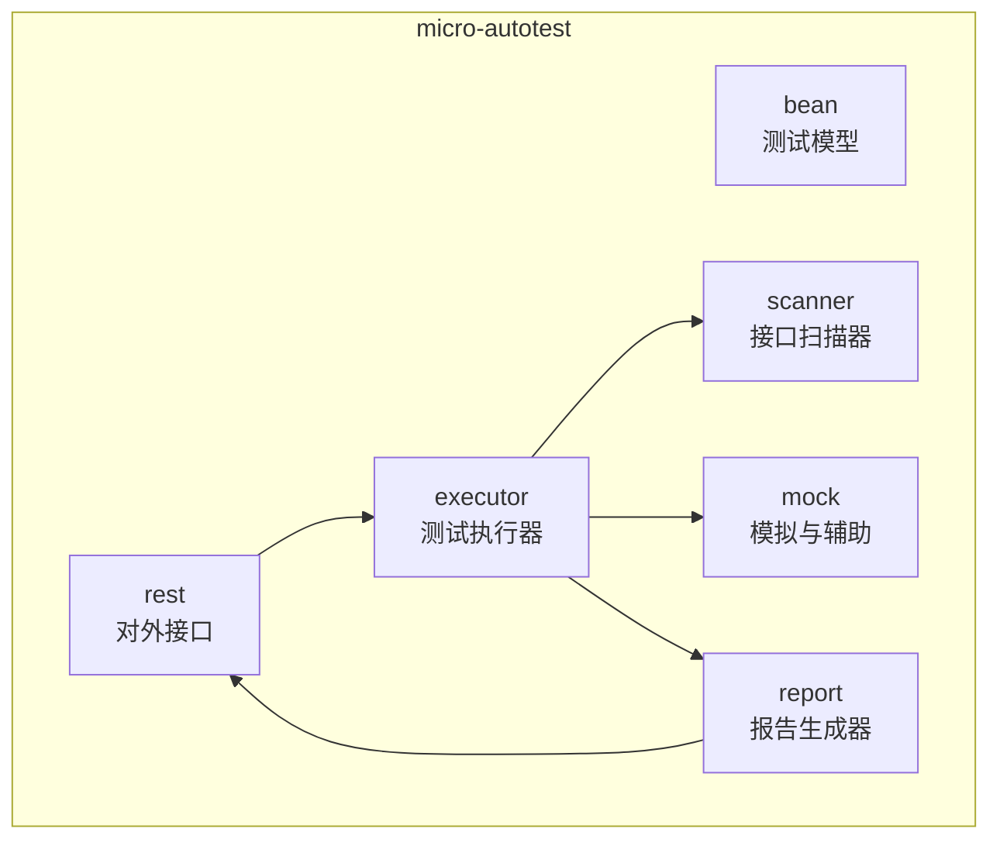
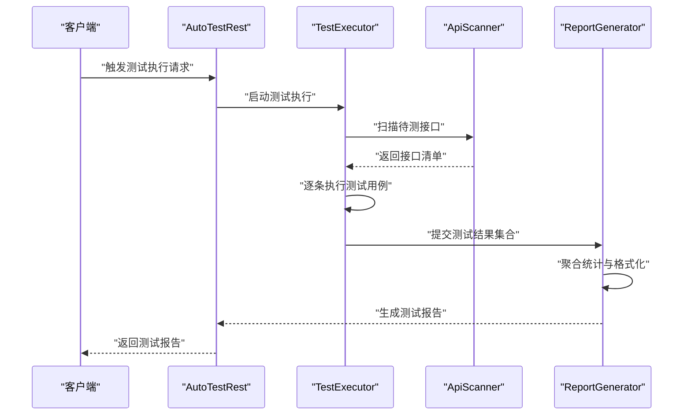
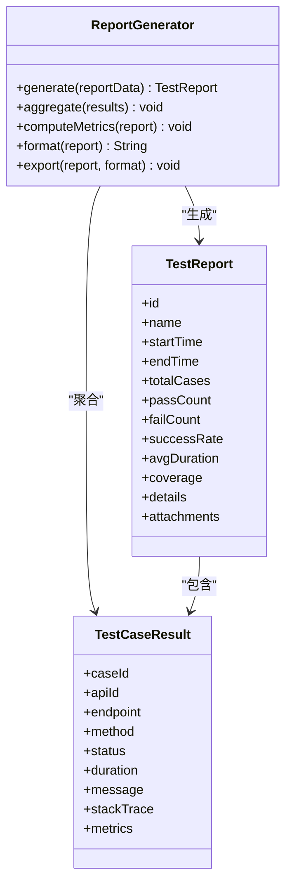
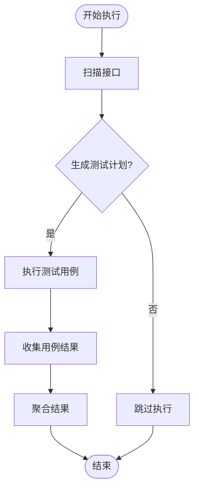
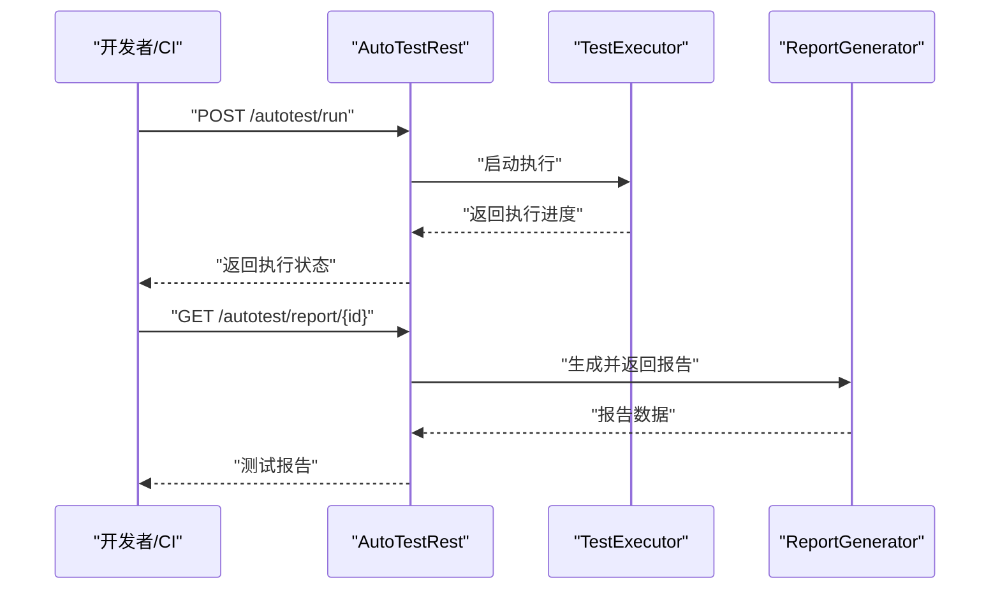
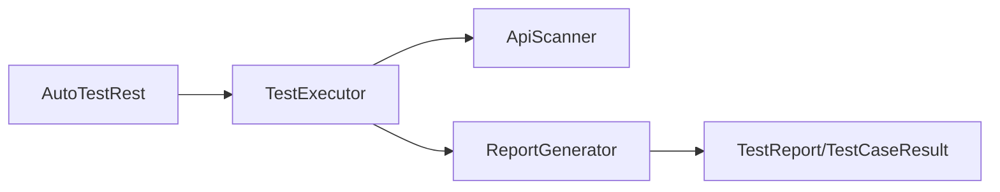

# 测试报告与监控

<cite>
**本文引用的文件**
- [ReportGenerator.java](file://micro-autotest/src/main/java/com/wkclz/auto/report/ReportGenerator.java)
- [TestReport.java](file://micro-autotest/src/main/java/com/wkclz/auto/bean/TestReport.java)
- [TestCaseResult.java](file://micro-autotest/src/main/java/com/wkclz/auto/bean/TestCaseResult.java)
- [TestExecutor.java](file://micro-autotest/src/main/java/com/wkclz/auto/executor/TestExecutor.java)
- [AutoTestRest.java](file://micro-autotest/src/main/java/com/wkclz/auto/rest/AutoTestRest.java)
- [ApiScanner.java](file://micro-autotest/src/main/java/com/wkclz/auto/scanner/ApiScanner.java)
- [README.md](file://micro-autotest/README.md)
- [pom.xml](file://micro-autotest/pom.xml)
</cite>

## 目录
1. [引言](#引言)
2. [项目结构](#项目结构)
3. [核心组件](#核心组件)
4. [架构总览](#架构总览)
5. [详细组件分析](#详细组件分析)
6. [依赖关系分析](#依赖关系分析)
7. [性能考量](#性能考量)
8. [故障排查指南](#故障排查指南)
9. [结论](#结论)
10. [附录](#附录)

## 引言
本文件面向 sh-microapp 微服务框架中的自动化测试模块，聚焦于测试报告与监控能力，系统阐述以下主题：
- 测试报告生成机制与报告内容构成（含测试覆盖率统计、失败用例分析、性能指标监控）
- ReportGenerator 的报告生成流程与测试结果可视化展示
- 测试监控最佳实践：持续集成中的报告生成、测试趋势分析、质量度量指标
- 测试告警与质量门禁设置建议
- 测试结果归档与追溯策略

该文档以代码级分析为基础，结合可操作的流程图与时序图，帮助技术与非技术读者理解并落地测试报告与监控体系。

## 项目结构
自动化测试模块位于 micro-autotest 子工程中，采用按职责分层的组织方式：
- bean：测试领域模型（如测试报告、用例结果）
- executor：测试执行器（调度与运行测试）
- scanner：接口扫描器（发现待测接口）
- report：报告生成器（聚合与输出报告）
- rest：对外接口（提供自动化测试的 REST 能力）
- mock：模拟与辅助工具（Mock、数据生成等）

图表来源
- [AutoTestRest.java](file://micro-autotest/src/main/java/com/wkclz/auto/rest/AutoTestRest.java)
- [TestExecutor.java](file://micro-autotest/src/main/java/com/wkclz/auto/executor/TestExecutor.java)
- [ApiScanner.java](file://micro-autotest/src/main/java/com/wkclz/auto/scanner/ApiScanner.java)
- [ReportGenerator.java](file://micro-autotest/src/main/java/com/wkclz/auto/report/ReportGenerator.java)

章节来源
- [README.md](file://micro-autotest/README.md)
- [pom.xml](file://micro-autotest/pom.xml)

## 核心组件
本节对测试报告与监控的关键构件进行深入解析，重点覆盖：
- 报告模型与用例结果模型
- 报告生成器的工作流
- 测试执行器与接口扫描器的协作
- 对外 REST 接口与调用链路

章节来源
- [TestReport.java](file://micro-autotest/src/main/java/com/wkclz/auto/bean/TestReport.java)
- [TestCaseResult.java](file://micro-autotest/src/main/java/com/wkclz/auto/bean/TestCaseResult.java)
- [ReportGenerator.java](file://micro-autotest/src/main/java/com/wkclz/auto/report/ReportGenerator.java)
- [TestExecutor.java](file://micro-autotest/src/main/java/com/wkclz/auto/executor/TestExecutor.java)
- [AutoTestRest.java](file://micro-autotest/src/main/java/com/wkclz/auto/rest/AutoTestRest.java)
- [ApiScanner.java](file://micro-autotest/src/main/java/com/wkclz/auto/scanner/ApiScanner.java)

## 架构总览
下图展示了从 REST 触发到报告生成的端到端流程，涵盖接口扫描、测试执行、结果聚合与报告输出。

图表来源
- [AutoTestRest.java](file://micro-autotest/src/main/java/com/wkclz/auto/rest/AutoTestRest.java)
- [TestExecutor.java](file://micro-autotest/src/main/java/com/wkclz/auto/executor/TestExecutor.java)
- [ApiScanner.java](file://micro-autotest/src/main/java/com/wkclz/auto/scanner/ApiScanner.java)
- [ReportGenerator.java](file://micro-autotest/src/main/java/com/wkclz/auto/report/ReportGenerator.java)

## 详细组件分析

### 报告生成器（ReportGenerator）分析
ReportGenerator 是测试报告生成的核心组件，负责：
- 聚合测试执行产生的用例结果
- 计算关键指标（通过率、失败数、平均时延、覆盖率等）
- 格式化输出报告（文本/JSON/HTML 等）
- 提供可视化展示所需的数据结构

图表来源
- [TestReport.java](file://micro-autotest/src/main/java/com/wkclz/auto/bean/TestReport.java)
- [TestCaseResult.java](file://micro-autotest/src/main/java/com/wkclz/auto/bean/TestCaseResult.java)
- [ReportGenerator.java](file://micro-autotest/src/main/java/com/wkclz/auto/report/ReportGenerator.java)

章节来源
- [ReportGenerator.java](file://micro-autotest/src/main/java/com/wkclz/auto/report/ReportGenerator.java)
- [TestReport.java](file://micro-autotest/src/main/java/com/wkclz/auto/bean/TestReport.java)
- [TestCaseResult.java](file://micro-autotest/src/main/java/com/wkclz/auto/bean/TestCaseResult.java)

### 测试执行器（TestExecutor）与接口扫描器（ApiScanner）
- TestExecutor 负责驱动测试执行，协调扫描器获取接口清单，并逐条执行用例，收集结果。
- ApiScanner 负责在运行时发现并解析待测接口，形成可执行的测试计划。

图表来源
- [TestExecutor.java](file://micro-autotest/src/main/java/com/wkclz/auto/executor/TestExecutor.java)
- [ApiScanner.java](file://micro-autotest/src/main/java/com/wkclz/auto/scanner/ApiScanner.java)

章节来源
- [TestExecutor.java](file://micro-autotest/src/main/java/com/wkclz/auto/executor/TestExecutor.java)
- [ApiScanner.java](file://micro-autotest/src/main/java/com/wkclz/auto/scanner/ApiScanner.java)

### 对外 REST 接口（AutoTestRest）
- 提供触发测试执行、查询测试状态、获取测试报告等能力
- 作为 CI/CD 管道中的关键入口，支持自动化集成

图表来源
- [AutoTestRest.java](file://micro-autotest/src/main/java/com/wkclz/auto/rest/AutoTestRest.java)
- [TestExecutor.java](file://micro-autotest/src/main/java/com/wkclz/auto/executor/TestExecutor.java)
- [ReportGenerator.java](file://micro-autotest/src/main/java/com/wkclz/auto/report/ReportGenerator.java)

章节来源
- [AutoTestRest.java](file://micro-autotest/src/main/java/com/wkclz/auto/rest/AutoTestRest.java)

## 依赖关系分析
- 组件内聚性：各模块职责清晰，报告生成器独立于执行器与扫描器，便于扩展与替换
- 外部依赖：模块通过 Spring Boot 自动装配加载，REST 层暴露 HTTP 接口
- 可能的耦合点：报告生成器与用例结果模型之间的数据传递需保持稳定契约

图表来源
- [AutoTestRest.java](file://micro-autotest/src/main/java/com/wkclz/auto/rest/AutoTestRest.java)
- [TestExecutor.java](file://micro-autotest/src/main/java/com/wkclz/auto/executor/TestExecutor.java)
- [ReportGenerator.java](file://micro-autotest/src/main/java/com/wkclz/auto/report/ReportGenerator.java)
- [TestReport.java](file://micro-autotest/src/main/java/com/wkclz/auto/bean/TestReport.java)
- [TestCaseResult.java](file://micro-autotest/src/main/java/com/wkclz/auto/bean/TestCaseResult.java)

章节来源
- [pom.xml](file://micro-autotest/pom.xml)

## 性能考量
- 执行并发：在保证稳定性前提下，合理配置并发度以缩短整体执行时间
- 结果聚合：避免在内存中堆积大量中间结果，采用流式或分批聚合策略
- 报告导出：根据规模选择合适的导出格式（如 JSON 便于后续处理，HTML 便于人工审阅）
- 指标计算：对平均时延、成功率等指标采用滑动窗口或滚动统计，降低抖动影响

## 故障排查指南
- 报告为空或缺失：检查执行器是否成功生成用例结果；确认报告生成器输入参数与模型一致
- 指标异常：核对用例状态码与耗时字段；排查网络波动或目标服务不稳定导致的误判
- 导出失败：验证导出格式与目标存储权限；检查磁盘空间与文件句柄限制
- 接口扫描失败：确认接口注解与路由配置；检查类路径与自动装配是否生效

章节来源
- [ReportGenerator.java](file://micro-autotest/src/main/java/com/wkclz/auto/report/ReportGenerator.java)
- [TestExecutor.java](file://micro-autotest/src/main/java/com/wkclz/auto/executor/TestExecutor.java)
- [AutoTestRest.java](file://micro-autotest/src/main/java/com/wkclz/auto/rest/AutoTestRest.java)

## 结论
本文件基于 micro-autotest 模块的代码结构，系统梳理了测试报告与监控的生成机制、关键指标与可视化路径，并给出了在持续集成场景下的最佳实践建议。通过明确的组件边界与数据契约，团队可以在此基础上扩展覆盖率统计、趋势分析与质量门禁，实现从“可观测”到“可治理”的闭环。

## 附录
- 持续集成中的报告生成：在流水线中调用对外 REST 接口触发测试执行，完成后拉取报告并归档
- 趋势分析：定期汇总报告中的通过率、平均时延、失败用例分布，绘制趋势图
- 质量度量：定义通过率阈值、失败用例占比上限、回归用例占比等门禁指标
- 告警机制：当关键指标越界或失败用例激增时，触发邮件/IM 告警并阻断发布
- 归档与追溯：将报告与附件存入对象存储，保留历史版本以便回溯与复盘