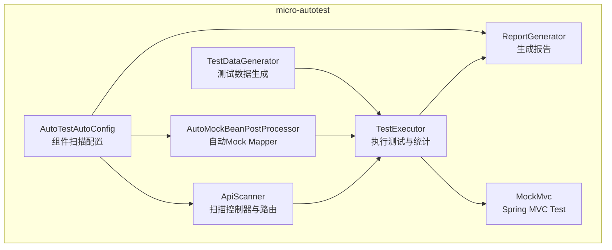
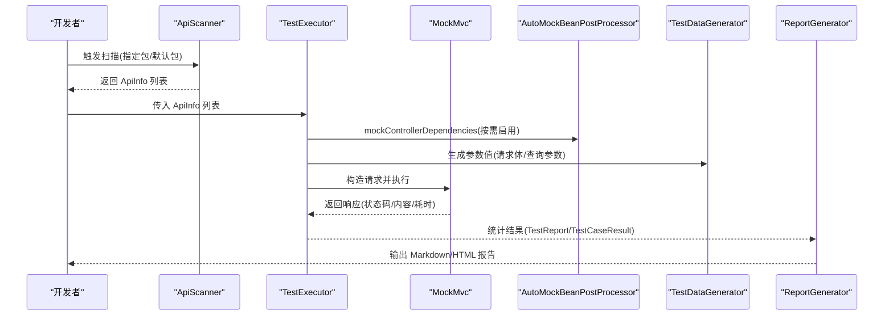
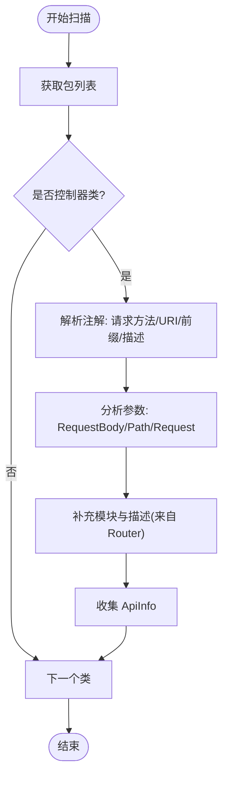
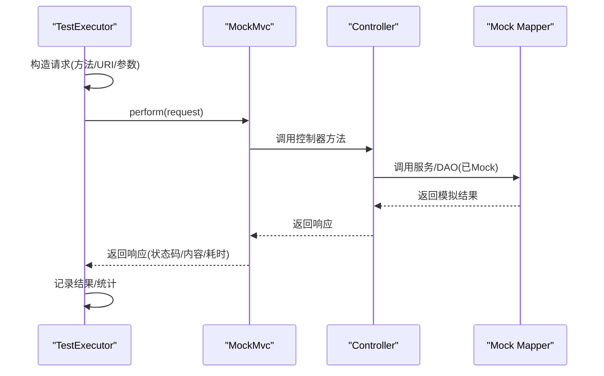
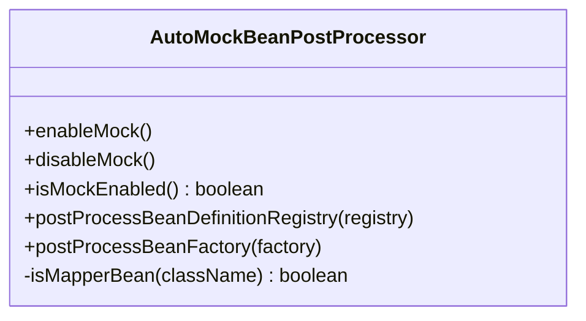
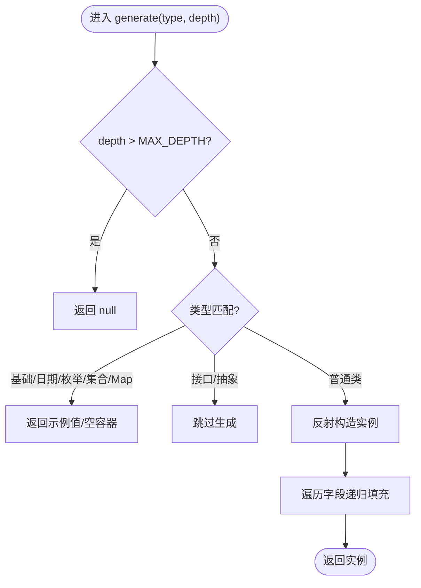
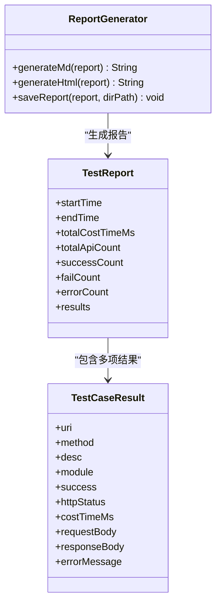
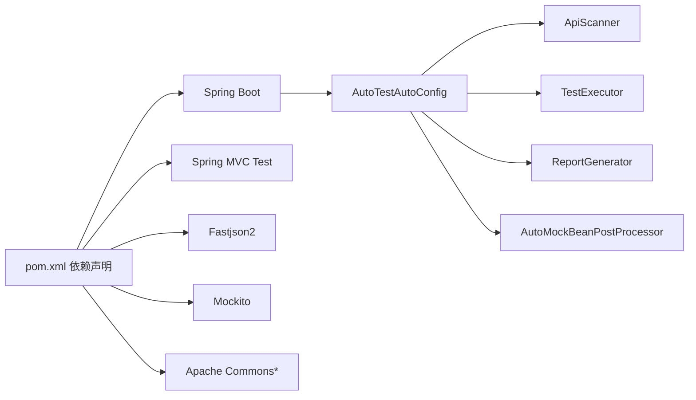

# 测试策略

<cite>
**本文引用的文件**
- [AutoTestAutoConfig.java](file://micro-autotest/src/main/java/com/wkclz/auto/AutoTestAutoConfig.java)
- [AutoMockBeanPostProcessor.java](file://micro-autotest/src/main/java/com/wkclz/auto/mock/AutoMockBeanPostProcessor.java)
- [TestDataGenerator.java](file://micro-autotest/src/main/java/com/wkclz/auto/mock/TestDataGenerator.java)
- [ReportGenerator.java](file://micro-autotest/src/main/java/com/wkclz/auto/report/ReportGenerator.java)
- [TestReport.java](file://micro-autotest/src/main/java/com/wkclz/auto/bean/TestReport.java)
- [TestCaseResult.java](file://micro-autotest/src/main/java/com/wkclz/auto/bean/TestCaseResult.java)
- [TestExecutor.java](file://micro-autotest/src/main/java/com/wkclz/auto/executor/TestExecutor.java)
- [ApiScanner.java](file://micro-autotest/src/main/java/com/wkclz/auto/scanner/ApiScanner.java)
- [README.md](file://micro-autotest/README.md)
- [pom.xml](file://pom.xml)
</cite>

## 目录
1. [引言](#引言)
2. [项目结构](#项目结构)
3. [核心组件](#核心组件)
4. [架构总览](#架构总览)
5. [详细组件分析](#详细组件分析)
6. [依赖关系分析](#依赖关系分析)
7. [性能考虑](#性能考虑)
8. [故障排查指南](#故障排查指南)
9. [结论](#结论)
10. [附录](#附录)

## 引言
本测试策略文档面向 sh-microapp 微服务框架，聚焦于“自动化测试”能力（micro-autotest 模块），系统阐述如何在该框架下开展单元测试、集成测试与 API 自动化测试，并给出接口测试、测试报告生成、测试覆盖率统计、测试数据准备、Mock 对象使用以及测试环境隔离等最佳实践。同时，结合框架特性，提供性能测试、压力测试与回归测试的实施建议，以及测试驱动开发（TDD）与持续集成中的测试流程落地方法。

## 项目结构
micro-autotest 模块提供了自动扫描控制器、构造请求、执行测试、生成报告的完整链路，核心由以下层次构成：
- 扫描层：ApiScanner 负责扫描并解析控制器上的路由注解，提取 API 元信息与参数信息。
- 执行层：TestExecutor 使用 Spring MVC Test 构造请求，调用控制器，收集响应与耗时。
- Mock 层：AutoMockBeanPostProcessor 在启用时自动替换 Mapper 接口为 Mockito 模拟实例；TestDataGenerator 提供通用测试数据生成。
- 报告层：ReportGenerator 将测试结果汇总为 Markdown 与 HTML 报告，并持久化输出。
- 配置层：AutoTestAutoConfig 通过组件扫描启用模块功能。

图表来源
- [ApiScanner.java:1-272](file://micro-autotest/src/main/java/com/wkclz/auto/scanner/ApiScanner.java#L1-L272)
- [TestExecutor.java:1-196](file://micro-autotest/src/main/java/com/wkclz/auto/executor/TestExecutor.java#L1-L196)
- [ReportGenerator.java:1-214](file://micro-autotest/src/main/java/com/wkclz/auto/report/ReportGenerator.java#L1-L214)
- [AutoMockBeanPostProcessor.java:1-89](file://micro-autotest/src/main/java/com/wkclz/auto/mock/AutoMockBeanPostProcessor.java#L1-L89)
- [TestDataGenerator.java:1-111](file://micro-autotest/src/main/java/com/wkclz/auto/mock/TestDataGenerator.java#L1-L111)
- [AutoTestAutoConfig.java:1-10](file://micro-autotest/src/main/java/com/wkclz/auto/AutoTestAutoConfig.java#L1-L10)

章节来源
- [AutoTestAutoConfig.java:1-10](file://micro-autotest/src/main/java/com/wkclz/auto/AutoTestAutoConfig.java#L1-L10)
- [ApiScanner.java:1-272](file://micro-autotest/src/main/java/com/wkclz/auto/scanner/ApiScanner.java#L1-L272)
- [TestExecutor.java:1-196](file://micro-autotest/src/main/java/com/wkclz/auto/executor/TestExecutor.java#L1-L196)
- [ReportGenerator.java:1-214](file://micro-autotest/src/main/java/com/wkclz/auto/report/ReportGenerator.java#L1-L214)
- [AutoMockBeanPostProcessor.java:1-89](file://micro-autotest/src/main/java/com/wkclz/auto/mock/AutoMockBeanPostProcessor.java#L1-L89)
- [TestDataGenerator.java:1-111](file://micro-autotest/src/main/java/com/wkclz/auto/mock/TestDataGenerator.java#L1-L111)

## 核心组件
- ApiScanner：基于注解扫描 RestController/Controller 与 Router，解析请求方法、URI、描述与参数类型，构建 ApiInfo 列表。
- TestExecutor：基于 MockMvc 执行 API，按参数类型生成请求体或查询参数，记录状态码、耗时与响应内容，统计成功/失败/错误数量。
- AutoMockBeanPostProcessor：在启用状态下，自动将包路径下的 Mapper Bean 替换为 Mockito 模拟实例，避免真实数据库访问。
- TestDataGenerator：递归生成基础类型、日期时间、集合、枚举等测试数据，支持复杂对象字段填充，限制最大递归深度。
- ReportGenerator：生成 Markdown 与 HTML 报告，包含摘要、明细与失败详情，支持写入磁盘。
- TestReport/TestCaseResult：测试结果数据模型，承载时间、指标与明细。

章节来源
- [ApiScanner.java:1-272](file://micro-autotest/src/main/java/com/wkclz/auto/scanner/ApiScanner.java#L1-L272)
- [TestExecutor.java:1-196](file://micro-autotest/src/main/java/com/wkclz/auto/executor/TestExecutor.java#L1-L196)
- [AutoMockBeanPostProcessor.java:1-89](file://micro-autotest/src/main/java/com/wkclz/auto/mock/AutoMockBeanPostProcessor.java#L1-L89)
- [TestDataGenerator.java:1-111](file://micro-autotest/src/main/java/com/wkclz/auto/mock/TestDataGenerator.java#L1-L111)
- [ReportGenerator.java:1-214](file://micro-autotest/src/main/java/com/wkclz/auto/report/ReportGenerator.java#L1-L214)
- [TestReport.java:1-19](file://micro-autotest/src/main/java/com/wkclz/auto/bean/TestReport.java#L1-L19)
- [TestCaseResult.java:1-19](file://micro-autotest/src/main/java/com/wkclz/auto/bean/TestCaseResult.java#L1-L19)

## 架构总览
下图展示从扫描到执行再到报告生成的端到端流程，以及 Mock 与数据生成的辅助作用。

图表来源
- [ApiScanner.java:1-272](file://micro-autotest/src/main/java/com/wkclz/auto/scanner/ApiScanner.java#L1-L272)
- [TestExecutor.java:1-196](file://micro-autotest/src/main/java/com/wkclz/auto/executor/TestExecutor.java#L1-L196)
- [AutoMockBeanPostProcessor.java:1-89](file://micro-autotest/src/main/java/com/wkclz/auto/mock/AutoMockBeanPostProcessor.java#L1-L89)
- [TestDataGenerator.java:1-111](file://micro-autotest/src/main/java/com/wkclz/auto/mock/TestDataGenerator.java#L1-L111)
- [ReportGenerator.java:1-214](file://micro-autotest/src/main/java/com/wkclz/auto/report/ReportGenerator.java#L1-L214)

## 详细组件分析

### 组件一：ApiScanner（API 元信息采集）
- 功能要点
  - 默认包定位：从 Spring Boot 启动类所在包推导默认扫描范围。
  - 控制器识别：匹配 RestController/Controller 或自定义 Router 注解的类。
  - 方法解析：解析 RequestMapping/GetMapping/PostMapping/PutMapping/DeleteMapping 等注解，提取方法、URI、前缀与描述。
  - 参数分析：识别 RequestBody、PathVariable、RequestParam 的参数类型与名称。
  - 描述补充：通过 Router 类中的常量与 Desc/ApiDesc 字段为 API 补充描述信息。
- 复杂度与性能
  - 时间复杂度近似 O(N×M)，N 为控制器类数，M 为每个类的方法数。
  - 通过缓存包内类集合可降低重复扫描成本（当前实现未显式缓存，建议在 CI 中复用扫描结果）。
- 错误处理
  - 对空注解值与非法 URI 进行容错处理，避免中断扫描。
- 可扩展性
  - 可扩展支持更多注解（如 HEAD/OPTIONS），或引入过滤器按标签/模块筛选。

图表来源
- [ApiScanner.java:1-272](file://micro-autotest/src/main/java/com/wkclz/auto/scanner/ApiScanner.java#L1-L272)

章节来源
- [ApiScanner.java:1-272](file://micro-autotest/src/main/java/com/wkclz/auto/scanner/ApiScanner.java#L1-L272)

### 组件二：TestExecutor（测试执行与统计）
- 功能要点
  - 构建 MockMvc：基于 WebApplicationContext 初始化。
  - 逐个执行 API：根据 ApiInfo 构造请求，支持 GET/POST/PUT/DELETE，默认 JSON 内容类型。
  - 参数生成：对请求体参数使用 MockHelper/TestDataGenerator 生成值；对 GET 查询参数进行递归展开。
  - 结果记录：记录状态码、耗时、请求/响应内容、错误信息；区分 4xx 与 5xx。
  - 统计汇总：计算总耗时、总数、成功/失败/错误数量。
- 关键流程
  - 请求构建：依据方法选择对应 MockMvc 构造器，设置 JSON 内容与参数。
  - 执行与回传：perform 并返回响应，计算耗时。
  - 异常捕获：统一记录错误信息并标记失败。
  - 清理：每次执行后重置 Mock 状态，避免副作用。
- 性能与稳定性
  - 建议在 CI 中并发执行不同模块的 API，但注意数据库连接池与线程安全。
  - 对长耗时接口建议单独标注或限流，避免阻塞整体报告生成。

图表来源
- [TestExecutor.java:1-196](file://micro-autotest/src/main/java/com/wkclz/auto/executor/TestExecutor.java#L1-L196)
- [AutoMockBeanPostProcessor.java:1-89](file://micro-autotest/src/main/java/com/wkclz/auto/mock/AutoMockBeanPostProcessor.java#L1-L89)

章节来源
- [TestExecutor.java:1-196](file://micro-autotest/src/main/java/com/wkclz/auto/executor/TestExecutor.java#L1-L196)

### 组件三：AutoMockBeanPostProcessor（自动 Mock）
- 功能要点
  - 开关控制：enableMock/disableMock/isMockEnabled 提供运行期开关。
  - 自动替换：扫描容器中所有 Bean，匹配 mapper 包名特征，使用 Mockito 替换为模拟实例。
  - 日志记录：对替换过程与异常进行日志输出。
- 使用建议
  - 在集成测试或自动化测试场景启用，避免真实数据库交互。
  - 注意与事务管理的配合，确保测试后状态可恢复。

图表来源
- [AutoMockBeanPostProcessor.java:1-89](file://micro-autotest/src/main/java/com/wkclz/auto/mock/AutoMockBeanPostProcessor.java#L1-L89)

章节来源
- [AutoMockBeanPostProcessor.java:1-89](file://micro-autotest/src/main/java/com/wkclz/auto/mock/AutoMockBeanPostProcessor.java#L1-L89)

### 组件四：TestDataGenerator（测试数据生成）
- 功能要点
  - 类型覆盖：基础类型、字符串、日期时间、枚举、集合、Map、Object 等。
  - 递归填充：对非基本类型反射构造实例并递归填充字段，跳过静态/最终字段与特定字段名。
  - 深度限制：防止无限递归，提升稳定性。
- 使用建议
  - 作为参数生成器的默认实现，可结合 MockHelper 进行定制化扩展。
  - 对需要固定值或边界值的场景，建议在上层组合使用。

图表来源
- [TestDataGenerator.java:1-111](file://micro-autotest/src/main/java/com/wkclz/auto/mock/TestDataGenerator.java#L1-L111)

章节来源
- [TestDataGenerator.java:1-111](file://micro-autotest/src/main/java/com/wkclz/auto/mock/TestDataGenerator.java#L1-L111)

### 组件五：ReportGenerator（测试报告）
- 功能要点
  - Markdown：包含摘要表格、测试明细与失败详情，便于在 CI 中阅读。
  - HTML：卡片式摘要、表格与失败详情卡片，支持复制粘贴分享。
  - 输出：按起始时间戳命名，写入指定目录。
- 使用建议
  - 在 CI 中将报告目录挂载到制品库，便于归档与对比。
  - 可扩展为多格式（JSON/XML）以适配不同消费方。

图表来源
- [ReportGenerator.java:1-214](file://micro-autotest/src/main/java/com/wkclz/auto/report/ReportGenerator.java#L1-L214)
- [TestReport.java:1-19](file://micro-autotest/src/main/java/com/wkclz/auto/bean/TestReport.java#L1-L19)
- [TestCaseResult.java:1-19](file://micro-autotest/src/main/java/com/wkclz/auto/bean/TestCaseResult.java#L1-L19)

章节来源
- [ReportGenerator.java:1-214](file://micro-autotest/src/main/java/com/wkclz/auto/report/ReportGenerator.java#L1-L214)
- [TestReport.java:1-19](file://micro-autotest/src/main/java/com/wkclz/auto/bean/TestReport.java#L1-L19)
- [TestCaseResult.java:1-19](file://micro-autotest/src/main/java/com/wkclz/auto/bean/TestCaseResult.java#L1-L19)

## 依赖关系分析
- 模块依赖
  - micro-autotest 依赖 Spring Boot、Spring MVC Test、Fastjson2、Mockito、commons-collections4、commons-lang3、slf4j。
  - 通过 AutoTestAutoConfig 启用组件扫描，使扫描器、执行器、报告器与 Mock 处理器生效。
- 组件耦合
  - TestExecutor 依赖 ApiScanner、MockHelper、WebApplicationContext；与 ReportGenerator 解耦，仅消费 TestReport。
  - AutoMockBeanPostProcessor 与业务代码解耦，通过 Bean 定义替换实现无侵入 Mock。
- 外部依赖与风险
  - Mock 仅替换 Mapper 接口，若控制器直接依赖真实服务，仍可能产生外部 IO；建议在 CI 中隔离数据库与第三方服务。

图表来源
- [pom.xml](file://pom.xml)
- [AutoTestAutoConfig.java:1-10](file://micro-autotest/src/main/java/com/wkclz/auto/AutoTestAutoConfig.java#L1-L10)

章节来源
- [pom.xml](file://pom.xml)
- [AutoTestAutoConfig.java:1-10](file://micro-autotest/src/main/java/com/wkclz/auto/AutoTestAutoConfig.java#L1-L10)

## 性能考虑
- 扫描阶段
  - 在本地开发时可限定包路径，减少扫描范围；在 CI 中缓存扫描结果，避免重复扫描。
- 执行阶段
  - 并发执行不同模块的 API，但需控制并发度，避免数据库连接池与 CPU 竞争。
  - 对长耗时接口单独标注，或在执行前做健康检查与限流。
- Mock 与数据生成
  - 合理使用 AutoMockBeanPostProcessor，避免真实数据库交互；对复杂对象生成建议限制深度与字段数量。
- 报告生成
  - HTML 报告较大时可按模块拆分输出，或仅保留 Markdown 用于 CI 日志。

## 故障排查指南
- 扫描不到 API
  - 确认控制器类被 Spring 管理（@RestController/@Controller），且注解正确；检查 Router 常量与描述注解是否匹配。
  - 若使用自定义 Router，请确认模块与前缀拼接逻辑正确。
- 执行报错或超时
  - 检查请求参数生成是否为空；对 GET 查询参数，确认类型支持与深度限制。
  - 若存在真实服务依赖，考虑启用 Mock 或隔离网络。
- Mock 生效问题
  - 确认 AutoMockBeanPostProcessor 已启用；确保 Mapper 接口位于约定包路径下。
- 报告未生成
  - 检查输出目录权限与路径；确认时间戳命名规则与文件写入日志。

章节来源
- [ApiScanner.java:1-272](file://micro-autotest/src/main/java/com/wkclz/auto/scanner/ApiScanner.java#L1-L272)
- [TestExecutor.java:1-196](file://micro-autotest/src/main/java/com/wkclz/auto/executor/TestExecutor.java#L1-L196)
- [AutoMockBeanPostProcessor.java:1-89](file://micro-autotest/src/main/java/com/wkclz/auto/mock/AutoMockBeanPostProcessor.java#L1-L89)
- [ReportGenerator.java:1-214](file://micro-autotest/src/main/java/com/wkclz/auto/report/ReportGenerator.java#L1-L214)

## 结论
micro-autotest 模块为 sh-microapp 提供了开箱即用的自动化测试能力：通过注解扫描自动发现 API，借助 Spring MVC Test 执行并统计结果，结合 Mock 与测试数据生成实现稳定可控的测试环境，并输出结构化报告。建议在团队内推广该能力，形成统一的接口测试规范与报告标准，逐步完善覆盖率统计与回归测试流程，支撑持续交付与质量保障。

## 附录

### 单元测试（Unit Test）
- 目标：验证服务层与工具类的独立逻辑，快速反馈。
- 建议
  - 使用 Mockito 对外部依赖（如 Mapper/Service）进行 Mock。
  - 使用 TestDataGenerator 快速构造输入数据。
  - 采用断言库（如 AssertJ）增强可读性。
- 最佳实践
  - 每个方法一个用例，覆盖正常/异常/边界。
  - 保持测试隔离，避免共享状态。

### 集成测试（Integration Test）
- 目标：验证控制器、服务与数据库/缓存等外部组件协作。
- 建议
  - 在测试配置中启用 AutoMockBeanPostProcessor，替换 Mapper。
  - 使用内存数据库或测试专用库，保证可重复性。
  - 通过 @Transactional + 回滚机制隔离数据。

### API 自动化测试（API Test）
- 目标：对所有对外暴露的 REST 接口进行自动化回归。
- 建议
  - 使用 ApiScanner 与 TestExecutor 构建测试套件。
  - 按模块划分执行批次，输出 Markdown/HTML 报告。
  - 在 CI 中定期执行，失败即阻断发布。

### 测试数据准备与 Mock
- 测试数据
  - 优先使用 TestDataGenerator 自动生成；对特殊字段在上层组合定制。
- Mock 对象
  - 使用 AutoMockBeanPostProcessor 自动替换 Mapper；必要时手动 Mock 复杂依赖。
- 环境隔离
  - 使用独立测试数据库与缓存；禁用真实第三方服务调用。

### 性能测试与压力测试
- 性能测试
  - 识别慢接口，记录平均/95 分位耗时；与历史基线对比。
- 压力测试
  - 逐步提升并发与吞吐，观察错误率与响应时间拐点；优化瓶颈组件。
- 回归测试
  - 将自动化 API 测试纳入每日流水线；失败用例优先修复。

### 测试驱动开发（TDD）与持续集成
- TDD 实践
  - 先写失败用例，再实现最小逻辑，最后重构。
  - 用例应可自动执行，具备可重复性与可读性。
- 持续集成
  - 触发条件：提交代码、定时任务、发布前检查。
  - 步骤：安装依赖 → 执行单元/集成/API 测试 → 生成报告 → 发送通知 → 归档制品。
  - 质量门禁：覆盖率阈值、失败用例数上限、报告评分。