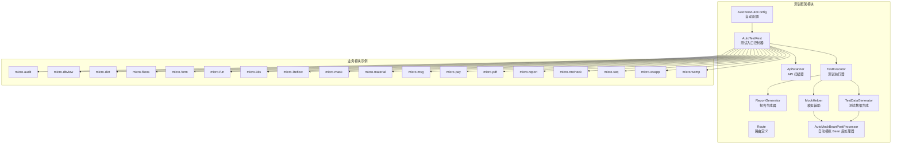
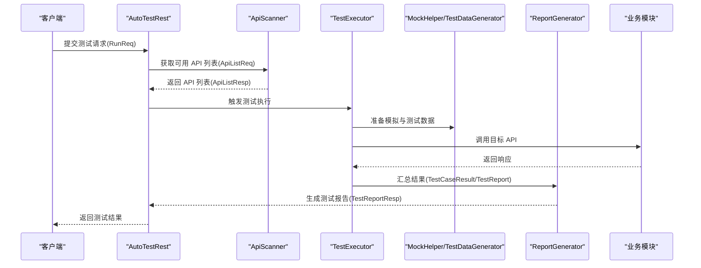
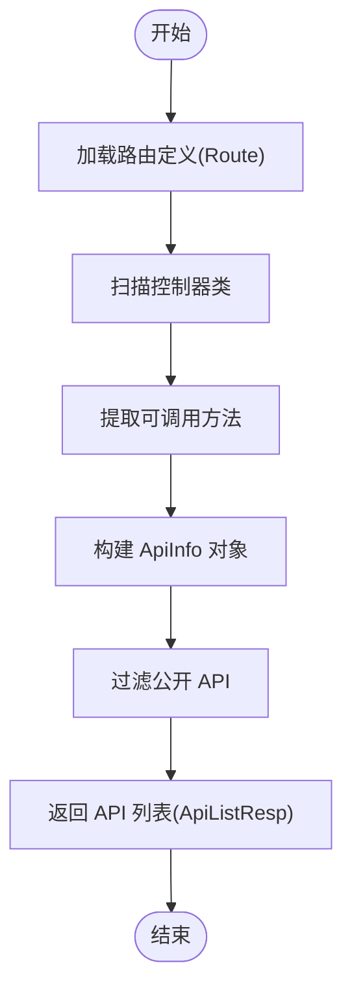
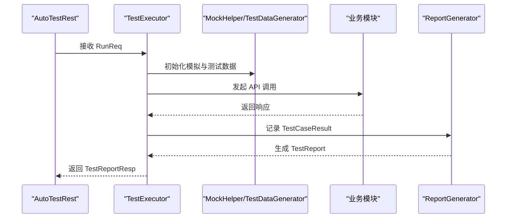
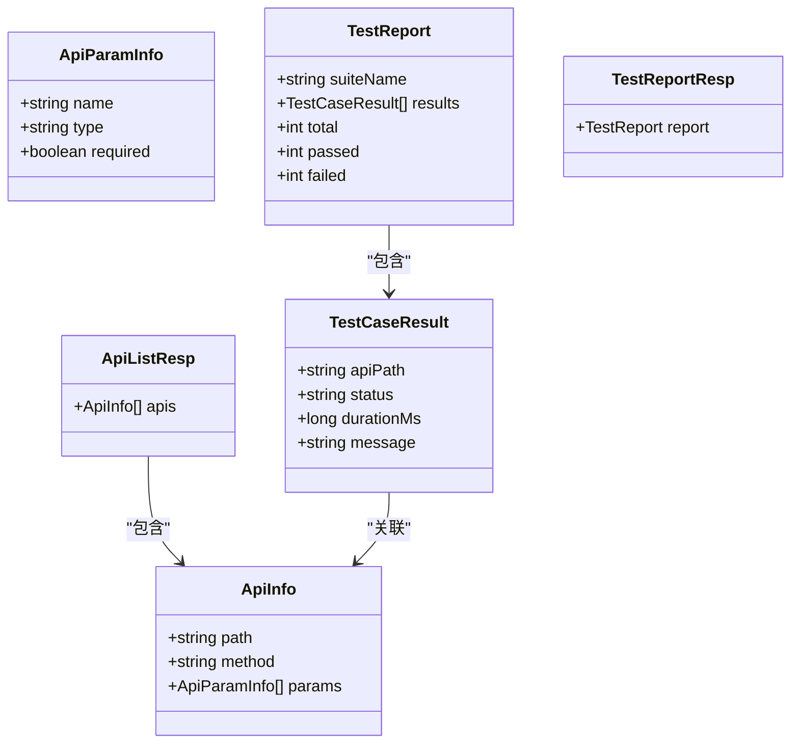
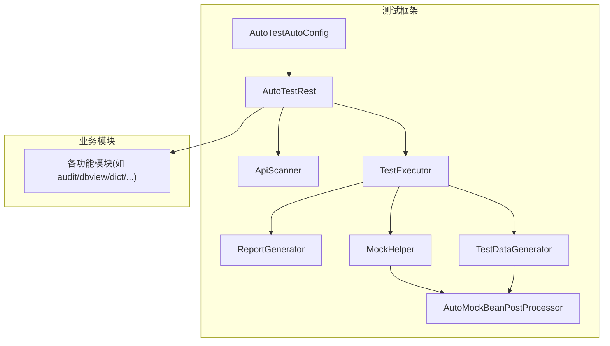

# 集成测试

<cite>
**本文引用的文件**
- [ApiScanner.java](file://micro-autotest/src/main/java/com/wkclz/auto/scanner/ApiScanner.java)
- [TestExecutor.java](file://micro-autotest/src/main/java/com/wkclz/auto/executor/TestExecutor.java)
- [AutoTestRest.java](file://micro-autotest/src/main/java/com/wkclz/auto/rest/AutoTestRest.java)
- [AutoTestAutoConfig.java](file://micro-autotest/src/main/java/com/wkclz/auto/AutoTestAutoConfig.java)
- [ReportGenerator.java](file://micro-autotest/src/main/java/com/wkclz/auto/report/ReportGenerator.java)
- [Route.java](file://micro-autotest/src/main/java/com/wkclz/auto/rest/Route.java)
- [ApiInfo.java](file://micro-autotest/src/main/java/com/wkclz/auto/bean/ApiInfo.java)
- [TestCaseResult.java](file://micro-autotest/src/main/java/com/wkclz/auto/bean/TestCaseResult.java)
- [TestReport.java](file://micro-autotest/src/main/java/com/wkclz/auto/bean/TestReport.java)
- [RunReq.java](file://micro-autotest/src/main/java/com/wkclz/auto/bean/req/RunReq.java)
- [ApiListReq.java](file://micro-autotest/src/main/java/com/wkclz/auto/bean/req/ApiListReq.java)
- [ApiListResp.java](file://micro-autotest/src/main/java/com/wkclz/auto/bean/resp/ApiListResp.java)
- [TestReportResp.java](file://micro-autotest/src/main/java/com/wkclz/auto/bean/resp/TestReportResp.java)
- [MockHelper.java](file://micro-autotest/src/main/java/com/wkclz/auto/mock/MockHelper.java)
- [TestDataGenerator.java](file://micro-autotest/src/main/java/com/wkclz/auto/mock/TestDataGenerator.java)
- [AutoMockBeanPostProcessor.java](file://micro-autotest/src/main/java/com/wkclz/auto/mock/AutoMockBeanPostProcessor.java)
- [README.md](file://micro-autotest/README.md)
- [pom.xml](file://micro-autotest/pom.xml)
</cite>

## 目录
1. [简介](#简介)
2. [项目结构](#项目结构)
3. [核心组件](#核心组件)
4. [架构总览](#架构总览)
5. [详细组件分析](#详细组件分析)
6. [依赖关系分析](#依赖关系分析)
7. [性能考虑](#性能考虑)
8. [故障排查指南](#故障排查指南)
9. [结论](#结论)
10. [附录](#附录)

## 简介
本文件面向 sh-microapp 微服务框架，提供一套完整的集成测试实施策略与实践指南。重点覆盖以下方面：
- 模块间交互测试：通过统一的 API 发现与执行机制，验证跨模块调用链路的正确性与稳定性。
- 数据库连接测试：结合自动测试框架对数据库访问层进行端到端验证。
- 外部服务集成测试：利用模拟与测试数据生成能力，对第三方接口或外部系统进行可控集成验证。
- ApiScanner 的 API 发现机制：扫描并收集可用 API 列表，支撑测试用例的自动生成与选择。
- TestExecutor 的测试执行流程：从请求构造、执行调度到结果汇总与报告输出的完整闭环。

同时，文档提供集成测试环境搭建指南（测试数据库配置、依赖服务启动、测试数据初始化），并给出跨模块集成测试用例的编写范式、测试结果验证与错误处理方法。

## 项目结构
微服务框架由多个功能模块组成，每个模块独立开发、独立部署。集成测试关注的是模块间的协作行为，因此需要在统一的测试环境中运行，确保各模块的 API 能够被正确发现与调用。

图表来源
- [AutoTestAutoConfig.java](file://micro-autotest/src/main/java/com/wkclz/auto/AutoTestAutoConfig.java)
- [AutoTestRest.java](file://micro-autotest/src/main/java/com/wkclz/auto/rest/AutoTestRest.java)
- [ApiScanner.java](file://micro-autotest/src/main/java/com/wkclz/auto/scanner/ApiScanner.java)
- [TestExecutor.java](file://micro-autotest/src/main/java/com/wkclz/auto/executor/TestExecutor.java)
- [ReportGenerator.java](file://micro-autotest/src/main/java/com/wkclz/auto/report/ReportGenerator.java)
- [MockHelper.java](file://micro-autotest/src/main/java/com/wkclz/auto/mock/MockHelper.java)
- [TestDataGenerator.java](file://micro-autotest/src/main/java/com/wkclz/auto/mock/TestDataGenerator.java)
- [AutoMockBeanPostProcessor.java](file://micro-autotest/src/main/java/com/wkclz/auto/mock/AutoMockBeanPostProcessor.java)

章节来源
- [AutoTestAutoConfig.java](file://micro-autotest/src/main/java/com/wkclz/auto/AutoTestAutoConfig.java)
- [AutoTestRest.java](file://micro-autotest/src/main/java/com/wkclz/auto/rest/AutoTestRest.java)
- [Route.java](file://micro-autotest/src/main/java/com/wkclz/auto/rest/Route.java)

## 核心组件
本节聚焦于集成测试的核心构件及其职责：
- ApiScanner：负责扫描并收集系统内可用的 API 列表，形成可执行的测试清单。
- TestExecutor：负责根据测试请求，构造调用参数、执行测试、收集结果并生成报告。
- AutoTestRest：对外暴露测试入口，接收测试请求并协调扫描与执行流程。
- ReportGenerator：将测试结果汇总为结构化报告，便于后续分析与归档。
- MockHelper 与 TestDataGenerator：提供模拟与测试数据生成能力，降低对外部依赖的耦合。
- AutoMockBeanPostProcessor：在 Spring 上下文中自动注入模拟 Bean，提升测试隔离度。

章节来源
- [ApiScanner.java](file://micro-autotest/src/main/java/com/wkclz/auto/scanner/ApiScanner.java)
- [TestExecutor.java](file://micro-autotest/src/main/java/com/wkclz/auto/executor/TestExecutor.java)
- [AutoTestRest.java](file://micro-autotest/src/main/java/com/wkclz/auto/rest/AutoTestRest.java)
- [ReportGenerator.java](file://micro-autotest/src/main/java/com/wkclz/auto/report/ReportGenerator.java)
- [MockHelper.java](file://micro-autotest/src/main/java/com/wkclz/auto/mock/MockHelper.java)
- [TestDataGenerator.java](file://micro-autotest/src/main/java/com/wkclz/auto/mock/TestDataGenerator.java)
- [AutoMockBeanPostProcessor.java](file://micro-autotest/src/main/java/com/wkclz/auto/mock/AutoMockBeanPostProcessor.java)

## 架构总览
下图展示了集成测试的整体架构与数据流：

图表来源
- [AutoTestRest.java](file://micro-autotest/src/main/java/com/wkclz/auto/rest/AutoTestRest.java)
- [ApiScanner.java](file://micro-autotest/src/main/java/com/wkclz/auto/scanner/ApiScanner.java)
- [TestExecutor.java](file://micro-autotest/src/main/java/com/wkclz/auto/executor/TestExecutor.java)
- [ReportGenerator.java](file://micro-autotest/src/main/java/com/wkclz/auto/report/ReportGenerator.java)
- [RunReq.java](file://micro-autotest/src/main/java/com/wkclz/auto/bean/req/RunReq.java)
- [ApiListReq.java](file://micro-autotest/src/main/java/com/wkclz/auto/bean/req/ApiListReq.java)
- [ApiListResp.java](file://micro-autotest/src/main/java/com/wkclz/auto/bean/resp/ApiListResp.java)
- [TestReportResp.java](file://micro-autotest/src/main/java/com/wkclz/auto/bean/resp/TestReportResp.java)
- [TestCaseResult.java](file://micro-autotest/src/main/java/com/wkclz/auto/bean/TestCaseResult.java)
- [TestReport.java](file://micro-autotest/src/main/java/com/wkclz/auto/bean/TestReport.java)

## 详细组件分析

### ApiScanner 组件分析
ApiScanner 的职责是扫描系统内的 API 并生成可执行的 API 列表，供测试框架选择与执行。其核心流程如下：

图表来源
- [ApiScanner.java](file://micro-autotest/src/main/java/com/wkclz/auto/scanner/ApiScanner.java)
- [Route.java](file://micro-autotest/src/main/java/com/wkclz/auto/rest/Route.java)
- [ApiInfo.java](file://micro-autotest/src/main/java/com/wkclz/auto/bean/ApiInfo.java)
- [ApiListReq.java](file://micro-autotest/src/main/java/com/wkclz/auto/bean/req/ApiListReq.java)
- [ApiListResp.java](file://micro-autotest/src/main/java/com/wkclz/auto/bean/resp/ApiListResp.java)

章节来源
- [ApiScanner.java](file://micro-autotest/src/main/java/com/wkclz/auto/scanner/ApiScanner.java)
- [ApiInfo.java](file://micro-autotest/src/main/java/com/wkclz/auto/bean/ApiInfo.java)
- [ApiListReq.java](file://micro-autotest/src/main/java/com/wkclz/auto/bean/req/ApiListReq.java)
- [ApiListResp.java](file://micro-autotest/src/main/java/com/wkclz/auto/bean/resp/ApiListResp.java)

### TestExecutor 组件分析
TestExecutor 负责执行具体的测试用例，包含请求构造、调用执行、结果收集与报告生成等环节。其执行流程如下：

图表来源
- [TestExecutor.java](file://micro-autotest/src/main/java/com/wkclz/auto/executor/TestExecutor.java)
- [RunReq.java](file://micro-autotest/src/main/java/com/wkclz/auto/bean/req/RunReq.java)
- [TestCaseResult.java](file://micro-autotest/src/main/java/com/wkclz/auto/bean/TestCaseResult.java)
- [TestReport.java](file://micro-autotest/src/main/java/com/wkclz/auto/bean/TestReport.java)
- [TestReportResp.java](file://micro-autotest/src/main/java/com/wkclz/auto/bean/resp/TestReportResp.java)
- [MockHelper.java](file://micro-autotest/src/main/java/com/wkclz/auto/mock/MockHelper.java)
- [TestDataGenerator.java](file://micro-autotest/src/main/java/com/wkclz/auto/mock/TestDataGenerator.java)

章节来源
- [TestExecutor.java](file://micro-autotest/src/main/java/com/wkclz/auto/executor/TestExecutor.java)
- [RunReq.java](file://micro-autotest/src/main/java/com/wkclz/auto/bean/req/RunReq.java)
- [TestCaseResult.java](file://micro-autotest/src/main/java/com/wkclz/auto/bean/TestCaseResult.java)
- [TestReport.java](file://micro-autotest/src/main/java/com/wkclz/auto/bean/TestReport.java)
- [TestReportResp.java](file://micro-autotest/src/main/java/com/wkclz/auto/bean/resp/TestReportResp.java)

### 报告与数据模型
测试框架通过结构化的数据模型记录测试过程与结果，并最终生成可读的报告。关键对象包括：
- ApiInfo：描述单个 API 的元信息（路径、方法、参数等）。
- TestCaseResult：记录单个用例的执行结果（状态、耗时、断言等）。
- TestReport：汇总所有用例的结果，形成整体测试报告。
- ApiListResp/TestReportResp：用于对外返回的响应体。

图表来源
- [ApiInfo.java](file://micro-autotest/src/main/java/com/wkclz/auto/bean/ApiInfo.java)
- [ApiParamInfo.java](file://micro-autotest/src/main/java/com/wkclz/auto/bean/ApiParamInfo.java)
- [TestCaseResult.java](file://micro-autotest/src/main/java/com/wkclz/auto/bean/TestCaseResult.java)
- [TestReport.java](file://micro-autotest/src/main/java/com/wkclz/auto/bean/TestReport.java)
- [ApiListResp.java](file://micro-autotest/src/main/java/com/wkclz/auto/bean/resp/ApiListResp.java)
- [TestReportResp.java](file://micro-autotest/src/main/java/com/wkclz/auto/bean/resp/TestReportResp.java)

## 依赖关系分析
测试框架与业务模块之间的依赖关系如下：

图表来源
- [AutoTestAutoConfig.java](file://micro-autotest/src/main/java/com/wkclz/auto/AutoTestAutoConfig.java)
- [AutoTestRest.java](file://micro-autotest/src/main/java/com/wkclz/auto/rest/AutoTestRest.java)
- [ApiScanner.java](file://micro-autotest/src/main/java/com/wkclz/auto/scanner/ApiScanner.java)
- [TestExecutor.java](file://micro-autotest/src/main/java/com/wkclz/auto/executor/TestExecutor.java)
- [ReportGenerator.java](file://micro-autotest/src/main/java/com/wkclz/auto/report/ReportGenerator.java)
- [MockHelper.java](file://micro-autotest/src/main/java/com/wkclz/auto/mock/MockHelper.java)
- [TestDataGenerator.java](file://micro-autotest/src/main/java/com/wkclz/auto/mock/TestDataGenerator.java)
- [AutoMockBeanPostProcessor.java](file://micro-autotest/src/main/java/com/wkclz/auto/mock/AutoMockBeanPostProcessor.java)

章节来源
- [pom.xml](file://micro-autotest/pom.xml)

## 性能考虑
- 测试并发与超时控制：在 TestExecutor 中应合理设置并发度与超时阈值，避免对业务模块造成压力。
- 模拟与缓存：通过 MockHelper 与 AutoMockBeanPostProcessor 提升测试隔离度，减少真实外部依赖带来的性能波动。
- 报告生成批量化：ReportGenerator 应支持批量写入与异步处理，降低大体量测试集下的生成开销。
- 数据清理：测试结束后及时清理测试数据，避免影响后续测试与生产数据一致性。

## 故障排查指南
- API 列表为空：检查 ApiScanner 是否正确加载路由定义，确认控制器类是否被扫描到。
- 执行失败但无详细错误：查看 TestCaseResult 的 message 字段，定位具体失败原因；必要时开启更详细的日志级别。
- 外部依赖异常：通过 MockHelper 临时替换外部依赖，隔离问题范围；确认 TestDataGenerator 生成的数据是否符合预期。
- 报告缺失：核对 ReportGenerator 的输出路径与格式，确保 TestExecutor 正确汇总了所有用例结果。
- 模拟 Bean 注入失败：检查 AutoMockBeanPostProcessor 的注册顺序与条件，确保在 Spring 容器初始化阶段生效。

章节来源
- [TestCaseResult.java](file://micro-autotest/src/main/java/com/wkclz/auto/bean/TestCaseResult.java)
- [TestReport.java](file://micro-autotest/src/main/java/com/wkclz/auto/bean/TestReport.java)
- [MockHelper.java](file://micro-autotest/src/main/java/com/wkclz/auto/mock/MockHelper.java)
- [TestDataGenerator.java](file://micro-autotest/src/main/java/com/wkclz/auto/mock/TestDataGenerator.java)
- [AutoMockBeanPostProcessor.java](file://micro-autotest/src/main/java/com/wkclz/auto/mock/AutoMockBeanPostProcessor.java)

## 结论
通过 ApiScanner 与 TestExecutor 的协同工作，sh-microapp 微服务框架能够实现对模块间交互、数据库连接与外部服务集成的系统化集成测试。配合完善的模拟与测试数据生成机制，测试环境得以快速搭建与稳定运行。建议在持续集成流水线中引入该框架，以保障多模块协作场景下的质量与稳定性。

## 附录

### 集成测试环境搭建指南
- 测试数据库配置
  - 在测试环境中准备独立的数据库实例，确保与生产隔离。
  - 使用迁移脚本初始化测试所需的表结构与基础数据。
  - 在测试配置中指定数据库连接参数（URL、账号、密码等），并与 Spring Profile 进行绑定。
- 依赖服务启动
  - 对于需要外部依赖的服务（如消息队列、文件存储、支付网关等），在测试前启动对应容器或服务实例。
  - 通过 MockHelper 将真实依赖替换为模拟实现，降低环境复杂度。
- 测试数据初始化
  - 使用 TestDataGenerator 快速生成测试所需的数据样本，保证测试的可重复性。
  - 对于涉及权限与安全的场景，提前准备必要的角色与权限数据。
- 自动配置与路由
  - 确保 AutoTestAutoConfig 已正确注册，AutoTestRest 路由已生效。
  - 通过 Route 统一管理测试相关的 API 路由，便于 ApiScanner 扫描与选择。

章节来源
- [AutoTestAutoConfig.java](file://micro-autotest/src/main/java/com/wkclz/auto/AutoTestAutoConfig.java)
- [AutoTestRest.java](file://micro-autotest/src/main/java/com/wkclz/auto/rest/AutoTestRest.java)
- [Route.java](file://micro-autotest/src/main/java/com/wkclz/auto/rest/Route.java)
- [MockHelper.java](file://micro-autotest/src/main/java/com/wkclz/auto/mock/MockHelper.java)
- [TestDataGenerator.java](file://micro-autotest/src/main/java/com/wkclz/auto/mock/TestDataGenerator.java)

### 编写跨模块集成测试用例
- 用例设计原则
  - 明确模块边界与交互点，围绕关键业务流程设计端到端用例。
  - 使用 ApiScanner 获取 API 列表，优先选择公开且稳定的接口作为测试入口。
  - 通过 RunReq 指定测试范围与参数，确保用例具备可重复性与可维护性。
- 断言与验证
  - 基于 TestCaseResult 的状态与消息进行断言，必要时扩展断言逻辑以覆盖更多维度。
  - 对于数据库相关用例，验证数据的一致性与完整性；对于外部服务用例，验证回调与通知的正确性。
- 错误处理
  - 在 TestExecutor 中捕获异常并记录到 TestCaseResult，便于后续分析。
  - 对于可恢复的错误（如网络抖动），可在测试框架层面增加重试策略。

章节来源
- [RunReq.java](file://micro-autotest/src/main/java/com/wkclz/auto/bean/req/RunReq.java)
- [TestCaseResult.java](file://micro-autotest/src/main/java/com/wkclz/auto/bean/TestCaseResult.java)
- [TestExecutor.java](file://micro-autotest/src/main/java/com/wkclz/auto/executor/TestExecutor.java)

### 参考与扩展
- 了解更多关于测试框架的使用方式，请参考模块自述文件与 Maven 配置。

章节来源
- [README.md](file://micro-autotest/README.md)
- [pom.xml](file://micro-autotest/pom.xml)