# 快速开始

<cite>
**本文引用的文件**
- [根POM（pom.xml）](file://pom.xml)
- [轻流模块配置（application.yml）](file://micro-liteflow/src/main/resources/config/application.yml)
- [审计模块自动配置（AuditAutoConfig.java）](file://micro-audit/src/main/java/com/wkclz/micro/audit/AuditAutoConfig.java)
- [字典模块自动配置（DictAutoConfig.java）](file://micro-dict/src/main/java/com/wkclz/micro/dict/DictAutoConfig.java)
- [文件存储模块自动配置（FileosAutoConfig.java）](file://micro-fileos/src/main/java/com/wkclz/micro/fileos/FileosAutoConfig.java)
- [表单模块自动配置（FormAutoConfig.java）](file://micro-form/src/main/java/com/wkclz/micro/form/FormAutoConfig.java)
- [功能模块自动配置（FunAutoConfig.java）](file://micro-fun/src/main/java/com/wkclz/micro/fun/FunAutoConfig.java)
- [K8s模块自动配置（K8sAutoConfig.java）](file://micro-k8s/src/main/java/com/wkclz/micro/k8s/K8sAutoConfig.java)
- [遮罩模块自动配置（MaskAutoConfig.java）](file://micro-mask/src/main/java/com/wkclz/micro/mask/MaskAutoConfig.java)
- [物料模块自动配置（MaterialAutoConfig.java）](file://micro-material/src/main/java/com/wkclz/micro/material/MaterialAutoConfig.java)
- [消息模块自动配置（MsgAutoConfig.java）](file://micro-msg/src/main/java/com/wkclz/micro/msg/MsgAutoConfig.java)
- [支付模块自动配置（PayAutoConfig.java）](file://micro-pay/src/main/java/com/wkclz/micro/pay/PayAutoConfig.java)
- [PDF模块自动配置（PdfAutoConfig.java）](file://micro-pdf/src/main/java/com/wkclz/micro/pdf/PdfAutoConfig.java)
- [报表模块自动配置（ReportAutoConfig.java）](file://micro-report/src/main/java/com/wkclz/micro/report/ReportAutoConfig.java)
- [序列号模块自动配置（SeqAutoConfig.java）](file://micro-seq/src/main/java/com/wkclz/micro/seq/SeqAutoConfig.java)
- [微信小程序模块自动配置（MicroAppAutoConfig.java）](file://micro-wxapp/src/main/java/com/wkclz/micro/wxapp/MicroAppAutoConfig.java)
- [微信公众号模块自动配置（WxmpAutoConfig.java）](file://micro-wxmp/src/main/java/com/wkclz/micro/wxmp/WxmpAutoConfig.java)
- [自动化测试模块自动配置（AutoTestAutoConfig.java）](file://micro-autotest/src/main/java/com/wkclz/auto/AutoTestAutoConfig.java)
- [数据库视图模块自动配置（DbviewAutoConfig.java）](file://micro-dbview/src/main/java/com/wkclz/micro/dbview/DbviewAutoConfig.java)
- [审计模块 Mapper XML（MdmChangeLogMapper.xml）](file://micro-audit/src/main/resources/mapper/MdmChangeLogMapper.xml)
- [字典模块 Mapper XML（MdmDictMapper.xml）](file://micro-dict/src/main/resources/mapper/MdmDictMapper.xml)
- [文件存储模块 Mapper XML（MdmFileosRecordMapper.xml）](file://micro-fileos/src/main/resources/mapper/MdmFileosRecordMapper.xml)
- [表单模块 Mapper XML（MdmFormMapper.xml）](file://micro-form/src/main/resources/mapper/MdmFormMapper.xml)
- [功能模块 Mapper XML（FunFunctionMapper.xml）](file://micro-fun/src/main/resources/mapper/FunFunctionMapper.xml)
- [K8s模块 Mapper XML（K8sConfigMapper.xml）](file://micro-k8s/src/main/resources/mapper/K8sConfigMapper.xml)
- [遮罩模块 Mapper XML（MdmMaskRuleMapper.xml）](file://micro-mask/src/main/resources/mapper/MdmMaskRuleMapper.xml)
- [物料模块 Mapper XML（MdmMaterialMapper.xml）](file://micro-material/src/main/resources/mapper/MdmMaterialMapper.xml)
- [消息模块 Mapper XML（MsgTemplateMapper.xml）](file://micro-msg/src/main/resources/mapper/MsgTemplateMapper.xml)
- [支付模块 Mapper XML（PayOrderMapper.xml）](file://micro-pay/src/main/resources/mapper/PayOrderMapper.xml)
- [PDF模块 Mapper XML（MdmPdfTemplateMapper.xml）](file://micro-pdf/src/main/resources/mapper/MdmPdfTemplateMapper.xml)
- [报表模块 Mapper XML（ReportDefinitionMapper.xml）](file://micro-report/src/main/resources/mapper/ReportDefinitionMapper.xml)
- [序列号模块 Mapper XML（MdmSequenceMapper.xml）](file://micro-seq/src/main/resources/mapper/MdmSequenceMapper.xml)
- [微信小程序模块 Mapper XML（MicroAppMapper.xml）](file://micro-wxapp/src/main/resources/mapper/MicroAppMapper.xml)
- [微信公众号模块 Mapper XML（WxmpConfigMapper.xml）](file://micro-wxmp/src/main/resources/mapper/WxmpConfigMapper.xml)
- [数据库视图模块 Mapper XML（DbviewDatasourceMapper.xml）](file://micro-dbview/src/main/resources/mapper/DbviewDatasourceMapper.xml)
</cite>

## 目录
1. [简介](#简介)
2. [项目结构](#项目结构)
3. [核心组件](#核心组件)
4. [架构总览](#架构总览)
5. [详细组件分析](#详细组件分析)
6. [依赖关系分析](#依赖关系分析)
7. [性能考虑](#性能考虑)
8. [故障排除指南](#故障排除指南)
9. [结论](#结论)
10. [附录](#附录)

## 简介
本指南面向新加入的开发者，帮助你在最短时间内完成环境准备、项目克隆、依赖安装与首次构建，并成功启动 sh-microapp 微服务框架。该框架采用多模块 Maven 结构，包含多个独立但可协同工作的微服务模块，覆盖审计、字典、文件存储、表单、功能脚本、K8s 集成、遮罩、物料、消息、支付、PDF、报表、序列号、微信生态以及数据库视图等功能域。

## 项目结构
- 顶层使用聚合 POM 组织所有子模块，统一版本与编译参数。
- 各微服务模块以独立的 Maven 模块存在，内部遵循 Spring Boot 自动装配约定，通过 AutoConfiguration 类实现条件化装配。
- 轻流模块提供规则引擎与脚本执行能力，其配置集中于模块内资源目录。

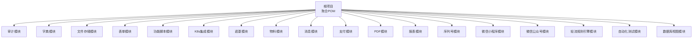

图表来源
- [根POM（pom.xml）:28-48](file://pom.xml#L28-L48)
- [轻流模块配置（application.yml）:1-26](file://micro-liteflow/src/main/resources/config/application.yml#L1-L26)

章节来源
- [根POM（pom.xml）:1-50](file://pom.xml#L1-L50)

## 核心组件
- 多模块 Maven 架构：通过根 POM 聚合各微服务模块，便于统一构建与发布。
- Spring Boot 自动装配：每个模块提供 AutoConfiguration 类，按需启用对应功能。
- 规则引擎（LiteFlow）：在轻流模块中提供链路与脚本的动态加载与执行能力。
- MyBatis Mapper：各模块均包含对应的 Mapper XML 文件，用于数据库访问层定义。

章节来源
- [根POM（pom.xml）:19-26](file://pom.xml#L19-L26)
- [轻流模块配置（application.yml）:1-26](file://micro-liteflow/src/main/resources/config/application.yml#L1-L26)

## 架构总览
下图展示了从客户端到各微服务模块的典型交互路径，以及规则引擎在其中的作用位置。

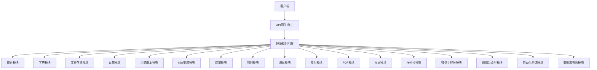

图表来源
- [根POM（pom.xml）:28-48](file://pom.xml#L28-L48)
- [轻流模块配置（application.yml）:1-26](file://micro-liteflow/src/main/resources/config/application.yml#L1-L26)

## 详细组件分析

### 审计模块（micro-audit）
- 自动配置类：提供审计相关的自动装配能力。
- 数据访问：包含审计日志的 Mapper XML，支持变更记录查询与处理。

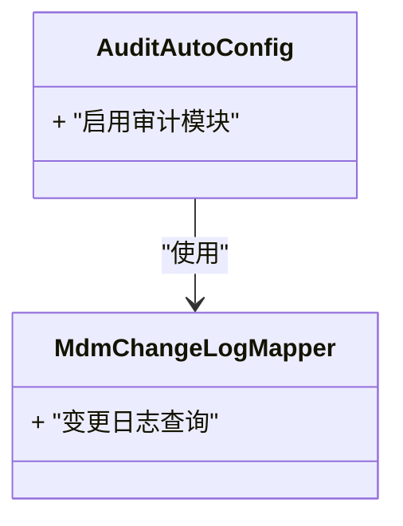

图表来源
- [审计模块自动配置（AuditAutoConfig.java）](file://micro-audit/src/main/java/com/wkclz/micro/audit/AuditAutoConfig.java)
- [审计模块 Mapper XML（MdmChangeLogMapper.xml）](file://micro-audit/src/main/resources/mapper/MdmChangeLogMapper.xml)

章节来源
- [审计模块自动配置（AuditAutoConfig.java）](file://micro-audit/src/main/java/com/wkclz/micro/audit/AuditAutoConfig.java)
- [审计模块 Mapper XML（MdmChangeLogMapper.xml）](file://micro-audit/src/main/resources/mapper/MdmChangeLogMapper.xml)

### 字典模块（micro-dict）
- 自动配置类：提供字典相关自动装配。
- 数据访问：包含字典与字典项的 Mapper XML。

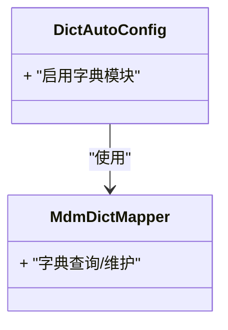

图表来源
- [字典模块自动配置（DictAutoConfig.java）](file://micro-dict/src/main/java/com/wkclz/micro/dict/DictAutoConfig.java)
- [字典模块 Mapper XML（MdmDictMapper.xml）](file://micro-dict/src/main/resources/mapper/MdmDictMapper.xml)

章节来源
- [字典模块自动配置（DictAutoConfig.java）](file://micro-dict/src/main/java/com/wkclz/micro/dict/DictAutoConfig.java)
- [字典模块 Mapper XML（MdmDictMapper.xml）](file://micro-dict/src/main/resources/mapper/MdmDictMapper.xml)

### 文件存储模块（micro-fileos）
- 自动配置类：提供文件存储相关自动装配。
- 数据访问：包含桶、目录、记录、分片上传等 Mapper XML。

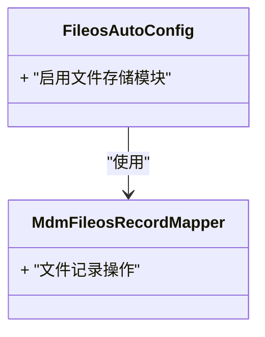

图表来源
- [文件存储模块自动配置（FileosAutoConfig.java）](file://micro-fileos/src/main/java/com/wkclz/micro/fileos/FileosAutoConfig.java)
- [文件存储模块 Mapper XML（MdmFileosRecordMapper.xml）](file://micro-fileos/src/main/resources/mapper/MdmFileosRecordMapper.xml)

章节来源
- [文件存储模块自动配置（FileosAutoConfig.java）](file://micro-fileos/src/main/java/com/wkclz/micro/fileos/FileosAutoConfig.java)
- [文件存储模块 Mapper XML（MdmFileosRecordMapper.xml）](file://micro-fileos/src/main/resources/mapper/MdmFileosRecordMapper.xml)

### 表单模块（micro-form）
- 自动配置类：提供表单与表单规则相关自动装配。
- 数据访问：包含表单、表单项、表单规则及其字段与校验器的 Mapper XML。

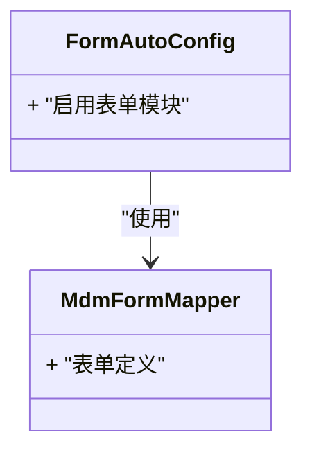

图表来源
- [表单模块自动配置（FormAutoConfig.java）](file://micro-form/src/main/java/com/wkclz/micro/form/FormAutoConfig.java)
- [表单模块 Mapper XML（MdmFormMapper.xml）](file://micro-form/src/main/resources/mapper/MdmFormMapper.xml)

章节来源
- [表单模块自动配置（FormAutoConfig.java）](file://micro-form/src/main/java/com/wkclz/micro/form/FormAutoConfig.java)
- [表单模块 Mapper XML（MdmFormMapper.xml）](file://micro-form/src/main/resources/mapper/MdmFormMapper.xml)

### 功能脚本模块（micro-fun）
- 自动配置类：提供功能函数与分类相关自动装配。
- 数据访问：包含功能函数与分类的 Mapper XML。

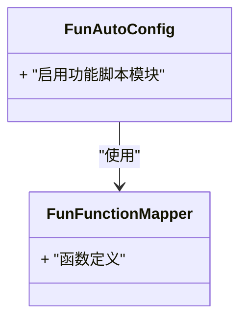

图表来源
- [功能模块自动配置（FunAutoConfig.java）](file://micro-fun/src/main/java/com/wkclz/micro/fun/FunAutoConfig.java)
- [功能模块 Mapper XML（FunFunctionMapper.xml）](file://micro-fun/src/main/resources/mapper/FunFunctionMapper.xml)

章节来源
- [功能模块自动配置（FunAutoConfig.java）](file://micro-fun/src/main/java/com/wkclz/micro/fun/FunAutoConfig.java)
- [功能模块 Mapper XML（FunFunctionMapper.xml）](file://micro-fun/src/main/resources/mapper/FunFunctionMapper.xml)

### K8s集成模块（micro-k8s）
- 自动配置类：提供 Kubernetes 资源配置相关自动装配。
- 数据访问：包含 K8s 配置的 Mapper XML。

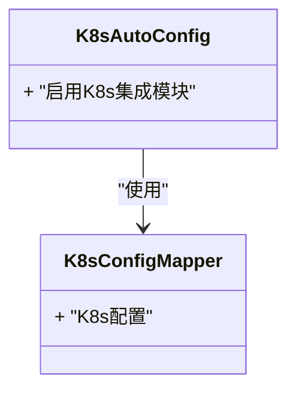

图表来源
- [K8s模块自动配置（K8sAutoConfig.java）](file://micro-k8s/src/main/java/com/wkclz/micro/k8s/K8sAutoConfig.java)
- [K8s模块 Mapper XML（K8sConfigMapper.xml）](file://micro-k8s/src/main/resources/mapper/K8sConfigMapper.xml)

章节来源
- [K8s模块自动配置（K8sAutoConfig.java）](file://micro-k8s/src/main/java/com/wkclz/micro/k8s/K8sAutoConfig.java)
- [K8s模块 Mapper XML（K8sConfigMapper.xml）](file://micro-k8s/src/main/resources/mapper/K8sConfigMapper.xml)

### 遮罩模块（micro-mask）
- 自动配置类：提供响应遮罩规则相关自动装配。
- 数据访问：包含遮罩规则的 Mapper XML。

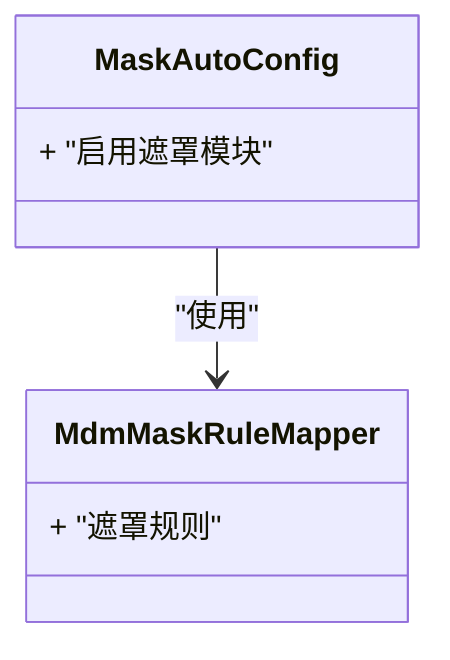

图表来源
- [遮罩模块自动配置（MaskAutoConfig.java）](file://micro-mask/src/main/java/com/wkclz/micro/mask/MaskAutoConfig.java)
- [遮罩模块 Mapper XML（MdmMaskRuleMapper.xml）](file://micro-mask/src/main/resources/mapper/MdmMaskRuleMapper.xml)

章节来源
- [遮罩模块自动配置（MaskAutoConfig.java）](file://micro-mask/src/main/java/com/wkclz/micro/mask/MaskAutoConfig.java)
- [遮罩模块 Mapper XML（MdmMaskRuleMapper.xml）](file://micro-mask/src/main/resources/mapper/MdmMaskRuleMapper.xml)

### 物料模块（micro-material）
- 自动配置类：提供物料与版本、转移日志、引用关系相关自动装配。
- 数据访问：包含物料、分组、版本、转移日志、引用关系的 Mapper XML。

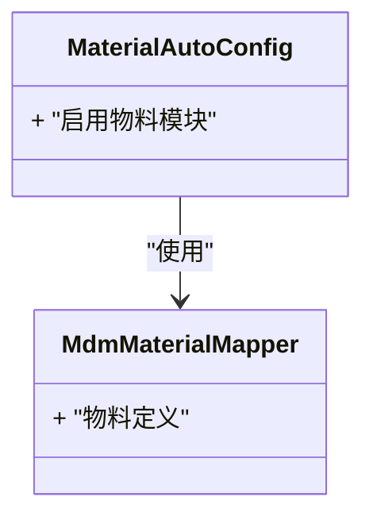

图表来源
- [物料模块自动配置（MaterialAutoConfig.java）](file://micro-material/src/main/java/com/wkclz/micro/material/MaterialAutoConfig.java)
- [物料模块 Mapper XML（MdmMaterialMapper.xml）](file://micro-material/src/main/resources/mapper/MdmMaterialMapper.xml)

章节来源
- [物料模块自动配置（MaterialAutoConfig.java）](file://micro-material/src/main/java/com/wkclz/micro/material/MaterialAutoConfig.java)
- [物料模块 Mapper XML（MdmMaterialMapper.xml）](file://micro-material/src/main/resources/mapper/MdmMaterialMapper.xml)

### 消息模块（micro-msg）
- 自动配置类：提供消息模板、用户记录与设置相关自动装配。
- 数据访问：包含消息模板、通知、用户记录与设置的 Mapper XML。

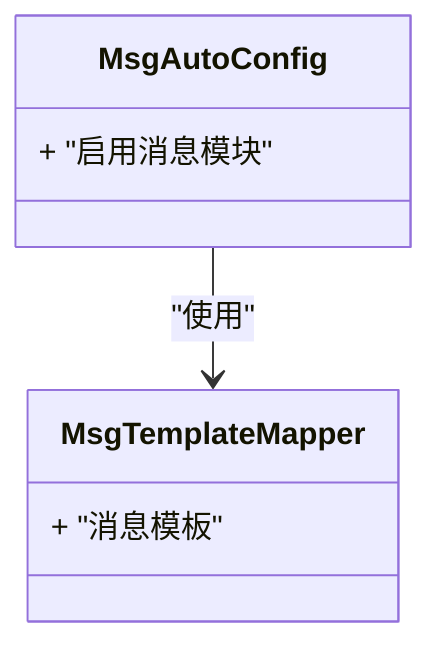

图表来源
- [消息模块自动配置（MsgAutoConfig.java）](file://micro-msg/src/main/java/com/wkclz/micro/msg/MsgAutoConfig.java)
- [消息模块 Mapper XML（MsgTemplateMapper.xml）](file://micro-msg/src/main/resources/mapper/MsgTemplateMapper.xml)

章节来源
- [消息模块自动配置（MsgAutoConfig.java）](file://micro-msg/src/main/java/com/wkclz/micro/msg/MsgAutoConfig.java)
- [消息模块 Mapper XML（MsgTemplateMapper.xml）](file://micro-msg/src/main/resources/mapper/MsgTemplateMapper.xml)

### 支付模块（micro-pay）
- 自动配置类：提供支付订单与配置相关自动装配。
- 数据访问：包含支付订单、支付宝配置、微信支付配置的 Mapper XML。

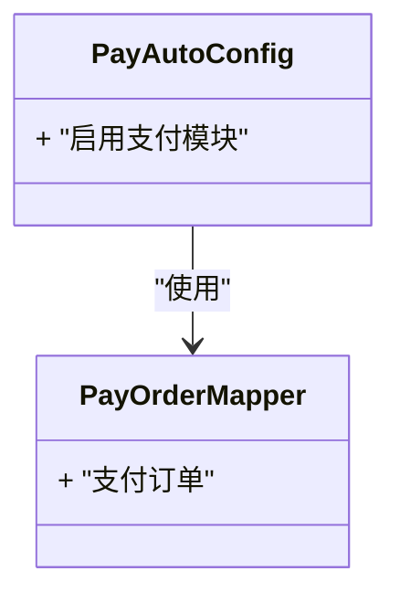

图表来源
- [支付模块自动配置（PayAutoConfig.java）](file://micro-pay/src/main/java/com/wkclz/micro/pay/PayAutoConfig.java)
- [支付模块 Mapper XML（PayOrderMapper.xml）](file://micro-pay/src/main/resources/mapper/PayOrderMapper.xml)

章节来源
- [支付模块自动配置（PayAutoConfig.java）](file://micro-pay/src/main/java/com/wkclz/micro/pay/PayAutoConfig.java)
- [支付模块 Mapper XML（PayOrderMapper.xml）](file://micro-pay/src/main/resources/mapper/PayOrderMapper.xml)

### PDF模块（micro-pdf）
- 自动配置类：提供PDF模板相关自动装配。
- 数据访问：包含PDF模板的 Mapper XML。

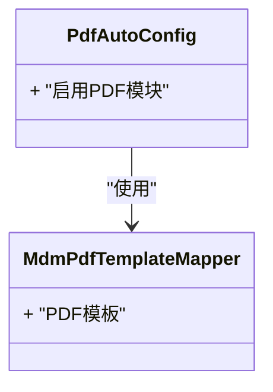

图表来源
- [PDF模块自动配置（PdfAutoConfig.java）](file://micro-pdf/src/main/java/com/wkclz/micro/pdf/PdfAutoConfig.java)
- [PDF模块 Mapper XML（MdmPdfTemplateMapper.xml）](file://micro-pdf/src/main/resources/mapper/MdmPdfTemplateMapper.xml)

章节来源
- [PDF模块自动配置（PdfAutoConfig.java）](file://micro-pdf/src/main/java/com/wkclz/micro/pdf/PdfAutoConfig.java)
- [PDF模块 Mapper XML（MdmPdfTemplateMapper.xml）](file://micro-pdf/src/main/resources/mapper/MdmPdfTemplateMapper.xml)

### 报表模块（micro-report）
- 自动配置类：提供报表定义、参数、结果与历史相关自动装配。
- 数据访问：包含报表定义、参数、结果与历史的 Mapper XML。

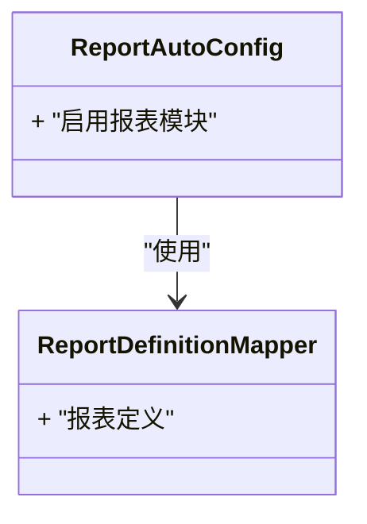

图表来源
- [报表模块自动配置（ReportAutoConfig.java）](file://micro-report/src/main/java/com/wkclz/micro/report/ReportAutoConfig.java)
- [报表模块 Mapper XML（ReportDefinitionMapper.xml）](file://micro-report/src/main/resources/mapper/ReportDefinitionMapper.xml)

章节来源
- [报表模块自动配置（ReportAutoConfig.java）](file://micro-report/src/main/java/com/wkclz/micro/report/ReportAutoConfig.java)
- [报表模块 Mapper XML（ReportDefinitionMapper.xml）](file://micro-report/src/main/resources/mapper/ReportDefinitionMapper.xml)

### 序列号模块（micro-seq）
- 自动配置类：提供序列号相关自动装配。
- 数据访问：包含序列号的 Mapper XML。

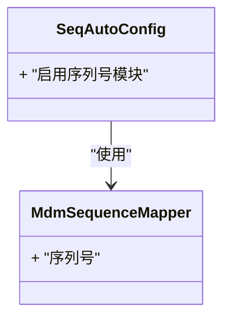

图表来源
- [序列号模块自动配置（SeqAutoConfig.java）](file://micro-seq/src/main/java/com/wkclz/micro/seq/SeqAutoConfig.java)
- [序列号模块 Mapper XML（MdmSequenceMapper.xml）](file://micro-seq/src/main/resources/mapper/MdmSequenceMapper.xml)

章节来源
- [序列号模块自动配置（SeqAutoConfig.java）](file://micro-seq/src/main/java/com/wkclz/micro/seq/SeqAutoConfig.java)
- [序列号模块 Mapper XML（MdmSequenceMapper.xml）](file://micro-seq/src/main/resources/mapper/MdmSequenceMapper.xml)

### 微信小程序模块（micro-wxapp）
- 自动配置类：提供小程序相关自动装配。
- 数据访问：包含小程序相关 Mapper XML。

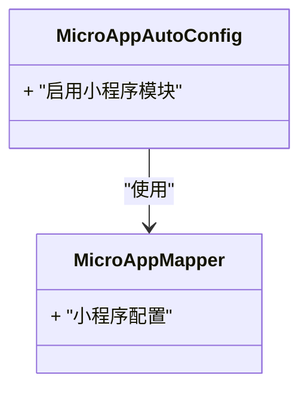

图表来源
- [微信小程序模块自动配置（MicroAppAutoConfig.java）](file://micro-wxapp/src/main/java/com/wkclz/micro/wxapp/MicroAppAutoConfig.java)
- [微信小程序模块 Mapper XML（MicroAppMapper.xml）](file://micro-wxapp/src/main/resources/mapper/MicroAppMapper.xml)

章节来源
- [微信小程序模块自动配置（MicroAppAutoConfig.java）](file://micro-wxapp/src/main/java/com/wkclz/micro/wxapp/MicroAppAutoConfig.java)
- [微信小程序模块 Mapper XML（MicroAppMapper.xml）](file://micro-wxapp/src/main/resources/mapper/MicroAppMapper.xml)

### 微信公众号模块（micro-wxmp）
- 自动配置类：提供公众号相关自动装配。
- 数据访问：包含公众号配置的 Mapper XML。

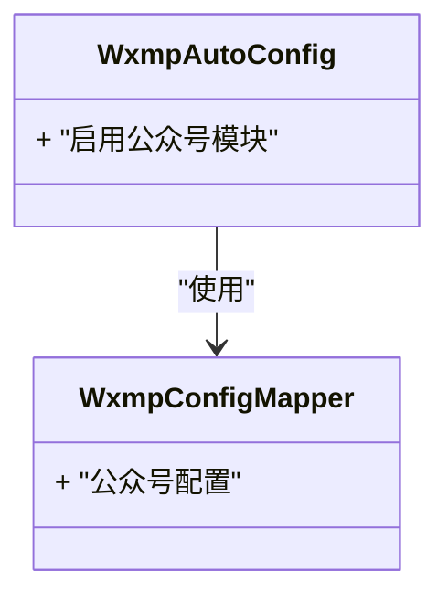

图表来源
- [微信公众号模块自动配置（WxmpAutoConfig.java）](file://micro-wxmp/src/main/java/com/wkclz/micro/wxmp/WxmpAutoConfig.java)
- [微信公众号模块 Mapper XML（WxmpConfigMapper.xml）](file://micro-wxmp/src/main/resources/mapper/WxmpConfigMapper.xml)

章节来源
- [微信公众号模块自动配置（WxmpAutoConfig.java）](file://micro-wxmp/src/main/java/com/wkclz/micro/wxmp/WxmpAutoConfig.java)
- [微信公众号模块 Mapper XML（WxmpConfigMapper.xml）](file://micro-wxmp/src/main/resources/mapper/WxmpConfigMapper.xml)

### 轻流规则引擎模块（micro-liteflow）
- 配置要点：包含规则引擎的开关、SQL日志、轮询机制及表名映射等。
- 作用：为其他模块提供动态规则与脚本执行能力。

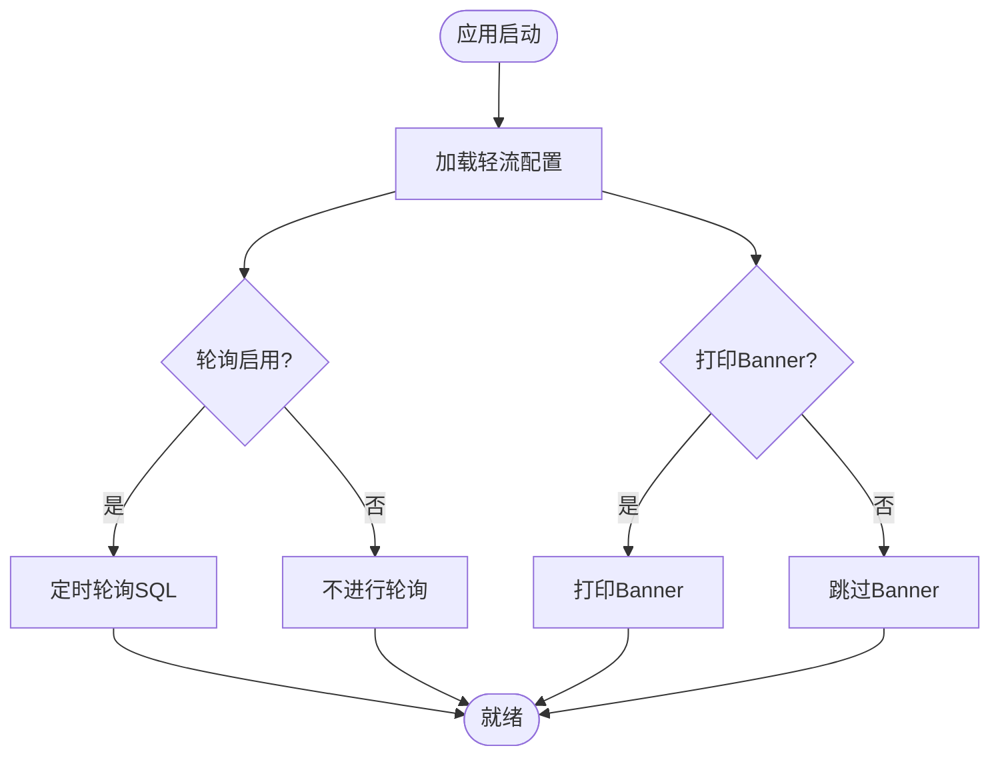

图表来源
- [轻流模块配置（application.yml）:1-26](file://micro-liteflow/src/main/resources/config/application.yml#L1-L26)

章节来源
- [轻流模块配置（application.yml）:1-26](file://micro-liteflow/src/main/resources/config/application.yml#L1-L26)

## 依赖关系分析
- 语言与工具：根 POM 指定 Java 编译版本为 25，要求本地 JDK 25 环境可用。
- 模块间耦合：各模块通过 AutoConfiguration 条件装配，彼此低耦合；轻流模块为其他模块提供规则执行能力。
- 外部依赖：各模块通过各自的 Mapper XML 访问数据库，无直接模块间依赖。

图表来源
- [根POM（pom.xml）:19-26](file://pom.xml#L19-L26)

章节来源
- [根POM（pom.xml）:19-26](file://pom.xml#L19-L26)

## 性能考虑
- 轻流轮询：合理配置轮询间隔与起始时间，避免频繁查询数据库造成压力。
- Mapper 查询：为高频查询建立合适的索引，减少全表扫描。
- 模块拆分：按业务域拆分模块，有利于独立扩展与资源隔离。

## 故障排除指南
- 环境版本不匹配
  - 症状：编译失败或运行时报错。
  - 排查：确认本地 JDK 版本为 25，Maven 使用与之兼容的版本。
  - 参考：根 POM 中的 Java 编译属性。
- 依赖缺失
  - 症状：找不到模块或依赖。
  - 排查：确保网络可访问父工程与中央仓库；必要时配置代理。
  - 参考：根 POM 的父工程坐标与模块列表。
- 规则引擎配置错误
  - 症状：规则无法加载或轮询异常。
  - 排查：检查轻流配置中的表名映射与 SQL 是否正确。
  - 参考：轻流模块配置文件。
- 数据访问异常
  - 症状：Mapper 查询失败。
  - 排查：核对数据库连接、表结构与 Mapper XML 中的 SQL。
  - 参考：各模块 Mapper XML 文件。

章节来源
- [根POM（pom.xml）:19-26](file://pom.xml#L19-L26)
- [轻流模块配置（application.yml）:1-26](file://micro-liteflow/src/main/resources/config/application.yml#L1-L26)

## 结论
通过本快速开始指南，你已了解 sh-microapp 的项目结构、核心组件与启动要点。建议先完成环境准备与依赖安装，再逐个模块验证功能，最后结合轻流规则引擎完成端到端验证。

## 附录

### 环境准备与安装步骤
- JDK 25
  - 下载与安装：从官方渠道获取 JDK 25 并完成安装。
  - 验证：在终端执行版本检查命令，确认输出包含 25。
- Maven
  - 下载与安装：从官方渠道获取 Maven 并完成安装。
  - 验证：在终端执行版本检查命令，确认输出包含 Maven 版本。
- MySQL
  - 下载与安装：根据操作系统选择合适安装包，完成安装与初始化。
  - 创建数据库：创建项目所需的数据库实例。
  - 用户权限：为应用创建专用账号并授予相应权限。
- Redis
  - 下载与安装：根据操作系统选择合适安装包，完成安装与基础配置。
  - 连接验证：使用客户端工具连接 Redis，确认连通性。

章节来源
- [根POM（pom.xml）:19-26](file://pom.xml#L19-L26)

### 项目克隆与首次构建
- 克隆仓库：使用 Git 将项目克隆到本地工作目录。
- 切换目录：进入项目根目录。
- 依赖安装：执行 Maven 命令以解析并下载依赖。
- 首次构建：执行 Maven 构建命令，生成目标产物。
- 模块验证：针对关键模块（如审计、字典、文件存储等）进行最小化验证。

章节来源
- [根POM（pom.xml）:1-50](file://pom.xml#L1-L50)

### 基本配置示例与启动步骤
- 轻流模块配置
  - 路径参考：模块内资源目录下的配置文件。
  - 关键点：规则引擎开关、SQL日志、轮询间隔与表名映射。
- 应用启动验证
  - 启动方式：使用 Maven 或 IDE 启动任一模块。
  - 健康检查：访问模块提供的健康检查接口，确认服务正常。
  - 功能验证：调用模块的核心接口，观察返回结果。

章节来源
- [轻流模块配置（application.yml）:1-26](file://micro-liteflow/src/main/resources/config/application.yml#L1-L26)

### 常见环境问题排查与解决方案
- JDK 版本不匹配
  - 现象：编译阶段报错或运行期类版本不兼容。
  - 解决：升级至 JDK 25，清理缓存后重新构建。
- Maven 依赖拉取失败
  - 现象：网络超时或认证失败。
  - 解决：检查网络与代理设置；更新本地仓库索引。
- 轻流规则加载异常
  - 现象：规则未生效或轮询失败。
  - 解决：核对配置项与数据库表结构，确保 SQL 正确。
- 数据库连接失败
  - 现象：启动时报数据库连接异常。
  - 解决：检查数据库地址、端口、账号与密码；确认防火墙放行。

章节来源
- [根POM（pom.xml）:19-26](file://pom.xml#L19-L26)
- [轻流模块配置（application.yml）:1-26](file://micro-liteflow/src/main/resources/config/application.yml#L1-L26)