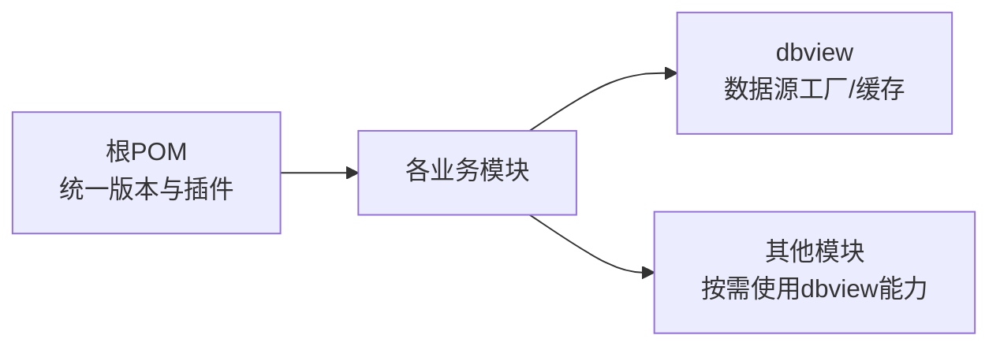

# 启动问题排查

<cite>
**本文引用的文件**
- [pom.xml](file://pom.xml)
- [README.md](file://README.md)
- [CONTEXT.md](file://CONTEXT.md)
- [AuditAutoConfig.java](file://micro-audit/src/main/java/com/wkclz/micro/audit/AuditAutoConfig.java)
- [AutoTestAutoConfig.java](file://micro-autotest/src/main/java/com/wkclz/auto/AutoTestAutoConfig.java)
- [DbviewAutoConfig.java](file://micro-dbview/src/main/java/com/wkclz/micro/dbview/DbviewAutoConfig.java)
- [DictAutoConfig.java](file://micro-dict/src/main/java/com/wkclz/micro/dict/DictAutoConfig.java)
- [FileosAutoConfig.java](file://micro-fileos/src/main/java/com/wkclz/micro/fileos/FileosAutoConfig.java)
- [FormAutoConfig.java](file://micro-form/src/main/java/com/wkclz/micro/form/FormAutoConfig.java)
- [FunAutoConfig.java](file://micro-fun/src/main/java/com/wkclz/micro/fun/FunAutoConfig.java)
- [K8sAutoConfig.java](file://micro-k8s/src/main/java/com/wkclz/micro/k8s/K8sAutoConfig.java)
- [LiteFlowAutoConfig.java](file://micro-liteflow/src/main/java/com/wkclz/micro/liteflow/LiteFlowAutoConfig.java)
- [MaskAutoConfig.java](file://micro-mask/src/main/java/com/wkclz/micro/mask/MaskAutoConfig.java)
- [MaterialAutoConfig.java](file://micro-material/src/main/java/com/wkclz/micro/material/MaterialAutoConfig.java)
- [MsgAutoConfig.java](file://micro-msg/src/main/java/com/wkclz/micro/msg/MsgAutoConfig.java)
- [PayAutoConfig.java](file://micro-pay/src/main/java/com/wkclz/micro/pay/PayAutoConfig.java)
- [PdfAutoConfig.java](file://micro-pdf/src/main/java/com/wkclz/micro/pdf/PdfAutoConfig.java)
- [ReportAutoConfig.java](file://micro-report/src/main/java/com/wkclz/micro/report/ReportAutoConfig.java)
- [RmcheckAutoConfig.java](file://micro-rmcheck/src/main/java/com/wkclz/micro/rmcheck/RmcheckAutoConfig.java)
- [SeqAutoConfig.java](file://micro-seq/src/main/java/com/wkclz/micro/seq/SeqAutoConfig.java)
- [MicroAppAutoConfig.java](file://micro-wxapp/src/main/java/com/wkclz/micro/wxapp/MicroAppAutoConfig.java)
- [WxmpAutoConfig.java](file://micro-wxmp/src/main/java/com/wkclz/micro/wxmp/WxmpAutoConfig.java)
</cite>

## 目录
1. [简介](#简介)
2. [项目结构](#项目结构)
3. [核心组件](#核心组件)
4. [架构总览](#架构总览)
5. [详细组件分析](#详细组件分析)
6. [依赖分析](#依赖分析)
7. [性能考虑](#性能考虑)
8. [故障排查指南](#故障排查指南)
9. [结论](#结论)
10. [附录](#附录)

## 简介
本文件面向使用 sh-microapp 微服务框架的开发者，聚焦于“启动阶段”常见问题的诊断与修复。内容覆盖模块自动配置失败、依赖注入异常、数据库连接初始化错误等典型场景，并结合框架中各功能模块的自动配置类与扫描路径，给出可操作的排查步骤与解决方案。同时提供基于日志的异常定位方法、启动顺序检查要点、依赖关系验证策略以及环境变量配置建议。

## 项目结构
sh-microapp 采用多模块 Maven 结构，每个业务模块（如 audit、autotest、dbview、dict、fileos、form、fun、k8s、liteflow、mask、material、msg、pay、pdf、report、rmcheck、seq、wxapp、wxmp）均提供独立的自动配置类，负责组件扫描与 Bean 注册。根工程通过统一的父 POM 管理版本与插件，模块间通过依赖传递实现功能聚合。

```mermaid
graph TB
Root["根工程<br/>pom.xml"] --> ModAudit["模块：audit<br/>AuditAutoConfig.java"]
Root --> ModAutotest["模块：autotest<br/>AutoTestAutoConfig.java"]
Root --> ModDbview["模块：dbview<br/>DbviewAutoConfig.java"]
Root --> ModDict["模块：dict<br/>DictAutoConfig.java"]
Root --> ModFileos["模块：fileos<br/>FileosAutoConfig.java"]
Root --> ModForm["模块：form<br/>FormAutoConfig.java"]
Root --> ModFun["模块：fun<br/>FunAutoConfig.java"]
Root --> ModK8s["模块：k8s<br/>K8sAutoConfig.java"]
Root --> ModLiteflow["模块：liteflow<br/>LiteFlowAutoConfig.java"]
Root --> ModMask["模块：mask<br/>MaskAutoConfig.java"]
Root --> ModMaterial["模块：material<br/>MaterialAutoConfig.java"]
Root --> ModMsg["模块：msg<br/>MsgAutoConfig.java"]
Root --> ModPay["模块：pay<br/>PayAutoConfig.java"]
Root --> ModPdf["模块：pdf<br/>PdfAutoConfig.java"]
Root --> ModReport["模块：report<br/>ReportAutoConfig.java"]
Root --> ModRmcheck["模块：rmcheck<br/>RmcheckAutoConfig.java"]
Root --> ModSeq["模块：seq<br/>SeqAutoConfig.java"]
Root --> ModWxapp["模块：wxapp<br/>MicroAppAutoConfig.java"]
Root --> ModWxmp["模块：wxmp<br/>WxmpAutoConfig.java"]
```

图表来源
- [pom.xml](file://pom.xml)
- [AuditAutoConfig.java:8-8](file://micro-audit/src/main/java/com/wkclz/micro/audit/AuditAutoConfig.java#L8-L8)
- [AutoTestAutoConfig.java:6-6](file://micro-autotest/src/main/java/com/wkclz/auto/AutoTestAutoConfig.java#L6-L6)
- [DbviewAutoConfig.java:8-8](file://micro-dbview/src/main/java/com/wkclz/micro/dbview/DbviewAutoConfig.java#L8-L8)
- [DictAutoConfig.java:8-8](file://micro-dict/src/main/java/com/wkclz/micro/dict/DictAutoConfig.java#L8-L8)
- [FileosAutoConfig.java:7-7](file://micro-fileos/src/main/java/com/wkclz/micro/fileos/FileosAutoConfig.java#L7-L7)
- [FormAutoConfig.java](file://micro-form/src/main/java/com/wkclz/micro/form/FormAutoConfig.java)
- [FunAutoConfig.java](file://micro-fun/src/main/java/com/wkclz/micro/fun/FunAutoConfig.java)
- [K8sAutoConfig.java](file://micro-k8s/src/main/java/com/wkclz/micro/k8s/K8sAutoConfig.java)
- [LiteFlowAutoConfig.java](file://micro-liteflow/src/main/java/com/wkclz/micro/liteflow/LiteFlowAutoConfig.java)
- [MaskAutoConfig.java](file://micro-mask/src/main/java/com/wkclz/micro/mask/MaskAutoConfig.java)
- [MaterialAutoConfig.java](file://micro-material/src/main/java/com/wkclz/micro/material/MaterialAutoConfig.java)
- [MsgAutoConfig.java](file://micro-msg/src/main/java/com/wkclz/micro/msg/MsgAutoConfig.java)
- [PayAutoConfig.java](file://micro-pay/src/main/java/com/wkclz/micro/pay/PayAutoConfig.java)
- [PdfAutoConfig.java](file://micro-pdf/src/main/java/com/wkclz/micro/pdf/PdfAutoConfig.java)
- [ReportAutoConfig.java](file://micro-report/src/main/java/com/wkclz/micro/report/ReportAutoConfig.java)
- [RmcheckAutoConfig.java](file://micro-rmcheck/src/main/java/com/wkclz/micro/rmcheck/RmcheckAutoConfig.java)
- [SeqAutoConfig.java](file://micro-seq/src/main/java/com/wkclz/micro/seq/SeqAutoConfig.java)
- [MicroAppAutoConfig.java](file://micro-wxapp/src/main/java/com/wkclz/micro/wxapp/MicroAppAutoConfig.java)
- [WxmpAutoConfig.java](file://micro-wxmp/src/main/java/com/wkclz/micro/wxmp/WxmpAutoConfig.java)

章节来源
- [pom.xml](file://pom.xml)
- [README.md](file://README.md)
- [CONTEXT.md](file://CONTEXT.md)

## 核心组件
- 自动配置入口：各模块在主包下提供 AutoConfig 类，使用组件扫描注解指定扫描基包，确保模块内的 @Component、@Service 等被正确注册为 Bean。
- 组件扫描范围：每个模块的 AutoConfig 使用 basePackages 指定扫描路径，避免跨模块误扫或漏扫。
- 共享能力：部分模块提供通用工厂、缓存、配置类等，作为其他模块的依赖被引入。

章节来源
- [AuditAutoConfig.java:8-8](file://micro-audit/src/main/java/com/wkclz/micro/audit/AuditAutoConfig.java#L8-L8)
- [AutoTestAutoConfig.java:6-6](file://micro-autotest/src/main/java/com/wkclz/auto/AutoTestAutoConfig.java#L6-L6)
- [DbviewAutoConfig.java:8-8](file://micro-dbview/src/main/java/com/wkclz/micro/dbview/DbviewAutoConfig.java#L8-L8)
- [DictAutoConfig.java:8-8](file://micro-dict/src/main/java/com/wkclz/micro/dict/DictAutoConfig.java#L8-L8)
- [FileosAutoConfig.java:7-7](file://micro-fileos/src/main/java/com/wkclz/micro/fileos/FileosAutoConfig.java#L7-L7)
- [FormAutoConfig.java](file://micro-form/src/main/java/com/wkclz/micro/form/FormAutoConfig.java)
- [FunAutoConfig.java](file://micro-fun/src/main/java/com/wkclz/micro/fun/FunAutoConfig.java)
- [K8sAutoConfig.java](file://micro-k8s/src/main/java/com/wkclz/micro/k8s/K8sAutoConfig.java)
- [LiteFlowAutoConfig.java](file://micro-liteflow/src/main/java/com/wkclz/micro/liteflow/LiteFlowAutoConfig.java)
- [MaskAutoConfig.java](file://micro-mask/src/main/java/com/wkclz/micro/mask/MaskAutoConfig.java)
- [MaterialAutoConfig.java](file://micro-material/src/main/java/com/wkclz/micro/material/MaterialAutoConfig.java)
- [MsgAutoConfig.java](file://micro-msg/src/main/java/com/wkclz/micro/msg/MsgAutoConfig.java)
- [PayAutoConfig.java](file://micro-pay/src/main/java/com/wkclz/micro/pay/PayAutoConfig.java)
- [PdfAutoConfig.java](file://micro-pdf/src/main/java/com/wkclz/micro/pdf/PdfAutoConfig.java)
- [ReportAutoConfig.java](file://micro-report/src/main/java/com/wkclz/micro/report/ReportAutoConfig.java)
- [RmcheckAutoConfig.java](file://micro-rmcheck/src/main/java/com/wkclz/micro/rmcheck/RmcheckAutoConfig.java)
- [SeqAutoConfig.java](file://micro-seq/src/main/java/com/wkclz/micro/seq/SeqAutoConfig.java)
- [MicroAppAutoConfig.java](file://micro-wxapp/src/main/java/com/wkclz/micro/wxapp/MicroAppAutoConfig.java)
- [WxmpAutoConfig.java](file://micro-wxmp/src/main/java/com/wkclz/micro/wxmp/WxmpAutoConfig.java)

## 架构总览
下图展示启动时各模块自动配置的装配关系与扫描范围，体现“按模块自治、按需启用”的装配原则。

```mermaid
graph TB
subgraph "启动装配"
AC["应用启动器"] --> CFG_A["AuditAutoConfig"]
AC --> CFG_AT["AutoTestAutoConfig"]
AC --> CFG_DB["DbviewAutoConfig"]
AC --> CFG_D["DictAutoConfig"]
AC --> CFG_F["FileosAutoConfig"]
AC --> CFG_FR["FormAutoConfig"]
AC --> CFG_FN["FunAutoConfig"]
AC --> CFG_K8S["K8sAutoConfig"]
AC --> CFG_LF["LiteFlowAutoConfig"]
AC --> CFG_M["MaskAutoConfig"]
AC --> CFG_MAT["MaterialAutoConfig"]
AC --> CFG_MSG["MsgAutoConfig"]
AC --> CFG_P["PayAutoConfig"]
AC --> CFG_PD["PdfAutoConfig"]
AC --> CFG_R["ReportAutoConfig"]
AC --> CFG_RC["RmcheckAutoConfig"]
AC --> CFG_S["SeqAutoConfig"]
AC --> CFG_WXA["MicroAppAutoConfig"]
AC --> CFG_WXMP["WxmpAutoConfig"]
end
subgraph "扫描范围"
CFG_A --> ScanA["扫描包：com.wkclz.micro.audit"]
CFG_AT --> ScanAT["扫描包：com.wkclz.auto"]
CFG_DB --> ScanDB["扫描包：com.wkclz.micro.dbview"]
CFG_D --> ScanD["扫描包：com.wkclz.micro.dict"]
CFG_F --> ScanF["扫描包：com.wkclz.micro.fileos"]
CFG_FR --> ScanFR["扫描包：com.wkclz.micro.form"]
CFG_FN --> ScanFN["扫描包：com.wkclz.micro.fun"]
CFG_K8S --> ScanK8S["扫描包：com.wkclz.micro.k8s"]
CFG_LF --> ScanLF["扫描包：com.wkclz.micro.liteflow"]
CFG_M --> ScanM["扫描包：com.wkclz.micro.mask"]
CFG_MAT --> ScanMAT["扫描包：com.wkclz.micro.material"]
CFG_MSG --> ScanMSG["扫描包：com.wkclz.micro.msg"]
CFG_P --> ScanP["扫描包：com.wkclz.micro.pay"]
CFG_PD --> ScanPD["扫描包：com.wkclz.micro.pdf"]
CFG_R --> ScanR["扫描包：com.wkclz.micro.report"]
CFG_RC --> ScanRC["扫描包：com.wkclz.micro.rmcheck"]
CFG_S --> ScanS["扫描包：com.wkclz.micro.seq"]
CFG_WXA --> ScanWXA["扫描包：com.wkclz.micro.wxapp"]
CFG_WXMP --> ScanWXMP["扫描包：com.wkclz.micro.wxmp"]
end
```

图表来源
- [AuditAutoConfig.java:8-8](file://micro-audit/src/main/java/com/wkclz/micro/audit/AuditAutoConfig.java#L8-L8)
- [AutoTestAutoConfig.java:6-6](file://micro-autotest/src/main/java/com/wkclz/auto/AutoTestAutoConfig.java#L6-L6)
- [DbviewAutoConfig.java:8-8](file://micro-dbview/src/main/java/com/wkclz/micro/dbview/DbviewAutoConfig.java#L8-L8)
- [DictAutoConfig.java:8-8](file://micro-dict/src/main/java/com/wkclz/micro/dict/DictAutoConfig.java#L8-L8)
- [FileosAutoConfig.java:7-7](file://micro-fileos/src/main/java/com/wkclz/micro/fileos/FileosAutoConfig.java#L7-L7)
- [FormAutoConfig.java](file://micro-form/src/main/java/com/wkclz/micro/form/FormAutoConfig.java)
- [FunAutoConfig.java](file://micro-fun/src/main/java/com/wkclz/micro/fun/FunAutoConfig.java)
- [K8sAutoConfig.java](file://micro-k8s/src/main/java/com/wkclz/micro/k8s/K8sAutoConfig.java)
- [LiteFlowAutoConfig.java](file://micro-liteflow/src/main/java/com/wkclz/micro/liteflow/LiteFlowAutoConfig.java)
- [MaskAutoConfig.java](file://micro-mask/src/main/java/com/wkclz/micro/mask/MaskAutoConfig.java)
- [MaterialAutoConfig.java](file://micro-material/src/main/java/com/wkclz/micro/material/MaterialAutoConfig.java)
- [MsgAutoConfig.java](file://micro-msg/src/main/java/com/wkclz/micro/msg/MsgAutoConfig.java)
- [PayAutoConfig.java](file://micro-pay/src/main/java/com/wkclz/micro/pay/PayAutoConfig.java)
- [PdfAutoConfig.java](file://micro-pdf/src/main/java/com/wkclz/micro/pdf/PdfAutoConfig.java)
- [ReportAutoConfig.java](file://micro-report/src/main/java/com/wkclz/micro/report/ReportAutoConfig.java)
- [RmcheckAutoConfig.java](file://micro-rmcheck/src/main/java/com/wkclz/micro/rmcheck/RmcheckAutoConfig.java)
- [SeqAutoConfig.java](file://micro-seq/src/main/java/com/wkclz/micro/seq/SeqAutoConfig.java)
- [MicroAppAutoConfig.java](file://micro-wxapp/src/main/java/com/wkclz/micro/wxapp/MicroAppAutoConfig.java)
- [WxmpAutoConfig.java](file://micro-wxmp/src/main/java/com/wkclz/micro/wxmp/WxmpAutoConfig.java)

## 详细组件分析

### 模块自动配置失败排查
- 现象特征
  - 某模块 Bean 未注册、无法注入
  - 启动日志显示“未扫描到组件”或“未发现候选 Bean”
- 排查步骤
  - 确认模块 AutoConfig 的 @ComponentScan 基包是否与实际代码包一致
  - 检查模块是否被主工程依赖引入
  - 验证模块内 @Component/@Service 等注解是否正确
- 解决方案
  - 若扫描包不匹配，修正 AutoConfig 中的 basePackages
  - 若未引入依赖，补充主工程对模块的依赖声明

章节来源
- [AuditAutoConfig.java:8-8](file://micro-audit/src/main/java/com/wkclz/micro/audit/AuditAutoConfig.java#L8-L8)
- [AutoTestAutoConfig.java:6-6](file://micro-autotest/src/main/java/com/wkclz/auto/AutoTestAutoConfig.java#L6-L6)
- [DbviewAutoConfig.java:8-8](file://micro-dbview/src/main/java/com/wkclz/micro/dbview/DbviewAutoConfig.java#L8-L8)
- [DictAutoConfig.java:8-8](file://micro-dict/src/main/java/com/wkclz/micro/dict/DictAutoConfig.java#L8-L8)
- [FileosAutoConfig.java:7-7](file://micro-fileos/src/main/java/com/wkclz/micro/fileos/FileosAutoConfig.java#L7-L7)
- [FormAutoConfig.java](file://micro-form/src/main/java/com/wkclz/micro/form/FormAutoConfig.java)
- [FunAutoConfig.java](file://micro-fun/src/main/java/com/wkclz/micro/fun/FunAutoConfig.java)
- [K8sAutoConfig.java](file://micro-k8s/src/main/java/com/wkclz/micro/k8s/K8sAutoConfig.java)
- [LiteFlowAutoConfig.java](file://micro-liteflow/src/main/java/com/wkclz/micro/liteflow/LiteFlowAutoConfig.java)
- [MaskAutoConfig.java](file://micro-mask/src/main/java/com/wkclz/micro/mask/MaskAutoConfig.java)
- [MaterialAutoConfig.java](file://micro-material/src/main/java/com/wkclz/micro/material/MaterialAutoConfig.java)
- [MsgAutoConfig.java](file://micro-msg/src/main/java/com/wkclz/micro/msg/MsgAutoConfig.java)
- [PayAutoConfig.java](file://micro-pay/src/main/java/com/wkclz/micro/pay/PayAutoConfig.java)
- [PdfAutoConfig.java](file://micro-pdf/src/main/java/com/wkclz/micro/pdf/PdfAutoConfig.java)
- [ReportAutoConfig.java](file://micro-report/src/main/java/com/wkclz/micro/report/ReportAutoConfig.java)
- [RmcheckAutoConfig.java](file://micro-rmcheck/src/main/java/com/wkclz/micro/rmcheck/RmcheckAutoConfig.java)
- [SeqAutoConfig.java](file://micro-seq/src/main/java/com/wkclz/micro/seq/SeqAutoConfig.java)
- [MicroAppAutoConfig.java](file://micro-wxapp/src/main/java/com/wkclz/micro/wxapp/MicroAppAutoConfig.java)
- [WxmpAutoConfig.java](file://micro-wxmp/src/main/java/com/wkclz/micro/wxmp/WxmpAutoConfig.java)

### 依赖注入异常排查
- 现象特征
  - @Autowired 注入失败，提示“未找到匹配的 Bean”
  - 存在多个候选 Bean 但未指定限定符
- 排查步骤
  - 检查目标 Bean 是否在当前模块扫描范围内
  - 确认 @Service/@Component 等注解是否生效
  - 若存在同类型多实现，使用 @Qualifier 或 @Primary 明确注入目标
- 解决方案
  - 将目标 Bean 所在包纳入扫描范围
  - 为歧义 Bean 添加限定符或优先级

章节来源
- [AuditAutoConfig.java:8-8](file://micro-audit/src/main/java/com/wkclz/micro/audit/AuditAutoConfig.java#L8-L8)
- [DbviewAutoConfig.java:8-8](file://micro-dbview/src/main/java/com/wkclz/micro/dbview/DbviewAutoConfig.java#L8-L8)
- [DictAutoConfig.java:8-8](file://micro-dict/src/main/java/com/wkclz/micro/dict/DictAutoConfig.java#L8-L8)
- [FileosAutoConfig.java:7-7](file://micro-fileos/src/main/java/com/wkclz/micro/fileos/FileosAutoConfig.java#L7-L7)
- [FormAutoConfig.java](file://micro-form/src/main/java/com/wkclz/micro/form/FormAutoConfig.java)
- [FunAutoConfig.java](file://micro-fun/src/main/java/com/wkclz/micro/fun/FunAutoConfig.java)
- [K8sAutoConfig.java](file://micro-k8s/src/main/java/com/wkclz/micro/k8s/K8sAutoConfig.java)
- [LiteFlowAutoConfig.java](file://micro-liteflow/src/main/java/com/wkclz/micro/liteflow/LiteFlowAutoConfig.java)
- [MaskAutoConfig.java](file://micro-mask/src/main/java/com/wkclz/micro/mask/MaskAutoConfig.java)
- [MaterialAutoConfig.java](file://micro-material/src/main/java/com/wkclz/micro/material/MaterialAutoConfig.java)
- [MsgAutoConfig.java](file://micro-msg/src/main/java/com/wkclz/micro/msg/MsgAutoConfig.java)
- [PayAutoConfig.java](file://micro-pay/src/main/java/com/wkclz/micro/pay/PayAutoConfig.java)
- [PdfAutoConfig.java](file://micro-pdf/src/main/java/com/wkclz/micro/pdf/PdfAutoConfig.java)
- [ReportAutoConfig.java](file://micro-report/src/main/java/com/wkclz/micro/report/ReportAutoConfig.java)
- [RmcheckAutoConfig.java](file://micro-rmcheck/src/main/java/com/wkclz/micro/rmcheck/RmcheckAutoConfig.java)
- [SeqAutoConfig.java](file://micro-seq/src/main/java/com/wkclz/micro/seq/SeqAutoConfig.java)
- [MicroAppAutoConfig.java](file://micro-wxapp/src/main/java/com/wkclz/micro/wxapp/MicroAppAutoConfig.java)
- [WxmpAutoConfig.java](file://micro-wxmp/src/main/java/com/wkclz/micro/wxmp/WxmpAutoConfig.java)

### 数据库连接初始化错误排查
- 现象特征
  - 启动时报数据库连接超时、驱动找不到、凭证错误等
- 排查步骤
  - 检查模块内数据源配置类与连接工厂类是否在扫描范围内
  - 确认数据库连接参数（地址、端口、库名、账号、密码）是否正确
  - 校验数据库驱动依赖是否已引入
- 解决方案
  - 将数据源配置类纳入对应模块的 @ComponentScan 范围
  - 在配置文件中补齐缺失的连接参数
  - 引入正确的数据库驱动依赖

章节来源
- [DbviewAutoConfig.java:8-8](file://micro-dbview/src/main/java/com/wkclz/micro/dbview/DbviewAutoConfig.java#L8-L8)

### 配置文件解析错误排查
- 现象特征
  - 启动时报 YAML/Properties 解析异常、字段缺失或类型不匹配
- 排查步骤
  - 检查 application.yml 或 application.properties 的缩进与键名
  - 确认配置项与 @ConfigurationProperties 或 @Value 对应的字段一致
- 解决方案
  - 修正配置文件格式与键名
  - 补充缺失的配置项或提供默认值

章节来源
- [LiteFlowAutoConfig.java](file://micro-liteflow/src/main/java/com/wkclz/micro/liteflow/LiteFlowAutoConfig.java)

## 依赖分析
- 模块耦合度
  - 各模块通过 AutoConfig 独立装配，耦合度低
  - 通用能力（如 dbview 的数据源工厂）可被多个模块复用
- 外部依赖
  - 根 POM 统一管理版本与插件，模块间通过依赖传递共享能力
- 潜在风险
  - 扫描包不一致导致 Bean 未注册
  - 配置文件格式错误导致 Bean 创建失败

图表来源
- [pom.xml](file://pom.xml)
- [DbviewAutoConfig.java:8-8](file://micro-dbview/src/main/java/com/wkclz/micro/dbview/DbviewAutoConfig.java#L8-L8)

章节来源
- [pom.xml](file://pom.xml)

## 性能考虑
- 启动阶段优化建议
  - 控制扫描包大小，避免不必要的跨包扫描
  - 合理拆分配置类，减少启动时的 Bean 创建压力
  - 对耗时初始化逻辑进行懒加载或异步化处理

## 故障排查指南

### 启动顺序检查
- 步骤
  - 确认各模块 AutoConfig 的 @ComponentScan 基包与实际代码包一致
  - 检查模块是否被主工程依赖引入
  - 验证模块内 @Component/@Service 等注解是否生效
- 关联文件
  - 各模块 AutoConfig 的 basePackages 配置

章节来源
- [AuditAutoConfig.java:8-8](file://micro-audit/src/main/java/com/wkclz/micro/audit/AuditAutoConfig.java#L8-L8)
- [AutoTestAutoConfig.java:6-6](file://micro-autotest/src/main/java/com/wkclz/auto/AutoTestAutoConfig.java#L6-L6)
- [DbviewAutoConfig.java:8-8](file://micro-dbview/src/main/java/com/wkclz/micro/dbview/DbviewAutoConfig.java#L8-L8)
- [DictAutoConfig.java:8-8](file://micro-dict/src/main/java/com/wkclz/micro/dict/DictAutoConfig.java#L8-L8)
- [FileosAutoConfig.java:7-7](file://micro-fileos/src/main/java/com/wkclz/micro/fileos/FileosAutoConfig.java#L7-L7)
- [FormAutoConfig.java](file://micro-form/src/main/java/com/wkclz/micro/form/FormAutoConfig.java)
- [FunAutoConfig.java](file://micro-fun/src/main/java/com/wkclz/micro/fun/FunAutoConfig.java)
- [K8sAutoConfig.java](file://micro-k8s/src/main/java/com/wkclz/micro/k8s/K8sAutoConfig.java)
- [LiteFlowAutoConfig.java](file://micro-liteflow/src/main/java/com/wkclz/micro/liteflow/LiteFlowAutoConfig.java)
- [MaskAutoConfig.java](file://micro-mask/src/main/java/com/wkclz/micro/mask/MaskAutoConfig.java)
- [MaterialAutoConfig.java](file://micro-material/src/main/java/com/wkclz/micro/material/MaterialAutoConfig.java)
- [MsgAutoConfig.java](file://micro-msg/src/main/java/com/wkclz/micro/msg/MsgAutoConfig.java)
- [PayAutoConfig.java](file://micro-pay/src/main/java/com/wkclz/micro/pay/PayAutoConfig.java)
- [PdfAutoConfig.java](file://micro-pdf/src/main/java/com/wkclz/micro/pdf/PdfAutoConfig.java)
- [ReportAutoConfig.java](file://micro-report/src/main/java/com/wkclz/micro/report/ReportAutoConfig.java)
- [RmcheckAutoConfig.java](file://micro-rmcheck/src/main/java/com/wkclz/micro/rmcheck/RmcheckAutoConfig.java)
- [SeqAutoConfig.java](file://micro-seq/src/main/java/com/wkclz/micro/seq/SeqAutoConfig.java)
- [MicroAppAutoConfig.java](file://micro-wxapp/src/main/java/com/wkclz/micro/wxapp/MicroAppAutoConfig.java)
- [WxmpAutoConfig.java](file://micro-wxmp/src/main/java/com/wkclz/micro/wxmp/WxmpAutoConfig.java)

### 依赖关系验证
- 步骤
  - 确认模块间依赖是否满足运行时需求
  - 检查是否存在循环依赖或遗漏依赖
- 关联文件
  - 根 POM 的依赖声明

章节来源
- [pom.xml](file://pom.xml)

### 环境变量配置
- 步骤
  - 检查数据库连接、第三方服务访问等敏感配置是否通过环境变量注入
  - 确认配置文件与环境变量的优先级与覆盖关系
- 关联文件
  - 各模块配置类与配置文件

章节来源
- [DbviewAutoConfig.java:8-8](file://micro-dbview/src/main/java/com/wkclz/micro/dbview/DbviewAutoConfig.java#L8-L8)
- [LiteFlowAutoConfig.java](file://micro-liteflow/src/main/java/com/wkclz/micro/liteflow/LiteFlowAutoConfig.java)

### 日志分析与异常定位
- AutoConfiguration.imports 文件加载失败
  - 现象：启动时报“未找到 AutoConfiguration.imports”或“导入的自动配置类不存在”
  - 排查：确认模块 resources/META-INF/spring 下的 AutoConfiguration.imports 是否存在且路径正确
  - 解决：修正文件路径或删除无效条目
- Bean 创建异常
  - 现象：启动时报“Bean 创建失败”、“构造函数参数不匹配”等
  - 排查：检查构造函数参数类型与数量；确认依赖 Bean 已注册
  - 解决：补齐缺失依赖或调整构造函数签名
- 配置文件解析错误
  - 现象：启动时报“YAML 解析异常”、“字段缺失”、“类型不匹配”
  - 排查：检查配置文件缩进与键名；核对 @ConfigurationProperties 字段
  - 解决：修正配置文件格式与键名；补齐缺失字段

章节来源
- [LiteFlowAutoConfig.java](file://micro-liteflow/src/main/java/com/wkclz/micro/liteflow/LiteFlowAutoConfig.java)

## 结论
通过规范各模块的自动配置与扫描范围、完善依赖与配置管理、并建立系统化的日志分析流程，可以有效降低启动阶段的失败率。建议在新模块开发时严格遵循现有 AutoConfig 的模式，确保一致性与可维护性。

## 附录
- 参考文件
  - [pom.xml](file://pom.xml)
  - [README.md](file://README.md)
  - [CONTEXT.md](file://CONTEXT.md)