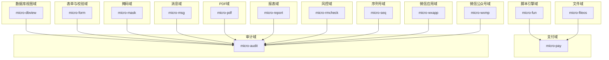
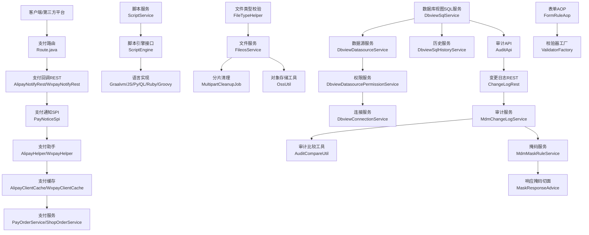
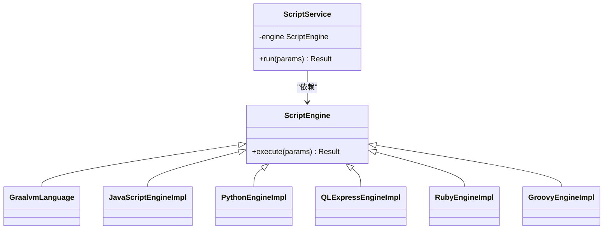
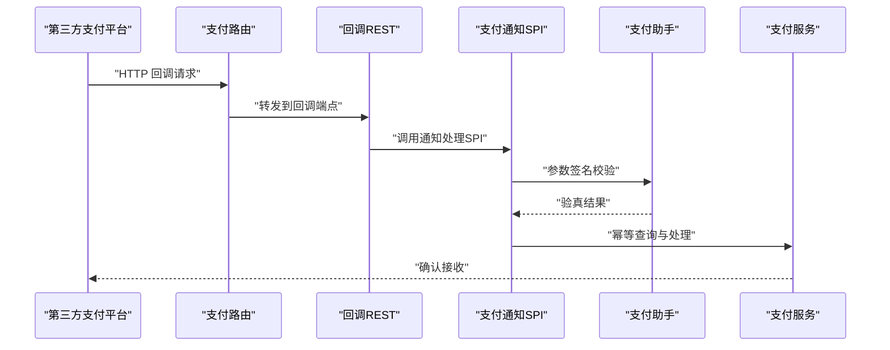
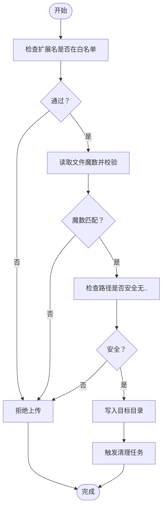
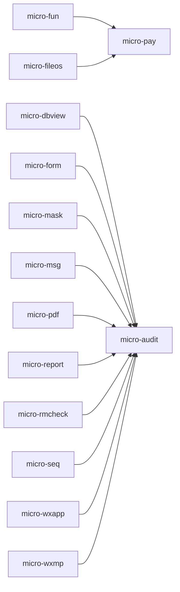

# 安全问题排查

<cite>
**本文引用的文件**
- [security.md](file://docs/standards/security.md)
- [ScriptEngine.java](file://micro-fun/src/main/java/com/wkclz/micro/fun/engine/ScriptEngine.java)
- [ScriptService.java](file://micro-fun/src/main/java/com/wkclz/micro/fun/engine/ScriptService.java)
- [GraalvmLanguage.java](file://micro-fun/src/main/java/com/wkclz/micro/fun/engine/impl/GraalvmLanguage.java)
- [GroovyEngineImpl.java](file://micro-fun/src/main/java/com/wkclz/micro/fun/engine/impl/GroovyEngineImpl.java)
- [JavaScriptEngineImpl.java](file://micro-fun/src/main/java/com/wkclz/micro/fun/engine/impl/JavaScriptEngineImpl.java)
- [PythonEngineImpl.java](file://micro-fun/src/main/java/com/wkclz/micro/fun/engine/impl/PythonEngineImpl.java)
- [QLExpressEngineImpl.java](file://micro-fun/src/main/java/com/wkclz/micro/fun/engine/impl/QLExpressEngineImpl.java)
- [RubyEngineImpl.java](file://micro-fun/src/main/java/com/wkclz/micro/fun/engine/impl/RubyEngineImpl.java)
- [FileTypeHelper.java](file://micro-fileos/src/main/java/com/wkclz/micro/fileos/helper/FileTypeHelper.java)
- [PayNoticeSpi.java](file://micro-pay/src/main/java/com/wkclz/micro/pay/spi/PayNoticeSpi.java)
- [AlipayNotifyRest.java](file://micro-pay/src/main/java/com/wkclz/micro/pay/rest/notify/AlipayNotifyRest.java)
- [WxpayNotifyRest.java](file://micro-pay/src/main/java/com/wkclz/micro/pay/rest/notify/WxpayNotifyRest.java)
- [AlipayHelper.java](file://micro-pay/src/main/java/com/wkclz/micro/pay/helper/AlipayHelper.java)
- [WxpayHelper.java](file://micro-pay/src/main/java/com/wkclz/micro/pay/helper/WxpayHelper.java)
- [AlipayClientCache.java](file://micro-pay/src/main/java/com/wkclz/micro/pay/cache/AlipayClientCache.java)
- [WxpayClientCache.java](file://micro-pay/src/main/java/com/wkclz/micro/pay/cache/WxpayClientCache.java)
- [PayOrderService.java](file://micro-pay/src/main/java/com/wkclz/micro/pay/service/PayOrderService.java)
- [ShopOrderService.java](file://micro-pay/src/main/java/com/wkclz/micro/pay/service/ShopOrderService.java)
- [Route.java](file://micro-pay/src/main/java/com/wkclz/micro/pay/rest/Route.java)
- [FileosConstant.java](file://micro-fileos/src/main/java/com/wkclz/micro/fileos/bean/FileosConstant.java)
- [FileosService.java](file://micro-fileos/src/main/java/com/wkclz/micro/fileos/service/FileosService.java)
- [MdmFileosRecordMapper.java](file://micro-fileos/src/main/java/com/wkclz/micro/fileos/mapper/MdmFileosRecordMapper.java)
- [MultipartCleanupJob.java](file://micro-fileos/src/main/java/com/wkclz/micro/fileos/job/MultipartCleanupJob.java)
- [FileHashHelper.java](file://micro-fileos/src/main/java/com/wkclz/micro/fileos/helper/FileHashHelper.java)
- [DirectoryHelper.java](file://micro-fileos/src/main/java/com/wkclz/micro/fileos/helper/DirectoryHelper.java)
- [PathHelper.java](file://micro-fileos/src/main/java/com/wkclz/micro/fileos/helper/PathHelper.java)
- [OssUtil.java](file://micro-fileos/src/main/java/com/wkclz/micro/fileos/utils/OssUtil.java)
- [DbviewSqlService.java](file://micro-dbview/src/main/java/com/wkclz/micro/dbview/service/DbviewSqlService.java)
- [DbviewDatasourceService.java](file://micro-dbview/src/main/java/com/wkclz/micro/dbview/service/DbviewDatasourceService.java)
- [DbviewDatasourcePermissionService.java](file://micro-dbview/src/main/java/com/wkclz/micro/dbview/service/DbviewDatasourcePermissionService.java)
- [DbviewConnectionService.java](file://micro-dbview/src/main/java/com/wkclz/micro/dbview/service/DbviewConnectionService.java)
- [DbviewSqlHistoryService.java](file://micro-dbview/src/main/java/com/wkclz/micro/dbview/service/DbviewSqlHistoryService.java)
- [DbviewConfig.java](file://micro-dbview/src/main/java/com/wkclz/micro/dbview/config/DbviewConfig.java)
- [DbviewDataSourceFactory.java](file://micro-dbview/src/main/java/com/wkclz/micro/dbview/config/DbviewDataSourceFactory.java)
- [MdmChangeLogMapper.java](file://micro-audit/src/main/java/com/wkclz/micro/audit/mapper/MdmChangeLogMapper.java)
- [AuditApi.java](file://micro-audit/src/main/java/com/wkclz/micro/audit/api/AuditApi.java)
- [ChangeLogRest.java](file://micro-audit/src/main/java/com/wkclz/micro/audit/rest/ChangeLogRest.java)
- [MdmChangeLogService.java](file://micro-audit/src/main/java/com/wkclz/micro/audit/service/MdmChangeLogService.java)
- [AuditCompareUtil.java](file://micro-audit/src/main/java/com/wkclz/micro/audit/utils/AuditCompareUtil.java)
- [FormRuleAop.java](file://micro-form/src/main/java/com/wkclz/micro/form/aop/FormRuleAop.java)
- [IValidator.java](file://micro-form/src/main/java/com/wkclz/micro/form/validator/IValidator.java)
- [ValidatorFactory.java](file://micro-form/src/main/java/com/wkclz/micro/form/validator/ValidatorFactory.java)
- [MdmFormRuleService.java](file://micro-form/src/main/java/com/wkclz/micro/form/service/MdmFormRuleService.java)
- [MdmFormItemService.java](file://micro-form/src/main/java/com/wkclz/micro/form/service/MdmFormItemService.java)
- [MdmFormRuleFieldService.java](file://micro-form/src/main/java/com/wkclz/micro/form/service/MdmFormRuleFieldService.java)
- [MdmFormRuleFieldValidatorService.java](file://micro-form/src/main/java/com/wkclz/micro/form/service/MdmFormRuleFieldValidatorService.java)
- [MdmFormRuleValidatorTemplateService.java](file://micro-form/src/main/java/com/wkclz/micro/form/service/MdmFormRuleValidatorTemplateService.java)
- [MdmMaskRuleService.java](file://micro-mask/src/main/java/com/wkclz/micro/mask/service/MdmMaskRuleService.java)
- [MaskResponseAdvice.java](file://micro-mask/src/main/java/com/wkclz/micro/mask/config/MaskResponseAdvice.java)
- [MdmMaskRuleMapper.java](file://micro-mask/src/main/java/com/wkclz/micro/mask/mapper/MdmMaskRuleMapper.java)
- [MsgApi.java](file://micro-msg/src/main/java/com/wkclz/micro/msg/api/MsgApi.java)
- [MsgNotificationService.java](file://micro-msg/src/main/java/com/wkclz/micro/msg/service/MsgNotificationService.java)
- [MsgTemplateService.java](file://micro-msg/src/main/java/com/wkclz/micro/msg/service/MsgTemplateService.java)
- [MsgUserRecordService.java](file://micro-msg/src/main/java/com/wkclz/micro/msg/service/MsgUserRecordService.java)
- [MsgUserSettingsService.java](file://micro-msg/src/main/java/com/wkclz/micro/msg/service/MsgUserSettingsService.java)
- [PdfApi.java](file://micro-pdf/src/main/java/com/wkclz/micro/pdf/api/PdfApi.java)
- [MdmPdfTemplateService.java](file://micro-pdf/src/main/java/com/wkclz/micro/pdf/service/MdmPdfTemplateService.java)
- [PdfHelper.java](file://micro-pdf/src/main/java/com/wkclz/micro/pdf/helper/PdfHelper.java)
- [PdfConfig.java](file://micro-pdf/src/main/java/com/wkclz/micro/pdf/config/PdfConfig.java)
- [ReportExecService.java](file://micro-report/src/main/java/com/wkclz/micro/report/service/ReportExecService.java)
- [ReportDefinitionService.java](file://micro-report/src/main/java/com/wkclz/micro/report/service/ReportDefinitionService.java)
- [ReportDefinitionHisService.java](file://micro-report/src/main/java/com/wkclz/micro/report/service/ReportDefinitionHisService.java)
- [ReportDefinitionParamService.java](file://micro-report/src/main/java/com/wkclz/micro/report/service/ReportDefinitionParamService.java)
- [ReportDefinitionResultService.java](file://micro-report/src/main/java/com/wkclz/micro/report/service/ReportDefinitionResultService.java)
- [ReportExportHelper.java](file://micro-report/src/main/java/com/wkclz/micro/report/helper/ReportExportHelper.java)
- [ReportSqlHelper.java](file://micro-report/src/main/java/com/wkclz/micro/report/helper/ReportSqlHelper.java)
- [RmCheckApi.java](file://micro-rmcheck/src/main/java/com/wkclz/micro/rmcheck/api/RmCheckApi.java)
- [RmCheckRuleService.java](file://micro-rmcheck/src/main/java/com/wkclz/micro/rmcheck/service/RmCheckRuleService.java)
- [RmCheckRuleItemService.java](file://micro-rmcheck/src/main/java/com/wkclz/micro/rmcheck/service/RmCheckRuleItemService.java)
- [SeqApi.java](file://micro-seq/src/main/java/com/wkclz/micro/seq/api/SeqApi.java)
- [MdmSequenceMapper.java](file://micro-seq/src/main/java/com/wkclz/micro/seq/mapper/MdmSequenceMapper.java)
- [MicroAppAutoConfig.java](file://micro-wxapp/src/main/java/com/wkclz/micro/wxapp/MicroAppAutoConfig.java)
- [Route.java](file://micro-wxapp/src/main/java/com/wkclz/micro/wxapp/Route.java)
- [WxmpAutoConfig.java](file://micro-wxmp/src/main/java/com/wkclz/micro/wxmp/WxmpAutoConfig.java)
- [Route.java](file://micro-wxmp/src/main/java/com/wkclz/micro/wxmp/Route.java)
</cite>

## 目录
1. [引言](#引言)
2. [项目结构](#项目结构)
3. [核心组件](#核心组件)
4. [架构总览](#架构总览)
5. [详细组件分析](#详细组件分析)
6. [依赖分析](#依赖分析)
7. [性能考虑](#性能考虑)
8. [故障排除指南](#故障排除指南)
9. [结论](#结论)
10. [附录](#附录)

## 引言
本文件面向sh-microapp微服务框架的安全运维与开发人员，聚焦于高危安全问题的识别与修复路径，包括远程代码执行（RCE）、SQL注入、支付安全漏洞、敏感信息泄露等。通过对脚本引擎、支付回调、文件类型校验、缓存凭据存储等关键模块进行深入分析，提供可落地的检测方法、修复建议与最佳实践，并给出安全扫描工具使用指南与应急响应策略，帮助团队构建安全可靠的微服务系统。

## 项目结构
sh-microapp采用多模块架构，围绕“功能域+能力层”组织，典型模块包括：支付（micro-pay）、文件存储（micro-fileos）、函数脚本引擎（micro-fun）、数据库视图（micro-dbview）、表单与校验（micro-form）、审计（micro-audit）、掩码（micro-mask）、消息（micro-msg）、PDF（micro-pdf）、报表（micro-report）、风控检查（micro-rmcheck）、序列号（micro-seq）、微信应用（micro-wxapp）、微信公众号（micro-wxmp）等。各模块职责清晰，耦合度适中，便于按域实施安全加固。

## 核心组件
本节聚焦与安全密切相关的核心组件与接口，梳理其职责、输入输出与潜在风险点，为后续章节提供基础。

- 脚本引擎与执行
  - 接口与实现：ScriptEngine、ScriptService及多种语言实现（GraalVM、Groovy、JavaScript、Python、QLExpress、Ruby），用于动态执行用户或业务脚本。
  - 风险关注：隔离性、沙箱限制、输入校验、权限控制、资源消耗。
  - 关联文件：[ScriptEngine.java](file://micro-fun/src/main/java/com/wkclz/micro/fun/engine/ScriptEngine.java)，[ScriptService.java](file://micro-fun/src/main/java/com/wkclz/micro/fun/engine/ScriptService.java)，[GraalvmLanguage.java](file://micro-fun/src/main/java/com/wkclz/micro/fun/engine/impl/GraalvmLanguage.java)，[GroovyEngineImpl.java](file://micro-fun/src/main/java/com/wkclz/micro/fun/engine/impl/GroovyEngineImpl.java)，[JavaScriptEngineImpl.java](file://micro-fun/src/main/java/com/wkclz/micro/fun/engine/impl/JavaScriptEngineImpl.java)，[PythonEngineImpl.java](file://micro-fun/src/main/java/com/wkclz/micro/fun/engine/impl/PythonEngineImpl.java)，[QLExpressEngineImpl.java](file://micro-fun/src/main/java/com/wkclz/micro/fun/engine/impl/QLExpressEngineImpl.java)，[RubyEngineImpl.java](file://micro-fun/src/main/java/com/wkclz/micro/fun/engine/impl/RubyEngineImpl.java)

- 支付回调与配置
  - 回调入口：AlipayNotifyRest、WxpayNotifyRest；SPI接口PayNoticeSpi定义支付通知处理规范。
  - 配置与校验：AlipayHelper、WxpayHelper负责参数签名校验与验真；AlipayClientCache、WxpayClientCache缓存客户端实例。
  - 风险关注：回调签名校验、重放攻击防护、参数完整性、幂等处理、敏感信息保护。
  - 关联文件：[PayNoticeSpi.java](file://micro-pay/src/main/java/com/wkclz/micro/pay/spi/PayNoticeSpi.java)，[AlipayNotifyRest.java](file://micro-pay/src/main/java/com/wkclz/micro/pay/rest/notify/AlipayNotifyRest.java)，[WxpayNotifyRest.java](file://micro-pay/src/main/java/com/wkclz/micro/pay/rest/notify/WxpayNotifyRest.java)，[AlipayHelper.java](file://micro-pay/src/main/java/com/wkclz/micro/pay/helper/AlipayHelper.java)，[WxpayHelper.java](file://micro-pay/src/main/java/com/wkclz/micro/pay/helper/WxpayHelper.java)，[AlipayClientCache.java](file://micro-pay/src/main/java/com/wkclz/micro/pay/cache/AlipayClientCache.java)，[WxpayClientCache.java](file://micro-pay/src/main/java/com/wkclz/micro/pay/cache/WxpayClientCache.java)

- 文件类型校验与存储
  - 类型校验：FileTypeHelper对上传文件类型进行白名单/黑名单判定。
  - 存储与清理：FileosService、MultipartCleanupJob、OssUtil等负责分片清理、哈希校验、路径与目录管理。
  - 风险关注：类型绕过、路径穿越、临时文件清理、哈希碰撞、对象存储凭证暴露。
  - 关联文件：[FileTypeHelper.java](file://micro-fileos/src/main/java/com/wkclz/micro/fileos/helper/FileTypeHelper.java)，[FileosService.java](file://micro-fileos/src/main/java/com/wkclz/micro/fileos/service/FileosService.java)，[MultipartCleanupJob.java](file://micro-fileos/src/main/java/com/wkclz/micro/fileos/job/MultipartCleanupJob.java)，[FileHashHelper.java](file://micro-fileos/src/main/java/com/wkclz/micro/fileos/helper/FileHashHelper.java)，[DirectoryHelper.java](file://micro-fileos/src/main/java/com/wkclz/micro/fileos/helper/DirectoryHelper.java)，[PathHelper.java](file://micro-fileos/src/main/java/com/wkclz/micro/fileos/helper/PathHelper.java)，[OssUtil.java](file://micro-fileos/src/main/java/com/wkclz/micro/fileos/utils/OssUtil.java)，[FileosConstant.java](file://micro-fileos/src/main/java/com/wkclz/micro/fileos/bean/FileosConstant.java)

- 数据库视图与审计
  - 视图访问：DbviewSqlService、DbviewDatasourceService、DbviewDatasourcePermissionService、DbviewConnectionService、DbviewSqlHistoryService。
  - 审计：AuditApi、ChangeLogRest、MdmChangeLogService、AuditCompareUtil。
  - 风险关注：越权访问、SQL注入、历史记录篡改、敏感字段泄露。
  - 关联文件：[DbviewSqlService.java](file://micro-dbview/src/main/java/com/wkclz/micro/dbview/service/DbviewSqlService.java)，[DbviewDatasourceService.java](file://micro-dbview/src/main/java/com/wkclz/micro/dbview/service/DbviewDatasourceService.java)，[DbviewDatasourcePermissionService.java](file://micro-dbview/src/main/java/com/wkclz/micro/dbview/service/DbviewDatasourcePermissionService.java)，[DbviewConnectionService.java](file://micro-dbview/src/main/java/com/wkclz/micro/dbview/service/DbviewConnectionService.java)，[DbviewSqlHistoryService.java](file://micro-dbview/src/main/java/com/wkclz/micro/dbview/service/DbviewSqlHistoryService.java)，[MdmChangeLogMapper.java](file://micro-audit/src/main/java/com/wkclz/micro/audit/mapper/MdmChangeLogMapper.java)，[AuditApi.java](file://micro-audit/src/main/java/com/wkclz/micro/audit/api/AuditApi.java)，[ChangeLogRest.java](file://micro-audit/src/main/java/com/wkclz/micro/audit/rest/ChangeLogRest.java)，[MdmChangeLogService.java](file://micro-audit/src/main/java/com/wkclz/micro/audit/service/MdmChangeLogService.java)，[AuditCompareUtil.java](file://micro-audit/src/main/java/com/wkclz/micro/audit/utils/AuditCompareUtil.java)

- 表单与校验
  - 校验链：FormRuleAop、IValidator、ValidatorFactory及多个规则服务。
  - 风险关注：规则绕过、参数篡改、逻辑错误导致的业务异常。
  - 关联文件：[FormRuleAop.java](file://micro-form/src/main/java/com/wkclz/micro/form/aop/FormRuleAop.java)，[IValidator.java](file://micro-form/src/main/java/com/wkclz/micro/form/validator/IValidator.java)，[ValidatorFactory.java](file://micro-form/src/main/java/com/wkclz/micro/form/validator/ValidatorFactory.java)，[MdmFormRuleService.java](file://micro-form/src/main/java/com/wkclz/micro/form/service/MdmFormRuleService.java)，[MdmFormItemService.java](file://micro-form/src/main/java/com/wkclz/micro/form/service/MdmFormItemService.java)，[MdmFormRuleFieldService.java](file://micro-form/src/main/java/com/wkclz/micro/form/service/MdmFormRuleFieldService.java)，[MdmFormRuleFieldValidatorService.java](file://micro-form/src/main/java/com/wkclz/micro/form/service/MdmFormRuleFieldValidatorService.java)，[MdmFormRuleValidatorTemplateService.java](file://micro-form/src/main/java/com/wkclz/micro/form/service/MdmFormRuleValidatorTemplateService.java)

- 掩码与敏感信息处理
  - 掩码：MdmMaskRuleService、MaskResponseAdvice、MdmMaskRuleMapper。
  - 风险关注：敏感信息泄露、响应体未掩码、规则不生效。
  - 关联文件：[MdmMaskRuleService.java](file://micro-mask/src/main/java/com/wkclz/micro/mask/service/MdmMaskRuleService.java)，[MaskResponseAdvice.java](file://micro-mask/src/main/java/com/wkclz/micro/mask/config/MaskResponseAdvice.java)，[MdmMaskRuleMapper.java](file://micro-mask/src/main/java/com/wkclz/micro/mask/mapper/MdmMaskRuleMapper.java)

- 其他域（消息、PDF、报表、风控、序列号、微信应用与公众号）
  - 风险关注：消息模板与用户记录的数据安全、PDF模板与导出流程、报表SQL与参数、风控规则、序列号生成、微信接口回调与配置。
  - 关联文件：[MsgApi.java](file://micro-msg/src/main/java/com/wkclz/micro/msg/api/MsgApi.java)，[MsgNotificationService.java](file://micro-msg/src/main/java/com/wkclz/micro/msg/service/MsgNotificationService.java)，[MsgTemplateService.java](file://micro-msg/src/main/java/com/wkclz/micro/msg/service/MsgTemplateService.java)，[MsgUserRecordService.java](file://micro-msg/src/main/java/com/wkclz/micro/msg/service/MsgUserRecordService.java)，[MsgUserSettingsService.java](file://micro-msg/src/main/java/com/wkclz/micro/msg/service/MsgUserSettingsService.java)，[PdfApi.java](file://micro-pdf/src/main/java/com/wkclz/micro/pdf/api/PdfApi.java)，[MdmPdfTemplateService.java](file://micro-pdf/src/main/java/com/wkclz/micro/pdf/service/MdmPdfTemplateService.java)，[PdfHelper.java](file://micro-pdf/src/main/java/com/wkclz/micro/pdf/helper/PdfHelper.java)，[PdfConfig.java](file://micro-pdf/src/main/java/com/wkclz/micro/pdf/config/PdfConfig.java)，[ReportExecService.java](file://micro-report/src/main/java/com/wkclz/micro/report/service/ReportExecService.java)，[ReportDefinitionService.java](file://micro-report/src/main/java/com/wkclz/micro/report/service/ReportDefinitionService.java)，[ReportDefinitionHisService.java](file://micro-report/src/main/java/com/wkclz/micro/report/service/ReportDefinitionHisService.java)，[ReportDefinitionParamService.java](file://micro-report/src/main/java/com/wkclz/micro/report/service/ReportDefinitionParamService.java)，[ReportDefinitionResultService.java](file://micro-report/src/main/java/com/wkclz/micro/report/service/ReportDefinitionResultService.java)，[ReportExportHelper.java](file://micro-report/src/main/java/com/wkclz/micro/report/helper/ReportExportHelper.java)，[ReportSqlHelper.java](file://micro-report/src/main/java/com/wkclz/micro/report/helper/ReportSqlHelper.java)，[RmCheckApi.java](file://micro-rmcheck/src/main/java/com/wkclz/micro/rmcheck/api/RmCheckApi.java)，[RmCheckRuleService.java](file://micro-rmcheck/src/main/java/com/wkclz/micro/rmcheck/service/RmCheckRuleService.java)，[RmCheckRuleItemService.java](file://micro-rmcheck/src/main/java/com/wkclz/micro/rmcheck/service/RmCheckRuleItemService.java)，[SeqApi.java](file://micro-seq/src/main/java/com/wkclz/micro/seq/api/SeqApi.java)，[MdmSequenceMapper.java](file://micro-seq/src/main/java/com/wkclz/micro/seq/mapper/MdmSequenceMapper.java)，[MicroAppAutoConfig.java](file://micro-wxapp/src/main/java/com/wkclz/micro/wxapp/MicroAppAutoConfig.java)，[Route.java](file://micro-wxapp/src/main/java/com/wkclz/micro/wxapp/Route.java)，[WxmpAutoConfig.java](file://micro-wxmp/src/main/java/com/wkclz/micro/wxmp/WxmpAutoConfig.java)，[Route.java](file://micro-wxmp/src/main/java/com/wkclz/micro/wxmp/Route.java)

**章节来源**
- [security.md:1-200](file://docs/standards/security.md#L1-L200)

## 架构总览
下图展示与安全相关的关键交互：脚本引擎作为潜在高风险入口，支付回调作为外部信任边界，文件类型校验与存储作为数据入站/出站控制点，数据库视图与审计作为数据访问与追踪保障，表单与校验作为业务参数治理入口，掩码与敏感信息处理作为数据脱敏与输出控制。

**图表来源**
- [Route.java](file://micro-pay/src/main/java/com/wkclz/micro/pay/rest/Route.java)
- [AlipayNotifyRest.java](file://micro-pay/src/main/java/com/wkclz/micro/pay/rest/notify/AlipayNotifyRest.java)
- [WxpayNotifyRest.java](file://micro-pay/src/main/java/com/wkclz/micro/pay/rest/notify/WxpayNotifyRest.java)
- [PayNoticeSpi.java](file://micro-pay/src/main/java/com/wkclz/micro/pay/spi/PayNoticeSpi.java)
- [AlipayHelper.java](file://micro-pay/src/main/java/com/wkclz/micro/pay/helper/AlipayHelper.java)
- [WxpayHelper.java](file://micro-pay/src/main/java/com/wkclz/micro/pay/helper/WxpayHelper.java)
- [AlipayClientCache.java](file://micro-pay/src/main/java/com/wkclz/micro/pay/cache/AlipayClientCache.java)
- [WxpayClientCache.java](file://micro-pay/src/main/java/com/wkclz/micro/pay/cache/WxpayClientCache.java)
- [PayOrderService.java](file://micro-pay/src/main/java/com/wkclz/micro/pay/service/PayOrderService.java)
- [ShopOrderService.java](file://micro-pay/src/main/java/com/wkclz/micro/pay/service/ShopOrderService.java)
- [ScriptService.java](file://micro-fun/src/main/java/com/wkclz/micro/fun/engine/ScriptService.java)
- [ScriptEngine.java](file://micro-fun/src/main/java/com/wkclz/micro/fun/engine/ScriptEngine.java)
- [GraalvmLanguage.java](file://micro-fun/src/main/java/com/wkclz/micro/fun/engine/impl/GraalvmLanguage.java)
- [JavaScriptEngineImpl.java](file://micro-fun/src/main/java/com/wkclz/micro/fun/engine/impl/JavaScriptEngineImpl.java)
- [PythonEngineImpl.java](file://micro-fun/src/main/java/com/wkclz/micro/fun/engine/impl/PythonEngineImpl.java)
- [QLExpressEngineImpl.java](file://micro-fun/src/main/java/com/wkclz/micro/fun/engine/impl/QLExpressEngineImpl.java)
- [RubyEngineImpl.java](file://micro-fun/src/main/java/com/wkclz/micro/fun/engine/impl/RubyEngineImpl.java)
- [GroovyEngineImpl.java](file://micro-fun/src/main/java/com/wkclz/micro/fun/engine/impl/GroovyEngineImpl.java)
- [FileTypeHelper.java](file://micro-fileos/src/main/java/com/wkclz/micro/fileos/helper/FileTypeHelper.java)
- [FileosService.java](file://micro-fileos/src/main/java/com/wkclz/micro/fileos/service/FileosService.java)
- [MultipartCleanupJob.java](file://micro-fileos/src/main/java/com/wkclz/micro/fileos/job/MultipartCleanupJob.java)
- [OssUtil.java](file://micro-fileos/src/main/java/com/wkclz/micro/fileos/utils/OssUtil.java)
- [DbviewSqlService.java](file://micro-dbview/src/main/java/com/wkclz/micro/dbview/service/DbviewSqlService.java)
- [DbviewDatasourceService.java](file://micro-dbview/src/main/java/com/wkclz/micro/dbview/service/DbviewDatasourceService.java)
- [DbviewDatasourcePermissionService.java](file://micro-dbview/src/main/java/com/wkclz/micro/dbview/service/DbviewDatasourcePermissionService.java)
- [DbviewConnectionService.java](file://micro-dbview/src/main/java/com/wkclz/micro/dbview/service/DbviewConnectionService.java)
- [DbviewSqlHistoryService.java](file://micro-dbview/src/main/java/com/wkclz/micro/dbview/service/DbviewSqlHistoryService.java)
- [AuditApi.java](file://micro-audit/src/main/java/com/wkclz/micro/audit/api/AuditApi.java)
- [ChangeLogRest.java](file://micro-audit/src/main/java/com/wkclz/micro/audit/rest/ChangeLogRest.java)
- [MdmChangeLogService.java](file://micro-audit/src/main/java/com/wkclz/micro/audit/service/MdmChangeLogService.java)
- [AuditCompareUtil.java](file://micro-audit/src/main/java/com/wkclz/micro/audit/utils/AuditCompareUtil.java)
- [FormRuleAop.java](file://micro-form/src/main/java/com/wkclz/micro/form/aop/FormRuleAop.java)
- [ValidatorFactory.java](file://micro-form/src/main/java/com/wkclz/micro/form/validator/ValidatorFactory.java)
- [MdmMaskRuleService.java](file://micro-mask/src/main/java/com/wkclz/micro/mask/service/MdmMaskRuleService.java)
- [MaskResponseAdvice.java](file://micro-mask/src/main/java/com/wkclz/micro/mask/config/MaskResponseAdvice.java)

## 详细组件分析

### 脚本引擎安全风险排查
- 风险识别
  - 动态执行用户脚本存在RCE风险，需严格限制语言能力、IO与系统调用。
  - 多语言实现（GraalVM、JS、Python、QL、Ruby、Groovy）均应启用沙箱与资源限制。
  - 输入参数未校验可能导致任意代码执行或越权操作。
- 检测方法
  - 代码审计：检查ScriptService对输入参数的过滤与白名单机制。
  - 运行时监控：观察脚本执行时间、内存占用、文件/网络访问行为。
  - 渗透测试：构造恶意输入，验证是否能执行系统命令或访问受限资源。
- 修复建议
  - 实施最小权限原则：禁用文件系统、网络、进程创建等高危API。
  - 启用沙箱：优先使用GraalVM等具备内置隔离能力的语言实现。
  - 参数白名单：仅允许受控变量与函数参与计算。
  - 资源配额：设置CPU/内存/执行时长上限，超限立即终止。
  - 日志与告警：记录脚本执行上下文与结果，异常触发告警。
- 应急响应
  - 立即回滚脚本引擎版本或关闭相关开关。
  - 全量审计脚本调用日志，定位异常执行轨迹。
  - 临时封禁高危语言实现，待修复后解封。

**图表来源**
- [ScriptEngine.java](file://micro-fun/src/main/java/com/wkclz/micro/fun/engine/ScriptEngine.java)
- [ScriptService.java](file://micro-fun/src/main/java/com/wkclz/micro/fun/engine/ScriptService.java)
- [GraalvmLanguage.java](file://micro-fun/src/main/java/com/wkclz/micro/fun/engine/impl/GraalvmLanguage.java)
- [JavaScriptEngineImpl.java](file://micro-fun/src/main/java/com/wkclz/micro/fun/engine/impl/JavaScriptEngineImpl.java)
- [PythonEngineImpl.java](file://micro-fun/src/main/java/com/wkclz/micro/fun/engine/impl/PythonEngineImpl.java)
- [QLExpressEngineImpl.java](file://micro-fun/src/main/java/com/wkclz/micro/fun/engine/impl/QLExpressEngineImpl.java)
- [RubyEngineImpl.java](file://micro-fun/src/main/java/com/wkclz/micro/fun/engine/impl/RubyEngineImpl.java)
- [GroovyEngineImpl.java](file://micro-fun/src/main/java/com/wkclz/micro/fun/engine/impl/GroovyEngineImpl.java)

**章节来源**
- [ScriptEngine.java:1-200](file://micro-fun/src/main/java/com/wkclz/micro/fun/engine/ScriptEngine.java#L1-L200)
- [ScriptService.java:1-200](file://micro-fun/src/main/java/com/wkclz/micro/fun/engine/ScriptService.java#L1-L200)
- [GraalvmLanguage.java:1-200](file://micro-fun/src/main/java/com/wkclz/micro/fun/engine/impl/GraalvmLanguage.java#L1-L200)
- [JavaScriptEngineImpl.java:1-200](file://micro-fun/src/main/java/com/wkclz/micro/fun/engine/impl/JavaScriptEngineImpl.java#L1-L200)
- [PythonEngineImpl.java:1-200](file://micro-fun/src/main/java/com/wkclz/micro/fun/engine/impl/PythonEngineImpl.java#L1-L200)
- [QLExpressEngineImpl.java:1-200](file://micro-fun/src/main/java/com/wkclz/micro/fun/engine/impl/QLExpressEngineImpl.java#L1-L200)
- [RubyEngineImpl.java:1-200](file://micro-fun/src/main/java/com/wkclz/micro/fun/engine/impl/RubyEngineImpl.java#L1-L200)
- [GroovyEngineImpl.java:1-200](file://micro-fun/src/main/java/com/wkclz/micro/fun/engine/impl/GroovyEngineImpl.java#L1-L200)

### 支付回调验证缺陷排查
- 风险识别
  - 回调未做签名校验或校验不完整，易被伪造或篡改。
  - 重放攻击：未做幂等与去重，导致重复扣款或退款。
  - 敏感信息泄露：回调参数未脱敏或落库不当。
- 检测方法
  - 回放测试：模拟相同回调请求多次，验证幂等性。
  - 参数篡改：修改金额、订单号等关键字段，验证拒绝与告警。
  - 日志审计：核对回调入参、签名值、验真结果与处理状态。
- 修复建议
  - 强制签名校验：AlipayHelper/WxpayHelper必须严格比对签名算法与参数。
  - 幂等设计：以订单号为主键，查询已处理状态，避免重复处理。
  - 限流与风控：对同一商户/订单在短时间内的回调频率进行限制。
  - 敏感信息脱敏：回调参数在日志与响应中进行掩码处理。
- 应急响应
  - 暂停对应渠道回调入口，修复后再启用。
  - 对历史回调进行补验真与补单处理，确保账务一致。
  - 加强监控与告警，发现异常立即阻断。

**图表来源**
- [Route.java](file://micro-pay/src/main/java/com/wkclz/micro/pay/rest/Route.java)
- [AlipayNotifyRest.java](file://micro-pay/src/main/java/com/wkclz/micro/pay/rest/notify/AlipayNotifyRest.java)
- [WxpayNotifyRest.java](file://micro-pay/src/main/java/com/wkclz/micro/pay/rest/notify/WxpayNotifyRest.java)
- [PayNoticeSpi.java](file://micro-pay/src/main/java/com/wkclz/micro/pay/spi/PayNoticeSpi.java)
- [AlipayHelper.java](file://micro-pay/src/main/java/com/wkclz/micro/pay/helper/AlipayHelper.java)
- [WxpayHelper.java](file://micro-pay/src/main/java/com/wkclz/micro/pay/helper/WxpayHelper.java)
- [PayOrderService.java](file://micro-pay/src/main/java/com/wkclz/micro/pay/service/PayOrderService.java)
- [ShopOrderService.java](file://micro-pay/src/main/java/com/wkclz/micro/pay/service/ShopOrderService.java)

**章节来源**
- [AlipayNotifyRest.java:1-200](file://micro-pay/src/main/java/com/wkclz/micro/pay/rest/notify/AlipayNotifyRest.java#L1-L200)
- [WxpayNotifyRest.java:1-200](file://micro-pay/src/main/java/com/wkclz/micro/pay/rest/notify/WxpayNotifyRest.java#L1-L200)
- [PayNoticeSpi.java:1-200](file://micro-pay/src/main/java/com/wkclz/micro/pay/spi/PayNoticeSpi.java#L1-L200)
- [AlipayHelper.java:1-200](file://micro-pay/src/main/java/com/wkclz/micro/pay/helper/AlipayHelper.java#L1-L200)
- [WxpayHelper.java:1-200](file://micro-pay/src/main/java/com/wkclz/micro/pay/helper/WxpayHelper.java#L1-L200)
- [AlipayClientCache.java:1-200](file://micro-pay/src/main/java/com/wkclz/micro/pay/cache/AlipayClientCache.java#L1-L200)
- [WxpayClientCache.java:1-200](file://micro-pay/src/main/java/com/wkclz/micro/pay/cache/WxpayClientCache.java#L1-L200)
- [PayOrderService.java:1-200](file://micro-pay/src/main/java/com/wkclz/micro/pay/service/PayOrderService.java#L1-L200)
- [ShopOrderService.java:1-200](file://micro-pay/src/main/java/com/wkclz/micro/pay/service/ShopOrderService.java#L1-L200)

### 文件类型校验绕过排查
- 风险识别
  - 文件类型校验被绕过，上传恶意脚本或可执行文件。
  - 路径穿越导致写入非预期目录，引发系统级风险。
  - 分片上传未清理或清理不彻底，残留恶意文件。
- 检测方法
  - 批量上传：尝试上传不同扩展名但内容为可执行的文件，验证拦截。
  - MIME/魔数检测：结合文件头与扩展名双重校验。
  - 路径遍历：构造含“../”的文件名，验证写入路径。
  - 清理验证：触发分片清理任务，确认临时文件被移除。
- 修复建议
  - 双重校验：扩展名白名单 + MIME类型 + 文件魔数。
  - 绝对路径：禁止相对路径与特殊字符，统一归档到固定目录。
  - 定期清理：完善MultipartCleanupJob，增加失败重试与清理报告。
  - 权限控制：上传目录仅允许写入，禁止执行权限。
- 应急响应
  - 立即暂停文件上传功能，修复校验逻辑。
  - 全量扫描已上传文件，删除可疑文件。
  - 加强监控与告警，发现异常立即阻断。

**图表来源**
- [FileTypeHelper.java](file://micro-fileos/src/main/java/com/wkclz/micro/fileos/helper/FileTypeHelper.java)
- [FileosService.java](file://micro-fileos/src/main/java/com/wkclz/micro/fileos/service/FileosService.java)
- [MultipartCleanupJob.java](file://micro-fileos/src/main/java/com/wkclz/micro/fileos/job/MultipartCleanupJob.java)
- [FileHashHelper.java](file://micro-fileos/src/main/java/com/wkclz/micro/fileos/helper/FileHashHelper.java)
- [DirectoryHelper.java](file://micro-fileos/src/main/java/com/wkclz/micro/fileos/helper/DirectoryHelper.java)
- [PathHelper.java](file://micro-fileos/src/main/java/com/wkclz/micro/fileos/helper/PathHelper.java)
- [OssUtil.java](file://micro-fileos/src/main/java/com/wkclz/micro/fileos/utils/OssUtil.java)
- [FileosConstant.java](file://micro-fileos/src/main/java/com/wkclz/micro/fileos/bean/FileosConstant.java)

**章节来源**
- [FileTypeHelper.java:1-200](file://micro-fileos/src/main/java/com/wkclz/micro/fileos/helper/FileTypeHelper.java#L1-L200)
- [FileosService.java:1-200](file://micro-fileos/src/main/java/com/wkclz/micro/fileos/service/FileosService.java#L1-L200)
- [MultipartCleanupJob.java:1-200](file://micro-fileos/src/main/java/com/wkclz/micro/fileos/job/MultipartCleanupJob.java#L1-L200)
- [FileHashHelper.java:1-200](file://micro-fileos/src/main/java/com/wkclz/micro/fileos/helper/FileHashHelper.java#L1-L200)
- [DirectoryHelper.java:1-200](file://micro-fileos/src/main/java/com/wkclz/micro/fileos/helper/DirectoryHelper.java#L1-L200)
- [PathHelper.java:1-200](file://micro-fileos/src/main/java/com/wkclz/micro/fileos/helper/PathHelper.java#L1-L200)
- [OssUtil.java:1-200](file://micro-fileos/src/main/java/com/wkclz/micro/fileos/utils/OssUtil.java#L1-L200)
- [FileosConstant.java:1-200](file://micro-fileos/src/main/java/com/wkclz/micro/fileos/bean/FileosConstant.java#L1-L200)

### 缓存凭据明文存储排查
- 风险识别
  - 支付客户端缓存中可能包含敏感配置（如密钥、证书），若未加密存储将造成泄露。
  - 缓存未设置过期或清理策略，长期驻留内存带来风险。
- 检测方法
  - 代码审计：检查AlipayClientCache/WxpayClientCache的初始化与更新逻辑。
  - 内存快照：捕获运行时缓存内容，确认是否存在明文敏感信息。
  - 日志审计：核对缓存写入与读取日志，避免敏感信息外泄。
- 修复建议
  - 加密存储：对敏感配置进行对称加密后入库或缓存。
  - 最小化暴露：仅在必要时加载与使用，使用后及时清空。
  - 设置过期：为缓存项设置合理TTL，定期刷新。
  - 访问控制：限制读取权限，仅授权线程/进程可见。
- 应急响应
  - 立即轮换相关密钥与证书，更新缓存。
  - 清空并重建缓存，重启相关服务以清除内存中的残留数据。

**章节来源**
- [AlipayClientCache.java:1-200](file://micro-pay/src/main/java/com/wkclz/micro/pay/cache/AlipayClientCache.java#L1-L200)
- [WxpayClientCache.java:1-200](file://micro-pay/src/main/java/com/wkclz/micro/pay/cache/WxpayClientCache.java#L1-L200)

### SQL注入排查（数据库视图与审计）
- 风险识别
  - 动态拼接SQL或未参数化查询易被注入，导致数据泄露或破坏。
  - 审计日志与变更记录可能被篡改，影响追踪。
- 检测方法
  - 代码审计：检查DbviewSqlService、MdmChangeLogMapper等是否使用参数化查询。
  - 单元测试：构造注入载荷，验证返回与异常处理。
  - 扫描工具：使用SQL注入扫描器对SQL接口进行自动化检测。
- 修复建议
  - 参数化：所有SQL使用参数绑定，禁止字符串拼接。
  - 白名单：对表名、列名、排序字段进行白名单控制。
  - 权限分离：最小权限原则，避免管理员账户常驻。
  - 审计强化：对关键操作进行二次校验与审批。
- 应急响应
  - 暂停相关SQL接口，修复后灰度发布。
  - 全量审计日志，定位异常SQL与受影响数据。
  - 加强监控与告警，发现异常立即阻断。

**章节来源**
- [DbviewSqlService.java:1-200](file://micro-dbview/src/main/java/com/wkclz/micro/dbview/service/DbviewSqlService.java#L1-L200)
- [DbviewDatasourceService.java:1-200](file://micro-dbview/src/main/java/com/wkclz/micro/dbview/service/DbviewDatasourceService.java#L1-L200)
- [DbviewDatasourcePermissionService.java:1-200](file://micro-dbview/src/main/java/com/wkclz/micro/dbview/service/DbviewDatasourcePermissionService.java#L1-L200)
- [DbviewConnectionService.java:1-200](file://micro-dbview/src/main/java/com/wkclz/micro/dbview/service/DbviewConnectionService.java#L1-L200)
- [DbviewSqlHistoryService.java:1-200](file://micro-dbview/src/main/java/com/wkclz/micro/dbview/service/DbviewSqlHistoryService.java#L1-L200)
- [MdmChangeLogMapper.java:1-200](file://micro-audit/src/main/java/com/wkclz/micro/audit/mapper/MdmChangeLogMapper.java#L1-L200)
- [AuditApi.java:1-200](file://micro-audit/src/main/java/com/wkclz/micro/audit/api/AuditApi.java#L1-L200)
- [ChangeLogRest.java:1-200](file://micro-audit/src/main/java/com/wkclz/micro/audit/rest/ChangeLogRest.java#L1-L200)
- [MdmChangeLogService.java:1-200](file://micro-audit/src/main/java/com/wkclz/micro/audit/service/MdmChangeLogService.java#L1-L200)
- [AuditCompareUtil.java:1-200](file://micro-audit/src/main/java/com/wkclz/micro/audit/utils/AuditCompareUtil.java#L1-L200)

### 表单与校验绕过排查
- 风险识别
  - 表单规则被绕过或校验逻辑存在缺陷，导致非法数据进入系统。
  - AOP校验未覆盖全部场景，部分接口仍可绕过。
- 检测方法
  - 边界测试：构造极端值、空值、超长字符串、特殊字符。
  - 组合攻击：同时修改多个字段，验证整体一致性。
  - 日志审计：核对校验失败与通过的日志，定位薄弱环节。
- 修复建议
  - 完整覆盖：确保所有业务接口均受FormRuleAop保护。
  - 规则强化：引入更严格的正则与长度限制。
  - 多层校验：前端、网关、服务端三层校验协同。
- 应急响应
  - 暂停相关接口，修复校验规则后灰度发布。
  - 全量回溯历史数据，修正异常状态。

**章节来源**
- [FormRuleAop.java:1-200](file://micro-form/src/main/java/com/wkclz/micro/form/aop/FormRuleAop.java#L1-L200)
- [IValidator.java:1-200](file://micro-form/src/main/java/com/wkclz/micro/form/validator/IValidator.java#L1-L200)
- [ValidatorFactory.java:1-200](file://micro-form/src/main/java/com/wkclz/micro/form/validator/ValidatorFactory.java#L1-L200)
- [MdmFormRuleService.java:1-200](file://micro-form/src/main/java/com/wkclz/micro/form/service/MdmFormRuleService.java#L1-L200)
- [MdmFormItemService.java:1-200](file://micro-form/src/main/java/com/wkclz/micro/form/service/MdmFormItemService.java#L1-L200)
- [MdmFormRuleFieldService.java:1-200](file://micro-form/src/main/java/com/wkclz/micro/form/service/MdmFormRuleFieldService.java#L1-L200)
- [MdmFormRuleFieldValidatorService.java:1-200](file://micro-form/src/main/java/com/wkclz/micro/form/service/MdmFormRuleFieldValidatorService.java#L1-L200)
- [MdmFormRuleValidatorTemplateService.java:1-200](file://micro-form/src/main/java/com/wkclz/micro/form/service/MdmFormRuleValidatorTemplateService.java#L1-L200)

### 掩码与敏感信息泄露排查
- 风险识别
  - 响应体未对敏感字段进行掩码，导致信息泄露。
  - 掩码规则不生效或覆盖范围不足。
- 检测方法
  - 接口测试：调用返回敏感信息的接口，验证掩码是否生效。
  - 日志审计：核对日志中敏感字段是否被正确掩码。
- 修复建议
  - 规则完善：基于MdmMaskRuleService配置完整的掩码规则。
  - 切面生效：确保MaskResponseAdvice在所有响应路径上生效。
  - 审计联动：与审计模块联动，记录敏感字段访问与变更。
- 应急响应
  - 立即启用或修复掩码规则，重启服务使切面生效。
  - 全量回溯日志，删除已泄露的敏感信息。

**章节来源**
- [MdmMaskRuleService.java:1-200](file://micro-mask/src/main/java/com/wkclz/micro/mask/service/MdmMaskRuleService.java#L1-L200)
- [MaskResponseAdvice.java:1-200](file://micro-mask/src/main/java/com/wkclz/micro/mask/config/MaskResponseAdvice.java#L1-L200)
- [MdmMaskRuleMapper.java:1-200](file://micro-mask/src/main/java/com/wkclz/micro/mask/mapper/MdmMaskRuleMapper.java#L1-L200)

## 依赖分析
- 组件耦合
  - 支付域依赖脚本引擎（用于复杂业务逻辑）、文件域（用于凭证与附件）、数据库视图（用于审计与报表）。
  - 文件域依赖对象存储工具与清理作业，存在I/O与存储依赖。
  - 审计域贯穿多个模块，形成跨域依赖，需注意一致性与性能。
- 外部依赖
  - 第三方支付SDK、对象存储服务、数据库驱动等，需关注版本安全公告与补丁。
- 潜在循环依赖
  - 当前模块间以接口与服务为主，未见明显循环依赖迹象。

**图表来源**
- [Route.java](file://micro-pay/src/main/java/com/wkclz/micro/pay/rest/Route.java)
- [FileosService.java](file://micro-fileos/src/main/java/com/wkclz/micro/fileos/service/FileosService.java)
- [DbviewSqlService.java](file://micro-dbview/src/main/java/com/wkclz/micro/dbview/service/DbviewSqlService.java)
- [MdmChangeLogService.java](file://micro-audit/src/main/java/com/wkclz/micro/audit/service/MdmChangeLogService.java)

**章节来源**
- [Route.java:1-200](file://micro-pay/src/main/java/com/wkclz/micro/pay/rest/Route.java#L1-L200)
- [FileosService.java:1-200](file://micro-fileos/src/main/java/com/wkclz/micro/fileos/service/FileosService.java#L1-L200)
- [DbviewSqlService.java:1-200](file://micro-dbview/src/main/java/com/wkclz/micro/dbview/service/DbviewSqlService.java#L1-L200)
- [MdmChangeLogService.java:1-200](file://micro-audit/src/main/java/com/wkclz/micro/audit/service/MdmChangeLogService.java#L1-L200)

## 性能考虑
- 脚本引擎
  - 合理设置执行时限与内存上限，避免资源耗尽。
  - 使用缓存语言实现的编译产物，减少冷启动开销。
- 支付回调
  - 异步处理与队列化，降低回调延迟与失败率。
  - 幂等与去重，避免重复处理带来的性能浪费。
- 文件上传
  - 分片上传与断点续传，提升大文件传输稳定性。
  - 清理策略与配额限制，防止磁盘空间被占满。
- 审计与日志
  - 异步写入与批量提交，降低对主业务的影响。
  - 合理裁剪日志字段，避免冗余信息影响性能。

## 故障排除指南
- 常见问题与定位
  - 回调失败：检查签名算法、参数顺序与编码格式。
  - 文件上传失败：检查类型校验、路径与权限、分片清理。
  - 脚本执行异常：检查沙箱配置、资源限制与日志。
  - 审计缺失：检查审计切面是否生效、Mapper是否正确映射。
- 工具与手段
  - 日志分析：集中式日志平台聚合各模块日志，快速定位异常。
  - 监控告警：对关键指标（QPS、错误率、执行时长、内存）设置阈值告警。
  - 安全扫描：使用OWASP ZAP、Nessus等工具进行自动化扫描。
  - 回放测试：对高风险接口进行回放与压力测试。
- 应急处置
  - 快速降级：对高风险功能进行临时关闭或只读。
  - 全量审计：对历史数据进行一致性检查与修正。
  - 修复验证：灰度发布后持续监控，确认问题解决。

**章节来源**
- [security.md:1-200](file://docs/standards/security.md#L1-L200)

## 结论
通过对脚本引擎、支付回调、文件类型校验、缓存凭据存储、SQL注入、表单校验与敏感信息掩码等关键领域的深入排查，本文件提供了可操作的检测方法、修复建议与应急响应策略。建议团队将安全纳入CI/CD流程，持续进行自动化扫描与渗透测试，建立完善的监控与告警体系，确保微服务系统的安全性与稳定性。

## 附录
- 安全扫描工具使用建议
  - OWASP ZAP：用于Web应用安全扫描，支持自动爬取与手动测试。
  - Nessus：用于主机与网络层面的漏洞扫描。
  - SAST工具：在构建阶段集成静态代码分析，提前发现安全问题。
  - DAST工具：在部署后进行动态测试，模拟真实攻击场景。
- 最佳实践清单
  - 输入校验与参数化查询
  - 最小权限与最小暴露
  - 加密存储与传输
  - 审计与日志脱敏
  - 幂等与重放防护
  - 沙箱与资源限制
  - 定期轮换与清理
  - 建立应急响应预案