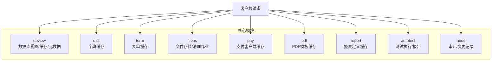
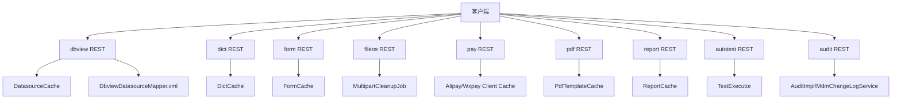
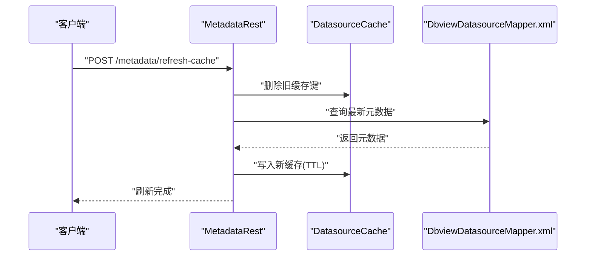
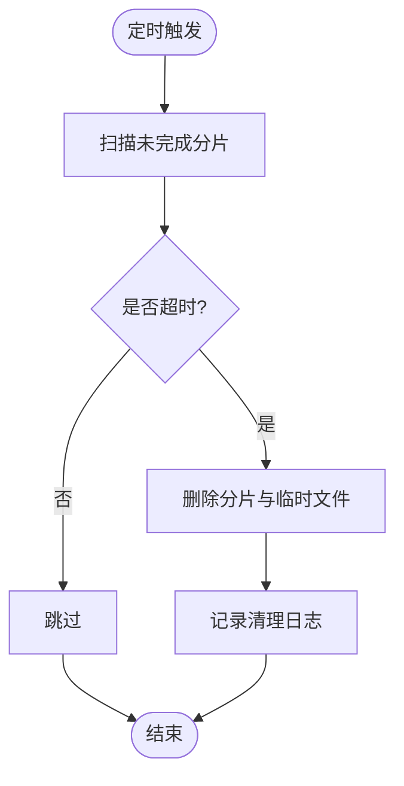
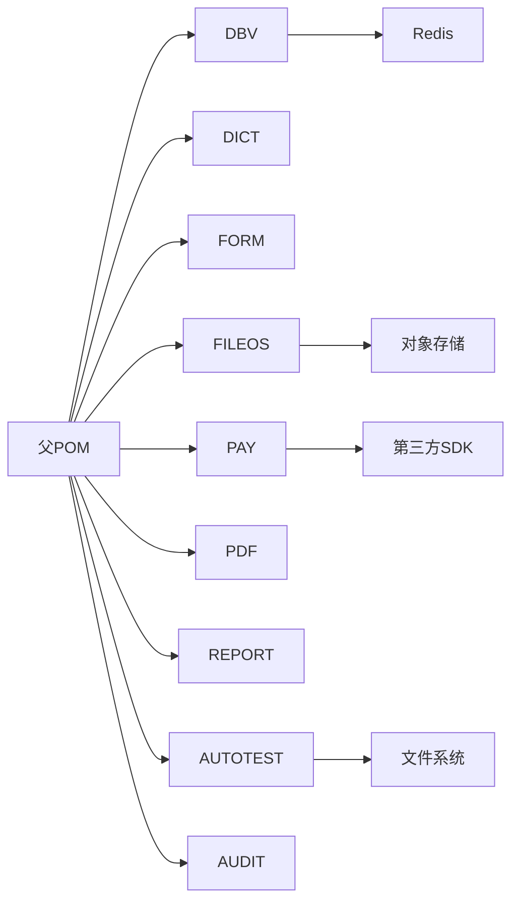

# 性能问题排查

<cite>
**本文引用的文件**
- [pom.xml](file://pom.xml)
- [micro-dbview/src/main/java/com/wkclz/micro/dbview/cache/DatasourceCache.java](file://micro-dbview/src/main/java/com/wkclz/micro/dbview/cache/DatasourceCache.java)
- [micro-dbview/src/main/java/com/wkclz/micro/dbview/config/DbviewConfig.java](file://micro-dbview/src/main/java/com/wkclz/micro/dbview/config/DbviewConfig.java)
- [micro-dbview/src/main/java/com/wkclz/micro/dbview/rest/MetadataRest.java](file://micro-dbview/src/main/java/com/wkclz/micro/dbview/rest/MetadataRest.java)
- [micro-dbview/src/main/resources/mapper/DbviewDatasourceMapper.xml](file://micro-dbview/src/main/resources/mapper/DbviewDatasourceMapper.xml)
- [micro-dict/src/main/java/com/wkclz/micro/dict/cache/DictCache.java](file://micro-dict/src/main/java/com/wkclz/micro/dict/cache/DictCache.java)
- [micro-dict/src/main/resources/mapper/MdmDictMapper.xml](file://micro-dict/src/main/resources/mapper/MdmDictMapper.xml)
- [micro-form/src/main/java/com/wkclz/micro/form/cache/FormCache.java](file://micro-form/src/main/java/com/wkclz/micro/form/cache/FormCache.java)
- [micro-form/src/main/resources/mapper/MdmFormMapper.xml](file://micro-form/src/main/resources/mapper/MdmFormMapper.xml)
- [micro-fileos/src/main/java/com/wkclz/micro/fileos/cache/BucketCache.java](file://micro-fileos/src/main/java/com/wkclz/micro/fileos/cache/BucketCache.java)
- [micro-fileos/src/main/java/com/wkclz/micro/fileos/job/MultipartCleanupJob.java](file://micro-fileos/src/main/java/com/wkclz/micro/fileos/job/MultipartCleanupJob.java)
- [micro-pay/src/main/java/com/wkclz/micro/pay/cache/AlipayClientCache.java](file://micro-pay/src/main/java/com/wkclz/micro/pay/cache/AlipayClientCache.java)
- [micro-pay/src/main/java/com/wkclz/micro/pay/cache/WxpayClientCache.java](file://micro-pay/src/main/java/com/wkclz/micro/pay/cache/WxpayClientCache.java)
- [micro-pdf/src/main/java/com/wkclz/micro/pdf/cache/PdfTemplateCache.java](file://micro-pdf/src/main/java/com/wkclz/micro/pdf/cache/PdfTemplateCache.java)
- [micro-report/src/main/java/com/wkclz/micro/report/cache/ReportCache.java](file://micro-report/src/main/java/com/wkclz/micro/report/cache/ReportCache.java)
- [micro-report/src/main/resources/mapper/ReportDefinitionMapper.xml](file://micro-report/src/main/resources/mapper/ReportDefinitionMapper.xml)
- [micro-autotest/src/main/java/com/wkclz/auto/report/ReportGenerator.java](file://micro-autotest/src/main/java/com/wkclz/auto/report/ReportGenerator.java)
- [micro-autotest/src/main/java/com/wkclz/auto/executor/TestExecutor.java](file://micro-autotest/src/main/java/com/wkclz/auto/executor/TestExecutor.java)
- [micro-autotest/src/main/java/com/wkclz/auto/mock/AutoMockBeanPostProcessor.java](file://micro-autotest/src/main/java/com/wkclz/auto/mock/AutoMockBeanPostProcessor.java)
- [micro-autotest/src/main/java/com/wkclz/auto/mock/MockHelper.java](file://micro-autotest/src/main/java/com/wkclz/auto/mock/MockHelper.java)
- [micro-audit/src/main/java/com/wkclz/micro/audit/api/impl/AuditImpl.java](file://micro-audit/src/main/java/com/wkclz/micro/audit/api/impl/AuditImpl.java)
- [micro-audit/src/main/java/com/wkclz/micro/audit/service/MdmChangeLogService.java](file://micro-audit/src/main/java/com/wkclz/micro/audit/service/MdmChangeLogService.java)
- [micro-audit/src/main/java/com/wkclz/micro/audit/utils/AuditCompareUtil.java](file://micro-audit/src/main/java/com/wkclz/micro/audit/utils/AuditCompareUtil.java)
</cite>

## 目录
1. 引言
2. 项目结构
3. 核心组件
4. 架构总览
5. 详细组件分析
6. 依赖分析
7. 性能考量
8. 故障排查指南
9. 结论
10. 附录

## 引言
本文件面向sh-microapp微服务框架的性能问题排查与优化，聚焦于CPU使用率过高、内存泄漏、数据库查询缓慢、并发处理能力不足等常见瓶颈。文档结合仓库中实际模块（如dbview、dict、form、fileos、pay、pdf、report、autotest、audit等）的代码组织与配置，给出可落地的诊断步骤、指标观测点、工具使用建议与优化实践，帮助开发者快速定位问题并提升系统整体性能。

## 项目结构
- 采用多模块架构，每个功能域独立为一个子模块，便于按需扩展与性能隔离。
- 典型模块职责：
  - dbview：数据库连接与元数据管理，涉及缓存与SQL执行。
  - dict/form/pdf/report：以缓存为主的数据查询模块。
  - fileos：文件存储与清理作业，关注IO与定时任务。
  - pay：第三方支付客户端缓存，关注外部调用延迟。
  - autotest：测试执行与报告生成，关注并发与资源占用。
  - audit：审计与变更记录，关注写入与比较开销。

章节来源
- [pom.xml:1-200](file://pom.xml#L1-L200)

## 核心组件
- 缓存层：dbview、dict、form、pdf、report、fileos等模块均存在本地或Redis缓存，用于降低数据库压力与提升响应速度。
- SQL映射：各模块通过MyBatis XML映射SQL，直接影响查询性能与慢SQL风险。
- 并发与定时：fileos的MultipartCleanupJob、autotest的测试执行、pay的定时任务等涉及并发与调度。
- 外部依赖：pay模块对第三方SDK的缓存与调用，可能成为性能瓶颈。

章节来源
- [micro-dbview/src/main/java/com/wkclz/micro/dbview/cache/DatasourceCache.java:1-60](file://micro-dbview/src/main/java/com/wkclz/micro/dbview/cache/DatasourceCache.java#L1-L60)
- [micro-dbview/src/main/java/com/wkclz/micro/dbview/config/DbviewConfig.java:1-60](file://micro-dbview/src/main/java/com/wkclz/micro/dbview/config/DbviewConfig.java#L1-L60)
- [micro-dbview/src/main/resources/mapper/DbviewDatasourceMapper.xml:1-200](file://micro-dbview/src/main/resources/mapper/DbviewDatasourceMapper.xml#L1-L200)
- [micro-dict/src/main/java/com/wkclz/micro/dict/cache/DictCache.java:1-120](file://micro-dict/src/main/java/com/wkclz/micro/dict/cache/DictCache.java#L1-L120)
- [micro-dict/src/main/resources/mapper/MdmDictMapper.xml:1-200](file://micro-dict/src/main/resources/mapper/MdmDictMapper.xml#L1-L200)
- [micro-form/src/main/java/com/wkclz/micro/form/cache/FormCache.java:1-120](file://micro-form/src/main/java/com/wkclz/micro/form/cache/FormCache.java#L1-L120)
- [micro-form/src/main/resources/mapper/MdmFormMapper.xml:1-200](file://micro-form/src/main/resources/mapper/MdmFormMapper.xml#L1-L200)
- [micro-fileos/src/main/java/com/wkclz/micro/fileos/job/MultipartCleanupJob.java:1-120](file://micro-fileos/src/main/java/com/wkclz/micro/fileos/job/MultipartCleanupJob.java#L1-L120)
- [micro-pay/src/main/java/com/wkclz/micro/pay/cache/AlipayClientCache.java:1-120](file://micro-pay/src/main/java/com/wkclz/micro/pay/cache/AlipayClientCache.java#L1-L120)
- [micro-pay/src/main/java/com/wkclz/micro/pay/cache/WxpayClientCache.java:1-120](file://micro-pay/src/main/java/com/wkclz/micro/pay/cache/WxpayClientCache.java#L1-L120)
- [micro-pdf/src/main/java/com/wkclz/micro/pdf/cache/PdfTemplateCache.java:1-120](file://micro-pdf/src/main/java/com/wkclz/micro/pdf/cache/PdfTemplateCache.java#L1-L120)
- [micro-report/src/main/java/com/wkclz/micro/report/cache/ReportCache.java:1-120](file://micro-report/src/main/java/com/wkclz/micro/report/cache/ReportCache.java#L1-L120)
- [micro-report/src/main/resources/mapper/ReportDefinitionMapper.xml:1-200](file://micro-report/src/main/resources/mapper/ReportDefinitionMapper.xml#L1-L200)
- [micro-autotest/src/main/java/com/wkclz/auto/executor/TestExecutor.java:1-120](file://micro-autotest/src/main/java/com/wkclz/auto/executor/TestExecutor.java#L1-L120)
- [micro-autotest/src/main/java/com/wkclz/auto/report/ReportGenerator.java:1-220](file://micro-autotest/src/main/java/com/wkclz/auto/report/ReportGenerator.java#L1-L220)
- [micro-autotest/src/main/java/com/wkclz/auto/mock/AutoMockBeanPostProcessor.java:1-120](file://micro-autotest/src/main/java/com/wkclz/auto/mock/AutoMockBeanPostProcessor.java#L1-L120)
- [micro-autotest/src/main/java/com/wkclz/auto/mock/MockHelper.java:1-120](file://micro-autotest/src/main/java/com/wkclz/auto/mock/MockHelper.java#L1-L120)
- [micro-audit/src/main/java/com/wkclz/micro/audit/api/impl/AuditImpl.java:1-80](file://micro-audit/src/main/java/com/wkclz/micro/audit/api/impl/AuditImpl.java#L1-L80)
- [micro-audit/src/main/java/com/wkclz/micro/audit/service/MdmChangeLogService.java:1-120](file://micro-audit/src/main/java/com/wkclz/micro/audit/service/MdmChangeLogService.java#L1-L120)
- [micro-audit/src/main/java/com/wkclz/micro/audit/utils/AuditCompareUtil.java:1-120](file://micro-audit/src/main/java/com/wkclz/micro/audit/utils/AuditCompareUtil.java#L1-L120)

## 架构总览
下图展示请求在各模块间的流转与关键性能相关点（缓存、SQL、外部调用、定时任务）：

图表来源
- [micro-dbview/src/main/java/com/wkclz/micro/dbview/rest/MetadataRest.java:1-120](file://micro-dbview/src/main/java/com/wkclz/micro/dbview/rest/MetadataRest.java#L1-L120)
- [micro-dbview/src/main/java/com/wkclz/micro/dbview/cache/DatasourceCache.java:1-60](file://micro-dbview/src/main/java/com/wkclz/micro/dbview/cache/DatasourceCache.java#L1-L60)
- [micro-dbview/src/main/resources/mapper/DbviewDatasourceMapper.xml:1-200](file://micro-dbview/src/main/resources/mapper/DbviewDatasourceMapper.xml#L1-L200)
- [micro-dict/src/main/java/com/wkclz/micro/dict/cache/DictCache.java:1-120](file://micro-dict/src/main/java/com/wkclz/micro/dict/cache/DictCache.java#L1-L120)
- [micro-form/src/main/java/com/wkclz/micro/form/cache/FormCache.java:1-120](file://micro-form/src/main/java/com/wkclz/micro/form/cache/FormCache.java#L1-L120)
- [micro-pdf/src/main/java/com/wkclz/micro/pdf/cache/PdfTemplateCache.java:1-120](file://micro-pdf/src/main/java/com/wkclz/micro/pdf/cache/PdfTemplateCache.java#L1-L120)
- [micro-report/src/main/java/com/wkclz/micro/report/cache/ReportCache.java:1-120](file://micro-report/src/main/java/com/wkclz/micro/report/cache/ReportCache.java#L1-L120)
- [micro-fileos/src/main/java/com/wkclz/micro/fileos/job/MultipartCleanupJob.java:1-120](file://micro-fileos/src/main/java/com/wkclz/micro/fileos/job/MultipartCleanupJob.java#L1-L120)
- [micro-pay/src/main/java/com/wkclz/micro/pay/cache/AlipayClientCache.java:1-120](file://micro-pay/src/main/java/com/wkclz/micro/pay/cache/AlipayClientCache.java#L1-L120)
- [micro-pay/src/main/java/com/wkclz/micro/pay/cache/WxpayClientCache.java:1-120](file://micro-pay/src/main/java/com/wkclz/micro/pay/cache/WxpayClientCache.java#L1-L120)
- [micro-autotest/src/main/java/com/wkclz/auto/executor/TestExecutor.java:1-120](file://micro-autotest/src/main/java/com/wkclz/auto/executor/TestExecutor.java#L1-L120)
- [micro-audit/src/main/java/com/wkclz/micro/audit/api/impl/AuditImpl.java:1-80](file://micro-audit/src/main/java/com/wkclz/micro/audit/api/impl/AuditImpl.java#L1-L80)

## 详细组件分析

### 数据库视图模块（dbview）
- 缓存策略：通过DatasourceCache封装Redis访问，减少重复连接与鉴权开销；DbviewConfig提供元数据缓存TTL配置。
- SQL映射：DbviewDatasourceMapper.xml承载数据源与权限相关查询，是慢SQL高发区。
- 元数据刷新：MetadataRest提供缓存刷新接口，可用于验证缓存一致性与命中率变化。

图表来源
- [micro-dbview/src/main/java/com/wkclz/micro/dbview/rest/MetadataRest.java:1-120](file://micro-dbview/src/main/java/com/wkclz/micro/dbview/rest/MetadataRest.java#L1-L120)
- [micro-dbview/src/main/java/com/wkclz/micro/dbview/cache/DatasourceCache.java:1-60](file://micro-dbview/src/main/java/com/wkclz/micro/dbview/cache/DatasourceCache.java#L1-L60)
- [micro-dbview/src/main/resources/mapper/DbviewDatasourceMapper.xml:1-200](file://micro-dbview/src/main/resources/mapper/DbviewDatasourceMapper.xml#L1-L200)

章节来源
- [micro-dbview/src/main/java/com/wkclz/micro/dbview/cache/DatasourceCache.java:1-60](file://micro-dbview/src/main/java/com/wkclz/micro/dbview/cache/DatasourceCache.java#L1-L60)
- [micro-dbview/src/main/java/com/wkclz/micro/dbview/config/DbviewConfig.java:1-60](file://micro-dbview/src/main/java/com/wkclz/micro/dbview/config/DbviewConfig.java#L1-L60)
- [micro-dbview/src/main/java/com/wkclz/micro/dbview/rest/MetadataRest.java:1-120](file://micro-dbview/src/main/java/com/wkclz/micro/dbview/rest/MetadataRest.java#L1-L120)
- [micro-dbview/src/main/resources/mapper/DbviewDatasourceMapper.xml:1-200](file://micro-dbview/src/main/resources/mapper/DbviewDatasourceMapper.xml#L1-L200)

### 字典模块（dict）
- 缓存：DictCache负责字典数据的缓存读取与失效，降低频繁查询数据库的成本。
- SQL映射：MdmDictMapper.xml承载字典主表与项表查询，应关注索引与过滤条件。

章节来源
- [micro-dict/src/main/java/com/wkclz/micro/dict/cache/DictCache.java:1-120](file://micro-dict/src/main/java/com/wkclz/micro/dict/cache/DictCache.java#L1-L120)
- [micro-dict/src/main/resources/mapper/MdmDictMapper.xml:1-200](file://micro-dict/src/main/resources/mapper/MdmDictMapper.xml#L1-L200)

### 表单模块（form）
- 缓存：FormCache用于表单定义与规则的缓存，避免重复解析与计算。
- SQL映射：MdmFormMapper.xml承载表单与字段、规则相关查询，注意复杂JOIN与条件筛选。

章节来源
- [micro-form/src/main/java/com/wkclz/micro/form/cache/FormCache.java:1-120](file://micro-form/src/main/java/com/wkclz/micro/form/cache/FormCache.java#L1-L120)
- [micro-form/src/main/resources/mapper/MdmFormMapper.xml:1-200](file://micro-form/src/main/resources/mapper/MdmFormMapper.xml#L1-L200)

### 文件存储模块（fileos）
- 缓存：BucketCache用于桶信息缓存，减少对象存储元数据查询。
- 清理作业：MultipartCleanupJob定期清理未完成的分片上传，避免资源泄露与磁盘膨胀。

图表来源
- [micro-fileos/src/main/java/com/wkclz/micro/fileos/job/MultipartCleanupJob.java:1-120](file://micro-fileos/src/main/java/com/wkclz/micro/fileos/job/MultipartCleanupJob.java#L1-L120)
- [micro-fileos/src/main/java/com/wkclz/micro/fileos/cache/BucketCache.java:1-120](file://micro-fileos/src/main/java/com/wkclz/micro/fileos/cache/BucketCache.java#L1-L120)

章节来源
- [micro-fileos/src/main/java/com/wkclz/micro/fileos/job/MultipartCleanupJob.java:1-120](file://micro-fileos/src/main/java/com/wkclz/micro/fileos/job/MultipartCleanupJob.java#L1-L120)
- [micro-fileos/src/main/java/com/wkclz/micro/fileos/cache/BucketCache.java:1-120](file://micro-fileos/src/main/java/com/wkclz/micro/fileos/cache/BucketCache.java#L1-L120)

### 支付模块（pay）
- 缓存：AlipayClientCache与WxpayClientCache分别缓存第三方SDK客户端实例，降低初始化成本。
- 外部调用：pay模块通过SDK发起支付请求，网络延迟与重试策略直接影响性能。

章节来源
- [micro-pay/src/main/java/com/wkclz/micro/pay/cache/AlipayClientCache.java:1-120](file://micro-pay/src/main/java/com/wkclz/micro/pay/cache/AlipayClientCache.java#L1-L120)
- [micro-pay/src/main/java/com/wkclz/micro/pay/cache/WxpayClientCache.java:1-120](file://micro-pay/src/main/java/com/wkclz/micro/pay/cache/WxpayClientCache.java#L1-L120)

### PDF模板模块（pdf）
- 缓存：PdfTemplateCache缓存模板内容，减少重复解析与IO。

章节来源
- [micro-pdf/src/main/java/com/wkclz/micro/pdf/cache/PdfTemplateCache.java:1-120](file://micro-pdf/src/main/java/com/wkclz/micro/pdf/cache/PdfTemplateCache.java#L1-L120)

### 报表模块（report）
- 缓存：ReportCache缓存报表定义与结果元数据，ReportDefinitionMapper.xml承载定义查询。
- 执行：ReportExec流程可能涉及大量数据聚合，需关注分页与索引。

章节来源
- [micro-report/src/main/java/com/wkclz/micro/report/cache/ReportCache.java:1-120](file://micro-report/src/main/java/com/wkclz/micro/report/cache/ReportCache.java#L1-L120)
- [micro-report/src/main/resources/mapper/ReportDefinitionMapper.xml:1-200](file://micro-report/src/main/resources/mapper/ReportDefinitionMapper.xml#L1-L200)

### 自动化测试模块（autotest）
- 测试执行：TestExecutor负责并发执行测试用例，关注线程池与资源占用。
- 报告生成：ReportGenerator输出测试报告，关注I/O与大文件写入。
- Mock机制：AutoMockBeanPostProcessor与MockHelper在测试期间注入Mock，避免真实依赖。

章节来源
- [micro-autotest/src/main/java/com/wkclz/auto/executor/TestExecutor.java:1-120](file://micro-autotest/src/main/java/com/wkclz/auto/executor/TestExecutor.java#L1-L120)
- [micro-autotest/src/main/java/com/wkclz/auto/report/ReportGenerator.java:1-220](file://micro-autotest/src/main/java/com/wkclz/auto/report/ReportGenerator.java#L1-L220)
- [micro-autotest/src/main/java/com/wkclz/auto/mock/AutoMockBeanPostProcessor.java:1-120](file://micro-autotest/src/main/java/com/wkclz/auto/mock/AutoMockBeanPostProcessor.java#L1-L120)
- [micro-autotest/src/main/java/com/wkclz/auto/mock/MockHelper.java:1-120](file://micro-autotest/src/main/java/com/wkclz/auto/mock/MockHelper.java#L1-L120)

### 审计模块（audit）
- 审计ID生成：AuditImpl使用RedisIdGenerator生成带前缀的ID，避免热点冲突。
- 变更记录：MdmChangeLogService与AuditCompareUtil进行对比与落库，注意大数据量场景下的比较与写入性能。

章节来源
- [micro-audit/src/main/java/com/wkclz/micro/audit/api/impl/AuditImpl.java:1-80](file://micro-audit/src/main/java/com/wkclz/micro/audit/api/impl/AuditImpl.java#L1-L80)
- [micro-audit/src/main/java/com/wkclz/micro/audit/service/MdmChangeLogService.java:1-120](file://micro-audit/src/main/java/com/wkclz/micro/audit/service/MdmChangeLogService.java#L1-L120)
- [micro-audit/src/main/java/com/wkclz/micro/audit/utils/AuditCompareUtil.java:1-120](file://micro-audit/src/main/java/com/wkclz/micro/audit/utils/AuditCompareUtil.java#L1-L120)

## 依赖分析
- 模块内聚性：各模块围绕单一职责（缓存/SQL/定时/外部调用）组织，耦合度低，便于独立优化。
- 外部依赖：dbview依赖Redis缓存；pay依赖第三方SDK；fileos依赖对象存储；autotest依赖文件系统与线程池。
- 潜在循环依赖：当前结构以REST入口向各模块分发请求，未见明显循环依赖迹象。

图表来源
- [pom.xml:1-200](file://pom.xml#L1-L200)

章节来源
- [pom.xml:1-200](file://pom.xml#L1-L200)

## 性能考量
- CPU使用率过高
  - 定位：检查是否存在大量字符串拼接、正则匹配、大对象序列化/反序列化、高频日志打印。
  - 建议：引入采样分析器，定位热点方法；减少不必要的对象创建；优化日志级别与格式化参数。
- 内存泄漏
  - 定位：关注静态集合、线程局部变量、缓存未清理、第三方SDK未释放的句柄。
  - 建议：定期巡检缓存键数量与大小；对长生命周期对象建立弱引用或超时回收；使用堆转储分析工具。
- 数据库查询缓慢
  - 定位：慢查询日志、执行计划、索引缺失、N+1查询、未使用缓存。
  - 建议：为热点查询添加合适索引；拆分复杂SQL；引入分页与只读事务；优化Mapper与参数绑定。
- 并发处理能力不足
  - 定位：线程池饱和、阻塞等待、锁竞争、上下文切换过多。
  - 建议：调整线程池大小与队列策略；异步化非关键路径；减少共享状态争用；使用无锁数据结构。

## 故障排查指南

### 通用排查步骤
- 现象收集：CPU、内存、GC、线程数、打开文件数、网络连接数。
- 指标采集：JVM运行时指标、线程Dump、GC日志、堆转储。
- 业务验证：缓存命中率、SQL耗时分布、外部依赖RT与错误率。
- 工具选择：JProfiler/VisualVM/Arthas/火焰图/Perfetto。

### 针对模块的专项排查

#### 数据库视图（dbview）
- 指标观测
  - 缓存命中率：通过缓存键统计与miss次数评估。
  - SQL耗时：关注元数据查询与权限查询的TopN。
  - 连接池使用：最大活跃连接、等待时间、超时次数。
- 诊断要点
  - 检查Mapper中的索引使用情况与过滤条件。
  - 验证缓存TTL设置是否合理，避免脏读或频繁回源。
  - 使用慢查询日志与执行计划分析器确认瓶颈。
- 优化建议
  - 为高频查询字段建立复合索引。
  - 将可复用的元数据拆分为只读快照表。
  - 引入读写分离与只读副本。

章节来源
- [micro-dbview/src/main/java/com/wkclz/micro/dbview/cache/DatasourceCache.java:1-60](file://micro-dbview/src/main/java/com/wkclz/micro/dbview/cache/DatasourceCache.java#L1-L60)
- [micro-dbview/src/main/resources/mapper/DbviewDatasourceMapper.xml:1-200](file://micro-dbview/src/main/resources/mapper/DbviewDatasourceMapper.xml#L1-L200)

#### 字典/表单/PDF/报表（缓存密集型）
- 指标观测
  - 缓存命中率：GET命中/PUT命中/淘汰率。
  - 内存占用：堆内外内存分布、大对象占比。
  - GC行为：晋升失败、Full GC频率。
- 诊断要点
  - 检查缓存键设计是否均匀，避免热点。
  - 关注缓存更新策略（写穿/写回/失效）与并发一致性。
  - 分析缓存失效后是否引发“缓存击穿”。
- 优化建议
  - 引入多级缓存（本地+分布式）。
  - 对热点键加互斥锁或布隆过滤器。
  - 调整TTL与自适应刷新策略。

章节来源
- [micro-dict/src/main/java/com/wkclz/micro/dict/cache/DictCache.java:1-120](file://micro-dict/src/main/java/com/wkclz/micro/dict/cache/DictCache.java#L1-L120)
- [micro-form/src/main/java/com/wkclz/micro/form/cache/FormCache.java:1-120](file://micro-form/src/main/java/com/wkclz/micro/form/cache/FormCache.java#L1-L120)
- [micro-pdf/src/main/java/com/wkclz/micro/pdf/cache/PdfTemplateCache.java:1-120](file://micro-pdf/src/main/java/com/wkclz/micro/pdf/cache/PdfTemplateCache.java#L1-L120)
- [micro-report/src/main/java/com/wkclz/micro/report/cache/ReportCache.java:1-120](file://micro-report/src/main/java/com/wkclz/micro/report/cache/ReportCache.java#L1-L120)

#### 文件存储（fileos）
- 指标观测
  - IO吞吐：上传/下载速率、磁盘空间、inode使用。
  - 清理作业：分片清理数量、耗时、失败率。
  - 定时任务：调度延迟、执行抖动。
- 诊断要点
  - 检查分片清理阈值与并发度，避免清理风暴。
  - 关注对象存储SDK的连接池与超时配置。
- 优化建议
  - 合理设置清理周期与批量大小。
  - 引入背压与限流，避免瞬时高峰。

章节来源
- [micro-fileos/src/main/java/com/wkclz/micro/fileos/job/MultipartCleanupJob.java:1-120](file://micro-fileos/src/main/java/com/wkclz/micro/fileos/job/MultipartCleanupJob.java#L1-L120)
- [micro-fileos/src/main/java/com/wkclz/micro/fileos/cache/BucketCache.java:1-120](file://micro-fileos/src/main/java/com/wkclz/micro/fileos/cache/BucketCache.java#L1-L120)

#### 支付（pay）
- 指标观测
  - 外部调用RT：平均/99分位、超时率、重试次数。
  - 客户端缓存：实例复用率、连接复用率。
  - 错误分类：网络异常、鉴权失败、业务拒绝。
- 诊断要点
  - 检查SDK版本与配置，确认超时与重试策略。
  - 关注并发下单峰值下的限流与熔断。
- 优化建议
  - 缓存SDK客户端实例，避免重复初始化。
  - 引入异步回调与幂等设计，降低同步等待。

章节来源
- [micro-pay/src/main/java/com/wkclz/micro/pay/cache/AlipayClientCache.java:1-120](file://micro-pay/src/main/java/com/wkclz/micro/pay/cache/AlipayClientCache.java#L1-L120)
- [micro-pay/src/main/java/com/wkclz/micro/pay/cache/WxpayClientCache.java:1-120](file://micro-pay/src/main/java/com/wkclz/micro/pay/cache/WxpayClientCache.java#L1-L120)

#### 自动化测试（autotest）
- 指标观测
  - 线程池：活跃线程数、队列长度、拒绝次数。
  - I/O：报告生成文件大小、磁盘写入速率。
  - Mock覆盖率：注入成功/失败统计。
- 诊断要点
  - 检查测试并发度与资源上限，避免OOM。
  - 关注报告生成阶段的内存峰值。
- 优化建议
  - 动态调节线程池大小与队列容量。
  - 分批生成报告，避免一次性写入大文件。

章节来源
- [micro-autotest/src/main/java/com/wkclz/auto/executor/TestExecutor.java:1-120](file://micro-autotest/src/main/java/com/wkclz/auto/executor/TestExecutor.java#L1-L120)
- [micro-autotest/src/main/java/com/wkclz/auto/report/ReportGenerator.java:1-220](file://micro-autotest/src/main/java/com/wkclz/auto/report/ReportGenerator.java#L1-L220)
- [micro-autotest/src/main/java/com/wkclz/auto/mock/AutoMockBeanPostProcessor.java:1-120](file://micro-autotest/src/main/java/com/wkclz/auto/mock/AutoMockBeanPostProcessor.java#L1-L120)
- [micro-autotest/src/main/java/com/wkclz/auto/mock/MockHelper.java:1-120](file://micro-autotest/src/main/java/com/wkclz/auto/mock/MockHelper.java#L1-L120)

#### 审计（audit）
- 指标观测
  - 比较开销：字段对比次数、差异计算耗时。
  - 写入延迟：批量写入大小、事务提交耗时。
  - ID生成：Redis调用次数与RT。
- 诊断要点
  - 检查变更字段数量与比较算法复杂度。
  - 关注大对象序列化带来的内存与CPU压力。
- 优化建议
  - 对大对象采用摘要或增量对比。
  - 批量化写入与异步化落库。

章节来源
- [micro-audit/src/main/java/com/wkclz/micro/audit/api/impl/AuditImpl.java:1-80](file://micro-audit/src/main/java/com/wkclz/micro/audit/api/impl/AuditImpl.java#L1-L80)
- [micro-audit/src/main/java/com/wkclz/micro/audit/service/MdmChangeLogService.java:1-120](file://micro-audit/src/main/java/com/wkclz/micro/audit/service/MdmChangeLogService.java#L1-L120)
- [micro-audit/src/main/java/com/wkclz/micro/audit/utils/AuditCompareUtil.java:1-120](file://micro-audit/src/main/java/com/wkclz/micro/audit/utils/AuditCompareUtil.java#L1-L120)

### 性能分析工具使用指南
- JProfiler
  - 用途：CPU火焰图、内存分配、线程分析、数据库SQL剖析。
  - 实战：Attach到目标进程，开启CPU采样与Heap视图，定位热点方法与大对象。
- VisualVM
  - 用途：JVM运行时指标、线程Dump、GC日志分析。
  - 实战：连接远程JMX，导出线程快照与堆转储，配合Eclipse MAT分析。
- Arthas
  - 用途：在线诊断、方法级追踪、动态替换、接口回放。
  - 实战：watch/trace/tt查看热点方法入参与返回；ognl动态修改参数；dashboard观察CPU与线程。

## 结论
通过对各模块的缓存策略、SQL映射、并发与定时任务、外部依赖的系统梳理，可以形成从“现象—指标—根因—修复”的闭环排查流程。建议在生产环境持续采集关键指标，建立告警阈值，并结合JProfiler/VisualVM/Arthas等工具进行深度分析，逐步完善性能基线与优化策略。

## 附录
- 快速检查清单
  - 缓存：命中率、TTL、淘汰策略。
  - SQL：慢查询TOPN、执行计划、索引使用。
  - 并发：线程池配置、队列长度、拒绝策略。
  - 外部：RT与错误率、重试与熔断。
  - IO：吞吐、延迟、文件句柄数。
  - 日志：级别与格式化成本。
- 最佳实践
  - 优先缓存热点数据，避免缓存穿透与击穿。
  - 为热点查询建立复合索引，避免全表扫描。
  - 异步化非关键路径，批量处理与限流保护。
  - 定期清理与巡检，防止资源泄露与堆积。