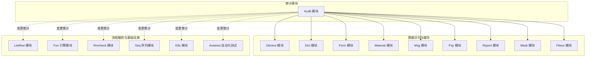
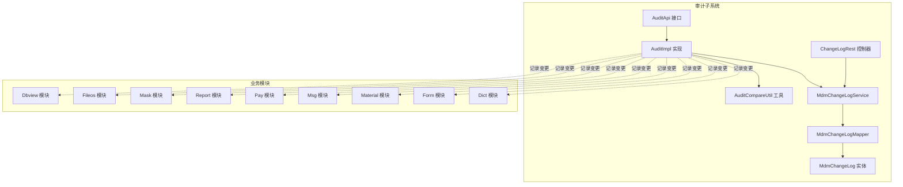
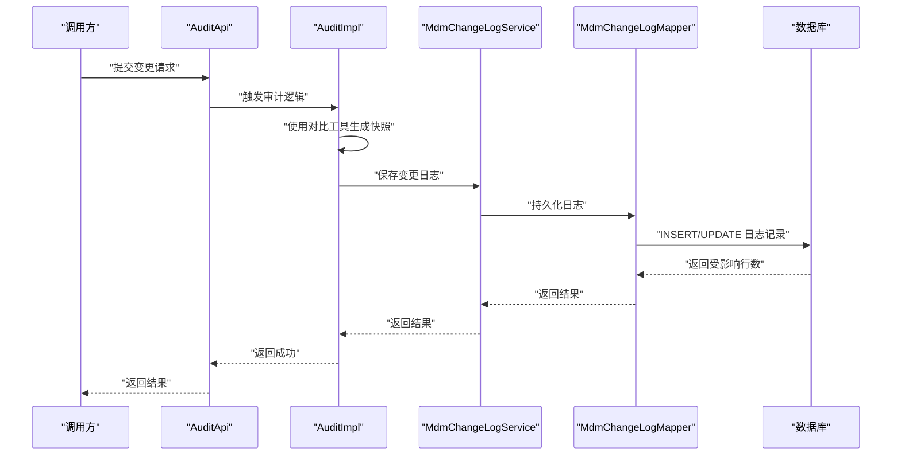
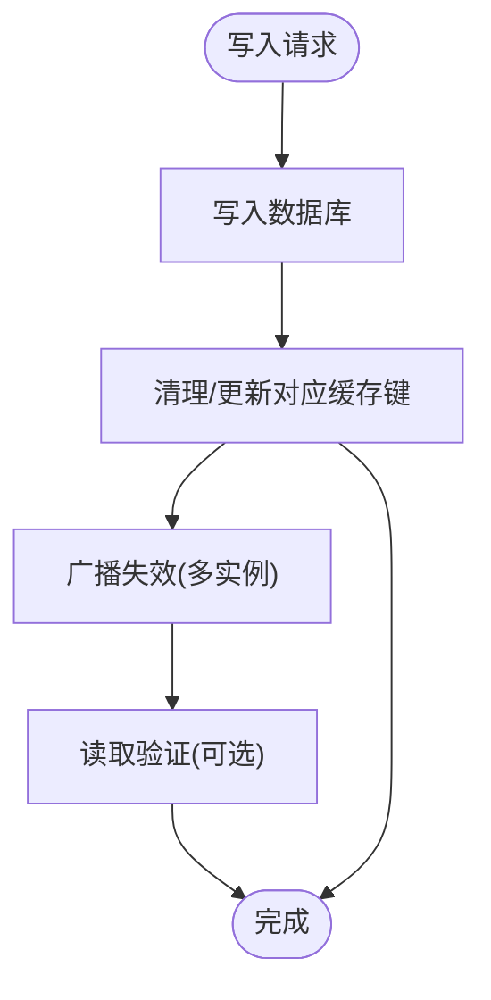
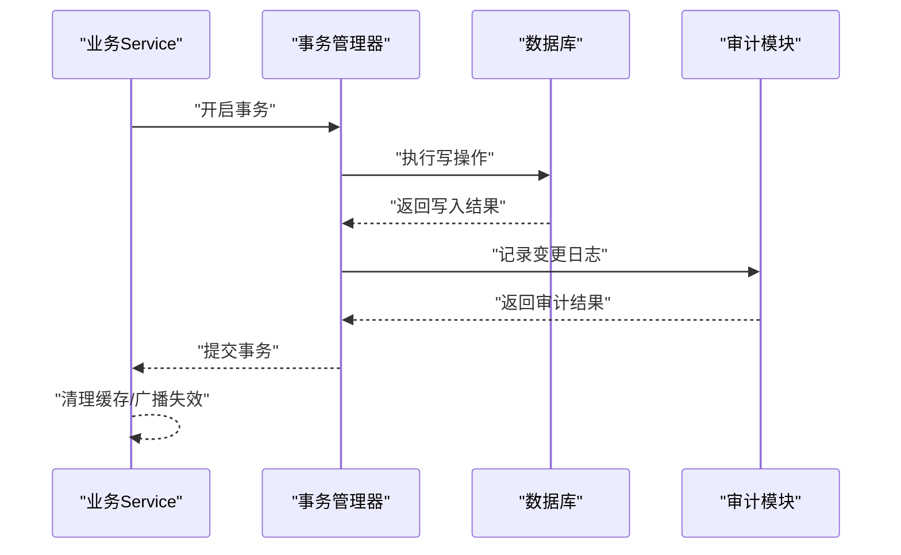
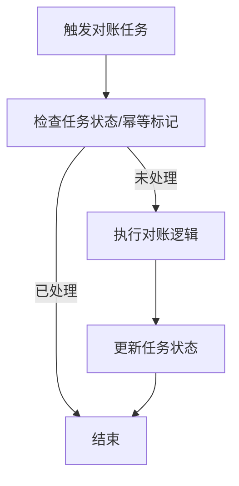
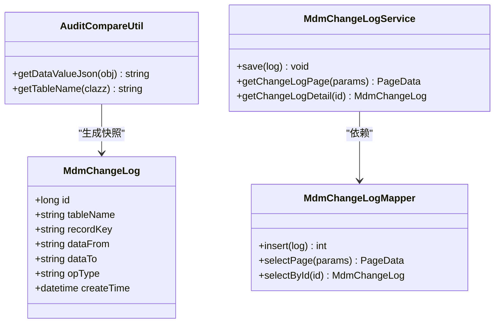
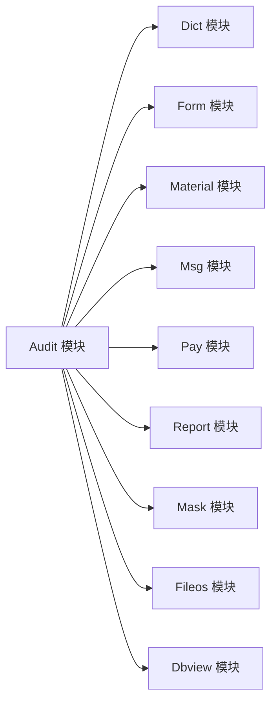

# 数据一致性问题

<cite>
**本文引用的文件**
- [AuditAutoConfig.java](file://micro-audit/src/main/java/com/wkclz/micro/audit/AuditAutoConfig.java)
- [AuditApi.java](file://micro-audit/src/main/java/com/wkclz/micro/audit/api/AuditApi.java)
- [AuditImpl.java](file://micro-audit/src/main/java/com/wkclz/micro/audit/api/impl/AuditImpl.java)
- [MdmChangeLog.java](file://micro-audit/src/main/java/com/wkclz/micro/audit/bean/entity/MdmChangeLog.java)
- [MdmChangeLogMapper.java](file://micro-audit/src/main/java/com/wkclz/micro/audit/mapper/MdmChangeLogMapper.java)
- [MdmChangeLogMapper.xml](file://micro-audit/src/main/resources/mapper/MdmChangeLogMapper.xml)
- [ChangeLogRest.java](file://micro-audit/src/main/java/com/wkclz/micro/audit/rest/ChangeLogRest.java)
- [AuditCompareUtil.java](file://micro-audit/src/main/java/com/wkclz/micro/audit/utils/AuditCompareUtil.java)
- [MdmChangeLogService.java](file://micro-audit/src/main/java/com/wkclz/micro/audit/service/MdmChangeLogService.java)
- [Route.java](file://micro-audit/src/main/java/com/wkclz/micro/audit/rest/Route.java)
- [DbviewAutoConfig.java](file://micro-dbview/src/main/java/com/wkclz/micro/dbview/DbviewAutoConfig.java)
- [DbviewDatasourceService.java](file://micro-dbview/src/main/java/com/wkclz/micro/dbview/service/DbviewDatasourceService.java)
- [DbviewDatasourceMapper.java](file://micro-dbview/src/main/java/com/wkclz/micro/dbview/mapper/DbviewDatasourceMapper.java)
- [DbviewDatasourceMapper.xml](file://micro-dbview/src/main/resources/mapper/DbviewDatasourceMapper.xml)
- [DbviewSqlService.java](file://micro-dbview/src/main/java/com/wkclz/micro/dbview/service/DbviewSqlService.java)
- [DbviewSqlMapper.java](file://micro-dbview/src/main/java/com/wkclz/micro/dbview/mapper/DbviewSqlMapper.java)
- [DbviewSqlMapper.xml](file://micro-dbview/src/main/resources/mapper/DbviewSqlMapper.xml)
- [DbviewSqlHistoryService.java](file://micro-dbview/src/main/java/com/wkclz/micro/dbview/service/DbviewSqlHistoryService.java)
- [DbviewSqlHistoryMapper.java](file://micro-dbview/src/main/java/com/wkclz/micro/dbview/mapper/DbviewSqlHistoryMapper.java)
- [DbviewSqlHistoryMapper.xml](file://micro-dbview/src/main/resources/mapper/DbviewSqlHistoryMapper.xml)
- [DatasourceCache.java](file://micro-dbview/src/main/java/com/wkclz/micro/dbview/cache/DatasourceCache.java)
- [DictCache.java](file://micro-dict/src/main/java/com/wkclz/micro/dict/cache/DictCache.java)
- [MdmDictItemService.java](file://micro-dict/src/main/java/com/wkclz/micro/dict/service/MdmDictItemService.java)
- [MdmDictItemMapper.java](file://micro-dict/src/main/java/com/wkclz/micro/dict/mapper/MdmDictItemMapper.java)
- [MdmDictItemMapper.xml](file://micro-dict/src/main/resources/mapper/MdmDictItemMapper.xml)
- [MdmDictService.java](file://micro-dict/src/main/java/com/wkclz/micro/dict/service/MdmDictService.java)
- [MdmDictMapper.java](file://micro-dict/src/main/java/com/wkclz/micro/dict/mapper/MdmDictMapper.java)
- [MdmDictMapper.xml](file://micro-dict/src/main/resources/mapper/MdmDictMapper.xml)
- [FormCache.java](file://micro-form/src/main/java/com/wkclz/micro/form/cache/FormCache.java)
- [FormRuleCache.java](file://micro-form/src/main/java/com/wkclz/micro/form/cache/FormRuleCache.java)
- [MdmFormItemService.java](file://micro-form/src/main/java/com/wkclz/micro/form/service/MdmFormItemService.java)
- [MdmFormRuleFieldService.java](file://micro-form/src/main/java/com/wkclz/micro/form/service/MdmFormRuleFieldService.java)
- [MdmFormRuleService.java](file://micro-form/src/main/java/com/wkclz/micro/form/service/MdmFormRuleService.java)
- [MdmFormService.java](file://micro-form/src/main/java/com/wkclz/micro/form/service/MdmFormService.java)
- [MdmFormItemMapper.java](file://micro-form/src/main/java/com/wkclz/micro/form/mapper/MdmFormItemMapper.java)
- [MdmFormItemMapper.xml](file://micro-form/src/main/resources/mapper/MdmFormItemMapper.xml)
- [MdmFormRuleMapper.java](file://micro-form/src/main/java/com/wkclz/micro/form/mapper/MdmFormRuleMapper.java)
- [MdmFormRuleMapper.xml](file://micro-form/src/main/resources/mapper/MdmFormRuleMapper.xml)
- [MdmFormRuleFieldMapper.java](file://micro-form/src/main/java/com/wkclz/micro/form/mapper/MdmFormRuleFieldMapper.java)
- [MdmFormRuleFieldMapper.xml](file://micro-form/src/main/resources/mapper/MdmFormRuleFieldMapper.xml)
- [MdmFormRuleFieldValidatorMapper.java](file://micro-form/src/main/java/com/wkclz/micro/form/mapper/MdmFormRuleFieldValidatorMapper.java)
- [MdmFormRuleFieldValidatorMapper.xml](file://micro-form/src/main/resources/mapper/MdmFormRuleFieldValidatorMapper.xml)
- [MdmFormRuleValidatorTemplateMapper.java](file://micro-form/src/main/java/com/wkclz/micro/form/mapper/MdmFormRuleValidatorTemplateMapper.java)
- [MdmFormRuleValidatorTemplateMapper.xml](file://micro-form/src/main/resources/mapper/MdmFormRuleValidatorTemplateMapper.xml)
- [MaterialGroupCache.java](file://micro-material/src/main/java/com/wkclz/micro/material/cache/MaterialGroupCache.java)
- [MdmMaterialGroupService.java](file://micro-material/src/main/java/com/wkclz/micro/material/service/MdmMaterialGroupService.java)
- [MdmMaterialGroupMapper.java](file://micro-material/src/main/java/com/wkclz/micro/material/mapper/MdmMaterialGroupMapper.java)
- [MdmMaterialGroupMapper.xml](file://micro-material/src/main/resources/mapper/MdmMaterialGroupMapper.xml)
- [MdmMaterialService.java](file://micro-material/src/main/java/com/wkclz/micro/material/service/MdmMaterialService.java)
- [MdmMaterialMapper.java](file://micro-material/src/main/java/com/wkclz/micro/material/mapper/MdmMaterialMapper.java)
- [MdmMaterialMapper.xml](file://micro-material/src/main/resources/mapper/MdmMaterialMapper.xml)
- [MdmMaterialRefService.java](file://micro-material/src/main/java/com/wkclz/micro/material/service/MdmMaterialRefService.java)
- [MdmMaterialRefMapper.java](file://micro-material/src/main/java/com/wkclz/micro/material/mapper/MdmMaterialRefMapper.java)
- [MdmMaterialRefMapper.xml](file://micro-material/src/main/resources/mapper/MdmMaterialRefMapper.xml)
- [MdmMaterialTransferLogService.java](file://micro-material/src/main/java/com/wkclz/micro/material/service/MdmMaterialTransferLogService.java)
- [MdmMaterialTransferLogMapper.java](file://micro-material/src/main/java/com/wkclz/micro/material/mapper/MdmMaterialTransferLogMapper.java)
- [MdmMaterialTransferLogMapper.xml](file://micro-material/src/main/resources/mapper/MdmMaterialTransferLogMapper.xml)
- [MdmMaterialVersionService.java](file://micro-material/src/main/java/com/wkclz/micro/material/service/MdmMaterialVersionService.java)
- [MdmMaterialVersionMapper.java](file://micro-material/src/main/java/com/wkclz/micro/material/mapper/MdmMaterialVersionMapper.java)
- [MdmMaterialVersionMapper.xml](file://micro-material/src/main/resources/mapper/MdmMaterialVersionMapper.xml)
- [PayOrderService.java](file://micro-pay/src/main/java/com/wkclz/micro/pay/service/PayOrderService.java)
- [PayOrderMapper.java](file://micro-pay/src/main/java/com/wkclz/micro/pay/mapper/PayOrderMapper.java)
- [PayOrderMapper.xml](file://micro-pay/src/main/resources/mapper/PayOrderMapper.xml)
- [AlipayClientCache.java](file://micro-pay/src/main/java/com/wkclz/micro/pay/cache/AlipayClientCache.java)
- [WxpayClientCache.java](file://micro-pay/src/main/java/com/wkclz/micro/pay/cache/WxpayClientCache.java)
- [ShopOrderService.java](file://micro-pay/src/main/java/com/wkclz/micro/pay/service/ShopOrderService.java)
- [WxpayOrderSchedule.java](file://micro-pay/src/main/java/com/wkclz/micro/pay/schedule/WxpayOrderSchedule.java)
- [WxPayTimeoutSchedule.java](file://micro-pay/src/main/java/com/wkclz/micro/pay/schedule/WxPayTimeoutSchedule.java)
- [MsgNotificationService.java](file://micro-msg/src/main/java/com/wkclz/micro/msg/service/MsgNotificationService.java)
- [MsgTemplateService.java](file://micro-msg/src/main/java/com/wkclz/micro/msg/service/MsgTemplateService.java)
- [MsgUserRecordService.java](file://micro-msg/src/main/java/com/wkclz/micro/msg/service/MsgUserRecordService.java)
- [MsgUserSettingsService.java](file://micro-msg/src/main/java/com/wkclz/micro/msg/service/MsgUserSettingsService.java)
- [MsgNotificationMapper.java](file://micro-msg/src/main/java/com/wkclz/micro/msg/mapper/MsgNotificationMapper.java)
- [MsgNotificationMapper.xml](file://micro-msg/src/main/resources/mapper/MsgNotificationMapper.xml)
- [MsgTemplateMapper.java](file://micro-msg/src/main/java/com/wkclz/micro/msg/mapper/MsgTemplateMapper.java)
- [MsgTemplateMapper.xml](file://micro-msg/src/main/resources/mapper/MsgTemplateMapper.xml)
- [MsgUserRecordMapper.java](file://micro-msg/src/main/java/com/wkclz/micro/msg/mapper/MsgUserRecordMapper.java)
- [MsgUserRecordMapper.xml](file://micro-msg/src/main/resources/mapper/MsgUserRecordMapper.xml)
- [MsgUserSettingsMapper.java](file://micro-msg/src/main/java/com/wkclz/micro/msg/mapper/MsgUserSettingsMapper.java)
- [MsgUserSettingsMapper.xml](file://micro-msg/src/main/resources/mapper/MsgUserSettingsMapper.xml)
- [ReportDefinitionService.java](file://micro-report/src/main/java/com/wkclz/micro/report/service/ReportDefinitionService.java)
- [ReportDefinitionMapper.java](file://micro-report/src/main/java/com/wkclz/micro/report/mapper/ReportDefinitionMapper.java)
- [ReportDefinitionMapper.xml](file://micro-report/src/main/resources/mapper/ReportDefinitionMapper.xml)
- [ReportDefinitionHisService.java](file://micro-report/src/main/java/com/wkclz/micro/report/service/ReportDefinitionHisService.java)
- [ReportDefinitionHisMapper.java](file://micro-report/src/main/java/com/wkclz/micro/report/mapper/ReportDefinitionHisMapper.java)
- [ReportDefinitionHisMapper.xml](file://micro-report/src/main/resources/mapper/ReportDefinitionHisMapper.xml)
- [ReportDefinitionParamService.java](file://micro-report/src/main/java/com/wkclz/micro/report/service/ReportDefinitionParamService.java)
- [ReportDefinitionParamMapper.java](file://micro-report/src/main/java/com/wkclz/micro/report/mapper/ReportDefinitionParamMapper.java)
- [ReportDefinitionParamMapper.xml](file://micro-report/src/main/resources/mapper/ReportDefinitionParamMapper.xml)
- [ReportDefinitionResultService.java](file://micro-report/src/main/java/com/wkclz/micro/report/service/ReportDefinitionResultService.java)
- [ReportDefinitionResultMapper.java](file://micro-report/src/main/java/com/wkclz/micro/report/mapper/ReportDefinitionResultMapper.java)
- [ReportDefinitionResultMapper.xml](file://micro-report/src/main/resources/mapper/ReportDefinitionResultMapper.xml)
- [ReportCache.java](file://micro-report/src/main/java/com/wkclz/micro/report/cache/ReportCache.java)
- [RmCheckRuleService.java](file://micro-rmcheck/src/main/java/com/wkclz/micro/rmcheck/service/RmCheckRuleService.java)
- [RmCheckRuleMapper.java](file://micro-rmcheck/src/main/java/com/wkclz/micro/rmcheck/mapper/RmCheckRuleMapper.java)
- [RmCheckRuleMapper.xml](file://micro-rmcheck/src/main/resources/mapper/RmCheckRuleMapper.xml)
- [RmCheckRuleItemService.java](file://micro-rmcheck/src/main/java/com/wkclz/micro/rmcheck/service/RmCheckRuleItemService.java)
- [RmCheckRuleItemMapper.java](file://micro-rmcheck/src/main/java/com/wkclz/micro/rmcheck/mapper/RmCheckRuleItemMapper.java)
- [RmCheckRuleItemMapper.xml](file://micro-rmcheck/src/main/resources/mapper/RmCheckRuleItemMapper.xml)
- [CheckMapper.java](file://micro-rmcheck/src/main/java/com/wkclz/micro/rmcheck/mapper/CheckMapper.java)
- [CheckMapper.xml](file://micro-rmcheck/src/main/resources/mapper/CheckMapper.xml)
- [SeqApi.java](file://micro-seq/src/main/java/com/wkclz/micro/seq/api/SeqApi.java)
- [MdmSequenceMapper.java](file://micro-seq/src/main/java/com/wkclz/micro/seq/mapper/MdmSequenceMapper.java)
- [MdmSequenceMapper.xml](file://micro-seq/src/main/resources/mapper/MdmSequenceMapper.xml)
- [FileosService.java](file://micro-fileos/src/main/java/com/wkclz/micro/fileos/service/FileosService.java)
- [MdmFileosRecordMapper.java](file://micro-fileos/src/main/java/com/wkclz/micro/fileos/mapper/MdmFileosRecordMapper.java)
- [MdmFileosRecordMapper.xml](file://micro-fileos/src/main/resources/mapper/MdmFileosRecordMapper.xml)
- [MdmFileosBucketMapper.java](file://micro-fileos/src/main/java/com/wkclz/micro/fileos/mapper/MdmFileosBucketMapper.java)
- [MdmFileosBucketMapper.xml](file://micro-fileos/src/main/resources/mapper/MdmFileosBucketMapper.xml)
- [MdmFileosDirectoryMapper.java](file://micro-fileos/src/main/java/com/wkclz/micro/fileos/mapper/MdmFileosDirectoryMapper.java)
- [MdmFileosDirectoryMapper.xml](file://micro-fileos/src/main/resources/mapper/MdmFileosDirectoryMapper.xml)
- [MdmFileosMultipartMapper.java](file://micro-fileos/src/main/java/com/wkclz/micro/fileos/mapper/MdmFileosMultipartMapper.java)
- [MdmFileosMultipartMapper.xml](file://micro-fileos/src/main/resources/mapper/MdmFileosMultipartMapper.xml)
- [BucketCache.java](file://micro-fileos/src/main/java/com/wkclz/micro/fileos/helper/BucketCache.java)
- [OssUtil.java](file://micro-fileos/src/main/java/com/wkclz/micro/fileos/utils/OssUtil.java)
- [MdmMaskRuleService.java](file://micro-mask/src/main/java/com/wkclz/micro/mask/service/MdmMaskRuleService.java)
- [MdmMaskRuleMapper.java](file://micro-mask/src/main/java/com/wkclz/micro/mask/mapper/MdmMaskRuleMapper.java)
- [MdmMaskRuleMapper.xml](file://micro-mask/src/main/resources/mapper/MdmMaskRuleMapper.xml)
- [MaskCache.java](file://micro-mask/src/main/java/com/wkclz/micro/mask/cache/MaskCache.java)
- [FunFunctionService.java](file://micro-fun/src/main/java/com/wkclz/micro/fun/service/FunFunctionService.java)
- [FunFunctionMapper.java](file://micro-fun/src/main/java/com/wkclz/micro/fun/mapper/FunFunctionMapper.java)
- [FunFunctionMapper.xml](file://micro-fun/src/main/resources/mapper/FunFunctionMapper.xml)
- [FunCategoryService.java](file://micro-fun/src/main/java/com/wkclz/micro/fun/service/FunCategoryService.java)
- [FunCategoryMapper.java](file://micro-fun/src/main/java/com/wkclz/micro/fun/mapper/FunCategoryMapper.java)
- [FunCategoryMapper.xml](file://micro-fun/src/main/resources/mapper/FunCategoryMapper.xml)
- [ScriptService.java](file://micro-fun/src/main/java/com/wkclz/micro/fun/engine/impl/ScriptService.java)
- [ScriptEngine.java](file://micro-fun/src/main/java/com/wkclz/micro/fun/engine/impl/ScriptEngine.java)
- [LiteflowChainService.java](file://micro-liteflow/src/main/java/com/wkclz/micro/liteflow/service/LiteflowChainService.java)
- [LiteflowChainMapper.java](file://micro-liteflow/src/main/java/com/wkclz/micro/liteflow/mapper/LiteflowChainMapper.java)
- [LiteflowChainMapper.xml](file://micro-liteflow/src/main/resources/mapper/LiteflowChainMapper.xml)
- [LiteflowScriptService.java](file://micro-liteflow/src/main/java/com/wkclz/micro/liteflow/service/LiteflowScriptService.java)
- [LiteflowScriptMapper.java](file://micro-liteflow/src/main/java/com/wkclz/micro/liteflow/mapper/LiteflowScriptMapper.java)
- [LiteflowScriptMapper.xml](file://micro-liteflow/src/main/resources/mapper/LiteflowScriptMapper.xml)
- [K8sAutoConfig.java](file://micro-k8s/src/main/java/com/wkclz/micro/k8s/K8sAutoConfig.java)
- [IntOrString.java](file://micro-k8s/src/main/java/io/kubernetes/client/custom/IntOrString.java)
- [AutoTestAutoConfig.java](file://micro-autotest/src/main/java/com/wkclz/auto/AutoTestAutoConfig.java)
- [TestExecutor.java](file://micro-autotest/src/main/java/com/wkclz/auto/executor/TestExecutor.java)
- [ApiScanner.java](file://micro-autotest/src/main/java/com/wkclz/auto/scanner/ApiScanner.java)
- [ReportGenerator.java](file://micro-autotest/src/main/java/com/wkclz/auto/report/ReportGenerator.java)
- [AutoMockBeanPostProcessor.java](file://micro-autotest/src/main/java/com/wkclz/auto/mock/AutoMockBeanPostProcessor.java)
- [MockHelper.java](file://micro-autotest/src/main/java/com/wkclz/auto/mock/MockHelper.java)
- [TestDataGenerator.java](file://micro-autotest/src/main/java/com/wkclz/auto/mock/TestDataGenerator.java)
- [TestCaseResult.java](file://micro-autotest/src/main/java/com/wkclz/auto/bean/TestCaseResult.java)
- [TestReport.java](file://micro-autotest/src/main/java/com/wkclz/auto/bean/TestReport.java)
- [ApiInfo.java](file://micro-autotest/src/main/java/com/wkclz/auto/bean/ApiInfo.java)
- [ApiParamInfo.java](file://micro-autotest/src/main/java/com/wkclz/auto/bean/ApiParamInfo.java)
- [pom.xml](file://pom.xml)
</cite>

## 目录
1. 引言
2. 项目结构
3. 核心组件
4. 架构总览
5. 详细组件分析
6. 依赖分析
7. 性能考虑
8. 故障排除指南
9. 结论
10. 附录

## 引言
本文件面向sh-microapp微服务框架，聚焦“数据一致性”问题的排查与治理。内容覆盖缓存与数据库不同步、事务处理异常、并发访问冲突、审计日志缺失等典型场景，并结合仓库中的审计、缓存、事务与并发控制相关实现，给出可操作的诊断路径、工具使用方法与修复策略。目标是帮助开发者在各业务模块中建立稳定可靠的数据处理体系。

## 项目结构
仓库采用多模块架构，每个功能域（如审计、字典、物料、支付、报表等）独立成模块，便于职责分离与一致性治理。审计模块提供统一的变更记录能力；多个模块内置缓存层；部分模块涉及事务性写入与定时任务；另有自动化测试模块用于一致性回归验证。

图示来源
- [AuditAutoConfig.java](file://micro-audit/src/main/java/com/wkclz/micro/audit/AuditAutoConfig.java)
- [DbviewAutoConfig.java](file://micro-dbview/src/main/java/com/wkclz/micro/dbview/DbviewAutoConfig.java)
- [DictCache.java](file://micro-dict/src/main/java/com/wkclz/micro/dict/cache/DictCache.java)
- [FormCache.java](file://micro-form/src/main/java/com/wkclz/micro/form/cache/FormCache.java)
- [MaterialGroupCache.java](file://micro-material/src/main/java/com/wkclz/micro/material/cache/MaterialGroupCache.java)
- [PayOrderService.java](file://micro-pay/src/main/java/com/wkclz/micro/pay/service/PayOrderService.java)
- [MsgNotificationService.java](file://micro-msg/src/main/java/com/wkclz/micro/msg/service/MsgNotificationService.java)
- [ReportCache.java](file://micro-report/src/main/java/com/wkclz/micro/report/cache/ReportCache.java)
- [MaskCache.java](file://micro-mask/src/main/java/com/wkclz/micro/mask/cache/MaskCache.java)
- [FileosService.java](file://micro-fileos/src/main/java/com/wkclz/micro/fileos/service/FileosService.java)
- [LiteflowChainService.java](file://micro-liteflow/src/main/java/com/wkclz/micro/liteflow/service/LiteflowChainService.java)
- [FunFunctionService.java](file://micro-fun/src/main/java/com/wkclz/micro/fun/service/FunFunctionService.java)
- [RmCheckRuleService.java](file://micro-rmcheck/src/main/java/com/wkclz/micro/rmcheck/service/RmCheckRuleService.java)
- [SeqApi.java](file://micro-seq/src/main/java/com/wkclz/micro/seq/api/SeqApi.java)
- [K8sAutoConfig.java](file://micro-k8s/src/main/java/com/wkclz/micro/k8s/K8sAutoConfig.java)
- [AutoTestAutoConfig.java](file://micro-autotest/src/main/java/com/wkclz/auto/AutoTestAutoConfig.java)

章节来源
- [pom.xml](file://pom.xml)

## 核心组件
- 审计模块：提供统一的变更日志实体、持久化、查询接口与对比工具，支撑跨模块的数据一致性核对。
- 缓存模块：在字典、表单、物料、报表、掩码、文件桶等模块中引入本地缓存，需关注缓存与后端数据的同步策略。
- 事务与并发：支付、物料转移、字典项等模块存在事务性写入与并发控制需求，需确保事务边界与锁策略正确。
- 定时任务：支付模块包含超时与对账类调度任务，需保障幂等与一致性。
- 自动化测试：提供接口扫描、用例执行与报告生成，可用于一致性回归验证。

章节来源
- [AuditAutoConfig.java](file://micro-audit/src/main/java/com/wkclz/micro/audit/AuditAutoConfig.java)
- [MdmChangeLog.java](file://micro-audit/src/main/java/com/wkclz/micro/audit/bean/entity/MdmChangeLog.java)
- [MdmChangeLogService.java](file://micro-audit/src/main/java/com/wkclz/micro/audit/service/MdmChangeLogService.java)
- [AuditCompareUtil.java](file://micro-audit/src/main/java/com/wkclz/micro/audit/utils/AuditCompareUtil.java)

## 架构总览
下图展示审计模块与各业务模块的交互关系，以及审计日志在一致性核对中的作用。

图示来源
- [AuditApi.java](file://micro-audit/src/main/java/com/wkclz/micro/audit/api/AuditApi.java)
- [AuditImpl.java](file://micro-audit/src/main/java/com/wkclz/micro/audit/api/impl/AuditImpl.java)
- [MdmChangeLogService.java](file://micro-audit/src/main/java/com/wkclz/micro/audit/service/MdmChangeLogService.java)
- [MdmChangeLogMapper.java](file://micro-audit/src/main/java/com/wkclz/micro/audit/mapper/MdmChangeLogMapper.java)
- [MdmChangeLog.java](file://micro-audit/src/main/java/com/wkclz/micro/audit/bean/entity/MdmChangeLog.java)
- [AuditCompareUtil.java](file://micro-audit/src/main/java/com/wkclz/micro/audit/utils/AuditCompareUtil.java)
- [ChangeLogRest.java](file://micro-audit/src/main/java/com/wkclz/micro/audit/rest/ChangeLogRest.java)

## 详细组件分析

### 审计模块（Audit）
- 组件职责
  - 提供统一的变更记录能力，支持“新增/更新/删除”三类事件的记录与查询。
  - 对比工具用于计算对象差异，形成“变更前/后”的数据快照。
  - 通过REST接口对外提供分页查询与详情查看能力。
- 关键流程
  - 新增/更新/删除：调用对比工具生成变更快照，持久化到日志表。
  - 查询：按表名、主键、时间范围等条件分页检索变更历史。
- 一致性保障
  - 变更记录与业务操作应同事务提交，避免“只记日志不写业务”或“只写业务不记日志”的半写。
  - 对比工具需覆盖所有字段，避免遗漏关键字段导致核对偏差。

图示来源
- [AuditApi.java](file://micro-audit/src/main/java/com/wkclz/micro/audit/api/AuditApi.java)
- [AuditImpl.java](file://micro-audit/src/main/java/com/wkclz/micro/audit/api/impl/AuditImpl.java)
- [MdmChangeLogService.java](file://micro-audit/src/main/java/com/wkclz/micro/audit/service/MdmChangeLogService.java)
- [MdmChangeLogMapper.java](file://micro-audit/src/main/java/com/wkclz/micro/audit/mapper/MdmChangeLogMapper.java)

章节来源
- [AuditAutoConfig.java](file://micro-audit/src/main/java/com/wkclz/micro/audit/AuditAutoConfig.java)
- [AuditApi.java](file://micro-audit/src/main/java/com/wkclz/micro/audit/api/AuditApi.java)
- [AuditImpl.java](file://micro-audit/src/main/java/com/wkclz/micro/audit/api/impl/AuditImpl.java)
- [MdmChangeLog.java](file://micro-audit/src/main/java/com/wkclz/micro/audit/bean/entity/MdmChangeLog.java)
- [MdmChangeLogMapper.java](file://micro-audit/src/main/java/com/wkclz/micro/audit/mapper/MdmChangeLogMapper.java)
- [MdmChangeLogMapper.xml](file://micro-audit/src/main/resources/mapper/MdmChangeLogMapper.xml)
- [ChangeLogRest.java](file://micro-audit/src/main/java/com/wkclz/micro/audit/rest/ChangeLogRest.java)
- [AuditCompareUtil.java](file://micro-audit/src/main/java/com/wkclz/micro/audit/utils/AuditCompareUtil.java)

### 缓存与数据库同步（以字典、表单、物料、报表、掩码、文件桶为例）
- 典型问题
  - 写入数据库成功但缓存未失效，导致后续读取脏数据。
  - 多实例部署时缓存不一致，热点数据不同步。
  - 缓存过期策略不当，引发雪崩或长尾延迟。
- 诊断要点
  - 在每次写操作后显式清理或更新对应缓存键。
  - 使用统一的缓存门面或拦截器，确保写路径的一致性。
  - 配置合理的TTL与刷新策略，必要时启用互斥锁避免击穿。
- 修复建议
  - 在业务Service层增加“先写库再清缓存”的原子性封装。
  - 对热点数据采用“读缓存+异步回源”策略，保证最终一致。
  - 对分布式缓存，使用版本号或ETag进行一致性校验。

图示来源
- [DictCache.java](file://micro-dict/src/main/java/com/wkclz/micro/dict/cache/DictCache.java)
- [FormCache.java](file://micro-form/src/main/java/com/wkclz/micro/form/cache/FormCache.java)
- [FormRuleCache.java](file://micro-form/src/main/java/com/wkclz/micro/form/cache/FormRuleCache.java)
- [MaterialGroupCache.java](file://micro-material/src/main/java/com/wkclz/micro/material/cache/MaterialGroupCache.java)
- [ReportCache.java](file://micro-report/src/main/java/com/wkclz/micro/report/cache/ReportCache.java)
- [MaskCache.java](file://micro-mask/src/main/java/com/wkclz/micro/mask/cache/MaskCache.java)
- [BucketCache.java](file://micro-fileos/src/main/java/com/wkclz/micro/fileos/helper/BucketCache.java)

章节来源
- [DictCache.java](file://micro-dict/src/main/java/com/wkclz/micro/dict/cache/DictCache.java)
- [FormCache.java](file://micro-form/src/main/java/com/wkclz/micro/form/cache/FormCache.java)
- [FormRuleCache.java](file://micro-form/src/main/java/com/wkclz/micro/form/cache/FormRuleCache.java)
- [MaterialGroupCache.java](file://micro-material/src/main/java/com/wkclz/micro/material/cache/MaterialGroupCache.java)
- [ReportCache.java](file://micro-report/src/main/java/com/wkclz/micro/report/cache/ReportCache.java)
- [MaskCache.java](file://micro-mask/src/main/java/com/wkclz/micro/mask/cache/MaskCache.java)
- [BucketCache.java](file://micro-fileos/src/main/java/com/wkclz/micro/fileos/helper/BucketCache.java)

### 事务处理与并发控制（以支付、物料、字典为例）
- 典型问题
  - 事务边界不清晰，导致部分写入成功、部分失败。
  - 并发写入造成超卖、重复扣款或库存不一致。
  - 锁粒度过粗导致性能瓶颈，锁粒度过细导致死锁风险。
- 诊断要点
  - 明确事务起点与终点，确保业务操作与日志记录在同一事务内。
  - 对共享资源（库存、账户余额、订单状态）使用合适的并发控制（行级锁、乐观锁、分布式锁）。
  - 对关键路径加埋点，记录事务开始/结束与锁等待耗时。
- 修复建议
  - 将“写库+写审计+写缓存失效”封装为统一的事务单元。
  - 对高并发场景采用“预占+异步结算”或“补偿事务”降低锁持有时间。
  - 对重复提交场景引入幂等键（如订单号、外部流水号）。

图示来源
- [PayOrderService.java](file://micro-pay/src/main/java/com/wkclz/micro/pay/service/PayOrderService.java)
- [MdmMaterialService.java](file://micro-material/src/main/java/com/wkclz/micro/material/service/MdmMaterialService.java)
- [MdmDictItemService.java](file://micro-dict/src/main/java/com/wkclz/micro/dict/service/MdmDictItemService.java)
- [AuditImpl.java](file://micro-audit/src/main/java/com/wkclz/micro/audit/api/impl/AuditImpl.java)

章节来源
- [PayOrderService.java](file://micro-pay/src/main/java/com/wkclz/micro/pay/service/PayOrderService.java)
- [PayOrderMapper.java](file://micro-pay/src/main/java/com/wkclz/micro/pay/mapper/PayOrderMapper.java)
- [PayOrderMapper.xml](file://micro-pay/src/main/resources/mapper/PayOrderMapper.xml)
- [MdmMaterialService.java](file://micro-material/src/main/java/com/wkclz/micro/material/service/MdmMaterialService.java)
- [MdmMaterialMapper.java](file://micro-material/src/main/java/com/wkclz/micro/material/mapper/MdmMaterialMapper.java)
- [MdmMaterialMapper.xml](file://micro-material/src/main/resources/mapper/MdmMaterialMapper.xml)
- [MdmDictItemService.java](file://micro-dict/src/main/java/com/wkclz/micro/dict/service/MdmDictItemService.java)
- [MdmDictItemMapper.java](file://micro-dict/src/main/java/com/wkclz/micro/dict/mapper/MdmDictItemMapper.java)
- [MdmDictItemMapper.xml](file://micro-dict/src/main/resources/mapper/MdmDictItemMapper.xml)

### 定时任务与最终一致性（以支付对账为例）
- 典型问题
  - 超时/对账任务未幂等，重复执行造成重复处理。
  - 任务执行时间窗与业务高峰期重叠，影响在线性能。
  - 任务失败重试策略不当，导致长时间阻塞。
- 诊断要点
  - 任务状态机明确：待执行→执行中→已完成/失败。
  - 对账窗口与重试间隔合理配置，避免抖动。
  - 失败告警与人工干预通道完备。
- 修复建议
  - 任务入口增加“已处理标记”，确保幂等。
  - 分片执行与限速，避免集中冲击。
  - 失败队列与死信处理，保障不丢任务。

图示来源
- [WxpayOrderSchedule.java](file://micro-pay/src/main/java/com/wkclz/micro/pay/schedule/WxpayOrderSchedule.java)
- [WxPayTimeoutSchedule.java](file://micro-pay/src/main/java/com/wkclz/micro/pay/schedule/WxPayTimeoutSchedule.java)
- [ShopOrderService.java](file://micro-pay/src/main/java/com/wkclz/micro/pay/service/ShopOrderService.java)

章节来源
- [WxpayOrderSchedule.java](file://micro-pay/src/main/java/com/wkclz/micro/pay/schedule/WxpayOrderSchedule.java)
- [WxPayTimeoutSchedule.java](file://micro-pay/src/main/java/com/wkclz/micro/pay/schedule/WxPayTimeoutSchedule.java)
- [ShopOrderService.java](file://micro-pay/src/main/java/com/wkclz/micro/pay/service/ShopOrderService.java)

### 审计日志的使用与核对（核心工具链）
- 审计实体与映射
  - 变更日志实体定义了表名、主键、字段快照、操作类型、时间戳等关键字段。
  - MyBatis映射文件提供标准的CRUD与分页查询能力。
- 对比工具
  - 对象对比工具负责序列化前后值，生成可比较的快照文本，便于日志存储与检索。
- 查询接口
  - REST控制器提供分页查询与详情查看，支持按表名、主键、时间范围过滤。

图示来源
- [MdmChangeLog.java](file://micro-audit/src/main/java/com/wkclz/micro/audit/bean/entity/MdmChangeLog.java)
- [AuditCompareUtil.java](file://micro-audit/src/main/java/com/wkclz/micro/audit/utils/AuditCompareUtil.java)
- [MdmChangeLogMapper.java](file://micro-audit/src/main/java/com/wkclz/micro/audit/mapper/MdmChangeLogMapper.java)
- [MdmChangeLogMapper.xml](file://micro-audit/src/main/resources/mapper/MdmChangeLogMapper.xml)
- [MdmChangeLogService.java](file://micro-audit/src/main/java/com/wkclz/micro/audit/service/MdmChangeLogService.java)

章节来源
- [MdmChangeLog.java](file://micro-audit/src/main/java/com/wkclz/micro/audit/bean/entity/MdmChangeLog.java)
- [AuditCompareUtil.java](file://micro-audit/src/main/java/com/wkclz/micro/audit/utils/AuditCompareUtil.java)
- [MdmChangeLogMapper.java](file://micro-audit/src/main/java/com/wkclz/micro/audit/mapper/MdmChangeLogMapper.java)
- [MdmChangeLogMapper.xml](file://micro-audit/src/main/resources/mapper/MdmChangeLogMapper.xml)
- [MdmChangeLogService.java](file://micro-audit/src/main/java/com/wkclz/micro/audit/service/MdmChangeLogService.java)
- [ChangeLogRest.java](file://micro-audit/src/main/java/com/wkclz/micro/audit/rest/ChangeLogRest.java)

## 依赖分析
- 模块耦合
  - 审计模块作为横切能力被各业务模块复用，耦合度低、内聚度高。
  - 缓存模块与业务模块强耦合，需谨慎设计失效策略。
  - 事务与并发控制集中在业务Service层，易形成“上帝类”，建议拆分领域服务。
- 外部依赖
  - MyBatis用于ORM与SQL映射，需关注SQL性能与索引。
  - Spring事务管理器与缓存抽象，需确保传播行为与缓存一致性策略匹配。

图示来源
- [AuditAutoConfig.java](file://micro-audit/src/main/java/com/wkclz/micro/audit/AuditAutoConfig.java)
- [DbviewAutoConfig.java](file://micro-dbview/src/main/java/com/wkclz/micro/dbview/DbviewAutoConfig.java)
- [DictCache.java](file://micro-dict/src/main/java/com/wkclz/micro/dict/cache/DictCache.java)
- [FormCache.java](file://micro-form/src/main/java/com/wkclz/micro/form/cache/FormCache.java)
- [MaterialGroupCache.java](file://micro-material/src/main/java/com/wkclz/micro/material/cache/MaterialGroupCache.java)
- [PayOrderService.java](file://micro-pay/src/main/java/com/wkclz/micro/pay/service/PayOrderService.java)
- [MsgNotificationService.java](file://micro-msg/src/main/java/com/wkclz/micro/msg/service/MsgNotificationService.java)
- [ReportCache.java](file://micro-report/src/main/java/com/wkclz/micro/report/cache/ReportCache.java)
- [MaskCache.java](file://micro-mask/src/main/java/com/wkclz/micro/mask/cache/MaskCache.java)
- [FileosService.java](file://micro-fileos/src/main/java/com/wkclz/micro/fileos/service/FileosService.java)

章节来源
- [pom.xml](file://pom.xml)

## 性能考虑
- 审计日志写入
  - 批量写入与异步化，避免阻塞主业务路径。
  - 合理设置日志保留周期，定期归档或清理。
- 缓存命中率
  - 热点数据预热与多级缓存（本地+分布式），减少穿透。
  - TTL与刷新策略动态调整，避免雪崩。
- 事务与锁
  - 缩短事务时间，拆分大事务为小事务。
  - 使用无锁或弱锁方案（如CAS、乐观锁）替代重量级锁。
- 定时任务
  - 分片与限速，避免与业务高峰期重叠。
  - 失败重试指数退避，防止级联故障。

## 故障排除指南
- 缓存与数据库不同步
  - 现象：读到旧值或空值。
  - 诊断：确认写路径是否调用了缓存失效；检查多实例间广播失效是否生效。
  - 处置：在Service层强制清缓存；对热点键增加后台刷新任务。
  - 参考文件
    - [DictCache.java](file://micro-dict/src/main/java/com/wkclz/micro/dict/cache/DictCache.java)
    - [FormCache.java](file://micro-form/src/main/java/com/wkclz/micro/form/cache/FormCache.java)
    - [MaterialGroupCache.java](file://micro-material/src/main/java/com/wkclz/micro/material/cache/MaterialGroupCache.java)
    - [ReportCache.java](file://micro-report/src/main/java/com/wkclz/micro/report/cache/ReportCache.java)
    - [MaskCache.java](file://micro-mask/src/main/java/com/wkclz/micro/mask/cache/MaskCache.java)
    - [BucketCache.java](file://micro-fileos/src/main/java/com/wkclz/micro/fileos/helper/BucketCache.java)
- 事务处理异常
  - 现象：部分写入成功、状态不一致。
  - 诊断：检查事务边界与异常回滚；确认审计日志是否与业务同事务。
  - 处置：将“写库+写审计+清缓存”放入同一事务；对关键字段加唯一约束与校验。
  - 参考文件
    - [PayOrderService.java](file://micro-pay/src/main/java/com/wkclz/micro/pay/service/PayOrderService.java)
    - [MdmMaterialService.java](file://micro-material/src/main/java/com/wkclz/micro/material/service/MdmMaterialService.java)
    - [MdmDictItemService.java](file://micro-dict/src/main/java/com/wkclz/micro/dict/service/MdmDictItemService.java)
    - [AuditImpl.java](file://micro-audit/src/main/java/com/wkclz/micro/audit/api/impl/AuditImpl.java)
- 并发访问冲突
  - 现象：超卖、重复扣款、库存负数。
  - 诊断：定位锁粒度与竞争热点；检查是否使用了并发控制手段。
  - 处置：热点资源加分布式锁或采用预占+异步结算；对重复请求引入幂等键。
  - 参考文件
    - [PayOrderService.java](file://micro-pay/src/main/java/com/wkclz/micro/pay/service/PayOrderService.java)
    - [MdmMaterialService.java](file://micro-material/src/main/java/com/wkclz/micro/material/service/MdmMaterialService.java)
- 审计日志缺失
  - 现象：无法追溯变更。
  - 诊断：确认审计接口是否被调用；检查日志表是否存在；核对对比工具是否覆盖全部字段。
  - 处置：在业务关键路径强制调用审计；完善字段覆盖与异常兜底。
  - 参考文件
    - [AuditImpl.java](file://micro-audit/src/main/java/com/wkclz/micro/audit/api/impl/AuditImpl.java)
    - [MdmChangeLogMapper.java](file://micro-audit/src/main/java/com/wkclz/micro/audit/mapper/MdmChangeLogMapper.java)
    - [MdmChangeLogMapper.xml](file://micro-audit/src/main/resources/mapper/MdmChangeLogMapper.xml)
    - [AuditCompareUtil.java](file://micro-audit/src/main/java/com/wkclz/micro/audit/utils/AuditCompareUtil.java)
- 定时任务问题
  - 现象：重复执行、漏执行、性能抖动。
  - 诊断：检查幂等标记与状态机；评估执行时间窗与并发度。
  - 处置：引入幂等键；分片限速；失败队列与重试策略。
  - 参考文件
    - [WxpayOrderSchedule.java](file://micro-pay/src/main/java/com/wkclz/micro/pay/schedule/WxpayOrderSchedule.java)
    - [WxPayTimeoutSchedule.java](file://micro-pay/src/main/java/com/wkclz/micro/pay/schedule/WxPayTimeoutSchedule.java)
- 数据一致性检查工具
  - 建议使用审计日志的分页查询接口，按表名与主键范围拉取变更记录，比对数据库与缓存状态。
  - 对热点数据，可基于缓存键与数据库记录做抽样核对。
  - 参考文件
    - [ChangeLogRest.java](file://micro-audit/src/main/java/com/wkclz/micro/audit/rest/ChangeLogRest.java)
    - [MdmChangeLogService.java](file://micro-audit/src/main/java/com/wkclz/micro/audit/service/MdmChangeLogService.java)
    - [MdmChangeLog.java](file://micro-audit/src/main/java/com/wkclz/micro/audit/bean/entity/MdmChangeLog.java)

章节来源
- [AuditImpl.java](file://micro-audit/src/main/java/com/wkclz/micro/audit/api/impl/AuditImpl.java)
- [MdmChangeLogService.java](file://micro-audit/src/main/java/com/wkclz/micro/audit/service/MdmChangeLogService.java)
- [ChangeLogRest.java](file://micro-audit/src/main/java/com/wkclz/micro/audit/rest/ChangeLogRest.java)
- [PayOrderService.java](file://micro-pay/src/main/java/com/wkclz/micro/pay/service/PayOrderService.java)
- [MdmMaterialService.java](file://micro-material/src/main/java/com/wkclz/micro/material/service/MdmMaterialService.java)
- [MdmDictItemService.java](file://micro-dict/src/main/java/com/wkclz/micro/dict/service/MdmDictItemService.java)
- [WxpayOrderSchedule.java](file://micro-pay/src/main/java/com/wkclz/micro/pay/schedule/WxpayOrderSchedule.java)
- [WxPayTimeoutSchedule.java](file://micro-pay/src/main/java/com/wkclz/micro/pay/schedule/WxPayTimeoutSchedule.java)

## 结论
通过统一的审计能力、严格的事务边界、完善的缓存失效策略与幂等化的定时任务，sh-microapp能够在多模块协作场景下显著提升数据一致性水平。建议在开发与运维实践中持续完善以下方面：强化审计覆盖、优化缓存一致性、细化并发控制、加强监控与告警，以及建立自动化回归测试机制，以保障系统的长期稳定运行。

## 附录
- 最佳实践清单
  - 审计：所有写操作必须伴随审计日志，且与业务事务同提交。
  - 缓存：写路径强制清缓存，多实例广播失效，热点键异步刷新。
  - 事务：拆分大事务，缩短持有时间，关键字段加唯一约束。
  - 并发：热点资源加锁或预占+异步结算，重复请求引入幂等键。
  - 定时：幂等标记、分片限速、失败队列与重试策略。
  - 测试：自动化测试覆盖关键路径，定期回归一致性。