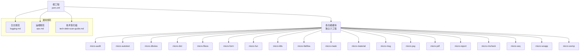
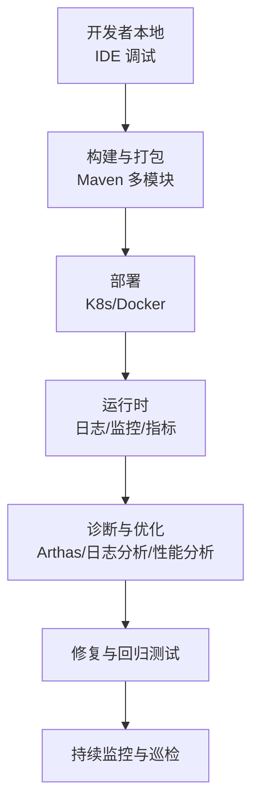
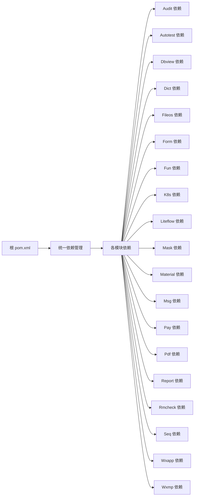

# 调试工具与技巧

<cite>
**本文引用的文件**
- [pom.xml](file://pom.xml)
- [README.md](file://README.md)
- [AGENTS.md](file://AGENTS.md)
- [CONTEXT.md](file://CONTEXT.md)
- [docs/living-docs-technical/architecture/deployment.md](file://docs/living-docs-technical/architecture/deployment.md)
- [docs/standards/logging.md](file://docs/standards/logging.md)
- [docs/standards/ops.md](file://docs/standards/ops.md)
- [docs/tech-debt-scan-guide.md](file://docs/tech-debt-scan-guide.md)
- [docs/tech-debt-conventions.md](file://docs/tech-debt-conventions.md)
- [micro-audit/src/main/java/com/wkclz/micro/audit/AuditAutoConfig.java](file://micro-audit/src/main/java/com/wkclz/micro/audit/AuditAutoConfig.java)
- [micro-audit/src/main/resources/META-INF/spring/org.springframework.boot.autoconfigure.AutoConfiguration.imports](file://micro-audit/src/main/resources/META-INF/spring/org.springframework.boot.autoconfigure.AutoConfiguration.imports)
- [micro-autotest/src/main/java/com/wkclz/auto/AutoTestAutoConfig.java](file://micro-autotest/src/main/java/com/wkclz/auto/AutoTestAutoConfig.java)
- [micro-autotest/src/main/resources/META-INF/spring/org.springframework.boot.autoconfigure.AutoConfiguration.imports](file://micro-autotest/src/main/resources/META-INF/spring/org.springframework.boot.autoconfigure.AutoConfiguration.imports)
- [micro-dbview/src/main/java/com/wkclz/micro/dbview/DbviewAutoConfig.java](file://micro-dbview/src/main/java/com/wkclz/micro/dbview/DbviewAutoConfig.java)
- [micro-dbview/src/main/resources/META-INF/spring/org.springframework.boot.autoconfigure.AutoConfiguration.imports](file://micro-dbview/src/main/resources/META-INF/spring/org.springframework.boot.autoconfigure.AutoConfiguration.imports)
- [micro-dict/src/main/java/com/wkclz/micro/dict/DictAutoConfig.java](file://micro-dict/src/main/java/com/wkclz/micro/dict/DictAutoConfig.java)
- [micro-dict/src/main/resources/META-INF/spring/org.springframework.boot.autoconfigure.AutoConfiguration.imports](file://micro-dict/src/main/resources/META-INF/spring/org.springframework.boot.autoconfigure.AutoConfiguration.imports)
- [micro-fileos/src/main/java/com/wkclz/micro/fileos/FileosAutoConfig.java](file://micro-fileos/src/main/java/com/wkclz/micro/fileos/FileosAutoConfig.java)
- [micro-fileos/src/main/resources/META-INF/spring/org.springframework.boot.autoconfigure.AutoConfiguration.imports](file://micro-fileos/src/main/resources/META-INF/spring/org.springframework.boot.autoconfigure.AutoConfiguration.imports)
- [micro-form/src/main/java/com/wkclz/micro/form/FormAutoConfig.java](file://micro-form/src/main/java/com/wkclz/micro/form/FormAutoConfig.java)
- [micro-form/src/main/resources/META-INF/spring/org.springframework.boot.autoconfigure.AutoConfiguration.imports](file://micro-form/src/main/resources/META-INF/spring/org.springframework.boot.autoconfigure.AutoConfiguration.imports)
- [micro-fun/src/main/java/com/wkclz/micro/fun/FunAutoConfig.java](file://micro-fun/src/main/java/com/wkclz/micro/fun/FunAutoConfig.java)
- [micro-fun/src/main/resources/META-INF/spring/org.springframework.boot.autoconfigure.AutoConfiguration.imports](file://micro-fun/src/main/resources/META-INF/spring/org.springframework.boot.autoconfigure.AutoConfiguration.imports)
- [micro-k8s/src/main/java/com/wkclz/micro/k8s/K8sAutoConfig.java](file://micro-k8s/src/main/java/com/wkclz/micro/k8s/K8sAutoConfig.java)
- [micro-k8s/src/main/resources/META-INF/spring/org.springframework.boot.autoconfigure.AutoConfiguration.imports](file://micro-k8s/src/main/resources/META-INF/spring/org.springframework.boot.autoconfigure.AutoConfiguration.imports)
- [micro-liteflow/src/main/java/com/wkclz/micro/liteflow/LiteFlowAutoConfig.java](file://micro-liteflow/src/main/java/com/wkclz/micro/liteflow/LiteFlowAutoConfig.java)
- [micro-liteflow/src/main/resources/META-INF/spring/org.springframework.boot.autoconfigure.AutoConfiguration.imports](file://micro-liteflow/src/main/resources/META-INF/spring/org.springframework.boot.autoconfigure.AutoConfiguration.imports)
- [micro-mask/src/main/java/com/wkclz/micro/mask/MaskAutoConfig.java](file://micro-mask/src/main/java/com/wkclz/micro/mask/MaskAutoConfig.java)
- [micro-mask/src/main/resources/META-INF/spring/org.springframework.boot.autoconfigure.AutoConfiguration.imports](file://micro-mask/src/main/resources/META-INF/spring/org.springframework.boot.autoconfigure.AutoConfiguration.imports)
- [micro-material/src/main/java/com/wkclz/micro/material/MaterialAutoConfig.java](file://micro-material/src/main/java/com/wkclz/micro/material/MaterialAutoConfig.java)
- [micro-material/src/main/resources/META-INF/spring/org.springframework.boot.autoconfigure.AutoConfiguration.imports](file://micro-material/src/main/resources/META-INF/spring/org.springframework.boot.autoconfigure.AutoConfiguration.imports)
- [micro-msg/src/main/java/com/wkclz/micro/msg/MsgAutoConfig.java](file://micro-msg/src/main/java/com/wkclz/micro/msg/MsgAutoConfig.java)
- [micro-msg/src/main/resources/META-INF/spring/org.springframework.boot.autoconfigure.AutoConfiguration.imports](file://micro-msg/src/main/resources/META-INF/spring/org.springframework.boot.autoconfigure.AutoConfiguration.imports)
- [micro-pay/src/main/java/com/wkclz/micro/pay/PayAutoConfig.java](file://micro-pay/src/main/java/com/wkclz/micro/pay/PayAutoConfig.java)
- [micro-pay/src/main/resources/META-INF/spring/org.springframework.boot.autoconfigure.AutoConfiguration.imports](file://micro-pay/src/main/resources/META-INF/spring/org.springframework.boot.autoconfigure.AutoConfiguration.imports)
- [micro-pdf/src/main/java/com/wkclz/micro/pdf/PdfAutoConfig.java](file://micro-pdf/src/main/java/com/wkclz/micro/pdf/PdfAutoConfig.java)
- [micro-pdf/src/main/resources/META-INF/spring/org.springframework.boot.autoconfigure.AutoConfiguration.imports](file://micro-pdf/src/main/resources/META-INF/spring/org.springframework.boot.autoconfigure.AutoConfiguration.imports)
- [micro-report/src/main/java/com/wkclz/micro/report/ReportAutoConfig.java](file://micro-report/src/main/java/com/wkclz/micro/report/ReportAutoConfig.java)
- [micro-report/src/main/resources/META-INF/spring/org.springframework.boot.autoconfigure.AutoConfiguration.imports](file://micro-report/src/main/resources/META-INF/spring/org.springframework.boot.autoconfigure.AutoConfiguration.imports)
- [micro-rmcheck/src/main/java/com/wkclz/micro/rmcheck/RmcheckAutoConfig.java](file://micro-rmcheck/src/main/java/com/wkclz/micro/rmcheck/RmcheckAutoConfig.java)
- [micro-rmcheck/src/main/resources/META-INF/spring/org.springframework.boot.autoconfigure.AutoConfiguration.imports](file://micro-rmcheck/src/main/resources/META-INF/spring/org.springframework.boot.autoconfigure.AutoConfiguration.imports)
- [micro-seq/src/main/java/com/wkclz/micro/seq/SeqAutoConfig.java](file://micro-seq/src/main/java/com/wkclz/micro/seq/SeqAutoConfig.java)
- [micro-seq/src/main/resources/META-INF/spring/org.springframework.boot.autoconfigure.AutoConfiguration.imports](file://micro-seq/src/main/resources/META-INF/spring/org.springframework.boot.autoconfigure.AutoConfiguration.imports)
- [micro-wxapp/src/main/java/com/wkclz/micro/wxapp/MicroAppAutoConfig.java](file://micro-wxapp/src/main/java/com/wkclz/micro/wxapp/MicroAppAutoConfig.java)
- [micro-wxapp/src/main/resources/META-INF/spring/org.springframework.boot.autoconfigure.AutoConfiguration.imports](file://micro-wxapp/src/main/resources/META-INF/spring/org.springframework.boot.autoconfigure.AutoConfiguration.imports)
- [micro-wxmp/src/main/java/com/wkclz/micro/wxmp/WxmpAutoConfig.java](file://micro-wxmp/src/main/java/com/wkclz/micro/wxmp/WxmpAutoConfig.java)
- [micro-wxmp/src/main/resources/META-INF/spring/org.springframework.boot.autoconfigure.AutoConfiguration.imports](file://micro-wxmp/src/main/resources/META-INF/spring/org.springframework.boot.autoconfigure.AutoConfiguration.imports)
</cite>

## 目录
1. [简介](#简介)
2. [项目结构](#项目结构)
3. [核心组件](#核心组件)
4. [架构总览](#架构总览)
5. [详细组件分析](#详细组件分析)
6. [依赖分析](#依赖分析)
7. [性能考虑](#性能考虑)
8. [故障排查指南](#故障排查指南)
9. [结论](#结论)
10. [附录](#附录)

## 简介
本文件面向 sh-microapp 微服务框架的开发者与运维人员，聚焦于“调试工具与技巧”。内容涵盖：
- IDE 调试器的配置与断点策略
- 日志采集、聚合与分析方法
- 性能监控与瓶颈识别（CPU、内存、线程、接口耗时）
- 代码审计与技术债扫描方法
- Arthas 在线诊断实操要点
- 典型问题定位流程与最佳实践

目标是帮助团队在开发、测试、灰度到生产的全链路中快速定位问题、稳定系统运行。

## 项目结构
sh-microapp 是一个基于 Spring Boot 的多模块微服务工程，采用模块化拆分，每个功能域独立封装为子模块（如 audit、autotest、dbview、dict、fileos、form、fun、k8s、liteflow、mask、material、msg、pay、pdf、report、rmcheck、seq、wxapp、wxmp）。各模块均提供自动装配配置类与 Spring Boot 自动导入清单，便于按需启用。

图示来源
- [pom.xml](file://pom.xml)
- [docs/standards/logging.md](file://docs/standards/logging.md)
- [docs/standards/ops.md](file://docs/standards/ops.md)
- [docs/tech-debt-scan-guide.md](file://docs/tech-debt-scan-guide.md)

章节来源
- [pom.xml](file://pom.xml)
- [README.md](file://README.md)
- [AGENTS.md](file://AGENTS.md)
- [CONTEXT.md](file://CONTEXT.md)

## 核心组件
- 自动装配与条件加载：各模块均提供 AutoConfig 类与 Spring 自动导入清单，确保模块可插拔启用。
- 接口路由与 REST 层：多数模块在 rest 包下定义路由与控制器，便于统一入口与调试。
- 业务服务层：service 包含核心业务逻辑，适合设置断点与单元测试验证。
- 数据访问层：mapper 与 XML 映射文件配合，便于 SQL 调试与慢查询定位。
- 配置与缓存：config 与 cache 包用于参数与热点数据缓存，便于定位配置错误与缓存一致性问题。

章节来源
- [micro-audit/src/main/java/com/wkclz/micro/audit/AuditAutoConfig.java](file://micro-audit/src/main/java/com/wkclz/micro/audit/AuditAutoConfig.java)
- [micro-autotest/src/main/java/com/wkclz/auto/AutoTestAutoConfig.java](file://micro-autotest/src/main/java/com/wkclz/auto/AutoTestAutoConfig.java)
- [micro-dbview/src/main/java/com/wkclz/micro/dbview/DbviewAutoConfig.java](file://micro-dbview/src/main/java/com/wkclz/micro/dbview/DbviewAutoConfig.java)
- [micro-dict/src/main/java/com/wkclz/micro/dict/DictAutoConfig.java](file://micro-dict/src/main/java/com/wkclz/micro/dict/DictAutoConfig.java)
- [micro-fileos/src/main/java/com/wkclz/micro/fileos/FileosAutoConfig.java](file://micro-fileos/src/main/java/com/wkclz/micro/fileos/FileosAutoConfig.java)
- [micro-form/src/main/java/com/wkclz/micro/form/FormAutoConfig.java](file://micro-form/src/main/java/com/wkclz/micro/form/FormAutoConfig.java)
- [micro-fun/src/main/java/com/wkclz/micro/fun/FunAutoConfig.java](file://micro-fun/src/main/java/com/wkclz/micro/fun/FunAutoConfig.java)
- [micro-k8s/src/main/java/com/wkclz/micro/k8s/K8sAutoConfig.java](file://micro-k8s/src/main/java/com/wkclz/micro/k8s/K8sAutoConfig.java)
- [micro-liteflow/src/main/java/com/wkclz/micro/liteflow/LiteFlowAutoConfig.java](file://micro-liteflow/src/main/java/com/wkclz/micro/liteflow/LiteFlowAutoConfig.java)
- [micro-mask/src/main/java/com/wkclz/micro/mask/MaskAutoConfig.java](file://micro-mask/src/main/java/com/wkclz/micro/mask/MaskAutoConfig.java)
- [micro-material/src/main/java/com/wkclz/micro/material/MaterialAutoConfig.java](file://micro-material/src/main/java/com/wkclz/micro/material/MaterialAutoConfig.java)
- [micro-msg/src/main/java/com/wkclz/micro/msg/MsgAutoConfig.java](file://micro-msg/src/main/java/com/wkclz/micro/msg/MsgAutoConfig.java)
- [micro-pay/src/main/java/com/wkclz/micro/pay/PayAutoConfig.java](file://micro-pay/src/main/java/com/wkclz/micro/pay/PayAutoConfig.java)
- [micro-pdf/src/main/java/com/wkclz/micro/pdf/PdfAutoConfig.java](file://micro-pdf/src/main/java/com/wkclz/micro/pdf/PdfAutoConfig.java)
- [micro-report/src/main/java/com/wkclz/micro/report/ReportAutoConfig.java](file://micro-report/src/main/java/com/wkclz/micro/report/ReportAutoConfig.java)
- [micro-rmcheck/src/main/java/com/wkclz/micro/rmcheck/RmcheckAutoConfig.java](file://micro-rmcheck/src/main/java/com/wkclz/micro/rmcheck/RmcheckAutoConfig.java)
- [micro-seq/src/main/java/com/wkclz/micro/seq/SeqAutoConfig.java](file://micro-seq/src/main/java/com/wkclz/micro/seq/SeqAutoConfig.java)
- [micro-wxapp/src/main/java/com/wkclz/micro/wxapp/MicroAppAutoConfig.java](file://micro-wxapp/src/main/java/com/wkclz/micro/wxapp/MicroAppAutoConfig.java)
- [micro-wxmp/src/main/java/com/wkclz/micro/wxmp/WxmpAutoConfig.java](file://micro-wxmp/src/main/java/com/wkclz/micro/wxmp/WxmpAutoConfig.java)

## 架构总览
从部署与运行视角，建议结合以下文档理解整体架构与调试关注点：
- 部署与运行环境：用于定位容器、端口、健康检查、日志路径等运行期信息
- 运维规范：用于明确监控指标、告警阈值、日志轮转与保留策略
- 技术债扫描：用于识别潜在风险点与回归隐患

图示来源
- [docs/living-docs-technical/architecture/deployment.md](file://docs/living-docs-technical/architecture/deployment.md)
- [docs/standards/ops.md](file://docs/standards/ops.md)

章节来源
- [docs/living-docs-technical/architecture/deployment.md](file://docs/living-docs-technical/architecture/deployment.md)
- [docs/standards/ops.md](file://docs/standards/ops.md)

## 详细组件分析

### 自动装配与模块启用
- 各模块通过 AutoConfig 类与 Spring 自动导入清单实现按需启用，便于在不同环境组合启用/禁用模块，降低调试面。
- 建议在本地开发时仅启用当前正在调试的模块，避免无关模块干扰。

```mermaid
classDiagram
class AuditAutoConfig
class AutoTestAutoConfig
class DbviewAutoConfig
class DictAutoConfig
class FileosAutoConfig
class FormAutoConfig
class FunAutoConfig
class K8sAutoConfig
class LiteFlowAutoConfig
class MaskAutoConfig
class MaterialAutoConfig
class MsgAutoConfig
class PayAutoConfig
class PdfAutoConfig
class ReportAutoConfig
class RmcheckAutoConfig
class SeqAutoConfig
class MicroAppAutoConfig
class WxmpAutoConfig
```

图示来源
- [micro-audit/src/main/java/com/wkclz/micro/audit/AuditAutoConfig.java](file://micro-audit/src/main/java/com/wkclz/micro/audit/AuditAutoConfig.java)
- [micro-autotest/src/main/java/com/wkclz/auto/AutoTestAutoConfig.java](file://micro-autotest/src/main/java/com/wkclz/auto/AutoTestAutoConfig.java)
- [micro-dbview/src/main/java/com/wkclz/micro/dbview/DbviewAutoConfig.java](file://micro-dbview/src/main/java/com/wkclz/micro/dbview/DbviewAutoConfig.java)
- [micro-dict/src/main/java/com/wkclz/micro/dict/DictAutoConfig.java](file://micro-dict/src/main/java/com/wkclz/micro/dict/DictAutoConfig.java)
- [micro-fileos/src/main/java/com/wkclz/micro/fileos/FileosAutoConfig.java](file://micro-fileos/src/main/java/com/wkclz/micro/fileos/FileosAutoConfig.java)
- [micro-form/src/main/java/com/wkclz/micro/form/FormAutoConfig.java](file://micro-form/src/main/java/com/wkclz/micro/form/FormAutoConfig.java)
- [micro-fun/src/main/java/com/wkclz/micro/fun/FunAutoConfig.java](file://micro-fun/src/main/java/com/wkclz/micro/fun/FunAutoConfig.java)
- [micro-k8s/src/main/java/com/wkclz/micro/k8s/K8sAutoConfig.java](file://micro-k8s/src/main/java/com/wkclz/micro/k8s/K8sAutoConfig.java)
- [micro-liteflow/src/main/java/com/wkclz/micro/liteflow/LiteFlowAutoConfig.java](file://micro-liteflow/src/main/java/com/wkclz/micro/liteflow/LiteFlowAutoConfig.java)
- [micro-mask/src/main/java/com/wkclz/micro/mask/MaskAutoConfig.java](file://micro-mask/src/main/java/com/wkclz/micro/mask/MaskAutoConfig.java)
- [micro-material/src/main/java/com/wkclz/micro/material/MaterialAutoConfig.java](file://micro-material/src/main/java/com/wkclz/micro/material/MaterialAutoConfig.java)
- [micro-msg/src/main/java/com/wkclz/micro/msg/MsgAutoConfig.java](file://micro-msg/src/main/java/com/wkclz/micro/msg/MsgAutoConfig.java)
- [micro-pay/src/main/java/com/wkclz/micro/pay/PayAutoConfig.java](file://micro-pay/src/main/java/com/wkclz/micro/pay/PayAutoConfig.java)
- [micro-pdf/src/main/java/com/wkclz/micro/pdf/PdfAutoConfig.java](file://micro-pdf/src/main/java/com/wkclz/micro/pdf/PdfAutoConfig.java)
- [micro-report/src/main/java/com/wkclz/micro/report/ReportAutoConfig.java](file://micro-report/src/main/java/com/wkclz/micro/report/ReportAutoConfig.java)
- [micro-rmcheck/src/main/java/com/wkclz/micro/rmcheck/RmcheckAutoConfig.java](file://micro-rmcheck/src/main/java/com/wkclz/micro/rmcheck/RmcheckAutoConfig.java)
- [micro-seq/src/main/java/com/wkclz/micro/seq/SeqAutoConfig.java](file://micro-seq/src/main/java/com/wkclz/micro/seq/SeqAutoConfig.java)
- [micro-wxapp/src/main/java/com/wkclz/micro/wxapp/MicroAppAutoConfig.java](file://micro-wxapp/src/main/java/com/wkclz/micro/wxapp/MicroAppAutoConfig.java)
- [micro-wxmp/src/main/java/com/wkclz/micro/wxmp/WxmpAutoConfig.java](file://micro-wxmp/src/main/java/com/wkclz/micro/wxmp/WxmpAutoConfig.java)

章节来源
- [micro-audit/src/main/resources/META-INF/spring/org.springframework.boot.autoconfigure.AutoConfiguration.imports](file://micro-audit/src/main/resources/META-INF/spring/org.springframework.boot.autoconfigure.AutoConfiguration.imports)
- [micro-autotest/src/main/resources/META-INF/spring/org.springframework.boot.autoconfigure.AutoConfiguration.imports](file://micro-autotest/src/main/resources/META-INF/spring/org.springframework.boot.autoconfigure.AutoConfiguration.imports)
- [micro-dbview/src/main/resources/META-INF/spring/org.springframework.boot.autoconfigure.AutoConfiguration.imports](file://micro-dbview/src/main/resources/META-INF/spring/org.springframework.boot.autoconfigure.AutoConfiguration.imports)
- [micro-dict/src/main/resources/META-INF/spring/org.springframework.boot.autoconfigure.AutoConfiguration.imports](file://micro-dict/src/main/resources/META-INF/spring/org.springframework.boot.autoconfigure.AutoConfiguration.imports)
- [micro-fileos/src/main/resources/META-INF/spring/org.springframework.boot.autoconfigure.AutoConfiguration.imports](file://micro-fileos/src/main/resources/META-INF/spring/org.springframework.boot.autoconfigure.AutoConfiguration.imports)
- [micro-form/src/main/resources/META-INF/spring/org.springframework.boot.autoconfigure.AutoConfiguration.imports](file://micro-form/src/main/resources/META-INF/spring/org.springframework.boot.autoconfigure.AutoConfiguration.imports)
- [micro-fun/src/main/resources/META-INF/spring/org.springframework.boot.autoconfigure.AutoConfiguration.imports](file://micro-fun/src/main/resources/META-INF/spring/org.springframework.boot.autoconfigure.AutoConfiguration.imports)
- [micro-k8s/src/main/resources/META-INF/spring/org.springframework.boot.autoconfigure.AutoConfiguration.imports](file://micro-k8s/src/main/resources/META-INF/spring/org.springframework.boot.autoconfigure.AutoConfiguration.imports)
- [micro-liteflow/src/main/resources/META-INF/spring/org.springframework.boot.autoconfigure.AutoConfiguration.imports](file://micro-liteflow/src/main/resources/META-INF/spring/org.springframework.boot.autoconfigure.AutoConfiguration.imports)
- [micro-mask/src/main/resources/META-INF/spring/org.springframework.boot.autoconfigure.AutoConfiguration.imports](file://micro-mask/src/main/resources/META-INF/spring/org.springframework.boot.autoconfigure.AutoConfiguration.imports)
- [micro-material/src/main/resources/META-INF/spring/org.springframework.boot.autoconfigure.AutoConfiguration.imports](file://micro-material/src/main/resources/META-INF/spring/org.springframework.boot.autoconfigure.AutoConfiguration.imports)
- [micro-msg/src/main/resources/META-INF/spring/org.springframework.boot.autoconfigure.AutoConfiguration.imports](file://micro-msg/src/main/resources/META-INF/spring/org.springframework.boot.autoconfigure.AutoConfiguration.imports)
- [micro-pay/src/main/resources/META-INF/spring/org.springframework.boot.autoconfigure.AutoConfiguration.imports](file://micro-pay/src/main/resources/META-INF/spring/org.springframework.boot.autoconfigure.AutoConfiguration.imports)
- [micro-pdf/src/main/resources/META-INF/spring/org.springframework.boot.autoconfigure.AutoConfiguration.imports](file://micro-pdf/src/main/resources/META-INF/spring/org.springframework.boot.autoconfigure.AutoConfiguration.imports)
- [micro-report/src/main/resources/META-INF/spring/org.springframework.boot.autoconfigure.AutoConfiguration.imports](file://micro-report/src/main/resources/META-INF/spring/org.springframework.boot.autoconfigure.AutoConfiguration.imports)
- [micro-rmcheck/src/main/resources/META-INF/spring/org.springframework.boot.autoconfigure.AutoConfiguration.imports](file://micro-rmcheck/src/main/resources/META-INF/spring/org.springframework.boot.autoconfigure.AutoConfiguration.imports)
- [micro-seq/src/main/resources/META-INF/spring/org.springframework.boot.autoconfigure.AutoConfiguration.imports](file://micro-seq/src/main/resources/META-INF/spring/org.springframework.boot.autoconfigure.AutoConfiguration.imports)
- [micro-wxapp/src/main/resources/META-INF/spring/org.springframework.boot.autoconfigure.AutoConfiguration.imports](file://micro-wxapp/src/main/resources/META-INF/spring/org.springframework.boot.autoconfigure.AutoConfiguration.imports)
- [micro-wxmp/src/main/resources/META-INF/spring/org.springframework.boot.autoconfigure.AutoConfiguration.imports](file://micro-wxmp/src/main/resources/META-INF/spring/org.springframework.boot.autoconfigure.AutoConfiguration.imports)

### 接口与路由调试
- REST 层通常位于各模块的 rest 包，便于统一入口与断点设置。
- 建议在控制器层设置断点，观察请求入参、响应结果与异常栈；在服务层设置断点，验证业务逻辑分支与边界条件。

### 数据访问层调试
- mapper 与 XML 映射文件配合 MyBatis 使用，适合定位 SQL 执行计划、慢查询与参数绑定问题。
- 建议开启 SQL 日志输出，结合慢查询阈值定位性能瓶颈。

### 缓存与配置调试
- cache 与 config 包常用于热点数据与参数缓存，便于定位配置错误与缓存一致性问题。
- 建议在缓存更新路径设置断点，观察缓存失效与重建时机。

## 依赖分析
- 模块间解耦：通过自动装配与条件加载实现松耦合，便于单独调试某模块。
- 外部依赖：日志、监控、数据库驱动、Spring 生态组件等由根 pom 统一管理，建议在本地与线上保持一致版本，避免“本地好使、线上报错”的差异。

图示来源
- [pom.xml](file://pom.xml)

章节来源
- [pom.xml](file://pom.xml)

## 性能考虑
- CPU/内存/线程：结合 JVM 参数与容器资源限制，观察 GC、堆外内存与线程池饱和情况。
- 接口耗时：对关键接口埋点或采样，识别慢调用与超时风险。
- SQL 性能：开启 SQL 日志与慢查询阈值，结合索引与执行计划优化。
- 缓存命中：观测缓存命中率与失效策略，避免热点与雪崩。

## 故障排查指南

### IDE 调试器
- 断点策略
  - 控制器层：请求入参、响应组装、异常捕获
  - 服务层：核心算法、分支判断、事务边界
  - 数据访问层：SQL 参数、返回集、异常栈
- 条件断点：针对高频场景设置条件断点，减少无效暂停
- 多线程：关注线程池、异步任务与并发安全

### 日志分析
- 日志规范：遵循统一字段、级别与格式，便于检索与聚合
- 关键字段：traceId、spanId、模块名、接口名、用户标识、耗时、状态码
- 分析步骤
  - 快速检索：根据 traceId 或关键词过滤
  - 时间轴：按时间顺序串联请求链路
  - 异常定位：从异常日志上溯调用栈，定位首现异常点
  - 关联分析：结合 SQL、缓存、外部依赖日志交叉验证

章节来源
- [docs/standards/logging.md](file://docs/standards/logging.md)

### 性能监控与瓶颈识别
- 指标体系：QPS、P95/P99、错误率、GC、堆内存、线程数、连接池占用
- 工具建议：Prometheus + Grafana、SkyWalking、Pinpoint、Arthas
- 步骤
  - 采集：在网关/服务侧埋点或接入探针
  - 可视化：建立仪表盘，设定阈值告警
  - 分析：对比基线与异常时段，定位资源争用与热点

### Arthas 在线诊断
- 适用场景
  - 线上问题复现困难、无法重启
  - 动态观察方法调用、线程状态、JVM 指标
  - 临时修改参数、热补丁验证
- 常用命令思路
  - dashboard：查看 CPU、内存、线程、GC
  - jvm/jstack：查看 JVM 详情与线程堆栈
  - sc/sca：搜索类与实例
  - sm/smc：查看方法签名与字节码增强
  - watch/trace：观察方法入参与返回，统计耗时
  - tt：方法实时记录与回放
  - profiler：火焰图定位 CPU 热点
- 注意事项
  - 严格权限控制与审计
  - 优先在低峰或灰度环境执行
  - 仅做最小化干预，尽快恢复

### 代码审计与技术债
- 方法论
  - 结构性审查：复杂度、循环嵌套、分支扇出
  - 规范性审查：命名、注释、异常处理、资源释放
  - 安全性审查：鉴权、脱敏、越权、注入风险
  - 可靠性审查：重试、熔断、降级、超时、幂等
- 工具与流程
  - 静态扫描：SonarQube、SpotBugs、Checkstyle、PMD
  - 人工评审：结对评审、走读、专题评审
  - 回归验证：修复后回归测试与冒烟验证
- 文档参考
  - 技术债扫描指南与约定

章节来源
- [docs/tech-debt-scan-guide.md](file://docs/tech-debt-scan-guide.md)
- [docs/tech-debt-conventions.md](file://docs/tech-debt-conventions.md)

### 典型调试案例与最佳实践
- 案例一：接口偶发超时
  - 步骤：抓取 traceId，串联日志与 SQL，定位慢查询与锁等待；结合线程堆栈确认阻塞点；优化索引与分页
  - 最佳实践：为关键接口增加超时与熔断，完善重试策略
- 案例二：缓存击穿
  - 步骤：观测缓存命中率与穿透请求，确认热点 key；引入互斥锁或永不过期兜底
  - 最佳实践：区分冷热数据，制定差异化过期策略
- 案例三：内存泄漏
  - 步骤：对比 GC 日志与堆快照，定位对象增长；结合 Arthas 查看线程局部变量与静态集合
  - 最佳实践：规范资源释放与缓存清理，定期巡检

## 结论
通过规范的日志与监控、完善的自动装配与模块化设计、以及系统化的调试与审计流程，sh-microapp 能够在复杂业务场景中保持高可用与可维护性。建议团队将调试工具与技巧纳入日常开发流程，形成“发现问题—定位问题—修复验证—持续监控”的闭环。

## 附录
- 开发与调试常用命令
  - Maven：编译、测试、打包、安装
  - Docker：镜像构建与容器运行
  - K8s：部署、滚动更新、日志查看、端口转发
- 常见问题排查清单
  - 网络连通性、DNS 解析、端口占用
  - 数据库连接、事务隔离、锁竞争
  - 缓存一致性、过期策略、容量上限
  - 文件存储权限、签名与桶配置
  - 微信接口回调、签名验证、幂等处理