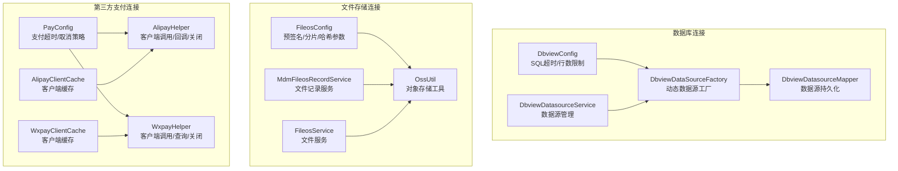
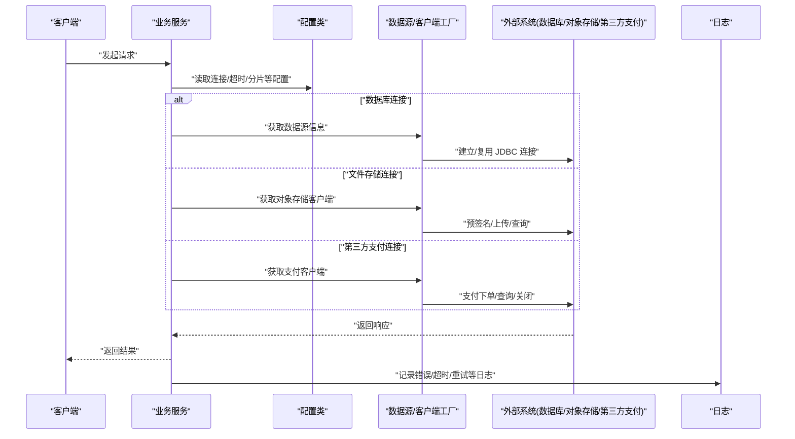
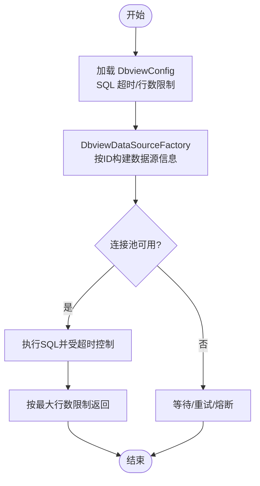
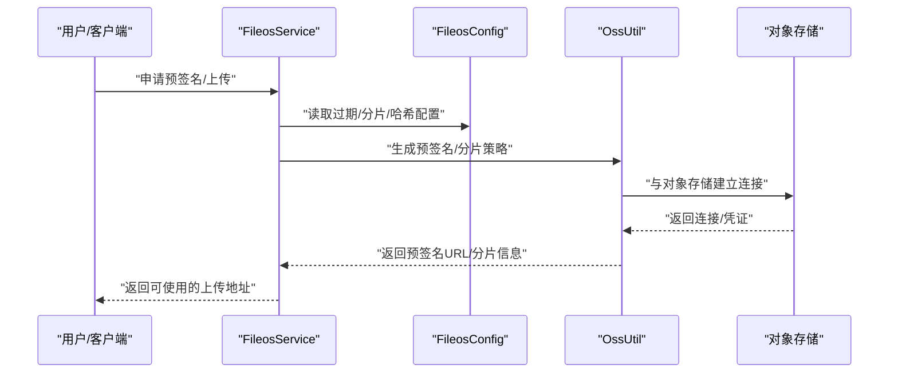
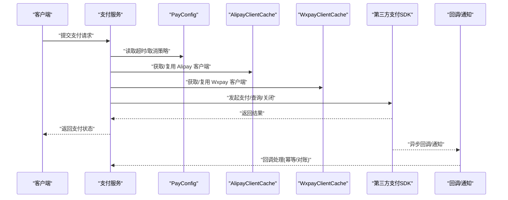
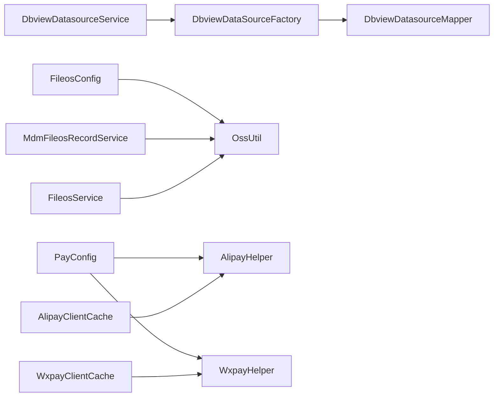

# 连接问题排查

<cite>
**本文引用的文件**
- [DbviewConfig.java](file://micro-dbview/src/main/java/com/wkclz/micro/dbview/config/DbviewConfig.java)
- [DbviewDataSourceFactory.java](file://micro-dbview/src/main/java/com/wkclz/micro/dbview/config/DbviewDataSourceFactory.java)
- [FileosConfig.java](file://micro-fileos/src/main/java/com/wkclz/micro/fileos/config/FileosConfig.java)
- [PayConfig.java](file://micro-pay/src/main/java/com/wkclz/micro/pay/config/PayConfig.java)
- [AlipayHelper.java](file://micro-pay/src/main/java/com/wkclz/micro/pay/helper/AlipayHelper.java)
- [AlipayClientCache.java](file://micro-pay/src/main/java/com/wkclz/micro/pay/cache/AlipayClientCache.java)
- [PayOrderService.java](file://micro-pay/src/main/java/com/wkclz/micro/pay/service/PayOrderService.java)
- [WxpayHelper.java](file://micro-pay/src/main/java/com/wkclz/micro/pay/helper/WxpayHelper.java)
- [WxpayClientCache.java](file://micro-pay/src/main/java/com/wkclz/micro/pay/cache/WxpayClientCache.java)
- [MdmFileosRecordService.java](file://micro-fileos/src/main/java/com/wkclz/micro/fileos/service/MdmFileosRecordService.java)
- [FileosService.java](file://micro-fileos/src/main/java/com/wkclz/micro/fileos/service/FileosService.java)
- [OssUtil.java](file://micro-fileos/src/main/java/com/wkclz/micro/fileos/utils/OssUtil.java)
- [DbviewConnectionService.java](file://micro-dbview/src/main/java/com/wkclz/micro/dbview/service/DbviewConnectionService.java)
- [DbviewDatasourceService.java](file://micro-dbview/src/main/java/com/wkclz/micro/dbview/service/DbviewDatasourceService.java)
- [DbviewDatasourceMapper.java](file://micro-dbview/src/main/java/com/wkclz/micro/dbview/mapper/DbviewDatasourceMapper.java)
- [DbviewDatasource.java](file://micro-dbview/src/main/java/com/wkclz/micro/dbview/bean/entity/DbviewDatasource.java)
- [application.yml](file://micro-pay/src/main/resources/config/application.yml)
- [application.yml](file://micro-fileos/src/main/resources/config/application.yml)
- [application.yml](file://micro-dbview/src/main/resources/config/application.yml)
</cite>

## 目录
1. 引言
2. 项目结构
3. 核心组件
4. 架构总览
5. 详细组件分析
6. 依赖关系分析
7. 性能考量
8. 故障排查指南
9. 结论
10. 附录

## 引言
本文件面向 sh-microapp 微服务框架，聚焦“连接问题”的系统化排查与优化，覆盖数据库连接池、缓存/第三方服务连接、文件存储服务连接等常见场景。内容包括：
- 连接超时、连接池耗尽、Redis/第三方 SDK 连接异常、文件存储连接失败的诊断步骤
- 连接状态监控、连接池配置分析与性能优化建议
- 日志分析技巧、配置调整建议与最佳实践及故障恢复策略

## 项目结构
围绕连接问题的关键模块与文件：
- 数据库连接：Dbview 模块通过动态数据源工厂加载 JDBC 配置，配合配置类控制 SQL 超时与结果集上限
- 文件存储连接：FileOS 模块通过配置类与工具类封装对象存储访问参数与行为
- 第三方支付连接：Pay 模块通过 Alipay/Wxpay 客户端缓存与配置类管理支付通道连接与超时策略
- 缓存与连接池：结合各模块配置与外部环境变量进行统一治理

图示来源
- [DbviewConfig.java:1-24](file://micro-dbview/src/main/java/com/wkclz/micro/dbview/config/DbviewConfig.java#L1-L24)
- [DbviewDataSourceFactory.java:1-30](file://micro-dbview/src/main/java/com/wkclz/micro/dbview/config/DbviewDataSourceFactory.java#L1-L30)
- [FileosConfig.java:1-49](file://micro-fileos/src/main/java/com/wkclz/micro/fileos/config/FileosConfig.java#L1-L49)
- [PayConfig.java:1-25](file://micro-pay/src/main/java/com/wkclz/micro/pay/config/PayConfig.java#L1-L25)
- [AlipayHelper.java:1-380](file://micro-pay/src/main/java/com/wkclz/micro/pay/helper/AlipayHelper.java#L1-L380)
- [AlipayClientCache.java](file://micro-pay/src/main/java/com/wkclz/micro/pay/cache/AlipayClientCache.java)
- [WxpayHelper.java](file://micro-pay/src/main/java/com/wkclz/micro/pay/helper/WxpayHelper.java)
- [WxpayClientCache.java](file://micro-pay/src/main/java/com/wkclz/micro/pay/cache/WxpayClientCache.java)

章节来源
- [DbviewConfig.java:1-24](file://micro-dbview/src/main/java/com/wkclz/micro/dbview/config/DbviewConfig.java#L1-L24)
- [DbviewDataSourceFactory.java:1-30](file://micro-dbview/src/main/java/com/wkclz/micro/dbview/config/DbviewDataSourceFactory.java#L1-L30)
- [FileosConfig.java:1-49](file://micro-fileos/src/main/java/com/wkclz/micro/fileos/config/FileosConfig.java#L1-L49)
- [PayConfig.java:1-25](file://micro-pay/src/main/java/com/wkclz/micro/pay/config/PayConfig.java#L1-L25)
- [AlipayHelper.java:1-380](file://micro-pay/src/main/java/com/wkclz/micro/pay/helper/AlipayHelper.java#L1-L380)

## 核心组件
- 数据库连接配置与工厂
  - DbviewConfig：定义 SQL 超时秒数、最大返回行数、元数据缓存 TTL 等
  - DbviewDataSourceFactory：按数据源 ID 动态构建 DataSourceInfo（JDBC URL、用户名、密码）
- 文件存储连接配置
  - FileosConfig：预签名过期时间、分片过期与默认分片大小、哈希算法与开关等
- 第三方支付连接配置
  - PayConfig：支付状态同步开关、支付超时取消开关与分钟数
  - AlipayHelper/WxpayHelper：封装支付下单、查询、关闭、回调等调用链路
  - AlipayClientCache/WxpayClientCache：第三方 SDK 客户端缓存，避免重复初始化带来的连接/认证开销

章节来源
- [DbviewConfig.java:10-23](file://micro-dbview/src/main/java/com/wkclz/micro/dbview/config/DbviewConfig.java#L10-L23)
- [DbviewDataSourceFactory.java:16-28](file://micro-dbview/src/main/java/com/wkclz/micro/dbview/config/DbviewDataSourceFactory.java#L16-L28)
- [FileosConfig.java:11-41](file://micro-fileos/src/main/java/com/wkclz/micro/fileos/config/FileosConfig.java#L11-L41)
- [PayConfig.java:14-22](file://micro-pay/src/main/java/com/wkclz/micro/pay/config/PayConfig.java#L14-L22)
- [AlipayHelper.java:50-159](file://micro-pay/src/main/java/com/wkclz/micro/pay/helper/AlipayHelper.java#L50-L159)
- [AlipayClientCache.java](file://micro-pay/src/main/java/com/wkclz/micro/pay/cache/AlipayClientCache.java)
- [WxpayHelper.java](file://micro-pay/src/main/java/com/wkclz/micro/pay/helper/WxpayHelper.java)
- [WxpayClientCache.java](file://micro-pay/src/main/java/com/wkclz/micro/pay/cache/WxpayClientCache.java)

## 架构总览
下图展示连接相关的关键交互路径：从配置到工厂/缓存再到具体服务调用。

图示来源
- [DbviewConfig.java:10-23](file://micro-dbview/src/main/java/com/wkclz/micro/dbview/config/DbviewConfig.java#L10-L23)
- [DbviewDataSourceFactory.java:16-28](file://micro-dbview/src/main/java/com/wkclz/micro/dbview/config/DbviewDataSourceFactory.java#L16-L28)
- [FileosConfig.java:11-41](file://micro-fileos/src/main/java/com/wkclz/micro/fileos/config/FileosConfig.java#L11-L41)
- [PayConfig.java:14-22](file://micro-pay/src/main/java/com/wkclz/micro/pay/config/PayConfig.java#L14-L22)
- [AlipayHelper.java:50-159](file://micro-pay/src/main/java/com/wkclz/micro/pay/helper/AlipayHelper.java#L50-L159)

## 详细组件分析

### 数据库连接池与超时
- 关键点
  - SQL 超时由 DbviewConfig 控制，避免慢查询阻塞线程池
  - 最大返回行数与行数上限用于保护内存与网络带宽
  - 动态数据源工厂按数据源 ID 加载 JDBC 凭证，确保凭据安全与隔离
- 排查要点
  - 观察慢查询与超时日志，核对 SQL 超时阈值是否合理
  - 检查连接池大小与等待队列，避免连接池耗尽导致排队超时
  - 核对数据源凭据是否正确，避免认证失败引发重试风暴
- 优化建议
  - 合理设置 SQL 超时与分页查询，避免一次性拉取过多数据
  - 对热点查询加索引或改写 SQL，降低锁等待与扫描范围
  - 连接池参数与应用实例数匹配，避免过度扩容造成上下文切换

图示来源
- [DbviewConfig.java:10-23](file://micro-dbview/src/main/java/com/wkclz/micro/dbview/config/DbviewConfig.java#L10-L23)
- [DbviewDataSourceFactory.java:16-28](file://micro-dbview/src/main/java/com/wkclz/micro/dbview/config/DbviewDataSourceFactory.java#L16-L28)

章节来源
- [DbviewConfig.java:10-23](file://micro-dbview/src/main/java/com/wkclz/micro/dbview/config/DbviewConfig.java#L10-L23)
- [DbviewDataSourceFactory.java:16-28](file://micro-dbview/src/main/java/com/wkclz/micro/dbview/config/DbviewDataSourceFactory.java#L16-L28)

### 文件存储服务连接失败
- 关键点
  - FileosConfig 提供预签名过期时间、分片过期与默认分片大小、哈希算法与开关
  - FileosService/MdmFileosRecordService 依赖对象存储工具进行上传/下载/签名
- 排查要点
  - 核对预签名过期时间是否过短导致客户端无法完成上传
  - 分片过期与分片大小是否与网络波动匹配，避免中途失败
  - 哈希计算是否启用，以及算法是否与前端一致
- 优化建议
  - 在弱网环境下适当提高预签名与分片过期时间
  - 对大文件采用分片并发上传，结合断点续传
  - 使用 CDN/边缘节点就近接入，减少跨域与网络抖动

图示来源
- [FileosConfig.java:11-41](file://micro-fileos/src/main/java/com/wkclz/micro/fileos/config/FileosConfig.java#L11-L41)
- [OssUtil.java](file://micro-fileos/src/main/java/com/wkclz/micro/fileos/utils/OssUtil.java)

章节来源
- [FileosConfig.java:11-41](file://micro-fileos/src/main/java/com/wkclz/micro/fileos/config/FileosConfig.java#L11-L41)
- [OssUtil.java](file://micro-fileos/src/main/java/com/wkclz/micro/fileos/utils/OssUtil.java)

### 第三方支付连接异常
- 关键点
  - PayConfig 控制支付超时取消策略与开关
  - AlipayHelper/WxpayHelper 封装支付下单、查询、关闭、回调等流程
  - AlipayClientCache/WxpayClientCache 复用客户端，降低初始化成本
- 排查要点
  - 核对支付回调地址与签名公钥是否正确，避免回调被拒
  - 检查第三方 SDK 的网络连通性与证书有效性
  - 关注支付超时取消任务是否按预期触发
- 优化建议
  - 对外请求增加幂等与重试策略，避免重复扣款
  - 回调处理幂等校验与最终一致性保障
  - 对高频支付场景增加限流与熔断，防止雪崩

图示来源
- [PayConfig.java:14-22](file://micro-pay/src/main/java/com/wkclz/micro/pay/config/PayConfig.java#L14-L22)
- [AlipayHelper.java:50-159](file://micro-pay/src/main/java/com/wkclz/micro/pay/helper/AlipayHelper.java#L50-L159)
- [AlipayClientCache.java](file://micro-pay/src/main/java/com/wkclz/micro/pay/cache/AlipayClientCache.java)
- [WxpayHelper.java](file://micro-pay/src/main/java/com/wkclz/micro/pay/helper/WxpayHelper.java)
- [WxpayClientCache.java](file://micro-pay/src/main/java/com/wkclz/micro/pay/cache/WxpayClientCache.java)

章节来源
- [PayConfig.java:14-22](file://micro-pay/src/main/java/com/wkclz/micro/pay/config/PayConfig.java#L14-L22)
- [AlipayHelper.java:50-159](file://micro-pay/src/main/java/com/wkclz/micro/pay/helper/AlipayHelper.java#L50-L159)

## 依赖关系分析
- 组件耦合
  - Dbview 模块内部通过 Mapper/Service/Factory 形成清晰分层，外部仅依赖配置类
  - FileOS 模块通过 Config 与 Utils 解耦具体对象存储实现细节
  - Pay 模块通过 ClientCache 与 Helper 抽象第三方 SDK 调用
- 外部依赖
  - 数据库驱动与连接池（由上层框架或容器提供）
  - 对象存储服务（OSS/S3 等）
  - 第三方支付平台（支付宝/微信支付）

图示来源
- [DbviewDataSourceFactory.java:1-30](file://micro-dbview/src/main/java/com/wkclz/micro/dbview/config/DbviewDataSourceFactory.java#L1-L30)
- [DbviewDatasourceMapper.java](file://micro-dbview/src/main/java/com/wkclz/micro/dbview/mapper/DbviewDatasourceMapper.java)
- [DbviewDatasourceService.java](file://micro-dbview/src/main/java/com/wkclz/micro/dbview/service/DbviewDatasourceService.java)
- [FileosConfig.java:1-49](file://micro-fileos/src/main/java/com/wkclz/micro/fileos/config/FileosConfig.java#L1-L49)
- [OssUtil.java](file://micro-fileos/src/main/java/com/wkclz/micro/fileos/utils/OssUtil.java)
- [MdmFileosRecordService.java](file://micro-fileos/src/main/java/com/wkclz/micro/fileos/service/MdmFileosRecordService.java)
- [FileosService.java](file://micro-fileos/src/main/java/com/wkclz/micro/fileos/service/FileosService.java)
- [PayConfig.java:1-25](file://micro-pay/src/main/java/com/wkclz/micro/pay/config/PayConfig.java#L1-L25)
- [AlipayHelper.java:1-380](file://micro-pay/src/main/java/com/wkclz/micro/pay/helper/AlipayHelper.java#L1-L380)
- [AlipayClientCache.java](file://micro-pay/src/main/java/com/wkclz/micro/pay/cache/AlipayClientCache.java)
- [WxpayHelper.java](file://micro-pay/src/main/java/com/wkclz/micro/pay/helper/WxpayHelper.java)
- [WxpayClientCache.java](file://micro-pay/src/main/java/com/wkclz/micro/pay/cache/WxpayClientCache.java)

## 性能考量
- 数据库
  - 合理设置 SQL 超时，避免长事务占用连接
  - 对热点表建索引，减少全表扫描
  - 使用分页查询与 LIMIT 控制返回量
- 文件存储
  - 预签名与分片过期时间与网络质量匹配
  - 并发分片上传，结合断点续传
- 第三方支付
  - 回调幂等与最终一致性
  - 对高频场景限流与熔断，避免下游压力过大

## 故障排查指南

### 数据库连接超时
- 现象
  - SQL 执行超时报错，影响用户体验与吞吐
- 排查步骤
  - 检查 DbviewConfig 中 SQL 超时与最大返回行数是否合理
  - 查看慢查询日志，定位耗时 SQL 并优化
  - 核对连接池参数与实例数，避免超时排队
- 相关位置
  - [DbviewConfig.java](file://micro-dbview/src/main/java/com/wkclz/micro/dbview/config/DbviewConfig.java#L16)
  - [DbviewConnectionService.java](file://micro-dbview/src/main/java/com/wkclz/micro/dbview/service/DbviewConnectionService.java)
  - [DbviewDatasourceService.java](file://micro-dbview/src/main/java/com/wkclz/micro/dbview/service/DbviewDatasourceService.java)

章节来源
- [DbviewConfig.java](file://micro-dbview/src/main/java/com/wkclz/micro/dbview/config/DbviewConfig.java#L16)
- [DbviewConnectionService.java](file://micro-dbview/src/main/java/com/wkclz/micro/dbview/service/DbviewConnectionService.java)
- [DbviewDatasourceService.java](file://micro-dbview/src/main/java/com/wkclz/micro/dbview/service/DbviewDatasourceService.java)

### 连接池耗尽
- 现象
  - 新请求排队超时或拒绝
- 排查步骤
  - 检查连接池最大连接数与最小空闲数
  - 观察活跃连接数与等待队列长度
  - 核查是否存在未释放连接（事务未提交/回滚、异常分支未关闭）
- 相关位置
  - [DbviewDataSourceFactory.java:17-28](file://micro-dbview/src/main/java/com/wkclz/micro/dbview/config/DbviewDataSourceFactory.java#L17-L28)

章节来源
- [DbviewDataSourceFactory.java:17-28](file://micro-dbview/src/main/java/com/wkclz/micro/dbview/config/DbviewDataSourceFactory.java#L17-L28)

### Redis 连接异常（通用）
- 现象
  - 缓存读写失败、超时或连接拒绝
- 排查步骤
  - 检查 Redis 地址、端口、认证信息
  - 核对网络连通性与防火墙策略
  - 观察连接池配置与最大连接数
- 相关位置
  - 各模块缓存使用处（如 AlipayClientCache/WxpayClientCache 的缓存实现）

章节来源
- [AlipayClientCache.java](file://micro-pay/src/main/java/com/wkclz/micro/pay/cache/AlipayClientCache.java)
- [WxpayClientCache.java](file://micro-pay/src/main/java/com/wkclz/micro/pay/cache/WxpayClientCache.java)

### 第三方服务连接失败（以支付为例）
- 现象
  - 支付下单/查询/关闭失败；回调签名验证失败
- 排查步骤
  - 核对支付回调地址与签名公钥
  - 检查第三方 SDK 的网络连通性与证书
  - 查看支付超时取消策略是否生效
- 相关位置
  - [AlipayHelper.java:117-122](file://micro-pay/src/main/java/com/wkclz/micro/pay/helper/AlipayHelper.java#L117-L122)
  - [AlipayHelper.java:341-362](file://micro-pay/src/main/java/com/wkclz/micro/pay/helper/AlipayHelper.java#L341-L362)
  - [PayConfig.java:17-22](file://micro-pay/src/main/java/com/wkclz/micro/pay/config/PayConfig.java#L17-L22)

章节来源
- [AlipayHelper.java:117-122](file://micro-pay/src/main/java/com/wkclz/micro/pay/helper/AlipayHelper.java#L117-L122)
- [AlipayHelper.java:341-362](file://micro-pay/src/main/java/com/wkclz/micro/pay/helper/AlipayHelper.java#L341-L362)
- [PayConfig.java:17-22](file://micro-pay/src/main/java/com/wkclz/micro/pay/config/PayConfig.java#L17-L22)

### 文件存储服务连接失败
- 现象
  - 预签名失败、上传中断、分片过期
- 排查步骤
  - 检查预签名过期时间与分片过期时间
  - 核对对象存储凭证与权限
  - 观察网络抖动与跨域配置
- 相关位置
  - [FileosConfig.java:24-34](file://micro-fileos/src/main/java/com/wkclz/micro/fileos/config/FileosConfig.java#L24-L34)
  - [OssUtil.java](file://micro-fileos/src/main/java/com/wkclz/micro/fileos/utils/OssUtil.java)

章节来源
- [FileosConfig.java:24-34](file://micro-fileos/src/main/java/com/wkclz/micro/fileos/config/FileosConfig.java#L24-L34)
- [OssUtil.java](file://micro-fileos/src/main/java/com/wkclz/micro/fileos/utils/OssUtil.java)

### 日志分析技巧
- 关键日志点
  - 数据库：SQL 超时、慢查询、连接池等待
  - 文件存储：预签名生成、分片上传、对象存储返回码
  - 支付：下单请求/响应、回调签名、关闭/查询结果
- 建议
  - 为每个连接/调用链路打上 TraceId，便于串联日志
  - 区分 WARN/ERROR 级别，快速定位异常
  - 对重试/熔断场景记录上下文参数（租户、订单号、文件名等）

章节来源
- [AlipayHelper.java:117-122](file://micro-pay/src/main/java/com/wkclz/micro/pay/helper/AlipayHelper.java#L117-L122)
- [AlipayHelper.java:341-362](file://micro-pay/src/main/java/com/wkclz/micro/pay/helper/AlipayHelper.java#L341-L362)
- [FileosConfig.java:24-34](file://micro-fileos/src/main/java/com/wkclz/micro/fileos/config/FileosConfig.java#L24-L34)
- [DbviewConfig.java](file://micro-dbview/src/main/java/com/wkclz/micro/dbview/config/DbviewConfig.java#L16)

### 配置调整建议
- 数据库
  - SQL 超时：根据业务峰值与慢查询比例动态调整
  - 最大返回行数：避免一次性拉取过多数据
- 文件存储
  - 预签名与分片过期：结合网络质量与上传规模
  - 哈希算法：前后端保持一致，避免校验失败
- 支付
  - 支付超时取消：开启并设置合理分钟数
  - 回调签名：确保公钥与编码一致

章节来源
- [DbviewConfig.java:12-23](file://micro-dbview/src/main/java/com/wkclz/micro/dbview/config/DbviewConfig.java#L12-L23)
- [FileosConfig.java:11-41](file://micro-fileos/src/main/java/com/wkclz/micro/fileos/config/FileosConfig.java#L11-L41)
- [PayConfig.java:17-22](file://micro-pay/src/main/java/com/wkclz/micro/pay/config/PayConfig.java#L17-L22)

### 最佳实践与故障恢复策略
- 最佳实践
  - 对外请求幂等、重试与熔断
  - 连接/客户端复用，避免频繁初始化
  - 严格的参数校验与超时控制
- 故障恢复
  - 自动降级：连接池耗尽时走本地缓存或快速失败
  - 回滚补偿：支付回调失败时定期重试与对账
  - 快速止损：超时/异常达到阈值时熔断并报警

## 结论
通过对数据库、文件存储与第三方支付三类连接场景的系统化梳理，可以形成“配置—工厂/缓存—服务—日志”的闭环排查思路。建议在生产环境中持续监控连接状态、优化超时与分片策略，并建立完善的日志与告警体系，以提升整体稳定性与可维护性。

## 附录
- 配置文件位置参考
  - [application.yml](file://micro-pay/src/main/resources/config/application.yml)
  - [application.yml](file://micro-fileos/src/main/resources/config/application.yml)
  - [application.yml](file://micro-dbview/src/main/resources/config/application.yml)
- 数据模型参考
  - [DbviewDatasource.java](file://micro-dbview/src/main/java/com/wkclz/micro/dbview/bean/entity/DbviewDatasource.java)