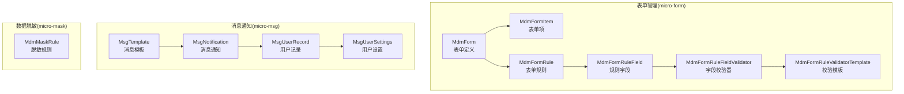
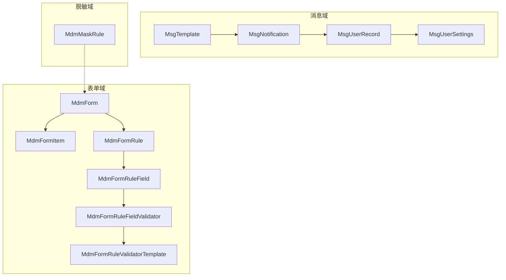
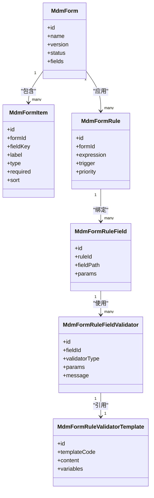
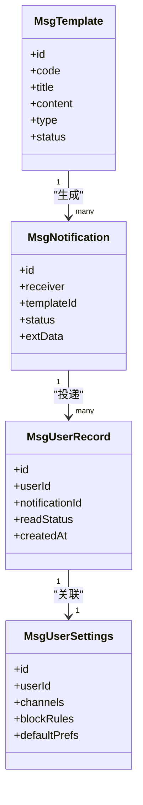
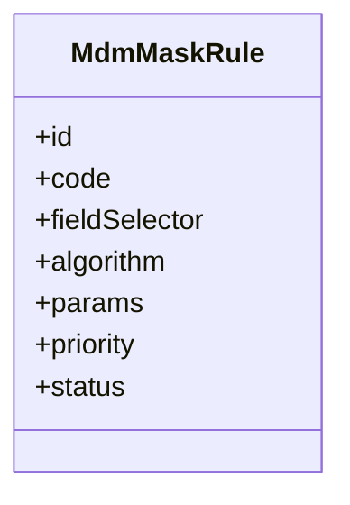
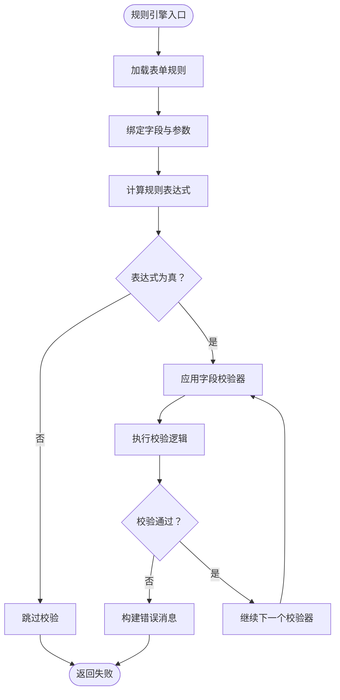
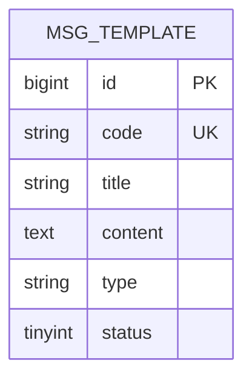
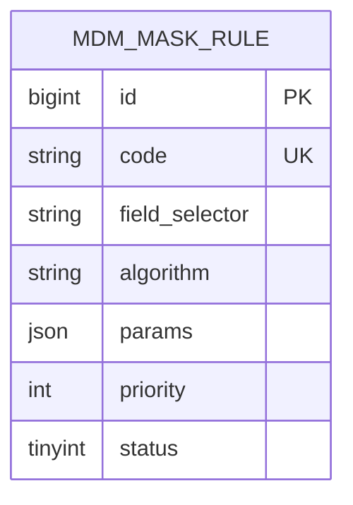
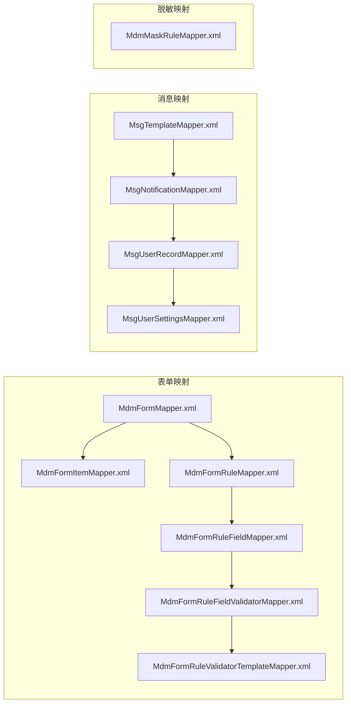

# 业务数据模型

<cite>
**本文引用的文件**
- [MdmForm.java](file://micro-form/src/main/java/com/wkclz/micro/form/bean/entity/MdmForm.java)
- [MdmFormRule.java](file://micro-form/src/main/java/com/wkclz/micro/form/bean/entity/MdmFormRule.java)
- [MdmFormItem.java](file://micro-form/src/main/java/com/wkclz/micro/form/bean/entity/MdmFormItem.java)
- [MdmFormRuleField.java](file://micro-form/src/main/java/com/wkclz/micro/form/bean/entity/MdmFormRuleField.java)
- [MdmFormRuleFieldValidator.java](file://micro-form/src/main/java/com/wkclz/micro/form/bean/entity/MdmFormRuleFieldValidator.java)
- [MdmFormRuleValidatorTemplate.java](file://micro-form/src/main/java/com/wkclz/micro/form/bean/entity/MdmFormRuleValidatorTemplate.java)
- [MsgTemplate.java](file://micro-msg/src/main/java/com/wkclz/micro/msg/bean/entity/MsgTemplate.java)
- [MsgNotification.java](file://micro-msg/src/main/java/com/wkclz/micro/msg/bean/entity/MsgNotification.java)
- [MsgUserRecord.java](file://micro-msg/src/main/java/com/wkclz/micro/msg/bean/entity/MsgUserRecord.java)
- [MsgUserSettings.java](file://micro-msg/src/main/java/com/wkclz/micro/msg/bean/entity/MsgUserSettings.java)
- [MdmMaskRule.java](file://micro-mask/src/main/java/com/wkclz/micro/mask/bean/entity/MdmMaskRule.java)
- [MdmFormMapper.xml](file://micro-form/src/main/resources/mapper/MdmFormMapper.xml)
- [MdmFormRuleMapper.xml](file://micro-form/src/main/resources/mapper/MdmFormRuleMapper.xml)
- [MdmFormItemMapper.xml](file://micro-form/src/main/resources/mapper/MdmFormItemMapper.xml)
- [MdmFormRuleFieldMapper.xml](file://micro-form/src/main/resources/mapper/MdmFormRuleFieldMapper.xml)
- [MdmFormRuleFieldValidatorMapper.xml](file://micro-form/src/main/resources/mapper/MdmFormRuleFieldValidatorMapper.xml)
- [MdmFormRuleValidatorTemplateMapper.xml](file://micro-form/src/main/resources/mapper/MdmFormRuleValidatorTemplateMapper.xml)
- [MsgTemplateMapper.xml](file://micro-msg/src/main/resources/mapper/MsgTemplateMapper.xml)
- [MsgNotificationMapper.xml](file://micro-msg/src/main/resources/mapper/MsgNotificationMapper.xml)
- [MsgUserRecordMapper.xml](file://micro-msg/src/main/resources/mapper/MsgUserRecordMapper.xml)
- [MsgUserSettingsMapper.xml](file://micro-msg/src/main/resources/mapper/MsgUserSettingsMapper.xml)
- [MdmMaskRuleMapper.xml](file://micro-mask/src/main/resources/mapper/MdmMaskRuleMapper.xml)
</cite>

## 目录
1. [引言](#引言)
2. [项目结构](#项目结构)
3. [核心组件](#核心组件)
4. [架构概览](#架构概览)
5. [详细组件分析](#详细组件分析)
6. [依赖分析](#依赖分析)
7. [性能考虑](#性能考虑)
8. [故障排除指南](#故障排除指南)
9. [结论](#结论)
10. [附录](#附录)

## 引言
本文档聚焦于业务数据模型，深入解析表单管理、消息通知和数据脱敏三大业务域的核心实体设计。重点覆盖以下实体的字段定义与业务逻辑：
- 表单管理：MdmForm、MdmFormRule、MdmFormItem、MdmFormRuleField、MdmFormRuleFieldValidator、MdmFormRuleValidatorTemplate
- 消息通知：MsgTemplate、MsgNotification、MsgUserRecord、MsgUserSettings
- 数据脱敏：MdmMaskRule

同时阐述表单规则引擎的数据结构设计、消息模板的存储格式以及脱敏规则的数据模型与配置方式，并提供实体关系图与数据流转说明，辅以实际业务场景与使用示例。

## 项目结构
围绕业务数据模型，相关代码分布在三个微服务模块中：
- micro-form：表单管理与规则引擎
- micro-msg：消息通知与用户设置
- micro-mask：数据脱敏规则管理

**图表来源**
- [MdmForm.java:1-200](file://micro-form/src/main/java/com/wkclz/micro/form/bean/entity/MdmForm.java#L1-L200)
- [MdmFormItem.java:1-200](file://micro-form/src/main/java/com/wkclz/micro/form/bean/entity/MdmFormItem.java#L1-L200)
- [MdmFormRule.java:1-200](file://micro-form/src/main/java/com/wkclz/micro/form/bean/entity/MdmFormRule.java#L1-L200)
- [MdmFormRuleField.java:1-200](file://micro-form/src/main/java/com/wkclz/micro/form/bean/entity/MdmFormRuleField.java#L1-L200)
- [MdmFormRuleFieldValidator.java:1-200](file://micro-form/src/main/java/com/wkclz/micro/form/bean/entity/MdmFormRuleFieldValidator.java#L1-L200)
- [MdmFormRuleValidatorTemplate.java:1-200](file://micro-form/src/main/java/com/wkclz/micro/form/bean/entity/MdmFormRuleValidatorTemplate.java#L1-L200)
- [MsgTemplate.java:1-200](file://micro-msg/src/main/java/com/wkclz/micro/msg/bean/entity/MsgTemplate.java#L1-L200)
- [MsgNotification.java:1-200](file://micro-msg/src/main/java/com/wkclz/micro/msg/bean/entity/MsgNotification.java#L1-L200)
- [MsgUserRecord.java:1-200](file://micro-msg/src/main/java/com/wkclz/micro/msg/bean/entity/MsgUserRecord.java#L1-L200)
- [MsgUserSettings.java:1-200](file://micro-msg/src/main/java/com/wkclz/micro/msg/bean/entity/MsgUserSettings.java#L1-L200)
- [MdmMaskRule.java:1-200](file://micro-mask/src/main/java/com/wkclz/micro/mask/bean/entity/MdmMaskRule.java#L1-L200)

**章节来源**
- [MdmForm.java:1-200](file://micro-form/src/main/java/com/wkclz/micro/form/bean/entity/MdmForm.java#L1-L200)
- [MsgTemplate.java:1-200](file://micro-msg/src/main/java/com/wkclz/micro/msg/bean/entity/MsgTemplate.java#L1-L200)
- [MdmMaskRule.java:1-200](file://micro-mask/src/main/java/com/wkclz/micro/mask/bean/entity/MdmMaskRule.java#L1-L200)

## 核心组件
本节概述三大业务域的核心实体及其职责边界：
- 表单管理：负责表单结构定义、动态表单渲染、字段级校验规则与规则引擎执行
- 消息通知：负责消息模板管理、消息推送、用户接收记录与偏好设置
- 数据脱敏：负责敏感数据的识别与替换策略配置

**章节来源**
- [MdmForm.java:1-200](file://micro-form/src/main/java/com/wkclz/micro/form/bean/entity/MdmForm.java#L1-L200)
- [MsgTemplate.java:1-200](file://micro-msg/src/main/java/com/wkclz/micro/msg/bean/entity/MsgTemplate.java#L1-L200)
- [MdmMaskRule.java:1-200](file://micro-mask/src/main/java/com/wkclz/micro/mask/bean/entity/MdmMaskRule.java#L1-L200)

## 架构概览
下图展示业务数据模型在微服务中的整体架构与交互关系：

**图表来源**
- [MdmForm.java:1-200](file://micro-form/src/main/java/com/wkclz/micro/form/bean/entity/MdmForm.java#L1-L200)
- [MdmFormRule.java:1-200](file://micro-form/src/main/java/com/wkclz/micro/form/bean/entity/MdmFormRule.java#L1-L200)
- [MdmFormRuleField.java:1-200](file://micro-form/src/main/java/com/wkclz/micro/form/bean/entity/MdmFormRuleField.java#L1-L200)
- [MdmFormRuleFieldValidator.java:1-200](file://micro-form/src/main/java/com/wkclz/micro/form/bean/entity/MdmFormRuleFieldValidator.java#L1-L200)
- [MdmFormRuleValidatorTemplate.java:1-200](file://micro-form/src/main/java/com/wkclz/micro/form/bean/entity/MdmFormRuleValidatorTemplate.java#L1-L200)
- [MsgTemplate.java:1-200](file://micro-msg/src/main/java/com/wkclz/micro/msg/bean/entity/MsgTemplate.java#L1-L200)
- [MsgNotification.java:1-200](file://micro-msg/src/main/java/com/wkclz/micro/msg/bean/entity/MsgNotification.java#L1-L200)
- [MsgUserRecord.java:1-200](file://micro-msg/src/main/java/com/wkclz/micro/msg/bean/entity/MsgUserRecord.java#L1-L200)
- [MsgUserSettings.java:1-200](file://micro-msg/src/main/java/com/wkclz/micro/msg/bean/entity/MsgUserSettings.java#L1-L200)
- [MdmMaskRule.java:1-200](file://micro-mask/src/main/java/com/wkclz/micro/mask/bean/entity/MdmMaskRule.java#L1-L200)

## 详细组件分析

### 表单管理数据模型
表单管理通过多层级实体实现动态表单与规则引擎：
- MdmForm：表单元信息（名称、版本、状态、字段集合）
- MdmFormItem：表单项定义（字段名、类型、是否必填、排序）
- MdmFormRule：表单规则（规则表达式、触发条件、优先级）
- MdmFormRuleField：规则绑定字段（字段路径、参数）
- MdmFormRuleFieldValidator：字段校验器（校验类型、参数、错误提示）
- MdmFormRuleValidatorTemplate：校验模板（模板内容、变量占位）

**图表来源**
- [MdmForm.java:1-200](file://micro-form/src/main/java/com/wkclz/micro/form/bean/entity/MdmForm.java#L1-L200)
- [MdmFormItem.java:1-200](file://micro-form/src/main/java/com/wkclz/micro/form/bean/entity/MdmFormItem.java#L1-L200)
- [MdmFormRule.java:1-200](file://micro-form/src/main/java/com/wkclz/micro/form/bean/entity/MdmFormRule.java#L1-L200)
- [MdmFormRuleField.java:1-200](file://micro-form/src/main/java/com/wkclz/micro/form/bean/entity/MdmFormRuleField.java#L1-L200)
- [MdmFormRuleFieldValidator.java:1-200](file://micro-form/src/main/java/com/wkclz/micro/form/bean/entity/MdmFormRuleFieldValidator.java#L1-L200)
- [MdmFormRuleValidatorTemplate.java:1-200](file://micro-form/src/main/java/com/wkclz/micro/form/bean/entity/MdmFormRuleValidatorTemplate.java#L1-L200)

**章节来源**
- [MdmForm.java:1-200](file://micro-form/src/main/java/com/wkclz/micro/form/bean/entity/MdmForm.java#L1-L200)
- [MdmFormItem.java:1-200](file://micro-form/src/main/java/com/wkclz/micro/form/bean/entity/MdmFormItem.java#L1-L200)
- [MdmFormRule.java:1-200](file://micro-form/src/main/java/com/wkclz/micro/form/bean/entity/MdmFormRule.java#L1-L200)
- [MdmFormRuleField.java:1-200](file://micro-form/src/main/java/com/wkclz/micro/form/bean/entity/MdmFormRuleField.java#L1-L200)
- [MdmFormRuleFieldValidator.java:1-200](file://micro-form/src/main/java/com/wkclz/micro/form/bean/entity/MdmFormRuleFieldValidator.java#L1-L200)
- [MdmFormRuleValidatorTemplate.java:1-200](file://micro-form/src/main/java/com/wkclz/micro/form/bean/entity/MdmFormRuleValidatorTemplate.java#L1-L200)

### 消息通知数据模型
消息通知体系由模板、通知、用户记录与设置构成：
- MsgTemplate：消息模板（模板编码、标题、内容、类型、状态）
- MsgNotification：消息通知（接收人、模板引用、发送状态、扩展数据）
- MsgUserRecord：用户消息记录（用户标识、消息标识、已读标记、时间戳）
- MsgUserSettings：用户消息偏好（用户标识、接收渠道、屏蔽规则、默认偏好）

**图表来源**
- [MsgTemplate.java:1-200](file://micro-msg/src/main/java/com/wkclz/micro/msg/bean/entity/MsgTemplate.java#L1-L200)
- [MsgNotification.java:1-200](file://micro-msg/src/main/java/com/wkclz/micro/msg/bean/entity/MsgNotification.java#L1-L200)
- [MsgUserRecord.java:1-200](file://micro-msg/src/main/java/com/wkclz/micro/msg/bean/entity/MsgUserRecord.java#L1-L200)
- [MsgUserSettings.java:1-200](file://micro-msg/src/main/java/com/wkclz/micro/msg/bean/entity/MsgUserSettings.java#L1-L200)

**章节来源**
- [MsgTemplate.java:1-200](file://micro-msg/src/main/java/com/wkclz/micro/msg/bean/entity/MsgTemplate.java#L1-L200)
- [MsgNotification.java:1-200](file://micro-msg/src/main/java/com/wkclz/micro/msg/bean/entity/MsgNotification.java#L1-L200)
- [MsgUserRecord.java:1-200](file://micro-msg/src/main/java/com/wkclz/micro/msg/bean/entity/MsgUserRecord.java#L1-L200)
- [MsgUserSettings.java:1-200](file://micro-msg/src/main/java/com/wkclz/micro/msg/bean/entity/MsgUserSettings.java#L1-L200)

### 数据脱敏数据模型
脱敏规则用于对敏感字段进行识别与替换：
- MdmMaskRule：脱敏规则（规则编码、匹配字段、脱敏算法、参数、优先级、状态）

**图表来源**
- [MdmMaskRule.java:1-200](file://micro-mask/src/main/java/com/wkclz/micro/mask/bean/entity/MdmMaskRule.java#L1-L200)

**章节来源**
- [MdmMaskRule.java:1-200](file://micro-mask/src/main/java/com/wkclz/micro/mask/bean/entity/MdmMaskRule.java#L1-L200)

### 表单规则引擎数据结构设计
规则引擎通过“规则表达式 + 字段绑定 + 校验器 + 模板”的组合实现可配置的字段级校验流程。其数据结构设计要点：
- 规则表达式：支持布尔逻辑与字段比较，用于判断是否触发校验
- 字段绑定：通过字段路径与参数映射，定位到具体表单项
- 校验器：内置或自定义校验类型，携带参数与错误提示
- 模板：统一的模板内容与变量占位，便于复用与维护

**图表来源**
- [MdmFormRule.java:1-200](file://micro-form/src/main/java/com/wkclz/micro/form/bean/entity/MdmFormRule.java#L1-L200)
- [MdmFormRuleField.java:1-200](file://micro-form/src/main/java/com/wkclz/micro/form/bean/entity/MdmFormRuleField.java#L1-L200)
- [MdmFormRuleFieldValidator.java:1-200](file://micro-form/src/main/java/com/wkclz/micro/form/bean/entity/MdmFormRuleFieldValidator.java#L1-L200)
- [MdmFormRuleValidatorTemplate.java:1-200](file://micro-form/src/main/java/com/wkclz/micro/form/bean/entity/MdmFormRuleValidatorTemplate.java#L1-L200)

**章节来源**
- [MdmFormRule.java:1-200](file://micro-form/src/main/java/com/wkclz/micro/form/bean/entity/MdmFormRule.java#L1-L200)
- [MdmFormRuleField.java:1-200](file://micro-form/src/main/java/com/wkclz/micro/form/bean/entity/MdmFormRuleField.java#L1-L200)
- [MdmFormRuleFieldValidator.java:1-200](file://micro-form/src/main/java/com/wkclz/micro/form/bean/entity/MdmFormRuleFieldValidator.java#L1-L200)
- [MdmFormRuleValidatorTemplate.java:1-200](file://micro-form/src/main/java/com/wkclz/micro/form/bean/entity/MdmFormRuleValidatorTemplate.java#L1-L200)

### 消息模板存储格式
消息模板采用“模板编码 + 标题 + 内容 + 类型 + 状态”的结构化存储，其中：
- 编码唯一标识模板，便于引用与版本管理
- 标题与内容支持变量占位，便于动态渲染
- 类型区分系统通知、站内信、邮件、短信等
- 状态控制模板启用/停用

**图表来源**
- [MsgTemplate.java:1-200](file://micro-msg/src/main/java/com/wkclz/micro/msg/bean/entity/MsgTemplate.java#L1-L200)

**章节来源**
- [MsgTemplate.java:1-200](file://micro-msg/src/main/java/com/wkclz/micro/msg/bean/entity/MsgTemplate.java#L1-L200)

### 脱敏规则数据模型与配置方式
脱敏规则通过“字段选择器 + 算法 + 参数 + 优先级 + 状态”实现灵活配置：
- 字段选择器：支持精确字段匹配与通配模式
- 算法：内置多种脱敏算法（如掩码、哈希、截断等）
- 参数：算法所需的配置参数（掩码字符、起始位置、长度等）
- 优先级：多规则冲突时的处理顺序
- 状态：启用/停用控制

**图表来源**
- [MdmMaskRule.java:1-200](file://micro-mask/src/main/java/com/wkclz/micro/mask/bean/entity/MdmMaskRule.java#L1-L200)

**章节来源**
- [MdmMaskRule.java:1-200](file://micro-mask/src/main/java/com/wkclz/micro/mask/bean/entity/MdmMaskRule.java#L1-L200)

### 实际业务场景与使用示例
- 表单规则引擎
  - 场景：订单表单中，当“订单金额 > 10000”时，要求“风控审核”字段必填
  - 流程：规则表达式触发 → 绑定金额与风控字段 → 应用必填校验器 → 返回校验结果
- 消息通知
  - 场景：用户下单成功后，向用户推送站内信与短信
  - 流程：选择模板 → 组装变量 → 生成通知 → 投递至用户记录 → 更新用户设置
- 数据脱敏
  - 场景：查询用户列表时，对身份证号与手机号进行脱敏显示
  - 流程：匹配字段 → 选择脱敏算法 → 应用参数 → 输出脱敏结果

## 依赖分析
各实体与其持久层映射文件之间的依赖关系如下：

**图表来源**
- [MdmFormMapper.xml](file://micro-form/src/main/resources/mapper/MdmFormMapper.xml)
- [MdmFormRuleMapper.xml](file://micro-form/src/main/resources/mapper/MdmFormRuleMapper.xml)
- [MdmFormItemMapper.xml](file://micro-form/src/main/resources/mapper/MdmFormItemMapper.xml)
- [MdmFormRuleFieldMapper.xml](file://micro-form/src/main/resources/mapper/MdmFormRuleFieldMapper.xml)
- [MdmFormRuleFieldValidatorMapper.xml](file://micro-form/src/main/resources/mapper/MdmFormRuleFieldValidatorMapper.xml)
- [MdmFormRuleValidatorTemplateMapper.xml](file://micro-form/src/main/resources/mapper/MdmFormRuleValidatorTemplateMapper.xml)
- [MsgTemplateMapper.xml](file://micro-msg/src/main/resources/mapper/MsgTemplateMapper.xml)
- [MsgNotificationMapper.xml](file://micro-msg/src/main/resources/mapper/MsgNotificationMapper.xml)
- [MsgUserRecordMapper.xml](file://micro-msg/src/main/resources/mapper/MsgUserRecordMapper.xml)
- [MsgUserSettingsMapper.xml](file://micro-msg/src/main/resources/mapper/MsgUserSettingsMapper.xml)
- [MdmMaskRuleMapper.xml](file://micro-mask/src/main/resources/mapper/MdmMaskRuleMapper.xml)

**章节来源**
- [MdmFormMapper.xml](file://micro-form/src/main/resources/mapper/MdmFormMapper.xml)
- [MdmFormRuleMapper.xml](file://micro-form/src/main/resources/mapper/MdmFormRuleMapper.xml)
- [MdmFormItemMapper.xml](file://micro-form/src/main/resources/mapper/MdmFormItemMapper.xml)
- [MdmFormRuleFieldMapper.xml](file://micro-form/src/main/resources/mapper/MdmFormRuleFieldMapper.xml)
- [MdmFormRuleFieldValidatorMapper.xml](file://micro-form/src/main/resources/mapper/MdmFormRuleFieldValidatorMapper.xml)
- [MdmFormRuleValidatorTemplateMapper.xml](file://micro-form/src/main/resources/mapper/MdmFormRuleValidatorTemplateMapper.xml)
- [MsgTemplateMapper.xml](file://micro-msg/src/main/resources/mapper/MsgTemplateMapper.xml)
- [MsgNotificationMapper.xml](file://micro-msg/src/main/resources/mapper/MsgNotificationMapper.xml)
- [MsgUserRecordMapper.xml](file://micro-msg/src/main/resources/mapper/MsgUserRecordMapper.xml)
- [MsgUserSettingsMapper.xml](file://micro-msg/src/main/resources/mapper/MsgUserSettingsMapper.xml)
- [MdmMaskRuleMapper.xml](file://micro-mask/src/main/resources/mapper/MdmMaskRuleMapper.xml)

## 性能考虑
- 表单规则引擎
  - 使用缓存减少重复解析与计算（建议结合FormRuleCache与FormCache）
  - 控制规则复杂度与字段绑定数量，避免长链路计算
- 消息通知
  - 批量投递与异步处理，降低数据库写入压力
  - 用户记录按时间分区，提升查询效率
- 数据脱敏
  - 对高频字段建立索引与缓存，减少重复脱敏开销
  - 合理设置优先级，避免多规则叠加导致性能下降

## 故障排除指南
- 表单规则未生效
  - 检查规则表达式语法与字段路径是否正确
  - 确认字段绑定参数与表单项类型匹配
- 消息模板不显示
  - 核对模板编码与类型是否一致
  - 检查用户记录与设置是否屏蔽该类型消息
- 脱敏结果异常
  - 验证字段选择器匹配范围
  - 检查算法参数与优先级配置

## 结论
本文档系统梳理了表单管理、消息通知与数据脱敏三大业务域的核心数据模型，明确了实体间的依赖关系与数据流转过程。通过规则引擎、模板化消息与可配置脱敏策略，实现了高扩展性与易维护性的业务能力。建议在生产环境中配合缓存、异步与索引优化，确保系统性能与稳定性。

## 附录
- 实体字段与业务含义详见各实体类定义与映射文件
- 规则引擎与消息模板的配置示例可参考对应REST接口与DTO定义