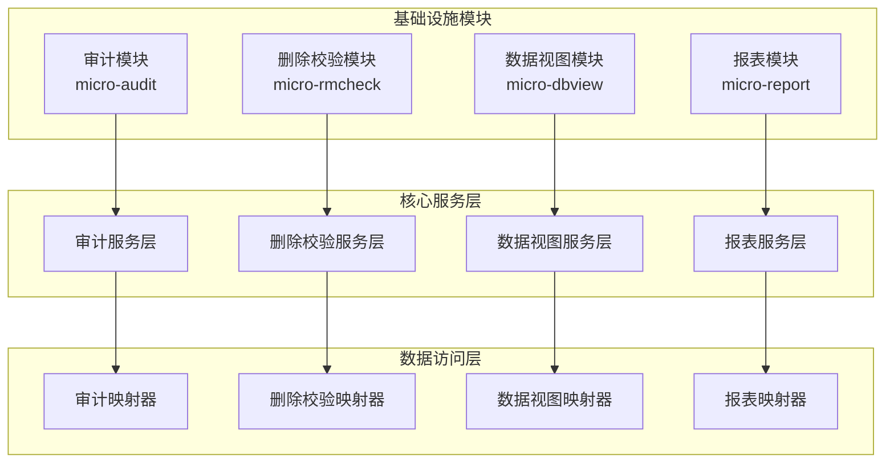
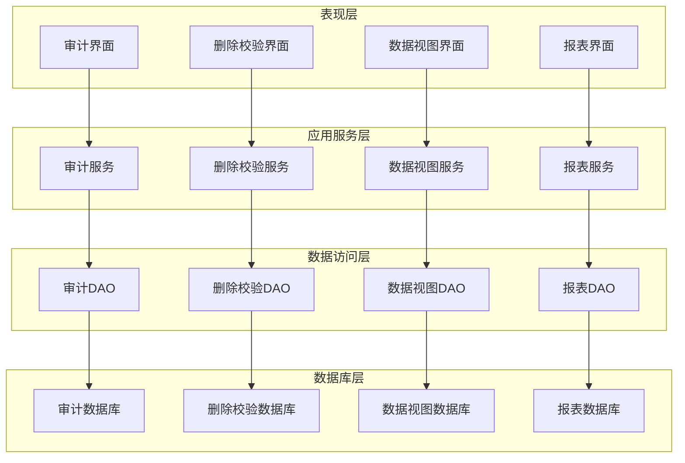
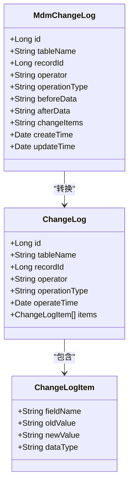
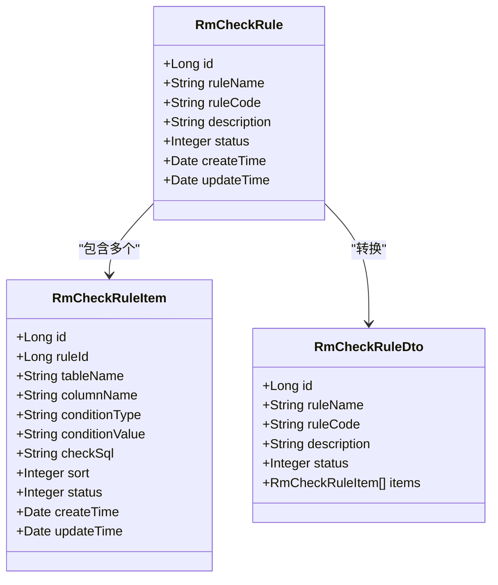
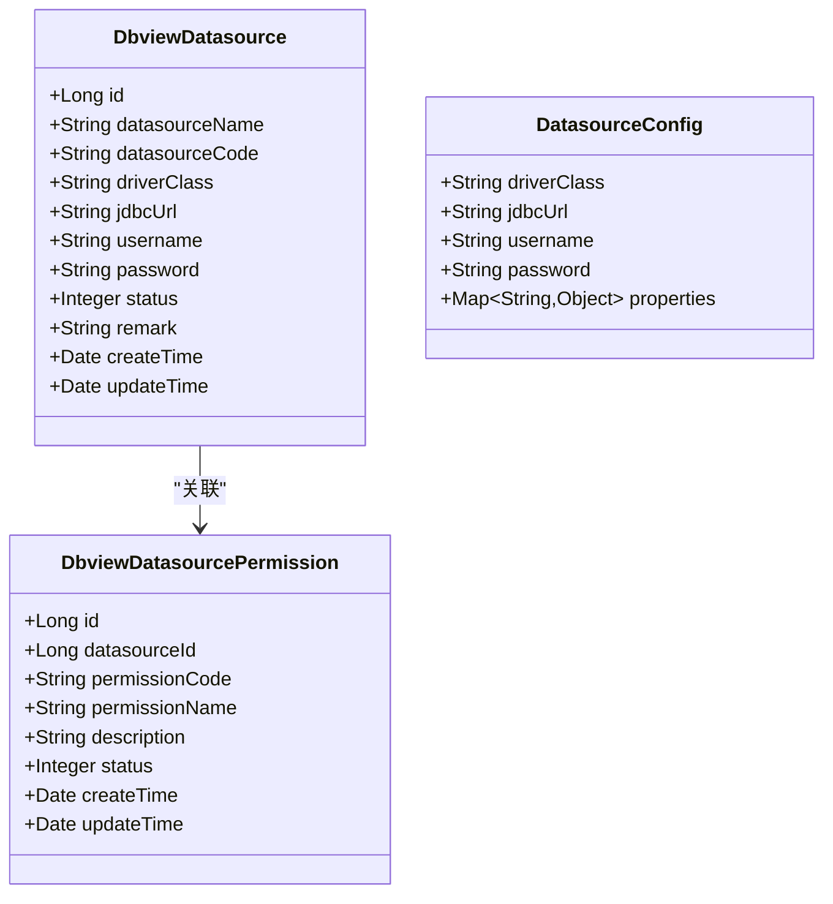
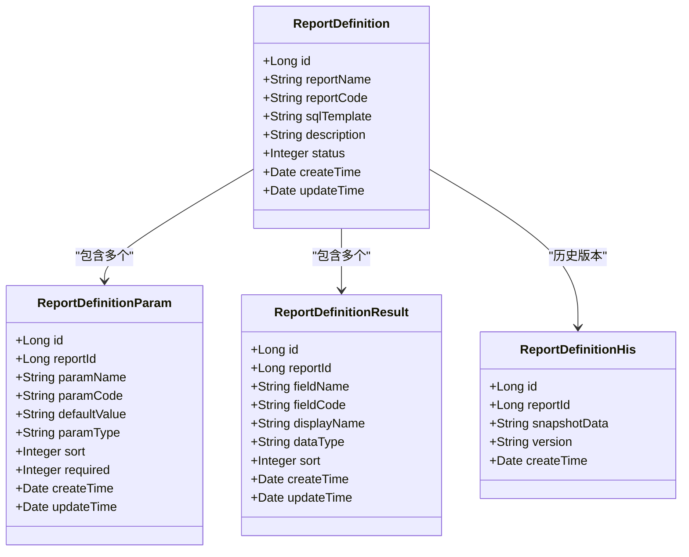
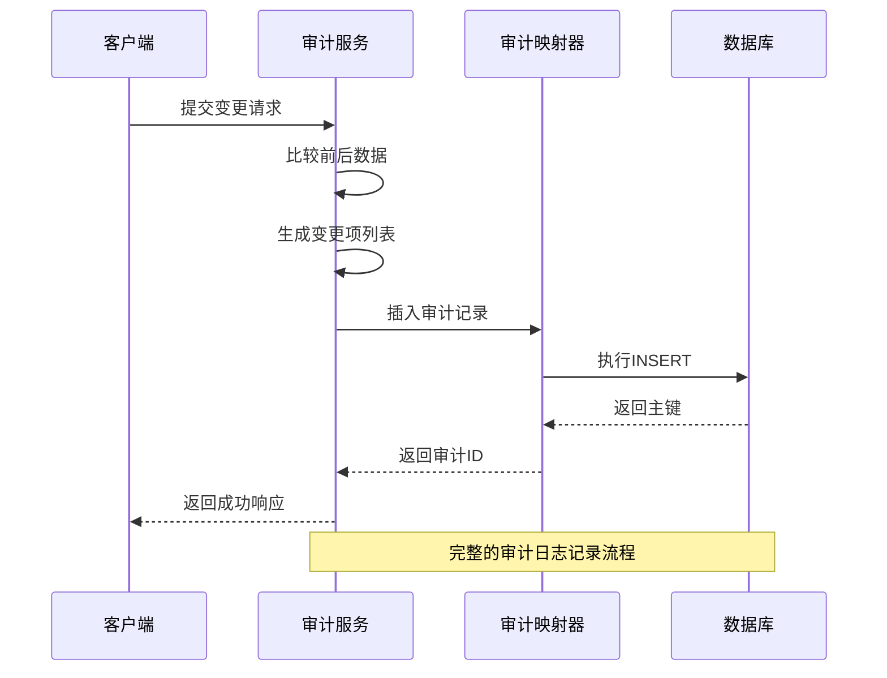
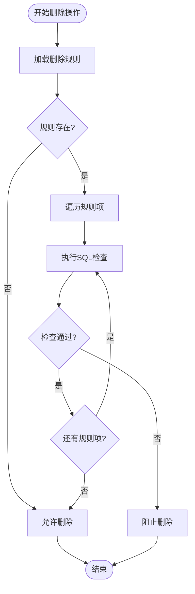
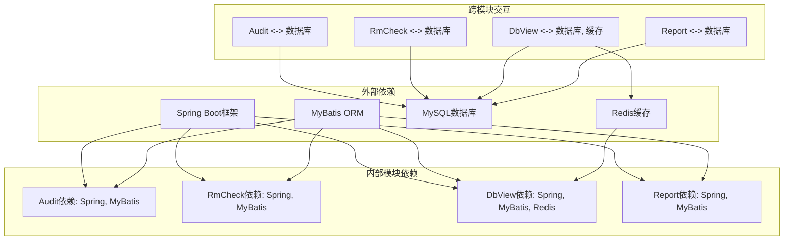

# 基础设施数据模型

<cite>
**本文档引用的文件**
- [MdmChangeLog.java](file://micro-audit/src/main/java/com/wkclz/micro/audit/bean/entity/MdmChangeLog.java)
- [ChangeLog.java](file://micro-audit/src/main/java/com/wkclz/micro/audit/bean/dto/ChangeLog.java)
- [ChangeLogItem.java](file://micro-audit/src/main/java/com/wkclz/micro/audit/bean/dto/ChangeLogItem.java)
- [MdmChangeLogMapper.java](file://micro-audit/src/main/java/com/wkclz/micro/audit/mapper/MdmChangeLogMapper.java)
- [MdmChangeLogService.java](file://micro-audit/src/main/java/com/wkclz/micro/audit/service/MdmChangeLogService.java)
- [ChangeLogRest.java](file://micro-audit/src/main/java/com/wkclz/micro/audit/rest/ChangeLogRest.java)
- [RmCheckRule.java](file://micro-rmcheck/src/main/java/com/wkclz/micro/rmcheck/bean/entity/RmCheckRule.java)
- [RmCheckRuleItem.java](file://micro-rmcheck/src/main/java/com/wkclz/micro/rmcheck/bean/entity/RmCheckRuleItem.java)
- [RmCheckRuleDto.java](file://micro-rmcheck/src/main/java/com/wkclz/micro/rmcheck/bean/dto/RmCheckRuleDto.java)
- [RmCheckRuleMapper.java](file://micro-rmcheck/src/main/java/com/wkclz/micro/rmcheck/mapper/RmCheckRuleMapper.java)
- [RmCheckRuleItemMapper.java](file://micro-rmcheck/src/main/java/com/wkclz/micro/rmcheck/mapper/RmCheckRuleItemMapper.java)
- [RmCheckRuleRest.java](file://micro-rmcheck/src/main/java/com/wkclz/micro/rmcheck/rest/RmCheckRuleRest.java)
- [DbviewDatasource.java](file://micro-dbview/src/main/java/com/wkclz/micro/dbview/bean/entity/DbviewDatasource.java)
- [DbviewDatasourcePermission.java](file://micro-dbview/src/main/java/com/wkclz/micro/dbview/bean/entity/DbviewDatasourcePermission.java)
- [DbviewDatasourceMapper.java](file://micro-dbview/src/main/java/com/wkclz/micro/dbview/mapper/DbviewDatasourceMapper.java)
- [DbviewDatasourcePermissionMapper.java](file://micro-dbview/src/main/java/com/wkclz/micro/dbview/mapper/DbviewDatasourcePermissionMapper.java)
- [DbviewDatasourceService.java](file://micro-dbview/src/main/java/com/wkclz/micro/dbview/service/DbviewDatasourceService.java)
- [ReportDefinition.java](file://micro-report/src/main/java/com/wkclz/micro/report/bean/entity/ReportDefinition.java)
- [ReportDefinitionParam.java](file://micro-report/src/main/java/com/wkclz/micro/report/bean/entity/ReportDefinitionParam.java)
- [ReportDefinitionResult.java](file://micro-report/src/main/java/com/wkclz/micro/report/bean/entity/ReportDefinitionResult.java)
- [ReportDefinitionHis.java](file://micro-report/src/main/java/com/wkclz/micro/report/bean/entity/ReportDefinitionHis.java)
- [ReportDefinitionDto.java](file://micro-report/src/main/java/com/wkclz/micro/report/bean/dto/ReportDefinitionDto.java)
- [ReportDefinitionParamDto.java](file://micro-report/src/main/java/com/wkclz/micro/report/bean/dto/ReportDefinitionParamDto.java)
- [ReportDefinitionResultDto.java](file://micro-report/src/main/java/com/wkclz/micro/report/bean/dto/ReportDefinitionResultDto.java)
- [ReportDefinitionMapper.java](file://micro-report/src/main/java/com/wkclz/micro/report/mapper/ReportDefinitionMapper.java)
- [ReportDefinitionParamMapper.java](file://micro-report/src/main/java/com/wkclz/micro/report/mapper/ReportDefinitionParamMapper.java)
- [ReportDefinitionResultMapper.java](file://micro-report/src/main/java/com/wkclz/micro/report/mapper/ReportDefinitionResultMapper.java)
- [ReportDefinitionHisMapper.java](file://micro-report/src/main/java/com/wkclz/micro/report/mapper/ReportDefinitionHisMapper.java)
- [ReportExecService.java](file://micro-report/src/main/java/com/wkclz/micro/report/service/ReportExecService.java)
- [ReportSqlHelper.java](file://micro-report/src/main/java/com/wkclz/micro/report/helper/ReportSqlHelper.java)
</cite>

## 目录
1. [引言](#引言)
2. [项目结构](#项目结构)
3. [核心组件](#核心组件)
4. [架构概览](#架构概览)
5. [详细组件分析](#详细组件分析)
6. [依赖关系分析](#依赖关系分析)
7. [性能考虑](#性能考虑)
8. [故障排除指南](#故障排除指南)
9. [结论](#结论)

## 引言

本文档为基础设施数据模型提供全面的技术文档，重点覆盖以下核心领域：

- **审计日志系统**：详细说明变更审计的数据记录格式、存储结构和查询接口设计
- **删除合规校验**：阐述删除校验规则的配置模型、规则项定义和执行机制
- **数据视图系统**：解释数据源连接配置、权限控制和元数据管理的数据结构
- **报表系统**：描述报表定义的数据模型、查询参数设计和历史版本管理

这些组件构成了微服务基础设施的核心数据层，为业务系统的安全、合规和可追溯性提供基础支撑。

## 项目结构

基础设施相关模块采用按功能域划分的组织方式，每个模块专注于特定的基础设施能力：

**图表来源**
- [MdmChangeLogService.java](file://micro-audit/src/main/java/com/wkclz/micro/audit/service/MdmChangeLogService.java)
- [RmCheckRuleItemService.java](file://micro-rmcheck/src/main/java/com/wkclz/micro/rmcheck/service/RmCheckRuleItemService.java)
- [DbviewDatasourceService.java](file://micro-dbview/src/main/java/com/wkclz/micro/dbview/service/DbviewDatasourceService.java)
- [ReportExecService.java](file://micro-report/src/main/java/com/wkclz/micro/report/service/ReportExecService.java)

**章节来源**
- [MdmChangeLogService.java](file://micro-audit/src/main/java/com/wkclz/micro/audit/service/MdmChangeLogService.java)
- [RmCheckRuleItemService.java](file://micro-rmcheck/src/main/java/com/wkclz/micro/rmcheck/service/RmCheckRuleItemService.java)
- [DbviewDatasourceService.java](file://micro-dbview/src/main/java/com/wkclz/micro/dbview/service/DbviewDatasourceService.java)
- [ReportExecService.java](file://micro-report/src/main/java/com/wkclz/micro/report/service/ReportExecService.java)

## 核心组件

### 审计日志组件

审计日志系统负责记录所有关键业务操作的变更历史，提供完整的数据追溯能力。

**章节来源**
- [MdmChangeLog.java](file://micro-audit/src/main/java/com/wkclz/micro/audit/bean/entity/MdmChangeLog.java)
- [ChangeLog.java](file://micro-audit/src/main/java/com/wkclz/micro/audit/bean/dto/ChangeLog.java)
- [ChangeLogItem.java](file://micro-audit/src/main/java/com/wkclz/micro/audit/bean/dto/ChangeLogItem.java)

### 删除合规校验组件

删除合规校验模块确保在执行删除操作前进行必要的合规检查，防止违规删除。

**章节来源**
- [RmCheckRule.java](file://micro-rmcheck/src/main/java/com/wkclz/micro/rmcheck/bean/entity/RmCheckRule.java)
- [RmCheckRuleItem.java](file://micro-rmcheck/src/main/java/com/wkclz/micro/rmcheck/bean/entity/RmCheckRuleItem.java)

### 数据视图组件

数据视图系统提供统一的数据源管理和查询接口，支持多数据源的连接和权限控制。

**章节来源**
- [DbviewDatasource.java](file://micro-dbview/src/main/java/com/wkclz/micro/dbview/bean/entity/DbviewDatasource.java)
- [DbviewDatasourcePermission.java](file://micro-dbview/src/main/java/com/wkclz/micro/dbview/bean/entity/DbviewDatasourcePermission.java)

### 报表组件

报表系统支持动态报表定义、参数化查询和结果集管理，提供灵活的数据展示能力。

**章节来源**
- [ReportDefinition.java](file://micro-report/src/main/java/com/wkclz/micro/report/bean/entity/ReportDefinition.java)
- [ReportDefinitionParam.java](file://micro-report/src/main/java/com/wkclz/micro/report/bean/entity/ReportDefinitionParam.java)
- [ReportDefinitionResult.java](file://micro-report/src/main/java/com/wkclz/micro/report/bean/entity/ReportDefinitionResult.java)

## 架构概览

基础设施数据模型采用分层架构设计，确保各组件间的职责分离和松耦合：

**图表来源**
- [ChangeLogRest.java](file://micro-audit/src/main/java/com/wkclz/micro/audit/rest/ChangeLogRest.java)
- [RmCheckRuleRest.java](file://micro-rmcheck/src/main/java/com/wkclz/micro/rmcheck/rest/RmCheckRuleRest.java)
- [MdmChangeLogMapper.java](file://micro-audit/src/main/java/com/wkclz/micro/audit/mapper/MdmChangeLogMapper.java)
- [RmCheckRuleMapper.java](file://micro-rmcheck/src/main/java/com/wkclz/micro/rmcheck/mapper/RmCheckRuleMapper.java)

## 详细组件分析

### 审计日志数据模型

审计日志系统通过实体类实现完整的变更记录功能：

**图表来源**
- [MdmChangeLog.java](file://micro-audit/src/main/java/com/wkclz/micro/audit/bean/entity/MdmChangeLog.java)
- [ChangeLog.java](file://micro-audit/src/main/java/com/wkclz/micro/audit/bean/dto/ChangeLog.java)
- [ChangeLogItem.java](file://micro-audit/src/main/java/com/wkclz/micro/audit/bean/dto/ChangeLogItem.java)

#### 变更审计数据记录格式

审计日志采用JSON格式存储变更详情，支持复杂对象的深度比较：

**章节来源**
- [MdmChangeLog.java](file://micro-audit/src/main/java/com/wkclz/micro/audit/bean/entity/MdmChangeLog.java)
- [MdmChangeLogService.java](file://micro-audit/src/main/java/com/wkclz/micro/audit/service/MdmChangeLogService.java)

### 删除合规校验数据模型

删除校验系统通过规则和规则项实现灵活的删除控制：

**图表来源**
- [RmCheckRule.java](file://micro-rmcheck/src/main/java/com/wkclz/micro/rmcheck/bean/entity/RmCheckRule.java)
- [RmCheckRuleItem.java](file://micro-rmcheck/src/main/java/com/wkclz/micro/rmcheck/bean/entity/RmCheckRuleItem.java)
- [RmCheckRuleDto.java](file://micro-rmcheck/src/main/java/com/wkclz/micro/rmcheck/bean/dto/RmCheckRuleDto.java)

#### 删除校验规则配置

删除校验规则支持多种条件类型和SQL表达式，提供灵活的业务逻辑验证：

**章节来源**
- [RmCheckRule.java](file://micro-rmcheck/src/main/java/com/wkclz/micro/rmcheck/bean/entity/RmCheckRule.java)
- [RmCheckRuleItem.java](file://micro-rmcheck/src/main/java/com/wkclz/micro/rmcheck/bean/entity/RmCheckRuleItem.java)

### 数据视图数据模型

数据视图系统提供统一的数据源管理和查询接口：

**图表来源**
- [DbviewDatasource.java](file://micro-dbview/src/main/java/com/wkclz/micro/dbview/bean/entity/DbviewDatasource.java)
- [DbviewDatasourcePermission.java](file://micro-dbview/src/main/java/com/wkclz/micro/dbview/bean/entity/DbviewDatasourcePermission.java)

#### 数据源连接信息

数据源配置支持多种数据库类型，提供安全的连接管理和权限控制：

**章节来源**
- [DbviewDatasource.java](file://micro-dbview/src/main/java/com/wkclz/micro/dbview/bean/entity/DbviewDatasource.java)
- [DbviewDatasourcePermission.java](file://micro-dbview/src/main/java/com/wkclz/micro/dbview/bean/entity/DbviewDatasourcePermission.java)

### 报表系统数据模型

报表系统支持动态报表定义和参数化查询：

**图表来源**
- [ReportDefinition.java](file://micro-report/src/main/java/com/wkclz/micro/report/bean/entity/ReportDefinition.java)
- [ReportDefinitionParam.java](file://micro-report/src/main/java/com/wkclz/micro/report/bean/entity/ReportDefinitionParam.java)
- [ReportDefinitionResult.java](file://micro-report/src/main/java/com/wkclz/micro/report/bean/entity/ReportDefinitionResult.java)
- [ReportDefinitionHis.java](file://micro-report/src/main/java/com/wkclz/micro/report/bean/entity/ReportDefinitionHis.java)

#### 报表定义数据结构

报表定义采用模板化设计，支持动态SQL和参数化查询：

**章节来源**
- [ReportDefinition.java](file://micro-report/src/main/java/com/wkclz/micro/report/bean/entity/ReportDefinition.java)
- [ReportDefinitionParam.java](file://micro-report/src/main/java/com/wkclz/micro/report/bean/entity/ReportDefinitionParam.java)
- [ReportDefinitionResult.java](file://micro-report/src/main/java/com/wkclz/micro/report/bean/entity/ReportDefinitionResult.java)

### 审计流程时序图

**图表来源**
- [MdmChangeLogService.java](file://micro-audit/src/main/java/com/wkclz/micro/audit/service/MdmChangeLogService.java)
- [MdmChangeLogMapper.java](file://micro-audit/src/main/java/com/wkclz/micro/audit/mapper/MdmChangeLogMapper.java)

### 删除校验流程图

**图表来源**
- [RmCheckRuleItemService.java](file://micro-rmcheck/src/main/java/com/wkclz/micro/rmcheck/service/RmCheckRuleItemService.java)
- [RmCheckRuleMapper.java](file://micro-rmcheck/src/main/java/com/wkclz/micro/rmcheck/mapper/RmCheckRuleMapper.java)

## 依赖关系分析

基础设施各模块间存在清晰的依赖关系，遵循单一职责原则：

**图表来源**
- [MdmChangeLogMapper.java](file://micro-audit/src/main/java/com/wkclz/micro/audit/mapper/MdmChangeLogMapper.java)
- [RmCheckRuleMapper.java](file://micro-rmcheck/src/main/java/com/wkclz/micro/rmcheck/mapper/RmCheckRuleMapper.java)
- [DbviewDatasourceMapper.java](file://micro-dbview/src/main/java/com/wkclz/micro/dbview/mapper/DbviewDatasourceMapper.java)
- [ReportDefinitionMapper.java](file://micro-report/src/main/java/com/wkclz/micro/report/mapper/ReportDefinitionMapper.java)

**章节来源**
- [MdmChangeLogMapper.java](file://micro-audit/src/main/java/com/wkclz/micro/audit/mapper/MdmChangeLogMapper.java)
- [RmCheckRuleMapper.java](file://micro-rmcheck/src/main/java/com/wkclz/micro/rmcheck/mapper/RmCheckRuleMapper.java)
- [DbviewDatasourceMapper.java](file://micro-dbview/src/main/java/com/wkclz/micro/dbview/mapper/DbviewDatasourceMapper.java)
- [ReportDefinitionMapper.java](file://micro-report/src/main/java/com/wkclz/micro/report/mapper/ReportDefinitionMapper.java)

## 性能考虑

基础设施数据模型在设计时充分考虑了性能优化：

### 缓存策略
- **审计日志缓存**：近期高频查询的审计记录缓存到Redis
- **数据源连接池**：数据库连接采用连接池管理，减少连接开销
- **报表结果缓存**：常用报表结果缓存，支持TTL过期机制

### 查询优化
- **索引设计**：关键查询字段建立适当索引
- **分页查询**：大数据量场景下强制分页，避免全表扫描
- **批量操作**：支持批量插入和更新操作

### 监控指标
- **响应时间**：记录各接口的平均响应时间和P95延迟
- **错误率统计**：监控各模块的错误发生频率
- **资源使用**：跟踪数据库连接数和内存使用情况

## 故障排除指南

### 常见问题及解决方案

**审计日志异常**
- 症状：审计记录缺失或重复
- 排查步骤：检查数据库事务状态、确认审计服务启动状态
- 解决方案：重启审计服务、清理异常事务

**删除校验失败**
- 症状：合法删除被误阻拦
- 排查步骤：验证规则配置、检查SQL语法正确性
- 解决方案：调整规则条件、优化SQL查询

**数据视图连接超时**
- 症状：数据源连接不稳定
- 排查步骤：检查网络连通性、验证数据库状态
- 解决方案：增加连接池大小、优化数据库性能

**报表执行超时**
- 症状：报表生成时间过长
- 排查步骤：分析SQL执行计划、检查索引使用情况
- 解决方案：添加必要索引、优化查询语句

**章节来源**
- [MdmChangeLogService.java](file://micro-audit/src/main/java/com/wkclz/micro/audit/service/MdmChangeLogService.java)
- [RmCheckRuleItemService.java](file://micro-rmcheck/src/main/java/com/wkclz/micro/rmcheck/service/RmCheckRuleItemService.java)
- [DbviewDatasourceService.java](file://micro-dbview/src/main/java/com/wkclz/micro/dbview/service/DbviewDatasourceService.java)
- [ReportExecService.java](file://micro-report/src/main/java/com/wkclz/micro/report/service/ReportExecService.java)

## 结论

基础设施数据模型通过模块化的架构设计和完善的监控体系，为微服务系统提供了可靠的数据支撑。各组件在保证功能完整性的同时，充分考虑了性能优化和故障处理，形成了完整的基础设施数据管理体系。

未来可以进一步优化的方向包括：
- 增强数据一致性保障机制
- 扩展更多类型的审计指标
- 完善报表系统的实时计算能力
- 加强数据安全和隐私保护措施