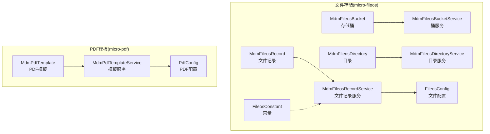
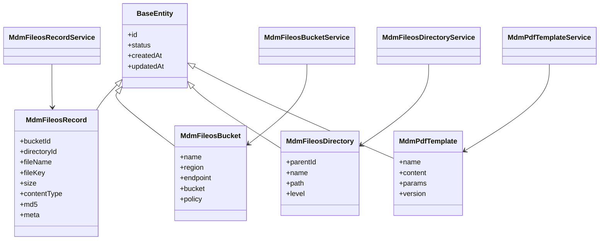
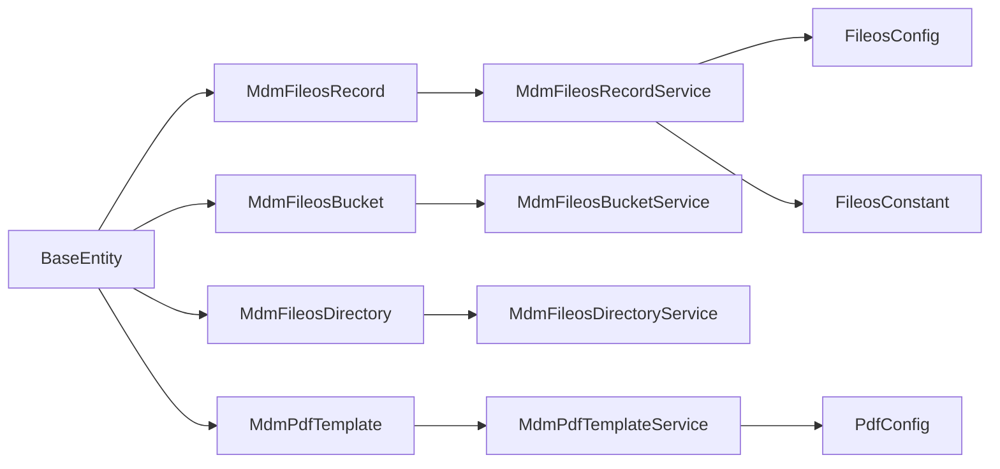
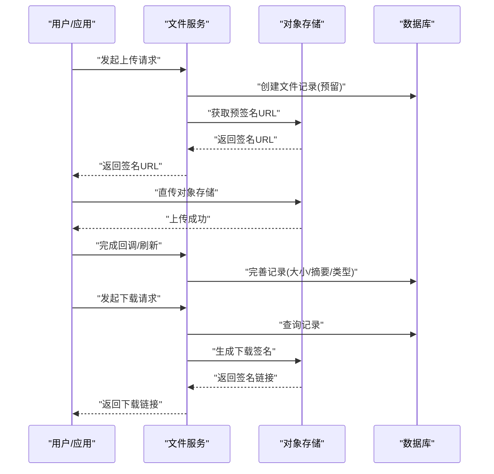
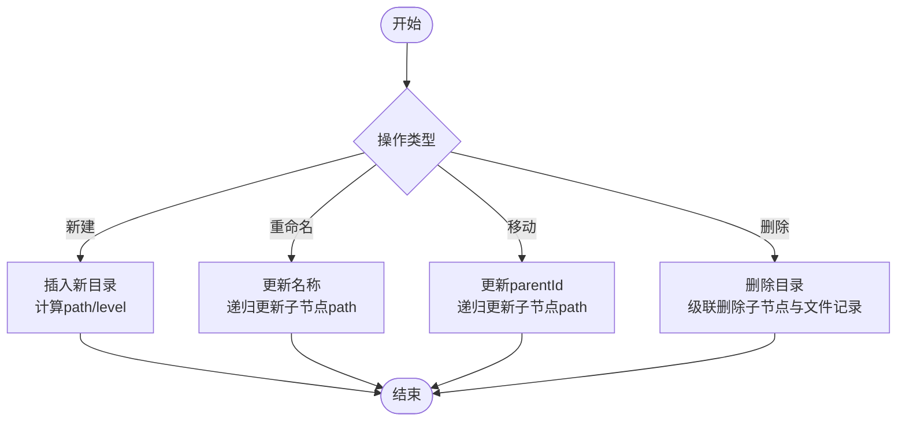

# 存储数据模型

<cite>
**本文引用的文件**
- [MdmFileosRecord.java](file://micro-fileos/src/main/java/com/wkclz/micro/fileos/bean/entity/MdmFileosRecord.java)
- [MdmFileosBucket.java](file://micro-fileos/src/main/java/com/wkclz/micro/fileos/bean/entity/MdmFileosBucket.java)
- [MdmFileosDirectory.java](file://micro-fileos/src/main/java/com/wkclz/micro/fileos/bean/entity/MdmFileosDirectory.java)
- [MdmPdfTemplate.java](file://micro-pdf/src/main/java/com/wkclz/micro/pdf/bean/entity/MdmPdfTemplate.java)
- [MdmFileosRecordService.java](file://micro-fileos/src/main/java/com/wkclz/micro/fileos/service/MdmFileosRecordService.java)
- [MdmFileosBucketService.java](file://micro-fileos/src/main/java/com/wkclz/micro/fileos/service/MdmFileosBucketService.java)
- [MdmFileosDirectoryService.java](file://micro-fileos/src/main/java/com/wkclz/micro/fileos/service/MdmFileosDirectoryService.java)
- [MdmPdfTemplateService.java](file://micro-pdf/src/main/java/com/wkclz/micro/pdf/service/MdmPdfTemplateService.java)
- [MdmFileosRecordMapper.java](file://micro-fileos/src/main/java/com/wkclz/micro/fileos/mapper/MdmFileosRecordMapper.java)
- [MdmFileosBucketMapper.java](file://micro-fileos/src/main/java/com/wkclz/micro/fileos/mapper/MdmFileosBucketMapper.java)
- [MdmFileosDirectoryMapper.java](file://micro-fileos/src/main/java/com/wkclz/micro/fileos/mapper/MdmFileosDirectoryMapper.java)
- [MdmPdfTemplateMapper.java](file://micro-pdf/src/main/java/com/wkclz/micro/pdf/mapper/MdmPdfTemplateMapper.java)
- [FileosConfig.java](file://micro-fileos/src/main/java/com/wkclz/micro/fileos/config/FileosConfig.java)
- [PdfConfig.java](file://micro-pdf/src/main/java/com/wkclz/micro/pdf/config/PdfConfig.java)
- [FileosConstant.java](file://micro-fileos/src/main/java/com/wkclz/micro/fileos/bean/FileosConstant.java)
- [BaseEntity.java](file://micro-fileos/src/main/java/com/wkclz/micro/fileos/bean/BaseEntity.java)
- [BaseService.java](file://micro-fileos/src/main/java/com/wkclz/micro/fileos/service/BaseService.java)
</cite>

## 目录
1. [引言](#引言)
2. [项目结构](#项目结构)
3. [核心组件](#核心组件)
4. [架构总览](#架构总览)
5. [详细组件分析](#详细组件分析)
6. [依赖关系分析](#依赖关系分析)
7. [性能考虑](#性能考虑)
8. [故障排查指南](#故障排查指南)
9. [结论](#结论)
10. [附录](#附录)

## 引言
本文件聚焦于存储数据模型，围绕文件存储与PDF模板两大领域，系统化梳理实体设计、字段语义、服务层职责与持久化映射关系，并结合上传/下载流程说明数据流转。重点覆盖以下实体：
- 文件存储：MdmFileosRecord（文件记录）、MdmFileosBucket（存储桶）、MdmFileosDirectory（目录）
- PDF模板：MdmPdfTemplate（模板）

通过对实体继承体系、服务层封装、Mapper映射以及配置项的综合分析，帮助读者快速理解数据模型在业务场景中的落地方式与扩展点。

## 项目结构
存储相关模块主要分布在两个微服务中：
- micro-fileos：负责文件对象存储（OSS）的记录、桶、目录与多段上传清理等能力
- micro-pdf：负责PDF模板的定义与渲染配置

图表来源
- [MdmFileosRecord.java:1-120](file://micro-fileos/src/main/java/com/wkclz/micro/fileos/bean/entity/MdmFileosRecord.java#L1-L120)
- [MdmFileosBucket.java:1-120](file://micro-fileos/src/main/java/com/wkclz/micro/fileos/bean/entity/MdmFileosBucket.java#L1-L120)
- [MdmFileosDirectory.java:1-120](file://micro-fileos/src/main/java/com/wkclz/micro/fileos/bean/entity/MdmFileosDirectory.java#L1-L120)
- [MdmPdfTemplate.java:1-120](file://micro-pdf/src/main/java/com/wkclz/micro/pdf/bean/entity/MdmPdfTemplate.java#L1-L120)
- [MdmFileosRecordService.java:1-120](file://micro-fileos/src/main/java/com/wkclz/micro/fileos/service/MdmFileosRecordService.java#L1-L120)
- [MdmFileosBucketService.java:1-120](file://micro-fileos/src/main/java/com/wkclz/micro/fileos/service/MdmFileosBucketService.java#L1-L120)
- [MdmFileosDirectoryService.java:1-120](file://micro-fileos/src/main/java/com/wkclz/micro/fileos/service/MdmFileosDirectoryService.java#L1-L120)
- [MdmPdfTemplateService.java:1-120](file://micro-pdf/src/main/java/com/wkclz/micro/pdf/service/MdmPdfTemplateService.java#L1-L120)
- [FileosConfig.java:1-200](file://micro-fileos/src/main/java/com/wkclz/micro/fileos/config/FileosConfig.java#L1-L200)
- [PdfConfig.java:1-200](file://micro-pdf/src/main/java/com/wkclz/micro/pdf/config/PdfConfig.java#L1-L200)
- [FileosConstant.java:1-200](file://micro-fileos/src/main/java/com/wkclz/micro/fileos/bean/FileosConstant.java#L1-L200)

章节来源
- [MdmFileosRecord.java:1-120](file://micro-fileos/src/main/java/com/wkclz/micro/fileos/bean/entity/MdmFileosRecord.java#L1-L120)
- [MdmFileosBucket.java:1-120](file://micro-fileos/src/main/java/com/wkclz/micro/fileos/bean/entity/MdmFileosBucket.java#L1-L120)
- [MdmFileosDirectory.java:1-120](file://micro-fileos/src/main/java/com/wkclz/micro/fileos/bean/entity/MdmFileosDirectory.java#L1-L120)
- [MdmPdfTemplate.java:1-120](file://micro-pdf/src/main/java/com/wkclz/micro/pdf/bean/entity/MdmPdfTemplate.java#L1-L120)

## 核心组件
- 继承基类：所有实体均继承自BaseEntity，统一具备主键、创建时间、更新时间、状态等通用字段与行为
- 服务基类：各实体的服务层继承BaseService，提供通用的CRUD与分页查询能力
- 配置中心：FileosConfig与PdfConfig分别承载文件与PDF相关策略配置（如存储区域、签名有效期、模板缓存等）

章节来源
- [BaseEntity.java:1-200](file://micro-fileos/src/main/java/com/wkclz/micro/fileos/bean/BaseEntity.java#L1-L200)
- [BaseService.java:1-200](file://micro-fileos/src/main/java/com/wkclz/micro/fileos/service/BaseService.java#L1-L200)
- [FileosConfig.java:1-200](file://micro-fileos/src/main/java/com/wkclz/micro/fileos/config/FileosConfig.java#L1-L200)
- [PdfConfig.java:1-200](file://micro-pdf/src/main/java/com/wkclz/micro/pdf/config/PdfConfig.java#L1-L200)

## 架构总览
文件与PDF两大子系统通过各自的实体、服务与配置协同工作，形成“模型-服务-配置”的清晰分层；文件侧还包含常量定义用于约束业务行为。

图表来源
- [BaseEntity.java:1-200](file://micro-fileos/src/main/java/com/wkclz/micro/fileos/bean/BaseEntity.java#L1-L200)
- [MdmFileosRecord.java:1-120](file://micro-fileos/src/main/java/com/wkclz/micro/fileos/bean/entity/MdmFileosRecord.java#L1-L120)
- [MdmFileosBucket.java:1-120](file://micro-fileos/src/main/java/com/wkclz/micro/fileos/bean/entity/MdmFileosBucket.java#L1-L120)
- [MdmFileosDirectory.java:1-120](file://micro-fileos/src/main/java/com/wkclz/micro/fileos/bean/entity/MdmFileosDirectory.java#L1-L120)
- [MdmPdfTemplate.java:1-120](file://micro-pdf/src/main/java/com/wkclz/micro/pdf/bean/entity/MdmPdfTemplate.java#L1-L120)
- [MdmFileosRecordService.java:1-120](file://micro-fileos/src/main/java/com/wkclz/micro/fileos/service/MdmFileosRecordService.java#L1-L120)
- [MdmFileosBucketService.java:1-120](file://micro-fileos/src/main/java/com/wkclz/micro/fileos/service/MdmFileosBucketService.java#L1-L120)
- [MdmFileosDirectoryService.java:1-120](file://micro-fileos/src/main/java/com/wkclz/micro/fileos/service/MdmFileosDirectoryService.java#L1-L120)
- [MdmPdfTemplateService.java:1-120](file://micro-pdf/src/main/java/com/wkclz/micro/pdf/service/MdmPdfTemplateService.java#L1-L120)

## 详细组件分析

### 文件记录实体：MdmFileosRecord
- 角色定位：文件对象在系统内的唯一记录载体，关联存储桶与目录，承载文件元数据与访问标识
- 关键字段与语义
  - bucketId：所属存储桶标识，用于区分不同存储域
  - directoryId：所属目录标识，支持目录树结构下的文件归档
  - fileName：客户端可见的文件名
  - fileKey：对象存储中的唯一键（通常为完整路径或带前缀的相对路径）
  - size：文件大小（字节），便于容量统计与配额控制
  - contentType：MIME类型，影响浏览器解析与下载行为
  - md5：文件内容摘要，用于重复性判断与一致性校验
  - meta：JSON格式的扩展元数据，可存放标签、业务属性等
- 存储逻辑
  - 记录创建时写入基础元信息；上传完成后补充size、md5、contentType等
  - 删除时需级联处理目录树与对象存储中的文件键
- 典型使用场景
  - 文件上传后登记记录
  - 下载时根据fileKey定位对象存储资源
  - 列表查询按目录、名称、时间范围筛选

章节来源
- [MdmFileosRecord.java:1-120](file://micro-fileos/src/main/java/com/wkclz/micro/fileos/bean/entity/MdmFileosRecord.java#L1-L120)
- [MdmFileosRecordService.java:1-120](file://micro-fileos/src/main/java/com/wkclz/micro/fileos/service/MdmFileosRecordService.java#L1-L120)
- [MdmFileosRecordMapper.java:1-200](file://micro-fileos/src/main/java/com/wkclz/micro/fileos/mapper/MdmFileosRecordMapper.java#L1-L200)

### 存储桶实体：MdmFileosBucket
- 角色定位：对象存储的逻辑容器，抽象出区域、端点、桶名与访问策略
- 关键字段与语义
  - name：桶的业务名称
  - region：存储区域
  - endpoint：访问域名或网关地址
  - bucket：对象存储中的物理桶名
  - policy：访问策略或权限配置（JSON字符串，可含生命周期、跨域等）
- 存储逻辑
  - 作为文件记录的外键约束目标，确保记录与桶的一致性
  - 变更策略时需同步对象存储端的实际策略
- 典型使用场景
  - 新建/修改桶配置
  - 选择默认桶进行文件上传
  - 多租户隔离与跨域配置

章节来源
- [MdmFileosBucket.java:1-120](file://micro-fileos/src/main/java/com/wkclz/micro/fileos/bean/entity/MdmFileosBucket.java#L1-L120)
- [MdmFileosBucketService.java:1-120](file://micro-fileos/src/main/java/com/wkclz/micro/fileos/service/MdmFileosBucketService.java#L1-L120)
- [MdmFileosBucketMapper.java:1-200](file://micro-fileos/src/main/java/com/wkclz/micro/fileos/mapper/MdmFileosBucketMapper.java#L1-L200)

### 目录实体：MdmFileosDirectory
- 角色定位：文件系统的目录树结构，支持层级组织与路径计算
- 关键字段与语义
  - parentId：父级目录ID，根目录parentId为空
  - name：目录名称
  - path：从根到当前节点的路径片段集合（可用于快速路径匹配）
  - level：目录层级，辅助排序与深度限制
- 存储逻辑
  - 插入时计算path与level；移动/重命名时需递归更新子节点
  - 删除时需级联删除子目录与其中的文件记录
- 典型使用场景
  - 文件上传时选择目标目录
  - 目录树展示与搜索
  - 路径权限校验与访问控制

章节来源
- [MdmFileosDirectory.java:1-120](file://micro-fileos/src/main/java/com/wkclz/micro/fileos/bean/entity/MdmFileosDirectory.java#L1-L120)
- [MdmFileosDirectoryService.java:1-120](file://micro-fileos/src/main/java/com/wkclz/micro/fileos/service/MdmFileosDirectoryService.java#L1-L120)
- [MdmFileosDirectoryMapper.java:1-200](file://micro-fileos/src/main/java/com/wkclz/micro/fileos/mapper/MdmFileosDirectoryMapper.java#L1-L200)

### PDF模板实体：MdmPdfTemplate
- 角色定位：PDF生成的模板定义，包含模板内容与参数绑定
- 关键字段与语义
  - name：模板名称，用于识别与版本管理
  - content：模板内容（通常为二进制或编码后的模板数据）
  - params：模板参数定义（JSON），声明可替换的占位符与默认值
  - version：模板版本号，用于灰度与回滚
- 存储逻辑
  - 内容与参数分离存储，便于模板复用与参数注入
  - 版本化管理支持并发渲染与一致性保障
- 典型使用场景
  - 动态生成报告、合同、发票等
  - 参数校验与默认值填充
  - 缓存命中与热更新

章节来源
- [MdmPdfTemplate.java:1-120](file://micro-pdf/src/main/java/com/wkclz/micro/pdf/bean/entity/MdmPdfTemplate.java#L1-L120)
- [MdmPdfTemplateService.java:1-120](file://micro-pdf/src/main/java/com/wkclz/micro/pdf/service/MdmPdfTemplateService.java#L1-L120)
- [MdmPdfTemplateMapper.java:1-200](file://micro-pdf/src/main/java/com/wkclz/micro/pdf/mapper/MdmPdfTemplateMapper.java#L1-L200)

### 服务层与持久化映射
- 服务层
  - 各实体服务继承BaseService，提供标准CRUD、分页、条件查询等能力
  - 文件侧服务还承担与对象存储交互的编排职责（如签名、清理）
- Mapper映射
  - 采用MyBatis XML映射，遵循统一命名规范，字段与实体严格对应
  - 提供按主键、外键、组合条件的查询接口，满足高频业务场景

章节来源
- [MdmFileosRecordService.java:1-120](file://micro-fileos/src/main/java/com/wkclz/micro/fileos/service/MdmFileosRecordService.java#L1-L120)
- [MdmFileosBucketService.java:1-120](file://micro-fileos/src/main/java/com/wkclz/micro/fileos/service/MdmFileosBucketService.java#L1-L120)
- [MdmFileosDirectoryService.java:1-120](file://micro-fileos/src/main/java/com/wkclz/micro/fileos/service/MdmFileosDirectoryService.java#L1-L120)
- [MdmPdfTemplateService.java:1-120](file://micro-pdf/src/main/java/com/wkclz/micro/pdf/service/MdmPdfTemplateService.java#L1-L120)
- [MdmFileosRecordMapper.java:1-200](file://micro-fileos/src/main/java/com/wkclz/micro/fileos/mapper/MdmFileosRecordMapper.java#L1-L200)
- [MdmFileosBucketMapper.java:1-200](file://micro-fileos/src/main/java/com/wkclz/micro/fileos/mapper/MdmFileosBucketMapper.java#L1-L200)
- [MdmFileosDirectoryMapper.java:1-200](file://micro-fileos/src/main/java/com/wkclz/micro/fileos/mapper/MdmFileosDirectoryMapper.java#L1-L200)
- [MdmPdfTemplateMapper.java:1-200](file://micro-pdf/src/main/java/com/wkclz/micro/pdf/mapper/MdmPdfTemplateMapper.java#L1-L200)

## 依赖关系分析
- 实体依赖：所有实体继承BaseEntity，统一字段与行为
- 服务依赖：各实体服务依赖对应的Mapper与配置
- 外部依赖：文件侧依赖对象存储（OSS）能力；PDF侧依赖模板渲染引擎与缓存

图表来源
- [BaseEntity.java:1-200](file://micro-fileos/src/main/java/com/wkclz/micro/fileos/bean/BaseEntity.java#L1-L200)
- [MdmFileosRecord.java:1-120](file://micro-fileos/src/main/java/com/wkclz/micro/fileos/bean/entity/MdmFileosRecord.java#L1-L120)
- [MdmFileosBucket.java:1-120](file://micro-fileos/src/main/java/com/wkclz/micro/fileos/bean/entity/MdmFileosBucket.java#L1-L120)
- [MdmFileosDirectory.java:1-120](file://micro-fileos/src/main/java/com/wkclz/micro/fileos/bean/entity/MdmFileosDirectory.java#L1-L120)
- [MdmPdfTemplate.java:1-120](file://micro-pdf/src/main/java/com/wkclz/micro/pdf/bean/entity/MdmPdfTemplate.java#L1-L120)
- [MdmFileosRecordService.java:1-120](file://micro-fileos/src/main/java/com/wkclz/micro/fileos/service/MdmFileosRecordService.java#L1-L120)
- [MdmFileosBucketService.java:1-120](file://micro-fileos/src/main/java/com/wkclz/micro/fileos/service/MdmFileosBucketService.java#L1-L120)
- [MdmFileosDirectoryService.java:1-120](file://micro-fileos/src/main/java/com/wkclz/micro/fileos/service/MdmFileosDirectoryService.java#L1-L120)
- [MdmPdfTemplateService.java:1-120](file://micro-pdf/src/main/java/com/wkclz/micro/pdf/service/MdmPdfTemplateService.java#L1-L120)
- [FileosConfig.java:1-200](file://micro-fileos/src/main/java/com/wkclz/micro/fileos/config/FileosConfig.java#L1-L200)
- [PdfConfig.java:1-200](file://micro-pdf/src/main/java/com/wkclz/micro/pdf/config/PdfConfig.java#L1-L200)
- [FileosConstant.java:1-200](file://micro-fileos/src/main/java/com/wkclz/micro/fileos/bean/FileosConstant.java#L1-L200)

## 性能考虑
- 索引与查询
  - 在文件记录上对bucketId、directoryId、fileName建立复合索引，提升目录浏览与文件检索效率
  - 对目录path与level建立索引，加速路径匹配与层级查询
- 缓存策略
  - PDF模板建议引入本地缓存与LRU淘汰，降低频繁解析开销
  - 文件桶与目录树可缓存热点数据，减少数据库压力
- 分页与批量
  - 列表查询采用分页与游标式分页，避免大结果集内存占用
  - 批量删除与迁移操作应分批执行并记录进度，防止长事务阻塞
- 存储策略
  - 大文件采用分片上传与断点续传，结合多段清理任务回收临时资源
  - 对象存储端设置生命周期规则，自动清理过期临时文件

## 故障排查指南
- 文件记录缺失或不一致
  - 检查上传流程是否正确写入fileKey、size、md5、contentType
  - 核对bucketId与bucket配置是否匹配
- 目录树异常
  - 校验path与level计算逻辑，确认重命名/移动后是否递归更新
  - 排查删除级联是否完整
- PDF模板渲染失败
  - 检查params与模板占位符是否一一对应
  - 核对模板版本与缓存一致性
- 配置问题
  - 对象存储端点、桶名、策略变更后需同步更新配置并验证连通性

章节来源
- [MdmFileosRecordService.java:1-120](file://micro-fileos/src/main/java/com/wkclz/micro/fileos/service/MdmFileosRecordService.java#L1-L120)
- [MdmFileosDirectoryService.java:1-120](file://micro-fileos/src/main/java/com/wkclz/micro/fileos/service/MdmFileosDirectoryService.java#L1-L120)
- [MdmPdfTemplateService.java:1-120](file://micro-pdf/src/main/java/com/wkclz/micro/pdf/service/MdmPdfTemplateService.java#L1-L120)

## 结论
本文从实体设计、服务层职责、持久化映射与配置策略四个维度，系统梳理了文件存储与PDF模板的数据模型。通过明确字段语义、存储逻辑与典型流程，为后续扩展（如多租户、多桶、模板版本治理、对象存储对接）提供了清晰的参考路径。

## 附录

### 文件上传/下载流程（概念示意）

### 目录树维护流程（概念示意）
