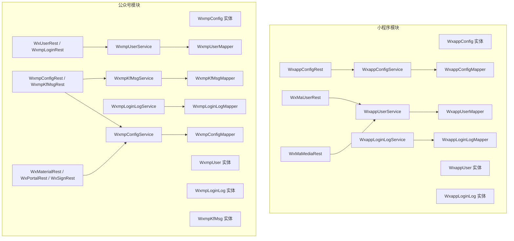
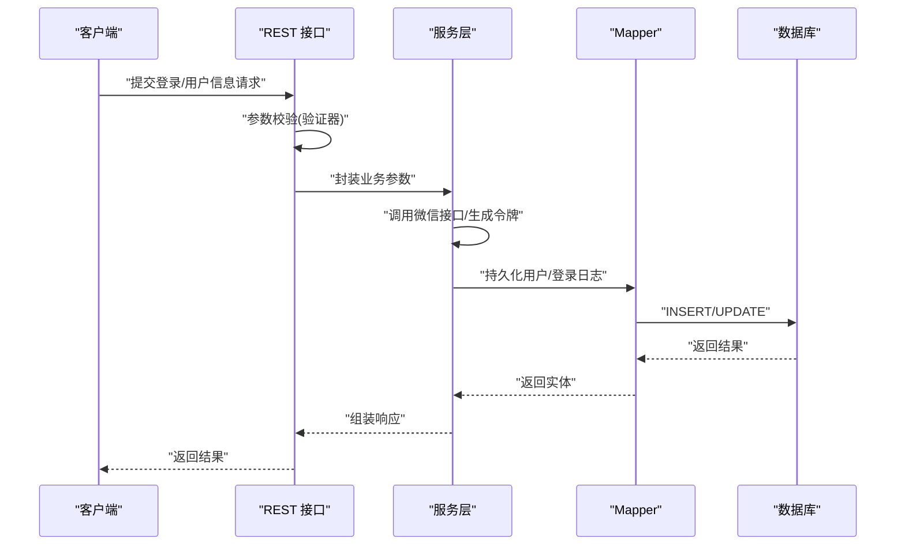
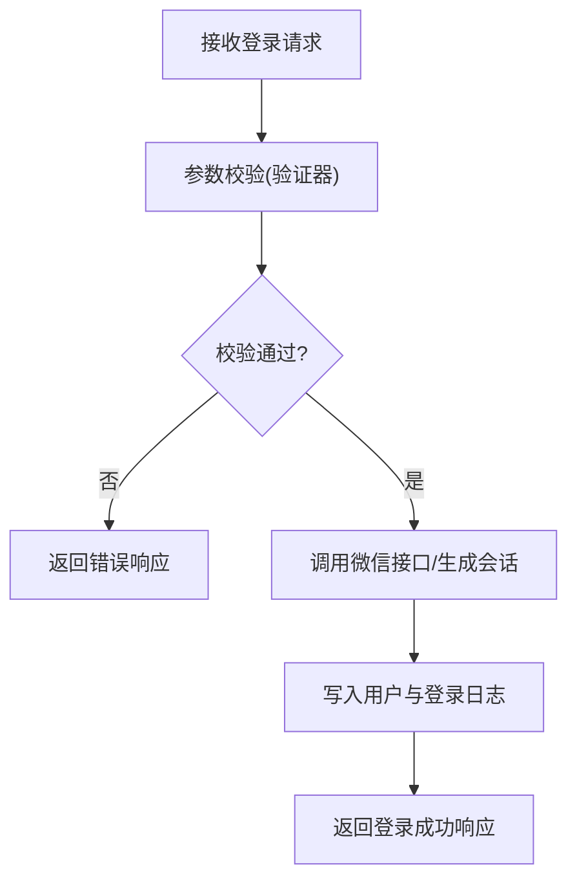
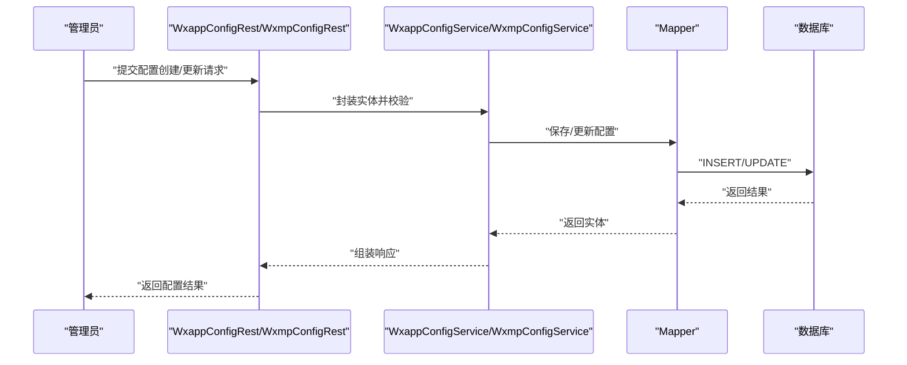
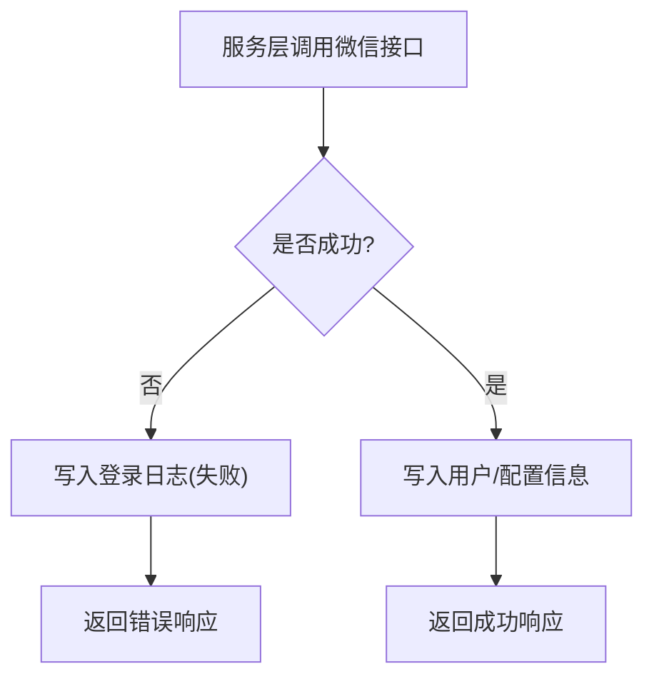
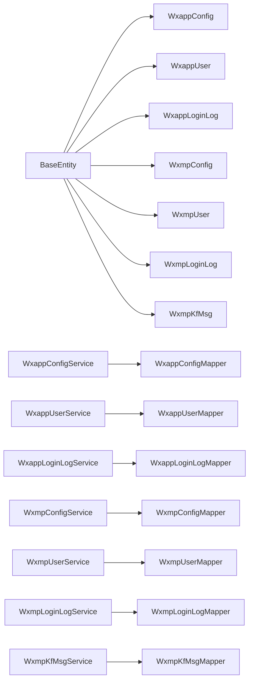

# 微信生态数据模型

<cite>
**本文引用的文件**
- [WxappConfig.java](file://micro-wxapp/src/main/java/com/wkclz/micro/wxapp/bean/entity/WxappConfig.java)
- [WxappUser.java](file://micro-wxapp/src/main/java/com/wkclz/micro/wxapp/bean/entity/WxappUser.java)
- [WxappLoginLog.java](file://micro-wxapp/src/main/java/com/wkclz/micro/wxapp/bean/entity/WxappLoginLog.java)
- [WxmpConfig.java](file://micro-wxmp/src/main/java/com/wkclz/micro/wxmp/bean/entity/WxmpConfig.java)
- [WxmpUser.java](file://micro-wxmp/src/main/java/com/wkclz/micro/wxmp/bean/entity/WxmpUser.java)
- [WxmpLoginLog.java](file://micro-wxmp/src/main/java/com/wkclz/micro/wxmp/bean/entity/WxmpLoginLog.java)
- [WxmpKfMsg.java](file://micro-wxmp/src/main/java/com/wkclz/micro/wxmp/bean/entity/WxmpKfMsg.java)
- [WxMaConfiguration.java](file://micro-wxapp/src/main/java/com/wkclz/micro/wxapp/config/WxMaConfiguration.java)
- [WxMpConfiguration.java](file://micro-wxmp/src/main/java/com/wkclz/micro/wxmp/config/WxMpConfiguration.java)
- [WxappConfigMapper.java](file://micro-wxapp/src/main/java/com/wkclz/micro/wxapp/mapper/WxappConfigMapper.java)
- [WxappUserMapper.java](file://micro-wxapp/src/main/java/com/wkclz/micro/wxapp/mapper/WxappUserMapper.java)
- [WxappLoginLogMapper.java](file://micro-wxapp/src/main/java/com/wkclz/micro/wxapp/mapper/WxappLoginLogMapper.java)
- [WxmpConfigMapper.java](file://micro-wxmp/src/main/java/com/wkclz/micro/wxmp/mapper/WxmpConfigMapper.java)
- [WxmpUserMapper.java](file://micro-wxmp/src/main/java/com/wkclz/micro/wxmp/mapper/WxmpUserMapper.java)
- [WxmpLoginLogMapper.java](file://micro-wxmp/src/main/java/com/wkclz/micro/wxmp/mapper/WxmpLoginLogMapper.java)
- [WxmpKfMsgMapper.java](file://micro-wxmp/src/main/java/com/wkclz/micro/wxmp/mapper/WxmpKfMsgMapper.java)
- [WxMaLoginReq.java](file://micro-wxapp/src/main/java/com/wkclz/micro/wxapp/bean/req/WxMaLoginReq.java)
- [WxMaUserInfoUpdateReq.java](file://micro-wxapp/src/main/java/com/wkclz/micro/wxapp/bean/req/WxMaUserInfoUpdateReq.java)
- [WxappConfigCreateReq.java](file://micro-wxapp/src/main/java/com/wkclz/micro/wxapp/bean/req/WxappConfigCreateReq.java)
- [WxappConfigUpdateReq.java](file://micro-wxapp/src/main/java/com/wkclz/micro/wxapp/bean/req/WxappConfigUpdateReq.java)
- [WxmpConfigCreateReq.java](file://micro-wxmp/src/main/java/com/wkclz/micro/wxmp/bean/req/WxmpConfigCreateReq.java)
- [WxmpConfigUpdateReq.java](file://micro-wxmp/src/main/java/com/wkclz/micro/wxmp/bean/req/WxmpConfigUpdateReq.java)
- [WxMaLoginResp.java](file://micro-wxapp/src/main/java/com/wkclz/micro/wxapp/bean/resp/WxMaLoginResp.java)
- [WxMaUserInfoResp.java](file://micro-wxapp/src/main/java/com/wkclz/micro/wxapp/bean/resp/WxMaUserInfoResp.java)
- [WxmpConfigResp.java](file://micro-wxmp/src/main/java/com/wkclz/micro/wxmp/bean/resp/WxmpConfigResp.java)
- [WxmpLoginResp.java](file://micro-wxmp/src/main/java/com/wkclz/micro/wxmp/bean/resp/WxmpLoginResp.java)
- [WxMaLoginFieldsValid.java](file://micro-wxapp/src/main/java/com/wkclz/micro/wxapp/bean/req/validation/WxMaLoginFieldsValid.java)
- [WxMaLoginFieldsValidator.java](file://micro-wxapp/src/main/java/com/wkclz/micro/wxapp/bean/req/validation/WxMaLoginFieldsValidator.java)
- [WxMaUserInfoUpdateValid.java](file://micro-wxapp/src/main/java/com/wkclz/micro/wxapp/bean/req/validation/WxMaUserInfoUpdateValid.java)
- [WxMaUserInfoUpdateValidator.java](file://micro-wxapp/src/main/java/com/wkclz/micro/wxapp/bean/req/validation/WxMaUserInfoUpdateValidator.java)
- [WxMaMediaRest.java](file://micro-wxapp/src/main/java/com/wkclz/micro/wxapp/rest/WxMaMediaRest.java)
- [WxMaUserRest.java](file://micro-wxapp/src/main/java/com/wkclz/micro/wxapp/rest/WxMaUserRest.java)
- [WxappConfigRest.java](file://micro-wxapp/src/main/java/com/wkclz/micro/wxapp/rest/WxappConfigRest.java)
- [WxUserRest.java](file://micro-wxmp/src/main/java/com/wkclz/micro/wxmp/rest/cust/WxUserRest.java)
- [WxmpLoginRest.java](file://micro-wxmp/src/main/java/com/wkclz/micro/wxmp/rest/cust/WxmpLoginRest.java)
- [WxmpConfigRest.java](file://micro-wxmp/src/main/java/com/wkclz/micro/wxmp/rest/manager/WxmpConfigRest.java)
- [WxmpKfMsgRest.java](file://micro-wxmp/src/main/java/com/wkclz/micro/wxmp/rest/manager/WxmpKfMsgRest.java)
- [WxMaterialRest.java](file://micro-wxmp/src/main/java/com/wkclz/micro/wxmp/rest/mp/WxMaterialRest.java)
- [WxPortalRest.java](file://micro-wxmp/src/main/java/com/wkclz/micro/wxmp/rest/mp/WxPortalRest.java)
- [WxSignRest.java](file://micro-wxmp/src/main/java/com/wkclz/micro/wxmp/rest/mp/WxSignRest.java)
- [WxappConfigService.java](file://micro-wxapp/src/main/java/com/wkclz/micro/wxapp/service/WxappConfigService.java)
- [WxappUserService.java](file://micro-wxapp/src/main/java/com/wkclz/micro/wxapp/service/WxappUserService.java)
- [WxappLoginLogService.java](file://micro-wxapp/src/main/java/com/wkclz/micro/wxapp/service/WxappLoginLogService.java)
- [WxappLoginService.java](file://micro-wxapp/src/main/java/com/wkclz/micro/wxapp/service/custom/WxappLoginService.java)
- [WxmpConfigService.java](file://micro-wxmp/src/main/java/com/wkclz/micro/wxmp/service/WxmpConfigService.java)
- [WxmpUserService.java](file://micro-wxmp/src/main/java/com/wkclz/micro/wxmp/service/WxmpUserService.java)
- [WxmpLoginLogService.java](file://micro-wxmp/src/main/java/com/wkclz/micro/wxmp/service/WxmpLoginLogService.java)
- [WxmpLoginService.java](file://micro-wxmp/src/main/java/com/wkclz/micro/wxmp/service/WxmpLoginService.java)
- [WxMaterialService.java](file://micro-wxmp/src/main/java/com/wkclz/micro/wxmp/service/WxMaterialService.java)
- [WxmpKfMsgService.java](file://micro-wxmp/src/main/java/com/wkclz/micro/wxmp/service/WxmpKfMsgService.java)
- [BaseEntity.java](file://micro-wxapp/src/main/java/com/wkclz/micro/wxapp/bean/entity/BaseEntity.java)
</cite>

## 目录
1. [引言](#引言)
2. [项目结构](#项目结构)
3. [核心组件](#核心组件)
4. [架构总览](#架构总览)
5. [详细组件分析](#详细组件分析)
6. [依赖关系分析](#依赖关系分析)
7. [性能考虑](#性能考虑)
8. [故障排查指南](#故障排查指南)
9. [结论](#结论)
10. [附录](#附录)

## 引言
本文件系统性梳理微信生态（小程序与公众号）在本项目中的数据模型设计，聚焦以下实体与业务流程：小程序配置与用户、公众号配置与用户、登录日志与客服消息、请求/响应/验证器、服务层与持久化映射。文档旨在帮助开发者快速理解字段含义、业务约束、安全与隐私策略、以及与微信接口交互时的日志与错误处理机制。

## 项目结构
- 小程序模块（micro-wxapp）
  - 实体：WxappConfig、WxappUser、WxappLoginLog
  - 配置：WxMaConfiguration
  - 请求/响应/验证器：WxMaLoginReq、WxMaUserInfoUpdateReq、WxappConfigCreateReq、WxappConfigUpdateReq 等；对应验证器类
  - 接口：WxMaMediaRest、WxMaUserRest、WxappConfigRest
  - 服务：WxappConfigService、WxappUserService、WxappLoginLogService、WxappLoginService
  - 映射：WxappConfigMapper、WxappUserMapper、WxappLoginLogMapper
- 公众号模块（micro-wxmp）
  - 实体：WxmpConfig、WxmpUser、WxmpLoginLog、WxmpKfMsg
  - 配置：WxMpConfiguration
  - 请求/响应/验证器：WxmpConfigCreateReq、WxmpConfigUpdateReq 等；消息与菜单处理器
  - 接口：WxUserRest、WxmpLoginRest、WxmpConfigRest、WxmpKfMsgRest、WxMaterialRest、WxPortalRest、WxSignRest
  - 服务：WxmpConfigService、WxmpUserService、WxmpLoginLogService、WxmpLoginService、WxMaterialService、WxmpKfMsgService
  - 映射：WxmpConfigMapper、WxmpUserMapper、WxmpLoginLogMapper、WxmpKfMsgMapper



图表来源
- [WxappConfig.java:1-50](file://micro-wxapp/src/main/java/com/wkclz/micro/wxapp/bean/entity/WxappConfig.java#L1-L50)
- [WxappUser.java:1-50](file://micro-wxapp/src/main/java/com/wkclz/micro/wxapp/bean/entity/WxappUser.java#L1-L50)
- [WxappLoginLog.java:1-50](file://micro-wxapp/src/main/java/com/wkclz/micro/wxapp/bean/entity/WxappLoginLog.java#L1-L50)
- [WxmpConfig.java:1-50](file://micro-wxmp/src/main/java/com/wkclz/micro/wxmp/bean/entity/WxmpConfig.java#L1-L50)
- [WxmpUser.java:1-50](file://micro-wxmp/src/main/java/com/wkclz/micro/wxmp/bean/entity/WxmpUser.java#L1-L50)
- [WxmpLoginLog.java:1-50](file://micro-wxmp/src/main/java/com/wkclz/micro/wxmp/bean/entity/WxmpLoginLog.java#L1-L50)
- [WxmpKfMsg.java:1-50](file://micro-wxmp/src/main/java/com/wkclz/micro/wxmp/bean/entity/WxmpKfMsg.java#L1-L50)

章节来源
- [WxMaConfiguration.java:1-100](file://micro-wxapp/src/main/java/com/wkclz/micro/wxapp/config/WxMaConfiguration.java#L1-L100)
- [WxMpConfiguration.java:1-100](file://micro-wxmp/src/main/java/com/wkclz/micro/wxmp/config/WxMpConfiguration.java#L1-L100)

## 核心组件
- 基类 BaseEntity：所有微信实体继承的基础类，统一主键、创建/更新时间、状态等通用字段，确保数据一致性与审计能力。
- 小程序实体：WxappConfig（小程序配置）、WxappUser（小程序用户）、WxappLoginLog（小程序登录日志）
- 公众号实体：WxmpConfig（公众号配置）、WxmpUser（公众号用户）、WxmpLoginLog（公众号登录日志）、WxmpKfMsg（客服消息）

章节来源
- [BaseEntity.java:1-200](file://micro-wxapp/src/main/java/com/wkclz/micro/wxapp/bean/entity/BaseEntity.java#L1-L200)
- [WxappConfig.java:1-120](file://micro-wxapp/src/main/java/com/wkclz/micro/wxapp/bean/entity/WxappConfig.java#L1-L120)
- [WxappUser.java:1-120](file://micro-wxapp/src/main/java/com/wkclz/micro/wxapp/bean/entity/WxappUser.java#L1-L120)
- [WxappLoginLog.java:1-120](file://micro-wxapp/src/main/java/com/wkclz/micro/wxapp/bean/entity/WxappLoginLog.java#L1-L120)
- [WxmpConfig.java:1-120](file://micro-wxmp/src/main/java/com/wkclz/micro/wxmp/bean/entity/WxmpConfig.java#L1-L120)
- [WxmpUser.java:1-120](file://micro-wxmp/src/main/java/com/wkclz/micro/wxmp/bean/entity/WxmpUser.java#L1-L120)
- [WxmpLoginLog.java:1-120](file://micro-wxmp/src/main/java/com/wkclz/micro/wxmp/bean/entity/WxmpLoginLog.java#L1-L120)
- [WxmpKfMsg.java:1-120](file://micro-wxmp/src/main/java/com/wkclz/micro/wxmp/bean/entity/WxmpKfMsg.java#L1-L120)

## 架构总览
微信生态模块采用“请求-服务-映射-实体”分层，结合配置类注入微信 SDK 客户端，REST 接口负责协议转换与参数校验，服务层编排业务逻辑，映射层完成数据库持久化。登录与用户信息更新流程通过验证器进行参数约束，配置管理支持分页查询与详情获取。



图表来源
- [WxMaLoginReq.java:1-120](file://micro-wxapp/src/main/java/com/wkclz/micro/wxapp/bean/req/WxMaLoginReq.java#L1-L120)
- [WxMaUserInfoUpdateReq.java:1-120](file://micro-wxapp/src/main/java/com/wkclz/micro/wxapp/bean/req/WxMaUserInfoUpdateReq.java#L1-L120)
- [WxMaLoginFieldsValid.java:1-120](file://micro-wxapp/src/main/java/com/wkclz/micro/wxapp/bean/req/validation/WxMaLoginFieldsValid.java#L1-L120)
- [WxMaUserInfoUpdateValid.java:1-120](file://micro-wxapp/src/main/java/com/wkclz/micro/wxapp/bean/req/validation/WxMaUserInfoUpdateValid.java#L1-L120)
- [WxappLoginService.java:1-200](file://micro-wxapp/src/main/java/com/wkclz/micro/wxapp/service/custom/WxappLoginService.java#L1-L200)
- [WxappUserService.java:1-120](file://micro-wxapp/src/main/java/com/wkclz/micro/wxapp/service/WxappUserService.java#L1-L120)
- [WxappConfigService.java:1-120](file://micro-wxapp/src/main/java/com/wkclz/micro/wxapp/service/WxappConfigService.java#L1-L120)
- [WxmpLoginService.java:1-200](file://micro-wxmp/src/main/java/com/wkclz/micro/wxmp/service/WxmpLoginService.java#L1-L200)
- [WxmpUserService.java:1-120](file://micro-wxmp/src/main/java/com/wkclz/micro/wxmp/service/WxmpUserService.java#L1-L120)
- [WxmpConfigService.java:1-120](file://micro-wxmp/src/main/java/com/wkclz/micro/wxmp/service/WxmpConfigService.java#L1-L120)

## 详细组件分析

### 小程序实体模型
- WxappConfig（小程序配置）
  - 字段要点：应用标识、密钥、域名白名单、功能开关、创建/更新时间、状态等
  - 用途：集中管理小程序接入参数，支持分页查询与详情获取
- WxappUser（小程序用户）
  - 字段要点：用户标识、头像、昵称、性别、所在城市、语言、授权信息、创建/更新时间、状态
  - 用途：存储已授权用户资料，支持分页查询与详情获取
- WxappLoginLog（小程序登录日志）
  - 字段要点：用户标识、登录时间、IP、UA、登录结果、错误码、扩展信息
  - 用途：记录登录行为，便于审计与异常追踪

```mermaid
classDiagram
class BaseEntity {
"+id"
"+status"
"+createdTime"
"+updatedTime"
}
class WxappConfig {
"+appId"
"+appSecret"
"+domainWhiteList"
"+features"
"+status"
"+createdTime"
"+updatedTime"
}
class WxappUser {
"+userId"
"+openId"
"+avatar"
"+nickName"
"+gender"
"+city"
"+language"
"+privilege"
"+unionId"
"+status"
"+createdTime"
"+updatedTime"
}
class WxappLoginLog {
"+userId"
"+loginTime"
"+ip"
"+ua"
"+result"
"+errorCode"
"+errorMsg"
"+extInfo"
"+createdTime"
}
BaseEntity <|-- WxappConfig
BaseEntity <|-- WxappUser
BaseEntity <|-- WxappLoginLog
```

图表来源
- [BaseEntity.java:1-200](file://micro-wxapp/src/main/java/com/wkclz/micro/wxapp/bean/entity/BaseEntity.java#L1-L200)
- [WxappConfig.java:1-120](file://micro-wxapp/src/main/java/com/wkclz/micro/wxapp/bean/entity/WxappConfig.java#L1-L120)
- [WxappUser.java:1-120](file://micro-wxapp/src/main/java/com/wkclz/micro/wxapp/bean/entity/WxappUser.java#L1-L120)
- [WxappLoginLog.java:1-120](file://micro-wxapp/src/main/java/com/wkclz/micro/wxapp/bean/entity/WxappLoginLog.java#L1-L120)

章节来源
- [WxappConfig.java:1-120](file://micro-wxapp/src/main/java/com/wkclz/micro/wxapp/bean/entity/WxappConfig.java#L1-L120)
- [WxappUser.java:1-120](file://micro-wxapp/src/main/java/com/wkclz/micro/wxapp/bean/entity/WxappUser.java#L1-L120)
- [WxappLoginLog.java:1-120](file://micro-wxapp/src/main/java/com/wkclz/micro/wxapp/bean/entity/WxappLoginLog.java#L1-L120)

### 公众号实体模型
- WxmpConfig（公众号配置）
  - 字段要点：应用标识、令牌、加密密钥、消息加解密、功能开关、创建/更新时间、状态
  - 用途：集中管理公众号接入参数，支持分页查询与详情获取
- WxmpUser（公众号用户）
  - 字段要点：用户标识、关注状态、头像、昵称、性别、所在城市、语言、关注时间、备注、标签等
  - 用途：存储已授权用户资料，支持分页查询与详情获取
- WxmpLoginLog（公众号登录日志）
  - 字段要点：用户标识、登录/关注事件、时间、IP、UA、结果、错误码、扩展信息
  - 用途：记录登录与关注行为，便于审计与异常追踪
- WxmpKfMsg（客服消息）
  - 字段要点：消息类型、发送方、接收方、内容、媒体资源、发送状态、失败原因、创建时间
  - 用途：记录与跟踪客服消息的发送过程

```mermaid
classDiagram
class BaseEntity {
"+id"
"+status"
"+createdTime"
"+updatedTime"
}
class WxmpConfig {
"+appId"
"+token"
"+aesKey"
"+encryptMode"
"+features"
"+status"
"+createdTime"
"+updatedTime"
}
class WxmpUser {
"+userId"
"+openId"
"+subscribe"
"+avatar"
"+nickName"
"+gender"
"+city"
"+language"
"+subscribeTime"
"+remark"
"+groupId"
"+tagIds"
"+status"
"+createdTime"
"+updatedTime"
}
class WxmpLoginLog {
"+userId"
"+eventType"
"+eventTime"
"+ip"
"+ua"
"+result"
"+errorCode"
"+errorMsg"
"+extInfo"
"+createdTime"
}
class WxmpKfMsg {
"+msgType"
"+fromUser"
"+toUser"
"+content"
"+mediaId"
"+sendStatus"
"+failReason"
"+createdTime"
}
BaseEntity <|-- WxmpConfig
BaseEntity <|-- WxmpUser
BaseEntity <|-- WxmpLoginLog
BaseEntity <|-- WxmpKfMsg
```

图表来源
- [BaseEntity.java:1-200](file://micro-wxapp/src/main/java/com/wkclz/micro/wxapp/bean/entity/BaseEntity.java#L1-L200)
- [WxmpConfig.java:1-120](file://micro-wxmp/src/main/java/com/wkclz/micro/wxmp/bean/entity/WxmpConfig.java#L1-L120)
- [WxmpUser.java:1-120](file://micro-wxmp/src/main/java/com/wkclz/micro/wxmp/bean/entity/WxmpUser.java#L1-L120)
- [WxmpLoginLog.java:1-120](file://micro-wxmp/src/main/java/com/wkclz/micro/wxmp/bean/entity/WxmpLoginLog.java#L1-L120)
- [WxmpKfMsg.java:1-120](file://micro-wxmp/src/main/java/com/wkclz/micro/wxmp/bean/entity/WxmpKfMsg.java#L1-L120)

章节来源
- [WxmpConfig.java:1-120](file://micro-wxmp/src/main/java/com/wkclz/micro/wxmp/bean/entity/WxmpConfig.java#L1-L120)
- [WxmpUser.java:1-120](file://micro-wxmp/src/main/java/com/wkclz/micro/wxmp/bean/entity/WxmpUser.java#L1-L120)
- [WxmpLoginLog.java:1-120](file://micro-wxmp/src/main/java/com/wkclz/micro/wxmp/bean/entity/WxmpLoginLog.java#L1-L120)
- [WxmpKfMsg.java:1-120](file://micro-wxmp/src/main/java/com/wkclz/micro/wxmp/bean/entity/WxmpKfMsg.java#L1-L120)

### 登录与用户授权机制
- 参数校验
  - 登录请求参数校验：WxMaLoginFieldsValid 与 WxMaLoginFieldsValidator
  - 用户信息更新参数校验：WxMaUserInfoUpdateValid 与 WxMaUserInfoUpdateValidator
- 登录流程
  - 小程序：WxMaLoginReq → WxappLoginService → 调用微信接口换取会话 → 写入 WxappUser 与 WxappLoginLog
  - 公众号：WxmpLoginRest → WxmpLoginService → 处理关注/取消关注事件 → 写入 WxmpUser 与 WxmpLoginLog
- 用户信息更新
  - WxMaUserInfoUpdateReq → WxappUserService → 更新用户资料 → 返回 WxMaUserInfoResp



图表来源
- [WxMaLoginReq.java:1-120](file://micro-wxapp/src/main/java/com/wkclz/micro/wxapp/bean/req/WxMaLoginReq.java#L1-L120)
- [WxMaLoginFieldsValid.java:1-120](file://micro-wxapp/src/main/java/com/wkclz/micro/wxapp/bean/req/validation/WxMaLoginFieldsValid.java#L1-L120)
- [WxMaLoginFieldsValidator.java:1-120](file://micro-wxapp/src/main/java/com/wkclz/micro/wxapp/bean/req/validation/WxMaLoginFieldsValidator.java#L1-L120)
- [WxappLoginService.java:1-200](file://micro-wxapp/src/main/java/com/wkclz/micro/wxapp/service/custom/WxappLoginService.java#L1-L200)
- [WxappUserService.java:1-120](file://micro-wxapp/src/main/java/com/wkclz/micro/wxapp/service/WxappUserService.java#L1-L120)
- [WxMaUserInfoUpdateReq.java:1-120](file://micro-wxapp/src/main/java/com/wkclz/micro/wxapp/bean/req/WxMaUserInfoUpdateReq.java#L1-L120)
- [WxMaUserInfoUpdateValid.java:1-120](file://micro-wxapp/src/main/java/com/wkclz/micro/wxapp/bean/req/validation/WxMaUserInfoUpdateValid.java#L1-L120)
- [WxMaUserInfoUpdateValidator.java:1-120](file://micro-wxapp/src/main/java/com/wkclz/micro/wxapp/bean/req/validation/WxMaUserInfoUpdateValidator.java#L1-L120)
- [WxMaUserInfoResp.java:1-120](file://micro-wxapp/src/main/java/com/wkclz/micro/wxapp/bean/resp/WxMaUserInfoResp.java#L1-L120)

章节来源
- [WxMaLoginReq.java:1-120](file://micro-wxapp/src/main/java/com/wkclz/micro/wxapp/bean/req/WxMaLoginReq.java#L1-L120)
- [WxMaUserInfoUpdateReq.java:1-120](file://micro-wxapp/src/main/java/com/wkclz/micro/wxapp/bean/req/WxMaUserInfoUpdateReq.java#L1-L120)
- [WxMaLoginFieldsValid.java:1-120](file://micro-wxapp/src/main/java/com/wkclz/micro/wxapp/bean/req/validation/WxMaLoginFieldsValid.java#L1-L120)
- [WxMaLoginFieldsValidator.java:1-120](file://micro-wxapp/src/main/java/com/wkclz/micro/wxapp/bean/req/validation/WxMaLoginFieldsValidator.java#L1-L120)
- [WxMaUserInfoUpdateValid.java:1-120](file://micro-wxapp/src/main/java/com/wkclz/micro/wxapp/bean/req/validation/WxMaUserInfoUpdateValid.java#L1-L120)
- [WxMaUserInfoUpdateValidator.java:1-120](file://micro-wxapp/src/main/java/com/wkclz/micro/wxapp/bean/req/validation/WxMaUserInfoUpdateValidator.java#L1-L120)
- [WxappLoginService.java:1-200](file://micro-wxapp/src/main/java/com/wkclz/micro/wxapp/service/custom/WxappLoginService.java#L1-L200)
- [WxappUserService.java:1-120](file://micro-wxapp/src/main/java/com/wkclz/micro/wxapp/service/WxappUserService.java#L1-L120)
- [WxMaUserInfoResp.java:1-120](file://micro-wxapp/src/main/java/com/wkclz/micro/wxapp/bean/resp/WxMaUserInfoResp.java#L1-L120)

### 配置管理数据模型
- 小程序配置
  - 创建/更新请求：WxappConfigCreateReq、WxappConfigUpdateReq
  - 查询请求：WxappConfigInfoReq、WxappConfigPageReq
  - 响应：WxappConfigResp、WxappConfigPageResp
  - 服务：WxappConfigService → Mapper → 数据库
- 公众号配置
  - 创建/更新请求：WxmpConfigCreateReq、WxmpConfigUpdateReq
  - 查询请求：WxmpConfigInfoReq、WxmpConfigPageReq
  - 响应：WxmpConfigResp、WxmpConfigPageResp
  - 服务：WxmpConfigService → Mapper → 数据库



图表来源
- [WxappConfigCreateReq.java:1-120](file://micro-wxapp/src/main/java/com/wkclz/micro/wxapp/bean/req/WxappConfigCreateReq.java#L1-L120)
- [WxappConfigUpdateReq.java:1-120](file://micro-wxapp/src/main/java/com/wkclz/micro/wxapp/bean/req/WxappConfigUpdateReq.java#L1-L120)
- [WxappConfigInfoReq.java:1-120](file://micro-wxapp/src/main/java/com/wkclz/micro/wxapp/bean/req/WxappConfigInfoReq.java#L1-L120)
- [WxappConfigPageReq.java:1-120](file://micro-wxapp/src/main/java/com/wkclz/micro/wxapp/bean/req/WxappConfigPageReq.java#L1-L120)
- [WxappConfigResp.java:1-120](file://micro-wxapp/src/main/java/com/wkclz/micro/wxapp/bean/resp/WxappConfigResp.java#L1-L120)
- [WxappConfigPageResp.java:1-120](file://micro-wxapp/src/main/java/com/wkclz/micro/wxapp/bean/resp/WxappConfigPageResp.java#L1-L120)
- [WxappConfigService.java:1-120](file://micro-wxapp/src/main/java/com/wkclz/micro/wxapp/service/WxappConfigService.java#L1-L120)
- [WxappConfigMapper.java:1-200](file://micro-wxapp/src/main/java/com/wkclz/micro/wxapp/mapper/WxappConfigMapper.java#L1-L200)

章节来源
- [WxappConfigCreateReq.java:1-120](file://micro-wxapp/src/main/java/com/wkclz/micro/wxapp/bean/req/WxappConfigCreateReq.java#L1-L120)
- [WxappConfigUpdateReq.java:1-120](file://micro-wxapp/src/main/java/com/wkclz/micro/wxapp/bean/req/WxappConfigUpdateReq.java#L1-L120)
- [WxappConfigInfoReq.java:1-120](file://micro-wxapp/src/main/java/com/wkclz/micro/wxapp/bean/req/WxappConfigInfoReq.java#L1-L120)
- [WxappConfigPageReq.java:1-120](file://micro-wxapp/src/main/java/com/wkclz/micro/wxapp/bean/req/WxappConfigPageReq.java#L1-L120)
- [WxappConfigResp.java:1-120](file://micro-wxapp/src/main/java/com/wkclz/micro/wxapp/bean/resp/WxappConfigResp.java#L1-L120)
- [WxappConfigPageResp.java:1-120](file://micro-wxapp/src/main/java/com/wkclz/micro/wxapp/bean/resp/WxappConfigPageResp.java#L1-L120)
- [WxmpConfigCreateReq.java:1-120](file://micro-wxmp/src/main/java/com/wkclz/micro/wxmp/bean/req/WxmpConfigCreateReq.java#L1-L120)
- [WxmpConfigUpdateReq.java:1-120](file://micro-wxmp/src/main/java/com/wkclz/micro/wxmp/bean/req/WxmpConfigUpdateReq.java#L1-L120)
- [WxmpConfigInfoReq.java:1-120](file://micro-wxmp/src/main/java/com/wkclz/micro/wxmp/bean/req/WxmpConfigInfoReq.java#L1-L120)
- [WxmpConfigPageReq.java:1-120](file://micro-wxmp/src/main/java/com/wkclz/micro/wxmp/bean/req/WxmpConfigPageReq.java#L1-L120)
- [WxmpConfigResp.java:1-120](file://micro-wxmp/src/main/java/com/wkclz/micro/wxmp/bean/resp/WxmpConfigResp.java#L1-L120)
- [WxmpConfigPageResp.java:1-120](file://micro-wxmp/src/main/java/com/wkclz/micro/wxmp/bean/resp/WxmpConfigPageResp.java#L1-L120)
- [WxappConfigService.java:1-120](file://micro-wxapp/src/main/java/com/wkclz/micro/wxapp/service/WxappConfigService.java#L1-L120)
- [WxmpConfigService.java:1-120](file://micro-wxmp/src/main/java/com/wkclz/micro/wxmp/service/WxmpConfigService.java#L1-L120)

### 微信接口调用日志与错误处理
- 登录日志
  - 小程序：WxappLoginLog 记录登录时间、IP、UA、结果、错误码、扩展信息
  - 公众号：WxmpLoginLog 记录事件类型、事件时间、IP、UA、结果、错误码、扩展信息
- 错误处理
  - 验证器对必填字段与格式进行约束，失败时返回明确错误
  - 服务层捕获微信接口异常，记录错误码与错误信息到日志实体
- 日志记录
  - Mapper 层统一持久化日志实体，便于后续审计与问题定位



图表来源
- [WxappLoginLog.java:1-120](file://micro-wxapp/src/main/java/com/wkclz/micro/wxapp/bean/entity/WxappLoginLog.java#L1-L120)
- [WxmpLoginLog.java:1-120](file://micro-wxmp/src/main/java/com/wkclz/micro/wxmp/bean/entity/WxmpLoginLog.java#L1-L120)
- [WxappLoginLogService.java:1-120](file://micro-wxapp/src/main/java/com/wkclz/micro/wxapp/service/WxappLoginLogService.java#L1-L120)
- [WxmpLoginLogService.java:1-120](file://micro-wxmp/src/main/java/com/wkclz/micro/wxmp/service/WxmpLoginLogService.java#L1-L120)

章节来源
- [WxappLoginLog.java:1-120](file://micro-wxapp/src/main/java/com/wkclz/micro/wxapp/bean/entity/WxappLoginLog.java#L1-L120)
- [WxmpLoginLog.java:1-120](file://micro-wxmp/src/main/java/com/wkclz/micro/wxmp/bean/entity/WxmpLoginLog.java#L1-L120)
- [WxappLoginLogService.java:1-120](file://micro-wxapp/src/main/java/com/wkclz/micro/wxapp/service/WxappLoginLogService.java#L1-L120)
- [WxmpLoginLogService.java:1-120](file://micro-wxmp/src/main/java/com/wkclz/micro/wxmp/service/WxmpLoginLogService.java#L1-L120)

## 依赖关系分析
- 继承关系
  - 所有实体均继承 BaseEntity，统一主键与审计字段
- 服务与映射
  - WxappConfigService/WxappUserService/WxmpConfigService/WxmpUserService 等基于通用 BaseService，依赖对应 Mapper
- REST 与服务
  - REST 接口负责参数封装与响应组织，调用对应服务层方法
- 配置类
  - WxMaConfiguration/WxMpConfiguration 注入微信 SDK 客户端，供服务层使用



图表来源
- [BaseEntity.java:1-200](file://micro-wxapp/src/main/java/com/wkclz/micro/wxapp/bean/entity/BaseEntity.java#L1-L200)
- [WxappConfig.java:1-120](file://micro-wxapp/src/main/java/com/wkclz/micro/wxapp/bean/entity/WxappConfig.java#L1-L120)
- [WxappUser.java:1-120](file://micro-wxapp/src/main/java/com/wkclz/micro/wxapp/bean/entity/WxappUser.java#L1-L120)
- [WxappLoginLog.java:1-120](file://micro-wxapp/src/main/java/com/wkclz/micro/wxapp/bean/entity/WxappLoginLog.java#L1-L120)
- [WxmpConfig.java:1-120](file://micro-wxmp/src/main/java/com/wkclz/micro/wxmp/bean/entity/WxmpConfig.java#L1-L120)
- [WxmpUser.java:1-120](file://micro-wxmp/src/main/java/com/wkclz/micro/wxmp/bean/entity/WxmpUser.java#L1-L120)
- [WxmpLoginLog.java:1-120](file://micro-wxmp/src/main/java/com/wkclz/micro/wxmp/bean/entity/WxmpLoginLog.java#L1-L120)
- [WxmpKfMsg.java:1-120](file://micro-wxmp/src/main/java/com/wkclz/micro/wxmp/bean/entity/WxmpKfMsg.java#L1-L120)
- [WxappConfigService.java:1-120](file://micro-wxapp/src/main/java/com/wkclz/micro/wxapp/service/WxappConfigService.java#L1-L120)
- [WxappUserService.java:1-120](file://micro-wxapp/src/main/java/com/wkclz/micro/wxapp/service/WxappUserService.java#L1-L120)
- [WxappLoginLogService.java:1-120](file://micro-wxapp/src/main/java/com/wkclz/micro/wxapp/service/WxappLoginLogService.java#L1-L120)
- [WxmpConfigService.java:1-120](file://micro-wxmp/src/main/java/com/wkclz/micro/wxmp/service/WxmpConfigService.java#L1-L120)
- [WxmpUserService.java:1-120](file://micro-wxmp/src/main/java/com/wkclz/micro/wxmp/service/WxmpUserService.java#L1-L120)
- [WxmpLoginLogService.java:1-120](file://micro-wxmp/src/main/java/com/wkclz/micro/wxmp/service/WxmpLoginLogService.java#L1-L120)
- [WxmpKfMsgService.java:1-120](file://micro-wxmp/src/main/java/com/wkclz/micro/wxmp/service/WxmpKfMsgService.java#L1-L120)

章节来源
- [WxMaConfiguration.java:1-100](file://micro-wxapp/src/main/java/com/wkclz/micro/wxapp/config/WxMaConfiguration.java#L1-L100)
- [WxMpConfiguration.java:1-100](file://micro-wxmp/src/main/java/com/wkclz/micro/wxmp/config/WxMpConfiguration.java#L1-L100)

## 性能考虑
- 分页查询：配置与用户列表建议使用分页请求对象，避免一次性加载大量数据
- 缓存策略：对常用配置可引入缓存，降低重复查询开销
- 并发控制：登录与用户更新场景需注意幂等性与锁机制，防止重复写入
- 日志落库：登录日志量大，建议异步写入或批量入库，避免阻塞主流程

## 故障排查指南
- 参数校验失败
  - 检查验证器是否正确配置，确认必填字段与格式约束
- 登录失败
  - 查看登录日志实体中错误码与错误信息，核对微信接口返回
- 用户信息更新异常
  - 核对用户标识与权限，确认微信接口调用状态
- 配置不生效
  - 检查配置实体状态与版本，确认服务层是否正确加载最新配置

章节来源
- [WxMaLoginFieldsValid.java:1-120](file://micro-wxapp/src/main/java/com/wkclz/micro/wxapp/bean/req/validation/WxMaLoginFieldsValid.java#L1-L120)
- [WxMaUserInfoUpdateValid.java:1-120](file://micro-wxapp/src/main/java/com/wkclz/micro/wxapp/bean/req/validation/WxMaUserInfoUpdateValid.java#L1-L120)
- [WxappLoginLog.java:1-120](file://micro-wxapp/src/main/java/com/wkclz/micro/wxapp/bean/entity/WxappLoginLog.java#L1-L120)
- [WxmpLoginLog.java:1-120](file://micro-wxmp/src/main/java/com/wkclz/micro/wxmp/bean/entity/WxmpLoginLog.java#L1-L120)

## 结论
本数据模型围绕小程序与公众号两大生态，以实体-服务-映射-接口为主线，实现了配置管理、用户授权、登录日志与客服消息的完整闭环。通过参数验证器与日志实体，保障了业务的可控性与可追溯性。建议在生产环境中配合缓存与异步处理提升性能，并持续完善错误码与审计字段以增强可观测性。

## 附录
- 关键接口路径参考
  - 小程序：WxMaUserRest、WxMaMediaRest、WxappConfigRest
  - 公众号：WxUserRest、WxmpLoginRest、WxmpConfigRest、WxmpKfMsgRest、WxMaterialRest、WxPortalRest、WxSignRest
- 响应对象参考
  - 小程序：WxMaLoginResp、WxMaUserInfoResp
  - 公众号：WxmpLoginResp、WxmpConfigResp、WxmpKfMsgResp