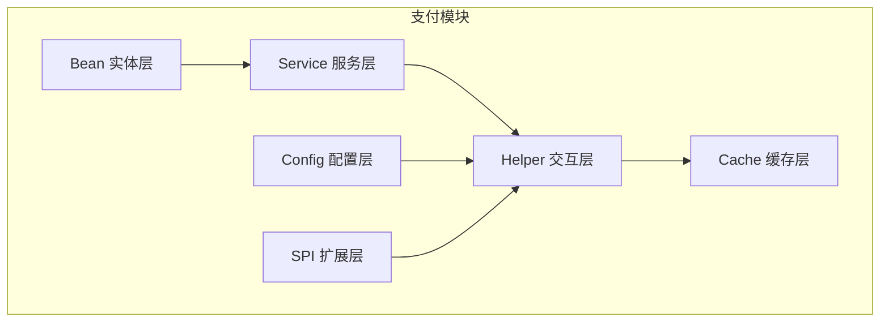
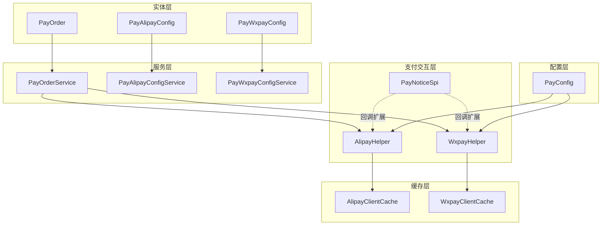
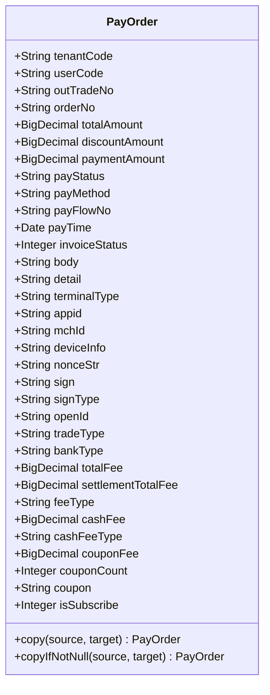
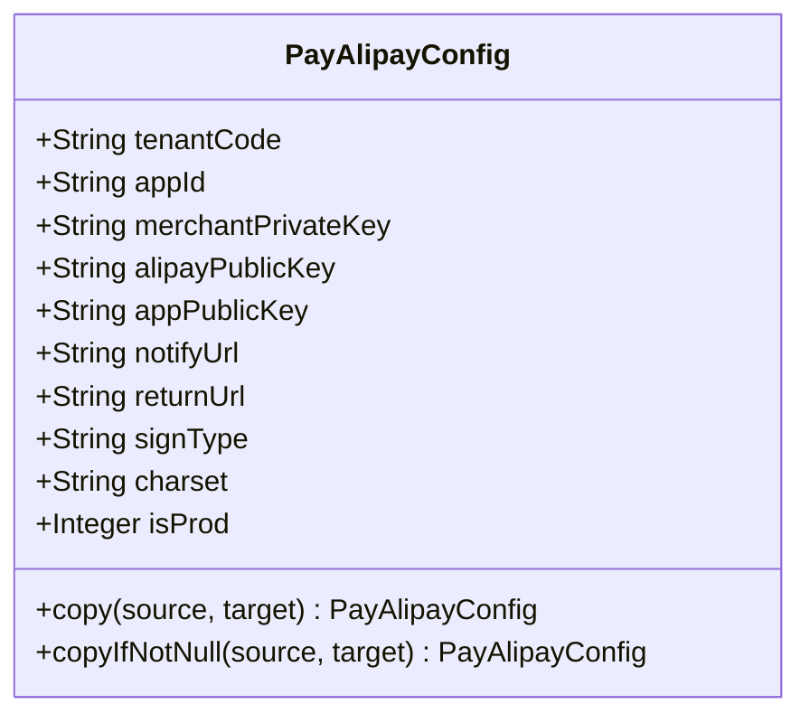
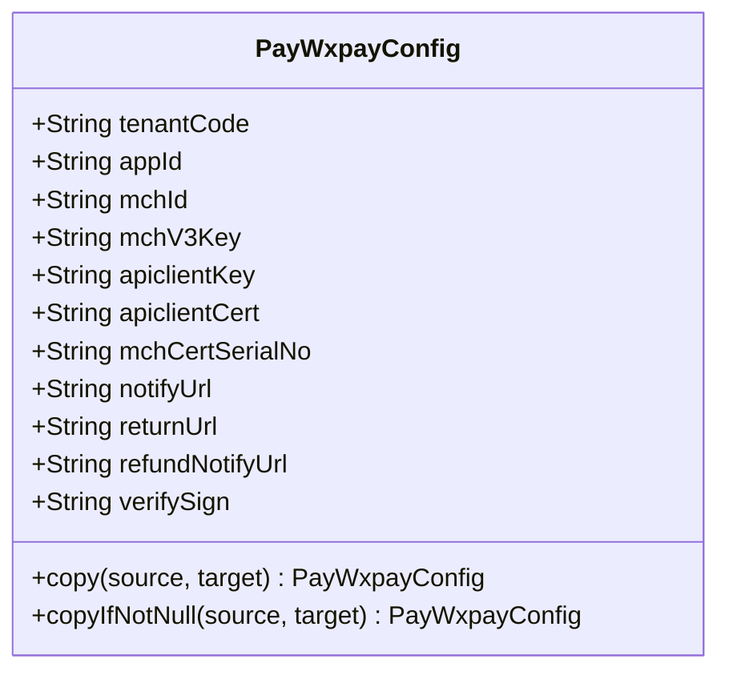
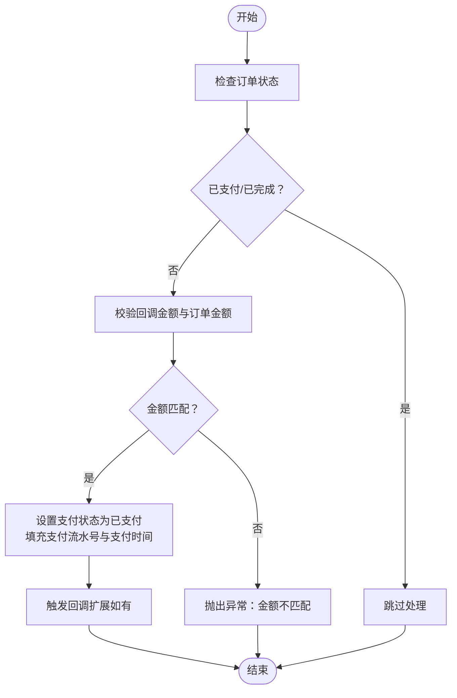
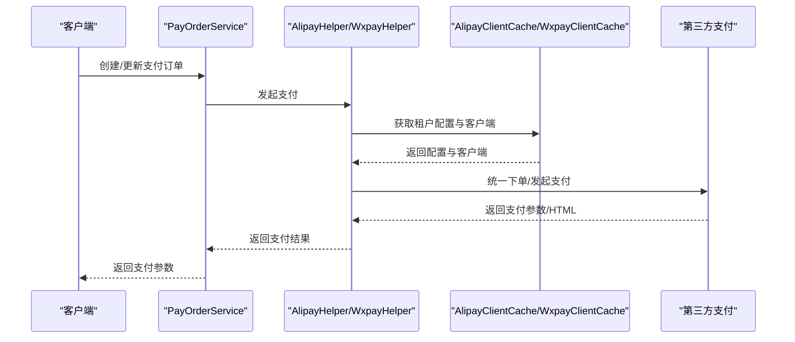
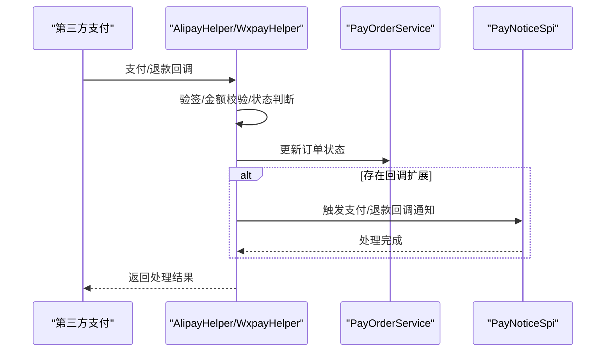
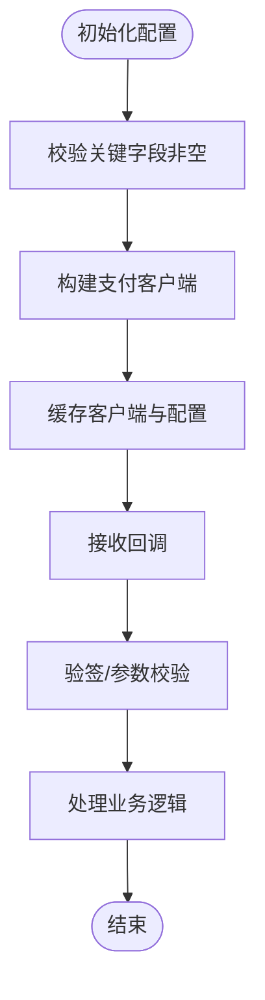
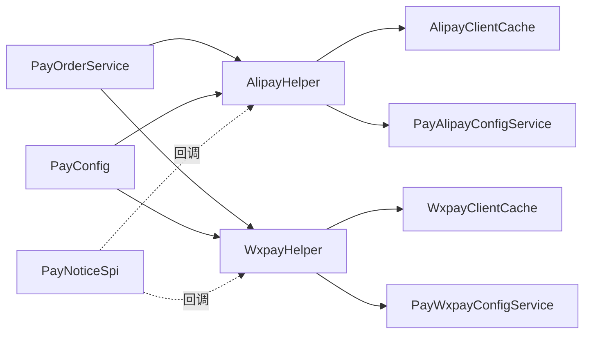

# 支付数据模型

<cite>
**本文档引用的文件**
- [PayOrder.java](file://micro-pay/src/main/java/com/wkclz/micro/pay/bean/entity/PayOrder.java)
- [PayAlipayConfig.java](file://micro-pay/src/main/java/com/wkclz/micro/pay/bean/entity/PayAlipayConfig.java)
- [PayWxpayConfig.java](file://micro-pay/src/main/java/com/wkclz/micro/pay/bean/entity/PayWxpayConfig.java)
- [PayConfig.java](file://micro-pay/src/main/java/com/wkclz/micro/pay/config/PayConfig.java)
- [PayOrderService.java](file://micro-pay/src/main/java/com/wkclz/micro/pay/service/PayOrderService.java)
- [PayAlipayConfigService.java](file://micro-pay/src/main/java/com/wkclz/micro/pay/service/PayAlipayConfigService.java)
- [PayWxpayConfigService.java](file://micro-pay/src/main/java/com/wkclz/micro/pay/service/PayWxpayConfigService.java)
- [AlipayHelper.java](file://micro-pay/src/main/java/com/wkclz/micro/pay/helper/AlipayHelper.java)
- [WxpayHelper.java](file://micro-pay/src/main/java/com/wkclz/micro/pay/helper/WxpayHelper.java)
- [AlipayClientCache.java](file://micro-pay/src/main/java/com/wkclz/micro/pay/cache/AlipayClientCache.java)
- [WxpayClientCache.java](file://micro-pay/src/main/java/com/wkclz/micro/pay/cache/WxpayClientCache.java)
- [PayNoticeSpi.java](file://micro-pay/src/main/java/com/wkclz/micro/pay/spi/PayNoticeSpi.java)
</cite>

## 目录
1. [简介](#简介)
2. [项目结构](#项目结构)
3. [核心组件](#核心组件)
4. [架构概览](#架构概览)
5. [详细组件分析](#详细组件分析)
6. [依赖分析](#依赖分析)
7. [性能考虑](#性能考虑)
8. [故障排除指南](#故障排除指南)
9. [结论](#结论)

## 简介
本文件为支付数据模型的全面技术文档，聚焦于支付订单、支付配置等支付相关实体的设计与实现。重点涵盖以下内容：
- PayOrder、PayAlipayConfig、PayWxpayConfig 等核心实体的字段定义与用途
- 支付业务逻辑：状态流转、金额计算、支付方式选择
- 微信支付与支付宝配置的数据结构与参数设置
- 支付状态管理、回调处理与异常处理的数据模型设计
- 支付安全机制与数据加密的实现说明

## 项目结构
支付模块采用按职责分层的组织方式，主要由以下层次构成：
- Bean 层：实体类（PayOrder、PayAlipayConfig、PayWxpayConfig）
- Service 层：业务服务（PayOrderService、PayAlipayConfigService、PayWxpayConfigService）
- Helper 层：支付交互封装（AlipayHelper、WxpayHelper）
- Cache 层：第三方 SDK 客户端缓存（AlipayClientCache、WxpayClientCache）
- Config 层：支付全局配置（PayConfig）
- SPI 层：支付回调扩展点（PayNoticeSpi）

**图表来源**
- [PayOrder.java:1-316](file://micro-pay/src/main/java/com/wkclz/micro/pay/bean/entity/PayOrder.java#L1-L316)
- [PayAlipayConfig.java:1-132](file://micro-pay/src/main/java/com/wkclz/micro/pay/bean/entity/PayAlipayConfig.java#L1-L132)
- [PayWxpayConfig.java:1-140](file://micro-pay/src/main/java/com/wkclz/micro/pay/bean/entity/PayWxpayConfig.java#L1-L140)
- [PayOrderService.java:1-110](file://micro-pay/src/main/java/com/wkclz/micro/pay/service/PayOrderService.java#L1-L110)
- [PayAlipayConfigService.java:1-77](file://micro-pay/src/main/java/com/wkclz/micro/pay/service/PayAlipayConfigService.java#L1-L77)
- [PayWxpayConfigService.java:1-89](file://micro-pay/src/main/java/com/wkclz/micro/pay/service/PayWxpayConfigService.java#L1-L89)
- [AlipayHelper.java:1-380](file://micro-pay/src/main/java/com/wkclz/micro/pay/helper/AlipayHelper.java#L1-L380)
- [WxpayHelper.java:1-545](file://micro-pay/src/main/java/com/wkclz/micro/pay/helper/WxpayHelper.java#L1-L545)
- [AlipayClientCache.java:1-189](file://micro-pay/src/main/java/com/wkclz/micro/pay/cache/AlipayClientCache.java#L1-L189)
- [WxpayClientCache.java:1-170](file://micro-pay/src/main/java/com/wkclz/micro/pay/cache/WxpayClientCache.java#L1-L170)
- [PayConfig.java:1-25](file://micro-pay/src/main/java/com/wkclz/micro/pay/config/PayConfig.java#L1-L25)
- [PayNoticeSpi.java:1-14](file://micro-pay/src/main/java/com/wkclz/micro/pay/spi/PayNoticeSpi.java#L1-L14)

**章节来源**
- [PayOrder.java:1-316](file://micro-pay/src/main/java/com/wkclz/micro/pay/bean/entity/PayOrder.java#L1-L316)
- [PayAlipayConfig.java:1-132](file://micro-pay/src/main/java/com/wkclz/micro/pay/bean/entity/PayAlipayConfig.java#L1-L132)
- [PayWxpayConfig.java:1-140](file://micro-pay/src/main/java/com/wkclz/micro/pay/bean/entity/PayWxpayConfig.java#L1-L140)
- [PayOrderService.java:1-110](file://micro-pay/src/main/java/com/wkclz/micro/pay/service/PayOrderService.java#L1-L110)
- [PayAlipayConfigService.java:1-77](file://micro-pay/src/main/java/com/wkclz/micro/pay/service/PayAlipayConfigService.java#L1-L77)
- [PayWxpayConfigService.java:1-89](file://micro-pay/src/main/java/com/wkclz/micro/pay/service/PayWxpayConfigService.java#L1-L89)
- [AlipayHelper.java:1-380](file://micro-pay/src/main/java/com/wkclz/micro/pay/helper/AlipayHelper.java#L1-L380)
- [WxpayHelper.java:1-545](file://micro-pay/src/main/java/com/wkclz/micro/pay/helper/WxpayHelper.java#L1-L545)
- [AlipayClientCache.java:1-189](file://micro-pay/src/main/java/com/wkclz/micro/pay/cache/AlipayClientCache.java#L1-L189)
- [WxpayClientCache.java:1-170](file://micro-pay/src/main/java/com/wkclz/micro/pay/cache/WxpayClientCache.java#L1-L170)
- [PayConfig.java:1-25](file://micro-pay/src/main/java/com/wkclz/micro/pay/config/PayConfig.java#L1-L25)
- [PayNoticeSpi.java:1-14](file://micro-pay/src/main/java/com/wkclz/micro/pay/spi/PayNoticeSpi.java#L1-L14)

## 核心组件
本节对支付相关的核心实体进行深入解析，包括字段定义、业务含义与约束。

- 支付订单实体（PayOrder）
  - 关键字段：租户编码、用户编码、支付订单号、订单号、平台总金额、优惠金额、支付金额、支付状态、支付方式、支付流水号、支付时间、发票状态、商品描述、商品详情、终端类型、公众号/小程序ID、商户号、设备号、随机字符串、签名、签名类型、微信openId、交易类型、付款银行、订单金额、应结订单金额、货币种类、现金支付金额、现金支付货币类型、总代金券金额、代金券使用数量、代金券JSON、是否关注公众账号等。
  - 复制工具方法：提供完整复制与非空复制，便于在不同上下文间传递与更新订单对象。

- 支付配置实体（PayAlipayConfig）
  - 关键字段：租户编码、应用ID、商户私钥、支付宝公钥、应用公钥、服务器异步通知路径、页面跳转同步通知页面路径、签名方式、字符编码格式、是否为生产环境。
  - 安全处理：在查询详情时对敏感字段进行遮蔽显示，避免泄露。

- 支付配置实体（PayWxpayConfig）
  - 关键字段：租户编码、AppId、支付商户号、支付商户密钥V3、商户API证书Key、商户API证书Cert、商户API证书序列号、服务器异步通知路径、页面跳转同步通知页面路径、退款回调地址、微信域名验证签名。
  - 安全处理：在查询详情时对敏感字段进行遮蔽显示，避免泄露。

**章节来源**
- [PayOrder.java:17-316](file://micro-pay/src/main/java/com/wkclz/micro/pay/bean/entity/PayOrder.java#L17-L316)
- [PayAlipayConfig.java:17-132](file://micro-pay/src/main/java/com/wkclz/micro/pay/bean/entity/PayAlipayConfig.java#L17-L132)
- [PayWxpayConfig.java:17-140](file://micro-pay/src/main/java/com/wkclz/micro/pay/bean/entity/PayWxpayConfig.java#L17-L140)

## 架构概览
支付模块的整体架构围绕“实体-服务-交互-缓存-配置”的分层设计展开，辅以 SPI 扩展点实现回调解耦。

**图表来源**
- [AlipayHelper.java:44-380](file://micro-pay/src/main/java/com/wkclz/micro/pay/helper/AlipayHelper.java#L44-L380)
- [WxpayHelper.java:57-545](file://micro-pay/src/main/java/com/wkclz/micro/pay/helper/WxpayHelper.java#L57-L545)
- [AlipayClientCache.java:25-189](file://micro-pay/src/main/java/com/wkclz/micro/pay/cache/AlipayClientCache.java#L25-L189)
- [WxpayClientCache.java:26-170](file://micro-pay/src/main/java/com/wkclz/micro/pay/cache/WxpayClientCache.java#L26-L170)
- [PayOrderService.java:26-110](file://micro-pay/src/main/java/com/wkclz/micro/pay/service/PayOrderService.java#L26-L110)
- [PayAlipayConfigService.java:22-77](file://micro-pay/src/main/java/com/wkclz/micro/pay/service/PayAlipayConfigService.java#L22-L77)
- [PayWxpayConfigService.java:22-89](file://micro-pay/src/main/java/com/wkclz/micro/pay/service/PayWxpayConfigService.java#L22-L89)
- [PayNoticeSpi.java:5-14](file://micro-pay/src/main/java/com/wkclz/micro/pay/spi/PayNoticeSpi.java#L5-L14)
- [PayConfig.java:12-25](file://micro-pay/src/main/java/com/wkclz/micro/pay/config/PayConfig.java#L12-L25)

## 详细组件分析

### 支付订单实体（PayOrder）
- 字段设计要点
  - 金额字段：平台总金额、优惠金额、支付金额、订单金额、应结订单金额、现金支付金额、总代金券金额等，均采用高精度数值类型，确保支付金额计算的准确性。
  - 状态字段：支付状态、发票状态等，用于跟踪订单生命周期与开票状态。
  - 渠道字段：微信openId、交易类型、付款银行、货币种类等，满足微信支付与多币种场景需求。
  - 安全字段：随机字符串、签名、签名类型等，支撑支付签名与验签流程。
- 复制工具方法
  - 提供完整复制与非空复制，便于在不同上下文间传递与更新订单对象，减少冗余赋值代码。

**图表来源**
- [PayOrder.java:17-316](file://micro-pay/src/main/java/com/wkclz/micro/pay/bean/entity/PayOrder.java#L17-L316)

**章节来源**
- [PayOrder.java:17-316](file://micro-pay/src/main/java/com/wkclz/micro/pay/bean/entity/PayOrder.java#L17-L316)

### 支付配置实体（PayAlipayConfig）
- 字段设计要点
  - 应用级配置：应用ID、应用公钥、签名方式、字符编码格式、是否为生产环境等，支撑支付宝 SDK 初始化。
  - 安全密钥：商户私钥、支付宝公钥，用于签名与验签。
  - 回调地址：服务器异步通知路径、页面跳转同步通知页面路径，确保支付结果及时回传。
- 安全处理
  - 查询详情时对敏感字段进行遮蔽显示，避免泄露。

**图表来源**
- [PayAlipayConfig.java:17-132](file://micro-pay/src/main/java/com/wkclz/micro/pay/bean/entity/PayAlipayConfig.java#L17-L132)

**章节来源**
- [PayAlipayConfig.java:17-132](file://micro-pay/src/main/java/com/wkclz/micro/pay/bean/entity/PayAlipayConfig.java#L17-L132)

### 支付配置实体（PayWxpayConfig）
- 字段设计要点
  - 应用级配置：AppId、支付商户号、商户API证书序列号、服务器异步通知路径、页面跳转同步通知页面路径、退款回调地址等。
  - 安全密钥：支付商户密钥V3、商户API证书Key、商户API证书Cert，用于 V3 接口签名与证书校验。
  - 域名验证：微信域名验证签名，保障回调来源可信。
- 安全处理
  - 查询详情时对敏感字段进行遮蔽显示，避免泄露。

**图表来源**
- [PayWxpayConfig.java:17-140](file://micro-pay/src/main/java/com/wkclz/micro/pay/bean/entity/PayWxpayConfig.java#L17-L140)

**章节来源**
- [PayWxpayConfig.java:17-140](file://micro-pay/src/main/java/com/wkclz/micro/pay/bean/entity/PayWxpayConfig.java#L17-L140)

### 支付状态管理与金额计算
- 支付状态
  - 支付状态字段用于标识订单当前所处阶段，常见状态包括待支付、已支付、已完成、退款中、已退款等。具体状态值由业务枚举定义（例如 PAID、FINISHED、REFUNDED 等）。
- 金额计算
  - 平台总金额、优惠金额、支付金额三者关系通常为：支付金额 = 总金额 - 优惠金额。系统在回调处理时会对金额进行严格校验，确保回调金额与订单金额一致。
- 交易类型与终端类型
  - 交易类型（如 JSAPI、NATIVE、APP）与终端类型（PC、H5、小程序）共同决定支付渠道与交互方式。

**图表来源**
- [AlipayHelper.java:162-217](file://micro-pay/src/main/java/com/wkclz/micro/pay/helper/AlipayHelper.java#L162-L217)
- [WxpayHelper.java:235-301](file://micro-pay/src/main/java/com/wkclz/micro/pay/helper/WxpayHelper.java#L235-L301)

**章节来源**
- [AlipayHelper.java:162-217](file://micro-pay/src/main/java/com/wkclz/micro/pay/helper/AlipayHelper.java#L162-L217)
- [WxpayHelper.java:235-301](file://micro-pay/src/main/java/com/wkclz/micro/pay/helper/WxpayHelper.java#L235-L301)

### 支付方式选择与发起支付
- 支付方式选择
  - 通过支付方式字段与终端类型字段组合，确定使用支付宝或微信支付，并选择相应的交易类型（如 JSAPI、WAP、PC 等）。
- 发起支付流程
  - 支付宝：根据终端类型选择网页支付或手机网站支付，设置异步通知与同步回跳地址，生成支付表单或 HTML 片段。
  - 微信支付：通过统一下单接口生成预支付订单，返回预支付 ID 与客户端支付参数，前端据此发起支付。

**图表来源**
- [PayOrderService.java:52-75](file://micro-pay/src/main/java/com/wkclz/micro/pay/service/PayOrderService.java#L52-L75)
- [AlipayHelper.java:50-159](file://micro-pay/src/main/java/com/wkclz/micro/pay/helper/AlipayHelper.java#L50-L159)
- [WxpayHelper.java:66-172](file://micro-pay/src/main/java/com/wkclz/micro/pay/helper/WxpayHelper.java#L66-L172)
- [AlipayClientCache.java:75-113](file://micro-pay/src/main/java/com/wkclz/micro/pay/cache/AlipayClientCache.java#L75-L113)
- [WxpayClientCache.java:73-108](file://micro-pay/src/main/java/com/wkclz/micro/pay/cache/WxpayClientCache.java#L73-L108)

**章节来源**
- [PayOrderService.java:52-75](file://micro-pay/src/main/java/com/wkclz/micro/pay/service/PayOrderService.java#L52-L75)
- [AlipayHelper.java:50-159](file://micro-pay/src/main/java/com/wkclz/micro/pay/helper/AlipayHelper.java#L50-L159)
- [WxpayHelper.java:66-172](file://micro-pay/src/main/java/com/wkclz/micro/pay/helper/WxpayHelper.java#L66-L172)
- [AlipayClientCache.java:75-113](file://micro-pay/src/main/java/com/wkclz/micro/pay/cache/AlipayClientCache.java#L75-L113)
- [WxpayClientCache.java:73-108](file://micro-pay/src/main/java/com/wkclz/micro/pay/cache/WxpayClientCache.java#L73-L108)

### 回调处理与异常处理
- 支付宝回调
  - 根据交易状态设置订单状态；对重复回调进行幂等处理；对金额与订单号进行校验；验签失败时拒绝处理并记录日志。
- 微信支付回调
  - 对回调金额进行严格校验；解析回调参数并填充订单字段；根据回调状态设置订单状态；触发回调扩展点；退款回调时更新订单状态并触发退款扩展。
- 异常处理
  - 对无效参数、金额不匹配、验签失败等情况抛出明确的业务异常；对第三方接口异常进行捕获与包装，保证对外统一的错误语义。

**图表来源**
- [AlipayHelper.java:162-217](file://micro-pay/src/main/java/com/wkclz/micro/pay/helper/AlipayHelper.java#L162-L217)
- [WxpayHelper.java:235-301](file://micro-pay/src/main/java/com/wkclz/micro/pay/helper/WxpayHelper.java#L235-L301)
- [WxpayHelper.java:436-520](file://micro-pay/src/main/java/com/wkclz/micro/pay/helper/WxpayHelper.java#L436-L520)
- [PayNoticeSpi.java:5-14](file://micro-pay/src/main/java/com/wkclz/micro/pay/spi/PayNoticeSpi.java#L5-L14)

**章节来源**
- [AlipayHelper.java:162-217](file://micro-pay/src/main/java/com/wkclz/micro/pay/helper/AlipayHelper.java#L162-L217)
- [WxpayHelper.java:235-301](file://micro-pay/src/main/java/com/wkclz/micro/pay/helper/WxpayHelper.java#L235-L301)
- [WxpayHelper.java:436-520](file://micro-pay/src/main/java/com/wkclz/micro/pay/helper/WxpayHelper.java#L436-L520)
- [PayNoticeSpi.java:5-14](file://micro-pay/src/main/java/com/wkclz/micro/pay/spi/PayNoticeSpi.java#L5-L14)

### 支付安全机制与数据加密
- 支付宝安全
  - 使用应用私钥进行签名，使用支付宝公钥进行验签；支持多种签名方式与字符集；生产/沙箱环境切换。
- 微信支付安全
  - 使用商户密钥V3与证书进行签名与验签；支持证书序列号校验；回调头包含签名、随机数、序列号、时间戳等字段，确保回调来源可信。
- 敏感信息保护
  - 配置查询时对敏感字段进行遮蔽显示；缓存初始化时对关键字段进行非空校验与默认值处理；回调处理前进行严格的验签与参数校验。

**图表来源**
- [AlipayClientCache.java:115-185](file://micro-pay/src/main/java/com/wkclz/micro/pay/cache/AlipayClientCache.java#L115-L185)
- [WxpayClientCache.java:110-166](file://micro-pay/src/main/java/com/wkclz/micro/pay/cache/WxpayClientCache.java#L110-L166)
- [AlipayHelper.java:341-362](file://micro-pay/src/main/java/com/wkclz/micro/pay/helper/AlipayHelper.java#L341-L362)
- [WxpayHelper.java:526-542](file://micro-pay/src/main/java/com/wkclz/micro/pay/helper/WxpayHelper.java#L526-L542)

**章节来源**
- [AlipayClientCache.java:115-185](file://micro-pay/src/main/java/com/wkclz/micro/pay/cache/AlipayClientCache.java#L115-L185)
- [WxpayClientCache.java:110-166](file://micro-pay/src/main/java/com/wkclz/micro/pay/cache/WxpayClientCache.java#L110-L166)
- [AlipayHelper.java:341-362](file://micro-pay/src/main/java/com/wkclz/micro/pay/helper/AlipayHelper.java#L341-L362)
- [WxpayHelper.java:526-542](file://micro-pay/src/main/java/com/wkclz/micro/pay/helper/WxpayHelper.java#L526-L542)

## 依赖分析
- 组件耦合
  - Service 层依赖 Mapper 进行持久化操作，同时依赖 Helper 层发起支付与处理回调。
  - Helper 层依赖缓存层获取租户配置与客户端实例，依赖 SPI 进行回调扩展。
  - 配置层通过环境变量控制支付行为（如状态同步开关、超时取消策略）。
- 外部依赖
  - 支付宝 SDK：DefaultAlipayClient、AlipaySignature 等。
  - 微信支付 SDK：WxPayService、WxPayConfig、签名与验签工具。
- 循环依赖
  - 当前结构未发现循环依赖，各层职责清晰，通过接口与抽象进行解耦。

**图表来源**
- [PayOrderService.java:26-110](file://micro-pay/src/main/java/com/wkclz/micro/pay/service/PayOrderService.java#L26-L110)
- [AlipayHelper.java:44-380](file://micro-pay/src/main/java/com/wkclz/micro/pay/helper/AlipayHelper.java#L44-L380)
- [WxpayHelper.java:57-545](file://micro-pay/src/main/java/com/wkclz/micro/pay/helper/WxpayHelper.java#L57-L545)
- [AlipayClientCache.java:25-189](file://micro-pay/src/main/java/com/wkclz/micro/pay/cache/AlipayClientCache.java#L25-L189)
- [WxpayClientCache.java:26-170](file://micro-pay/src/main/java/com/wkclz/micro/pay/cache/WxpayClientCache.java#L26-L170)
- [PayConfig.java:12-25](file://micro-pay/src/main/java/com/wkclz/micro/pay/config/PayConfig.java#L12-L25)
- [PayNoticeSpi.java:5-14](file://micro-pay/src/main/java/com/wkclz/micro/pay/spi/PayNoticeSpi.java#L5-L14)

**章节来源**
- [PayOrderService.java:26-110](file://micro-pay/src/main/java/com/wkclz/micro/pay/service/PayOrderService.java#L26-L110)
- [AlipayHelper.java:44-380](file://micro-pay/src/main/java/com/wkclz/micro/pay/helper/AlipayHelper.java#L44-L380)
- [WxpayHelper.java:57-545](file://micro-pay/src/main/java/com/wkclz/micro/pay/helper/WxpayHelper.java#L57-L545)
- [AlipayClientCache.java:25-189](file://micro-pay/src/main/java/com/wkclz/micro/pay/cache/AlipayClientCache.java#L25-L189)
- [WxpayClientCache.java:26-170](file://micro-pay/src/main/java/com/wkclz/micro/pay/cache/WxpayClientCache.java#L26-L170)
- [PayConfig.java:12-25](file://micro-pay/src/main/java/com/wkclz/micro/pay/config/PayConfig.java#L12-L25)
- [PayNoticeSpi.java:5-14](file://micro-pay/src/main/java/com/wkclz/micro/pay/spi/PayNoticeSpi.java#L5-L14)

## 性能考虑
- 缓存策略
  - 通过缓存层集中管理租户配置与客户端实例，减少重复初始化成本；提供自动清理机制，避免配置变更导致的脏读。
- 异步处理
  - 支付回调采用异步处理模式，降低请求阻塞风险；退款回调同样采用异步处理，提升吞吐量。
- 资源复用
  - 支付客户端与配置在租户维度内复用，避免频繁创建销毁带来的性能损耗。

## 故障排除指南
- 常见问题
  - 金额不匹配：检查回调金额与订单金额转换逻辑，确保单位换算正确。
  - 验签失败：核对签名算法、字符集与公钥配置，确认回调参数完整性。
  - 配置缺失：确认租户配置是否存在且关键字段非空，必要时设置默认值。
- 日志与监控
  - 对异常场景进行详细日志记录，便于定位问题；结合监控指标观察回调成功率与处理耗时。

**章节来源**
- [AlipayHelper.java:174-217](file://micro-pay/src/main/java/com/wkclz/micro/pay/helper/AlipayHelper.java#L174-L217)
- [WxpayHelper.java:244-301](file://micro-pay/src/main/java/com/wkclz/micro/pay/helper/WxpayHelper.java#L244-L301)
- [AlipayClientCache.java:152-185](file://micro-pay/src/main/java/com/wkclz/micro/pay/cache/AlipayClientCache.java#L152-L185)
- [WxpayClientCache.java:147-166](file://micro-pay/src/main/java/com/wkclz/micro/pay/cache/WxpayClientCache.java#L147-L166)

## 结论
本支付数据模型围绕 PayOrder、PayAlipayConfig、PayWxpayConfig 三大核心实体，构建了从订单管理、配置维护到支付交互与回调处理的完整闭环。通过严谨的字段设计、完善的金额校验与验签机制、以及可扩展的 SPI 回调体系，系统在保证安全性的同时兼顾了灵活性与可维护性。建议在实际部署中重点关注配置项的完整性与敏感信息的保护，并结合监控与日志持续优化支付体验。