# 数据模型

<cite>
**本文引用的文件**
- [MdmChangeLog.java](file://micro-audit/src/main/java/com/wkclz/micro/audit/bean/entity/MdmChangeLog.java)
- [MdmDict.java](file://micro-dict/src/main/java/com/wkclz/micro/dict/bean/entity/MdmDict.java)
- [MdmDictItem.java](file://micro-dict/src/main/java/com/wkclz/micro/dict/bean/entity/MdmDictItem.java)
- [DbviewDatasource.java](file://micro-dbview/src/main/java/com/wkclz/micro/dbview/bean/entity/DbviewDatasource.java)
- [DbviewDatasourcePermission.java](file://micro-dbview/src/main/java/com/wkclz/micro/dbview/bean/entity/DbviewDatasourcePermission.java)
- [DbviewSqlHistory.java](file://micro-dbview/src/main/java/com/wkclz/micro/dbview/bean/entity/DbviewSqlHistory.java)
- [MdmFileosBucket.java](file://micro-fileos/src/main/java/com/wkclz/micro/fileos/bean/entity/MdmFileosBucket.java)
- [MdmFileosDirectory.java](file://micro-fileos/src/main/java/com/wkclz/micro/fileos/bean/entity/MdmFileosDirectory.java)
- [MdmFileosMultipart.java](file://micro-fileos/src/main/java/com/wkclz/micro/fileos/bean/entity/MdmFileosMultipart.java)
- [MdmFileosRecord.java](file://micro-fileos/src/main/java/com/wkclz/micro/fileos/bean/entity/MdmFileosRecord.java)
- [MdmMaterial.java](file://micro-material/src/main/java/com/wkclz/micro/material/bean/entity/MdmMaterial.java)
- [MdmMaterialGroup.java](file://micro-material/src/main/java/com/wkclz/micro/material/bean/entity/MdmMaterialGroup.java)
- [MdmMaterialRef.java](file://micro-material/src/main/java/com/wkclz/micro/material/bean/entity/MdmMaterialRef.java)
- [MdmMaterialTransferLog.java](file://micro-material/src/main/java/com/wkclz/micro/material/bean/entity/MdmMaterialTransferLog.java)
- [MdmMaterialVersion.java](file://micro-material/src/main/java/com/wkclz/micro/material/bean/entity/MdmMaterialVersion.java)
- [MsgNotification.java](file://micro-msg/src/main/java/com/wkclz/micro/msg/bean/entity/MsgNotification.java)
- [MsgTemplate.java](file://micro-msg/src/main/java/com/wkclz/micro/msg/bean/entity/MsgTemplate.java)
- [MsgUserRecord.java](file://micro-msg/src/main/java/com/wkclz/micro/msg/bean/entity/MsgUserRecord.java)
- [MsgUserSettings.java](file://micro-msg/src/main/java/com/wkclz/micro/msg/bean/entity/MsgUserSettings.java)
- [MdmSequence.java](file://micro-seq/src/main/java/com/wkclz/micro/seq/bean/entity/MdmSequence.java)
- [MdmPdfTemplate.java](file://micro-pdf/src/main/java/com/wkclz/micro/pdf/bean/entity/MdmPdfTemplate.java)
- [ReportDefinition.java](file://micro-report/src/main/java/com/wkclz/micro/report/bean/entity/ReportDefinition.java)
- [ReportDefinitionParam.java](file://micro-report/src/main/java/com/wkclz/micro/report/bean/entity/ReportDefinitionParam.java)
- [ReportDefinitionResult.java](file://micro-report/src/main/java/com/wkclz/micro/report/bean/entity/ReportDefinitionResult.java)
- [ReportDefinitionHis.java](file://micro-report/src/main/java/com/wkclz/micro/report/bean/entity/ReportDefinitionHis.java)
- [FunFunction.java](file://micro-fun/src/main/java/com/wkclz/micro/fun/bean/entity/FunFunction.java)
- [FunCategory.java](file://micro-fun/src/main/java/com/wkclz/micro/fun/bean/entity/FunCategory.java)
- [LiteflowChain.java](file://micro-liteflow/src/main/java/com/wkclz/micro/liteflow/bean/entity/LiteflowChain.java)
- [LiteflowScript.java](file://micro-liteflow/src/main/java/com/wkclz/micro/liteflow/bean/entity/LiteflowScript.java)
- [RmCheckRule.java](file://micro-rmcheck/src/main/java/com/wkclz/micro/rmcheck/bean/entity/RmCheckRule.java)
- [RmCheckRuleItem.java](file://micro-rmcheck/src/main/java/com/wkclz/micro/rmcheck/bean/entity/RmCheckRuleItem.java)
- [Check.java](file://micro-rmcheck/src/main/java/com/wkclz/micro/rmcheck/bean/entity/Check.java)
- [MdmMaskRule.java](file://micro-mask/src/main/java/com/wkclz/micro/mask/bean/entity/MdmMaskRule.java)
- [MdmForm.java](file://micro-form/src/main/java/com/wkclz/micro/form/bean/entity/MdmForm.java)
- [MdmFormItem.java](file://micro-form/src/main/java/com/wkclz/micro/form/bean/entity/MdmFormItem.java)
- [MdmFormRule.java](file://micro-form/src/main/java/com/wkclz/micro/form/bean/entity/MdmFormRule.java)
- [MdmFormRuleField.java](file://micro-form/src/main/java/com/wkclz/micro/form/bean/entity/MdmFormRuleField.java)
- [MdmFormRuleFieldValidator.java](file://micro-form/src/main/java/com/wkclz/micro/form/bean/entity/MdmFormRuleFieldValidator.java)
- [MdmFormRuleValidatorTemplate.java](file://micro-form/src/main/java/com/wkclz/micro/form/bean/entity/MdmFormRuleValidatorTemplate.java)
- [PayOrder.java](file://micro-pay/src/main/java/com/wkclz/micro/pay/bean/entity/PayOrder.java)
- [PayAlipayConfig.java](file://micro-pay/src/main/java/com/wkclz/micro/pay/bean/entity/PayAlipayConfig.java)
- [PayWxpayConfig.java](file://micro-pay/src/main/java/com/wkclz/micro/pay/bean/entity/PayWxpayConfig.java)
- [MdmDictItemMapper.xml](file://micro-dict/src/main/resources/mapper/MdmDictItemMapper.xml)
- [MdmDictMapper.xml](file://micro-dict/src/main/resources/mapper/MdmDictMapper.xml)
- [MdmFileosBucketMapper.xml](file://micro-fileos/src/main/resources/mapper/MdmFileosBucketMapper.xml)
- [MdmFileosDirectoryMapper.xml](file://micro-fileos/src/main/resources/mapper/MdmFileosDirectoryMapper.xml)
- [MdmFileosMultipartMapper.xml](file://micro-fileos/src/main/resources/mapper/MdmFileosMultipartMapper.xml)
- [MdmFileosRecordMapper.xml](file://micro-fileos/src/main/resources/mapper/MdmFileosRecordMapper.xml)
- [MdmMaterialGroupMapper.xml](file://micro-material/src/main/resources/mapper/MdmMaterialGroupMapper.xml)
- [MdmMaterialMapper.xml](file://micro-material/src/main/resources/mapper/MdmMaterialMapper.xml)
- [MdmMaterialRefMapper.xml](file://micro-material/src/main/resources/mapper/MdmMaterialRefMapper.xml)
- [MdmMaterialTransferLogMapper.xml](file://micro-material/src/main/resources/mapper/MdmMaterialTransferLogMapper.xml)
- [MdmMaterialVersionMapper.xml](file://micro-material/src/main/resources/mapper/MdmMaterialVersionMapper.xml)
- [MsgNotificationMapper.xml](file://micro-msg/src/main/resources/mapper/MsgNotificationMapper.xml)
- [MsgTemplateMapper.xml](file://micro-msg/src/main/resources/mapper/MsgTemplateMapper.xml)
- [MsgUserRecordMapper.xml](file://micro-msg/src/main/resources/mapper/MsgUserRecordMapper.xml)
- [MsgUserSettingsMapper.xml](file://micro-msg/src/main/resources/mapper/MsgUserSettingsMapper.xml)
- [DbviewDatasourceMapper.xml](file://micro-dbview/src/main/resources/mapper/DbviewDatasourceMapper.xml)
- [DbviewDatasourcePermissionMapper.xml](file://micro-dbview/src/main/resources/mapper/DbviewDatasourcePermissionMapper.xml)
- [DbviewSqlHistoryMapper.xml](file://micro-dbview/src/main/resources/mapper/DbviewSqlHistoryMapper.xml)
- [MdmChangeLogMapper.xml](file://micro-audit/src/main/resources/mapper/MdmChangeLogMapper.xml)
- [MdmSequenceMapper.xml](file://micro-seq/src/main/resources/mapper/MdmSequenceMapper.xml)
- [MdmPdfTemplateMapper.xml](file://micro-pdf/src/main/resources/mapper/MdmPdfTemplateMapper.xml)
- [ReportDefinitionMapper.xml](file://micro-report/src/main/resources/mapper/ReportDefinitionMapper.xml)
- [ReportDefinitionParamMapper.xml](file://micro-report/src/main/resources/mapper/ReportDefinitionParamMapper.xml)
- [ReportDefinitionResultMapper.xml](file://micro-report/src/main/resources/mapper/ReportDefinitionResultMapper.xml)
- [ReportDefinitionHisMapper.xml](file://micro-report/src/main/resources/mapper/ReportDefinitionHisMapper.xml)
- [FunCategoryMapper.xml](file://micro-fun/src/main/resources/mapper/FunCategoryMapper.xml)
- [FunFunctionMapper.xml](file://micro-fun/src/main/resources/mapper/FunFunctionMapper.xml)
- [LiteflowChainMapper.xml](file://micro-liteflow/src/main/resources/mapper/LiteflowChainMapper.xml)
- [LiteflowScriptMapper.xml](file://micro-liteflow/src/main/resources/mapper/LiteflowScriptMapper.xml)
- [RmCheckRuleMapper.xml](file://micro-rmcheck/src/main/resources/mapper/RmCheckRuleMapper.xml)
- [RmCheckRuleItemMapper.xml](file://micro-rmcheck/src/main/resources/mapper/RmCheckRuleItemMapper.xml)
- [CheckMapper.xml](file://micro-rmcheck/src/main/resources/mapper/CheckMapper.xml)
- [MdmMaskRuleMapper.xml](file://micro-mask/src/main/resources/mapper/MdmMaskRuleMapper.xml)
- [MdmFormMapper.xml](file://micro-form/src/main/resources/mapper/MdmFormMapper.xml)
- [MdmFormItemMapper.xml](file://micro-form/src/main/resources/mapper/MdmFormItemMapper.xml)
- [MdmFormRuleMapper.xml](file://micro-form/src/main/resources/mapper/MdmFormRuleMapper.xml)
- [MdmFormRuleFieldMapper.xml](file://micro-form/src/main/resources/mapper/MdmFormRuleFieldMapper.xml)
- [MdmFormRuleFieldValidatorMapper.xml](file://micro-form/src/main/resources/mapper/MdmFormRuleFieldValidatorMapper.xml)
- [MdmFormRuleValidatorTemplateMapper.xml](file://micro-form/src/main/resources/mapper/MdmFormRuleValidatorTemplateMapper.xml)
- [PayAlipayConfigMapper.xml](file://micro-pay/src/main/resources/mapper/PayAlipayConfigMapper.xml)
- [PayOrderMapper.xml](file://micro-pay/src/main/resources/mapper/PayOrderMapper.xml)
- [PayWxpayConfigMapper.xml](file://micro-pay/src/main/resources/mapper/PayWxpayConfigMapper.xml)
</cite>

## 目录
1. [简介](#简介)
2. [项目结构](#项目结构)
3. [核心组件](#核心组件)
4. [架构总览](#架构总览)
5. [详细组件分析](#详细组件分析)
6. [依赖分析](#依赖分析)
7. [性能考虑](#性能考虑)
8. [故障排查指南](#故障排查指南)
9. [结论](#结论)
10. [附录](#附录)

## 简介
本文件系统性梳理 sh-microapp 微服务框架中的数据模型，覆盖实体类字段定义、数据类型、业务含义、实体关系映射（一对一、一对多、多对多）、数据库表结构设计（主键、外键、索引、约束）、数据验证与业务规则、数据完整性保障机制、数据访问模式、缓存策略、性能优化、数据迁移与版本管理、数据生命周期管理以及数据安全与访问控制等。

## 项目结构
- 项目采用多模块微服务架构，每个功能域独立为一个子模块，如审计、字典、文件存储、物料、消息、报表、序列号、PDF、表单、支付等。
- 每个模块包含标准层次：bean（dto/dto/enums/req/resp/entity）、mapper（MyBatis XML 映射）、service、rest、cache、config 等。
- 实体类统一继承基础实体基类，具备通用字段（如标识、时间戳、状态等），便于统一治理与审计。

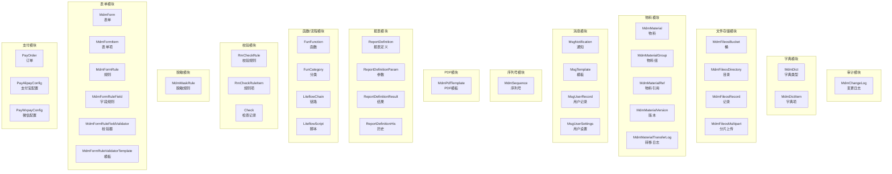

**图表来源**
- [MdmChangeLog.java:1-50](file://micro-audit/src/main/java/com/wkclz/micro/audit/bean/entity/MdmChangeLog.java#L1-L50)
- [MdmDict.java:1-60](file://micro-dict/src/main/java/com/wkclz/micro/dict/bean/entity/MdmDict.java#L1-L60)
- [MdmDictItem.java:1-60](file://micro-dict/src/main/java/com/wkclz/micro/dict/bean/entity/MdmDictItem.java#L1-L60)
- [MdmFileosBucket.java:1-60](file://micro-fileos/src/main/java/com/wkclz/micro/fileos/bean/entity/MdmFileosBucket.java#L1-L60)
- [MdmFileosDirectory.java:1-60](file://micro-fileos/src/main/java/com/wkclz/micro/fileos/bean/entity/MdmFileosDirectory.java#L1-L60)
- [MdmFileosRecord.java:1-60](file://micro-fileos/src/main/java/com/wkclz/micro/fileos/bean/entity/MdmFileosRecord.java#L1-L60)
- [MdmFileosMultipart.java:1-60](file://micro-fileos/src/main/java/com/wkclz/micro/fileos/bean/entity/MdmFileosMultipart.java#L1-L60)
- [MdmMaterial.java:1-120](file://micro-material/src/main/java/com/wkclz/micro/material/bean/entity/MdmMaterial.java#L1-L120)
- [MdmMaterialGroup.java:1-120](file://micro-material/src/main/java/com/wkclz/micro/material/bean/entity/MdmMaterialGroup.java#L1-L120)
- [MdmMaterialRef.java:1-120](file://micro-material/src/main/java/com/wkclz/micro/material/bean/entity/MdmMaterialRef.java#L1-L120)
- [MdmMaterialVersion.java:1-120](file://micro-material/src/main/java/com/wkclz/micro/material/bean/entity/MdmMaterialVersion.java#L1-L120)
- [MdmMaterialTransferLog.java:1-120](file://micro-material/src/main/java/com/wkclz/micro/material/bean/entity/MdmMaterialTransferLog.java#L1-L120)
- [MsgNotification.java:1-120](file://micro-msg/src/main/java/com/wkclz/micro/msg/bean/entity/MsgNotification.java#L1-L120)
- [MsgTemplate.java:1-120](file://micro-msg/src/main/java/com/wkclz/micro/msg/bean/entity/MsgTemplate.java#L1-L120)
- [MsgUserRecord.java:1-120](file://micro-msg/src/main/java/com/wkclz/micro/msg/bean/entity/MsgUserRecord.java#L1-L120)
- [MsgUserSettings.java:1-120](file://micro-msg/src/main/java/com/wkclz/micro/msg/bean/entity/MsgUserSettings.java#L1-L120)
- [MdmSequence.java:1-120](file://micro-seq/src/main/java/com/wkclz/micro/seq/bean/entity/MdmSequence.java#L1-L120)
- [MdmPdfTemplate.java:1-120](file://micro-pdf/src/main/java/com/wkclz/micro/pdf/bean/entity/MdmPdfTemplate.java#L1-L120)
- [ReportDefinition.java:1-120](file://micro-report/src/main/java/com/wkclz/micro/report/bean/entity/ReportDefinition.java#L1-L120)
- [ReportDefinitionParam.java:1-120](file://micro-report/src/main/java/com/wkclz/micro/report/bean/entity/ReportDefinitionParam.java#L1-L120)
- [ReportDefinitionResult.java:1-120](file://micro-report/src/main/java/com/wkclz/micro/report/bean/entity/ReportDefinitionResult.java#L1-L120)
- [ReportDefinitionHis.java:1-120](file://micro-report/src/main/java/com/wkclz/micro/report/bean/entity/ReportDefinitionHis.java#L1-L120)
- [FunFunction.java:1-120](file://micro-fun/src/main/java/com/wkclz/micro/fun/bean/entity/FunFunction.java#L1-L120)
- [FunCategory.java:1-120](file://micro-fun/src/main/java/com/wkclz/micro/fun/bean/entity/FunCategory.java#L1-L120)
- [LiteflowChain.java:1-120](file://micro-liteflow/src/main/java/com/wkclz/micro/liteflow/bean/entity/LiteflowChain.java#L1-L120)
- [LiteflowScript.java:1-120](file://micro-liteflow/src/main/java/com/wkclz/micro/liteflow/bean/entity/LiteflowScript.java#L1-L120)
- [RmCheckRule.java:1-120](file://micro-rmcheck/src/main/java/com/wkclz/micro/rmcheck/bean/entity/RmCheckRule.java#L1-L120)
- [RmCheckRuleItem.java:1-120](file://micro-rmcheck/src/main/java/com/wkclz/micro/rmcheck/bean/entity/RmCheckRuleItem.java#L1-L120)
- [Check.java:1-120](file://micro-rmcheck/src/main/java/com/wkclz/micro/rmcheck/bean/entity/Check.java#L1-L120)
- [MdmMaskRule.java:1-120](file://micro-mask/src/main/java/com/wkclz/micro/mask/bean/entity/MdmMaskRule.java#L1-L120)
- [MdmForm.java:1-120](file://micro-form/src/main/java/com/wkclz/micro/form/bean/entity/MdmForm.java#L1-L120)
- [MdmFormItem.java:1-120](file://micro-form/src/main/java/com/wkclz/micro/form/bean/entity/MdmFormItem.java#L1-L120)
- [MdmFormRule.java:1-120](file://micro-form/src/main/java/com/wkclz/micro/form/bean/entity/MdmFormRule.java#L1-L120)
- [MdmFormRuleField.java:1-120](file://micro-form/src/main/java/com/wkclz/micro/form/bean/entity/MdmFormRuleField.java#L1-L120)
- [MdmFormRuleFieldValidator.java:1-120](file://micro-form/src/main/java/com/wkclz/micro/form/bean/entity/MdmFormRuleFieldValidator.java#L1-L120)
- [MdmFormRuleValidatorTemplate.java:1-120](file://micro-form/src/main/java/com/wkclz/micro/form/bean/entity/MdmFormRuleValidatorTemplate.java#L1-L120)
- [PayOrder.java:1-120](file://micro-pay/src/main/java/com/wkclz/micro/pay/bean/entity/PayOrder.java#L1-L120)
- [PayAlipayConfig.java:1-120](file://micro-pay/src/main/java/com/wkclz/micro/pay/bean/entity/PayAlipayConfig.java#L1-L120)
- [PayWxpayConfig.java:1-120](file://micro-pay/src/main/java/com/wkclz/micro/pay/bean/entity/PayWxpayConfig.java#L1-L120)

**章节来源**
- [MdmDict.java:1-60](file://micro-dict/src/main/java/com/wkclz/micro/dict/bean/entity/MdmDict.java#L1-L60)
- [MdmDictItem.java:1-60](file://micro-dict/src/main/java/com/wkclz/micro/dict/bean/entity/MdmDictItem.java#L1-L60)
- [MdmFileosBucket.java:1-60](file://micro-fileos/src/main/java/com/wkclz/micro/fileos/bean/entity/MdmFileosBucket.java#L1-L60)
- [MdmFileosDirectory.java:1-60](file://micro-fileos/src/main/java/com/wkclz/micro/fileos/bean/entity/MdmFileosDirectory.java#L1-L60)
- [MdmFileosRecord.java:1-60](file://micro-fileos/src/main/java/com/wkclz/micro/fileos/bean/entity/MdmFileosRecord.java#L1-L60)
- [MdmFileosMultipart.java:1-60](file://micro-fileos/src/main/java/com/wkclz/micro/fileos/bean/entity/MdmFileosMultipart.java#L1-L60)
- [MdmMaterial.java:1-120](file://micro-material/src/main/java/com/wkclz/micro/material/bean/entity/MdmMaterial.java#L1-L120)
- [MdmMaterialGroup.java:1-120](file://micro-material/src/main/java/com/wkclz/micro/material/bean/entity/MdmMaterialGroup.java#L1-L120)
- [MdmMaterialRef.java:1-120](file://micro-material/src/main/java/com/wkclz/micro/material/bean/entity/MdmMaterialRef.java#L1-L120)
- [MdmMaterialVersion.java:1-120](file://micro-material/src/main/java/com/wkclz/micro/material/bean/entity/MdmMaterialVersion.java#L1-L120)
- [MdmMaterialTransferLog.java:1-120](file://micro-material/src/main/java/com/wkclz/micro/material/bean/entity/MdmMaterialTransferLog.java#L1-L120)
- [MsgNotification.java:1-120](file://micro-msg/src/main/java/com/wkclz/micro/msg/bean/entity/MsgNotification.java#L1-L120)
- [MsgTemplate.java:1-120](file://micro-msg/src/main/java/com/wkclz/micro/msg/bean/entity/MsgTemplate.java#L1-L120)
- [MsgUserRecord.java:1-120](file://micro-msg/src/main/java/com/wkclz/micro/msg/bean/entity/MsgUserRecord.java#L1-L120)
- [MsgUserSettings.java:1-120](file://micro-msg/src/main/java/com/wkclz/micro/msg/bean/entity/MsgUserSettings.java#L1-L120)
- [MdmSequence.java:1-120](file://micro-seq/src/main/java/com/wkclz/micro/seq/bean/entity/MdmSequence.java#L1-L120)
- [MdmPdfTemplate.java:1-120](file://micro-pdf/src/main/java/com/wkclz/micro/pdf/bean/entity/MdmPdfTemplate.java#L1-L120)
- [ReportDefinition.java:1-120](file://micro-report/src/main/java/com/wkclz/micro/report/bean/entity/ReportDefinition.java#L1-L120)
- [ReportDefinitionParam.java:1-120](file://micro-report/src/main/java/com/wkclz/micro/report/bean/entity/ReportDefinitionParam.java#L1-L120)
- [ReportDefinitionResult.java:1-120](file://micro-report/src/main/java/com/wkclz/micro/report/bean/entity/ReportDefinitionResult.java#L1-L120)
- [ReportDefinitionHis.java:1-120](file://micro-report/src/main/java/com/wkclz/micro/report/bean/entity/ReportDefinitionHis.java#L1-L120)
- [FunFunction.java:1-120](file://micro-fun/src/main/java/com/wkclz/micro/fun/bean/entity/FunFunction.java#L1-L120)
- [FunCategory.java:1-120](file://micro-fun/src/main/java/com/wkclz/micro/fun/bean/entity/FunCategory.java#L1-L120)
- [LiteflowChain.java:1-120](file://micro-liteflow/src/main/java/com/wkclz/micro/liteflow/bean/entity/LiteflowChain.java#L1-L120)
- [LiteflowScript.java:1-120](file://micro-liteflow/src/main/java/com/wkclz/micro/liteflow/bean/entity/LiteflowScript.java#L1-L120)
- [RmCheckRule.java:1-120](file://micro-rmcheck/src/main/java/com/wkclz/micro/rmcheck/bean/entity/RmCheckRule.java#L1-L120)
- [RmCheckRuleItem.java:1-120](file://micro-rmcheck/src/main/java/com/wkclz/micro/rmcheck/bean/entity/RmCheckRuleItem.java#L1-L120)
- [Check.java:1-120](file://micro-rmcheck/src/main/java/com/wkclz/micro/rmcheck/bean/entity/Check.java#L1-L120)
- [MdmMaskRule.java:1-120](file://micro-mask/src/main/java/com/wkclz/micro/mask/bean/entity/MdmMaskRule.java#L1-L120)
- [MdmForm.java:1-120](file://micro-form/src/main/java/com/wkclz/micro/form/bean/entity/MdmForm.java#L1-L120)
- [MdmFormItem.java:1-120](file://micro-form/src/main/java/com/wkclz/micro/form/bean/entity/MdmFormItem.java#L1-L120)
- [MdmFormRule.java:1-120](file://micro-form/src/main/java/com/wkclz/micro/form/bean/entity/MdmFormRule.java#L1-L120)
- [MdmFormRuleField.java:1-120](file://micro-form/src/main/java/com/wkclz/micro/form/bean/entity/MdmFormRuleField.java#L1-L120)
- [MdmFormRuleFieldValidator.java:1-120](file://micro-form/src/main/java/com/wkclz/micro/form/bean/entity/MdmFormRuleFieldValidator.java#L1-L120)
- [MdmFormRuleValidatorTemplate.java:1-120](file://micro-form/src/main/java/com/wkclz/micro/form/bean/entity/MdmFormRuleValidatorTemplate.java#L1-L120)
- [PayOrder.java:1-120](file://micro-pay/src/main/java/com/wkclz/micro/pay/bean/entity/PayOrder.java#L1-L120)
- [PayAlipayConfig.java:1-120](file://micro-pay/src/main/java/com/wkclz/micro/pay/bean/entity/PayAlipayConfig.java#L1-L120)
- [PayWxpayConfig.java:1-120](file://micro-pay/src/main/java/com/wkclz/micro/pay/bean/entity/PayWxpayConfig.java#L1-L120)

## 核心组件
- 统一基类：各模块实体均继承基础实体基类，包含通用标识、创建/更新时间、状态、租户/组织等字段，确保跨模块一致的审计与治理能力。
- 分层职责：
  - 实体层：承载业务实体与属性，明确字段语义与数据类型。
  - Mapper 层：通过 XML 映射 SQL，定义表结构、索引、约束及查询逻辑。
  - Service 层：封装业务规则与事务控制。
  - Rest 层：对外暴露 API，进行参数校验与响应包装。
  - 缓存层：针对热点数据进行缓存，降低数据库压力。
- 关系建模：通过外键与关联表实现一对一、一对多、多对多关系；在 XML 中通过 join/select/foreach 等标签表达复杂查询。

**章节来源**
- [MdmDict.java:1-60](file://micro-dict/src/main/java/com/wkclz/micro/dict/bean/entity/MdmDict.java#L1-L60)
- [MdmDictItem.java:1-60](file://micro-dict/src/main/java/com/wkclz/micro/dict/bean/entity/MdmDictItem.java#L1-L60)
- [MdmFileosBucket.java:1-60](file://micro-fileos/src/main/java/com/wkclz/micro/fileos/bean/entity/MdmFileosBucket.java#L1-L60)
- [MdmFileosDirectory.java:1-60](file://micro-fileos/src/main/java/com/wkclz/micro/fileos/bean/entity/MdmFileosDirectory.java#L1-L60)
- [MdmFileosRecord.java:1-60](file://micro-fileos/src/main/java/com/wkclz/micro/fileos/bean/entity/MdmFileosRecord.java#L1-L60)
- [MdmFileosMultipart.java:1-60](file://micro-fileos/src/main/java/com/wkclz/micro/fileos/bean/entity/MdmFileosMultipart.java#L1-L60)
- [MdmMaterial.java:1-120](file://micro-material/src/main/java/com/wkclz/micro/material/bean/entity/MdmMaterial.java#L1-L120)
- [MdmMaterialGroup.java:1-120](file://micro-material/src/main/java/com/wkclz/micro/material/bean/entity/MdmMaterialGroup.java#L1-L120)
- [MdmMaterialRef.java:1-120](file://micro-material/src/main/java/com/wkclz/micro/material/bean/entity/MdmMaterialRef.java#L1-L120)
- [MdmMaterialVersion.java:1-120](file://micro-material/src/main/java/com/wkclz/micro/material/bean/entity/MdmMaterialVersion.java#L1-L120)
- [MdmMaterialTransferLog.java:1-120](file://micro-material/src/main/java/com/wkclz/micro/material/bean/entity/MdmMaterialTransferLog.java#L1-L120)
- [MsgNotification.java:1-120](file://micro-msg/src/main/java/com/wkclz/micro/msg/bean/entity/MsgNotification.java#L1-L120)
- [MsgTemplate.java:1-120](file://micro-msg/src/main/java/com/wkclz/micro/msg/bean/entity/MsgTemplate.java#L1-L120)
- [MsgUserRecord.java:1-120](file://micro-msg/src/main/java/com/wkclz/micro/msg/bean/entity/MsgUserRecord.java#L1-L120)
- [MsgUserSettings.java:1-120](file://micro-msg/src/main/java/com/wkclz/micro/msg/bean/entity/MsgUserSettings.java#L1-L120)
- [MdmSequence.java:1-120](file://micro-seq/src/main/java/com/wkclz/micro/seq/bean/entity/MdmSequence.java#L1-L120)
- [MdmPdfTemplate.java:1-120](file://micro-pdf/src/main/java/com/wkclz/micro/pdf/bean/entity/MdmPdfTemplate.java#L1-L120)
- [ReportDefinition.java:1-120](file://micro-report/src/main/java/com/wkclz/micro/report/bean/entity/ReportDefinition.java#L1-L120)
- [ReportDefinitionParam.java:1-120](file://micro-report/src/main/java/com/wkclz/micro/report/bean/entity/ReportDefinitionParam.java#L1-L120)
- [ReportDefinitionResult.java:1-120](file://micro-report/src/main/java/com/wkclz/micro/report/bean/entity/ReportDefinitionResult.java#L1-L120)
- [ReportDefinitionHis.java:1-120](file://micro-report/src/main/java/com/wkclz/micro/report/bean/entity/ReportDefinitionHis.java#L1-L120)
- [FunFunction.java:1-120](file://micro-fun/src/main/java/com/wkclz/micro/fun/bean/entity/FunFunction.java#L1-L120)
- [FunCategory.java:1-120](file://micro-fun/src/main/java/com/wkclz/micro/fun/bean/entity/FunCategory.java#L1-L120)
- [LiteflowChain.java:1-120](file://micro-liteflow/src/main/java/com/wkclz/micro/liteflow/bean/entity/LiteflowChain.java#L1-L120)
- [LiteflowScript.java:1-120](file://micro-liteflow/src/main/java/com/wkclz/micro/liteflow/bean/entity/LiteflowScript.java#L1-L120)
- [RmCheckRule.java:1-120](file://micro-rmcheck/src/main/java/com/wkclz/micro/rmcheck/bean/entity/RmCheckRule.java#L1-L120)
- [RmCheckRuleItem.java:1-120](file://micro-rmcheck/src/main/java/com/wkclz/micro/rmcheck/bean/entity/RmCheckRuleItem.java#L1-L120)
- [Check.java:1-120](file://micro-rmcheck/src/main/java/com/wkclz/micro/rmcheck/bean/entity/Check.java#L1-L120)
- [MdmMaskRule.java:1-120](file://micro-mask/src/main/java/com/wkclz/micro/mask/bean/entity/MdmMaskRule.java#L1-L120)
- [MdmForm.java:1-120](file://micro-form/src/main/java/com/wkclz/micro/form/bean/entity/MdmForm.java#L1-L120)
- [MdmFormItem.java:1-120](file://micro-form/src/main/java/com/wkclz/micro/form/bean/entity/MdmFormItem.java#L1-L120)
- [MdmFormRule.java:1-120](file://micro-form/src/main/java/com/wkclz/micro/form/bean/entity/MdmFormRule.java#L1-L120)
- [MdmFormRuleField.java:1-120](file://micro-form/src/main/java/com/wkclz/micro/form/bean/entity/MdmFormRuleField.java#L1-L120)
- [MdmFormRuleFieldValidator.java:1-120](file://micro-form/src/main/java/com/wkclz/micro/form/bean/entity/MdmFormRuleFieldValidator.java#L1-L120)
- [MdmFormRuleValidatorTemplate.java:1-120](file://micro-form/src/main/java/com/wkclz/micro/form/bean/entity/MdmFormRuleValidatorTemplate.java#L1-L120)
- [PayOrder.java:1-120](file://micro-pay/src/main/java/com/wkclz/micro/pay/bean/entity/PayOrder.java#L1-L120)
- [PayAlipayConfig.java:1-120](file://micro-pay/src/main/java/com/wkclz/micro/pay/bean/entity/PayAlipayConfig.java#L1-L120)
- [PayWxpayConfig.java:1-120](file://micro-pay/src/main/java/com/wkclz/micro/pay/bean/entity/PayWxpayConfig.java#L1-L120)

## 架构总览
- 数据模型以“模块化”为核心，每个模块自包含实体、Mapper、Service、Rest、Cache，便于独立演进与部署。
- 通过 MyBatis XML 映射实现强契约的 SQL 定义，结合注解与枚举保证类型安全与可读性。
- 跨模块关系通过外键与中间表体现，避免循环依赖，保持清晰的边界。

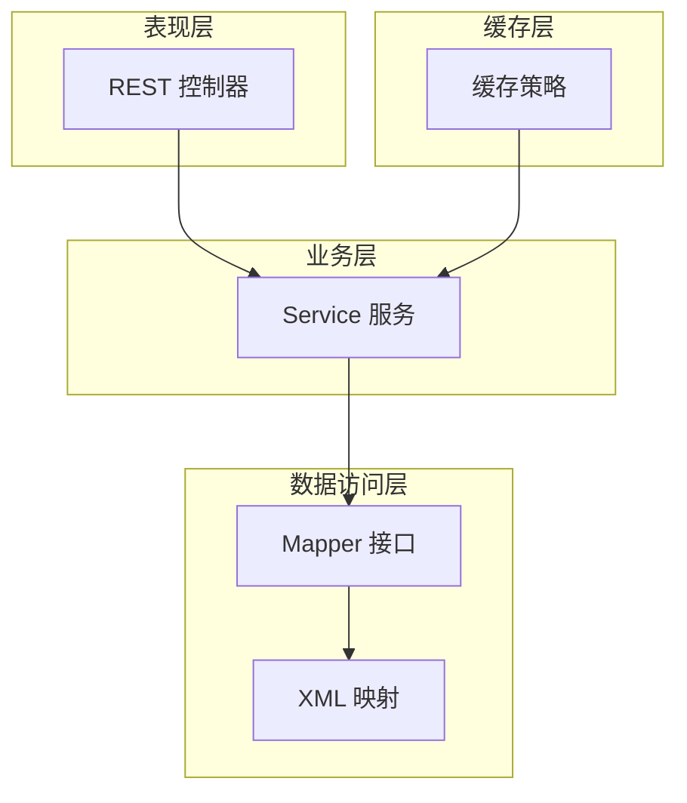

**图表来源**
- [MdmDictMapper.xml](file://micro-dict/src/main/resources/mapper/MdmDictMapper.xml)
- [MdmDictItemMapper.xml](file://micro-dict/src/main/resources/mapper/MdmDictItemMapper.xml)
- [MdmFileosBucketMapper.xml](file://micro-fileos/src/main/resources/mapper/MdmFileosBucketMapper.xml)
- [MdmFileosDirectoryMapper.xml](file://micro-fileos/src/main/resources/mapper/MdmFileosDirectoryMapper.xml)
- [MdmFileosRecordMapper.xml](file://micro-fileos/src/main/resources/mapper/MdmFileosRecordMapper.xml)
- [MdmFileosMultipartMapper.xml](file://micro-fileos/src/main/resources/mapper/MdmFileosMultipartMapper.xml)
- [MdmMaterialGroupMapper.xml](file://micro-material/src/main/resources/mapper/MdmMaterialGroupMapper.xml)
- [MdmMaterialMapper.xml](file://micro-material/src/main/resources/mapper/MdmMaterialMapper.xml)
- [MdmMaterialRefMapper.xml](file://micro-material/src/main/resources/mapper/MdmMaterialRefMapper.xml)
- [MdmMaterialTransferLogMapper.xml](file://micro-material/src/main/resources/mapper/MdmMaterialTransferLogMapper.xml)
- [MdmMaterialVersionMapper.xml](file://micro-material/src/main/resources/mapper/MdmMaterialVersionMapper.xml)
- [MsgNotificationMapper.xml](file://micro-msg/src/main/resources/mapper/MsgNotificationMapper.xml)
- [MsgTemplateMapper.xml](file://micro-msg/src/main/resources/mapper/MsgTemplateMapper.xml)
- [MsgUserRecordMapper.xml](file://micro-msg/src/main/resources/mapper/MsgUserRecordMapper.xml)
- [MsgUserSettingsMapper.xml](file://micro-msg/src/main/resources/mapper/MsgUserSettingsMapper.xml)
- [DbviewDatasourceMapper.xml](file://micro-dbview/src/main/resources/mapper/DbviewDatasourceMapper.xml)
- [DbviewDatasourcePermissionMapper.xml](file://micro-dbview/src/main/resources/mapper/DbviewDatasourcePermissionMapper.xml)
- [DbviewSqlHistoryMapper.xml](file://micro-dbview/src/main/resources/mapper/DbviewSqlHistoryMapper.xml)
- [MdmChangeLogMapper.xml](file://micro-audit/src/main/resources/mapper/MdmChangeLogMapper.xml)
- [MdmSequenceMapper.xml](file://micro-seq/src/main/resources/mapper/MdmSequenceMapper.xml)
- [MdmPdfTemplateMapper.xml](file://micro-pdf/src/main/resources/mapper/MdmPdfTemplateMapper.xml)
- [ReportDefinitionMapper.xml](file://micro-report/src/main/resources/mapper/ReportDefinitionMapper.xml)
- [ReportDefinitionParamMapper.xml](file://micro-report/src/main/resources/mapper/ReportDefinitionParamMapper.xml)
- [ReportDefinitionResultMapper.xml](file://micro-report/src/main/resources/mapper/ReportDefinitionResultMapper.xml)
- [ReportDefinitionHisMapper.xml](file://micro-report/src/main/resources/mapper/ReportDefinitionHisMapper.xml)
- [FunCategoryMapper.xml](file://micro-fun/src/main/resources/mapper/FunCategoryMapper.xml)
- [FunFunctionMapper.xml](file://micro-fun/src/main/resources/mapper/FunFunctionMapper.xml)
- [LiteflowChainMapper.xml](file://micro-liteflow/src/main/resources/mapper/LiteflowChainMapper.xml)
- [LiteflowScriptMapper.xml](file://micro-liteflow/src/main/resources/mapper/LiteflowScriptMapper.xml)
- [RmCheckRuleMapper.xml](file://micro-rmcheck/src/main/resources/mapper/RmCheckRuleMapper.xml)
- [RmCheckRuleItemMapper.xml](file://micro-rmcheck/src/main/resources/mapper/RmCheckRuleItemMapper.xml)
- [CheckMapper.xml](file://micro-rmcheck/src/main/resources/mapper/CheckMapper.xml)
- [MdmMaskRuleMapper.xml](file://micro-mask/src/main/resources/mapper/MdmMaskRuleMapper.xml)
- [MdmFormMapper.xml](file://micro-form/src/main/resources/mapper/MdmFormMapper.xml)
- [MdmFormItemMapper.xml](file://micro-form/src/main/resources/mapper/MdmFormItemMapper.xml)
- [MdmFormRuleMapper.xml](file://micro-form/src/main/resources/mapper/MdmFormRuleMapper.xml)
- [MdmFormRuleFieldMapper.xml](file://micro-form/src/main/resources/mapper/MdmFormRuleFieldMapper.xml)
- [MdmFormRuleFieldValidatorMapper.xml](file://micro-form/src/main/resources/mapper/MdmFormRuleFieldValidatorMapper.xml)
- [MdmFormRuleValidatorTemplateMapper.xml](file://micro-form/src/main/resources/mapper/MdmFormRuleValidatorTemplateMapper.xml)
- [PayAlipayConfigMapper.xml](file://micro-pay/src/main/resources/mapper/PayAlipayConfigMapper.xml)
- [PayOrderMapper.xml](file://micro-pay/src/main/resources/mapper/PayOrderMapper.xml)
- [PayWxpayConfigMapper.xml](file://micro-pay/src/main/resources/mapper/PayWxpayConfigMapper.xml)

## 详细组件分析

### 字典与字典项（MdmDict ↔ MdmDictItem）
- 关系：一对多（字典类型 → 多个字典项）。
- 字段要点：
  - MdmDict：字典编码、名称、描述、是否启用、层级、排序等。
  - MdmDictItem：字典项值、文本、扩展信息、排序、启用状态等。
- 表结构与约束：
  - 主键：各自自增或唯一键。
  - 外键：MdmDictItem.dictId → MdmDict.id。
  - 索引：按字典编码、父级、排序建立索引。
- 业务规则：
  - 同一字典下字典项值唯一。
  - 父子层级维护树形结构。
- 访问模式：按字典编码查询项列表；支持树形返回。
- 缓存策略：字典类型与项列表缓存，变更时失效。

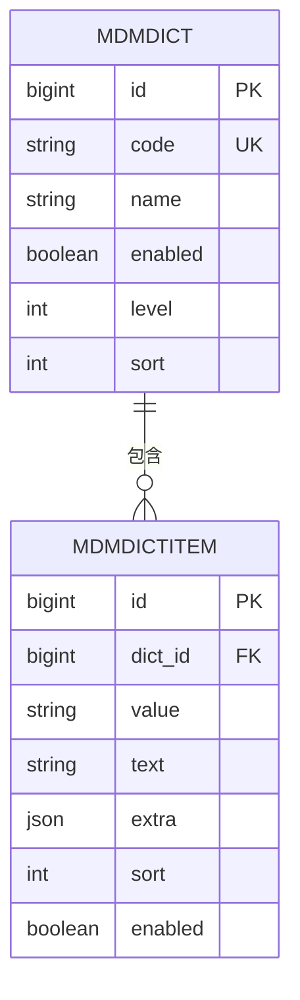

**图表来源**
- [MdmDict.java:1-60](file://micro-dict/src/main/java/com/wkclz/micro/dict/bean/entity/MdmDict.java#L1-L60)
- [MdmDictItem.java:1-60](file://micro-dict/src/main/java/com/wkclz/micro/dict/bean/entity/MdmDictItem.java#L1-L60)
- [MdmDictMapper.xml](file://micro-dict/src/main/resources/mapper/MdmDictMapper.xml)
- [MdmDictItemMapper.xml](file://micro-dict/src/main/resources/mapper/MdmDictItemMapper.xml)

**章节来源**
- [MdmDict.java:1-60](file://micro-dict/src/main/java/com/wkclz/micro/dict/bean/entity/MdmDict.java#L1-L60)
- [MdmDictItem.java:1-60](file://micro-dict/src/main/java/com/wkclz/micro/dict/bean/entity/MdmDictItem.java#L1-L60)
- [MdmDictMapper.xml](file://micro-dict/src/main/resources/mapper/MdmDictMapper.xml)
- [MdmDictItemMapper.xml](file://micro-dict/src/main/resources/mapper/MdmDictItemMapper.xml)

### 文件存储（桶、目录、记录、分片）
- 关系：一对多（桶 → 目录/记录/分片）；记录与目录可形成树形目录结构。
- 字段要点：
  - 桶：名称、存储类型、配置信息。
  - 目录：路径、父目录、层级。
  - 记录：文件名、大小、哈希、存储路径、元数据。
  - 分片：上传会话、分片序号、大小、ETag。
- 表结构与约束：
  - 主键：自增。
  - 外键：目录.parent_id → 目录.id；记录.bucket_id → 桶.id；分片.session_id → 会话。
  - 索引：bucket_name、parent_path、file_hash、upload_session。
- 业务规则：
  - 同桶内文件名唯一或允许重名但需区分路径。
  - 分片上传完成后合并。
- 访问模式：分页列出目录内容；按路径检索；支持预签名下载。
- 缓存策略：目录树与桶配置缓存；热点文件元数据缓存。

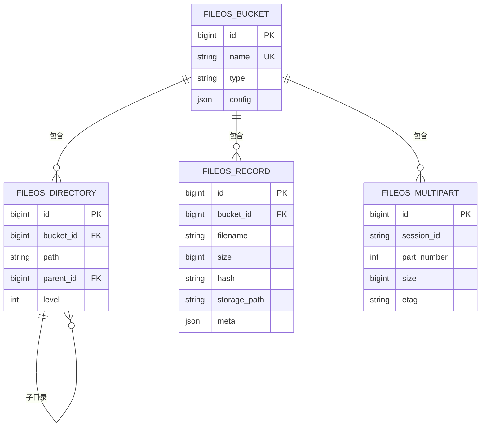

**图表来源**
- [MdmFileosBucket.java:1-60](file://micro-fileos/src/main/java/com/wkclz/micro/fileos/bean/entity/MdmFileosBucket.java#L1-L60)
- [MdmFileosDirectory.java:1-60](file://micro-fileos/src/main/java/com/wkclz/micro/fileos/bean/entity/MdmFileosDirectory.java#L1-L60)
- [MdmFileosRecord.java:1-60](file://micro-fileos/src/main/java/com/wkclz/micro/fileos/bean/entity/MdmFileosRecord.java#L1-L60)
- [MdmFileosMultipart.java:1-60](file://micro-fileos/src/main/java/com/wkclz/micro/fileos/bean/entity/MdmFileosMultipart.java#L1-L60)
- [MdmFileosBucketMapper.xml](file://micro-fileos/src/main/resources/mapper/MdmFileosBucketMapper.xml)
- [MdmFileosDirectoryMapper.xml](file://micro-fileos/src/main/resources/mapper/MdmFileosDirectoryMapper.xml)
- [MdmFileosRecordMapper.xml](file://micro-fileos/src/main/resources/mapper/MdmFileosRecordMapper.xml)
- [MdmFileosMultipartMapper.xml](file://micro-fileos/src/main/resources/mapper/MdmFileosMultipartMapper.xml)

**章节来源**
- [MdmFileosBucket.java:1-60](file://micro-fileos/src/main/java/com/wkclz/micro/fileos/bean/entity/MdmFileosBucket.java#L1-L60)
- [MdmFileosDirectory.java:1-60](file://micro-fileos/src/main/java/com/wkclz/micro/fileos/bean/entity/MdmFileosDirectory.java#L1-L60)
- [MdmFileosRecord.java:1-60](file://micro-fileos/src/main/java/com/wkclz/micro/fileos/bean/entity/MdmFileosRecord.java#L1-L60)
- [MdmFileosMultipart.java:1-60](file://micro-fileos/src/main/java/com/wkclz/micro/fileos/bean/entity/MdmFileosMultipart.java#L1-L60)
- [MdmFileosBucketMapper.xml](file://micro-fileos/src/main/resources/mapper/MdmFileosBucketMapper.xml)
- [MdmFileosDirectoryMapper.xml](file://micro-fileos/src/main/resources/mapper/MdmFileosDirectoryMapper.xml)
- [MdmFileosRecordMapper.xml](file://micro-fileos/src/main/resources/mapper/MdmFileosRecordMapper.xml)
- [MdmFileosMultipartMapper.xml](file://micro-fileos/src/main/resources/mapper/MdmFileosMultipartMapper.xml)

### 物料与版本（MdmMaterialGroup → MdmMaterial → MdmMaterialVersion）
- 关系：多对一（物料 → 物料组）；一对多（物料 → 版本）；多对多（物料 ↔ 引用对象）。
- 字段要点：
  - 物料组：名称、描述、启用状态。
  - 物料：编号、名称、规格、单位、扩展信息。
  - 版本：版本号、内容摘要、生效时间、状态。
  - 引用：用于记录物料被哪些业务对象引用。
  - 转移日志：记录物料的转移、变更历史。
- 表结构与约束：
  - 主键：自增。
  - 外键：MdmMaterial.group_id → MdmMaterialGroup.id；MdmMaterialVersion.material_id → MdmMaterial.id；MdmMaterialRef.material_id → MdmMaterial.id。
  - 索引：group_code、material_code、version_no、ref_key。
- 业务规则：
  - 版本号递增；同一物料同一版本号唯一。
  - 引用关系用于追踪使用范围。
- 访问模式：按组查询物料；按物料查询版本；按引用键反查物料。
- 缓存策略：物料组与常用物料详情缓存；版本列表按需缓存。

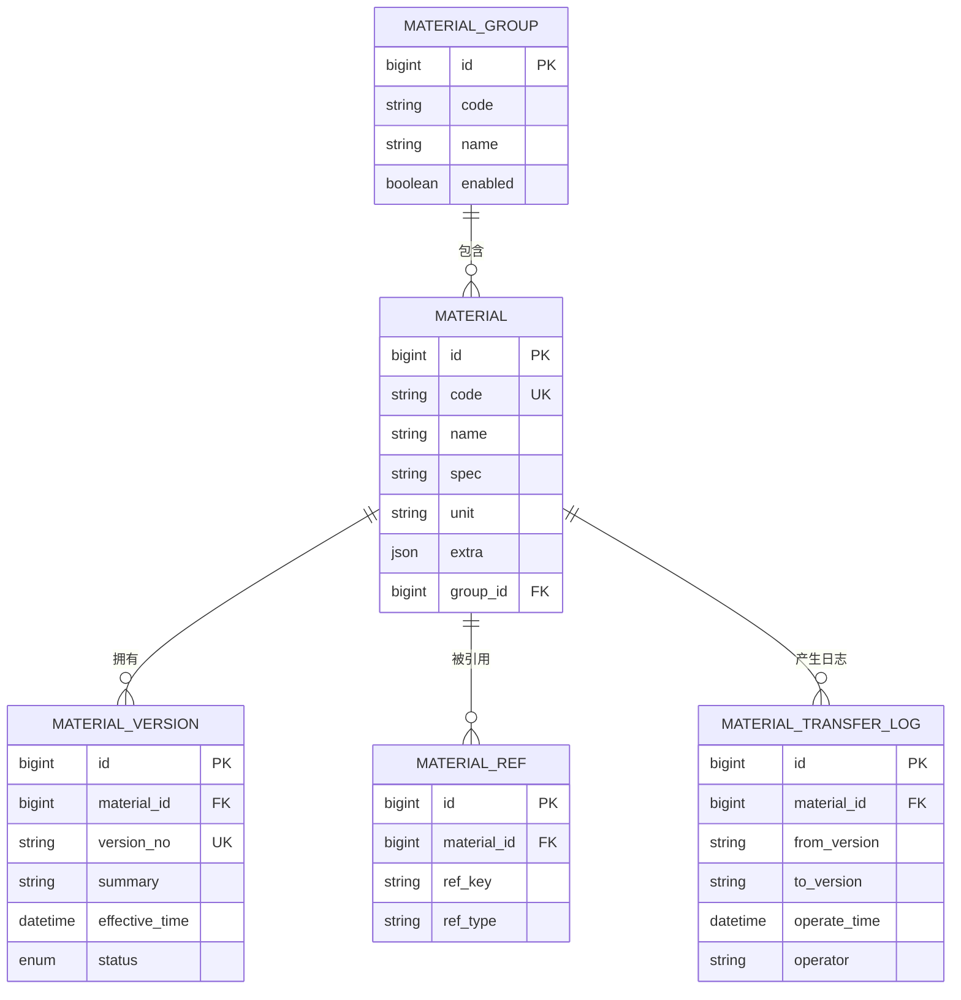

**图表来源**
- [MdmMaterialGroup.java:1-120](file://micro-material/src/main/java/com/wkclz/micro/material/bean/entity/MdmMaterialGroup.java#L1-L120)
- [MdmMaterial.java:1-120](file://micro-material/src/main/java/com/wkclz/micro/material/bean/entity/MdmMaterial.java#L1-L120)
- [MdmMaterialVersion.java:1-120](file://micro-material/src/main/java/com/wkclz/micro/material/bean/entity/MdmMaterialVersion.java#L1-L120)
- [MdmMaterialRef.java:1-120](file://micro-material/src/main/java/com/wkclz/micro/material/bean/entity/MdmMaterialRef.java#L1-L120)
- [MdmMaterialTransferLog.java:1-120](file://micro-material/src/main/java/com/wkclz/micro/material/bean/entity/MdmMaterialTransferLog.java#L1-L120)
- [MdmMaterialGroupMapper.xml](file://micro-material/src/main/resources/mapper/MdmMaterialGroupMapper.xml)
- [MdmMaterialMapper.xml](file://micro-material/src/main/resources/mapper/MdmMaterialMapper.xml)
- [MdmMaterialVersionMapper.xml](file://micro-material/src/main/resources/mapper/MdmMaterialVersionMapper.xml)
- [MdmMaterialRefMapper.xml](file://micro-material/src/main/resources/mapper/MdmMaterialRefMapper.xml)
- [MdmMaterialTransferLogMapper.xml](file://micro-material/src/main/resources/mapper/MdmMaterialTransferLogMapper.xml)

**章节来源**
- [MdmMaterialGroup.java:1-120](file://micro-material/src/main/java/com/wkclz/micro/material/bean/entity/MdmMaterialGroup.java#L1-L120)
- [MdmMaterial.java:1-120](file://micro-material/src/main/java/com/wkclz/micro/material/bean/entity/MdmMaterial.java#L1-L120)
- [MdmMaterialVersion.java:1-120](file://micro-material/src/main/java/com/wkclz/micro/material/bean/entity/MdmMaterialVersion.java#L1-L120)
- [MdmMaterialRef.java:1-120](file://micro-material/src/main/java/com/wkclz/micro/material/bean/entity/MdmMaterialRef.java#L1-L120)
- [MdmMaterialTransferLog.java:1-120](file://micro-material/src/main/java/com/wkclz/micro/material/bean/entity/MdmMaterialTransferLog.java#L1-L120)
- [MdmMaterialGroupMapper.xml](file://micro-material/src/main/resources/mapper/MdmMaterialGroupMapper.xml)
- [MdmMaterialMapper.xml](file://micro-material/src/main/resources/mapper/MdmMaterialMapper.xml)
- [MdmMaterialVersionMapper.xml](file://micro-material/src/main/resources/mapper/MdmMaterialVersionMapper.xml)
- [MdmMaterialRefMapper.xml](file://micro-material/src/main/resources/mapper/MdmMaterialRefMapper.xml)
- [MdmMaterialTransferLogMapper.xml](file://micro-material/src/main/resources/mapper/MdmMaterialTransferLogMapper.xml)

### 消息通知（模板、通知、用户记录、用户设置）
- 关系：一对多（模板 → 通知）；多对一（通知 → 用户记录）；一对一（用户设置）。
- 字段要点：
  - 模板：模板编码、标题、内容、适用场景。
  - 通知：接收人、标题、内容、状态、发送渠道。
  - 用户记录：用户维度的已读/已处理标记。
  - 用户设置：默认接收渠道、屏蔽规则。
- 表结构与约束：
  - 主键：自增。
  - 外键：MsgNotification.template_id → MsgTemplate.id；MsgUserRecord.user_id → 用户标识。
  - 索引：template_code、receiver、status、user_id。
- 业务规则：
  - 同一模板编码唯一；通知状态机驱动。
- 访问模式：按模板批量下发；按用户查询个人消息；按状态统计。
- 缓存策略：模板内容缓存；用户设置缓存；近期消息列表缓存。

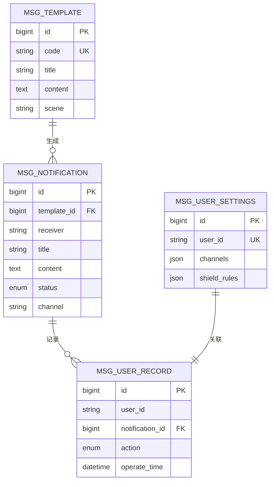

**图表来源**
- [MsgTemplate.java:1-120](file://micro-msg/src/main/java/com/wkclz/micro/msg/bean/entity/MsgTemplate.java#L1-L120)
- [MsgNotification.java:1-120](file://micro-msg/src/main/java/com/wkclz/micro/msg/bean/entity/MsgNotification.java#L1-L120)
- [MsgUserRecord.java:1-120](file://micro-msg/src/main/java/com/wkclz/micro/msg/bean/entity/MsgUserRecord.java#L1-L120)
- [MsgUserSettings.java:1-120](file://micro-msg/src/main/java/com/wkclz/micro/msg/bean/entity/MsgUserSettings.java#L1-L120)
- [MsgTemplateMapper.xml](file://micro-msg/src/main/resources/mapper/MsgTemplateMapper.xml)
- [MsgNotificationMapper.xml](file://micro-msg/src/main/resources/mapper/MsgNotificationMapper.xml)
- [MsgUserRecordMapper.xml](file://micro-msg/src/main/resources/mapper/MsgUserRecordMapper.xml)
- [MsgUserSettingsMapper.xml](file://micro-msg/src/main/resources/mapper/MsgUserSettingsMapper.xml)

**章节来源**
- [MsgTemplate.java:1-120](file://micro-msg/src/main/java/com/wkclz/micro/msg/bean/entity/MsgTemplate.java#L1-L120)
- [MsgNotification.java:1-120](file://micro-msg/src/main/java/com/wkclz/micro/msg/bean/entity/MsgNotification.java#L1-L120)
- [MsgUserRecord.java:1-120](file://micro-msg/src/main/java/com/wkclz/micro/msg/bean/entity/MsgUserRecord.java#L1-L120)
- [MsgUserSettings.java:1-120](file://micro-msg/src/main/java/com/wkclz/micro/msg/bean/entity/MsgUserSettings.java#L1-L120)
- [MsgTemplateMapper.xml](file://micro-msg/src/main/resources/mapper/MsgTemplateMapper.xml)
- [MsgNotificationMapper.xml](file://micro-msg/src/main/resources/mapper/MsgNotificationMapper.xml)
- [MsgUserRecordMapper.xml](file://micro-msg/src/main/resources/mapper/MsgUserRecordMapper.xml)
- [MsgUserSettingsMapper.xml](file://micro-msg/src/main/resources/mapper/MsgUserSettingsMapper.xml)

### 报表定义（定义、参数、结果、历史）
- 关系：一对多（定义 → 参数/结果）；一对一（定义 ↔ 历史）。
- 字段要点：
  - 定义：报表编码、名称、SQL 模板、参数占位符。
  - 参数：参数名、类型、默认值、是否必填。
  - 结果：导出数据、生成时间、文件链接。
  - 历史：每次执行的快照与统计。
- 表结构与约束：
  - 主键：自增。
  - 外键：参数/结果/历史定义_id → 定义.id。
  - 索引：定义_code、param_name、result_time。
- 业务规则：
  - 参数校验与默认值应用；结果落盘与清理策略。
- 访问模式：定义查询、参数校验、结果导出、历史回溯。
- 缓存策略：定义与参数缓存；导出任务异步化。

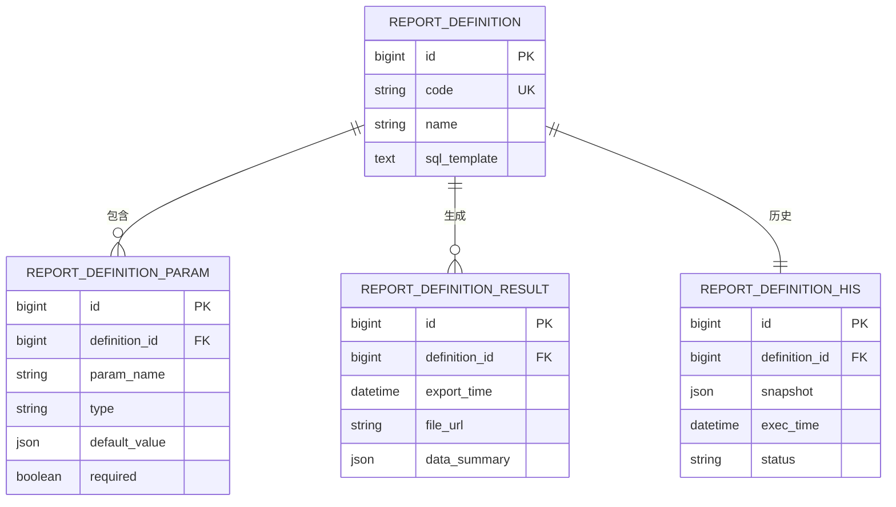

**图表来源**
- [ReportDefinition.java:1-120](file://micro-report/src/main/java/com/wkclz/micro/report/bean/entity/ReportDefinition.java#L1-L120)
- [ReportDefinitionParam.java:1-120](file://micro-report/src/main/java/com/wkclz/micro/report/bean/entity/ReportDefinitionParam.java#L1-L120)
- [ReportDefinitionResult.java:1-120](file://micro-report/src/main/java/com/wkclz/micro/report/bean/entity/ReportDefinitionResult.java#L1-L120)
- [ReportDefinitionHis.java:1-120](file://micro-report/src/main/java/com/wkclz/micro/report/bean/entity/ReportDefinitionHis.java#L1-L120)
- [ReportDefinitionMapper.xml](file://micro-report/src/main/resources/mapper/ReportDefinitionMapper.xml)
- [ReportDefinitionParamMapper.xml](file://micro-report/src/main/resources/mapper/ReportDefinitionParamMapper.xml)
- [ReportDefinitionResultMapper.xml](file://micro-report/src/main/resources/mapper/ReportDefinitionResultMapper.xml)
- [ReportDefinitionHisMapper.xml](file://micro-report/src/main/resources/mapper/ReportDefinitionHisMapper.xml)

**章节来源**
- [ReportDefinition.java:1-120](file://micro-report/src/main/java/com/wkclz/micro/report/bean/entity/ReportDefinition.java#L1-L120)
- [ReportDefinitionParam.java:1-120](file://micro-report/src/main/java/com/wkclz/micro/report/bean/entity/ReportDefinitionParam.java#L1-L120)
- [ReportDefinitionResult.java:1-120](file://micro-report/src/main/java/com/wkclz/micro/report/bean/entity/ReportDefinitionResult.java#L1-L120)
- [ReportDefinitionHis.java:1-120](file://micro-report/src/main/java/com/wkclz/micro/report/bean/entity/ReportDefinitionHis.java#L1-L120)
- [ReportDefinitionMapper.xml](file://micro-report/src/main/resources/mapper/ReportDefinitionMapper.xml)
- [ReportDefinitionParamMapper.xml](file://micro-report/src/main/resources/mapper/ReportDefinitionParamMapper.xml)
- [ReportDefinitionResultMapper.xml](file://micro-report/src/main/resources/mapper/ReportDefinitionResultMapper.xml)
- [ReportDefinitionHisMapper.xml](file://micro-report/src/main/resources/mapper/ReportDefinitionHisMapper.xml)

### 序列号（MdmSequence）
- 关系：无外部关系，自足实体。
- 字段要点：
  - 编码、当前值、步长、最大值、是否循环。
- 表结构与约束：
  - 主键：自增；编码唯一。
  - 索引：code。
- 业务规则：
  - 并发安全递增；达到最大值按策略回绕或报错。
- 访问模式：原子递增获取下一个序列号。
- 缓存策略：当前值内存缓存，定期持久化。

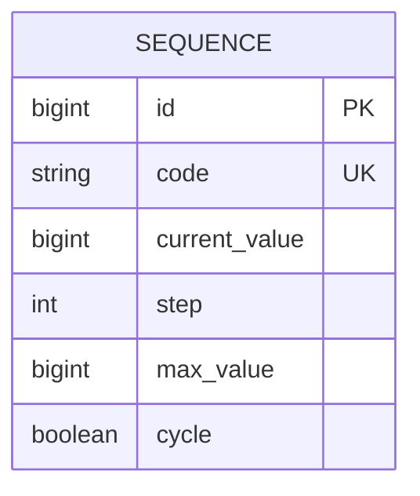

**图表来源**
- [MdmSequence.java:1-120](file://micro-seq/src/main/java/com/wkclz/micro/seq/bean/entity/MdmSequence.java#L1-L120)
- [MdmSequenceMapper.xml](file://micro-seq/src/main/resources/mapper/MdmSequenceMapper.xml)

**章节来源**
- [MdmSequence.java:1-120](file://micro-seq/src/main/java/com/wkclz/micro/seq/bean/entity/MdmSequence.java#L1-L120)
- [MdmSequenceMapper.xml](file://micro-seq/src/main/resources/mapper/MdmSequenceMapper.xml)

### PDF 模板（MdmPdfTemplate）
- 关系：无外部关系，自足实体。
- 字段要点：
  - 模板编码、名称、模板内容、渲染参数。
- 表结构与约束：
  - 主键：自增；编码唯一。
  - 索引：code。
- 业务规则：
  - 渲染参数校验；模板内容版本化。
- 访问模式：按编码获取模板；渲染输出 PDF。
- 缓存策略：模板内容缓存；渲染结果短期缓存。

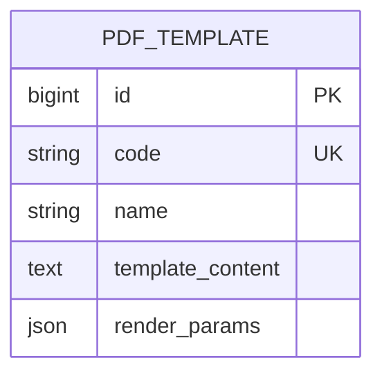

**图表来源**
- [MdmPdfTemplate.java:1-120](file://micro-pdf/src/main/java/com/wkclz/micro/pdf/bean/entity/MdmPdfTemplate.java#L1-L120)
- [MdmPdfTemplateMapper.xml](file://micro-pdf/src/main/resources/mapper/MdmPdfTemplateMapper.xml)

**章节来源**
- [MdmPdfTemplate.java:1-120](file://micro-pdf/src/main/java/com/wkclz/micro/pdf/bean/entity/MdmPdfTemplate.java#L1-L120)
- [MdmPdfTemplateMapper.xml](file://micro-pdf/src/main/resources/mapper/MdmPdfTemplateMapper.xml)

### 函数与流程（FunFunction/FunCategory、LiteflowChain/LiteflowScript）
- 关系：分类 → 函数；链路 → 脚本。
- 字段要点：
  - 分类：名称、描述、排序。
  - 函数：函数代码、名称、脚本内容、参数定义。
  - 链路：链路编码、名称、脚本内容。
  - 脚本：脚本内容、语言类型、版本。
- 表结构与约束：
  - 主键：自增；编码唯一。
  - 外键：函数.category_id → 分类.id；链路.script_id → 脚本.id。
  - 索引：code、category_id。
- 业务规则：
  - 函数与链路的参数校验；脚本版本控制。
- 访问模式：按分类查询函数；按链路执行脚本。
- 缓存策略：函数与链路定义缓存；脚本内容缓存。

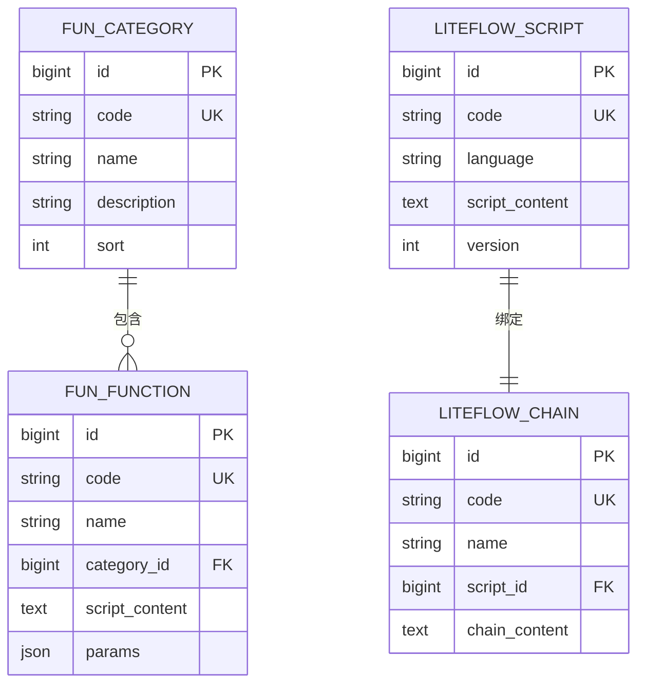

**图表来源**
- [FunCategory.java:1-120](file://micro-fun/src/main/java/com/wkclz/micro/fun/bean/entity/FunCategory.java#L1-L120)
- [FunFunction.java:1-120](file://micro-fun/src/main/java/com/wkclz/micro/fun/bean/entity/FunFunction.java#L1-L120)
- [LiteflowChain.java:1-120](file://micro-liteflow/src/main/java/com/wkclz/micro/liteflow/bean/entity/LiteflowChain.java#L1-L120)
- [LiteflowScript.java:1-120](file://micro-liteflow/src/main/java/com/wkclz/micro/liteflow/bean/entity/LiteflowScript.java#L1-L120)
- [FunCategoryMapper.xml](file://micro-fun/src/main/resources/mapper/FunCategoryMapper.xml)
- [FunFunctionMapper.xml](file://micro-fun/src/main/resources/mapper/FunFunctionMapper.xml)
- [LiteflowChainMapper.xml](file://micro-liteflow/src/main/resources/mapper/LiteflowChainMapper.xml)
- [LiteflowScriptMapper.xml](file://micro-liteflow/src/main/resources/mapper/LiteflowScriptMapper.xml)

**章节来源**
- [FunCategory.java:1-120](file://micro-fun/src/main/java/com/wkclz/micro/fun/bean/entity/FunCategory.java#L1-L120)
- [FunFunction.java:1-120](file://micro-fun/src/main/java/com/wkclz/micro/fun/bean/entity/FunFunction.java#L1-L120)
- [LiteflowChain.java:1-120](file://micro-liteflow/src/main/java/com/wkclz/micro/liteflow/bean/entity/LiteflowChain.java#L1-L120)
- [LiteflowScript.java:1-120](file://micro-liteflow/src/main/java/com/wkclz/micro/liteflow/bean/entity/LiteflowScript.java#L1-L120)
- [FunCategoryMapper.xml](file://micro-fun/src/main/resources/mapper/FunCategoryMapper.xml)
- [FunFunctionMapper.xml](file://micro-fun/src/main/resources/mapper/FunFunctionMapper.xml)
- [LiteflowChainMapper.xml](file://micro-liteflow/src/main/resources/mapper/LiteflowChainMapper.xml)
- [LiteflowScriptMapper.xml](file://micro-liteflow/src/main/resources/mapper/LiteflowScriptMapper.xml)

### 校验规则（RmCheckRule/RmCheckRuleItem/Check）
- 关系：规则 → 规则项；规则项 → 检查记录。
- 字段要点：
  - 规则：规则编码、名称、描述、启用状态。
  - 规则项：字段、校验类型、阈值、严重级别。
  - 检查：对象标识、字段、结果、建议措施。
- 表结构与约束：
  - 主键：自增；编码唯一。
  - 外键：规则项.rule_id → 规则.id；检查.rule_item_id → 规则项.id。
  - 索引：rule_code、field、result。
- 业务规则：
  - 规则项组合形成完整校验策略；检查结果归档。
- 访问模式：按规则查询项；按对象执行检查。
- 缓存策略：规则定义缓存；检查结果短期缓存。

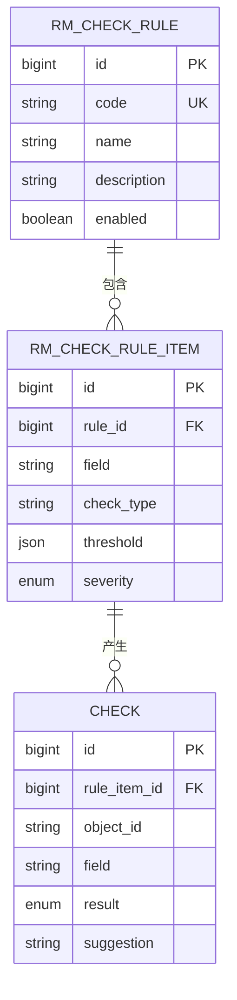

**图表来源**
- [RmCheckRule.java:1-120](file://micro-rmcheck/src/main/java/com/wkclz/micro/rmcheck/bean/entity/RmCheckRule.java#L1-L120)
- [RmCheckRuleItem.java:1-120](file://micro-rmcheck/src/main/java/com/wkclz/micro/rmcheck/bean/entity/RmCheckRuleItem.java#L1-L120)
- [Check.java:1-120](file://micro-rmcheck/src/main/java/com/wkclz/micro/rmcheck/bean/entity/Check.java#L1-L120)
- [RmCheckRuleMapper.xml](file://micro-rmcheck/src/main/resources/mapper/RmCheckRuleMapper.xml)
- [RmCheckRuleItemMapper.xml](file://micro-rmcheck/src/main/resources/mapper/RmCheckRuleItemMapper.xml)
- [CheckMapper.xml](file://micro-rmcheck/src/main/resources/mapper/CheckMapper.xml)

**章节来源**
- [RmCheckRule.java:1-120](file://micro-rmcheck/src/main/java/com/wkclz/micro/rmcheck/bean/entity/RmCheckRule.java#L1-L120)
- [RmCheckRuleItem.java:1-120](file://micro-rmcheck/src/main/java/com/wkclz/micro/rmcheck/bean/entity/RmCheckRuleItem.java#L1-L120)
- [Check.java:1-120](file://micro-rmcheck/src/main/java/com/wkclz/micro/rmcheck/bean/entity/Check.java#L1-L120)
- [RmCheckRuleMapper.xml](file://micro-rmcheck/src/main/resources/mapper/RmCheckRuleMapper.xml)
- [RmCheckRuleItemMapper.xml](file://micro-rmcheck/src/main/resources/mapper/RmCheckRuleItemMapper.xml)
- [CheckMapper.xml](file://micro-rmcheck/src/main/resources/mapper/CheckMapper.xml)

### 脱敏规则（MdmMaskRule）
- 关系：无外部关系，自足实体。
- 字段要点：
  - 规则编码、字段匹配模式、脱敏算法、参数。
- 表结构与约束：
  - 主键：自增；编码唯一。
  - 索引：code、field_pattern。
- 业务规则：
  - 字段匹配优先级；算法参数校验。
- 访问模式：按字段匹配规则；执行脱敏。
- 缓存策略：规则缓存；脱敏结果短期缓存。

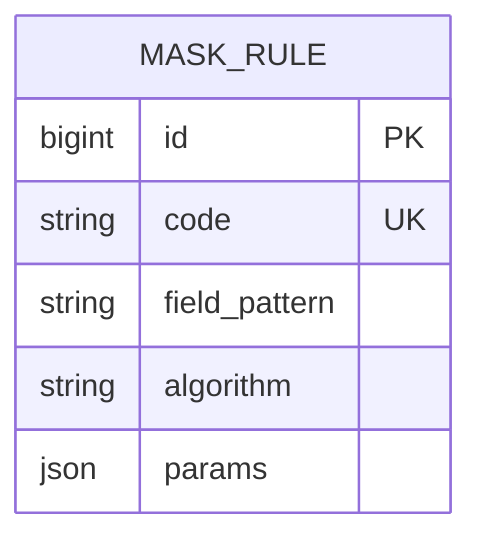

**图表来源**
- [MdmMaskRule.java:1-120](file://micro-mask/src/main/java/com/wkclz/micro/mask/bean/entity/MdmMaskRule.java#L1-L120)
- [MdmMaskRuleMapper.xml](file://micro-mask/src/main/resources/mapper/MdmMaskRuleMapper.xml)

**章节来源**
- [MdmMaskRule.java:1-120](file://micro-mask/src/main/java/com/wkclz/micro/mask/bean/entity/MdmMaskRule.java#L1-L120)
- [MdmMaskRuleMapper.xml](file://micro-mask/src/main/resources/mapper/MdmMaskRuleMapper.xml)

### 表单与规则（MdmForm/MdmFormItem/MdmFormRule/MdmFormRuleField/MdmFormRuleFieldValidator/MdmFormRuleValidatorTemplate）
- 关系：表单 → 表单项；表单 → 规则；规则 → 字段规则；字段规则 → 校验器；校验器 → 模板。
- 字段要点：
  - 表单：编码、名称、版本、状态。
  - 表单项：字段名、标题、类型、布局。
  - 规则：规则名、适用场景、启用状态。
  - 字段规则：字段、必填、长度、正则等。
  - 校验器：校验类型、参数、错误提示。
  - 模板：模板内容、参数占位符。
- 表结构与约束：
  - 主键：自增；编码唯一。
  - 外键：表单项.form_id → 表单.id；规则.form_id → 表单.id；字段规则.rule_id → 规则.id；校验器.field_rule_id → 字段规则.id；模板.validator_id → 校验器.id。
  - 索引：code、field、rule_name。
- 业务规则：
  - 字段规则与校验器组合；模板参数校验。
- 访问模式：按表单加载结构与规则；按字段执行校验。
- 缓存策略：表单定义与规则缓存；校验模板缓存。

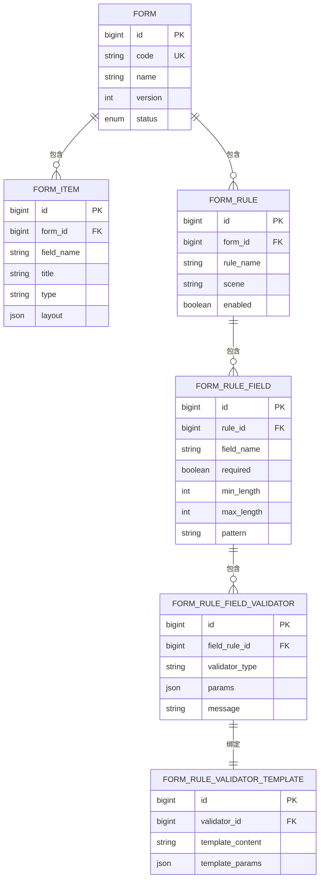

**图表来源**
- [MdmForm.java:1-120](file://micro-form/src/main/java/com/wkclz/micro/form/bean/entity/MdmForm.java#L1-L120)
- [MdmFormItem.java:1-120](file://micro-form/src/main/java/com/wkclz/micro/form/bean/entity/MdmFormItem.java#L1-L120)
- [MdmFormRule.java:1-120](file://micro-form/src/main/java/com/wkclz/micro/form/bean/entity/MdmFormRule.java#L1-L120)
- [MdmFormRuleField.java:1-120](file://micro-form/src/main/java/com/wkclz/micro/form/bean/entity/MdmFormRuleField.java#L1-L120)
- [MdmFormRuleFieldValidator.java:1-120](file://micro-form/src/main/java/com/wkclz/micro/form/bean/entity/MdmFormRuleFieldValidator.java#L1-L120)
- [MdmFormRuleValidatorTemplate.java:1-120](file://micro-form/src/main/java/com/wkclz/micro/form/bean/entity/MdmFormRuleValidatorTemplate.java#L1-L120)
- [MdmFormMapper.xml](file://micro-form/src/main/resources/mapper/MdmFormMapper.xml)
- [MdmFormItemMapper.xml](file://micro-form/src/main/resources/mapper/MdmFormItemMapper.xml)
- [MdmFormRuleMapper.xml](file://micro-form/src/main/resources/mapper/MdmFormRuleMapper.xml)
- [MdmFormRuleFieldMapper.xml](file://micro-form/src/main/resources/mapper/MdmFormRuleFieldMapper.xml)
- [MdmFormRuleFieldValidatorMapper.xml](file://micro-form/src/main/resources/mapper/MdmFormRuleFieldValidatorMapper.xml)
- [MdmFormRuleValidatorTemplateMapper.xml](file://micro-form/src/main/resources/mapper/MdmFormRuleValidatorTemplateMapper.xml)

**章节来源**
- [MdmForm.java:1-120](file://micro-form/src/main/java/com/wkclz/micro/form/bean/entity/MdmForm.java#L1-L120)
- [MdmFormItem.java:1-120](file://micro-form/src/main/java/com/wkclz/micro/form/bean/entity/MdmFormItem.java#L1-L120)
- [MdmFormRule.java:1-120](file://micro-form/src/main/java/com/wkclz/micro/form/bean/entity/MdmFormRule.java#L1-L120)
- [MdmFormRuleField.java:1-120](file://micro-form/src/main/java/com/wkclz/micro/form/bean/entity/MdmFormRuleField.java#L1-L120)
- [MdmFormRuleFieldValidator.java:1-120](file://micro-form/src/main/java/com/wkclz/micro/form/bean/entity/MdmFormRuleFieldValidator.java#L1-L120)
- [MdmFormRuleValidatorTemplate.java:1-120](file://micro-form/src/main/java/com/wkclz/micro/form/bean/entity/MdmFormRuleValidatorTemplate.java#L1-L120)
- [MdmFormMapper.xml](file://micro-form/src/main/resources/mapper/MdmFormMapper.xml)
- [MdmFormItemMapper.xml](file://micro-form/src/main/resources/mapper/MdmFormItemMapper.xml)
- [MdmFormRuleMapper.xml](file://micro-form/src/main/resources/mapper/MdmFormRuleMapper.xml)
- [MdmFormRuleFieldMapper.xml](file://micro-form/src/main/resources/mapper/MdmFormRuleFieldMapper.xml)
- [MdmFormRuleFieldValidatorMapper.xml](file://micro-form/src/main/resources/mapper/MdmFormRuleFieldValidatorMapper.xml)
- [MdmFormRuleValidatorTemplateMapper.xml](file://micro-form/src/main/resources/mapper/MdmFormRuleValidatorTemplateMapper.xml)

### 支付（订单、第三方配置）
- 关系：订单 → 第三方配置（支付宝/微信）。
- 字段要点：
  - 订单：订单号、商户号、金额、币种、状态、回调信息。
  - 支付宝配置：应用 ID、私钥、公钥、网关地址。
  - 微信配置：商户号、API 密钥、证书。
- 表结构与约束：
  - 主键：自增；订单号唯一。
  - 外键：订单.config_type + config_key → 对应配置表。
  - 索引：order_no、config_key、status。
- 业务规则：
  - 订单状态机；回调幂等；敏感信息加密存储。
- 访问模式：下单、查询、回调处理。
- 缓存策略：配置缓存；订单状态缓存。

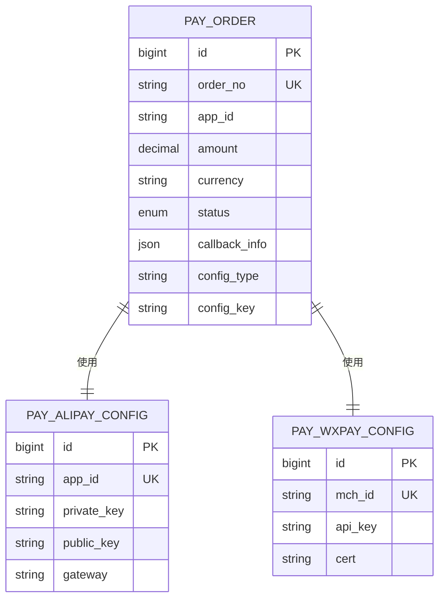

**图表来源**
- [PayOrder.java:1-120](file://micro-pay/src/main/java/com/wkclz/micro/pay/bean/entity/PayOrder.java#L1-L120)
- [PayAlipayConfig.java:1-120](file://micro-pay/src/main/java/com/wkclz/micro/pay/bean/entity/PayAlipayConfig.java#L1-L120)
- [PayWxpayConfig.java:1-120](file://micro-pay/src/main/java/com/wkclz/micro/pay/bean/entity/PayWxpayConfig.java#L1-L120)
- [PayOrderMapper.xml](file://micro-pay/src/main/resources/mapper/PayOrderMapper.xml)
- [PayAlipayConfigMapper.xml](file://micro-pay/src/main/resources/mapper/PayAlipayConfigMapper.xml)
- [PayWxpayConfigMapper.xml](file://micro-pay/src/main/resources/mapper/PayWxpayConfigMapper.xml)

**章节来源**
- [PayOrder.java:1-120](file://micro-pay/src/main/java/com/wkclz/micro/pay/bean/entity/PayOrder.java#L1-L120)
- [PayAlipayConfig.java:1-120](file://micro-pay/src/main/java/com/wkclz/micro/pay/bean/entity/PayAlipayConfig.java#L1-L120)
- [PayWxpayConfig.java:1-120](file://micro-pay/src/main/java/com/wkclz/micro/pay/bean/entity/PayWxpayConfig.java#L1-L120)
- [PayOrderMapper.xml](file://micro-pay/src/main/resources/mapper/PayOrderMapper.xml)
- [PayAlipayConfigMapper.xml](file://micro-pay/src/main/resources/mapper/PayAlipayConfigMapper.xml)
- [PayWxpayConfigMapper.xml](file://micro-pay/src/main/resources/mapper/PayWxpayConfigMapper.xml)

### 变更审计（MdmChangeLog）
- 关系：无外部关系，自足实体。
- 字段要点：
  - 操作人、操作时间、模块、记录标识、变更前后对比。
- 表结构与约束：
  - 主键：自增；索引：operate_time、module、record_id。
- 业务规则：
  - 变更对比基于 JSON 差量；支持回滚建议。
- 访问模式：按模块与时间范围查询变更日志。
- 缓存策略：无。

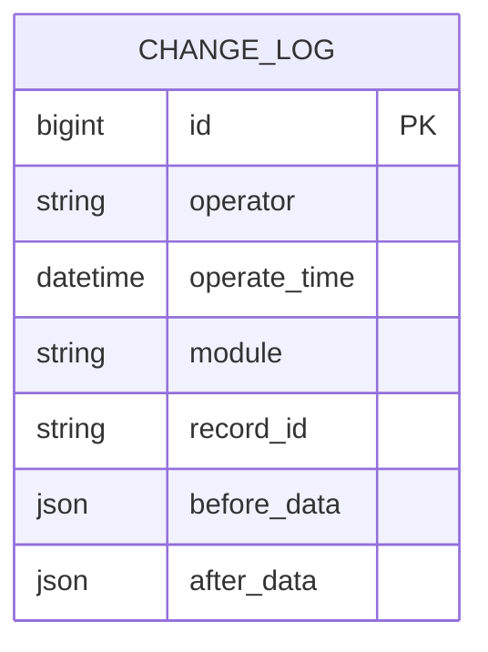

**图表来源**
- [MdmChangeLog.java:1-50](file://micro-audit/src/main/java/com/wkclz/micro/audit/bean/entity/MdmChangeLog.java#L1-L50)
- [MdmChangeLogMapper.xml](file://micro-audit/src/main/resources/mapper/MdmChangeLogMapper.xml)

**章节来源**
- [MdmChangeLog.java:1-50](file://micro-audit/src/main/java/com/wkclz/micro/audit/bean/entity/MdmChangeLog.java#L1-L50)
- [MdmChangeLogMapper.xml](file://micro-audit/src/main/resources/mapper/MdmChangeLogMapper.xml)

### 数据库表结构设计说明
- 主键：多数实体采用自增主键，部分关键表采用业务唯一键（如字典编码、文件桶名、序列号编码、PDF 模板编码、报表定义编码、函数/链路编码、校验规则编码、脱敏规则编码、表单编码等）。
- 外键：通过外键约束保证参照完整性；例如字典项指向字典、文件记录指向桶、物料版本指向物料、消息通知指向模板、支付订单指向配置等。
- 索引：常见索引包括唯一键（UK）、业务编码、时间戳、状态、父子路径、文件哈希、上传会话等，以支撑高频查询与去重。
- 约束：NOT NULL、默认值、枚举类型、JSON 扩展字段等，确保数据一致性与可扩展性。

**章节来源**
- [MdmDictMapper.xml](file://micro-dict/src/main/resources/mapper/MdmDictMapper.xml)
- [MdmDictItemMapper.xml](file://micro-dict/src/main/resources/mapper/MdmDictItemMapper.xml)
- [MdmFileosBucketMapper.xml](file://micro-fileos/src/main/resources/mapper/MdmFileosBucketMapper.xml)
- [MdmFileosDirectoryMapper.xml](file://micro-fileos/src/main/resources/mapper/MdmFileosDirectoryMapper.xml)
- [MdmFileosRecordMapper.xml](file://micro-fileos/src/main/resources/mapper/MdmFileosRecordMapper.xml)
- [MdmFileosMultipartMapper.xml](file://micro-fileos/src/main/resources/mapper/MdmFileosMultipartMapper.xml)
- [MdmMaterialGroupMapper.xml](file://micro-material/src/main/resources/mapper/MdmMaterialGroupMapper.xml)
- [MdmMaterialMapper.xml](file://micro-material/src/main/resources/mapper/MdmMaterialMapper.xml)
- [MdmMaterialVersionMapper.xml](file://micro-material/src/main/resources/mapper/MdmMaterialVersionMapper.xml)
- [MdmMaterialRefMapper.xml](file://micro-material/src/main/resources/mapper/MdmMaterialRefMapper.xml)
- [MdmMaterialTransferLogMapper.xml](file://micro-material/src/main/resources/mapper/MdmMaterialTransferLogMapper.xml)
- [MsgTemplateMapper.xml](file://micro-msg/src/main/resources/mapper/MsgTemplateMapper.xml)
- [MsgNotificationMapper.xml](file://micro-msg/src/main/resources/mapper/MsgNotificationMapper.xml)
- [MsgUserRecordMapper.xml](file://micro-msg/src/main/resources/mapper/MsgUserRecordMapper.xml)
- [MsgUserSettingsMapper.xml](file://micro-msg/src/main/resources/mapper/MsgUserSettingsMapper.xml)
- [MdmSequenceMapper.xml](file://micro-seq/src/main/resources/mapper/MdmSequenceMapper.xml)
- [MdmPdfTemplateMapper.xml](file://micro-pdf/src/main/resources/mapper/MdmPdfTemplateMapper.xml)
- [ReportDefinitionMapper.xml](file://micro-report/src/main/resources/mapper/ReportDefinitionMapper.xml)
- [ReportDefinitionParamMapper.xml](file://micro-report/src/main/resources/mapper/ReportDefinitionParamMapper.xml)
- [ReportDefinitionResultMapper.xml](file://micro-report/src/main/resources/mapper/ReportDefinitionResultMapper.xml)
- [ReportDefinitionHisMapper.xml](file://micro-report/src/main/resources/mapper/ReportDefinitionHisMapper.xml)
- [FunCategoryMapper.xml](file://micro-fun/src/main/resources/mapper/FunCategoryMapper.xml)
- [FunFunctionMapper.xml](file://micro-fun/src/main/resources/mapper/FunFunctionMapper.xml)
- [LiteflowChainMapper.xml](file://micro-liteflow/src/main/resources/mapper/LiteflowChainMapper.xml)
- [LiteflowScriptMapper.xml](file://micro-liteflow/src/main/resources/mapper/LiteflowScriptMapper.xml)
- [RmCheckRuleMapper.xml](file://micro-rmcheck/src/main/resources/mapper/RmCheckRuleMapper.xml)
- [RmCheckRuleItemMapper.xml](file://micro-rmcheck/src/main/resources/mapper/RmCheckRuleItemMapper.xml)
- [CheckMapper.xml](file://micro-rmcheck/src/main/resources/mapper/CheckMapper.xml)
- [MdmMaskRuleMapper.xml](file://micro-mask/src/main/resources/mapper/MdmMaskRuleMapper.xml)
- [MdmFormMapper.xml](file://micro-form/src/main/resources/mapper/MdmFormMapper.xml)
- [MdmFormItemMapper.xml](file://micro-form/src/main/resources/mapper/MdmFormItemMapper.xml)
- [MdmFormRuleMapper.xml](file://micro-form/src/main/resources/mapper/MdmFormRuleMapper.xml)
- [MdmFormRuleFieldMapper.xml](file://micro-form/src/main/resources/mapper/MdmFormRuleFieldMapper.xml)
- [MdmFormRuleFieldValidatorMapper.xml](file://micro-form/src/main/resources/mapper/MdmFormRuleFieldValidatorMapper.xml)
- [MdmFormRuleValidatorTemplateMapper.xml](file://micro-form/src/main/resources/mapper/MdmFormRuleValidatorTemplateMapper.xml)
- [PayAlipayConfigMapper.xml](file://micro-pay/src/main/resources/mapper/PayAlipayConfigMapper.xml)
- [PayOrderMapper.xml](file://micro-pay/src/main/resources/mapper/PayOrderMapper.xml)
- [PayWxpayConfigMapper.xml](file://micro-pay/src/main/resources/mapper/PayWxpayConfigMapper.xml)

### 数据验证规则与业务规则
- 字段校验：必填、长度、格式（邮箱/手机号/数字/日期）、枚举取值、JSON 结构校验。
- 业务规则：
  - 字典项值唯一；文件同桶内路径唯一；物料版本号唯一；消息模板编码唯一；序列号编码唯一；PDF 模板编码唯一；报表定义编码唯一；函数/链路编码唯一；校验规则编码唯一；脱敏规则编码唯一；表单编码唯一；支付配置唯一键约束。
  - 状态机：消息通知、支付订单、物料版本、报表结果等存在明确状态流转。
  - 并发安全：序列号原子递增；文件上传分片合并；支付回调幂等。
- 数据完整性：外键约束、唯一索引、NOT NULL、默认值、枚举类型、JSON 扩展字段。

**章节来源**
- [MdmDictItem.java:1-60](file://micro-dict/src/main/java/com/wkclz/micro/dict/bean/entity/MdmDictItem.java#L1-L60)
- [MdmFileosRecord.java:1-60](file://micro-fileos/src/main/java/com/wkclz/micro/fileos/bean/entity/MdmFileosRecord.java#L1-L60)
- [MdmMaterialVersion.java:1-120](file://micro-material/src/main/java/com/wkclz/micro/material/bean/entity/MdmMaterialVersion.java#L1-L120)
- [MsgTemplate.java:1-120](file://micro-msg/src/main/java/com/wkclz/micro/msg/bean/entity/MsgTemplate.java#L1-L120)
- [MdmSequence.java:1-120](file://micro-seq/src/main/java/com/wkclz/micro/seq/bean/entity/MdmSequence.java#L1-L120)
- [MdmPdfTemplate.java:1-120](file://micro-pdf/src/main/java/com/wkclz/micro/pdf/bean/entity/MdmPdfTemplate.java#L1-L120)
- [ReportDefinition.java:1-120](file://micro-report/src/main/java/com/wkclz/micro/report/bean/entity/ReportDefinition.java#L1-L120)
- [FunFunction.java:1-120](file://micro-fun/src/main/java/com/wkclz/micro/fun/bean/entity/FunFunction.java#L1-L120)
- [LiteflowChain.java:1-120](file://micro-liteflow/src/main/java/com/wkclz/micro/liteflow/bean/entity/LiteflowChain.java#L1-L120)
- [RmCheckRule.java:1-120](file://micro-rmcheck/src/main/java/com/wkclz/micro/rmcheck/bean/entity/RmCheckRule.java#L1-L120)
- [MdmMaskRule.java:1-120](file://micro-mask/src/main/java/com/wkclz/micro/mask/bean/entity/MdmMaskRule.java#L1-L120)
- [MdmForm.java:1-120](file://micro-form/src/main/java/com/wkclz/micro/form/bean/entity/MdmForm.java#L1-L120)
- [PayOrder.java:1-120](file://micro-pay/src/main/java/com/wkclz/micro/pay/bean/entity/PayOrder.java#L1-L120)

### 数据访问模式、缓存策略与性能优化
- 数据访问模式：
  - MyBatis XML 映射：通过 select/update/delete/insert 标签定义 CRUD 与复杂查询；使用 trim/where/foreach 等动态 SQL。
  - 分页查询：基于 limit/offset 或游标分页；对高频字段建立索引。
  - 关联查询：使用 join/select 嵌套查询，减少 N+1。
- 缓存策略：
  - 读多写少实体：字典、模板、配置、表单定义、PDF 模板、序列号等缓存。
  - 热点数据：文件元数据、消息最近记录、用户设置等短期缓存。
  - 缓存失效：基于事件或定时刷新；写入后主动失效。
- 性能优化：
  - 索引优化：在 where/order/group by 常用字段建立复合索引。
  - 写入优化：批量插入、异步写入、削峰填谷。
  - 查询优化：避免 select *；必要时冗余字段；读写分离（视部署环境）。

**章节来源**
- [MdmDictItemMapper.xml](file://micro-dict/src/main/resources/mapper/MdmDictItemMapper.xml)
- [MdmFileosRecordMapper.xml](file://micro-fileos/src/main/resources/mapper/MdmFileosRecordMapper.xml)
- [MdmFormMapper.xml](file://micro-form/src/main/resources/mapper/MdmFormMapper.xml)
- [MdmPdfTemplateMapper.xml](file://micro-pdf/src/main/resources/mapper/MdmPdfTemplateMapper.xml)
- [MdmSequenceMapper.xml](file://micro-seq/src/main/resources/mapper/MdmSequenceMapper.xml)
- [MsgTemplateMapper.xml](file://micro-msg/src/main/resources/mapper/MsgTemplateMapper.xml)

### 数据迁移路径、版本管理与生命周期
- 迁移路径：
  - 新增表：在对应模块的 resources/mapper 下新增 XML，并在实体类中补充字段。
  - 修改表：添加列或索引，保留向后兼容；对历史数据补全默认值。
  - 删除列：先迁移数据到新结构，再删除旧列。
- 版本管理：
  - 通过实体版本号与配置版本号控制；模板与脚本版本化。
- 生命周期管理：
  - 文件：按桶配置过期策略；消息：按模板配置保留天数；报表：导出结果定期清理。
  - 审计：变更日志长期留存；校验：检查结果归档。

**章节来源**
- [MdmMaterialVersion.java:1-120](file://micro-material/src/main/java/com/wkclz/micro/material/bean/entity/MdmMaterialVersion.java#L1-L120)
- [MdmPdfTemplate.java:1-120](file://micro-pdf/src/main/java/com/wkclz/micro/pdf/bean/entity/MdmPdfTemplate.java#L1-L120)
- [ReportDefinitionResult.java:1-120](file://micro-report/src/main/java/com/wkclz/micro/report/bean/entity/ReportDefinitionResult.java#L1-L120)
- [MdmFileosBucket.java:1-60](file://micro-fileos/src/main/java/com/wkclz/micro/fileos/bean/entity/MdmFileosBucket.java#L1-L60)

### 数据安全、隐私保护与访问控制
- 数据安全：
  - 敏感字段加密存储（如支付配置密钥）；传输加密（HTTPS/TLS）。
- 隐私保护：
  - 脱敏规则应用于输出；日志不记录敏感字段。
- 访问控制：
  - 文件访问：预签名下载/上传；权限校验；桶级白名单。
  - 消息：按用户维度隔离；模板权限控制。
  - 支付：仅授权账户可操作；回调签名验证。
  - 审计：变更日志可追溯；操作人与时间不可篡改。

**章节来源**
- [MdmMaskRule.java:1-120](file://micro-mask/src/main/java/com/wkclz/micro/mask/bean/entity/MdmMaskRule.java#L1-L120)
- [MdmFileosBucket.java:1-60](file://micro-fileos/src/main/java/com/wkclz/micro/fileos/bean/entity/MdmFileosBucket.java#L1-L60)
- [MsgUserSettings.java:1-120](file://micro-msg/src/main/java/com/wkclz/micro/msg/bean/entity/MsgUserSettings.java#L1-L120)
- [PayAlipayConfig.java:1-120](file://micro-pay/src/main/java/com/wkclz/micro/pay/bean/entity/PayAlipayConfig.java#L1-L120)
- [PayWxpayConfig.java:1-120](file://micro-pay/src/main/java/com/wkclz/micro/pay/bean/entity/PayWxpayConfig.java#L1-L120)
- [MdmChangeLog.java:1-50](file://micro-audit/src/main/java/com/wkclz/micro/audit/bean/entity/MdmChangeLog.java#L1-L50)

## 依赖分析
- 模块内依赖：实体 → Mapper → Service → Rest → Cache。
- 模块间依赖：通过 API 与事件解耦；共享实体较少。
- 外部依赖：MyBatis、Spring Boot 自动装配、数据库驱动、缓存组件（Redis/本地缓存）。

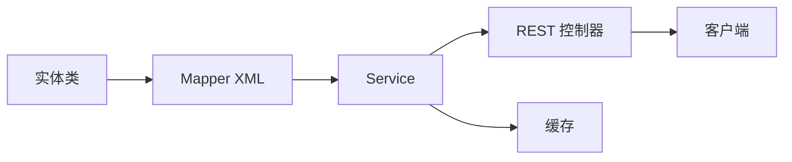

**图表来源**
- [MdmDict.java:1-60](file://micro-dict/src/main/java/com/wkclz/micro/dict/bean/entity/MdmDict.java#L1-L60)
- [MdmDictMapper.xml](file://micro-dict/src/main/resources/mapper/MdmDictMapper.xml)
- [MdmDictService.java](file://micro-dict/src/main/java/com/wkclz/micro/dict/service/MdmDictService.java)
- [MdmDictRest.java](file://micro-dict/src/main/java/com/wkclz/micro/dict/rest/DictRest.java)

**章节来源**
- [MdmDict.java:1-60](file://micro-dict/src/main/java/com/wkclz/micro/dict/bean/entity/MdmDict.java#L1-L60)
- [MdmDictMapper.xml](file://micro-dict/src/main/resources/mapper/MdmDictMapper.xml)
- [MdmDictService.java](file://micro-dict/src/main/java/com/wkclz/micro/dict/service/MdmDictService.java)
- [MdmDictRest.java](file://micro-dict/src/main/java/com/wkclz/micro/dict/rest/DictRest.java)

## 性能考虑
- 索引策略：在高频过滤、排序、连接字段上建立复合索引；避免过多索引影响写入性能。
- 查询优化：使用分页与延迟加载；避免一次性加载大对象；对只读场景使用只读副本。
- 写入优化：批量提交、异步写入；对热点数据采用写前校验与缓存。
- 缓存策略：合理设置 TTL；热点数据双写一致性；失效策略与回源降级。

## 故障排查指南
- 常见问题：
  - 唯一键冲突：检查编码唯一性与并发场景。
  - 外键约束失败：确认关联对象是否存在且状态正常。
  - 缓存不一致：触发缓存失效或手动刷新。
  - 查询慢：检查索引、SQL 执行计划与分页参数。
- 排查步骤：
  - 查看日志与监控指标。
  - 复现最小化案例。
  - 核对实体字段与 XML 映射。
  - 验证缓存与数据库一致性。

**章节来源**
- [MdmDictItemMapper.xml](file://micro-dict/src/main/resources/mapper/MdmDictItemMapper.xml)
- [MdmFileosRecordMapper.xml](file://micro-fileos/src/main/resources/mapper/MdmFileosRecordMapper.xml)
- [MdmFormMapper.xml](file://micro-form/src/main/resources/mapper/MdmFormMapper.xml)
- [MdmPdfTemplateMapper.xml](file://micro-pdf/src/main/resources/mapper/MdmPdfTemplateMapper.xml)
- [MdmSequenceMapper.xml](file://micro-seq/src/main/resources/mapper/MdmSequenceMapper.xml)
- [MsgTemplateMapper.xml](file://micro-msg/src/main/resources/mapper/MsgTemplateMapper.xml)

## 结论
本数据模型文档系统性梳理了 sh-microapp 的核心实体与关系，明确了表结构设计、验证与业务规则、访问与缓存策略、性能优化、迁移与版本管理、生命周期与安全控制。通过模块化与强契约的 XML 映射，实现了高内聚、低耦合的数据层设计，为后续扩展与演进提供了坚实基础。

## 附录
- 字段命名规范：采用下划线分隔；布尔字段以 is_ 前缀或 enable/status 等语义化命名。
- 时间字段：统一使用时间戳或日期时间类型；区分创建与更新时间。
- JSON 扩展：用于非结构化或可变字段；提供校验与默认值。