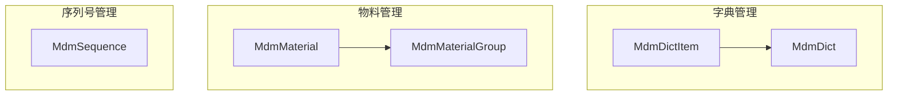
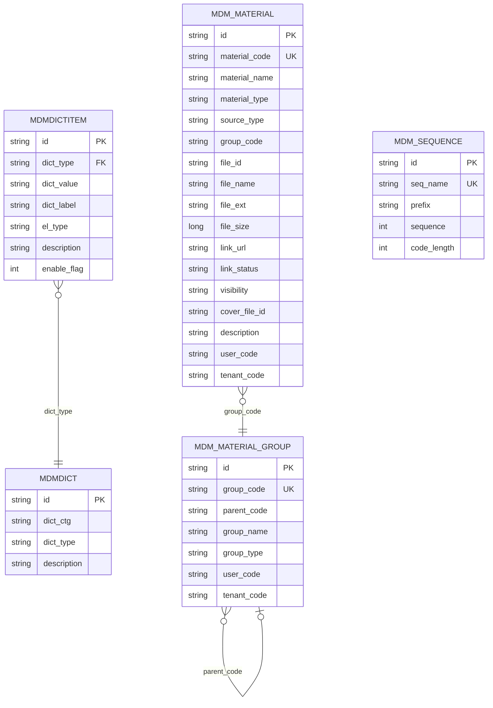
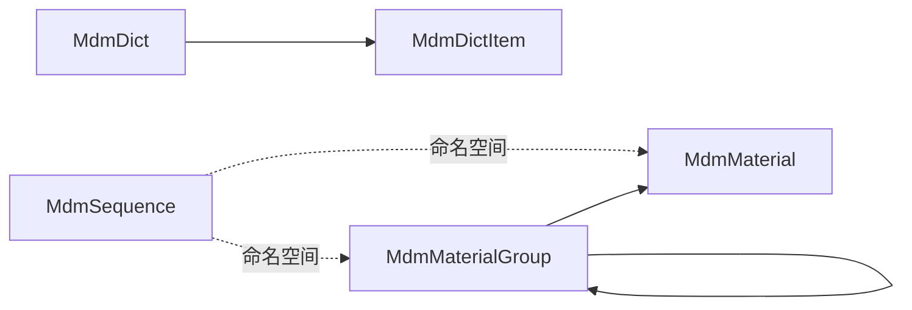

# 核心数据模型

<cite>
**本文引用的文件**
- [MdmDict.java](file://micro-dict/src/main/java/com/wkclz/micro/dict/bean/entity/MdmDict.java)
- [MdmDictItem.java](file://micro-dict/src/main/java/com/wkclz/micro/dict/bean/entity/MdmDictItem.java)
- [MdmMaterial.java](file://micro-material/src/main/java/com/wkclz/micro/material/bean/entity/MdmMaterial.java)
- [MdmMaterialGroup.java](file://micro-material/src/main/java/com/wkclz/micro/material/bean/entity/MdmMaterialGroup.java)
- [MdmSequence.java](file://micro-seq/src/main/java/com/wkclz/micro/seq/bean/entity/MdmSequence.java)
</cite>

## 目录
1. [简介](#简介)
2. [项目结构](#项目结构)
3. [核心组件](#核心组件)
4. [架构总览](#架构总览)
5. [详细组件分析](#详细组件分析)
6. [依赖分析](#依赖分析)
7. [性能考虑](#性能考虑)
8. [故障排查指南](#故障排查指南)
9. [结论](#结论)
10. [附录](#附录)

## 简介
本文件聚焦于系统中的核心数据模型，围绕“字典管理”、“物料管理”和“序列号管理”的关键实体进行深入解析。目标是帮助读者理解各实体的字段定义、数据类型、业务含义、实体间关系映射与约束条件，并给出数据库层面的主键、外键、索引与唯一约束建议，以及数据验证与业务规则说明。同时提供可落地的使用场景与最佳实践。

## 项目结构
本次文档涉及的实体均位于独立微服务模块中，采用按功能域划分的组织方式：
- 字典管理：实体位于 micro-dict 模块
- 物料管理：实体位于 micro-material 模块
- 序列号管理：实体位于 micro-seq 模块

图表来源
- [MdmDict.java:17-76](file://micro-dict/src/main/java/com/wkclz/micro/dict/bean/entity/MdmDict.java#L17-L76)
- [MdmDictItem.java:17-100](file://micro-dict/src/main/java/com/wkclz/micro/dict/bean/entity/MdmDictItem.java#L17-L100)
- [MdmMaterial.java:17-180](file://micro-material/src/main/java/com/wkclz/micro/material/bean/entity/MdmMaterial.java#L17-L180)
- [MdmMaterialGroup.java:17-100](file://micro-material/src/main/java/com/wkclz/micro/material/bean/entity/MdmMaterialGroup.java#L17-L100)
- [MdmSequence.java:17-84](file://micro-seq/src/main/java/com/wkclz/micro/seq/bean/entity/MdmSequence.java#L17-L84)

章节来源
- [MdmDict.java:1-76](file://micro-dict/src/main/java/com/wkclz/micro/dict/bean/entity/MdmDict.java#L1-L76)
- [MdmDictItem.java:1-100](file://micro-dict/src/main/java/com/wkclz/micro/dict/bean/entity/MdmDictItem.java#L1-L100)
- [MdmMaterial.java:1-180](file://micro-material/src/main/java/com/wkclz/micro/material/bean/entity/MdmMaterial.java#L1-L180)
- [MdmMaterialGroup.java:1-100](file://micro-material/src/main/java/com/wkclz/micro/material/bean/entity/MdmMaterialGroup.java#L1-L100)
- [MdmSequence.java:1-84](file://micro-seq/src/main/java/com/wkclz/micro/seq/bean/entity/MdmSequence.java#L1-L84)

## 核心组件
本节对三个领域的核心实体进行字段与业务含义的梳理，并给出数据库设计建议（主键、索引、唯一约束）。

- 字典实体
  - MdmDict：用于定义字典分类与类型，支持描述信息与排序
  - MdmDictItem：用于承载具体字典项，包含字典类型、值、标签、生效状态等
- 物料实体
  - MdmMaterial：物料主数据，涵盖编码、名称、类型、来源、分组、文件关联、可见性、所有者与租户等
  - MdmMaterialGroup：物料分组，支持父子层级、分组类型、所有者与租户
- 序列号实体
  - MdmSequence：序列号生成记录，包含名称、前缀、当前序列与序列长度

章节来源
- [MdmDict.java:17-76](file://micro-dict/src/main/java/com/wkclz/micro/dict/bean/entity/MdmDict.java#L17-L76)
- [MdmDictItem.java:17-100](file://micro-dict/src/main/java/com/wkclz/micro/dict/bean/entity/MdmDictItem.java#L17-L100)
- [MdmMaterial.java:17-180](file://micro-material/src/main/java/com/wkclz/micro/material/bean/entity/MdmMaterial.java#L17-L180)
- [MdmMaterialGroup.java:17-100](file://micro-material/src/main/java/com/wkclz/micro/material/bean/entity/MdmMaterialGroup.java#L17-L100)
- [MdmSequence.java:17-84](file://micro-seq/src/main/java/com/wkclz/micro/seq/bean/entity/MdmSequence.java#L17-L84)

## 架构总览
下图展示了三个领域实体在业务上的典型交互关系与职责边界：

图表来源
- [MdmDict.java:17-76](file://micro-dict/src/main/java/com/wkclz/micro/dict/bean/entity/MdmDict.java#L17-L76)
- [MdmDictItem.java:17-100](file://micro-dict/src/main/java/com/wkclz/micro/dict/bean/entity/MdmDictItem.java#L17-L100)
- [MdmMaterial.java:17-180](file://micro-material/src/main/java/com/wkclz/micro/material/bean/entity/MdmMaterial.java#L17-L180)
- [MdmMaterialGroup.java:17-100](file://micro-material/src/main/java/com/wkclz/micro/material/bean/entity/MdmMaterialGroup.java#L17-L100)
- [MdmSequence.java:17-84](file://micro-seq/src/main/java/com/wkclz/micro/seq/bean/entity/MdmSequence.java#L17-L84)

## 详细组件分析

### 字典管理实体
- 实体：MdmDict
  - 字段要点：dictCtg（字典分类）、dictType（字典类型）、description（类型描述）
  - 业务含义：用于归类与标识字典类型，便于统一管理与查询
  - 复制方法：提供 copy 与 copyIfNotNull，便于 DTO/VO 与持久化对象间的转换
- 实体：MdmDictItem
  - 字段要点：dictType（字典类型）、dictValue（字典值）、dictLabel（字典标签）、elType（前端类型）、description（描述）、enableFlag（生效状态）
  - 业务含义：承载具体的字典项，支持启用/禁用控制与前端渲染类型
  - 复制方法：提供 copy 与 copyIfNotNull，便于增量更新与对象复制

数据库设计建议（基于实体字段）
- 主键：id（继承自 BaseEntity）
- 索引：建议对 dictType 建立二级索引以提升按类型查询效率；对 dictValue 建立唯一索引以保证值唯一性
- 唯一约束：dictType + dictValue 组合唯一（避免同类型下重复值）

章节来源
- [MdmDict.java:17-76](file://micro-dict/src/main/java/com/wkclz/micro/dict/bean/entity/MdmDict.java#L17-L76)
- [MdmDictItem.java:17-100](file://micro-dict/src/main/java/com/wkclz/micro/dict/bean/entity/MdmDictItem.java#L17-L100)

### 物料管理实体
- 实体：MdmMaterial
  - 字段要点：materialCode（物料编码，必填）、materialName（物料名称，必填）、materialType（物料类型，必填）、sourceType（来源类型，必填）、groupCode（分组编码，必填）、fileId/fileName/fileExt/fileSize/linkUrl/linkStatus/visibility（文件或链接相关信息与可见性）、userCode（所有者用户编码，必填）、tenantCode（租户编码，必填）、description（描述）
  - 业务含义：物料主数据，支持上传与链接两种来源，具备可见性控制与多租户隔离
  - 复制方法：提供 copy 与 copyIfNotNull，便于批量更新与对象转换
- 实体：MdmMaterialGroup
  - 字段要点：groupCode（分组编码，必填）、parentCode（父级分组编码，顶级为0，必填）、groupName（分组名称，必填）、groupType（分组类型，必填，SYSTEM/PERSONAL）、userCode（所有者用户编码，必填）、tenantCode（租户编码，必填）
  - 业务含义：物料分组树，支持系统分组与个人分组，具备层级关系与多租户隔离
  - 复制方法：提供 copy 与 copyIfNotNull，便于树形结构与属性更新

数据库设计建议（基于实体字段）
- 主键：id（继承自 BaseEntity）
- 索引：groupCode 建立索引；materialCode 建议唯一索引；groupCode+parentCode 建立组合索引以优化树查询
- 唯一约束：materialCode 唯一；groupCode 唯一
- 外键：MdmMaterial.groupCode → MdmMaterialGroup.groupCode（逻辑外键，需应用层保证一致性）

章节来源
- [MdmMaterial.java:17-180](file://micro-material/src/main/java/com/wkclz/micro/material/bean/entity/MdmMaterial.java#L17-L180)
- [MdmMaterialGroup.java:17-100](file://micro-material/src/main/java/com/wkclz/micro/material/bean/entity/MdmMaterialGroup.java#L17-L100)

### 序列号管理实体
- 实体：MdmSequence
  - 字段要点：seqName（名称）、prefix（前缀）、sequence（当前序列）、codeLength（序列长度，不计前缀）
  - 业务含义：用于生成带前缀的流水号，支持不同业务场景的编号策略
  - 复制方法：提供 copy 与 copyIfNotNull，便于持久化与更新

数据库设计建议（基于实体字段）
- 主键：id（继承自 BaseEntity）
- 索引：seqName 建立唯一索引，确保同一业务场景仅有一条序列配置
- 唯一约束：seqName 唯一
- 并发安全：序列号生成应结合数据库原子递增与锁机制，避免并发冲突

章节来源
- [MdmSequence.java:17-84](file://micro-seq/src/main/java/com/wkclz/micro/seq/bean/entity/MdmSequence.java#L17-L84)

### 关系映射与约束条件
- 字典域
  - MdmDictItem.dictType → MdmDict.dictType：一对多关系（一个字典类型可对应多个字典项）
- 物料域
  - MdmMaterial.groupCode → MdmMaterialGroup.groupCode：一对一关系（物料归属到具体分组）
  - MdmMaterialGroup.parentCode：自引用，形成树形结构
- 序列号域
  - MdmSequence.seqName：作为业务场景的序列命名空间，全局唯一

图表来源
- [MdmDict.java:17-76](file://micro-dict/src/main/java/com/wkclz/micro/dict/bean/entity/MdmDict.java#L17-L76)
- [MdmDictItem.java:17-100](file://micro-dict/src/main/java/com/wkclz/micro/dict/bean/entity/MdmDictItem.java#L17-L100)
- [MdmMaterial.java:17-180](file://micro-material/src/main/java/com/wkclz/micro/material/bean/entity/MdmMaterial.java#L17-L180)
- [MdmMaterialGroup.java:17-100](file://micro-material/src/main/java/com/wkclz/micro/material/bean/entity/MdmMaterialGroup.java#L17-L100)
- [MdmSequence.java:17-84](file://micro-seq/src/main/java/com/wkclz/micro/seq/bean/entity/MdmSequence.java#L17-L84)

## 依赖分析
- 字典域
  - MdmDictItem 依赖 MdmDict 的 dictType 进行分类与过滤
- 物料域
  - MdmMaterial 依赖 MdmMaterialGroup 的 groupCode 进行分组归属
  - MdmMaterialGroup 自引用 parentCode 形成树结构
- 序列号域
  - MdmSequence 通过 seqName 作为业务命名空间，独立于其他实体

图表来源
- [MdmDict.java:17-76](file://micro-dict/src/main/java/com/wkclz/micro/dict/bean/entity/MdmDict.java#L17-L76)
- [MdmDictItem.java:17-100](file://micro-dict/src/main/java/com/wkclz/micro/dict/bean/entity/MdmDictItem.java#L17-L100)
- [MdmMaterial.java:17-180](file://micro-material/src/main/java/com/wkclz/micro/material/bean/entity/MdmMaterial.java#L17-L180)
- [MdmMaterialGroup.java:17-100](file://micro-material/src/main/java/com/wkclz/micro/material/bean/entity/MdmMaterialGroup.java#L17-L100)
- [MdmSequence.java:17-84](file://micro-seq/src/main/java/com/wkclz/micro/seq/bean/entity/MdmSequence.java#L17-L84)

## 性能考虑
- 索引策略
  - 字典：按 dictType 建立二级索引；按 dictValue 建立唯一索引
  - 物料：按 materialCode 建立唯一索引；按 groupCode 建立索引；树查询按 parentCode 建立组合索引
  - 序列：按 seqName 建立唯一索引
- 并发安全
  - 序列号生成建议使用数据库原子递增与行级锁，避免并发写入导致的重复
- 查询优化
  - 字典与物料的高频过滤字段（如 dictType、groupCode、userCode、tenantCode）应建立复合索引以减少回表

## 故障排查指南
- 字典项重复
  - 现象：新增字典项时报唯一约束冲突
  - 排查：检查 dictType 与 dictValue 的组合是否已存在
- 物料编码冲突
  - 现象：保存物料时报 materialCode 唯一约束冲突
  - 排查：确认同一租户下的物料编码是否重复
- 分组树异常
  - 现象：分组树查询结果为空或循环引用
  - 排查：检查 parentCode 是否指向有效分组；是否存在自引用或环路
- 序列号重复
  - 现象：生成的编号重复
  - 排查：确认并发生成时的锁机制与原子递增实现；核对 seqName 是否正确

章节来源
- [MdmDictItem.java:17-100](file://micro-dict/src/main/java/com/wkclz/micro/dict/bean/entity/MdmDictItem.java#L17-L100)
- [MdmMaterial.java:17-180](file://micro-material/src/main/java/com/wkclz/micro/material/bean/entity/MdmMaterial.java#L17-L180)
- [MdmMaterialGroup.java:17-100](file://micro-material/src/main/java/com/wkclz/micro/material/bean/entity/MdmMaterialGroup.java#L17-L100)
- [MdmSequence.java:17-84](file://micro-seq/src/main/java/com/wkclz/micro/seq/bean/entity/MdmSequence.java#L17-L84)

## 结论
通过对字典、物料与序列号三大领域的实体进行字段与业务含义的梳理，明确了它们在系统中的职责边界与相互关系。配合合理的数据库索引与唯一约束设计，可在保证数据一致性的前提下提升查询与生成效率。建议在生产环境中强化并发安全与唯一性校验，并持续完善字典与物料的业务规则与校验策略。

## 附录
- 使用场景示例（路径指引）
  - 新增字典项：参考 [MdmDictItem.java:17-100](file://micro-dict/src/main/java/com/wkclz/micro/dict/bean/entity/MdmDictItem.java#L17-L100)
  - 生成物料编码：参考 [MdmSequence.java:17-84](file://micro-seq/src/main/java/com/wkclz/micro/seq/bean/entity/MdmSequence.java#L17-L84)
  - 创建物料并分配分组：参考 [MdmMaterial.java:17-180](file://micro-material/src/main/java/com/wkclz/micro/material/bean/entity/MdmMaterial.java#L17-L180) 与 [MdmMaterialGroup.java:17-100](file://micro-material/src/main/java/com/wkclz/micro/material/bean/entity/MdmMaterialGroup.java#L17-L100)
- 最佳实践
  - 为高频过滤字段建立索引，避免全表扫描
  - 对关键业务字段（如编码、名称）建立唯一约束
  - 在序列号生成环节引入原子递增与锁，确保并发安全
  - 对字典与物料的启用/可见性等状态字段进行统一校验