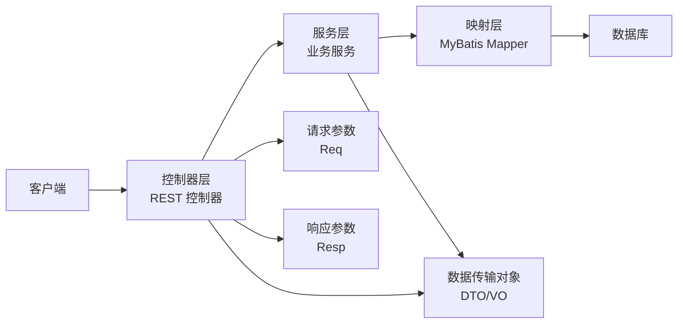
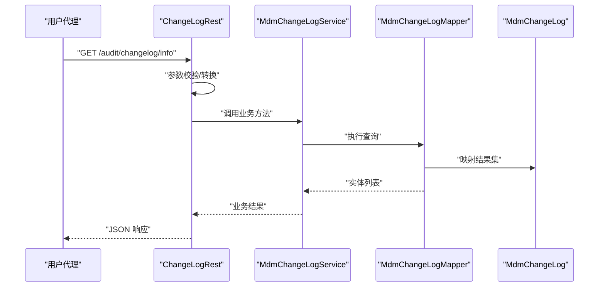
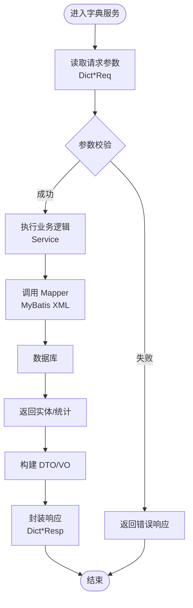
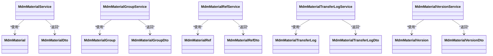
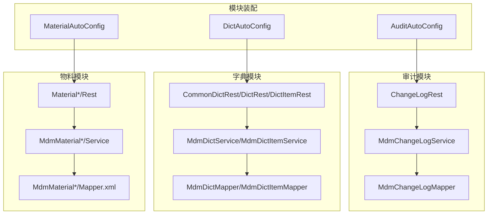

# 分层架构设计

<cite>
**本文引用的文件**
- [AuditAutoConfig.java](file://micro-audit/src/main/java/com/wkclz/micro/audit/AuditAutoConfig.java)
- [AuditApi.java](file://micro-audit/src/main/java/com/wkclz/micro/audit/api/AuditApi.java)
- [AuditImpl.java](file://micro-audit/src/main/java/com/wkclz/micro/audit/api/impl/AuditImpl.java)
- [ChangeLogRest.java](file://micro-audit/src/main/java/com/wkclz/micro/audit/rest/ChangeLogRest.java)
- [Route.java](file://micro-audit/src/main/java/com/wkclz/micro/audit/rest/Route.java)
- [MdmChangeLogService.java](file://micro-audit/src/main/java/com/wkclz/micro/audit/service/MdmChangeLogService.java)
- [MdmChangeLogMapper.java](file://micro-audit/src/main/java/com/wkclz/micro/audit/mapper/MdmChangeLogMapper.java)
- [MdmChangeLog.java](file://micro-audit/src/main/java/com/wkclz/micro/audit/bean/entity/MdmChangeLog.java)
- [ChangeLog.java](file://micro-audit/src/main/java/com/wkclz/micro/audit/bean/dto/ChangeLog.java)
- [ChangeLogInfoReq.java](file://micro-audit/src/main/java/com/wkclz/micro/audit/bean/req/ChangeLogInfoReq.java)
- [ChangeLogPageReq.java](file://micro-audit/src/main/java/com/wkclz/micro/audit/bean/req/ChangeLogPageReq.java)
- [ChangeLogInfoResp.java](file://micro-audit/src/main/java/com/wkclz/micro/audit/bean/resp/ChangeLogInfoResp.java)
- [ChangeLogPageResp.java](file://micro-audit/src/main/java/com/wkclz/micro/audit/bean/resp/ChangeLogPageResp.java)
- [AuditCompareUtil.java](file://micro-audit/src/main/java/com/wkclz/micro/audit/utils/AuditCompareUtil.java)
- [MdmChangeLogMapper.xml](file://micro-audit/src/main/resources/mapper/MdmChangeLogMapper.xml)
- [org.springframework.boot.autoconfigure.AutoConfiguration.imports](file://micro-audit/src/main/resources/META-INF/spring/org.springframework.boot.autoconfigure.AutoConfiguration.imports)
- [MdmDictService.java](file://micro-dict/src/main/java/com/wkclz/micro/dict/service/MdmDictService.java)
- [MdmDictItemService.java](file://micro-dict/src/main/java/com/wkclz/micro/dict/service/MdmDictItemService.java)
- [MdmDict.java](file://micro-dict/src/main/java/com/wkclz/micro/dict/bean/entity/MdmDict.java)
- [MdmDictItem.java](file://micro-dict/src/main/java/com/wkclz/micro/dict/bean/entity/MdmDictItem.java)
- [MdmDictDto.java](file://micro-dict/src/main/java/com/wkclz/micro/dict/bean/dto/MdmDictDto.java)
- [MdmDictItemDto.java](file://micro-dict/src/main/java/com/wkclz/micro/dict/bean/dto/MdmDictItemDto.java)
- [MdmDictMapper.java](file://micro-dict/src/main/java/com/wkclz/micro/dict/mapper/MdmDictMapper.java)
- [MdmDictItemMapper.java](file://micro-dict/src/main/java/com/wkclz/micro/dict/mapper/MdmDictItemMapper.java)
- [MdmDictMapper.xml](file://micro-dict/src/main/resources/mapper/MdmDictMapper.xml)
- [MdmDictItemMapper.xml](file://micro-dict/src/main/resources/mapper/MdmDictItemMapper.xml)
- [CommonDictRest.java](file://micro-dict/src/main/java/com/wkclz/micro/dict/rest/CommonDictRest.java)
- [DictRest.java](file://micro-dict/src/main/java/com/wkclz/micro/dict/rest/DictRest.java)
- [DictItemRest.java](file://micro-dict/src/main/java/com/wkclz/micro/dict/rest/DictItemRest.java)
- [DictAutoConfig.java](file://micro-dict/src/main/java/com/wkclz/micro/dict/DictAutoConfig.java)
- [MdmMaterialService.java](file://micro-material/src/main/java/com/wkclz/micro/material/service/MdmMaterialService.java)
- [MdmMaterialGroupService.java](file://micro-material/src/main/java/com/wkclz/micro/material/service/MdmMaterialGroupService.java)
- [MdmMaterialRefService.java](file://micro-material/src/main/java/com/wkclz/micro/material/service/MdmMaterialRefService.java)
- [MdmMaterialTransferLogService.java](file://micro-material/src/main/java/com/wkclz/micro/material/service/MdmMaterialTransferLogService.java)
- [MdmMaterialVersionService.java](file://micro-material/src/main/java/com/wkclz/micro/material/service/MdmMaterialVersionService.java)
- [MdmMaterial.java](file://micro-material/src/main/java/com/wkclz/micro/material/bean/entity/MdmMaterial.java)
- [MdmMaterialGroup.java](file://micro-material/src/main/java/com/wkclz/micro/material/bean/entity/MdmMaterialGroup.java)
- [MdmMaterialRef.java](file://micro-material/src/main/java/com/wkclz/micro/material/bean/entity/MdmMaterialRef.java)
- [MdmMaterialTransferLog.java](file://micro-material/src/main/java/com/wkclz/micro/material/bean/entity/MdmMaterialTransferLog.java)
- [MdmMaterialVersion.java](file://micro-material/src/main/java/com/wkclz/micro/material/bean/entity/MdmMaterialVersion.java)
- [MdmMaterialDto.java](file://micro-material/src/main/java/com/wkclz/micro/material/bean/dto/MdmMaterialDto.java)
- [MdmMaterialGroupDto.java](file://micro-material/src/main/java/com/wkclz/micro/material/bean/dto/MdmMaterialGroupDto.java)
- [MdmMaterialRefDto.java](file://micro-material/src/main/java/com/wkclz/micro/material/bean/dto/MdmMaterialRefDto.java)
- [MdmMaterialTransferLogDto.java](file://micro-material/src/main/java/com/wkclz/micro/material/bean/dto/MdmMaterialTransferLogDto.java)
- [MdmMaterialVersionDto.java](file://micro-material/src/main/java/com/wkclz/micro/material/bean/dto/MdmMaterialVersionDto.java)
- [MaterialRest.java](file://micro-material/src/main/java/com/wkclz/micro/material/rest/MaterialRest.java)
- [MaterialGroupRest.java](file://micro-material/src/main/java/com/wkclz/micro/material/rest/MaterialGroupRest.java)
- [MaterialRefRest.java](file://micro-material/src/main/java/com/wkclz/micro/material/rest/MaterialRefRest.java)
- [MaterialTransferRest.java](file://micro-material/src/main/java/com/wkclz/micro/material/rest/MaterialTransferRest.java)
- [MaterialVersionRest.java](file://micro-material/src/main/java/com/wkclz/micro/material/rest/MaterialVersionRest.java)
- [MaterialAutoConfig.java](file://micro-material/src/main/java/com/wkclz/micro/material/MaterialAutoConfig.java)
- [MdmMaterialMapper.xml](file://micro-material/src/main/resources/mapper/MdmMaterialMapper.xml)
- [MdmMaterialGroupMapper.xml](file://micro-material/src/main/resources/mapper/MdmMaterialGroupMapper.xml)
- [MdmMaterialRefMapper.xml](file://micro-material/src/main/resources/mapper/MdmMaterialRefMapper.xml)
- [MdmMaterialTransferLogMapper.xml](file://micro-material/src/main/resources/mapper/MdmMaterialTransferLogMapper.xml)
- [MdmMaterialVersionMapper.xml](file://micro-material/src/main/resources/mapper/MdmMaterialVersionMapper.xml)
</cite>

## 目录
1. 引言
2. 项目结构
3. 核心组件
4. 架构总览
5. 组件详细分析
6. 依赖关系分析
7. 性能考量
8. 故障排查指南
9. 结论
10. 附录

## 引言
本文件面向 sh-microapp 的分层架构设计，系统性阐述 MVC 分层在微模块中的落地方式：Controller 层负责 REST 接口编排与路由暴露；Service 层封装业务规则与流程；Mapper 层承担数据持久化；Entity 层定义领域模型。同时给出 DTO/VO 设计原则、职责边界、调用关系、重构建议与性能优化策略，帮助团队在保持高内聚低耦合的同时提升可维护性与扩展性。

## 项目结构
- 采用按功能域划分的多模块结构，每个微模块独立包含 controller、service、mapper、entity/dto/req/resp 等层次化包结构。
- 典型模块如 audit、dict、material 等均遵循相同的分层组织方式，便于统一治理与复用。
- 模块通过 Spring Boot 自动装配机制加载，配置文件位于 resources/META-INF/spring 下。

```mermaid
graph TB
subgraph "审计模块(micro-audit)"
A_Rest["REST 控制器<br/>ChangeLogRest.java"]
A_Service["业务服务<br/>MdmChangeLogService.java"]
A_Mapper["数据映射<br/>MdmChangeLogMapper.java"]
A_Entity["实体模型<br/>MdmChangeLog.java"]
A_DTO["数据传输对象<br/>ChangeLog.java"]
A_Req["请求参数<br/>ChangeLogInfoReq/PageReq.java"]
A_Resp["响应参数<br/>ChangeLogInfoResp/PageResp.java"]
A_Api["对外接口<br/>AuditApi.java / AuditImpl.java"]
A_Config["自动装配<br/>AuditAutoConfig.java"]
end
subgraph "字典模块(micro-dict)"
D_Rest["REST 控制器<br/>CommonDictRest/DictRest/DictItemRest.java"]
D_Service["业务服务<br/>MdmDictService/MdmDictItemService.java"]
D_Mapper["数据映射<br/>MdmDictMapper/MdmDictItemMapper.java"]
D_Entity["实体模型<br/>MdmDict/MdmDictItem.java"]
D_Dto["数据传输对象<br/>MdmDictDto/MdmDictItemDto.java"]
D_Config["自动装配<br/>DictAutoConfig.java"]
end
subgraph "物料模块(micro-material)"
M_Rest["REST 控制器<br/>Material*/Rest.java"]
M_Service["业务服务<br/>MdmMaterial*/Service.java"]
M_Mapper["数据映射<br/>MdmMaterial*/Mapper.xml"]
M_Entity["实体模型<br/>MdmMaterial*/Entity.java"]
M_Dto["数据传输对象<br/>MdmMaterial*/Dto.java"]
M_Config["自动装配<br/>MaterialAutoConfig.java"]
end
A_Rest --> A_Service --> A_Mapper --> A_Entity
A_Rest --> A_DTO
A_Rest --> A_Req
A_Rest --> A_Resp
A_Rest --> A_Api
D_Rest --> D_Service --> D_Mapper --> D_Entity
D_Rest --> D_Dto
M_Rest --> M_Service --> M_Mapper --> M_Entity
M_Rest --> M_Dto
A_Config -.-> A_Rest
D_Config -.-> D_Rest
M_Config -.-> M_Rest
```

图示来源
- [ChangeLogRest.java:1-200](file://micro-audit/src/main/java/com/wkclz/micro/audit/rest/ChangeLogRest.java#L1-L200)
- [MdmChangeLogService.java:1-200](file://micro-audit/src/main/java/com/wkclz/micro/audit/service/MdmChangeLogService.java#L1-L200)
- [MdmChangeLogMapper.java:1-200](file://micro-audit/src/main/java/com/wkclz/micro/audit/mapper/MdmChangeLogMapper.java#L1-L200)
- [MdmChangeLog.java:1-200](file://micro-audit/src/main/java/com/wkclz/micro/audit/bean/entity/MdmChangeLog.java#L1-L200)
- [ChangeLog.java:1-200](file://micro-audit/src/main/java/com/wkclz/micro/audit/bean/dto/ChangeLog.java#L1-L200)
- [CommonDictRest.java:1-200](file://micro-dict/src/main/java/com/wkclz/micro/dict/rest/CommonDictRest.java#L1-L200)
- [MdmDictService.java:1-200](file://micro-dict/src/main/java/com/wkclz/micro/dict/service/MdmDictService.java#L1-L200)
- [MdmDictItemService.java:1-200](file://micro-dict/src/main/java/com/wkclz/micro/dict/service/MdmDictItemService.java#L1-L200)
- [MdmDict.java:1-200](file://micro-dict/src/main/java/com/wkclz/micro/dict/bean/entity/MdmDict.java#L1-L200)
- [MdmDictItem.java:1-200](file://micro-dict/src/main/java/com/wkclz/micro/dict/bean/entity/MdmDictItem.java#L1-L200)
- [MdmDictDto.java:1-200](file://micro-dict/src/main/java/com/wkclz/micro/dict/bean/dto/MdmDictDto.java#L1-L200)
- [MdmDictItemDto.java:1-200](file://micro-dict/src/main/java/com/wkclz/micro/dict/bean/dto/MdmDictItemDto.java#L1-L200)
- [MaterialRest.java:1-200](file://micro-material/src/main/java/com/wkclz/micro/material/rest/MaterialRest.java#L1-L200)
- [MdmMaterialService.java:1-200](file://micro-material/src/main/java/com/wkclz/micro/material/service/MdmMaterialService.java#L1-L200)
- [MdmMaterialGroupService.java:1-200](file://micro-material/src/main/java/com/wkclz/micro/material/service/MdmMaterialGroupService.java#L1-L200)
- [MdmMaterialRefService.java:1-200](file://micro-material/src/main/java/com/wkclz/micro/material/service/MdmMaterialRefService.java#L1-L200)
- [MdmMaterialTransferLogService.java:1-200](file://micro-material/src/main/java/com/wkclz/micro/material/service/MdmMaterialTransferLogService.java#L1-L200)
- [MdmMaterialVersionService.java:1-200](file://micro-material/src/main/java/com/wkclz/micro/material/service/MdmMaterialVersionService.java#L1-L200)
- [MdmMaterial.java:1-200](file://micro-material/src/main/java/com/wkclz/micro/material/bean/entity/MdmMaterial.java#L1-L200)
- [MdmMaterialGroup.java:1-200](file://micro-material/src/main/java/com/wkclz/micro/material/bean/entity/MdmMaterialGroup.java#L1-L200)
- [MdmMaterialRef.java:1-200](file://micro-material/src/main/java/com/wkclz/micro/material/bean/entity/MdmMaterialRef.java#L1-L200)
- [MdmMaterialTransferLog.java:1-200](file://micro-material/src/main/java/com/wkclz/micro/material/bean/entity/MdmMaterialTransferLog.java#L1-L200)
- [MdmMaterialVersion.java:1-200](file://micro-material/src/main/java/com/wkclz/micro/material/bean/entity/MdmMaterialVersion.java#L1-L200)
- [MdmMaterialDto.java:1-200](file://micro-material/src/main/java/com/wkclz/micro/material/bean/dto/MdmMaterialDto.java#L1-L200)
- [MdmMaterialGroupDto.java:1-200](file://micro-material/src/main/java/com/wkclz/micro/material/bean/dto/MdmMaterialGroupDto.java#L1-L200)
- [MdmMaterialRefDto.java:1-200](file://micro-material/src/main/java/com/wkclz/micro/material/bean/dto/MdmMaterialRefDto.java#L1-L200)
- [MdmMaterialTransferLogDto.java:1-200](file://micro-material/src/main/java/com/wkclz/micro/material/bean/dto/MdmMaterialTransferLogDto.java#L1-L200)
- [MdmMaterialVersionDto.java:1-200](file://micro-material/src/main/java/com/wkclz/micro/material/bean/dto/MdmMaterialVersionDto.java#L1-L200)

章节来源
- [AuditAutoConfig.java:1-200](file://micro-audit/src/main/java/com/wkclz/micro/audit/AuditAutoConfig.java#L1-L200)
- [DictAutoConfig.java:1-200](file://micro-dict/src/main/java/com/wkclz/micro/dict/DictAutoConfig.java#L1-L200)
- [MaterialAutoConfig.java:1-200](file://micro-material/src/main/java/com/wkclz/micro/material/MaterialAutoConfig.java#L1-L200)

## 核心组件
- 控制器层（Controller）
  - 职责：接收 HTTP 请求，参数校验与转换，调用服务层，组装响应。
  - 示例：审计模块的 ChangeLogRest、字典模块的 CommonDictRest/DictRest/DictItemRest、物料模块的 Material*/Rest。
- 服务层（Service）
  - 职责：编排业务流程，组合多个 Mapper 操作，处理事务边界，封装领域规则。
  - 示例：MdmChangeLogService、MdmDictService/MdmDictItemService、MdmMaterial*/Service。
- 映射层（Mapper）
  - 职责：基于 MyBatis XML 或注解进行 SQL 映射，完成 CRUD 与查询。
  - 示例：MdmChangeLogMapper、MdmDictMapper/MdmDictItemMapper、MdmMaterial*/Mapper.xml。
- 实体层（Entity/DTO/VO）
  - 职责：定义数据库实体与跨层传输对象，确保接口稳定与数据隔离。
  - 示例：MdmChangeLog、MdmDict/MdmDictItem、MdmMaterial*/Entity；DTO 如 ChangeLog、MdmDictDto 等。

章节来源
- [ChangeLogRest.java:1-200](file://micro-audit/src/main/java/com/wkclz/micro/audit/rest/ChangeLogRest.java#L1-L200)
- [MdmChangeLogService.java:1-200](file://micro-audit/src/main/java/com/wkclz/micro/audit/service/MdmChangeLogService.java#L1-L200)
- [MdmChangeLogMapper.java:1-200](file://micro-audit/src/main/java/com/wkclz/micro/audit/mapper/MdmChangeLogMapper.java#L1-L200)
- [MdmChangeLog.java:1-200](file://micro-audit/src/main/java/com/wkclz/micro/audit/bean/entity/MdmChangeLog.java#L1-L200)
- [ChangeLog.java:1-200](file://micro-audit/src/main/java/com/wkclz/micro/audit/bean/dto/ChangeLog.java#L1-L200)
- [MdmDictService.java:1-200](file://micro-dict/src/main/java/com/wkclz/micro/dict/service/MdmDictService.java#L1-L200)
- [MdmDictItemService.java:1-200](file://micro-dict/src/main/java/com/wkclz/micro/dict/service/MdmDictItemService.java#L1-L200)
- [MdmDict.java:1-200](file://micro-dict/src/main/java/com/wkclz/micro/dict/bean/entity/MdmDict.java#L1-L200)
- [MdmDictItem.java:1-200](file://micro-dict/src/main/java/com/wkclz/micro/dict/bean/entity/MdmDictItem.java#L1-L200)
- [MdmDictDto.java:1-200](file://micro-dict/src/main/java/com/wkclz/micro/dict/bean/dto/MdmDictDto.java#L1-L200)
- [MdmDictItemDto.java:1-200](file://micro-dict/src/main/java/com/wkclz/micro/dict/bean/dto/MdmDictItemDto.java#L1-L200)
- [MdmMaterialService.java:1-200](file://micro-material/src/main/java/com/wkclz/micro/material/service/MdmMaterialService.java#L1-L200)
- [MdmMaterialGroupService.java:1-200](file://micro-material/src/main/java/com/wkclz/micro/material/service/MdmMaterialGroupService.java#L1-L200)
- [MdmMaterialRefService.java:1-200](file://micro-material/src/main/java/com/wkclz/micro/material/service/MdmMaterialRefService.java#L1-L200)
- [MdmMaterialTransferLogService.java:1-200](file://micro-material/src/main/java/com/wkclz/micro/material/service/MdmMaterialTransferLogService.java#L1-L200)
- [MdmMaterialVersionService.java:1-200](file://micro-material/src/main/java/com/wkclz/micro/material/service/MdmMaterialVersionService.java#L1-L200)

## 架构总览
- 分层边界清晰：Controller 不直接操作数据库，Service 不直接处理 HTTP，Mapper 仅关注 SQL。
- 数据流向：Controller -> Service -> Mapper -> DB；返回时 Service -> DTO/VO -> Controller -> HTTP。
- 配置驱动：各模块通过 AutoConfiguration 在启动时注册组件，减少硬编码。

图示来源
- [ChangeLogRest.java:1-200](file://micro-audit/src/main/java/com/wkclz/micro/audit/rest/ChangeLogRest.java#L1-L200)
- [MdmChangeLogService.java:1-200](file://micro-audit/src/main/java/com/wkclz/micro/audit/service/MdmChangeLogService.java#L1-L200)
- [MdmChangeLogMapper.java:1-200](file://micro-audit/src/main/java/com/wkclz/micro/audit/mapper/MdmChangeLogMapper.java#L1-L200)
- [ChangeLogInfoReq.java:1-200](file://micro-audit/src/main/java/com/wkclz/micro/audit/bean/req/ChangeLogInfoReq.java#L1-L200)
- [ChangeLogInfoResp.java:1-200](file://micro-audit/src/main/java/com/wkclz/micro/audit/bean/resp/ChangeLogInfoResp.java#L1-L200)
- [ChangeLog.java:1-200](file://micro-audit/src/main/java/com/wkclz/micro/audit/bean/dto/ChangeLog.java#L1-L200)

## 组件详细分析

### 审计模块（micro-audit）分层实现
- 控制器层
  - ChangeLogRest 提供变更日志的查询与详情接口，负责参数接收、入参校验、调用服务层并返回响应。
  - Route 定义 REST 路由前缀与路径映射，统一暴露接口。
- 服务层
  - MdmChangeLogService 封装变更日志的业务逻辑，可能组合多个 Mapper 操作，处理复杂查询与聚合。
  - AuditCompareUtil 提供字段对比等辅助能力，供服务层复用。
- 映射层
  - MdmChangeLogMapper 对应 MyBatis 映射文件，承载 SQL 查询与更新。
- 实体与 DTO
  - MdmChangeLog 表示数据库实体。
  - ChangeLog 作为传输对象，用于对外返回或跨层传递。
  - ChangeLogInfoReq/PageReq 作为请求参数对象，ChangeLogInfoResp/PageResp 作为响应对象。

图示来源
- [ChangeLogRest.java:1-200](file://micro-audit/src/main/java/com/wkclz/micro/audit/rest/ChangeLogRest.java#L1-L200)
- [MdmChangeLogService.java:1-200](file://micro-audit/src/main/java/com/wkclz/micro/audit/service/MdmChangeLogService.java#L1-L200)
- [MdmChangeLogMapper.java:1-200](file://micro-audit/src/main/java/com/wkclz/micro/audit/mapper/MdmChangeLogMapper.java#L1-L200)
- [MdmChangeLog.java:1-200](file://micro-audit/src/main/java/com/wkclz/micro/audit/bean/entity/MdmChangeLog.java#L1-L200)
- [ChangeLogInfoReq.java:1-200](file://micro-audit/src/main/java/com/wkclz/micro/audit/bean/req/ChangeLogInfoReq.java#L1-L200)
- [ChangeLogInfoResp.java:1-200](file://micro-audit/src/main/java/com/wkclz/micro/audit/bean/resp/ChangeLogInfoResp.java#L1-L200)
- [ChangeLog.java:1-200](file://micro-audit/src/main/java/com/wkclz/micro/audit/bean/dto/ChangeLog.java#L1-L200)

章节来源
- [ChangeLogRest.java:1-200](file://micro-audit/src/main/java/com/wkclz/micro/audit/rest/ChangeLogRest.java#L1-L200)
- [MdmChangeLogService.java:1-200](file://micro-audit/src/main/java/com/wkclz/micro/audit/service/MdmChangeLogService.java#L1-L200)
- [MdmChangeLogMapper.java:1-200](file://micro-audit/src/main/java/com/wkclz/micro/audit/mapper/MdmChangeLogMapper.java#L1-L200)
- [MdmChangeLogMapper.xml:1-200](file://micro-audit/src/main/resources/mapper/MdmChangeLogMapper.xml#L1-L200)
- [AuditCompareUtil.java:1-200](file://micro-audit/src/main/java/com/wkclz/micro/audit/utils/AuditCompareUtil.java#L1-L200)
- [AuditApi.java:1-200](file://micro-audit/src/main/java/com/wkclz/micro/audit/api/AuditApi.java#L1-L200)
- [AuditImpl.java:1-200](file://micro-audit/src/main/java/com/wkclz/micro/audit/api/impl/AuditImpl.java#L1-L200)

### 字典模块（micro-dict）分层实现
- 控制器层
  - CommonDictRest/DictRest/DictItemRest 提供通用字典、字典项的增删改查与分页接口。
- 服务层
  - MdmDictService/MdmDictItemService 封装字典与字典项的业务规则与流程。
- 映射层
  - MdmDictMapper/MdmDictItemMapper 对应 MyBatis XML，承载 SQL。
- 实体与 DTO
  - MdmDict/MdmDictItem 为数据库实体；MdmDictDto/MdmDictItemDto 为对外传输对象。

图示来源
- [CommonDictRest.java:1-200](file://micro-dict/src/main/java/com/wkclz/micro/dict/rest/CommonDictRest.java#L1-L200)
- [DictRest.java:1-200](file://micro-dict/src/main/java/com/wkclz/micro/dict/rest/DictRest.java#L1-L200)
- [DictItemRest.java:1-200](file://micro-dict/src/main/java/com/wkclz/micro/dict/rest/DictItemRest.java#L1-L200)
- [MdmDictService.java:1-200](file://micro-dict/src/main/java/com/wkclz/micro/dict/service/MdmDictService.java#L1-L200)
- [MdmDictItemService.java:1-200](file://micro-dict/src/main/java/com/wkclz/micro/dict/service/MdmDictItemService.java#L1-L200)
- [MdmDictMapper.java:1-200](file://micro-dict/src/main/java/com/wkclz/micro/dict/mapper/MdmDictMapper.java#L1-L200)
- [MdmDictItemMapper.java:1-200](file://micro-dict/src/main/java/com/wkclz/micro/dict/mapper/MdmDictItemMapper.java#L1-L200)
- [MdmDictDto.java:1-200](file://micro-dict/src/main/java/com/wkclz/micro/dict/bean/dto/MdmDictDto.java#L1-L200)
- [MdmDictItemDto.java:1-200](file://micro-dict/src/main/java/com/wkclz/micro/dict/bean/dto/MdmDictItemDto.java#L1-L200)

章节来源
- [MdmDictMapper.xml:1-200](file://micro-dict/src/main/resources/mapper/MdmDictMapper.xml#L1-L200)
- [MdmDictItemMapper.xml:1-200](file://micro-dict/src/main/resources/mapper/MdmDictItemMapper.xml#L1-L200)

### 物料模块（micro-material）分层实现
- 控制器层
  - MaterialRest/MaterialGroupRest/MaterialRefRest/MaterialTransferRest/MaterialVersionRest 提供物料、分组、关联、流转、版本等接口。
- 服务层
  - MdmMaterialService/MdmMaterialGroupService/MdmMaterialRefService/MdmMaterialTransferLogService/MdmMaterialVersionService 封装业务流程。
- 映射层
  - 多个 Mapper XML 承载不同维度的查询与更新。
- 实体与 DTO
  - MdmMaterial*/Entity 与 MdmMaterial*/Dto 形成稳定的传输契约。

图示来源
- [MaterialRest.java:1-200](file://micro-material/src/main/java/com/wkclz/micro/material/rest/MaterialRest.java#L1-L200)
- [MaterialGroupRest.java:1-200](file://micro-material/src/main/java/com/wkclz/micro/material/rest/MaterialGroupRest.java#L1-L200)
- [MaterialRefRest.java:1-200](file://micro-material/src/main/java/com/wkclz/micro/material/rest/MaterialRefRest.java#L1-L200)
- [MaterialTransferRest.java:1-200](file://micro-material/src/main/java/com/wkclz/micro/material/rest/MaterialTransferRest.java#L1-L200)
- [MaterialVersionRest.java:1-200](file://micro-material/src/main/java/com/wkclz/micro/material/rest/MaterialVersionRest.java#L1-L200)
- [MdmMaterialService.java:1-200](file://micro-material/src/main/java/com/wkclz/micro/material/service/MdmMaterialService.java#L1-L200)
- [MdmMaterialGroupService.java:1-200](file://micro-material/src/main/java/com/wkclz/micro/material/service/MdmMaterialGroupService.java#L1-L200)
- [MdmMaterialRefService.java:1-200](file://micro-material/src/main/java/com/wkclz/micro/material/service/MdmMaterialRefService.java#L1-L200)
- [MdmMaterialTransferLogService.java:1-200](file://micro-material/src/main/java/com/wkclz/micro/material/service/MdmMaterialTransferLogService.java#L1-L200)
- [MdmMaterialVersionService.java:1-200](file://micro-material/src/main/java/com/wkclz/micro/material/service/MdmMaterialVersionService.java#L1-L200)
- [MdmMaterial.java:1-200](file://micro-material/src/main/java/com/wkclz/micro/material/bean/entity/MdmMaterial.java#L1-L200)
- [MdmMaterialGroup.java:1-200](file://micro-material/src/main/java/com/wkclz/micro/material/bean/entity/MdmMaterialGroup.java#L1-L200)
- [MdmMaterialRef.java:1-200](file://micro-material/src/main/java/com/wkclz/micro/material/bean/entity/MdmMaterialRef.java#L1-L200)
- [MdmMaterialTransferLog.java:1-200](file://micro-material/src/main/java/com/wkclz/micro/material/bean/entity/MdmMaterialTransferLog.java#L1-L200)
- [MdmMaterialVersion.java:1-200](file://micro-material/src/main/java/com/wkclz/micro/material/bean/entity/MdmMaterialVersion.java#L1-L200)
- [MdmMaterialDto.java:1-200](file://micro-material/src/main/java/com/wkclz/micro/material/bean/dto/MdmMaterialDto.java#L1-L200)
- [MdmMaterialGroupDto.java:1-200](file://micro-material/src/main/java/com/wkclz/micro/material/bean/dto/MdmMaterialGroupDto.java#L1-L200)
- [MdmMaterialRefDto.java:1-200](file://micro-material/src/main/java/com/wkclz/micro/material/bean/dto/MdmMaterialRefDto.java#L1-L200)
- [MdmMaterialTransferLogDto.java:1-200](file://micro-material/src/main/java/com/wkclz/micro/material/bean/dto/MdmMaterialTransferLogDto.java#L1-L200)
- [MdmMaterialVersionDto.java:1-200](file://micro-material/src/main/java/com/wkclz/micro/material/bean/dto/MdmMaterialVersionDto.java#L1-L200)

章节来源
- [MdmMaterialMapper.xml:1-200](file://micro-material/src/main/resources/mapper/MdmMaterialMapper.xml#L1-L200)
- [MdmMaterialGroupMapper.xml:1-200](file://micro-material/src/main/resources/mapper/MdmMaterialGroupMapper.xml#L1-L200)
- [MdmMaterialRefMapper.xml:1-200](file://micro-material/src/main/resources/mapper/MdmMaterialRefMapper.xml#L1-L200)
- [MdmMaterialTransferLogMapper.xml:1-200](file://micro-material/src/main/resources/mapper/MdmMaterialTransferLogMapper.xml#L1-L200)
- [MdmMaterialVersionMapper.xml:1-200](file://micro-material/src/main/resources/mapper/MdmMaterialVersionMapper.xml#L1-L200)

## 依赖关系分析
- 模块内依赖：Controller -> Service -> Mapper -> Entity/DTO，严格单向依赖。
- 模块间依赖：通过 API 接口或共享 DTO 进行有限耦合，避免循环依赖。
- 自动装配：各模块通过 AutoConfiguration 注册组件，降低外部配置成本。

图示来源
- [AuditAutoConfig.java:1-200](file://micro-audit/src/main/java/com/wkclz/micro/audit/AuditAutoConfig.java#L1-L200)
- [DictAutoConfig.java:1-200](file://micro-dict/src/main/java/com/wkclz/micro/dict/DictAutoConfig.java#L1-L200)
- [MaterialAutoConfig.java:1-200](file://micro-material/src/main/java/com/wkclz/micro/material/MaterialAutoConfig.java#L1-L200)
- [ChangeLogRest.java:1-200](file://micro-audit/src/main/java/com/wkclz/micro/audit/rest/ChangeLogRest.java#L1-L200)
- [CommonDictRest.java:1-200](file://micro-dict/src/main/java/com/wkclz/micro/dict/rest/CommonDictRest.java#L1-L200)
- [MaterialRest.java:1-200](file://micro-material/src/main/java/com/wkclz/micro/material/rest/MaterialRest.java#L1-L200)

章节来源
- [org.springframework.boot.autoconfigure.AutoConfiguration.imports:1-200](file://micro-audit/src/main/resources/META-INF/spring/org.springframework.boot.autoconfigure.AutoConfiguration.imports#L1-L200)

## 性能考量
- SQL 优化
  - 使用合适的索引覆盖查询条件，避免全表扫描；对分页查询使用覆盖索引与延迟关联。
  - 复杂联表查询拆分为多次小查询，结合批量插入/更新减少往返。
- 缓存策略
  - 对热点字典、物料分组等只读数据引入缓存，设置合理过期策略，避免缓存穿透。
- 事务与锁
  - 将长事务拆分为短事务，减少锁持有时间；对并发写场景使用乐观锁或队列削峰。
- DTO/VO 设计
  - 仅传输必要字段，避免 N+1 查询；对大对象分批加载或懒加载。
- 并发控制
  - 对幂等接口使用请求去重键；对高频接口增加限流与熔断保护。

## 故障排查指南
- 控制器层
  - 参数校验失败：检查 Req 对象字段与前端传参是否一致；确认校验注解与提示信息。
  - 返回异常：捕获异常并记录上下文日志，返回标准化错误码与提示。
- 服务层
  - 业务规则异常：定位具体业务分支，补充边界条件与异常分支处理。
  - 事务回滚：确认事务范围与异常传播策略，避免部分提交。
- 映射层
  - SQL 报错：核对 Mapper XML 中的 SQL 与表结构一致性；检查动态拼接参数。
  - 结果映射异常：确认实体字段与列名映射关系，避免大小写与命名差异。
- 实体与 DTO
  - 字段缺失：确认 DTO 是否遗漏新增字段；保持与实体/接口文档同步。
- 自动装配
  - 组件未生效：检查 AutoConfiguration 是否被正确加载；确认 imports 文件路径与内容。

章节来源
- [ChangeLogInfoReq.java:1-200](file://micro-audit/src/main/java/com/wkclz/micro/audit/bean/req/ChangeLogInfoReq.java#L1-L200)
- [ChangeLogInfoResp.java:1-200](file://micro-audit/src/main/java/com/wkclz/micro/audit/bean/resp/ChangeLogInfoResp.java#L1-L200)
- [MdmDictMapper.xml:1-200](file://micro-dict/src/main/resources/mapper/MdmDictMapper.xml#L1-L200)
- [MdmMaterialMapper.xml:1-200](file://micro-material/src/main/resources/mapper/MdmMaterialMapper.xml#L1-L200)

## 结论
该仓库以“模块化 + 分层架构”为核心设计思想，通过清晰的职责边界与稳定的 DTO/VO 传输契约，实现了良好的可维护性与扩展性。建议在后续演进中持续强化：
- 统一的分层规范与代码模板；
- 完善的单元测试与集成测试；
- 可观测性与链路追踪；
- 逐步引入事件驱动与异步化改造。

## 附录
- 分层重构指南
  - 从外到内：先完善 DTO/VO 与接口契约，再调整 Service 与 Mapper 的职责边界。
  - 渐进式迁移：优先选择低耦合、易测试的模块先行改造，形成可复用的样板工程。
  - 规范先行：制定分层命名约定、包结构约定与异常处理规范。
- 最佳实践
  - 控制器只做编排，不写业务；服务层只做编排，不写 SQL；Mapper 只做映射。
  - DTO/VO 与实体分离，避免跨层污染；对外 DTO 保持稳定，内部实体可演进。
  - 严格事务边界与异常处理，保证数据一致性与可观测性。