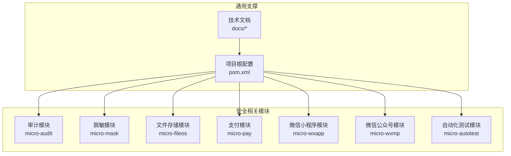
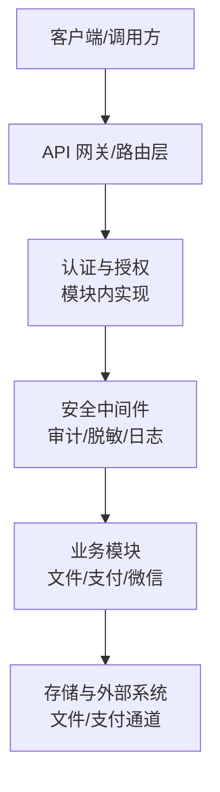
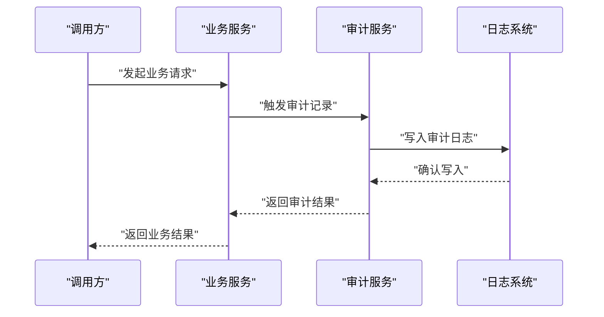
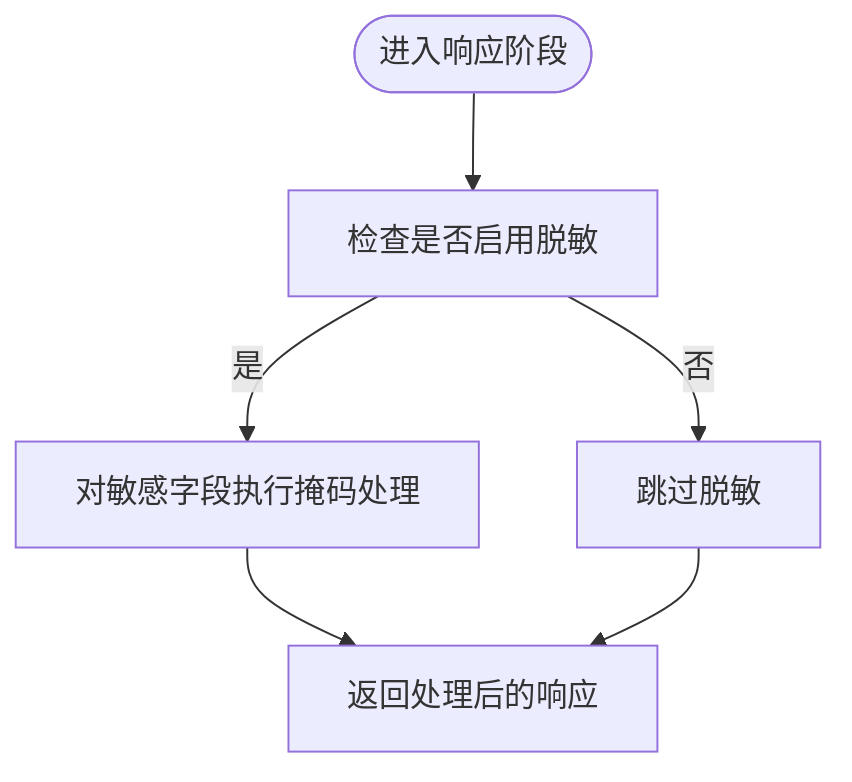
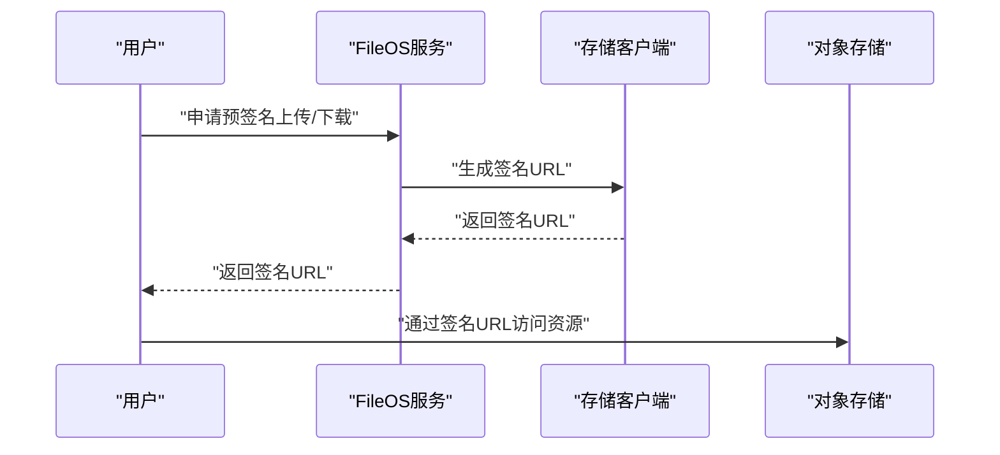
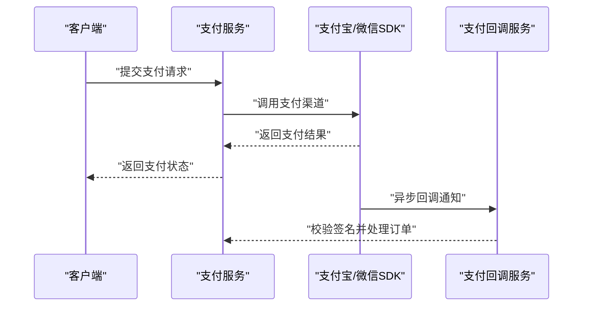
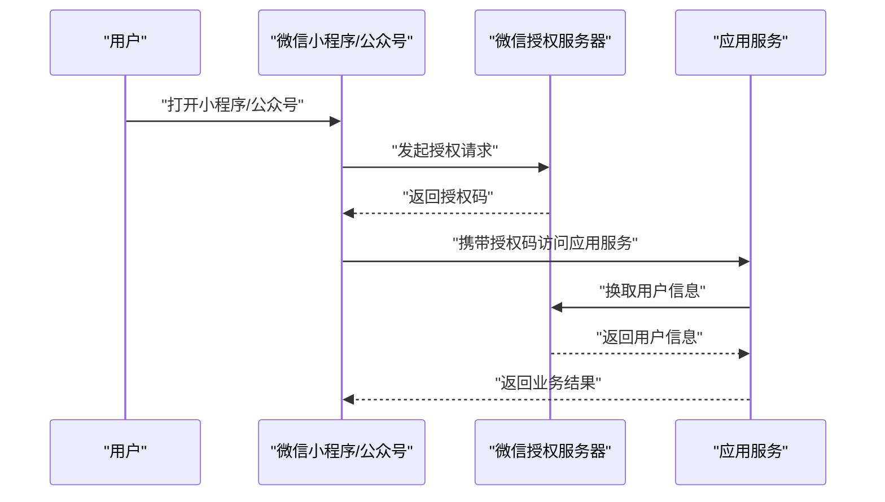
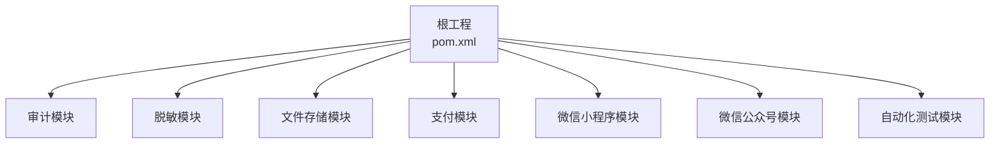

# 安全架构设计

<cite>
**本文档引用的文件**
- [pom.xml](file://pom.xml)
- [README.md](file://README.md)
- [CONTEXT.md](file://CONTEXT.md)
- [AGENTS.md](file://AGENTS.md)
- [docs/living-docs-technical/architecture/deployment.md](file://docs/living-docs-technical/architecture/deployment.md)
- [docs/living-docs-technical/architecture/overview.md](file://docs/living-docs-technical/architecture/overview.md)
- [docs/standards/logging.md](file://docs/standards/logging.md)
- [docs/risk-analysis.md](file://docs/risk-analysis.md)
- [micro-audit/src/main/java/com/wkclz/micro/audit/AuditAutoConfig.java](file://micro-audit/src/main/java/com/wkclz/micro/audit/AuditAutoConfig.java)
- [micro-audit/src/main/resources/META-INF/spring/org.springframework.boot.autoconfigure.AutoConfiguration.imports](file://micro-audit/src/main/resources/META-INF/spring/org.springframework.boot.autoconfigure.AutoConfiguration.imports)
- [micro-mask/src/main/java/com/wkclz/micro/mask/MaskAutoConfig.java](file://micro-mask/src/main/java/com/wkclz/micro/mask/MaskAutoConfig.java)
- [micro-mask/src/main/java/com/wkclz/micro/mask/config/MaskResponseAdvice.java](file://micro-mask/src/main/java/com/wkclz/micro/mask/config/MaskResponseAdvice.java)
- [micro-fileos/src/main/java/com/wkclz/micro/fileos/FileosAutoConfig.java](file://micro-fileos/src/main/java/com/wkclz/micro/fileos/FileosAutoConfig.java)
- [micro-fileos/src/main/java/com/wkclz/micro/fileos/config/FileosConfig.java](file://micro-fileos/src/main/java/com/wkclz/micro/fileos/config/FileosConfig.java)
- [micro-fileos/src/main/java/com/wkclz/micro/fileos/utils/OssUtil.java](file://micro-fileos/src/main/java/com/wkclz/micro/fileos/utils/OssUtil.java)
- [micro-pay/src/main/java/com/wkclz/micro/pay/PayAutoConfig.java](file://micro-pay/src/main/java/com/wkclz/micro/pay/PayAutoConfig.java)
- [micro-pay/src/main/java/com/wkclz/micro/pay/config/PayConfig.java](file://micro-pay/src/main/java/com/wkclz/micro/pay/config/PayConfig.java)
- [micro-pay/src/main/java/com/wkclz/micro/pay/helper/AlipayHelper.java](file://micro-pay/src/main/java/com/wkclz/micro/pay/helper/AlipayHelper.java)
- [micro-pay/src/main/java/com/wkclz/micro/pay/helper/WxpayHelper.java](file://micro-pay/src/main/java/com/wkclz/micro/pay/helper/WxpayHelper.java)
- [micro-wxapp/src/main/java/com/wkclz/micro/wxapp/MicroAppAutoConfig.java](file://micro-wxapp/src/main/java/com/wkclz/micro/wxapp/MicroAppAutoConfig.java)
- [micro-wxmp/src/main/java/com/wkclz/micro/wxmp/MicroAppAutoConfig.java](file://micro-wxmp/src/main/java/com/wkclz/micro/wxmp/MicroAppAutoConfig.java)
- [micro-autotest/src/main/java/com/wkclz/auto/AutoTestAutoConfig.java](file://micro-autotest/src/main/java/com/wkclz/auto/AutoTestAutoConfig.java)
- [micro-autotest/src/main/resources/META-INF/spring/org.springframework.boot.autoconfigure.AutoConfiguration.imports](file://micro-autotest/src/main/resources/META-INF/spring/org.springframework.boot.autoconfigure.AutoConfiguration.imports)
</cite>

## 目录
1. [引言](#引言)
2. [项目结构](#项目结构)
3. [核心组件](#核心组件)
4. [架构总览](#架构总览)
5. [详细组件分析](#详细组件分析)
6. [依赖关系分析](#依赖关系分析)
7. [性能考虑](#性能考虑)
8. [故障排除指南](#故障排除指南)
9. [结论](#结论)
10. [附录](#附录)

## 引言
本文件面向 sh-microapp 的安全架构设计，聚焦于身份认证、授权控制、数据加密、JWT 令牌管理、OAuth2 集成、API 密钥保护、防重放攻击、SQL 注入防护、XSS 防范、敏感数据脱敏、日志审计与安全事件监控等主题。由于仓库中未直接提供通用安全框架配置或集中式安全模块，本文基于现有微服务模块（如审计、脱敏、文件存储、支付、微信生态）进行安全能力映射与最佳实践建议，并结合项目文档中的风险分析与日志标准，形成可落地的安全设计蓝图。

## 项目结构
项目采用多模块微服务架构，每个功能域独立封装为模块，通过 Spring Boot 自动装配机制加载。安全相关能力在各模块内以“自动配置 + 组件”的方式体现，例如审计、脱敏、文件存储、支付、微信应用等模块均包含对应的自动配置类与资源配置。

**图表来源**
- [pom.xml](file://pom.xml)
- [docs/living-docs-technical/architecture/overview.md](file://docs/living-docs-technical/architecture/overview.md)

**章节来源**
- [pom.xml](file://pom.xml)
- [docs/living-docs-technical/architecture/overview.md](file://docs/living-docs-technical/architecture/overview.md)

## 核心组件
- 审计模块：提供变更审计日志能力，支持对关键业务对象的变更记录与合规校验，是安全事件监控与追踪的基础。
- 脱敏模块：提供响应数据脱敏能力，通过统一的响应增强器对敏感字段进行掩码处理，降低敏感信息泄露风险。
- 文件存储模块：提供文件签名下载、预签名上传等功能，结合后端配置实现访问控制与加密传输。
- 支付模块：集成第三方支付渠道，包含配置与工具类，涉及敏感支付参数与回调处理，需严格的安全控制。
- 微信生态模块：小程序与公众号接入，涉及 OAuth2 授权流程与用户信息保护。
- 自动化测试模块：提供接口测试与报告生成功能，有助于安全回归与渗透测试验证。

**章节来源**
- [micro-audit/src/main/java/com/wkclz/micro/audit/AuditAutoConfig.java](file://micro-audit/src/main/java/com/wkclz/micro/audit/AuditAutoConfig.java)
- [micro-mask/src/main/java/com/wkclz/micro/mask/MaskAutoConfig.java](file://micro-mask/src/main/java/com/wkclz/micro/mask/MaskAutoConfig.java)
- [micro-fileos/src/main/java/com/wkclz/micro/fileos/FileosAutoConfig.java](file://micro-fileos/src/main/java/com/wkclz/micro/fileos/FileosAutoConfig.java)
- [micro-pay/src/main/java/com/wkclz/micro/pay/PayAutoConfig.java](file://micro-pay/src/main/java/com/wkclz/micro/pay/PayAutoConfig.java)
- [micro-wxapp/src/main/java/com/wkclz/micro/wxapp/MicroAppAutoConfig.java](file://micro-wxapp/src/main/java/com/wkclz/micro/wxapp/MicroAppAutoConfig.java)
- [micro-wxmp/src/main/java/com/wkclz/micro/wxmp/MicroAppAutoConfig.java](file://micro-wxmp/src/main/java/com/wkclz/micro/wxmp/MicroAppAutoConfig.java)
- [micro-autotest/src/main/java/com/wkclz/auto/AutoTestAutoConfig.java](file://micro-autotest/src/main/java/com/wkclz/auto/AutoTestAutoConfig.java)

## 架构总览
下图展示了安全能力在系统中的分布与交互关系，强调从入口到数据处理再到输出的全链路安全控制点。

[此图为概念性架构示意，不直接映射具体源码文件，故无图表来源]

## 详细组件分析

### 审计模块（变更审计日志）
- 自动配置：模块通过自动配置类加载审计相关组件，确保在应用启动时启用审计能力。
- 日志记录：对关键实体的变更进行记录，便于后续合规检查与安全事件回溯。
- 合规校验：配合删除合规校验流程，保障数据生命周期的合规性。

**图表来源**
- [micro-audit/src/main/java/com/wkclz/micro/audit/AuditAutoConfig.java](file://micro-audit/src/main/java/com/wkclz/micro/audit/AuditAutoConfig.java)
- [docs/stories/审计校验/README.md](file://docs/stories/审计校验/README.md)

**章节来源**
- [micro-audit/src/main/java/com/wkclz/micro/audit/AuditAutoConfig.java](file://micro-audit/src/main/java/com/wkclz/micro/audit/AuditAutoConfig.java)
- [docs/stories/审计校验/README.md](file://docs/stories/审计校验/README.md)

### 敏感数据脱敏（Mask）
- 自动配置：模块通过自动配置类启用脱敏能力。
- 响应增强：通过统一的响应增强器对敏感字段进行掩码处理，减少敏感信息在响应中的暴露面。
- 规则管理：支持规则化配置，便于按场景灵活调整脱敏策略。

**图表来源**
- [micro-mask/src/main/java/com/wkclz/micro/mask/MaskAutoConfig.java](file://micro-mask/src/main/java/com/wkclz/micro/mask/MaskAutoConfig.java)
- [micro-mask/src/main/java/com/wkclz/micro/mask/config/MaskResponseAdvice.java](file://micro-mask/src/main/java/com/wkclz/micro/mask/config/MaskResponseAdvice.java)

**章节来源**
- [micro-mask/src/main/java/com/wkclz/micro/mask/MaskAutoConfig.java](file://micro-mask/src/main/java/com/wkclz/micro/mask/MaskAutoConfig.java)
- [micro-mask/src/main/java/com/wkclz/micro/mask/config/MaskResponseAdvice.java](file://micro-mask/src/main/java/com/wkclz/micro/mask/config/MaskResponseAdvice.java)

### 文件存储与签名下载（FileOS）
- 预签名上传/签名下载：通过后端生成签名链接，限制访问范围与有效期，降低直接暴露存储凭证的风险。
- 配置管理：集中配置存储桶、目录与签名策略，便于统一治理。
- 多租户隔离：通过路径与权限控制实现多租户资源隔离。

**图表来源**
- [micro-fileos/src/main/java/com/wkclz/micro/fileos/FileosAutoConfig.java](file://micro-fileos/src/main/java/com/wkclz/micro/fileos/FileosAutoConfig.java)
- [micro-fileos/src/main/java/com/wkclz/micro/fileos/config/FileosConfig.java](file://micro-fileos/src/main/java/com/wkclz/micro/fileos/config/FileosConfig.java)
- [micro-fileos/src/main/java/com/wkclz/micro/fileos/utils/OssUtil.java](file://micro-fileos/src/main/java/com/wkclz/micro/fileos/utils/OssUtil.java)

**章节来源**
- [micro-fileos/src/main/java/com/wkclz/micro/fileos/FileosAutoConfig.java](file://micro-fileos/src/main/java/com/wkclz/micro/fileos/FileosAutoConfig.java)
- [micro-fileos/src/main/java/com/wkclz/micro/fileos/config/FileosConfig.java](file://micro-fileos/src/main/java/com/wkclz/micro/fileos/config/FileosConfig.java)
- [micro-fileos/src/main/java/com/wkclz/micro/fileos/utils/OssUtil.java](file://micro-fileos/src/main/java/com/wkclz/micro/fileos/utils/OssUtil.java)

### 支付模块（Alipay/Wxpay）
- 配置管理：集中管理支付渠道的配置与密钥缓存，避免硬编码与分散配置带来的风险。
- 回调处理：提供支付回调 SPI，确保回调来源校验与幂等处理。
- 参数加密：对敏感支付参数进行加密存储与传输，结合签名算法保证完整性。

**图表来源**
- [micro-pay/src/main/java/com/wkclz/micro/pay/PayAutoConfig.java](file://micro-pay/src/main/java/com/wkclz/micro/pay/PayAutoConfig.java)
- [micro-pay/src/main/java/com/wkclz/micro/pay/config/PayConfig.java](file://micro-pay/src/main/java/com/wkclz/micro/pay/config/PayConfig.java)
- [micro-pay/src/main/java/com/wkclz/micro/pay/helper/AlipayHelper.java](file://micro-pay/src/main/java/com/wkclz/micro/pay/helper/AlipayHelper.java)
- [micro-pay/src/main/java/com/wkclz/micro/pay/helper/WxpayHelper.java](file://micro-pay/src/main/java/com/wkclz/micro/pay/helper/WxpayHelper.java)

**章节来源**
- [micro-pay/src/main/java/com/wkclz/micro/pay/PayAutoConfig.java](file://micro-pay/src/main/java/com/wkclz/micro/pay/PayAutoConfig.java)
- [micro-pay/src/main/java/com/wkclz/micro/pay/config/PayConfig.java](file://micro-pay/src/main/java/com/wkclz/micro/pay/config/PayConfig.java)
- [micro-pay/src/main/java/com/wkclz/micro/pay/helper/AlipayHelper.java](file://micro-pay/src/main/java/com/wkclz/micro/pay/helper/AlipayHelper.java)
- [micro-pay/src/main/java/com/wkclz/micro/pay/helper/WxpayHelper.java](file://micro-pay/src/main/java/com/wkclz/micro/pay/helper/WxpayHelper.java)

### 微信生态（小程序与公众号）
- OAuth2 授权：通过微信授权流程获取用户授权与基础信息，严格校验回调参数与来源。
- 用户信息保护：对获取的用户信息进行最小化收集与必要时的脱敏处理。
- 会话与票据：妥善管理授权票据与会话，防止泄露与滥用。

**图表来源**
- [micro-wxapp/src/main/java/com/wkclz/micro/wxapp/MicroAppAutoConfig.java](file://micro-wxapp/src/main/java/com/wkclz/micro/wxapp/MicroAppAutoConfig.java)
- [micro-wxmp/src/main/java/com/wkclz/micro/wxmp/MicroAppAutoConfig.java](file://micro-wxmp/src/main/java/com/wkclz/micro/wxmp/MicroAppAutoConfig.java)

**章节来源**
- [micro-wxapp/src/main/java/com/wkclz/micro/wxapp/MicroAppAutoConfig.java](file://micro-wxapp/src/main/java/com/wkclz/micro/wxapp/MicroAppAutoConfig.java)
- [micro-wxmp/src/main/java/com/wkclz/micro/wxmp/MicroAppAutoConfig.java](file://micro-wxmp/src/main/java/com/wkclz/micro/wxmp/MicroAppAutoConfig.java)

### 自动化测试（安全回归）
- 接口测试：覆盖关键业务接口，验证安全控制点（鉴权、参数校验、异常处理）。
- 报告生成：输出测试报告，辅助安全问题定位与修复闭环。

**章节来源**
- [micro-autotest/src/main/java/com/wkclz/auto/AutoTestAutoConfig.java](file://micro-autotest/src/main/java/com/wkclz/auto/AutoTestAutoConfig.java)

## 依赖关系分析
- 模块耦合：各安全相关模块以独立模块形式存在，通过自动配置机制被主工程加载，降低模块间耦合度。
- 外部依赖：支付模块依赖第三方 SDK；文件存储模块依赖对象存储服务；微信模块依赖微信开放平台。
- 风险点：集中式安全策略缺失，需在网关层或统一中间件层补充通用安全控制（如 JWT、OAuth2、API Key、防重放、SQL 注入、XSS 等）。

**图表来源**
- [pom.xml](file://pom.xml)

**章节来源**
- [pom.xml](file://pom.xml)

## 性能考虑
- 脱敏与审计的开销：在高并发场景下，脱敏与审计可能带来额外 CPU 与 IO 开销，建议通过异步落盘与批量写入优化。
- 文件签名：预签名链接应设置合理有效期与访问频率限制，避免频繁生成签名导致的性能压力。
- 支付回调：回调处理应幂等化与异步化，避免阻塞主业务线程。
- 日志：审计日志与安全日志应分级存储与轮转，避免磁盘 IO 抖动。

[本节为通用性能建议，不直接分析具体文件，故无章节来源]

## 故障排除指南
- 审计日志缺失：检查审计自动配置是否生效，确认日志输出目标与级别。
- 脱敏失效：确认脱敏响应增强器是否启用，核对敏感字段规则配置。
- 文件签名失败：检查签名配置与时间戳有效性，确认存储客户端凭证正确。
- 支付回调异常：核对签名算法与参数顺序，确保回调幂等处理逻辑正确。
- 微信授权失败：检查授权回调参数与来源域名白名单，确认票据时效性。

**章节来源**
- [micro-audit/src/main/java/com/wkclz/micro/audit/AuditAutoConfig.java](file://micro-audit/src/main/java/com/wkclz/micro/audit/AuditAutoConfig.java)
- [micro-mask/src/main/java/com/wkclz/micro/mask/MaskAutoConfig.java](file://micro-mask/src/main/java/com/wkclz/micro/mask/MaskAutoConfig.java)
- [micro-fileos/src/main/java/com/wkclz/micro/fileos/config/FileosConfig.java](file://micro-fileos/src/main/java/com/wkclz/micro/fileos/config/FileosConfig.java)
- [micro-pay/src/main/java/com/wkclz/micro/pay/helper/AlipayHelper.java](file://micro-pay/src/main/java/com/wkclz/micro/pay/helper/AlipayHelper.java)
- [micro-wxapp/src/main/java/com/wkclz/micro/wxapp/MicroAppAutoConfig.java](file://micro-wxapp/src/main/java/com/wkclz/micro/wxapp/MicroAppAutoConfig.java)

## 结论
当前仓库在各功能模块内实现了基础的安全能力（审计、脱敏、文件签名、支付回调、微信授权），但缺乏统一的集中式安全框架。建议在网关层或统一中间件层引入通用安全控制（JWT/OAuth2/API Key、防重放、SQL 注入/XSS 防护、敏感数据脱敏策略、日志审计与事件监控），并与现有模块协同工作，形成完整的安全架构闭环。

[本节为总结性内容，不直接分析具体文件，故无章节来源]

## 附录

### 安全配置最佳实践
- 认证与授权
  - 在网关层统一接入 JWT/OAuth2，模块内仅做细粒度授权校验。
  - 对外暴露的 API 必须强制认证，内部服务间通信可采用双向 TLS 或服务网格。
- 数据加密
  - 敏感字段在数据库层面启用透明加密（TDE），传输层强制 TLS。
  - 支付参数与回调签名必须使用强摘要算法与随机盐值。
- API 密钥保护
  - 使用一次性或短期有效的 API Key，定期轮换；存储在受控密钥管理系统中。
- 防重放攻击
  - 请求中加入时间戳与随机 nonce，服务端校验窗口期与去重表。
- SQL 注入防护
  - 全面使用参数化查询与 ORM 映射，禁止动态拼接 SQL；对输入进行白名单校验。
- XSS 防范
  - 对输出进行 HTML 转义与上下文感知编码；前端使用 CSP 与安全头。
- 敏感数据脱敏
  - 建立统一脱敏规则库，按字段与场景分类；对日志与导出数据同样适用。
- 日志审计与事件监控
  - 审计日志与安全事件日志分离存储，设置告警阈值与联动处置。
- 合规与隐私
  - 遵循数据最小化原则，明确数据处理目的与期限；提供数据主体权利实现路径。

### 漏洞扫描与渗透测试指南
- 工具与流程
  - 使用自动化扫描工具（如 SAST/BASELINE、DAST）与人工渗透测试相结合。
  - 对支付、文件、微信等高风险接口进行专项测试。
- 回归与演练
  - 将安全测试纳入 CI/CD 流水线，定期开展红蓝对抗演练。

### 安全文档与标准
- 参考项目文档中的日志标准与风险分析，结合本文件的最佳实践完善安全体系。

**章节来源**
- [docs/standards/logging.md](file://docs/standards/logging.md)
- [docs/risk-analysis.md](file://docs/risk-analysis.md)